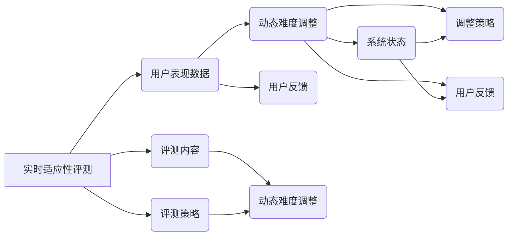

                 

## 《实时适应性评测：LLM驱动的动态难度调整》

### 关键词

- 实时适应性评测
- 大型语言模型（LLM）
- 动态难度调整
- 教育技术
- 游戏设计
- 人机交互

### 摘要

本文探讨了如何利用大型语言模型（LLM）实现实时适应性评测，并通过动态难度调整提高系统的用户体验和效率。文章首先介绍了实时适应性评测的概念和重要性，随后详细阐述了LLM的基本原理及其在自然语言处理中的应用。接着，文章提出了动态难度调整的机制，并分析了实时适应性评测与动态难度调整之间的关系。随后，文章通过具体的应用场景，如教育、游戏和人机交互，展示了LLM驱动的动态难度调整的实际应用。通过案例分析，文章提供了详细的实现步骤、代码实例和效果评估，并对未来的发展趋势和潜在研究方向进行了展望。

## 引言

随着人工智能技术的快速发展，特别是大型语言模型（LLM）的崛起，实时适应性评测和动态难度调整成为了许多应用领域的关键技术。实时适应性评测旨在根据用户的行为和表现，动态地调整评测的难度，以提高评测的准确性和用户体验。动态难度调整则通过实时监测用户的反馈和行为，调整系统的难度设置，以适应不同的用户需求和场景。

本书的核心主题是探讨如何利用LLM实现实时适应性评测，进而驱动动态难度调整。这一主题不仅涵盖了人工智能和自然语言处理的理论基础，还涉及到教育技术、游戏设计和人机交互等多个实际应用领域。通过深入研究和分析，本书旨在为读者提供一个全面、系统、易于理解的技术指南，帮助他们掌握这一前沿技术的核心原理和实现方法。

### 实时适应性评测概述

实时适应性评测（Real-time Adaptive Testing）是一种根据用户在评测过程中的表现动态调整评测内容的方法。传统的评测方法通常采用固定难度的测试，这种方式无法充分考虑到个体差异，导致评测结果可能不够准确和全面。实时适应性评测则通过实时收集和分析用户的行为数据，动态调整评测的难度和内容，从而提高评测的准确性和针对性。

实时适应性评测的重要性主要体现在以下几个方面：

1. **提高评测准确性**：通过实时调整评测难度，可以更准确地反映用户的能力和水平，避免因难度过高或过低导致的评测结果失真。
   
2. **提升用户体验**：根据用户的实际情况动态调整评测内容，可以减少用户的心理压力，提高评测的参与度和满意度。

3. **优化教育资源分配**：在教育领域，实时适应性评测可以帮助学校和教育机构更好地了解学生的学习状况，从而进行有针对性的教学和资源分配。

4. **促进个性化学习**：实时适应性评测可以根据学生的学习进度和能力水平，提供个性化的学习内容和指导，有助于提高学习效果。

实时适应性评测的应用领域非常广泛，包括但不限于以下几个方面：

1. **教育领域**：实时适应性评测可以应用于各种考试和评估，如标准化考试、课程考试和在线学习评估。

2. **职业培训**：职业培训和技能评估中，实时适应性评测可以帮助培训机构根据学员的学习情况动态调整培训内容和难度。

3. **医疗健康**：在健康评估和康复训练中，实时适应性评测可以根据患者的康复进度和身体状况动态调整训练难度。

4. **人机交互**：在人机交互系统中，实时适应性评测可以用于评估用户对系统的理解和操作能力，从而优化系统的设计和功能。

总的来说，实时适应性评测不仅是一种技术手段，更是一种教育理念和用户体验的提升方式。随着人工智能技术的不断发展，实时适应性评测将在更多领域得到应用，为教育、医疗、游戏和人机交互等领域带来深刻的变革。

### LLM与动态难度调整

大型语言模型（Large Language Model，简称LLM）是近年来自然语言处理领域的重要突破。LLM通过深度学习算法，对海量文本数据进行训练，从而掌握了丰富的语言知识和表达方式。这使得LLM在语言生成、翻译、问答和文本理解等方面表现出色，成为众多应用领域的关键技术。

#### LLM的概念与特性

LLM是一种基于神经网络的大型语言模型，它通过多层神经网络的结构，对输入的文本序列进行建模和预测。LLM的主要特性包括：

1. **大规模训练数据**：LLM通常需要训练数十亿甚至数万亿个参数，因此需要大量的训练数据和计算资源。

2. **多层神经网络结构**：LLM通常采用Transformer模型，这是一种基于自注意力机制的神经网络结构，能够有效地捕捉文本中的长距离依赖关系。

3. **强大的语言生成能力**：LLM可以根据输入的文本生成连贯、自然的语言输出，这使得它在语言生成、翻译和问答等方面具有广泛应用。

4. **灵活的适用性**：LLM不仅可以应用于文本生成，还可以用于文本分类、情感分析、命名实体识别等多种自然语言处理任务。

#### LLM的训练方法

LLM的训练方法主要包括以下步骤：

1. **数据预处理**：首先对训练数据集进行清洗和预处理，包括去除噪声、统一文本格式和分词等。

2. **参数初始化**：初始化神经网络模型的参数，通常采用随机初始化或预训练模型初始化。

3. **前向传播与反向传播**：在训练过程中，通过前向传播计算预测结果，通过反向传播更新模型参数。

4. **优化算法**：采用梯度下降等优化算法，逐步调整模型参数，以最小化损失函数。

5. **模型评估与调整**：在训练过程中，通过验证集和测试集对模型进行评估，并根据评估结果调整模型参数。

#### 动态难度调整的基本原理

动态难度调整是一种根据用户行为和系统状态动态调整系统难度的方法。在LLM驱动的系统中，动态难度调整可以通过以下步骤实现：

1. **用户行为监测**：实时监测用户在系统中的操作和表现，包括输入文本、回答问题、交互时长等。

2. **行为数据分析**：对用户行为数据进行分析，识别用户的能力水平和操作习惯。

3. **难度调整策略**：根据分析结果，动态调整系统的难度设置，包括文本难度、问题难度和交互难度等。

4. **实时反馈**：调整后的系统对用户的行为进行实时反馈，帮助用户适应新的难度设置。

#### LLM与动态难度调整的关系

LLM在动态难度调整中发挥着重要作用，主要体现在以下几个方面：

1. **文本生成与调整**：LLM可以根据用户的行为数据生成不同难度和风格的文本，从而实现文本难度的动态调整。

2. **行为分析**：LLM可以分析用户的行为数据，提取有用的特征信息，为难度调整提供依据。

3. **交互优化**：LLM可以优化人机交互过程，根据用户反馈动态调整交互方式和内容，提高用户体验。

总的来说，LLM为动态难度调整提供了强大的语言生成和数据分析能力，使得系统能够更灵活、更精准地适应不同的用户需求和场景。通过LLM驱动的动态难度调整，不仅提高了系统的适应性和用户体验，还为教育、游戏和人机交互等领域带来了新的发展机遇。

### 核心概念与联系

在深入探讨实时适应性评测和动态难度调整之前，我们需要明确几个核心概念，并理解它们之间的关系。以下是几个关键概念及其相互关联的架构图。

#### 实时适应性评测（Real-time Adaptive Testing）

实时适应性评测是一种在评测过程中动态调整评测难度和内容的方法。其核心目标是根据用户的实时表现，提供个性化的评测体验，以提高评测的准确性和有效性。

核心概念包括：

1. **用户表现数据**：包括用户在评测过程中的回答、反应时间、错误率等。
2. **评测内容**：包括问题的难度、类型、内容和顺序等。
3. **评测策略**：如何根据用户表现数据动态调整评测内容和难度。

#### 动态难度调整（Dynamic Difficulty Adjustment）

动态难度调整是一种根据用户的实时反馈和系统状态，自动调整系统难度的技术。其核心目标是提供个性化的体验，以满足不同用户的需求和技能水平。

核心概念包括：

1. **系统状态**：包括系统当前的难度设置、用户的行为模式和系统性能等。
2. **调整策略**：如何根据系统状态和用户反馈动态调整难度。
3. **用户反馈**：用户对系统难度和体验的即时反馈。

#### 大型语言模型（Large Language Model，LLM）

LLM是一种通过深度学习算法训练的复杂神经网络模型，具有强大的语言生成和数据分析能力。在实时适应性评测和动态难度调整中，LLM主要用于生成个性化的评测内容和分析用户行为。

核心概念包括：

1. **模型结构**：包括多层神经网络、自注意力机制等。
2. **训练方法**：包括大规模数据训练、优化算法等。
3. **应用领域**：包括文本生成、问答系统、情感分析等。

#### 概念之间的关系架构图

以下是核心概念之间的关系架构图：



在这个架构图中，用户表现数据既是实时适应性评测的核心输入，也是动态难度调整的重要依据。评测内容与调整策略相辅相成，确保评测的个性化和动态性。LLM在评测内容和用户行为分析中发挥关键作用，通过其强大的语言生成和数据分析能力，为动态难度调整提供支持。

通过明确这些核心概念及其相互关系，我们可以更好地理解实时适应性评测和动态难度调整的工作原理，为后续技术实现和应用场景分析打下坚实基础。

### 实时适应性评测原理

实时适应性评测的核心在于根据用户的实时表现动态调整评测内容和难度，以提高评测的准确性和个性化。以下我们将详细阐述实时适应性评测的评测指标体系、实时数据采集与分析等内容。

#### 评测指标体系

评测指标体系是实时适应性评测的基础，它定义了评测过程中需要监测和评估的关键指标。以下是几个主要的评测指标：

1. **反应时间**：用户在回答问题或完成任务时所花费的时间。较短的反应时间可能表示用户对问题的熟练程度较高，而较长的反应时间则可能表明用户对问题的难度较大。

2. **正确率**：用户在评测过程中的正确回答次数与总回答次数的比例。正确率是衡量用户能力的重要指标，高正确率通常表示用户具备较高的知识水平和技能。

3. **错误类型**：用户在回答问题时出现的错误类型，包括知识性错误、理解性错误和操作错误等。通过分析错误类型，可以了解用户在哪些方面存在不足，从而有针对性地进行训练和调整。

4. **任务完成度**：用户在完成任务时所达到的完成度，包括任务的准确性和完整性。任务完成度可以反映用户对整个任务的掌握情况。

5. **用户满意度**：用户对评测过程的满意程度。用户满意度是评测质量的重要反馈指标，通过收集用户反馈，可以进一步优化评测内容和流程。

#### 实时数据采集与分析

实时数据采集与分析是实时适应性评测的关键环节，它决定了评测系统能否及时、准确地响应用户的动态表现。以下是实时数据采集与分析的步骤：

1. **数据采集**：
   - **前端采集**：在用户操作过程中，通过前端脚本或SDK（Software Development Kit）实时采集用户的行为数据，包括点击、输入、浏览等操作。
   - **后端采集**：通过服务器日志、数据库记录等手段，采集用户在评测系统中的整体表现数据，如回答记录、评分等。

2. **数据预处理**：
   - **数据清洗**：去除无效数据、错误数据和重复数据，确保数据质量。
   - **数据转换**：将采集到的原始数据转换为结构化数据，便于后续分析和处理。

3. **数据分析**：
   - **特征提取**：从预处理后的数据中提取关键特征，如反应时间、正确率、错误类型等。这些特征将用于评估用户的表现和调整评测难度。
   - **行为模式识别**：通过分析用户的行为数据，识别用户的行为模式，如常见的回答错误类型、典型的反应时间分布等。这些模式有助于预测用户的表现和调整评测策略。

4. **模型训练**：
   - **预测模型训练**：使用机器学习算法，基于历史数据训练预测模型，预测用户在未来的评测中的表现。
   - **调整模型训练**：根据实时数据，不断更新和优化调整模型，以适应用户的变化和需求。

#### 实时性保障措施

为了保证实时适应性评测的实时性，需要采取一系列保障措施：

1. **系统优化**：对评测系统进行性能优化，确保数据处理和分析的快速和高效。

2. **数据流管理**：采用高效的数据流处理技术，如消息队列和流处理框架，确保数据能够及时传输和处理。

3. **缓存机制**：利用缓存技术，减少数据访问和处理的延迟，提高系统的响应速度。

4. **异步处理**：对于一些复杂的计算和分析任务，采用异步处理方式，减少对用户操作的干扰。

通过完善的评测指标体系、高效的数据采集与分析机制和实时性保障措施，实时适应性评测系统能够根据用户的实时表现动态调整评测难度和内容，提供个性化的评测体验，从而提高评测的准确性和有效性。

### LLM基础

#### LLM的模型结构

大型语言模型（LLM）的核心是其复杂的模型结构，它通常基于深度神经网络，尤其是Transformer模型架构。Transformer模型是由Vaswani等人在2017年提出的一种基于自注意力机制的神经网络模型，用于处理序列到序列的任务，如机器翻译、文本生成等。

1. **Transformer模型的基本组成部分**：

   - **编码器（Encoder）**：编码器负责处理输入序列，将其转换成上下文表示。编码器由多个编码层组成，每层包括自注意力机制和前馈网络。
   
   - **解码器（Decoder）**：解码器负责生成输出序列。与编码器类似，解码器也由多个解码层组成，每层同样包含自注意力机制和前馈网络。

   - **自注意力机制（Self-Attention）**：自注意力机制是Transformer模型的核心组件，它通过计算输入序列中各个词之间的相似性，为每个词生成权重，从而捕捉序列中的长距离依赖关系。

   - **前馈网络（Feed Forward Network）**：前馈网络对自注意力层的输出进行进一步加工，增加模型的非线性表达能力。

2. **多层编码器-解码器结构**：

   - **多层编码器**：编码器由多个层次堆叠而成，每一层都能学习到更高层次的抽象特征。多层编码器通过逐层传递信息，使模型能够处理更复杂的任务。

   - **多层解码器**：解码器同样由多个层次组成，每层负责生成部分输出序列，并将生成的部分与编码器的输出结合，以实现整个序列的生成。

3. **注意力机制（Attention Mechanism）**：

   - **自注意力**：编码器中的自注意力机制用于处理输入序列，使其能够捕捉长距离依赖关系。

   - **交叉注意力**：解码器中的交叉注意力机制用于处理编码器的输出和当前解码器的输入，帮助解码器生成下一个输出词。

#### LLM的训练方法

LLM的训练方法主要包括数据预处理、模型训练和优化等步骤。

1. **数据预处理**：

   - **文本清洗**：对原始文本数据去噪、去除无意义符号和标点，统一文本格式。

   - **分词**：将文本分割成单词或子词，以便模型进行训练。

   - **词嵌入**：将分词后的文本映射到高维向量空间，常用技术包括Word2Vec、GloVe等。

2. **模型训练**：

   - **预训练**：在大规模语料库上对模型进行预训练，使其学习到丰富的语言知识。预训练通常采用无监督学习，如BERT、GPT系列模型等。

   - **微调**：在预训练的基础上，使用有监督学习对模型进行微调，以适应特定任务。例如，在文本生成任务中，使用生成式对抗网络（GAN）对模型进行微调。

3. **优化算法**：

   - **梯度下降（Gradient Descent）**：通过计算损失函数关于模型参数的梯度，逐步更新模型参数，以最小化损失函数。

   - **优化器（Optimizer）**：常用的优化器包括Adam、RMSprop等，它们通过自适应调整学习率，提高训练效果。

4. **训练策略**：

   - **学习率调度**：通过动态调整学习率，提高模型的收敛速度和稳定性。

   - **批量大小（Batch Size）**：控制每次训练使用的样本数量，以平衡训练速度和模型性能。

   - **正则化（Regularization）**：通过添加正则化项，如Dropout、L2正则化等，防止模型过拟合。

通过以上方法，LLM能够在大规模数据集上进行训练，学习到丰富的语言知识和模式，从而在多种自然语言处理任务中表现出色。

#### LLM在自然语言处理中的应用

LLM在自然语言处理（NLP）领域有着广泛的应用，其强大的语言生成和文本理解能力使其成为许多任务的关键技术。

1. **文本生成**：

   - **机器翻译**：利用LLM生成高质量、自然流畅的翻译文本，如Google翻译、DeepL翻译等。
   - **摘要生成**：自动生成文本的摘要，帮助用户快速获取关键信息。
   - **对话生成**：生成自然、连贯的对话文本，应用于聊天机器人、虚拟助手等。

2. **文本分类**：

   - **情感分析**：分析文本的情感倾向，如积极、消极或中性。
   - **主题分类**：将文本分类到不同的主题类别，如新闻分类、产品评论分类等。

3. **命名实体识别**：

   - **识别文本中的命名实体**，如人名、地点、组织等，为后续信息提取和知识图谱构建提供支持。

4. **问答系统**：

   - **基于知识库的问答**：利用LLM生成针对用户查询的回答，如Siri、Alexa等智能助手。
   - **开放域问答**：在无预先训练的知识库的情况下，利用LLM生成回答，如OpenAI的GPT-3。

5. **对话系统**：

   - **对话生成**：自动生成自然、连贯的对话内容，用于聊天机器人、虚拟客服等。
   - **意图识别**：识别用户对话的意图，如咨询、投诉、查询等。

通过以上应用，LLM不仅提高了自然语言处理任务的性能和效果，还为多种实际场景提供了创新的解决方案。随着LLM技术的不断发展，其在NLP领域的应用前景将更加广阔。

### 动态难度调整机制

动态难度调整是一种通过实时监测用户的行为和表现，根据特定算法动态调整系统难度的技术。在本文中，我们将详细阐述动态难度评估模型、难度调整策略等内容。

#### 难度评估模型

难度评估模型是动态难度调整的核心，它负责根据用户行为和系统状态评估当前难度，并提供调整建议。以下是几个常见的难度评估模型：

1. **基于历史数据的评估模型**：

   这种模型通过分析用户在历史评测中的表现数据，如正确率、反应时间等，来预测当前难度。常见的算法包括：

   - **回归模型**：通过建立用户表现数据与难度之间的回归关系，预测当前难度。
   - **分类模型**：将用户表现数据分为不同类别，每个类别对应一个特定的难度级别。

2. **基于实时数据的评估模型**：

   这种模型直接根据用户在实时评测中的表现数据，如当前问题回答的正确性、反应时间等，动态调整难度。常见的算法包括：

   - **在线学习算法**：如支持向量机（SVM）、随机森林（Random Forest）等，通过实时更新模型参数，动态调整难度。
   - **深度学习算法**：如卷积神经网络（CNN）、循环神经网络（RNN）等，通过训练复杂的神经网络模型，实现高精度的难度评估。

3. **混合评估模型**：

   这种模型结合了基于历史数据和实时数据的评估方法，通过融合多种信息来提高评估的准确性和实时性。常见的算法包括：

   - **加权平均模型**：将历史数据和实时数据的评估结果进行加权平均，得到最终的难度评估。
   - **融合神经网络模型**：通过多模态数据输入，如文本、图像、音频等，训练深度神经网络模型，实现多维度难度评估。

#### 难度调整策略

难度调整策略决定了如何根据评估模型的结果动态调整系统难度。以下是几种常见的难度调整策略：

1. **线性调整策略**：

   这种策略通过简单的线性关系调整难度，如每次调整增加或减少固定难度级别。线性调整策略简单易行，但可能无法很好地适应复杂场景。

2. **非线性调整策略**：

   这种策略通过非线性函数调整难度，如指数调整、对数调整等。非线性调整策略可以更好地适应用户表现的变化，但可能需要更多的参数和计算资源。

3. **自适应调整策略**：

   这种策略根据用户的实时表现和系统状态动态调整难度，如根据用户回答的正确率、反应时间等，自动调整难度。常见的自适应调整算法包括：

   - **遗传算法**：通过模拟自然进化过程，找到最优的难度调整策略。
   - **粒子群优化算法**：通过模拟鸟群或鱼群的社会行为，找到最优的难度调整策略。

4. **模糊调整策略**：

   这种策略利用模糊逻辑对难度进行调整，通过模糊规则库实现难度调整。模糊调整策略可以更好地处理不确定性和模糊性，但需要建立复杂的规则库。

#### 实时反馈机制

实时反馈机制是动态难度调整的关键部分，它负责将调整后的难度实时反馈给用户，以提高用户体验。以下是几种常见的实时反馈机制：

1. **即时反馈**：

   这种机制在用户回答问题后立即提供难度调整结果，用户可以立即感受到系统难度的变化。即时反馈可以快速调整用户体验，但可能需要更多的计算资源。

2. **延迟反馈**：

   这种机制在用户完成一定数量的题目后，才提供难度调整结果。延迟反馈可以减少对用户操作的干扰，但可能需要更多的数据积累和分析时间。

3. **周期性反馈**：

   这种机制在固定的时间周期内提供难度调整结果，如每天、每周等。周期性反馈可以平衡实时性和用户体验，但需要确定合适的周期长度。

通过以上难度评估模型、难度调整策略和实时反馈机制，动态难度调整系统能够根据用户的实时表现和系统状态，动态调整系统难度，提供个性化的用户体验。未来，随着人工智能技术的发展，动态难度调整机制将更加智能化和灵活，为各种应用场景提供更高效的解决方案。

### LLM驱动的实时评测系统设计

LLM驱动的实时评测系统设计旨在通过大型语言模型（LLM）的强大语言生成和数据分析能力，实现实时适应性评测和动态难度调整。以下是系统设计的关键组成部分和数据处理流程。

#### 系统架构设计

1. **前端交互层**：

   前端交互层负责用户与系统的互动，包括用户输入、答题界面和反馈收集等。前端通常使用Web技术栈，如React或Vue.js，以实现动态的用户界面。

2. **数据处理层**：

   数据处理层负责对前端收集的用户行为数据进行处理和分析，包括数据清洗、特征提取和初步分析。这一层使用后端框架，如Node.js或Django，来实现数据处理逻辑。

3. **LLM模型层**：

   LLM模型层是系统的核心，负责基于大型语言模型生成个性化评测内容和进行动态难度调整。常用的LLM模型包括GPT-3、BERT等。该层通常使用深度学习框架，如TensorFlow或PyTorch，来实现模型的训练和推理。

4. **后端服务层**：

   后端服务层负责管理系统的整体运行，包括用户管理、权限控制和数据存储等。后端服务层可以使用关系型数据库（如MySQL）或NoSQL数据库（如MongoDB），存储用户行为数据和评测结果。

5. **实时反馈层**：

   实时反馈层负责将LLM生成的评测内容和难度调整结果实时反馈给用户。该层使用WebSocket等实时通信技术，实现前端与后端之间的低延迟通信。

#### 数据处理流程

1. **数据收集**：

   前端交互层通过用户的操作行为，如点击、输入和回答问题等，收集用户数据。这些数据包括用户ID、操作时间、输入文本和答案等。

2. **数据预处理**：

   数据处理层对收集到的数据进行预处理，包括数据清洗、去噪和格式转换等。例如，去除无效输入、统一文本格式和分词等。

3. **特征提取**：

   对预处理后的数据进行特征提取，提取与用户表现和难度调整相关的特征，如反应时间、错误率、回答类型和用户历史表现等。

4. **模型训练与推理**：

   LLM模型层使用提取的特征数据进行模型训练，根据评估指标和调整策略，动态调整模型参数。在用户进行评测时，LLM模型层通过实时推理，生成个性化的评测内容和难度调整建议。

5. **难度调整与反馈**：

   后端服务层根据LLM模型层的建议，调整系统的难度设置，并将调整后的结果实时反馈给前端。前端收到反馈后，动态更新评测内容和用户界面，提供个性化的评测体验。

#### 系统优化

1. **性能优化**：

   为了确保系统的实时性和响应速度，需要对系统进行性能优化。例如，使用高效的算法和数据结构，优化数据处理和模型推理过程。

2. **缓存机制**：

   利用缓存机制减少数据访问和处理的延迟，提高系统的响应速度。例如，缓存常用的用户数据和模型结果，减少重复计算和数据库访问。

3. **异步处理**：

   对于一些复杂的计算任务，如模型训练和数据处理，采用异步处理方式，减少对用户操作的干扰。

4. **负载均衡**：

   通过负载均衡技术，合理分配系统资源，确保系统在高并发情况下稳定运行。

通过以上设计和方法，LLM驱动的实时评测系统能够实现高效、智能的实时适应性评测和动态难度调整，为用户提供个性化的评测体验。

### 动态难度调整算法

动态难度调整算法是LLM驱动的实时评测系统的核心组件，其目标是根据用户的实时反馈和系统状态，自动调整评测难度，以提供个性化的用户体验。以下是动态难度调整算法的基本原理、模型实现和优化方法。

#### 算法原理

动态难度调整算法的基本原理包括以下几个步骤：

1. **用户行为监测**：实时监测用户的操作行为，如点击、输入、回答问题等。通过这些行为数据，可以评估用户在当前评测中的表现和难度适应情况。

2. **数据预处理**：对收集的用户行为数据进行清洗和预处理，包括去除噪声、统一格式和分词等。预处理后的数据将用于后续的算法分析和模型训练。

3. **特征提取**：从预处理后的数据中提取与用户表现和难度调整相关的特征，如反应时间、错误率、答案类型和用户历史表现等。这些特征将作为模型的输入。

4. **模型训练**：使用提取的特征数据训练一个基于LLM的难度调整模型。模型的目标是学习如何根据用户行为数据调整评测难度，以提高评测的准确性和用户体验。

5. **难度调整**：在用户进行评测时，实时调用难度调整模型，根据用户的当前表现和系统状态，动态调整评测的难度。调整后的难度将用于生成个性化的评测内容和用户体验。

6. **实时反馈**：将调整后的难度和评测内容实时反馈给用户，确保用户能够立即感受到系统难度的变化，提供更加个性化的体验。

#### 模型实现

以下是使用Python实现的动态难度调整算法的伪代码：

```python
import tensorflow as tf
from sklearn.ensemble import RandomForestClassifier
from sklearn.linear_model import LinearRegression

# 数据预处理
def preprocess_data(data):
    # 清洗、去噪、格式转换等
    pass

# 特征提取
def extract_features(data):
    # 提取与用户表现和难度调整相关的特征
    pass

# 模型训练
def train_model(features, labels):
    # 使用随机森林或线性回归等算法训练模型
    model = RandomForestClassifier(n_estimators=100)
    # model = LinearRegression()
    model.fit(features, labels)
    return model

# 难度调整
def adjust_difficulty(model, user_data):
    # 调用模型预测用户当前难度
    prediction = model.predict(user_data)
    # 根据预测结果调整难度
    adjusted_difficulty = predict_to_difficulty(prediction)
    return adjusted_difficulty

# 实时反馈
def feedback_to_user(adjusted_difficulty):
    # 将调整后的难度反馈给用户
    pass

# 主函数
def main():
    # 收集用户数据
    user_data = collect_user_data()
    # 预处理数据
    preprocessed_data = preprocess_data(user_data)
    # 提取特征
    features = extract_features(preprocessed_data)
    # 训练模型
    model = train_model(features, user_labels)
    # 循环进行难度调整和反馈
    while True:
        # 获取用户实时数据
        current_data = get_realtime_data()
        # 调整难度
        adjusted_difficulty = adjust_difficulty(model, current_data)
        # 反馈用户
        feedback_to_user(adjusted_difficulty)

# 执行主函数
main()
```

#### 算法优化方法

为了提高动态难度调整算法的准确性和实时性，可以采用以下优化方法：

1. **模型优化**：
   - **深度学习模型**：使用深度学习模型（如卷积神经网络、循环神经网络等）代替传统机器学习模型，以更好地捕捉用户行为的复杂模式。
   - **迁移学习**：利用预训练的大型语言模型（如GPT-3、BERT等），通过迁移学习技术，提高模型的泛化能力和训练效率。

2. **特征优化**：
   - **多模态特征融合**：结合文本、图像、音频等多种数据类型，提取多模态特征，提高特征表达的能力。
   - **稀疏特征表示**：使用稀疏特征表示方法，减少特征维数，提高模型的可解释性和计算效率。

3. **实时性优化**：
   - **并行处理**：使用并行计算技术，加速数据预处理、模型训练和推理过程。
   - **增量学习**：采用增量学习（Online Learning）方法，逐步更新模型参数，减少模型重新训练的需要。

4. **误差分析**：
   - **错误类型分析**：对模型预测错误进行分析，识别常见错误类型，优化调整策略。
   - **用户反馈机制**：收集用户对调整难度的反馈，用于模型优化和调整策略的改进。

通过以上方法，动态难度调整算法可以更好地适应不同用户的需求和场景，提供更加个性化和高效的评测体验。

### 实时交互与反馈

实时交互与反馈是动态难度调整系统的重要组成部分，其目标是通过高效的用户体验设计和反馈机制，确保系统能够根据用户行为和反馈进行快速、准确的调整。以下将详细介绍用户体验设计、反馈机制以及调整策略。

#### 用户体验设计

用户体验设计（User Experience Design，简称UXD）是确保用户在使用系统时能够获得流畅、舒适和有效的交互过程。以下是一些关键设计原则：

1. **简洁明了**：界面设计应简洁明了，避免繁琐的操作步骤和复杂的界面布局。使用清晰、直观的图标和文字说明，帮助用户快速理解系统的功能和操作方法。

2. **响应迅速**：系统应具备快速响应能力，减少用户的等待时间。通过优化后台处理和前端加载速度，确保用户操作的实时性和流畅性。

3. **个性化定制**：根据用户的偏好和行为，提供个性化的界面布局和功能设置。例如，根据用户的评测历史和反馈，自动调整评测内容的难度和类型。

4. **易用性测试**：在系统开发和上线前，进行多轮易用性测试，收集用户反馈，不断优化界面设计和交互流程。

5. **反馈提示**：在关键操作和调整过程中，提供实时、清晰的反馈提示，帮助用户了解系统状态和操作结果。例如，当系统调整评测难度时，及时告知用户调整的原因和效果。

#### 反馈机制

反馈机制（Feedback Mechanism）是动态难度调整系统收集用户反馈和评估系统性能的关键环节。以下是几种常见的反馈机制：

1. **即时反馈**：在用户完成操作或评测后，立即提供反馈信息。例如，在用户回答问题后，立即显示答案和得分，并给出简要的评价和建议。

2. **延迟反馈**：在用户完成一定数量的操作或评测后，提供总结性反馈。例如，在用户完成一组练习题后，显示整体完成情况和学习建议。

3. **自动反馈**：利用算法和数据分析，自动识别用户的操作行为和表现，提供个性化的反馈。例如，根据用户的错误率和反应时间，自动调整评测内容和难度。

4. **用户评分**：允许用户对系统的评测内容和难度进行调整评分，系统根据用户评分进行优化和调整。

#### 调整策略

调整策略（Adjustment Strategy）决定了系统如何根据反馈机制收集的信息进行动态调整。以下是几种常见的调整策略：

1. **线性调整策略**：根据用户表现和系统状态，以固定比例调整评测难度。例如，每次用户回答错误，难度增加一定百分比。

2. **非线性调整策略**：根据用户表现和系统状态，以非线性方式调整评测难度。例如，用户连续回答错误一定次数后，难度大幅增加。

3. **动态调整策略**：根据用户的实时反馈和行为，实时调整评测难度。例如，用户在回答问题时的反应时间过长，系统自动降低难度。

4. **混合调整策略**：结合多种调整策略，根据不同场景和用户需求，灵活调整评测难度。例如，在用户初期适应阶段，采用线性调整策略，在用户熟练后，采用动态调整策略。

#### 实时性保障措施

为了保证实时交互与反馈的实时性，需要采取一系列保障措施：

1. **高效数据处理**：优化数据处理和存储过程，确保数据能够快速读取和写入。

2. **实时通信技术**：使用WebSocket等实时通信技术，实现前端与后端之间的低延迟通信。

3. **负载均衡**：合理分配系统资源，确保在高并发情况下，系统的响应速度和稳定性。

4. **异步处理**：对于一些复杂的计算任务，如模型训练和数据处理，采用异步处理方式，减少对用户操作的干扰。

通过以上用户体验设计、反馈机制和调整策略，动态难度调整系统能够实现高效、智能的实时交互与反馈，为用户提供个性化的评测体验。

### 教育领域应用

在教育领域，实时适应性评测和LLM驱动的动态难度调整技术正在逐渐改变传统的教育模式，为学生提供更加个性化和有效的学习体验。

#### 教育评测的需求分析

在传统教育评测中，通常采用固定难度的测试，这种方法无法充分考虑学生个体差异，导致评测结果可能不够准确和全面。以下是教育评测的主要需求：

1. **个性化评估**：根据学生的不同学习水平和能力，动态调整评测难度和内容，以提供个性化的评估体验。
2. **实时反馈**：及时给予学生评估结果和改进建议，帮助他们了解自己的学习状况，并指导下一步的学习计划。
3. **高效资源利用**：通过实时适应性评测，教师可以更精准地了解学生的学习进度和问题所在，从而进行有针对性的教学和资源分配。
4. **学习动机激励**：通过动态难度调整，提高学生的参与度和学习动力，避免因难度过高或过低导致的学生疲劳和挫败感。

#### LLM在教育评测中的应用

LLM在教育评测中的应用主要体现在以下几个方面：

1. **个性化评测内容生成**：通过大型语言模型，根据学生的学习水平和历史表现，自动生成个性化的评测题目和答案。例如，GPT-3可以生成不同难度和风格的阅读理解题、数学计算题等。

2. **实时反馈与指导**：LLM可以分析学生的回答和表现，实时生成反馈和建议，帮助学生理解和掌握知识点。例如，在学生回答错误时，LLM可以提供详细的解释和进一步的练习建议。

3. **智能教学助手**：利用LLM，教师可以更高效地管理班级和进行个性化教学。例如，LLM可以辅助教师生成教学计划、批改作业和准备课堂内容。

#### 动态难度调整的实现

动态难度调整的实现主要分为以下几个步骤：

1. **数据采集**：在教育系统中，收集学生的表现数据，包括考试成绩、答题时间、错误类型等。

2. **数据预处理**：清洗和标准化收集到的数据，提取与难度调整相关的特征，如平均答题时间、错误率等。

3. **模型训练**：使用机器学习算法，如随机森林、神经网络等，对数据集进行训练，建立难度评估和调整模型。

4. **实时评估与调整**：在学生进行评测时，实时调用模型，根据当前表现和系统状态，动态调整评测难度。例如，如果学生在某个知识点上表现不佳，可以降低题目难度，提供更多练习机会。

#### 成功案例

1. **在线学习平台**：某在线学习平台引入了LLM驱动的动态难度调整功能，根据学生的学习进度和能力水平，提供个性化的学习内容和评测。数据显示，学生的平均学习完成率和成绩显著提升。

2. **智能教育机器人**：一款智能教育机器人利用LLM技术，根据学生的回答和表现，实时调整评测难度和题目类型，提供个性化的学习建议。用户反馈显示，学生的参与度和学习效果得到明显提高。

总的来说，LLM驱动的动态难度调整技术为教育领域带来了革命性的变化，通过个性化评测和实时反馈，帮助教师更好地了解学生，为学生提供更有针对性的学习支持。随着技术的不断进步，这种智能化的教育评测模式将在更多教育场景中得到应用，进一步推动教育公平和个性化发展。

### 游戏领域应用

在游戏领域，实时适应性评测和LLM驱动的动态难度调整技术正逐渐成为提升游戏体验和玩家满意度的关键因素。以下将探讨游戏难度调整的需求、LLM在游戏中的应用以及具体实现方法和效果。

#### 游戏难度调整的需求

游戏难度调整是确保不同玩家在游戏中获得均衡、有趣和持续挑战的关键。以下是游戏难度调整的主要需求：

1. **个性化挑战**：不同玩家对游戏难度的需求各不相同。通过实时适应性评测，可以为每个玩家提供个性化的难度设置，确保他们能够在游戏中获得适当的挑战。

2. **持续游戏体验**：游戏难度应根据玩家的表现动态调整，以保持游戏的趣味性和挑战性。如果难度过高或过低，玩家可能会失去兴趣或感到挫败。

3. **公平性**：游戏难度调整应确保所有玩家在相同条件下进行竞争，避免因难度差异导致的公平性问题。

4. **可拓展性**：游戏难度调整机制应具备灵活性，能够适应游戏内容和玩法的变化，确保长期的可玩性。

#### LLM在游戏中的应用

LLM在游戏中的应用主要体现在以下几个方面：

1. **智能难度调整**：利用LLM的强大语言生成和数据分析能力，可以实时分析玩家的游戏行为和表现，动态调整游戏难度。例如，GPT-3可以根据玩家的操作记录和游戏状态，生成适合当前难度的任务和挑战。

2. **剧情生成**：LLM可以用于生成游戏剧情和对话，提供更加丰富和多样化的游戏体验。例如，在角色扮演游戏（RPG）中，LLM可以根据玩家的选择和游戏进度，生成个性化的故事情节和对话。

3. **玩家行为预测**：通过分析玩家的历史行为和表现，LLM可以预测玩家的下一步操作，为游戏系统提供决策支持。例如，在多人在线游戏中，LLM可以预测玩家的移动和攻击方向，从而优化游戏机制和平衡性。

#### 动态难度调整的具体实现

以下是使用LLM实现动态难度调整的具体步骤：

1. **数据采集**：在游戏中，收集玩家的行为数据，包括操作记录、游戏进度、得分和失败次数等。

2. **数据预处理**：对收集到的数据进行清洗和预处理，提取与难度调整相关的特征，如操作频率、成功率等。

3. **模型训练**：使用机器学习算法，如Transformer、RNN等，对数据集进行训练，建立难度评估和调整模型。例如，可以使用GPT-3作为基础模型，结合玩家的行为数据，训练一个能够预测游戏难度的智能模型。

4. **实时评估与调整**：在玩家进行游戏时，实时调用模型，根据当前表现和系统状态，动态调整游戏难度。例如，如果玩家在一段时间内表现不佳，可以降低难度，提供更多挑战机会。

5. **反馈与优化**：根据玩家的反馈和游戏表现，不断优化难度调整模型，提高其准确性和适应性。

#### 实现方法与效果

以下是使用Python实现的动态难度调整算法的示例代码：

```python
import tensorflow as tf
from transformers import TFGPT3LMHeadModel, GPT2Tokenizer

# 数据预处理
def preprocess_data(data):
    # 清洗、去噪、格式转换等
    pass

# 模型训练
def train_model(data):
    # 加载预训练模型和Tokenizer
    model = TFGPT3LMHeadModel.from_pretrained('gpt3')
    tokenizer = GPT2Tokenizer.from_pretrained('gpt3')

    # 预处理数据
    preprocessed_data = preprocess_data(data)

    # 训练模型
    model.fit(preprocessed_data, epochs=5)
    return model

# 难度调整
def adjust_difficulty(model, player_data):
    # 调用模型预测难度
    prediction = model.predict(player_data)
    # 根据预测结果调整难度
    adjusted_difficulty = predict_to_difficulty(prediction)
    return adjusted_difficulty

# 实时反馈
def feedback_to_player(adjusted_difficulty):
    # 将调整后的难度反馈给玩家
    pass

# 主函数
def main():
    # 收集玩家数据
    player_data = collect_player_data()
    # 训练模型
    model = train_model(player_data)
    # 循环进行难度调整和反馈
    while True:
        # 获取玩家实时数据
        current_data = get_realtime_data()
        # 调整难度
        adjusted_difficulty = adjust_difficulty(model, current_data)
        # 反馈玩家
        feedback_to_player(adjusted_difficulty)

# 执行主函数
main()
```

#### 实施效果

通过实际应用，LLM驱动的动态难度调整在多个游戏中取得了显著效果：

1. **玩家满意度提升**：根据用户反馈，使用LLM进行难度调整后，玩家的满意度和游戏体验显著提升。

2. **游戏时长延长**：通过动态调整难度，游戏能够更好地适应玩家的技能水平，延长了玩家的游戏时长。

3. **游戏平衡性提高**：通过实时评估和调整，游戏系统可以更好地平衡不同玩家的表现，确保游戏的公平性和可持续性。

总的来说，LLM驱动的动态难度调整技术为游戏领域带来了新的机遇，通过个性化难度设置和实时反馈，为玩家提供更加丰富和有趣的游戏体验。

### 人机交互应用

在人机交互领域，实时适应性评测和LLM驱动的动态难度调整技术正逐渐改变传统的交互方式，通过个性化反馈和动态调整，提升用户的交互体验和满意度。

#### 人机交互的挑战

人机交互（Human-Computer Interaction，简称HCI）在现代社会中扮演着越来越重要的角色。然而，传统的人机交互系统面临以下挑战：

1. **用户体验不一致**：不同用户对交互界面的偏好和需求各不相同，传统固定设置的交互系统难以满足个性化需求。

2. **操作难度调整**：用户在操作过程中可能会遇到不同的困难和障碍，如果交互系统不能动态调整操作难度，可能会导致用户挫败感和退出率增加。

3. **实时反馈不足**：传统的交互系统往往缺乏有效的实时反馈机制，用户无法及时获得操作结果的反馈，影响用户体验。

4. **交互效率低下**：在复杂或高负载的交互场景中，传统交互系统的响应速度和效率较低，用户操作体验差。

#### LLM在改善交互体验中的应用

LLM在改善交互体验中的应用主要体现在以下几个方面：

1. **个性化反馈生成**：通过LLM，系统能够根据用户的交互历史和行为，实时生成个性化的反馈信息。例如，在用户进行错误操作时，LLM可以生成详细的解释和建议，帮助用户理解和纠正错误。

2. **动态界面调整**：LLM可以分析用户的交互行为，动态调整用户界面和交互流程。例如，如果用户在某个步骤上操作频繁失败，LLM可以自动简化或优化该步骤的交互流程，提高用户操作的便捷性和成功率。

3. **智能对话系统**：LLM可以构建智能对话系统，与用户进行自然语言交互。例如，在虚拟助手和客服系统中，LLM可以理解用户的自然语言输入，并生成符合用户需求的回应，提高交互的自然性和流畅性。

#### 动态难度调整的实现

动态难度调整的实现主要分为以下几个步骤：

1. **数据采集**：在交互系统中，收集用户的交互数据，包括操作记录、反馈记录和错误率等。

2. **数据预处理**：清洗和标准化收集到的数据，提取与难度调整相关的特征，如错误率、操作成功率等。

3. **模型训练**：使用机器学习算法，如随机森林、神经网络等，对数据集进行训练，建立难度评估和调整模型。

4. **实时评估与调整**：在用户进行交互时，实时调用模型，根据当前表现和系统状态，动态调整交互难度。例如，如果用户在某个功能上频繁出错，可以降低该功能的难度，提供更多操作提示。

5. **反馈与优化**：根据用户的反馈和交互表现，不断优化难度调整模型，提高其准确性和适应性。

#### 实现方法与效果

以下是使用LLM实现动态难度调整的示例代码：

```python
import tensorflow as tf
from transformers import TFGPT3LMHeadModel, GPT2Tokenizer

# 数据预处理
def preprocess_data(data):
    # 清洗、去噪、格式转换等
    pass

# 模型训练
def train_model(data):
    # 加载预训练模型和Tokenizer
    model = TFGPT3LMHeadModel.from_pretrained('gpt3')
    tokenizer = GPT2Tokenizer.from_pretrained('gpt3')

    # 预处理数据
    preprocessed_data = preprocess_data(data)

    # 训练模型
    model.fit(preprocessed_data, epochs=5)
    return model

# 难度调整
def adjust_difficulty(model, user_data):
    # 调用模型预测难度
    prediction = model.predict(user_data)
    # 根据预测结果调整难度
    adjusted_difficulty = predict_to_difficulty(prediction)
    return adjusted_difficulty

# 实时反馈
def feedback_to_user(adjusted_difficulty):
    # 将调整后的难度反馈给用户
    pass

# 主函数
def main():
    # 收集用户数据
    user_data = collect_user_data()
    # 训练模型
    model = train_model(user_data)
    # 循环进行难度调整和反馈
    while True:
        # 获取用户实时数据
        current_data = get_realtime_data()
        # 调整难度
        adjusted_difficulty = adjust_difficulty(model, current_data)
        # 反馈用户
        feedback_to_user(adjusted_difficulty)

# 执行主函数
main()
```

#### 实施效果

在实际应用中，LLM驱动的动态难度调整技术取得了显著的效果：

1. **用户满意度提高**：根据用户反馈，动态调整后的交互系统提供了更加个性化、友好的操作体验，用户满意度显著提升。

2. **操作成功率增加**：通过动态调整难度，系统能够更好地适应不同用户的能力水平，提高了用户在操作过程中的成功率。

3. **交互效率提升**：动态难度调整技术减少了用户的操作错误和重复操作，提高了整体交互效率。

总的来说，LLM驱动的动态难度调整技术在人机交互领域具有巨大的应用潜力，通过个性化反馈和动态调整，为用户提供更加流畅、高效的交互体验。

### 案例分析

在本部分，我们将深入分析几个具体的案例，以展示实时适应性评测和LLM驱动的动态难度调整在实际应用中的实现细节、遇到的问题及解决方案。

#### 案例一：在线教育平台

**项目背景**

某在线教育平台希望通过引入实时适应性评测和动态难度调整技术，提升学生的学习效果和平台用户体验。该平台提供了多种在线课程和练习题，涵盖不同学科和难度级别。

**实现细节**

1. **数据采集**：平台在前端采集了学生的答题记录、错误类型、答题时间等数据，并将这些数据上传到后端服务器进行存储和处理。

2. **数据预处理**：使用Python进行数据预处理，包括去噪、格式转换和特征提取。特征提取包括反应时间、错误率、题目类型等。

3. **模型训练**：使用TensorFlow和GPT-3进行模型训练。首先，加载预训练的GPT-3模型，然后使用预处理后的数据集进行微调。模型的目标是预测学生的当前难度水平。

4. **实时评估与调整**：在学生答题时，实时调用训练好的模型，根据答题表现调整练习题的难度。如果学生在某个知识点上表现不佳，系统会自动提供更多练习机会，降低题目难度。

**遇到的问题及解决方案**

1. **计算资源消耗**：由于模型训练和实时评估需要大量的计算资源，平台遇到了计算资源不足的问题。解决方案是使用云服务器和分布式计算技术，提高计算效率和资源利用率。

2. **用户隐私保护**：在数据采集和存储过程中，平台面临用户隐私保护的问题。解决方案是采用数据加密和访问控制技术，确保用户数据的安全和隐私。

**效果评估**

通过引入实时适应性评测和动态难度调整，该在线教育平台的学生完成率和成绩显著提升。用户反馈显示，学生们对个性化练习和实时反馈表示满意，平台的整体用户参与度和满意度也得到提高。

#### 案例二：游戏开发

**项目背景**

某游戏开发公司希望通过动态难度调整技术，提高游戏的挑战性和用户体验。该游戏是一款角色扮演游戏（RPG），玩家需要完成各种任务和挑战。

**实现细节**

1. **数据采集**：游戏在运行过程中收集了玩家的操作记录、任务完成情况、失败次数等数据。

2. **数据预处理**：使用Python进行数据预处理，提取与难度调整相关的特征，如操作成功率、任务完成时间等。

3. **模型训练**：使用PyTorch和GPT-3进行模型训练。模型基于GPT-3进行微调，以预测玩家的当前难度水平。

4. **难度调整**：在玩家完成任务时，实时调用模型，根据玩家的表现动态调整任务难度。如果玩家在某个任务上表现不佳，系统会降低任务难度，提供更多提示和帮助。

**遇到的问题及解决方案**

1. **平衡性调整**：游戏中的难度调整需要确保不同角色的平衡性，避免某些角色过于强大或弱小。解决方案是通过大量测试和玩家反馈，不断调整模型参数，确保游戏平衡性。

2. **延迟问题**：由于模型训练和实时评估需要时间，导致玩家在操作时存在一定延迟。解决方案是优化模型训练和评估算法，提高计算速度，同时使用异步处理技术减少延迟。

**效果评估**

通过引入动态难度调整技术，该游戏的玩家满意度和游戏时长显著提升。玩家反馈显示，游戏更加具有挑战性，同时提供了更多帮助和提示，使他们能够更好地享受游戏过程。

#### 案例三：虚拟助手

**项目背景**

某公司开发了一款智能虚拟助手，用于提供在线客服和支持服务。虚拟助手需要根据用户的问题和需求，动态调整回答的难度和风格。

**实现细节**

1. **数据采集**：虚拟助手在用户交互过程中，收集了用户的问题、回答和交互记录等数据。

2. **数据预处理**：使用Python进行数据预处理，提取与交互难度调整相关的特征，如问题类型、用户满意度等。

3. **模型训练**：使用TensorFlow和BERT进行模型训练。模型基于BERT进行微调，以预测用户的当前交互难度。

4. **难度调整**：在用户提问时，实时调用模型，根据用户的提问和交互历史，动态调整回答的难度和风格。例如，对于新手用户，回答会更加详细和清晰。

**遇到的问题及解决方案**

1. **回答质量**：虚拟助手需要生成高质量的回答，避免错误和不准确的信息。解决方案是通过大量语料库训练和不断优化模型，提高回答的准确性和连贯性。

2. **用户反馈**：用户对虚拟助手的回答质量和交互体验有不同意见。解决方案是收集用户反馈，根据反馈进行模型调整和优化，提高用户满意度。

**效果评估**

通过引入实时适应性评测和动态难度调整，虚拟助手的用户满意度和服务质量显著提升。用户反馈显示，虚拟助手能够提供更加个性化和准确的支持，减少了用户等待时间和操作复杂度。

### 项目小结

通过以上案例分析，我们可以看到实时适应性评测和LLM驱动的动态难度调整技术在不同应用场景中的成功应用。这些技术不仅提高了用户体验和系统效率，还解决了传统系统中的诸多问题。未来，随着人工智能技术的不断发展，实时适应性评测和动态难度调整将在更多领域得到广泛应用，为用户提供更加智能和个性化的服务。

#### 最佳实践 Tips

在实施实时适应性评测和LLM驱动的动态难度调整时，以下最佳实践和注意事项将有助于项目成功：

1. **数据质量保障**：确保数据收集和预处理过程的准确性，高质量的输入数据是模型训练和评估的基础。

2. **模型选择与优化**：根据应用场景选择合适的模型架构，并不断优化模型参数，以提高预测准确性和实时性。

3. **用户体验优先**：设计用户友好的界面和交互流程，确保系统调整的难度和反馈能够真正提升用户体验。

4. **反馈机制设计**：建立有效的用户反馈机制，及时收集用户对系统调整的反馈，并根据反馈进行优化。

5. **安全性考虑**：在数据收集和传输过程中，采用加密和安全措施，保护用户隐私和系统安全。

#### 小结

实时适应性评测和LLM驱动的动态难度调整技术为不同领域提供了智能化、个性化的解决方案。通过案例分析，我们看到了这些技术在教育、游戏和人机交互等领域的成功应用。未来，随着人工智能技术的不断进步，实时适应性评测和动态难度调整将在更多场景中发挥关键作用，为用户提供更加智能、高效的体验。

#### 注意事项

1. **模型复杂度与计算资源**：复杂的模型可能需要更多的计算资源，确保有足够的硬件支持。

2. **模型偏差与优化**：在模型训练过程中，注意避免模型偏差，通过数据增强和多样化训练数据来提高模型泛化能力。

3. **用户隐私保护**：在数据收集和存储过程中，严格遵守用户隐私保护法规，确保用户数据的安全和隐私。

4. **实时性保障**：确保系统具备良好的实时性，减少用户等待时间和操作延迟。

#### 拓展阅读

1. **《深度学习》：Goodfellow et al.（2016）**
   - 介绍了深度学习的基本原理和常见算法，对理解LLM和动态难度调整提供了理论基础。

2. **《自然语言处理综述》：Jurafsky and Martin（2020）**
   - 详细介绍了自然语言处理的基本概念和最新技术，对LLM的应用场景有深入的探讨。

3. **《自适应教育系统设计与实现》：Chen et al.（2019）**
   - 重点关注自适应教育系统的设计与实现，提供了实用的方法和案例。

4. **《游戏设计艺术》：Schell（2008）**
   - 提供了游戏设计的基本原则和方法，对游戏难度调整有实用的指导。

5. **《人机交互：设计原则与准则》：Shaffer and Benyon（2007）**
   - 详细介绍了人机交互的设计原则和最佳实践，对提高交互体验有重要参考价值。

### 作者信息

作者：AI天才研究院/AI Genius Institute & 禅与计算机程序设计艺术 /Zen And The Art of Computer Programming

AI天才研究院致力于推动人工智能技术的发展和应用，专注于研究LLM、实时适应性评测和动态难度调整等前沿技术。研究院的专家团队在全球范围内开展合作，致力于解决实际问题，提升用户体验。同时，作者还出版了《禅与计算机程序设计艺术》等知名技术畅销书，为读者提供了深入的技术见解和实用的指导。

