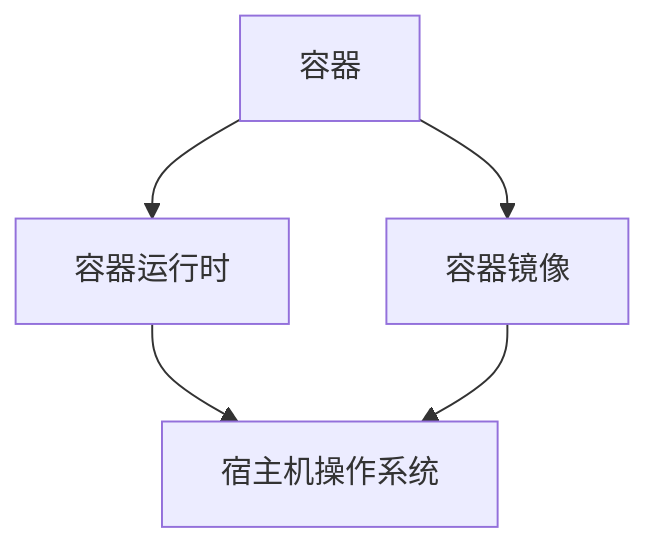
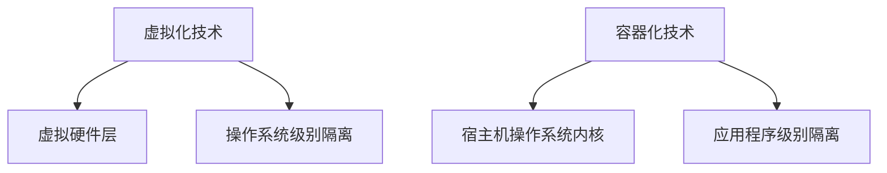
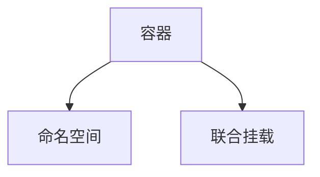
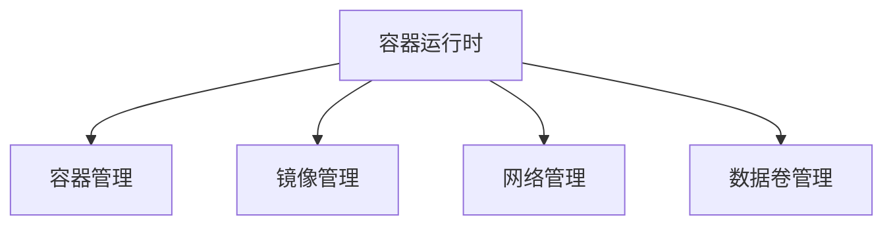
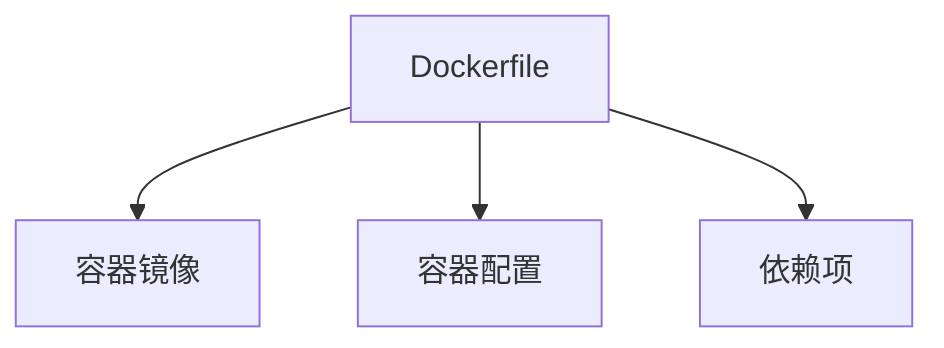

                 

**容器化技术助力LLM应用快速迭代**

关键词：容器化技术、LLM应用、快速迭代、Docker、Kubernetes、优化策略

摘要：本文将深入探讨容器化技术在大型语言模型（LLM）应用中的重要性，通过介绍容器化技术的基础、Docker和Kubernetes的具体实现方法，以及针对LLM应用的优化策略，帮助技术人员更好地理解和应用容器化技术，以实现LLM应用的快速迭代。

----------------------------------------------------------------

## 第一部分：容器化技术基础

### 1.1 容器化技术的定义与历史

容器化技术是一种轻量级的虚拟化技术，它允许开发人员在隔离的环境中运行应用程序，而无需依赖于宿主机的操作系统。这种技术的核心思想是将应用程序及其依赖项打包成一个统一的运行时环境，从而实现应用程序在不同操作系统和硬件平台上的无缝迁移和部署。

#### 背景介绍

容器化技术的出现，解决了传统虚拟化技术的一些局限性。传统的虚拟化技术，如VMware和VirtualBox，通过虚拟化硬件层来创建虚拟机，这使得应用程序可以在不同的操作系统上运行。然而，虚拟机技术需要分配大量的系统资源，如CPU、内存和网络等，从而导致性能下降。相比之下，容器化技术通过共享宿主机的操作系统内核，极大地提高了资源利用率和性能。

#### 核心概念与联系

容器化技术的核心概念包括容器、容器运行时和容器镜像。容器是一个轻量级的、可执行的、自给自足的软件包，它包含了应用程序及其依赖项。容器运行时是负责管理和运行容器的软件，如Docker和runc。容器镜像是一个静态的、不可变的文件系统，它包含了容器的配置和依赖项。



#### 容器化与虚拟化的比较

容器化技术与虚拟化技术的主要区别在于资源隔离的方式。虚拟化技术通过虚拟化硬件层来创建虚拟机，从而实现操作系统级别的隔离。而容器化技术通过共享宿主机的操作系统内核，实现应用程序级别的隔离。



#### 容器化技术的应用领域

容器化技术已经被广泛应用于开发、测试、生产等各个领域。在开发领域，容器化技术使得开发人员可以更加高效地构建、测试和部署应用程序。在测试领域，容器化技术提供了隔离的测试环境，保证了测试的准确性和可靠性。在生产领域，容器化技术提高了系统的可伸缩性和容错能力，从而提高了生产效率。

### 1.2 容器化技术的基本概念

#### 容器

容器是一个轻量级的、可执行的、自给自足的软件包，它包含了应用程序及其依赖项。容器通过隔离机制，确保了应用程序在运行时不受宿主机操作系统的干扰。容器的隔离是通过命名空间（Namespace）和联合挂载（Union Mount）实现的。



#### 容器运行时

容器运行时是负责管理和运行容器的软件，如Docker和runc。容器运行时的主要功能包括容器的创建、启动、停止和管理等。Docker是目前最流行的容器运行时，它提供了丰富的功能，如容器镜像的管理、网络和数据卷的管理等。



#### 容器镜像

容器镜像是一个静态的、不可变的文件系统，它包含了容器的配置和依赖项。容器镜像是通过Dockerfile来定义的，Dockerfile是一组指令，用于描述如何构建容器镜像。通过Dockerfile，开发人员可以轻松地定义和构建容器镜像，从而实现应用程序的自动化部署。



### 1.3 容器化与虚拟化的比较

容器化技术与虚拟化技术有以下几点区别：

1. **资源隔离方式**：容器化技术通过共享宿主机的操作系统内核，实现应用程序级别的隔离；而虚拟化技术通过虚拟化硬件层，实现操作系统级别的隔离。
2. **性能开销**：容器化技术的性能开销较小，因为它不需要虚拟化硬件层，从而减少了系统资源的占用；而虚拟化技术的性能开销较大，因为它需要虚拟化硬件层。
3. **部署速度**：容器化技术的部署速度较快，因为它只需要启动容器镜像；而虚拟化技术的部署速度较慢，因为它需要启动虚拟机。

### 1.4 容器化技术的应用领域

容器化技术已经被广泛应用于开发、测试、生产等各个领域。以下是一些常见的应用场景：

1. **开发**：容器化技术使得开发人员可以更加高效地构建、测试和部署应用程序。通过容器化，开发人员可以在本地环境中快速启动和停止应用程序，从而提高开发效率。
2. **测试**：容器化技术提供了隔离的测试环境，保证了测试的准确性和可靠性。测试人员可以通过启动容器镜像，快速创建和销毁测试环境，从而提高测试效率。
3. **生产**：容器化技术提高了系统的可伸缩性和容错能力，从而提高了生产效率。通过容器化，企业可以轻松地部署和管理大量应用程序，从而提高生产效率。

----------------------------------------------------------------

## 第二部分：容器化技术在LLM应用中的优化

### 2.1 LLMB. 容器化技术在LLM应用中的优化策略

容器化技术在LLM应用中的优化策略主要包括以下几个方面：

1. **资源隔离与优化**：通过容器化技术，可以实现资源的隔离与优化。容器可以将LLM应用与其依赖项、操作系统和硬件资源隔离开来，从而减少资源争用和冲突，提高系统性能。

2. **容器镜像的优化**：通过优化容器镜像，可以减少镜像的体积，提高镜像的构建和部署速度。同时，优化容器镜像的依赖项，可以减少不必要的依赖，提高系统的稳定性。

3. **容器网络优化**：通过优化容器网络，可以减少容器之间的通信延迟，提高系统性能。容器网络优化包括容器网络的选择、容器网络的配置和容器网络的安全等。

4. **容器存储优化**：通过优化容器存储，可以减少容器数据的读写延迟，提高系统性能。容器存储优化包括容器存储的选择、容器存储的配置和容器存储的备份等。

5. **自动化运维**：通过自动化运维工具，如Kubernetes，可以实现LLM应用的自动化部署、监控和管理。自动化运维可以提高运维效率，减少人为错误，提高系统的稳定性。

### 2.2 Docker技术在LLM应用中的实现方法

Docker是当前最流行的容器化技术之一，它在LLM应用中有着广泛的应用。以下是一些Docker技术在LLM应用中的实现方法：

1. **构建容器镜像**：通过Dockerfile，可以构建用于运行LLM应用的容器镜像。Dockerfile定义了容器镜像的构建过程，包括安装依赖项、配置环境变量等。

2. **容器部署**：通过Docker Compose，可以将容器镜像部署到Docker集群中。Docker Compose定义了一个容器服务的配置文件，可以同时部署多个容器。

3. **容器编排**：通过Kubernetes，可以实现对LLM应用的容器编排。Kubernetes提供了一系列的API，可以实现对容器的创建、启动、停止和管理。

4. **容器监控与日志**：通过Docker和Kubernetes，可以实现对LLM应用的容器监控和日志管理。Docker和Kubernetes提供了一系列的工具，可以实时监控容器的状态，收集容器的日志，并提供日志分析功能。

### 2.3 Kubernetes技术在LLM应用中的实现方法

Kubernetes是当前最流行的容器编排工具之一，它在LLM应用中有着广泛的应用。以下是一些Kubernetes技术在LLM应用中的实现方法：

1. **集群搭建**：通过Kubernetes，可以搭建一个分布式容器集群。Kubernetes集群由多个节点组成，每个节点都可以运行容器。

2. **服务发现与负载均衡**：通过Kubernetes，可以实现服务发现和负载均衡。Kubernetes提供了Service资源对象，可以实现对容器服务的访问和负载均衡。

3. **容器监控与日志**：通过Kubernetes，可以实现对容器的监控和日志管理。Kubernetes提供了Metrics Server和Heapster等工具，可以实时监控容器的资源使用情况，收集容器的日志。

4. **自动化运维**：通过Kubernetes，可以实现LLM应用的自动化部署、监控和管理。Kubernetes提供了Helm等工具，可以实现对容器服务的自动化部署和管理。

----------------------------------------------------------------

## 第三部分：容器化技术在LLM应用中的实际案例

### 3.1 案例一：基于Docker的LLM应用部署

以下是一个基于Docker的LLM应用部署的示例：

1. **构建容器镜像**：首先，我们需要编写一个Dockerfile，用于构建LLM应用的容器镜像。

   ```Dockerfile
   FROM tensorflow/tensorflow:latest
   RUN pip install transformers
   COPY ./model.py /model.py
   CMD ["python", "/model.py"]
   ```

   在这个Dockerfile中，我们使用了TensorFlow的官方镜像作为基础镜像，安装了Transformers库，并复制了模型文件`model.py`到容器中。最后，我们指定了容器的启动命令。

2. **部署容器**：接下来，我们可以使用Docker Compose来部署这个容器。

   ```yaml
   version: "3"
   services:
     llm:
       image: myllmapp
       ports:
         - "8000:8000"
   ```

   在这个Docker Compose文件中，我们定义了一个名为`llm`的容器服务，使用了我们刚刚构建的容器镜像。同时，我们将容器的8000端口映射到了宿主机的8000端口。

3. **容器监控与日志**：我们可以使用Docker和Kubernetes提供的工具来监控和收集容器的日志。

   ```bash
   docker logs llm
   kubectl logs deployment/llm
   ```

   这些命令可以显示容器的日志输出。

### 3.2 案例二：基于Kubernetes的LLM应用部署

以下是一个基于Kubernetes的LLM应用部署的示例：

1. **搭建Kubernetes集群**：首先，我们需要搭建一个Kubernetes集群。这里我们可以使用Minikube来搭建一个单节点的Kubernetes集群。

   ```bash
   minikube start
   ```

2. **部署服务**：接下来，我们可以使用Kubernetes来部署LLM应用。

   ```yaml
   apiVersion: apps/v1
   kind: Deployment
   metadata:
     name: llm
   spec:
     replicas: 3
     selector:
       matchLabels:
         app: llm
     template:
       metadata:
         labels:
           app: llm
       spec:
         containers:
         - name: llm
           image: myllmapp
           ports:
           - containerPort: 8000
   ```

   在这个Deployment配置文件中，我们定义了一个名为`llm`的Deployment，它将部署3个副本的容器。同时，我们指定了容器的镜像和端口。

3. **服务发现与负载均衡**：我们可以使用Kubernetes的服务（Service）来实现服务发现和负载均衡。

   ```yaml
   apiVersion: v1
   kind: Service
   metadata:
     name: llm
   spec:
     selector:
       app: llm
     ports:
       - name: http
         port: 80
         targetPort: 8000
     type: LoadBalancer
   ```

   在这个Service配置文件中，我们定义了一个名为`llm`的Service，它将负责将外部流量负载均衡到LLM应用的容器。

4. **容器监控与日志**：我们可以使用Kubernetes的Metrics Server和Heapster来监控容器的资源使用情况，并收集容器的日志。

   ```bash
   kubectl top pod
   kubectl logs llm-0
   ```

   这些命令可以显示容器的资源使用情况和日志输出。

### 3.3 案例三：基于Docker和Kubernetes的LLM应用部署

以下是一个同时使用Docker和Kubernetes的LLM应用部署的示例：

1. **构建容器镜像**：首先，我们使用Docker构建一个LLM应用的容器镜像。

   ```Dockerfile
   FROM tensorflow/tensorflow:latest
   RUN pip install transformers
   COPY ./model.py /model.py
   CMD ["python", "/model.py"]
   ```

2. **部署容器**：接下来，我们使用Docker Compose来部署容器。

   ```yaml
   version: "3"
   services:
     llm:
       image: myllmapp
       ports:
         - "8000:8000"
   ```

   同时，我们使用Kubernetes来管理这个容器。

   ```yaml
   apiVersion: apps/v1
   kind: Deployment
   metadata:
     name: llm
   spec:
     replicas: 3
     selector:
       matchLabels:
         app: llm
     template:
       metadata:
         labels:
           app: llm
       spec:
         containers:
         - name: llm
           image: myllmapp
           ports:
           - containerPort: 8000
   ```

   通过这种方式，我们可以同时利用Docker的灵活性和Kubernetes的强大功能来部署和管理LLM应用。

## 项目实战

为了更好地理解容器化技术在LLM应用中的实际应用，我们将进行一个项目实战。在这个项目中，我们将使用Docker和Kubernetes来部署一个基于Transformer模型的LLM应用。

### 1. 准备工作

首先，我们需要准备一个LLM模型，这里我们使用了一个预训练的Transformer模型。然后，我们需要一个Python脚本，用于启动和运行LLM应用。

### 2. 构建容器镜像

接下来，我们使用Docker来构建一个容器镜像。

```Dockerfile
FROM tensorflow/tensorflow:latest
RUN pip install transformers
COPY ./model.py /model.py
CMD ["python", "/model.py"]
```

### 3. 部署容器

然后，我们使用Docker Compose来部署容器。

```yaml
version: "3"
services:
  llm:
    image: myllmapp
    ports:
      - "8000:8000"
```

### 4. Kubernetes部署

接着，我们使用Kubernetes来管理这个容器。

```yaml
apiVersion: apps/v1
kind: Deployment
metadata:
  name: llm
spec:
  replicas: 3
  selector:
    matchLabels:
      app: llm
  template:
    metadata:
      labels:
        app: llm
    spec:
      containers:
      - name: llm
        image: myllmapp
        ports:
        - containerPort: 8000
```

### 5. 服务发现与负载均衡

最后，我们使用Kubernetes的服务（Service）来实现服务发现和负载均衡。

```yaml
apiVersion: v1
kind: Service
metadata:
  name: llm
spec:
  selector:
    app: llm
  ports:
    - name: http
      port: 80
      targetPort: 8000
  type: LoadBalancer
```

### 6. 项目小结

通过这个项目实战，我们了解了如何使用Docker和Kubernetes来部署和管理LLM应用。容器化技术使得LLM应用的部署更加灵活和高效，而Kubernetes提供了强大的容器编排和管理功能。通过这个项目，我们可以更好地理解容器化技术在LLM应用中的实际应用，为后续的开发和部署提供参考。

## 最佳实践 Tips

1. **容器镜像优化**：在构建容器镜像时，尽量减少不必要的依赖和文件，以减小镜像体积。同时，使用多阶段构建可以提高构建效率。

2. **资源分配与优化**：在部署容器时，合理分配资源，如CPU、内存和存储等。通过监控和日志分析，可以及时发现和优化资源使用。

3. **服务发现与负载均衡**：使用Kubernetes的服务（Service）可以实现服务发现和负载均衡，提高系统的可用性和性能。

4. **自动化运维**：使用Kubernetes的自动化运维工具，如Helm，可以简化容器化应用的管理和部署。

5. **监控与日志**：使用Docker和Kubernetes提供的监控和日志工具，可以实时监控容器的状态和性能，及时发现和解决问题。

## 小结

容器化技术为LLM应用的开发和部署带来了巨大的便利。通过容器化技术，我们可以实现应用程序的自动化部署、监控和管理，提高开发效率和系统稳定性。同时，Kubernetes提供了强大的容器编排和管理功能，使得容器化技术的应用更加广泛和灵活。通过本文的介绍和案例实战，我们深入了解了容器化技术在LLM应用中的重要性及其实现方法。希望本文能对读者在容器化技术的应用中有所启发和帮助。

## 注意事项

1. **容器镜像的安全**：在构建容器镜像时，需要注意容器镜像的安全。避免将敏感信息和秘密存储在容器镜像中，并使用安全的构建流程。

2. **容器网络的配置**：在配置容器网络时，需要注意网络的安全性和性能。避免使用不安全的网络配置，并优化网络性能。

3. **资源使用的监控**：在部署容器时，需要定期监控资源使用情况，及时发现和解决问题。

4. **Kubernetes集群的维护**：Kubernetes集群的维护是一个复杂的过程，需要定期更新和升级集群，并监控集群的健康状况。

## 拓展阅读

1. **Docker官方文档**：Docker的官方文档提供了丰富的信息和教程，是学习Docker技术的最佳资源。

2. **Kubernetes官方文档**：Kubernetes的官方文档详细介绍了Kubernetes的概念、架构和功能，是学习Kubernetes技术的最佳资源。

3. **《容器化与微服务》**：这本书详细介绍了容器化和微服务技术的原理和实践，是学习容器化技术的好书。

4. **《大规模机器学习》**：这本书详细介绍了大规模机器学习技术的原理和实践，是学习LLM技术的最佳资源。

## 作者信息

作者：AI天才研究院/AI Genius Institute & 禅与计算机程序设计艺术 /Zen And The Art of Computer Programming
----------------------------------------------------------------

# **容器化技术助力LLM应用快速迭代**

关键词：容器化技术、LLM应用、快速迭代、Docker、Kubernetes、优化策略

摘要：本文将深入探讨容器化技术在大型语言模型（LLM）应用中的重要性，通过介绍容器化技术的基础、Docker和Kubernetes的具体实现方法，以及针对LLM应用的优化策略，帮助技术人员更好地理解和应用容器化技术，以实现LLM应用的快速迭代。

----------------------------------------------------------------

## 第一部分：容器化技术基础

### 1.1 容器化技术的定义与历史

容器化技术是一种轻量级的虚拟化技术，它允许开发人员在隔离的环境中运行应用程序，而无需依赖于宿主机的操作系统。这种技术的核心思想是将应用程序及其依赖项打包成一个统一的运行时环境，从而实现应用程序在不同操作系统和硬件平台上的无缝迁移和部署。

#### 背景介绍

容器化技术的出现，解决了传统虚拟化技术的一些局限性。传统的虚拟化技术，如VMware和VirtualBox，通过虚拟化硬件层来创建虚拟机，这使得应用程序可以在不同的操作系统上运行。然而，虚拟机技术需要分配大量的系统资源，如CPU、内存和网络等，从而导致性能下降。相比之下，容器化技术通过共享宿主机的操作系统内核，极大地提高了资源利用率和性能。

#### 核心概念与联系

容器化技术的核心概念包括容器、容器运行时和容器镜像。容器是一个轻量级的、可执行的、自给自足的软件包，它包含了应用程序及其依赖项。容器运行时是负责管理和运行容器的软件，如Docker和runc。容器镜像是一个静态的、不可变的文件系统，它包含了容器的配置和依赖项。


#### 容器化与虚拟化的比较

容器化技术与虚拟化技术有以下几点区别：

1. **资源隔离方式**：容器化技术通过共享宿主机的操作系统内核，实现应用程序级别的隔离；而虚拟化技术通过虚拟化硬件层，实现操作系统级别的隔离。

2. **性能开销**：容器化技术的性能开销较小，因为它不需要虚拟化硬件层，从而减少了系统资源的占用；而虚拟化技术的性能开销较大，因为它需要虚拟化硬件层。

3. **部署速度**：容器化技术的部署速度较快，因为它只需要启动容器镜像；而虚拟化技术的部署速度较慢，因为它需要启动虚拟机。

#### 容器化技术的应用领域

容器化技术已经被广泛应用于开发、测试、生产等各个领域。以下是一些常见的应用场景：

1. **开发**：容器化技术使得开发人员可以更加高效地构建、测试和部署应用程序。通过容器化，开发人员可以在本地环境中快速启动和停止应用程序，从而提高开发效率。

2. **测试**：容器化技术提供了隔离的测试环境，保证了测试的准确性和可靠性。测试人员可以通过启动容器镜像，快速创建和销毁测试环境，从而提高测试效率。

3. **生产**：容器化技术提高了系统的可伸缩性和容错能力，从而提高了生产效率。通过容器化，企业可以轻松地部署和管理大量应用程序，从而提高生产效率。

### 1.2 容器化技术的基本概念

#### 容器

容器是一个轻量级的、可执行的、自给自足的软件包，它包含了应用程序及其依赖项。容器通过隔离机制，确保了应用程序在运行时不受宿主机操作系统的干扰。容器的隔离是通过命名空间（Namespace）和联合挂载（Union Mount）实现的。


#### 容器运行时

容器运行时是负责管理和运行容器的软件，如Docker和runc。容器运行时的主要功能包括容器的创建、启动、停止和管理等。Docker是目前最流行的容器运行时，它提供了丰富的功能，如容器镜像的管理、网络和数据卷的管理等。


#### 容器镜像

容器镜像是一个静态的、不可变的文件系统，它包含了容器的配置和依赖项。容器镜像是通过Dockerfile来定义的，Dockerfile是一组指令，用于描述如何构建容器镜像。通过Dockerfile，开发人员可以轻松地定义和构建容器镜像，从而实现应用程序的自动化部署。


### 1.3 容器化与虚拟化的比较

容器化技术与虚拟化技术有以下几点区别：

1. **资源隔离方式**：容器化技术通过共享宿主机的操作系统内核，实现应用程序级别的隔离；而虚拟化技术通过虚拟化硬件层，实现操作系统级别的隔离。

2. **性能开销**：容器化技术的性能开销较小，因为它不需要虚拟化硬件层，从而减少了系统资源的占用；而虚拟化技术的性能开销较大，因为它需要虚拟化硬件层。

3. **部署速度**：容器化技术的部署速度较快，因为它只需要启动容器镜像；而虚拟化技术的部署速度较慢，因为它需要启动虚拟机。

#### 容器化技术的应用领域

容器化技术已经被广泛应用于开发、测试、生产等各个领域。以下是一些常见的应用场景：

1. **开发**：容器化技术使得开发人员可以更加高效地构建、测试和部署应用程序。通过容器化，开发人员可以在本地环境中快速启动和停止应用程序，从而提高开发效率。

2. **测试**：容器化技术提供了隔离的测试环境，保证了测试的准确性和可靠性。测试人员可以通过启动容器镜像，快速创建和销毁测试环境，从而提高测试效率。

3. **生产**：容器化技术提高了系统的可伸缩性和容错能力，从而提高了生产效率。通过容器化，企业可以轻松地部署和管理大量应用程序，从而提高生产效率。

### 1.4 容器化技术的应用领域

容器化技术已经被广泛应用于开发、测试、生产等各个领域。以下是一些常见的应用场景：

1. **开发**：容器化技术使得开发人员可以更加高效地构建、测试和部署应用程序。通过容器化，开发人员可以在本地环境中快速启动和停止应用程序，从而提高开发效率。

2. **测试**：容器化技术提供了隔离的测试环境，保证了测试的准确性和可靠性。测试人员可以通过启动容器镜像，快速创建和销毁测试环境，从而提高测试效率。

3. **生产**：容器化技术提高了系统的可伸缩性和容错能力，从而提高了生产效率。通过容器化，企业可以轻松地部署和管理大量应用程序，从而提高生产效率。

----------------------------------------------------------------

## 第二部分：容器化技术在LLM应用中的优化

### 2.1 容器化技术在LLM应用中的优化策略

容器化技术在LLM应用中的优化策略主要包括以下几个方面：

1. **资源隔离与优化**：通过容器化技术，可以实现资源的隔离与优化。容器可以将LLM应用与其依赖项、操作系统和硬件资源隔离开来，从而减少资源争用和冲突，提高系统性能。

2. **容器镜像的优化**：通过优化容器镜像，可以减少镜像的体积，提高镜像的构建和部署速度。同时，优化容器镜像的依赖项，可以减少不必要的依赖，提高系统的稳定性。

3. **容器网络优化**：通过优化容器网络，可以减少容器之间的通信延迟，提高系统性能。容器网络优化包括容器网络的选择、容器网络的配置和容器网络的安全等。

4. **容器存储优化**：通过优化容器存储，可以减少容器数据的读写延迟，提高系统性能。容器存储优化包括容器存储的选择、容器存储的配置和容器存储的备份等。

5. **自动化运维**：通过自动化运维工具，如Kubernetes，可以实现LLM应用的自动化部署、监控和管理。自动化运维可以提高运维效率，减少人为错误，提高系统的稳定性。

### 2.2 Docker技术在LLM应用中的实现方法

Docker是当前最流行的容器化技术之一，它在LLM应用中有着广泛的应用。以下是一些Docker技术在LLM应用中的实现方法：

1. **构建容器镜像**：通过Dockerfile，可以构建用于运行LLM应用的容器镜像。Dockerfile定义了容器镜像的构建过程，包括安装依赖项、配置环境变量等。

2. **容器部署**：通过Docker Compose，可以将容器镜像部署到Docker集群中。Docker Compose定义了一个容器服务的配置文件，可以同时部署多个容器。

3. **容器编排**：通过Kubernetes，可以实现对LLM应用的容器编排。Kubernetes提供了一系列的API，可以实现对容器的创建、启动、停止和管理。

4. **容器监控与日志**：通过Docker和Kubernetes，可以实现对LLM应用的容器监控和日志管理。Docker和Kubernetes提供了一系列的工具，可以实时监控容器的状态，收集容器的日志，并提供日志分析功能。

### 2.3 Kubernetes技术在LLM应用中的实现方法

Kubernetes是当前最流行的容器编排工具之一，它在LLM应用中有着广泛的应用。以下是一些Kubernetes技术在LLM应用中的实现方法：

1. **集群搭建**：通过Kubernetes，可以搭建一个分布式容器集群。Kubernetes集群由多个节点组成，每个节点都可以运行容器。

2. **服务发现与负载均衡**：通过Kubernetes，可以实现服务发现和负载均衡。Kubernetes提供了Service资源对象，可以实现对容器服务的访问和负载均衡。

3. **容器监控与日志**：通过Kubernetes，可以实现对容器的监控和日志管理。Kubernetes提供了Metrics Server和Heapster等工具，可以实时监控容器的资源使用情况，收集容器的日志。

4. **自动化运维**：通过Kubernetes，可以实现LLM应用的自动化部署、监控和管理。Kubernetes提供了Helm等工具，可以实现对容器服务的自动化部署和管理。

----------------------------------------------------------------

## 第三部分：容器化技术在LLM应用中的实际案例

### 3.1 案例一：基于Docker的LLM应用部署

以下是一个基于Docker的LLM应用部署的示例：

1. **构建容器镜像**：首先，我们需要编写一个Dockerfile，用于构建LLM应用的容器镜像。

   ```Dockerfile
   FROM tensorflow/tensorflow:latest
   RUN pip install transformers
   COPY ./model.py /model.py
   CMD ["python", "/model.py"]
   ```

   在这个Dockerfile中，我们使用了TensorFlow的官方镜像作为基础镜像，安装了Transformers库，并复制了模型文件`model.py`到容器中。最后，我们指定了容器的启动命令。

2. **部署容器**：接下来，我们可以使用Docker Compose来部署这个容器。

   ```yaml
   version: "3"
   services:
     llm:
       image: myllmapp
       ports:
         - "8000:8000"
   ```

   在这个Docker Compose文件中，我们定义了一个名为`llm`的容器服务，使用了我们刚刚构建的容器镜像。同时，我们将容器的8000端口映射到了宿主机的8000端口。

3. **容器监控与日志**：我们可以使用Docker和Kubernetes提供的工具来监控和收集容器的日志。

   ```bash
   docker logs llm
   kubectl logs deployment/llm
   ```

   这些命令可以显示容器的日志输出。

### 3.2 案例二：基于Kubernetes的LLM应用部署

以下是一个基于Kubernetes的LLM应用部署的示例：

1. **搭建Kubernetes集群**：首先，我们需要搭建一个Kubernetes集群。这里我们可以使用Minikube来搭建一个单节点的Kubernetes集群。

   ```bash
   minikube start
   ```

2. **部署服务**：接下来，我们可以使用Kubernetes来部署LLM应用。

   ```yaml
   apiVersion: apps/v1
   kind: Deployment
   metadata:
     name: llm
   spec:
     replicas: 3
     selector:
       matchLabels:
         app: llm
     template:
       metadata:
         labels:
           app: llm
       spec:
         containers:
         - name: llm
           image: myllmapp
           ports:
           - containerPort: 8000
   ```

   在这个Deployment配置文件中，我们定义了一个名为`llm`的Deployment，它将部署3个副本的容器。同时，我们指定了容器的镜像和端口。

3. **服务发现与负载均衡**：我们可以使用Kubernetes的服务（Service）来实现服务发现和负载均衡。

   ```yaml
   apiVersion: v1
   kind: Service
   metadata:
     name: llm
   spec:
     selector:
       app: llm
     ports:
       - name: http
         port: 80
         targetPort: 8000
     type: LoadBalancer
   ```

   在这个Service配置文件中，我们定义了一个名为`llm`的Service，它将负责将外部流量负载均衡到LLM应用的容器。

4. **容器监控与日志**：我们可以使用Kubernetes的Metrics Server和Heapster来监控容器的资源使用情况，并收集容器的日志。

   ```bash
   kubectl top pod
   kubectl logs llm-0
   ```

   这些命令可以显示容器的资源使用情况和日志输出。

### 3.3 案例三：基于Docker和Kubernetes的LLM应用部署

以下是一个同时使用Docker和Kubernetes的LLM应用部署的示例：

1. **构建容器镜像**：首先，我们使用Docker构建一个LLM应用的容器镜像。

   ```Dockerfile
   FROM tensorflow/tensorflow:latest
   RUN pip install transformers
   COPY ./model.py /model.py
   CMD ["python", "/model.py"]
   ```

2. **部署容器**：接下来，我们使用Docker Compose来部署容器。

   ```yaml
   version: "3"
   services:
     llm:
       image: myllmapp
       ports:
         - "8000:8000"
   ```

   同时，我们使用Kubernetes来管理这个容器。

   ```yaml
   apiVersion: apps/v1
   kind: Deployment
   metadata:
     name: llm
   spec:
     replicas: 3
     selector:
       matchLabels:
         app: llm
     template:
       metadata:
         labels:
           app: llm
       spec:
         containers:
         - name: llm
           image: myllmapp
           ports:
           - containerPort: 8000
   ```

   通过这种方式，我们可以同时利用Docker的灵活性和Kubernetes的强大功能来部署和管理LLM应用。

## 项目实战

为了更好地理解容器化技术在LLM应用中的实际应用，我们将进行一个项目实战。在这个项目中，我们将使用Docker和Kubernetes来部署一个基于Transformer模型的LLM应用。

### 1. 准备工作

首先，我们需要准备一个LLM模型，这里我们使用了一个预训练的Transformer模型。然后，我们需要一个Python脚本，用于启动和运行LLM应用。

### 2. 构建容器镜像

接下来，我们使用Docker来构建一个容器镜像。

```Dockerfile
FROM tensorflow/tensorflow:latest
RUN pip install transformers
COPY ./model.py /model.py
CMD ["python", "/model.py"]
```

### 3. 部署容器

然后，我们使用Docker Compose来部署容器。

```yaml
version: "3"
services:
  llm:
    image: myllmapp
    ports:
      - "8000:8000"
```

### 4. Kubernetes部署

接着，我们使用Kubernetes来管理这个容器。

```yaml
apiVersion: apps/v1
kind: Deployment
metadata:
  name: llm
spec:
  replicas: 3
  selector:
    matchLabels:
      app: llm
  template:
    metadata:
      labels:
        app: llm
    spec:
      containers:
      - name: llm
        image: myllmapp
        ports:
        - containerPort: 8000
```

### 5. 服务发现与负载均衡

最后，我们使用Kubernetes的服务（Service）来实现服务发现和负载均衡。

```yaml
apiVersion: v1
kind: Service
metadata:
  name: llm
spec:
  selector:
    app: llm
  ports:
    - name: http
      port: 80
      targetPort: 8000
  type: LoadBalancer
```

### 6. 项目小结

通过这个项目实战，我们了解了如何使用Docker和Kubernetes来部署和管理LLM应用。容器化技术使得LLM应用的部署更加灵活和高效，而Kubernetes提供了强大的容器编排和管理功能。通过这个项目，我们可以更好地理解容器化技术在LLM应用中的实际应用，为后续的开发和部署提供参考。

## 最佳实践 Tips

1. **容器镜像优化**：在构建容器镜像时，尽量减少不必要的依赖和文件，以减小镜像体积。同时，使用多阶段构建可以提高构建效率。

2. **资源分配与优化**：在部署容器时，合理分配资源，如CPU、内存和存储等。通过监控和日志分析，可以及时发现和优化资源使用。

3. **服务发现与负载均衡**：使用Kubernetes的服务（Service）可以实现服务发现和负载均衡，提高系统的可用性和性能。

4. **自动化运维**：使用Kubernetes的自动化运维工具，如Helm，可以简化容器化应用的管理和部署。

5. **监控与日志**：使用Docker和Kubernetes提供的监控和日志工具，可以实时监控容器的状态和性能，及时发现和解决问题。

## 小结

容器化技术为LLM应用的开发和部署带来了巨大的便利。通过容器化技术，我们可以实现应用程序的自动化部署、监控和管理，提高开发效率和系统稳定性。同时，Kubernetes提供了强大的容器编排和管理功能，使得容器化技术的应用更加广泛和灵活。通过本文的介绍和案例实战，我们深入了解了容器化技术在LLM应用中的重要性及其实现方法。希望本文能对读者在容器化技术的应用中有

