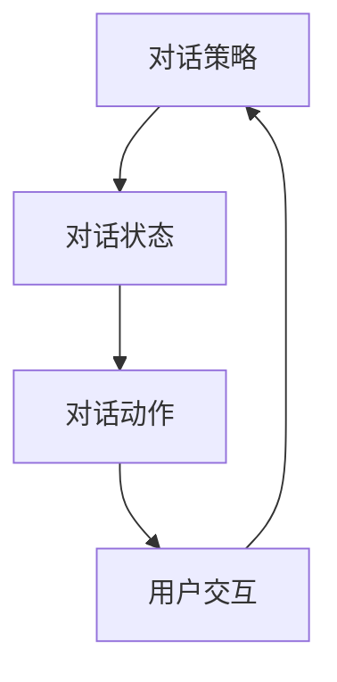
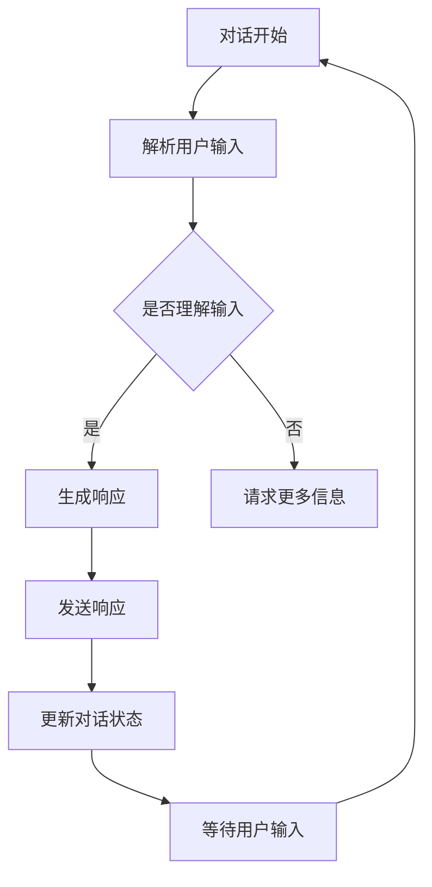
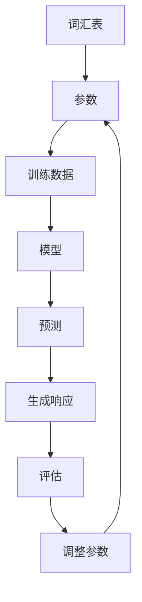
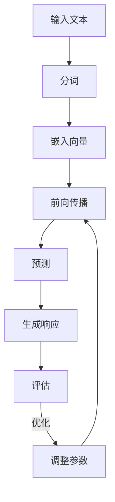

                 

### 文章标题

# 对话管理系统提升LLM应用的交互质量

> 关键词：对话管理系统，大型语言模型（LLM），交互质量，集成，评估方法，实际应用

> 摘要：本文旨在探讨如何通过优化对话管理系统来提升大型语言模型（LLM）应用的交互质量。文章首先介绍了对话管理系统和LLM的基本概念，随后详细分析了两者集成的策略和挑战，以及评估交互质量的多种方法。最后，通过实际案例展示了对话管理在提高LLM应用交互质量方面的具体应用和实践。

### 引言

随着人工智能技术的快速发展，对话系统已成为一种重要的交互方式，广泛应用于虚拟客服、智能语音助手、个性化推荐等领域。其中，大型语言模型（LLM）作为对话系统的核心技术，极大地提升了对话系统的自然语言理解和生成能力。然而，对话质量不仅仅取决于LLM的性能，还受到对话管理系统的显著影响。对话管理系统（Dialogue Management System，DMS）负责协调对话流程，确保对话的连贯性和用户满意度。本文将深入探讨如何通过优化对话管理系统来提升LLM应用的交互质量。

### 对话管理系统概述

#### 背景介绍

对话管理系统是一种用于构建和管理对话流程的软件系统。它通过协调对话中的各个环节，确保用户与系统之间的交流顺畅且富有意义。随着自然语言处理（NLP）技术的进步，对话管理系统在提高用户体验方面发挥了关键作用。

#### 核心概念与联系

对话管理系统由以下几个核心概念组成：

1. **对话策略**：对话策略是一组规则，用于指导系统如何响应用户的输入。
2. **对话状态**：对话状态记录对话的当前状态，包括用户的历史输入、系统的历史响应等。
3. **对话动作**：对话动作是实现对话策略的具体操作，如请求用户输入、提供信息等。

核心概念之间的关系架构如下所示：



#### Mermaid流程图



### 对话管理系统的组成与功能

对话管理系统通常包括以下几个关键组成部分：

1. **对话策略生成器**：根据对话状态生成对话策略。
2. **对话状态跟踪器**：记录并跟踪对话过程中的关键信息。
3. **对话动作执行器**：执行对话策略中定义的动作。
4. **用户界面**：与用户进行交互的界面。

### 对话管理系统的架构


### 对话管理系统的发展历程

对话管理系统的发展可以分为三个主要阶段：

1. **规则驱动**：早期的对话管理系统主要基于规则进行对话管理。
2. **数据驱动**：随着自然语言处理技术的发展，对话管理系统开始利用大规模数据进行训练。
3. **混合驱动**：现代对话管理系统结合规则和数据驱动方法，以实现更灵活和智能的对话管理。

### LLM概述

#### 背景介绍

大型语言模型（LLM）是自然语言处理领域的重要进展，它通过学习大量文本数据，能够生成自然且合理的语言响应。LLM在对话系统中发挥着至关重要的作用，能够显著提升对话的自然性和准确性。

#### 核心概念与联系

LLM的核心概念包括：

1. **词汇表**：词汇表是LLM中表示单词和字符的集合。
2. **参数**：LLM的参数是模型中的权重，用于预测文本的下一个词或字符。
3. **训练数据**：训练数据是用于训练LLM的文本集合。

核心概念之间的关系如下所示：



#### Mermaid流程图



#### 核心算法原理

LLM的核心算法通常基于递归神经网络（RNN）或变压器（Transformer）模型。以下是一个基于变压器模型的简单Python代码示例，用于生成文本：

```python
import torch
import torch.nn as nn
import torch.optim as optim

# 定义变压器模型
class TransformerModel(nn.Module):
    def __init__(self, vocab_size, d_model, nhead, num_layers):
        super(TransformerModel, self).__init__()
        self.embedding = nn.Embedding(vocab_size, d_model)
        self.transformer = nn.Transformer(d_model, nhead, num_layers)
        self.fc = nn.Linear(d_model, vocab_size)
    
    def forward(self, src, tgt):
        src = self.embedding(src)
        tgt = self.embedding(tgt)
        output = self.transformer(src, tgt)
        return self.fc(output)

# 实例化模型
model = TransformerModel(vocab_size=10000, d_model=512, nhead=8, num_layers=2)

# 定义损失函数和优化器
criterion = nn.CrossEntropyLoss()
optimizer = optim.Adam(model.parameters(), lr=0.001)

# 训练模型
for epoch in range(10):
    for src, tgt in data_loader:
        optimizer.zero_grad()
        output = model(src, tgt)
        loss = criterion(output.view(-1, vocab_size), tgt.view(-1))
        loss.backward()
        optimizer.step()

# 生成文本
def generate_text(model, start_token, max_len):
    model.eval()
    with torch.no_grad():
        input = torch.tensor([start_token])
        for _ in range(max_len):
            output = model(input)
            next_word = torch.argmax(output).item()
            input = torch.cat([input, torch.tensor([next_word])], dim=0)
            if next_word == eos_token:
                break
        return input.tolist()

# 输出生成文本
print(generate_text(model, start_token=0, max_len=50))
```

#### 数学模型

LLM的训练和预测通常涉及以下数学模型：

1. **嵌入层**：将词汇表转换为向量表示。
2. **自注意力机制**：计算不同词之间的关联性。
3. **前向传播**：通过多层神经网络对输入进行处理。

以下是LLM中自注意力机制的LaTeX公式：

```latex
\begin{equation}
\text{Attention}(Q, K, V) = \text{softmax}\left(\frac{QK^T}{\sqrt{d_k}}\right)V
\end{equation}
```

其中，\(Q, K, V\) 分别表示查询、关键和值向量，\(d_k\) 表示关键向量的维度。

### 对话管理系统与LLM集成

#### 集成策略

将对话管理系统与LLM集成通常采用以下策略：

1. **策略优化**：通过优化对话策略，确保LLM的响应与对话目标一致。
2. **状态跟踪**：利用对话状态跟踪器记录对话过程中的关键信息。
3. **动作执行**：通过对话动作执行器实现LLM的文本生成。

#### 集成过程中的挑战与解决方案

集成过程中的主要挑战包括：

1. **模型兼容性**：确保LLM的输入和输出格式与对话管理系统兼容。
2. **响应时间**：优化响应时间，确保对话系统的实时性。

解决方案包括：

1. **并行处理**：使用并行计算技术加快处理速度。
2. **预训练模型**：使用预训练的LLM模型，减少定制化需求。

### 交互质量评估方法

#### 交互质量的定义与维度

交互质量是指用户与系统之间的交互体验。其维度包括：

1. **响应时间**：系统的响应速度。
2. **回答准确性**：系统回答的准确性和相关性。
3. **用户满意度**：用户对交互体验的整体评价。

#### 常用的评估指标

1. **响应时间**：平均响应时间、最大响应时间等。
2. **回答准确性**：精确率、召回率、F1分数等。
3. **用户满意度**：问卷调查、用户评分等。

#### 评估方法的选择与应用

选择评估方法时需要考虑以下因素：

1. **评估目标**：根据交互质量的维度选择合适的评估方法。
2. **数据可用性**：根据数据类型选择评估方法。
3. **评估成本**：考虑评估方法的实施成本。

### 实际应用案例

#### 案例一：虚拟客服聊天机器人

虚拟客服聊天机器人是一种常见的大型语言模型应用。通过对话管理系统，聊天机器人能够理解用户的需求并提供相应的解决方案。

#### 案例二：智能语音助手

智能语音助手（如苹果的Siri、谷歌的Google Assistant）通过对话管理系统与LLM集成，实现自然语言理解与语音交互。

#### 案例三：个性化推荐系统

个性化推荐系统利用对话管理系统与LLM集成，为用户提供个性化的商品推荐和服务。

### 技术挑战与未来趋势

#### 当前技术挑战

1. **响应速度**：如何在保证准确性的同时，提高响应速度。
2. **多语言支持**：如何实现高效的多语言对话管理。
3. **用户隐私**：如何在确保用户隐私的前提下，提供高质量的交互体验。

#### 技术发展趋势

1. **预训练模型**：预训练模型在提高交互质量方面具有显著优势。
2. **多模态交互**：结合语音、文本、图像等多种模态，提供更丰富的交互体验。
3. **个性化交互**：通过用户数据分析，实现个性化的对话管理。

### 项目实战

#### 开发环境搭建

1. **安装Python和相关库**：安装Python环境，并安装PyTorch等深度学习库。
2. **数据集准备**：准备用于训练和评估的数据集。

#### 源代码详细实现

1. **对话管理系统**：实现对话策略生成器、对话状态跟踪器等组件。
2. **LLM模型**：使用PyTorch实现Transformer模型。
3. **集成与评估**：将对话管理系统与LLM集成，并进行交互质量评估。

#### 代码解读与分析

1. **代码结构**：解释代码结构，说明每个组件的作用。
2. **关键代码**：详细解释关键代码段，包括数学模型和算法原理。

#### 实际案例分析

1. **案例分析**：分析虚拟客服聊天机器人的案例，解释对话管理如何提升交互质量。
2. **评估结果**：展示评估结果，包括响应时间、回答准确性和用户满意度等指标。

#### 项目小结

1. **项目总结**：总结项目实施过程中的经验教训。
2. **改进方向**：提出项目改进的建议和方向。

### 最佳实践 Tips

1. **优化响应速度**：使用并行计算技术，优化模型加载和响应速度。
2. **提高回答准确性**：结合规则和数据分析，提高回答的准确性和相关性。
3. **用户隐私保护**：采取加密和匿名化等技术，确保用户隐私。

### 小结

本文通过深入分析对话管理系统和大型语言模型（LLM），探讨了如何通过优化对话管理系统来提升LLM应用的交互质量。文章首先介绍了对话管理系统和LLM的基本概念，然后分析了集成的策略和挑战，以及交互质量的评估方法。通过实际应用案例，展示了对话管理系统在提高LLM应用交互质量方面的具体应用和实践。未来，随着技术的不断进步，对话管理系统与LLM的集成将进一步优化，为用户提供更高质量、更个性化的交互体验。

### 注意事项

1. **响应速度**：优化响应速度是提升交互质量的关键，需综合考虑模型复杂度和计算资源。
2. **多语言支持**：在多语言环境中，需确保不同语言模型之间的兼容性和一致性。
3. **用户隐私**：在处理用户数据时，需严格遵守隐私保护法律法规。

### 拓展阅读

1. **《对话系统设计：从理论到实践》**：深入探讨对话系统的设计原则和方法。
2. **《大型语言模型：原理与实践》**：详细介绍LLM的原理和应用实践。

### 作者信息

作者：AI天才研究院/AI Genius Institute & 禅与计算机程序设计艺术 /Zen And The Art of Computer Programming

### 文章标题

# 对话管理系统提升LLM应用的交互质量

### 文章关键词

- 对话管理系统
- 大型语言模型（LLM）
- 交互质量
- 集成
- 评估方法
- 实际应用

### 文章摘要

本文旨在探讨如何通过优化对话管理系统来提升大型语言模型（LLM）应用的交互质量。文章首先介绍了对话管理系统和LLM的基本概念，随后详细分析了两者集成的策略和挑战，以及交互质量的评估方法。最后，通过实际案例展示了对话管理在提高LLM应用交互质量方面的具体应用和实践。

