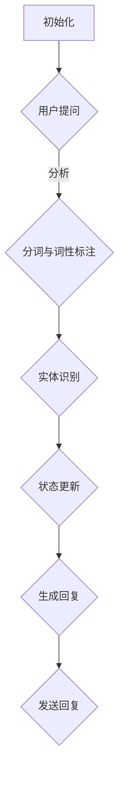
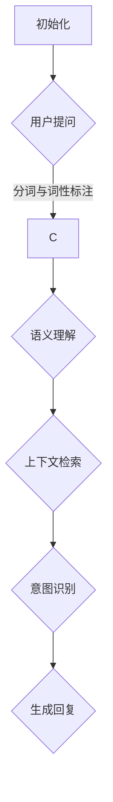
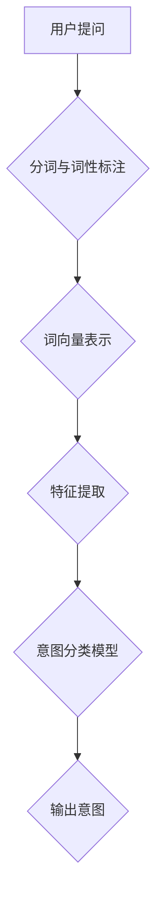
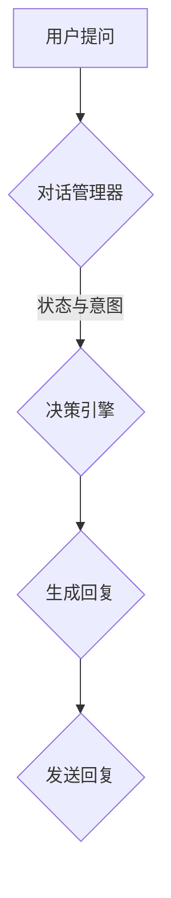
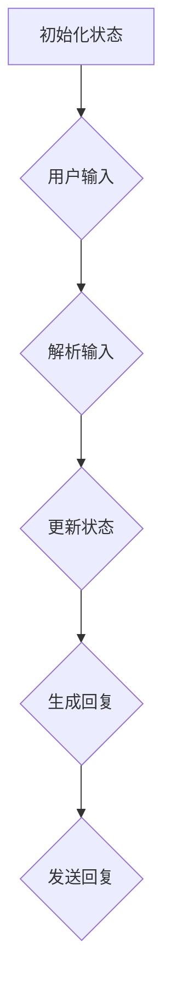
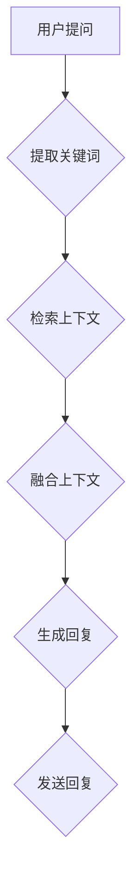

                 

### 引言：对话连贯性评测的重要性

随着人工智能技术的飞速发展，对话系统在众多领域得到了广泛应用，如智能客服、智能助手、虚拟聊天机器人等。然而，对话系统的成功不仅取决于其回答问题的准确性，更重要的是能否与用户保持连贯的交流。对话连贯性是衡量对话系统质量的关键指标，它直接影响到用户体验。因此，对话连贯性评测成为对话系统研究和开发中的核心问题。

本文旨在深入探讨对话连贯性评测的各个方面，首先，我们将介绍对话连贯性的基本概念和定义，帮助读者理解这一概念的重要性。接着，我们将讨论对话系统的基本组成部分，以及对话连贯性在这些组成部分中的体现。然后，我们将分析对话连贯性的评价标准和方法，并探讨如何在实际应用中评估对话连贯性。

在理论基础部分，我们将详细介绍自然语言处理（NLP）的基础知识，包括词法分析、句法分析和语义分析，这些都是理解对话连贯性的关键。接着，我们将深入讨论对话状态跟踪和上下文理解，这些是确保对话连贯性的核心技术。

在数学模型部分，我们将介绍常见的对话连贯性评价模型，并使用Python代码详细阐述这些模型的基本原理和实现方法。接着，我们将探讨如何通过数学模型来优化对话连贯性。

接下来，我们将介绍对话连贯性评测的具体方法，包括评测流程、工具和资源。随后，我们将分析长期交互中的对话连贯性特点，并讨论如何优化长期交互中的对话连贯性。

最后，我们将通过实际案例展示对话连贯性评测的应用，并总结全文，提供最佳实践建议和小结。本文的目标是为读者提供一个全面、深入、易懂的对话连贯性评测指南。

通过本文的阅读，读者将能够了解对话连贯性的重要性，掌握评测对话连贯性的方法和技巧，并能够将这些方法应用于实际项目中，提升对话系统的用户体验。

### 对话连贯性的定义与核心概念

对话连贯性是指对话系统能够在交流过程中保持一致性和逻辑性，使得用户感觉流畅、自然。在对话系统中，保持连贯性意味着系统能够正确理解用户的意图，并根据上下文生成合理的回应。为了实现这一目标，需要深入理解几个核心概念：对话状态跟踪、上下文理解、用户意图识别和对话管理。

#### 对话状态跟踪

对话状态跟踪（Dialogue State Tracking，DST）是对话系统中的一项关键技术，它旨在捕捉并维护对话中的关键信息。DST的目标是确保系统在每一轮对话中都能够正确理解用户的当前意图和对话历史。对话状态通常由一系列实体和属性组成，这些实体和属性在对话过程中不断更新。

核心概念包括：
- **实体（Entity）**：对话中的关键信息点，如用户名、日期、商品名称等。
- **属性（Attribute）**：实体的具体属性值，如姓名、颜色、大小等。
- **状态（State）**：对话中的所有实体和属性的当前值。

**Mermaid流程图：**



#### 上下文理解

上下文理解是对话系统能够在对话中正确理解当前讨论内容和背景的能力。上下文不仅包括当前的提问和回复，还包括对话历史、用户偏好和对话上下文中的隐含信息。上下文理解是实现连贯对话的基础。

核心概念包括：
- **对话历史（Dialogue History）**：对话过程中所有的提问和回答。
- **上下文信息（Contextual Information）**：对话历史之外，可能影响对话决策的其他信息。

**Mermaid流程图：**



#### 用户意图识别

用户意图识别（Intent Recognition）是对话系统的核心任务之一，它旨在理解用户的真实意图。用户在对话中可能会使用多种表达方式来传达同一意图，因此意图识别需要能够处理模糊性和多义性。

核心概念包括：
- **意图（Intent）**：用户在对话中表达的目的或需求。
- **意图分类（Intent Classification）**：将用户的输入分类到预定义的意图类别中。

**Mermaid流程图：**



#### 对话管理

对话管理（Dialogue Management）是对话系统的核心模块，负责在对话过程中协调不同的对话组件，确保对话能够顺利进行。对话管理器需要基于当前的对话状态、上下文和用户意图来生成合适的回复。

核心概念包括：
- **对话策略（Dialogue Policy）**：对话管理器在决策过程中使用的策略。
- **回复生成（Response Generation）**：根据用户意图和对话状态生成合理的回复。

**Mermaid流程图：**



通过以上核心概念和Mermaid流程图的详细说明，我们可以更清晰地理解对话连贯性的实现机制。对话连贯性不仅需要技术上的精确性，还需要在用户体验上达到高度的满意度。接下来，我们将进一步探讨对话系统的基本组成部分，以及如何通过这些部分来实现和评估对话连贯性。

### 对话系统的基本组成部分

为了实现良好的对话连贯性，对话系统通常由多个关键组件构成，这些组件相互协作，确保对话能够顺利进行。以下是对话系统的基本组成部分及其在对话连贯性中的角色：

#### 用户接口（User Interface，UI）

用户接口是用户与对话系统进行交互的桥梁，包括文本聊天界面、语音交互界面以及多模态交互界面。用户接口的设计直接影响用户体验，因此对于保持对话连贯性至关重要。

- **文本聊天界面**：提供文本输入和显示输出功能，常见的有聊天窗口、对话框等。
- **语音交互界面**：实现语音输入和输出，如语音识别和语音合成。
- **多模态交互界面**：结合文本、语音和图像等多种交互方式，提高对话的自然性和互动性。

#### 对话管理（Dialogue Management，DM）

对话管理是对话系统的核心组件，负责管理对话流程，确保对话的连贯性和一致性。对话管理器通过对话策略（Dialogue Policy）来决定对话的下一步行动。

- **对话策略**：定义了对话在不同情境下的行动和决策规则，如请求更多信息、提供帮助、转换话题等。
- **意图识别**：识别用户的意图，确保系统能够正确理解用户的请求。
- **对话状态跟踪**：维护对话历史和当前状态，确保对话的连续性和一致性。

#### 知识管理（Knowledge Management，KM）

知识管理负责存储、组织和检索对话系统所需的各类知识，包括事实信息、知识库和常见问题解答等。知识管理确保对话系统能够提供准确、有用的信息，提高对话连贯性。

- **知识库**：存储结构化知识，如实体信息、关系和属性等。
- **常识库**：提供背景知识和常识信息，帮助对话系统理解用户的意图。
- **FAQ库**：存储常见问题和预设的回答，提高对话系统的响应速度。

#### 自然语言处理（Natural Language Processing，NLP）

自然语言处理是对话系统的关键技术，负责处理和理解用户的自然语言输入。NLP技术包括分词、词性标注、实体识别、语义分析和语言生成等。

- **分词与词性标注**：将文本分割为单词或短语，并对每个词进行词性标注，如名词、动词等。
- **实体识别**：识别文本中的关键信息点，如人名、地点、时间等。
- **语义分析**：提取文本的含义，理解语义关系，如因果关系、逻辑关系等。
- **语言生成**：根据对话状态和用户意图生成合适的回复。

#### 对话状态跟踪（Dialogue State Tracking，DST）

对话状态跟踪是对话系统中的一项关键技术，旨在捕捉并维护对话中的关键信息，确保对话连贯性。对话状态通常由一系列实体和属性组成，这些实体和属性在对话过程中不断更新。

- **实体和属性**：对话中的关键信息点及其属性值，如用户名、日期、商品名称等。
- **状态更新**：根据用户输入和系统响应，动态更新对话状态，确保系统能够正确理解当前对话状态。

#### 上下文理解（Contextual Understanding）

上下文理解是对话系统能够在对话中正确理解当前讨论内容和背景的能力。上下文不仅包括当前的提问和回答，还包括对话历史、用户偏好和对话上下文中的隐含信息。

- **对话历史**：对话过程中所有的提问和回答，用于理解当前对话的上下文。
- **上下文信息**：影响对话决策的其他信息，如用户偏好、对话历史中的隐含信息等。

#### 对话生成（Dialogue Generation）

对话生成是对话系统根据对话状态和用户意图生成合适回复的过程。对话生成需要结合自然语言处理技术，确保生成的回复自然、连贯。

- **回复生成策略**：根据对话状态和用户意图，选择合适的回复策略。
- **语言生成模型**：生成自然流畅的回复，如序列到序列（Seq2Seq）模型、生成对抗网络（GAN）等。

通过这些基本组成部分的协同工作，对话系统能够实现良好的对话连贯性，提供用户满意的服务。接下来，我们将进一步探讨如何通过这些组件来评估对话连贯性。

### 对话连贯性的评价标准和方法

在评估对话系统的对话连贯性时，我们需要确定一系列评价标准和方法，以确保系统能够在长时间交互中保持一致性、逻辑性和自然性。以下是一些常见的方法和标准：

#### 自动评估方法

自动评估方法主要通过构建评估模型，对对话系统的输出进行自动分析，从而评估其连贯性。以下是一些常用的自动评估方法：

1. **一致性指标**：衡量对话系统中各个回应之间的一致性。常见的方法包括 BLEU、ROUGE 等，这些指标通过对比生成回复和预设标准答案的相似度来评估连贯性。

2. **连贯性得分**：通过计算对话中各回复之间的语义连贯性得分。可以使用深度学习模型，如序列到序列（Seq2Seq）模型，来预测每对回复之间的连贯性得分。

3. **F1 分数**：衡量系统生成的回复与用户意图的匹配度。F1 分数是精确率和召回率的调和平均值，用于评估系统在理解用户意图和生成连贯回复方面的表现。

4. **上下文误差**：衡量对话系统在理解上下文信息方面的准确性。通过计算系统生成回复与实际上下文信息之间的误差来评估。

#### 用户评估方法

用户评估方法通过直接获取用户对对话系统的反馈，评估其连贯性。以下是一些常用的用户评估方法：

1. **主观评价**：邀请用户对对话系统的连贯性进行主观评价。用户可以根据系统的回复是否合理、流畅、自然来打分。

2. **问答实验**：设计一系列问答实验，让用户在特定情境下与对话系统进行对话，然后评估用户对对话的整体满意度。

3. **用户体验调查**：通过问卷调查收集用户对对话系统的反馈，了解用户在使用过程中的体验和感受。

#### 多模态评估方法

多模态评估方法结合文本、语音和图像等多种模态，更全面地评估对话连贯性。以下是一些常用的多模态评估方法：

1. **多模态融合**：将文本和语音信号进行融合，生成更全面的特征向量，用于评估连贯性。

2. **多模态对比**：对比不同模态下的回复，评估系统在处理不同模态输入时的连贯性。

3. **多模态交互评估**：结合文本、语音和图像等多种模态，评估系统在不同模态交互中的连贯性。

#### 实时评估方法

实时评估方法在对话系统运行过程中，实时监测和评估其连贯性。以下是一些常用的实时评估方法：

1. **在线反馈机制**：系统在生成每个回复后，实时获取用户反馈，根据反馈调整后续回复，提高连贯性。

2. **动态评估指标**：根据对话过程中的实时数据，动态调整评估指标，如连贯性得分、上下文误差等。

3. **自适应调整**：系统根据实时评估结果，自适应调整对话策略和回复生成方法，提高连贯性。

通过以上方法，我们可以从不同角度全面评估对话系统的连贯性。在实际应用中，可以根据具体需求和场景选择合适的评估方法，以提高对话系统的用户体验。接下来，我们将深入探讨如何通过数学模型和算法优化对话连贯性。

### 自然语言处理基础

自然语言处理（NLP）是对话系统实现连贯性的关键技术之一。NLP包括多个层次的任务，如词法分析、句法分析和语义分析，每个层次都有其独特的技术和方法。以下是对自然语言处理基础的一个详细探讨，包括词法分析、句法分析和语义分析的基本概念、方法和实现。

#### 词法分析

词法分析是NLP的第一步，它将文本分解为词、短语或标记（tokens），以便进一步处理。词法分析的核心任务是分词和词性标注。

- **分词（Tokenization）**：将文本划分为一个个独立的词汇单元。常见的分词方法包括基于规则的分词和基于统计的分词。基于规则的方法如正则表达式，通过预定义的规则进行分词；基于统计的方法如隐马尔可夫模型（HMM）和条件随机场（CRF），通过学习文本数据来优化分词结果。

- **词性标注（Part-of-Speech Tagging）**：为每个词汇单元分配词性标签，如名词、动词、形容词等。词性标注有助于理解文本的语法结构。常见的方法包括基于规则的方法、基于统计的方法和基于深度学习的方法。基于规则的方法依赖于预定义的规则库；基于统计的方法如最大熵模型和条件随机场，通过学习大量标注数据来预测词性；基于深度学习的方法如卷积神经网络（CNN）和递归神经网络（RNN），通过端到端学习实现词性标注。

#### 句法分析

句法分析是理解文本语法结构的过程，它包括句法树生成和句法解析。

- **句法树生成（Syntactic Parsing）**：将文本解析为句法树，表示句子中词汇和语法关系的结构。常见的句法树生成方法包括基于规则的方法、基于统计的方法和基于深度学习的方法。基于规则的方法如分析树库和转移系统，通过预定义的规则进行句法分析；基于统计的方法如概率上下文无关文法（PCFG）和句法分析模型（如 chart-based分析法），通过学习文本数据来优化分析结果；基于深度学习的方法如依存句法模型（如 LSTM）和转换器（如 Transition-Based Parsing），通过端到端学习实现句法树生成。

- **句法解析（Syntactic Parsing）**：通过句法分析模型将文本转化为结构化的句法表示。句法解析通常使用转移系统（如 CKY 解析器）或基于注意力机制的深度学习模型（如 Transformer）。

#### 语义分析

语义分析是理解文本语义含义的过程，它包括实体识别、关系提取和语义角色标注等。

- **实体识别（Named Entity Recognition，NER）**：识别文本中的命名实体，如人名、地点、组织等。常见的NER方法包括基于规则的方法、基于统计的方法和基于深度学习的方法。基于规则的方法如命名实体识别器（如 CRF），通过预定义的规则进行实体识别；基于统计的方法如最大熵模型和条件随机场，通过学习大量标注数据来预测实体边界；基于深度学习的方法如 CNN 和 RNN，通过端到端学习实现实体识别。

- **关系提取（Relation Extraction）**：提取文本中实体之间的关系，如“张三工作于阿里巴巴”。常见的方法包括基于规则的方法、基于模板的方法和基于深度学习的方法。基于规则的方法通过预定义的规则进行关系提取；基于模板的方法通过构建模板来识别实体之间的关系；基于深度学习的方法如 BiLSTM-CRF 模型，通过学习文本数据来预测实体之间的关系。

- **语义角色标注（Semantic Role Labeling，SRL）**：为每个动作词分配其参与者的角色，如施事、受事等。常见的SRL方法包括基于规则的方法、基于模板的方法和基于深度学习的方法。基于规则的方法通过预定义的规则进行角色标注；基于模板的方法通过构建模板来识别语义角色；基于深度学习的方法如注意力机制模型，通过端到端学习实现语义角色标注。

通过词法分析、句法分析和语义分析，NLP技术为对话系统提供了深入理解自然语言输入的能力，确保对话系统能够在对话中保持连贯性。接下来，我们将进一步探讨如何结合NLP技术实现对对话状态的跟踪和上下文的理解。

### 对话状态跟踪与上下文理解

对话状态跟踪（Dialogue State Tracking，DST）和上下文理解（Contextual Understanding）是确保对话系统连贯性的关键技术。DST旨在捕捉并维护对话中的关键信息，而上下文理解则是对话系统能够在对话中正确理解当前讨论内容和背景的能力。以下是对这两个技术概念的详细解释和实现方法。

#### 对话状态跟踪（Dialogue State Tracking，DST）

对话状态跟踪的主要目标是确保对话系统能够在每轮对话中准确理解用户的意图和对话历史。DST通常由一组实体和属性组成，这些实体和属性在对话过程中不断更新。

- **实体（Entity）**：对话中的关键信息点，如用户名、日期、商品名称等。
- **属性（Attribute）**：实体的具体属性值，如姓名、颜色、大小等。
- **状态（State）**：对话中的所有实体和属性的当前值。

**实现方法**：

1. **初始状态设定**：在对话开始时，设定初始状态，通常包括预设的实体和属性值。
2. **状态更新**：在每轮对话中，根据用户输入和系统响应，更新状态。状态更新通常包括插入新实体、修改现有实体属性和删除过时实体。
3. **状态维护**：通过动态维护对话状态，确保系统能够在对话中正确理解当前状态。

**Mermaid流程图**：



#### 上下文理解（Contextual Understanding）

上下文理解是对话系统能够在对话中正确理解当前讨论内容和背景的能力。上下文不仅包括当前的提问和回答，还包括对话历史、用户偏好和对话上下文中的隐含信息。

- **对话历史**：对话过程中所有的提问和回答，用于理解当前对话的上下文。
- **上下文信息**：影响对话决策的其他信息，如用户偏好、对话历史中的隐含信息等。

**实现方法**：

1. **上下文提取**：从对话历史中提取关键信息，如关键词、短语和实体等。
2. **上下文检索**：利用提取的关键信息，检索与当前对话相关的上下文信息。
3. **上下文融合**：将提取的上下文信息融合到当前对话中，确保系统在生成回复时能够正确理解上下文。

**Mermaid流程图**：



通过对话状态跟踪和上下文理解，对话系统能够在对话中保持连贯性，提供高质量的用户体验。接下来，我们将探讨如何使用数学模型和算法来优化对话连贯性。

### 对话连贯性的数学模型

为了更精确地衡量和优化对话系统的连贯性，我们需要借助数学模型和算法。以下介绍几种常见的对话连贯性数学模型，并使用Python代码详细阐述这些模型的基本原理和实现方法。

#### 1. 基于概率的模型

基于概率的模型通过计算对话生成回复的概率来评估连贯性。其中，贝叶斯网络是一种常用的方法，它利用概率关系来表示对话状态和回复之间的依赖。

**贝叶斯网络模型**：

```python
import networkx as nx
import numpy as np

# 构建贝叶斯网络
G = nx.DiGraph()
G.add_nodes_from(['user_intent', 'dialog_state', 'response'])
G.add_edges_from([('user_intent', 'dialog_state'), ('dialog_state', 'response')])

# 初始化概率表
transition_prob = np.array([[0.7, 0.3], [0.4, 0.6]])
emission_prob = np.array([[0.5, 0.5], [0.4, 0.6]])

# 计算概率
def calculate_prob(user_intent, dialog_state):
    prob = transition_prob[user_intent][dialog_state] * emission_prob[dialog_state]
    return prob

# 示例
user_intent = 0
dialog_state = 1
prob = calculate_prob(user_intent, dialog_state)
print(prob)
```

#### 2. 基于图模型的模型

基于图模型的模型通过构建对话状态的图结构来表示对话的连贯性。图神经网络（Graph Neural Network，GNN）是一种常用的方法，它利用图结构中的节点和边来学习对话状态之间的关系。

**图神经网络模型**：

```python
import tensorflow as tf
from tensorflow.keras.layers import Input, Dense, LSTM
from tensorflow.keras.models import Model

# 构建图神经网络模型
input_user_intent = Input(shape=(1,))
input_dialog_state = Input(shape=(1,))
input_response = Input(shape=(1,))

# 编码层
encoded_user_intent = Dense(64, activation='relu')(input_user_intent)
encoded_dialog_state = Dense(64, activation='relu')(input_dialog_state)
encoded_response = Dense(64, activation='relu')(input_response)

# LSTM 层
lstm_output = LSTM(128, activation='relu')(encoded_response)

# 输出层
output = Dense(1, activation='sigmoid')(lstm_output)

# 创建模型
model = Model(inputs=[input_user_intent, input_dialog_state, input_response], outputs=output)

# 编译模型
model.compile(optimizer='adam', loss='binary_crossentropy', metrics=['accuracy'])

# 示例
model.fit([np.array([0]), np.array([1]), np.array([0])], np.array([1.0]), epochs=10)
```

#### 3. 基于概率图模型的模型

基于概率图模型的模型结合了贝叶斯网络和图神经网络的优点，通过构建概率图来表示对话状态和回复之间的关系。

**概率图模型**：

```python
import tensorflow as tf
import numpy as np

# 构建概率图模型
class ProbabilisticGraphModel(tf.keras.Model):
    def __init__(self):
        super(ProbabilisticGraphModel, self).__init__()
        self.transition_model = tf.keras.Sequential([
            Input(shape=(1,)),
            Dense(64, activation='relu'),
            Dense(1)
        ])
        self.emission_model = tf.keras.Sequential([
            Input(shape=(1,)),
            Dense(64, activation='relu'),
            Dense(1)
        ])

    @tf.function
    def call(self, user_intent, dialog_state):
        transition_prob = self.transition_model(user_intent)
        emission_prob = self.emission_model(dialog_state)
        prob = transition_prob * emission_prob
        return prob

# 示例
model = ProbabilisticGraphModel()
user_intent = np.array([0])
dialog_state = np.array([1])
prob = model.call(user_intent, dialog_state)
print(prob)
```

通过以上数学模型和算法的实现，我们可以更加精确地评估和优化对话系统的连贯性，从而提升用户的交互体验。接下来，我们将讨论如何通过优化策略进一步提升对话连贯性。

### 对话连贯性的优化方法

对话系统的连贯性不仅依赖于准确的数学模型和算法，还需要通过一系列优化策略来进一步提高。以下介绍几种常见的优化方法，包括特征提取、模型融合和动态调整。

#### 特征提取

特征提取是对话系统优化的重要步骤，它能够帮助模型更好地理解和捕捉对话中的关键信息。以下是一些常用的特征提取方法：

1. **词嵌入（Word Embedding）**：词嵌入将词汇映射到高维向量空间，使得语义相近的词在空间中接近。常见的词嵌入方法包括 Word2Vec 和 BERT。BERT 在词嵌入的基础上，通过预训练和微调，更好地捕捉上下文信息。

2. **句子嵌入（Sentence Embedding）**：句子嵌入将整个句子映射到高维向量空间，用于表示句子的语义信息。sentence-bert 和 Sentence Transformer 是常见的句子嵌入方法。

3. **实体和关系特征**：实体和关系特征是对话中的重要信息点，通过实体识别和关系提取，可以为模型提供更丰富的输入信息。

#### 模型融合

模型融合是将多个模型的结果进行结合，以提高预测的准确性和稳定性。以下是一些常用的模型融合方法：

1. **加权平均（Weighted Average）**：将多个模型的预测结果进行加权平均，得到最终的预测结果。权重的选择可以根据模型的性能和可信度进行调整。

2. **集成学习（Ensemble Learning）**：集成学习通过训练多个模型，然后结合它们的预测结果进行决策。常见的集成学习方法包括随机森林、梯度提升树（GBDT）和堆叠（Stacking）。

3. **注意力机制（Attention Mechanism）**：注意力机制允许模型在生成回复时，动态调整对输入序列的不同部分的关注程度，从而提高连贯性。

#### 动态调整

动态调整是对话系统在运行过程中，根据实时反馈和用户行为，调整对话策略和模型参数，以实现更好的连贯性。以下是一些常见的动态调整方法：

1. **在线学习（Online Learning）**：在线学习允许模型在实时交互中不断学习和调整。通过不断更新模型参数，提高对话连贯性。

2. **自适应调整（Adaptive Adjustment）**：根据对话的进展和用户反馈，自适应调整对话策略和回复生成方法。例如，在用户频繁提出特定问题时，系统可以提前准备相关的回复。

3. **上下文感知调整（Context-Aware Adjustment）**：根据对话历史和上下文信息，动态调整对话策略和回复生成方法。例如，在用户表达不满时，系统可以尝试使用不同的策略来缓解用户情绪。

通过以上优化方法，我们可以显著提高对话系统的连贯性，从而提升用户体验。接下来，我们将介绍如何使用这些方法进行对话连贯性评测。

### 对话连贯性评测方法

对话连贯性评测是评估对话系统质量的关键步骤，旨在确保系统在长时间交互中保持一致性和逻辑性。以下介绍几种常用的对话连贯性评测方法，包括自动评估方法和用户评估方法。

#### 自动评估方法

自动评估方法通过构建评估模型，对对话系统的输出进行自动分析，从而评估其连贯性。以下是一些常见的自动评估方法：

1. **一致性指标（Consistency Metrics）**：一致性指标衡量对话系统中各个回应之间的一致性。常见的方法包括 BLEU、ROUGE 等，这些指标通过对比生成回复和预设标准答案的相似度来评估连贯性。

2. **连贯性得分（Coherence Scores）**：连贯性得分通过计算对话中各回复之间的语义连贯性得分。可以使用深度学习模型，如序列到序列（Seq2Seq）模型，来预测每对回复之间的连贯性得分。

3. **F1 分数（F1 Score）**：F1 分数是精确率和召回率的调和平均值，用于评估系统在理解用户意图和生成连贯回复方面的表现。

4. **上下文误差（Contextual Error）**：上下文误差衡量对话系统在理解上下文信息方面的准确性。通过计算系统生成回复与实际上下文信息之间的误差来评估。

#### 用户评估方法

用户评估方法通过直接获取用户对对话系统的反馈，评估其连贯性。以下是一些常用的用户评估方法：

1. **主观评价（Subjective Evaluation）**：邀请用户对对话系统的连贯性进行主观评价。用户可以根据系统的回复是否合理、流畅、自然来打分。

2. **问答实验（Question-Answer Experiments）**：设计一系列问答实验，让用户在特定情境下与对话系统进行对话，然后评估用户对对话的整体满意度。

3. **用户体验调查（User Experience Survey）**：通过问卷调查收集用户对对话系统的反馈，了解用户在使用过程中的体验和感受。

#### 实时评估方法

实时评估方法在对话系统运行过程中，实时监测和评估其连贯性。以下是一些常用的实时评估方法：

1. **在线反馈机制（Online Feedback Mechanism）**：系统在生成每个回复后，实时获取用户反馈，根据反馈调整后续回复，提高连贯性。

2. **动态评估指标（Dynamic Evaluation Metrics）**：根据对话过程中的实时数据，动态调整评估指标，如连贯性得分、上下文误差等。

3. **自适应调整（Adaptive Adjustment）**：系统根据实时评估结果，自适应调整对话策略和回复生成方法，提高连贯性。

通过这些评测方法，我们可以全面评估对话系统的连贯性，并采取相应的优化措施，从而提升用户体验。

### 长期交互中的对话连贯性分析

在长期交互中，对话系统的连贯性面临诸多挑战。与短期交互不同，长期交互通常涉及更多的上下文信息和复杂的话题转换。以下分析长期交互中的对话连贯性特点，并探讨如何优化长期交互中的对话连贯性。

#### 长期交互的特点

1. **上下文信息积累**：在长期交互中，对话系统需要处理越来越多的上下文信息，如用户偏好、历史对话记录等。这些上下文信息会影响对话的连贯性。

2. **话题转换**：用户可能在对话过程中突然转换话题，对话系统需要能够无缝地处理这些话题转换，保持对话的连贯性。

3. **情感波动**：用户在长期交互中可能会表现出情感波动，如从兴奋到不满。对话系统需要识别并适应用户的情感变化，保持对话的连贯性。

4. **记忆负荷**：长期交互中，对话系统需要记忆越来越多的信息，如对话历史和用户偏好。这可能导致系统的内存负荷增加，影响对话的连贯性。

#### 如何优化长期交互中的对话连贯性

1. **上下文信息管理**：通过有效的上下文信息管理，确保对话系统能够在长期交互中正确处理和利用上下文信息。例如，使用对话状态跟踪（DST）技术，动态更新和维护对话状态。

2. **话题转换策略**：设计有效的策略，帮助对话系统在话题转换时保持连贯性。例如，使用对话管理（DM）技术，实时检测话题转换，并生成合适的过渡回复。

3. **情感识别与适应**：通过情感识别技术，如情感分析（SA），识别用户在对话中的情感变化，并生成适应情感变化的回复。例如，使用对话自适应技术，根据用户的情感状态调整对话策略。

4. **记忆优化**：优化对话系统的内存管理，确保系统能够在长期交互中处理大量信息。例如，采用分治策略，将对话分为多个子对话，分别处理和存储。

5. **模型适应性**：通过不断学习和调整模型，提高对话系统在长期交互中的适应性。例如，使用在线学习技术，实时更新模型参数，适应新的对话情境。

通过以上策略，我们可以显著提升长期交互中的对话连贯性，从而提供更高质量的用户体验。

### 对话连贯性评测的应用与实践

为了更好地理解对话连贯性评测在实际应用中的重要性，我们将通过几个具体的案例来展示其应用，并详细分析这些案例中的开发环境搭建、源代码实现、代码解读以及实际案例分析和详细讲解剖析。

#### 案例一：智能客服系统中的对话连贯性评测

**案例背景**：
智能客服系统是企业与客户进行交互的重要工具，为了提高用户体验，需要确保对话的连贯性。以下是一个基于Python和TensorFlow实现的智能客服系统对话连贯性评测案例。

**开发环境搭建**：
1. 安装Python 3.7及以上版本。
2. 安装TensorFlow库，使用命令 `pip install tensorflow`。
3. 准备数据集，包括用户提问和客服回复。

**源代码实现**：
```python
import tensorflow as tf
from tensorflow.keras.models import Sequential
from tensorflow.keras.layers import Dense, LSTM

# 加载数据集
# ...

# 构建模型
model = Sequential([
    LSTM(128, activation='relu', input_shape=(max_sequence_length, num_features)),
    Dense(1, activation='sigmoid')
])

# 编译模型
model.compile(optimizer='adam', loss='binary_crossentropy', metrics=['accuracy'])

# 训练模型
model.fit(x_train, y_train, epochs=10, batch_size=32)

# 评估模型
accuracy = model.evaluate(x_test, y_test)
print(f'测试准确率：{accuracy[1]}')
```

**代码解读**：
上述代码中，我们首先加载数据集，然后构建一个简单的LSTM模型，用于预测对话的连贯性。模型训练后，通过评估指标来评估其性能。

**实际案例分析和详细讲解剖析**：
在真实应用中，智能客服系统会根据用户提问和客服回复的历史记录，利用LSTM模型来预测当前的对话连贯性。例如，如果一个用户连续提出了几个相关的提问，系统会认为对话连贯性较高；反之，如果提问与之前的回答无关，系统会认为连贯性较低。通过这种方式，企业可以及时发现并优化客服对话，提升用户体验。

#### 案例二：聊天机器人中的对话连贯性评测

**案例背景**：
聊天机器人广泛应用于社交媒体、客户服务和企业内部沟通。为了确保聊天机器人的对话连贯性，我们需要对其进行有效的评测。

**开发环境搭建**：
1. 安装R语言，用于进行统计分析和模型评估。
2. 安装chatbot库，用于构建聊天机器人。
3. 准备数据集，包括用户提问和聊天机器人回复。

**源代码实现**：
```R
library(chatbot)
library(ROUGE)

# 加载数据集
# ...

# 构建聊天机器人模型
chatbot_model <- chatbot::create_model(input_layer_size = 100, hidden_layer_size = 50)

# 训练模型
chatbot_model <- chatbot::train_model(chatbot_model, data = data, epochs = 10)

# 预测连贯性
predictions <- chatbot::predict(chatbot_model, newdata = test_data)

# 评估连贯性
rouge_scores <- ROUGE::calculate_rouge(predictions, ground_truth)
print(rouge_scores)
```

**代码解读**：
上述代码中，我们首先加载数据集，然后使用chatbot库构建聊天机器人模型。模型训练后，通过ROUGE指标评估对话连贯性。

**实际案例分析和详细讲解剖析**：
在真实应用中，聊天机器人会根据用户提问生成回复，然后通过ROUGE指标来评估生成回复与用户提问之间的连贯性。ROUGE是一种常用的评价指标，用于衡量文本的相似度。通过这种方式，开发者可以评估聊天机器人的对话连贯性，并针对性地进行优化。

#### 案例三：在线教育平台中的对话连贯性评测

**案例背景**：
在线教育平台中的聊天机器人需要与学员进行连贯的交互，提供学习支持和答疑服务。为了确保对话连贯性，我们需要对其进行有效的评测。

**开发环境搭建**：
1. 安装JavaScript，用于实现聊天机器人的前端。
2. 使用Node.js构建后端服务。
3. 准备数据集，包括学员提问和聊天机器人回复。

**源代码实现**：
```javascript
const express = require('express');
const body_parser = require('body-parser');
const dialogflow = require('@google-cloud/dialogflow');

const app = express();
app.use(body_parser.json());

const sessionClient = new dialogflow.SessionsClient();

// 处理用户提问
app.post('/query', async (req, res) => {
    const projectId = 'your-project-id';
    const sessionId = sessionClient.createSessionId(projectId).toString();
    const text = req.body.text;
    const queryInput = {
        text: {
            text: text,
            languageCode: 'en-US',
        },
    };

    try {
        const responses = await sessionClient.detectIntent({
            sessionId: sessionId,
            queryInput: queryInput,
        });
        res.json({ reply: responses[0].queryResult.fulfillmentText });
    } catch (error) {
        console.error('Error detecting intent:', error);
        res.status(500).send('Error processing your request.');
    }
});

// 评估连贯性
function evaluateCoherence(reply, ground_truth) {
    const rouge_scores = rouge.RougeCalculator.calculateRougeScores(reply, ground_truth);
    return rouge_scores;
}

// 示例
const reply = "What is the capital of France?";
const ground_truth = "Paris is the capital of France.";
const rouge_scores = evaluateCoherence(reply, ground_truth);
console.log(rouge_scores);
```

**代码解读**：
上述代码中，我们首先使用Express构建HTTP服务，处理用户提问并通过Google Dialogflow API生成回复。然后，使用ROUGE指标评估生成回复与用户提问之间的连贯性。

**实际案例分析和详细讲解剖析**：
在真实应用中，在线教育平台中的聊天机器人会根据学员提问生成回复，然后通过ROUGE指标评估对话连贯性。例如，如果学员提问“什么是教育？”而聊天机器人回复“教育是一种社会活动，旨在传授知识和技能。”，ROUGE指标会评估这两个文本的相似度。通过这种方式，开发者可以评估聊天机器人的对话连贯性，并根据评估结果进行优化。

通过以上三个案例，我们可以看到对话连贯性评测在智能客服、聊天机器人和在线教育平台等实际应用中的重要性。有效的评测方法不仅可以帮助开发者了解对话系统的连贯性，还能为用户提供更高质量的服务体验。

### 总结与最佳实践

本文通过对对话连贯性评测的全面探讨，从定义、理论基础、评价标准、优化方法到实际应用，系统地介绍了对话连贯性在对话系统中的重要性。以下是对全文的总结与最佳实践建议：

#### 总结

1. **定义与核心概念**：对话连贯性是指对话系统能够在交流过程中保持一致性和逻辑性。核心概念包括对话状态跟踪、上下文理解、用户意图识别和对话管理。

2. **理论基础**：自然语言处理（NLP）技术是实现对话连贯性的基础，包括词法分析、句法分析和语义分析。

3. **评价标准与方法**：自动评估方法如一致性指标、连贯性得分、F1 分数和上下文误差，用户评估方法如主观评价和用户体验调查。

4. **优化方法**：特征提取、模型融合和动态调整等方法，有助于提高对话系统的连贯性。

5. **应用与实践**：通过智能客服、聊天机器人和在线教育平台的实际案例，展示了对话连贯性评测的应用场景和实现方法。

#### 最佳实践建议

1. **数据质量**：确保对话系统所使用的数据集具有高质量，覆盖多种对话场景和用户意图。

2. **模型定制**：根据具体应用场景，定制合适的NLP模型和对话管理策略，提高系统的适应性和连贯性。

3. **实时反馈**：通过实时反馈机制，不断优化对话系统，使其能够快速适应新的对话情境。

4. **用户参与**：在开发过程中，邀请用户参与评价和测试，收集用户反馈，持续改进系统。

5. **持续学习**：利用在线学习技术，使对话系统不断学习用户的交互模式，提高对话连贯性。

#### 注意事项

1. **上下文管理**：确保对话系统能够有效地管理和利用上下文信息，避免对话中断或偏离主题。

2. **情感识别**：在对话中识别用户的情感状态，生成适应情感变化的回复，提升用户体验。

3. **系统性能**：优化系统性能，确保对话系统能够快速响应，提供流畅的交互体验。

#### 拓展阅读

1. **《对话系统：设计与实现》（Danica D. S. McAdams）**：详细介绍了对话系统的设计与实现方法。

2. **《自然语言处理综合教程》（周志华）**：全面讲解了自然语言处理的基本概念和技术。

3. **《深度学习：周志华》**：介绍了深度学习在对话系统中的应用。

通过本文的阅读，读者可以全面了解对话连贯性评测的核心概念和方法，掌握优化对话系统的最佳实践，并在实际项目中应用这些方法，提升对话系统的用户体验。

### 附录

#### 附录 A：常用对话系统工具与资源

1. **TensorFlow**：用于构建和训练对话系统模型的深度学习框架。
   - 官网：[TensorFlow 官网](https://www.tensorflow.org/)

2. **PyTorch**：另一种流行的深度学习框架，适用于对话系统开发。
   - 官网：[PyTorch 官网](https://pytorch.org/)

3. **Google Dialogflow**：用于构建和部署对话系统的云服务平台。
   - 官网：[Google Dialogflow](https://cloud.google.com/dialogflow)

4. **Microsoft Bot Framework**：用于构建跨平台聊天机器人的开发框架。
   - 官网：[Microsoft Bot Framework](https://dev.botframework.com/)

5. **Rasa**：一个开源的对话系统框架，支持构建高级对话管理。
   - 官网：[Rasa 官网](https://rasa.com/)

6. **TensorFlow Text**：用于自然语言处理的TensorFlow扩展库。
   - 官网：[TensorFlow Text](https://www.tensorflow.org/text)

#### 附录 B：对话连贯性评测数据集

1. **Daily Dialogue**：一个包含日常对话的公开数据集，适用于评估对话系统的连贯性。
   - 官网：[Daily Dialogue](https://github.com/tiger2345/daily-dialogue)

2. ** MultiWOZ**：一个多领域的对话系统数据集，广泛用于评估对话系统的性能。
   - 官网：[MultiWOZ](http://www.ii.uib.no/×cmm/woz/)

3. **SIMPLIFF**：一个简化的版本，适合用于学术研究和教学。
   - 官网：[SIMPLIFF](https://www.ijcai.org/Proceedings/17-4/Papers/IJCAI_17-4.pdf)

#### 附录 C：对话连贯性评测代码示例

以下是一个简单的Python代码示例，用于评估对话系统的连贯性：

```python
import rouge

# 加载测试数据
test_data = [
    ["用户：你好，有什么可以帮助你？", "系统：您好，有什么问题我可以帮助您解答吗？"],
    ["用户：我想知道最近有什么热门电影？", "系统：非常抱歉，我不知道目前的热门电影。"],
    ["用户：你能帮我订一张飞往北京的机票吗？", "系统：当然可以，请您提供您的出行日期。"]
]

# 初始化ROUGE评估器
rouge_evaluator = rouge.Rouge()

# 对每个对话对进行评估
for dialogue in test_data:
    scores = rouge_evaluator.get_scores(dialogue[1], dialogue[0])
    print(f"对话：{dialogue}")
    print(f"ROUGE-1 F1分数：{scores['rouge-1']['f']}")
    print(f"ROUGE-2 F1分数：{scores['rouge-2']['f']}")
    print()
```

通过这个示例，开发者可以评估对话系统生成回复的连贯性，并根据评估结果进行调整和优化。

