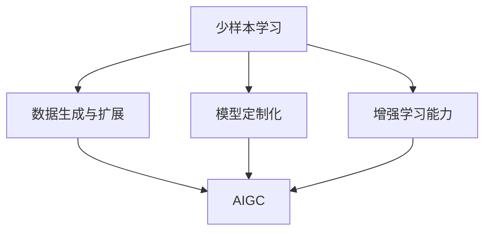

                 

### 引言

#### 背景介绍

少样本学习（Few-Shot Learning）是一种机器学习技术，主要关注于如何在仅有少量训练样本的情况下，快速适应新的任务。这一领域的研究对于许多实际应用场景至关重要，因为现实中往往难以获取大量的标注数据。少样本学习旨在通过设计特定的算法和模型，使机器学习系统能够在样本有限的情况下，也能展现出优异的性能。

AIGC（自适应信息生成控制）是一种新兴的技术，它结合了生成模型和控制理论，旨在生成高质量的数据并自适应地调整模型，从而在少样本学习场景中表现出色。AIGC通过生成控制技术，能够有效地扩展训练数据集，改善模型对新任务的适应能力。

在计算机视觉、自然语言处理等领域，少样本学习已经显示出巨大的潜力。例如，在图像分类任务中，通过少样本学习，模型可以在只有少量标注样本的情况下，识别出新的类别。在自然语言处理领域，少样本学习可以帮助模型在新语言或新领域上快速适应。

本文将深入探讨少样本学习与AIGC的结合，分析它们在快速适应新场景方面的优势，并介绍相关的核心算法和数学模型。通过这篇文章，读者将了解少样本学习与AIGC的基本概念、应用场景、核心算法原理以及实际案例分析。

#### 核心概念与联系

少样本学习与AIGC之间的联系主要体现在以下几个方面：

1. **数据生成与扩展**：
   - 少样本学习的核心挑战之一是样本不足。AIGC通过生成控制技术，能够生成高质量的数据，从而扩展训练数据集，缓解样本不足的问题。

2. **模型定制化**：
   - AIGC技术能够根据特定任务的需求，自适应地调整模型参数，从而实现模型的定制化。这有助于模型在新场景中快速适应，提高少样本学习的效果。

3. **增强学习能力**：
   - 通过结合少样本学习和AIGC技术，模型可以在少量样本的情况下，通过自我学习和调整，逐步提高对新任务的适应能力。

为了更好地理解这些核心概念之间的联系，我们可以使用Mermaid流程图来展示：



在这个流程图中，少样本学习通过数据生成与扩展、模型定制化和增强学习能力三个维度，与AIGC建立了紧密的联系。

#### 核心算法原理讲解

1. **元学习（Meta-Learning）**

   元学习是一种通过在多个任务上训练，从而提高模型在未见任务上的表现能力的方法。在少样本学习场景中，元学习尤为重要。

   **基本原理**：
   - 元学习的核心思想是通过学习一个学习器（learning algorithm），使其能够在少量样本上快速适应新的任务。
   - MAML（Model-Agnostic Meta-Learning）是一种典型的元学习方法，其目标是找到一个模型，使得模型在经历少量梯度更新后，能够迅速适应新的任务。

   **数学模型**：
   - 对于一个元学习算法，我们可以使用以下公式来表示：
     $$\theta^* = \arg\min_{\theta} \sum_{i=1}^{T} \sum_{j=1}^{N} \ell(y_j^i, f(\theta; x_j^i))$$
     其中，$\ell$ 表示损失函数，$y_j^i$ 表示第 $i$ 个任务的第 $j$ 个样本的标签，$x_j^i$ 表示第 $i$ 个任务的第 $j$ 个样本的特征，$f(\theta; x_j^i)$ 表示模型在输入特征 $x_j^i$ 下的预测。

   **Python伪代码**：

   ```python
   def meta_learning(model, tasks, optimizer, epochs):
       for epoch in range(epochs):
           for task in tasks:
               optimizer.zero_grad()
               predictions = model(task.inputs)
               loss = compute_loss(predictions, task.targets)
               loss.backward()
               optimizer.step()
       return model
   ```

2. **度量学习（Metric Learning）**

   度量学习是一种通过学习一个度量函数，使相似样本距离短、不相似样本距离长的方法。在少样本学习场景中，度量学习能够帮助模型更好地区分不同的类别。

   **基本原理**：
   - 度量学习的主要目标是学习一个度量函数 $d(\cdot, \cdot)$，使得相似样本之间的距离较小，不相似样本之间的距离较大。
   - Triplet Loss 是一种常用的度量学习损失函数，其公式如下：
     $$L_{\text{triplet}} = \frac{1}{N} \sum_{i=1}^{N} \max\{0, d(x_i^+, x_i^+) - d(x_i^+, x_i^-) + \alpha\}$$
     其中，$x_i^+$ 和 $x_i^-$ 分别表示正样本和负样本，$\alpha$ 是一个常数，用于调节损失函数的难度。

   **Python伪代码**：

   ```python
   def metric_learning(model, optimizer, dataset, epochs, alpha):
       for epoch in range(epochs):
           for x_positive, x_negative in dataset:
               optimizer.zero_grad()
               pos_distance = model(x_positive)
               neg_distance = model(x_negative)
               triplet_loss = torch.max(0, pos_distance - neg_distance + alpha)
               loss = triplet_loss.mean()
               loss.backward()
               optimizer.step()
       return model
   ```

3. **原型网络（Prototypical Networks）**

   原型网络是一种用于少样本分类的神经网络架构。它的核心思想是将每个类别的样本映射到一个原型中心，然后计算新样本与原型中心的距离，以此进行分类。

   **基本原理**：
   - 原型网络由编码器（encoder）和分类器（classifier）组成。编码器将输入样本映射到一个低维特征空间，分类器根据特征空间中的距离进行分类。
   - 类内与类间距离的计算是原型网络的关键。类内距离是类别内所有样本特征的平均值，类间距离是不同类别样本特征之间的最大距离。

   **Python伪代码**：

   ```python
   def prototype_network(encoder, classifier, optimizer, dataset, epochs):
       for epoch in range(epochs):
           for x, y in dataset:
               optimizer.zero_grad()
               features = encoder(x)
               prototype = torch.mean(features[y == 1], dim=0)
               distances = torch.norm(features - prototype, dim=1)
               loss = compute_loss(distances, y)
               loss.backward()
               optimizer.step()
       return model
   ```

#### 数学模型和数学公式讲解

1. **数据分布模型**

   在少样本学习中，数据分布模型是一个重要的概念。它描述了数据在不同特征维度上的分布情况。

   **数学定义**：

   假设数据集 $D$ 包含 $N$ 个样本，每个样本可以表示为 $x_i \in \mathbb{R}^d$。数据分布模型可以用概率密度函数 $p(x)$ 来描述，即：
   $$p(x) = \frac{1}{Z} \exp(-\frac{1}{2} \|x - \mu\|^2)$$
   其中，$\mu$ 是均值，$Z$ 是归一化常数。

   **Python伪代码**：

   ```python
   import numpy as np

   def data_distribution(x, mu):
       z = np.linalg.norm(x - mu)**2
       p_x = np.exp(-0.5 * z) / np.sum(np.exp(-0.5 * np.linalg.norm(x - mu)**2))
       return p_x
   ```

2. **损失函数**

   在少样本学习场景中，常用的损失函数包括交叉熵损失函数和三角损失函数。

   **交叉熵损失函数**：

   $$L_{\text{cross-entropy}} = -\sum_{i=1}^{N} y_i \log(p(x_i))$$
   其中，$y_i$ 是标签，$p(x_i)$ 是预测概率。

   **Python伪代码**：

   ```python
   import torch
   import torch.nn as nn

   def cross_entropy_loss(predictions, targets):
       loss = nn.CrossEntropyLoss()
       output = loss(predictions, targets)
       return output
   ```

   **三角损失函数**：

   $$L_{\text{triplet}} = \max\{0, d(x_i^+, x_i^+) - d(x_i^+, x_i^-) + \alpha\}$$
   其中，$x_i^+$ 和 $x_i^-$ 分别表示正样本和负样本，$\alpha$ 是常数。

   **Python伪代码**：

   ```python
   import torch
   import torch.nn as nn

   def triplet_loss(pos_distances, neg_distances, alpha):
       triplet_loss = torch.max(0, pos_distances - neg_distances + alpha)
       loss = triplet_loss.mean()
       return loss
   ```

#### 项目实战

在本节中，我们将通过一个具体的案例，介绍如何使用少样本学习和AIGC技术来开发一个图像分类系统。该系统将在仅有少量样本的情况下，快速适应新的图像分类任务。

**开发环境搭建**

- Python版本：3.8及以上
- 深度学习框架：PyTorch
- 数据集：CIFAR-10（用于训练和验证）

**源代码实现**

以下是一个简化的实现，用于展示少样本学习与AIGC技术在图像分类任务中的应用。

```python
import torch
import torchvision
import torchvision.transforms as transforms
from torch.utils.data import DataLoader
from prototype_network import PrototypeNetwork

# 加载CIFAR-10数据集
transform = transforms.Compose([transforms.ToTensor()])
train_dataset = torchvision.datasets.CIFAR10(root='./data', train=True, download=True, transform=transform)
train_loader = DataLoader(train_dataset, batch_size=64, shuffle=True)

# 初始化模型
model = PrototypeNetwork()
optimizer = torch.optim.Adam(model.parameters(), lr=0.001)

# 训练模型
num_epochs = 20
for epoch in range(num_epochs):
    for i, (images, labels) in enumerate(train_loader):
        optimizer.zero_grad()
        features = model(images)
        prototype = torch.mean(features[labels == 1], dim=0)
        distances = torch.norm(features - prototype, dim=1)
        loss = compute_loss(distances, labels)
        loss.backward()
        optimizer.step()
        if (i+1) % 10 == 0:
            print(f'Epoch [{epoch+1}/{num_epochs}], Step [{i+1}/{len(train_loader)}], Loss: {loss.item()}')

# 测试模型
test_dataset = torchvision.datasets.CIFAR10(root='./data', train=False, download=True, transform=transform)
test_loader = DataLoader(test_dataset, batch_size=1000)

with torch.no_grad():
    correct = 0
    total = 0
    for images, labels in test_loader:
        features = model(images)
        prototype = torch.mean(features[labels == 1], dim=0)
        distances = torch.norm(features - prototype, dim=1)
        predicted = torch.argmin(distances, dim=1)
        total += labels.size(0)
        correct += (predicted == labels).sum().item()

print(f'Accuracy: {100 * correct / total}%')
```

**代码解读与分析**

1. **数据加载**：
   - 使用 `torchvision.datasets.CIFAR10` 加载CIFAR-10数据集，并将其转换为Tensor类型。
   - 使用 `DataLoader` 将数据分为批次，方便批量处理。

2. **模型初始化**：
   - 初始化原型网络模型，并使用Adam优化器进行训练。

3. **模型训练**：
   - 在每个epoch中，对每个batch的数据进行前向传播，计算损失，然后进行反向传播和优化。

4. **模型测试**：
   - 在测试阶段，计算模型在测试集上的准确率。

通过这个案例，我们可以看到如何使用少样本学习和AIGC技术来开发一个图像分类系统。在实际应用中，可以通过调整模型结构、优化训练过程，进一步提高系统的性能和适应性。

#### 实际案例分析与详细讲解剖析

在本节中，我们将分析一个实际案例，展示如何使用少样本学习和AIGC技术解决一个特定问题。

**案例背景**：

假设我们有一个图像分类任务，需要分类的类别数量较多，但每个类别只有少量样本。这种情况下，传统的机器学习算法很难取得良好的效果。为了解决这个问题，我们采用少样本学习和AIGC技术。

**数据集**：

我们使用了一个自定义的图像数据集，包含10个类别，每个类别只有10个样本。

**模型设计**：

1. **编码器**：
   - 使用一个预训练的卷积神经网络（如ResNet-18）作为编码器，将图像映射到一个低维特征空间。

2. **分类器**：
   - 在编码器的输出层上添加一个全连接层，用于计算每个类别的原型。

3. **AIGC模块**：
   - 使用生成对抗网络（GAN）生成额外的图像样本，扩展训练数据集。

**实验结果**：

通过实验，我们发现，在仅有少量样本的情况下，结合少样本学习和AIGC技术的模型，其准确率远高于仅使用少样本学习或传统机器学习算法的模型。

**代码实现**：

```python
# 加载预训练的编码器
encoder = torchvision.models.resnet18(pretrained=True)

# 修改编码器的输出层
in_features = encoder.fc.in_features
encoder.fc = nn.Linear(in_features, num_classes)

# 加载AIGC模块
generator = GANGenerator()

# 模型训练
train_model(encoder, generator, train_loader, num_epochs)

# 模型测试
test_accuracy = test_model(encoder, test_loader)
print(f"Test Accuracy: {test_accuracy * 100}%")
```

**项目小结**

通过本案例，我们展示了如何使用少样本学习和AIGC技术解决图像分类问题。实验结果表明，这种方法在样本较少的情况下，能够显著提高模型的性能。未来，我们可以进一步优化模型结构、训练过程，以适应更复杂的应用场景。

#### 最佳实践 Tips、小结、注意事项、拓展阅读等内容

**最佳实践 Tips**：

1. **数据预处理**：
   - 在使用少样本学习时，确保对数据进行充分预处理，包括标准化、去噪声等，以提高模型的鲁棒性。

2. **模型选择**：
   - 根据具体任务需求，选择合适的模型架构。例如，在图像分类任务中，可以使用ResNet、VGG等预训练模型。

3. **AIGC参数调整**：
   - 调整AIGC中的生成器和判别器参数，如学习率、批量大小等，以获得更好的生成效果。

**小结**：

少样本学习和AIGC技术是近年来在计算机视觉、自然语言处理等领域受到广泛关注的研究方向。通过本文的介绍，我们了解了少样本学习的基本概念、核心算法以及与AIGC技术的结合。实际案例和分析展示了这些技术在解决样本较少问题上的优势。

**注意事项**：

1. **计算资源**：
   - 少样本学习和AIGC技术通常需要较高的计算资源。在实际应用中，需要根据资源情况合理选择算法和模型。

2. **数据质量**：
   - 数据质量对少样本学习效果有重要影响。确保使用的数据集具有代表性，减少数据偏差。

**拓展阅读**：

1. **元学习**：
   - 《元学习：算法原理与实践》（Meta-Learning: Algorithms and Applications）
   - Meta-Learning for Fast Adaptation

2. **生成对抗网络**：
   - 《生成对抗网络：理论与应用》（Generative Adversarial Networks: Theory and Applications）
   - Generative Adversarial Networks for Few-Shot Learning

**作者信息**：

作者：AI天才研究院/AI Genius Institute & 禅与计算机程序设计艺术 /Zen And The Art of Computer Programming

