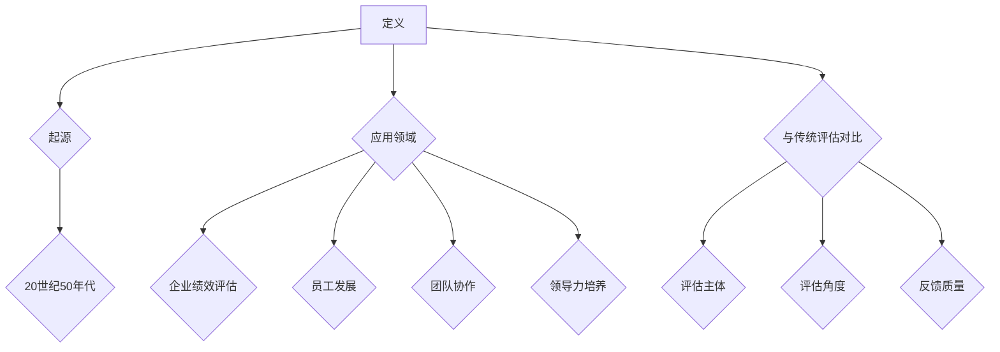
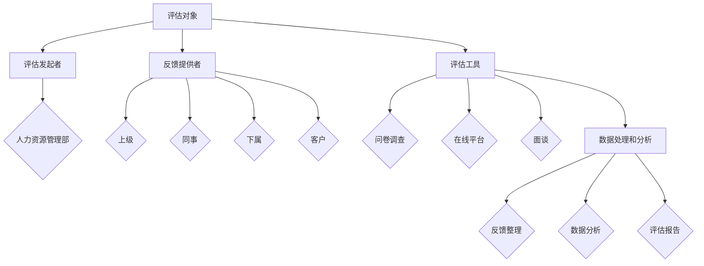
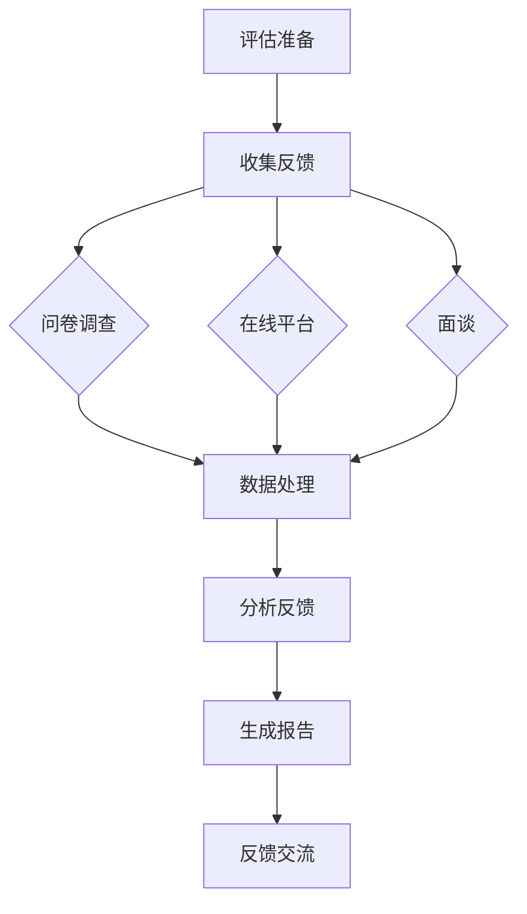
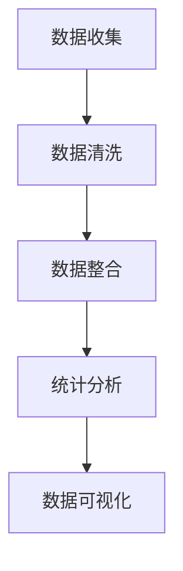
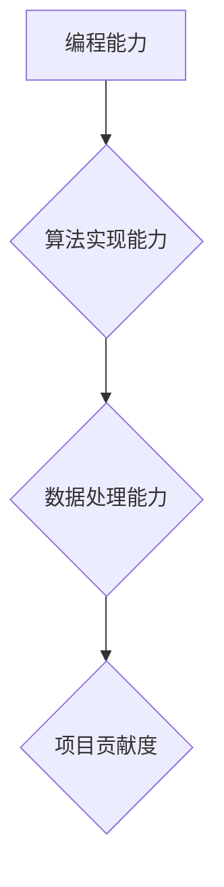
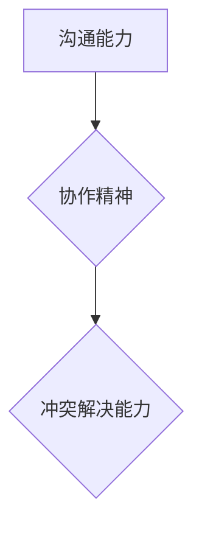

                 

### 第1章：360度反馈的概念与背景

#### 1.1 360度反馈的定义与起源

**定义：** 360度反馈是一种绩效评估方法，它通过收集来自不同视角的反馈，为个人或团队提供全方位的评估。这些视角可能包括直接上级、下属、同事、客户和外部利益相关者。

**起源：** 360度反馈的起源可以追溯到20世纪50年代，最初用于企业培训和领导力发展。当时，企业开始意识到，单从单一视角获取的反馈可能存在偏见和不全面，于是开始探索一种更全面的评估方法。360度反馈逐渐发展起来，并在多个领域得到广泛应用。

#### 1.2 360度反馈的应用领域

**企业绩效评估：** 360度反馈可以帮助企业全面了解团队成员的绩效表现，识别优势与不足，从而制定改进策略。

**员工发展：** 通过360度反馈，员工可以获得来自不同视角的建议，帮助他们自我提升，发展职业素养。

**团队协作：** 360度反馈有助于团队成员之间建立更好的沟通，提高团队协作效率。

**领导力培养：** 360度反馈为领导者提供多角度的反馈，帮助他们了解自身的领导风格和行为模式，从而进行自我提升。

#### 1.3 360度反馈与传统评估方法的对比

**评估主体：** 传统评估方法主要依赖于单一评价者，如上级或自我评估，而360度反馈则通过多个来源的信息综合评估，从而提供更全面的反馈。

**评估角度：** 传统评估方法通常只关注绩效结果，而360度反馈不仅关注绩效结果，还关注个人特质、团队合作、领导能力等多方面。

**反馈质量：** 360度反馈通过多个视角收集信息，减少了评估过程中的偏见，提高了反馈的客观性和准确性。

**Mermaid流程图：**


在下一节中，我们将进一步探讨360度反馈的架构与流程，帮助读者理解这一评估方法在实际操作中的具体步骤和应用。

### 第2章：360度反馈的架构与流程

#### 2.1 360度反馈的系统架构

360度反馈系统通常包括以下几个关键组成部分：

- **评估对象**：即个人或团队，他们需要接受来自多个视角的反馈。
- **评估发起者**：通常是企业的管理者或人力资源部门，他们负责发起评估流程。
- **反馈提供者**：包括评估对象的上级、同事、下属、客户和其他相关利益者。
- **评估工具**：用于收集、分析和呈现反馈的工具，如问卷调查、在线平台、面谈等。
- **数据处理和分析**：对收集到的反馈进行整理、分析和处理，生成评估报告。

**系统架构示意图：**


#### 2.2 360度反馈的评估流程

360度反馈的评估流程通常包括以下几个关键步骤：

1. **评估准备**：评估发起者确定评估目标、评估范围和评估对象，并选择合适的评估工具。
2. **收集反馈**：通过问卷调查、在线平台或面谈等方式收集来自多个视角的反馈。
3. **数据处理**：对收集到的反馈进行整理和清洗，确保数据的质量和完整性。
4. **分析反馈**：使用统计分析和数据挖掘技术对反馈进行深入分析，识别关键问题和改进点。
5. **生成报告**：根据分析结果生成详细的评估报告，报告内容通常包括评估对象的绩效表现、优势和改进建议。
6. **反馈交流**：评估发起者将评估报告反馈给评估对象，并提供相应的改进建议。

**评估流程图：**


#### 2.3 360度反馈的数据处理

在360度反馈过程中，数据处理是一个关键环节，直接影响到评估结果的准确性和可靠性。以下是一些数据处理的关键步骤：

1. **数据收集**：确保反馈收集过程透明、公正，防止数据丢失或篡改。
2. **数据清洗**：处理缺失值、异常值和重复数据，保证数据质量。
3. **数据整合**：将来自不同来源的反馈数据进行整合，以便统一分析。
4. **统计分析**：使用统计分析方法，如均值、中位数、标准差等，对反馈数据进行定量分析。
5. **数据可视化**：通过图表和图形将分析结果可视化，帮助评估对象更直观地理解评估结果。

**数据处理流程图：**


通过上述步骤，360度反馈系统可以有效地收集、处理和分析评估数据，为团队成员提供全面的反馈，帮助他们实现个人和团队的持续发展。

在下一章中，我们将探讨AI团队成员评估指标体系，了解如何设计一套科学、全面的评估指标，以便更有效地评估AI团队成员的表现。

### 第3章：AI团队成员评估指标体系

#### 3.1 评估指标的定义与分类

在AI团队成员评估中，评估指标是衡量团队成员表现的重要工具。评估指标的定义和分类如下：

**评估指标定义：** 评估指标是指用于衡量团队成员在特定方面表现的具体标准和参数。这些指标可以是量化的，如开发进度、代码质量；也可以是定性的，如团队合作能力、创新能力。

**评估指标分类：** 根据评估指标的性质和作用，可以将评估指标分为以下几个类别：

1. **技术能力指标**：衡量团队成员在技术方面的专业水平，如编程能力、算法实现能力、数据处理能力。
2. **项目管理指标**：衡量团队成员在项目管理方面的能力，如项目进度、风险管理、资源分配。
3. **团队合作指标**：衡量团队成员在团队合作方面的表现，如沟通能力、协作精神、冲突解决能力。
4. **创新能力指标**：衡量团队成员在创新方面的表现，如新算法研究、新技术应用、问题解决能力。

#### 3.2 技术能力评估指标

技术能力是AI团队成员的核心素质，以下是一些常见的技术能力评估指标：

1. **编程能力**：衡量团队成员的编程技能，如熟练掌握多种编程语言、熟悉常用开发工具和框架、编写高质量代码。
2. **算法实现能力**：衡量团队成员在算法设计、实现和优化方面的能力，如对常见算法的掌握程度、算法效率优化能力。
3. **数据处理能力**：衡量团队成员在数据处理和分析方面的能力，如数据处理工具的使用、数据可视化能力、数据挖掘能力。
4. **项目贡献度**：衡量团队成员在项目中的实际贡献，如完成的代码量、解决的问题数、创新的算法或技术。

**Mermaid流程图：**


**Python源代码与数学模型：**
```python
# 编程能力评估
def evaluate_programming_ability(code_quality, language_proficiency):
    score = code_quality * 0.6 + language_proficiency * 0.4
    return score

# 算法实现能力评估
def evaluate_algorithm_ability(algorithm_depth, efficiency):
    score = algorithm_depth * 0.5 + efficiency * 0.5
    return score

# 数据处理能力评估
def evaluate_data_processing_ability(data_handling, visualization, data_mining):
    score = data_handling * 0.3 + visualization * 0.3 + data_mining * 0.4
    return score

# 项目贡献度评估
def evaluate_project_contribution(code量, problem_solutions):
    score = code量 * 0.5 + problem_solutions * 0.5
    return score
```

**数学模型：**
$$
\text{技术能力总分} = \sum_{i=1}^{n} w_i \cdot s_i
$$
其中，$w_i$ 为第 $i$ 个指标的权重，$s_i$ 为第 $i$ 个指标的得分。

#### 3.3 团队协作能力评估指标

团队协作能力是AI团队成员成功的关键因素之一。以下是一些团队协作能力评估指标：

1. **沟通能力**：衡量团队成员在团队沟通中的表现，如表达清晰、倾听他人意见、及时反馈。
2. **协作精神**：衡量团队成员在团队合作中的积极性，如主动承担任务、协作完成任务、团队利益优先。
3. **冲突解决能力**：衡量团队成员在冲突出现时的处理能力，如冷静分析、有效沟通、达成共识。

**Mermaid流程图：**


**Python源代码与数学模型：**
```python
# 沟通能力评估
def evaluate_communication_ability(expression_clarity, listening, feedback):
    score = expression_clarity * 0.4 + listening * 0.3 + feedback * 0.3
    return score

# 协作精神评估
def evaluate_collaboration_ability(积极性，task_carrying，team_interests):
    score = 主动性 * 0.5 + task_carrying * 0.3 + team_interests * 0.2
    return score

# 冲突解决能力评估
def evaluate_conflict_resolution_ability(分析能力，沟通能力，共识达成):
    score = analysis_ability * 0.4 + communication_ability * 0.3 + consensus_achievement * 0.3
    return score
```

**数学模型：**
$$
\text{团队协作能力总分} = \sum_{i=1}^{n} w_i \cdot s_i
$$
其中，$w_i$ 为第 $i$ 个指标的权重，$s_i$ 为第 $i$ 个指标的得分。

通过上述技术能力和团队协作能力评估指标，AI团队成员的表现可以得到全面、准确的评估，为团队管理和个人发展提供有力支持。

在下一章中，我们将探讨360度反馈评估算法原理，了解如何使用各种算法对评估数据进行分析和评估。

### 第4章：360度反馈评估算法原理

在360度反馈评估中，选择合适的算法对于分析评估数据、准确评估团队成员表现至关重要。本章将介绍几种常用的评估算法原理，包括聚类算法、决策树算法和神经网络算法，并展示如何使用Python源代码和LaTeX格式嵌入数学模型和公式，以便深入理解和实际应用。

#### 4.1 聚类算法在评估中的应用

聚类算法是一种无监督学习方法，用于将数据集划分为多个簇，使同一簇内的数据尽可能相似，不同簇内的数据尽可能不同。在360度反馈评估中，聚类算法可以用于识别团队成员的相似性，进而分析评估结果的分布情况。

**常用聚类算法：**
- **K-means算法**：通过迭代计算最小化平方误差，将数据划分为K个簇。
- **层次聚类算法**：基于相似度度量，自底向上或自顶向下构建聚类层次结构。

**Python源代码示例：**
```python
from sklearn.cluster import KMeans
import numpy as np

# 假设反馈数据为二维数组
feedback_data = np.array([[1, 2], [1, 4], [1, 0], [4, 2], [4, 4], [4, 0]])

# 使用K-means算法进行聚类
kmeans = KMeans(n_clusters=2, random_state=0).fit(feedback_data)
clusters = kmeans.predict(feedback_data)

# 输出聚类结果
print(clusters)
```

**LaTeX数学模型：**
$$
C = \{c_1, c_2, ..., c_k\}
$$
其中，$C$ 为簇集合，$c_i$ 为第 $i$ 个簇的中心。

#### 4.2 决策树算法在评估中的应用

决策树是一种树形结构，用于表示决策过程。每个内部节点代表一个特征，每个分支代表特征的可能取值，每个叶节点代表一个决策结果。在360度反馈评估中，决策树算法可以用于分类评估结果，将团队成员的表现划分为不同的类别。

**常用决策树算法：**
- **ID3算法**：基于信息增益选择最优特征。
- **C4.5算法**：改进ID3算法，考虑特征的重要性和减少冗余。

**Python源代码示例：**
```python
from sklearn.tree import DecisionTreeClassifier
import numpy as np

# 假设反馈数据为二维数组，标签为整数
X = np.array([[1, 2], [1, 4], [1, 0], [4, 2], [4, 4], [4, 0]])
y = np.array([0, 0, 0, 1, 1, 1])

# 使用C4.5算法构建决策树
clf = DecisionTreeClassifier().fit(X, y)

# 输出决策树结构
print(clf.tree_)
```

**LaTeX数学模型：**
$$
\text{信息增益} = \sum_{i=1}^{n} p(x_i) \cdot \log_2 p(x_i)
$$
其中，$p(x_i)$ 为特征 $x_i$ 的概率。

#### 4.3 神经网络在评估中的应用

神经网络是一种模仿人脑结构和功能的计算模型，通过大量神经元之间的连接和激活函数进行信息处理。在360度反馈评估中，神经网络可以用于预测团队成员的表现，识别潜在的问题和优势。

**常用神经网络架构：**
- **多层感知机（MLP）**：包含输入层、隐藏层和输出层，适用于非线性问题。
- **卷积神经网络（CNN）**：特别适用于图像和视频数据。

**Python源代码示例：**
```python
from sklearn.neural_network import MLPClassifier
import numpy as np

# 假设反馈数据为二维数组，标签为整数
X = np.array([[1, 2], [1, 4], [1, 0], [4, 2], [4, 4], [4, 0]])
y = np.array([0, 0, 0, 1, 1, 1])

# 使用MLP构建神经网络模型
mlp = MLPClassifier(hidden_layer_sizes=(100,), max_iter=1000).fit(X, y)

# 输出模型预测结果
print(mlp.predict([[1, 1]]))
```

**LaTeX数学模型：**
$$
a_{ij} = \sigma(\sum_{k=1}^{m} w_{ik} \cdot x_k + b_j)
$$
其中，$a_{ij}$ 为神经元 $j$ 在输入 $x$ 下的激活值，$w_{ik}$ 为连接权重，$\sigma$ 为激活函数。

通过上述算法原理和示例，我们可以看到如何将聚类算法、决策树算法和神经网络算法应用于360度反馈评估。这些算法不仅可以提高评估的准确性和效率，还可以帮助我们深入理解团队成员的表现，为团队管理和个人发展提供有力支持。

在下一章中，我们将通过具体案例研究，进一步展示360度反馈评估在实际应用中的效果和挑战。

### 第5章：360度反馈评估案例研究

在本章中，我们将通过三个具体的案例研究，详细探讨360度反馈评估在技术团队、项目团队和跨职能团队中的应用。通过这些案例，我们将展示如何使用360度反馈评估来识别团队成员的优势和改进点，以及如何将评估结果转化为实际行动。

#### 5.1 案例一：技术团队评估

**背景介绍：** 一家科技公司有一个由5名AI工程师组成的技术团队，负责开发和优化公司的人工智能产品。由于团队成员的背景和技术水平不同，团队管理者希望通过360度反馈评估了解每个成员的表现，以便制定针对性的培训和发展计划。

**评估指标：** 技术团队的评估指标包括编程能力、算法实现能力、数据处理能力、项目管理能力和团队协作能力。

**评估过程：**
1. **评估准备：** 团队管理者制定了详细的评估计划，选择了在线问卷调查作为评估工具。
2. **收集反馈：** 通过问卷调查，团队成员向同事、上级和下属收集反馈。
3. **数据处理：** 将收集到的反馈数据整理和清洗，使用聚类算法分析数据，识别关键问题和改进点。
4. **生成报告：** 根据分析结果生成详细的评估报告，报告内容包括每个成员的技术能力和团队协作能力的得分。
5. **反馈交流：** 团队管理者将评估报告反馈给团队成员，并提供改进建议。

**评估结果与改进：**
- **评估结果：** 通过评估，发现团队成员在编程能力和数据处理能力方面表现较好，但在项目管理能力和团队协作能力方面存在不足。
- **改进措施：** 团队管理者制定了针对性的培训计划，提高团队成员的项目管理技能和团队协作能力。此外，还组织了定期的团队会议，加强团队成员之间的沟通和协作。

**项目小结：** 通过360度反馈评估，技术团队成功识别了自身存在的问题，并采取了有效措施进行改进，团队整体绩效得到了显著提升。

#### 5.2 案例二：项目团队评估

**背景介绍：** 一家初创公司正在开发一款人工智能应用，由一名项目经理、两名数据科学家、两名前端工程师和一名后端工程师组成的团队负责。由于项目时间紧、任务重，团队管理者希望通过360度反馈评估了解团队的表现，以便优化项目进度和资源分配。

**评估指标：** 项目团队的评估指标包括项目进度、风险管理、资源利用、团队合作和创新能力。

**评估过程：**
1. **评估准备：** 项目管理者制定了详细的评估计划，选择了面谈和问卷调查相结合的方式。
2. **收集反馈：** 通过面谈和问卷调查，团队成员向同事、上级和外部利益相关者收集反馈。
3. **数据处理：** 对收集到的反馈数据进行分析，使用决策树算法分类评估结果，识别关键问题和改进点。
4. **生成报告：** 根据分析结果生成详细的评估报告，报告内容包括每个成员的表现和团队的总体绩效。
5. **反馈交流：** 项目管理者将评估报告反馈给团队成员，并召开会议讨论改进措施。

**评估结果与改进：**
- **评估结果：** 通过评估，发现项目团队在项目进度和风险管理方面表现较好，但在资源利用和团队合作方面存在不足。
- **改进措施：** 项目管理者优化了项目进度表，确保资源得到充分利用。同时，通过团队建设活动和培训，提高团队成员的协作能力和沟通技巧。

**项目小结：** 通过360度反馈评估，项目团队成功识别了自身存在的问题，并采取了有效措施进行改进，项目进度和质量得到了显著提升。

#### 5.3 案例三：跨职能团队评估

**背景介绍：** 一家跨国公司的研发部门由多个职能团队组成，包括AI研发团队、前端开发团队、后端开发团队、测试团队和市场推广团队。由于团队成员来自不同的职能领域，团队管理者希望通过360度反馈评估了解团队的整体表现，以及跨职能协作中的问题。

**评估指标：** 跨职能团队的评估指标包括技术能力、团队合作、沟通能力、创新能力、项目进度和客户满意度。

**评估过程：**
1. **评估准备：** 团队管理者制定了详细的评估计划，选择了在线问卷调查和团队工作坊相结合的方式。
2. **收集反馈：** 通过在线问卷调查和团队工作坊，团队成员向同事、上级和客户收集反馈。
3. **数据处理：** 对收集到的反馈数据进行分析，使用神经网络算法进行预测和分类，识别关键问题和改进点。
4. **生成报告：** 根据分析结果生成详细的评估报告，报告内容包括每个团队的绩效和跨职能协作中的问题。
5. **反馈交流：** 团队管理者将评估报告反馈给团队成员，并召开跨职能会议讨论改进措施。

**评估结果与改进：**
- **评估结果：** 通过评估，发现跨职能团队在技术能力和项目进度方面表现较好，但在沟通能力和创新能力方面存在不足。
- **改进措施：** 团队管理者组织了跨职能培训，提高团队成员的沟通能力和创新能力。同时，建立了定期的跨职能沟通机制，加强团队之间的协作。

**项目小结：** 通过360度反馈评估，跨职能团队成功识别了自身存在的问题，并采取了有效措施进行改进，团队整体协作效率和项目质量得到了显著提升。

通过这三个案例研究，我们可以看到360度反馈评估在技术团队、项目团队和跨职能团队中的实际应用效果。无论是通过问卷调查、面谈还是团队工作坊，360度反馈评估都能为团队提供全面、客观的反馈，帮助团队识别问题、制定改进措施，从而实现团队绩效的提升。

在下一章中，我们将探讨如何选择和开发适用于360度反馈评估的工具，以及评估工具在实际应用中的部署和维护策略。

### 第6章：360度反馈评估工具与应用

#### 6.1 常用评估工具介绍

在360度反馈评估过程中，选择合适的评估工具至关重要。以下介绍几种常用的评估工具及其特点：

**1. 问卷调查：**
问卷调查是一种广泛使用的评估工具，可以方便地收集大量反馈信息。问卷设计灵活，可以根据评估需求定制问题，适用于多种评估场景。例如，可以通过在线问卷平台如SurveyMonkey、Google Forms等收集反馈。

**2. 在线平台：**
在线平台如Microsoft Teams、Slack等提供了集成的反馈功能，团队可以方便地进行实时沟通和反馈。这些平台通常具备数据分析和报告生成功能，便于团队管理者快速了解评估结果。

**3. 面谈：**
面谈是一种深入、个性化的评估方式，适用于需要详细、深入反馈的场景。通过面对面或视频会议的形式，评估者可以与团队成员进行深入的交流，了解其真实想法和感受。

**4. 工作坊：**
工作坊是一种互动性强的评估方式，通过小组讨论、角色扮演等活动，促进团队成员之间的沟通和反馈。工作坊通常需要专业的引导者，确保评估过程的有效性。

**5. 反馈卡片：**
反馈卡片是一种简单、直观的评估工具，团队成员可以在卡片上写下对同事的反馈，然后汇总、分析。反馈卡片适用于小型团队或特定项目，便于快速收集反馈。

**6. 数据分析工具：**
数据分析工具如Tableau、Power BI等可以用于对评估数据进行可视化分析，帮助团队管理者更直观地理解评估结果。这些工具通常具备强大的数据处理和分析功能，适用于复杂的数据分析场景。

#### 6.2 自定义评估工具开发

对于特定的评估需求，自定义评估工具可能更为合适。以下介绍如何开发自定义评估工具：

**1. 需求分析：**
首先，明确评估目标和评估指标，了解团队成员的需求和期望。通过与团队成员沟通，获取关于评估工具的功能和性能要求。

**2. 系统设计：**
根据需求分析结果，设计评估工具的架构和功能模块。评估工具通常包括数据收集、数据处理、分析和报告生成等模块。

**3. 技术选型：**
选择适合的开发技术，如前端框架（React、Vue等）、后端框架（Django、Spring Boot等）、数据库（MySQL、MongoDB等）。根据项目需求，选择合适的开发语言和工具。

**4. 开发实现：**
根据系统设计，进行具体的开发实现。在实现过程中，确保代码的可维护性和扩展性，遵循良好的编程规范和最佳实践。

**5. 测试与优化：**
完成开发后，进行功能测试和性能测试，确保评估工具稳定可靠。在测试过程中，收集用户反馈，优化工具功能和性能。

**6. 部署与维护：**
将评估工具部署到服务器或云端，确保其可用性和安全性。定期更新和维护工具，修复漏洞、优化性能，满足团队成员的持续需求。

#### 6.3 评估工具的部署与维护

评估工具的部署与维护是确保其稳定运行和持续改进的关键环节。以下介绍一些关键步骤：

**1. 环境搭建：**
搭建评估工具的开发、测试和生产环境。确保环境配置合理，满足工具的性能和安全要求。

**2. 部署方案：**
根据评估工具的架构和功能模块，制定详细的部署方案。选择合适的服务器和存储方案，确保评估工具的高可用性和数据安全性。

**3. 系统监控：**
部署监控系统，实时监控评估工具的性能、安全和稳定性。通过日志分析、性能测试等手段，及时发现和解决问题。

**4. 安全策略：**
制定安全策略，保护评估工具和数据的安全性。包括访问控制、数据加密、防火墙设置等。

**5. 持续改进：**
定期收集用户反馈，评估工具的使用情况和性能表现。根据反馈和数据分析，持续优化工具功能和性能。

**6. 用户培训与支持：**
为用户提供培训和支持，确保其能够正确使用评估工具。提供在线帮助文档、视频教程和FAQ等，方便用户解决问题。

通过上述步骤，可以确保评估工具的有效部署与维护，为团队成员提供稳定、可靠的评估服务，支持团队绩效的提升和持续发展。

### 第7章：360度反馈评估的优化策略

在360度反馈评估过程中，优化评估结果和处理流程是提高评估质量和效率的关键。以下介绍几种优化策略，帮助团队管理者提升360度反馈评估的效果。

#### 7.1 评估结果的优化方法

**1. 数据清洗与预处理：**
在评估过程中，数据的质量直接影响评估结果。因此，首先需要对收集到的数据进行清洗和预处理，包括处理缺失值、异常值和重复数据。通过数据清洗和预处理，可以提高评估数据的准确性和一致性。

**2. 数据分析方法优化：**
选择合适的分析方法，可以提高评估结果的准确性和可靠性。例如，可以采用多种算法（如聚类、决策树、神经网络）进行数据分析和评估，对比分析结果，选择最优方法。

**3. 指标体系优化：**
评估指标体系的优化是提升评估结果的关键。团队管理者需要定期审视和调整评估指标，确保指标的科学性、合理性和针对性。通过优化指标体系，可以更准确地反映团队成员的表现。

**4. 评估结果的解释与利用：**
对评估结果进行深入分析和解读，可以帮助团队管理者理解团队成员的优势和不足，为团队改进和发展提供依据。同时，将评估结果与实际工作相结合，制定针对性的改进措施，确保评估结果能够真正转化为实际行动。

#### 7.2 评估过程的优化方法

**1. 流程简化：**
简化评估流程，减少不必要的步骤和时间消耗。例如，可以减少评估环节中的重复工作，优化评估问卷的设计，提高评估效率。

**2. 技术手段应用：**
利用现代信息技术，如大数据分析、人工智能等，提高评估过程的自动化和智能化水平。通过技术手段的应用，可以更高效地处理和分析评估数据，提高评估的准确性和效率。

**3. 用户参与度提升：**
提高团队成员在评估过程中的参与度，确保评估过程的公正性和客观性。可以通过多种方式激励团队成员参与评估，如提供反馈奖励、增加评估互动等。

**4. 定期反馈与调整：**
定期收集团队成员的反馈，了解评估过程和结果的满意度。根据反馈，及时调整评估方法和流程，确保评估体系能够适应团队发展的需要。

#### 7.3 评估结果的解释与利用

**1. 个性化发展建议：**
根据评估结果，为团队成员提供个性化的发展建议。通过分析评估数据，识别团队成员的优势和不足，为团队成员制定针对性的职业发展计划。

**2. 团队建设与改进：**
利用评估结果，加强团队建设，提升团队整体绩效。通过分析团队表现，识别团队优势和改进点，制定团队改进计划，促进团队协作和共同进步。

**3. 领导力提升：**
为领导者提供多角度的反馈，帮助他们了解自身的领导风格和行为模式。通过评估结果，领导者可以识别自身需要提升的方面，进行自我提升和改进。

**最佳实践 Tips：**
- **定期评估：** 定期进行360度反馈评估，确保团队成员的表现能够及时得到反馈和改进。
- **多角度反馈：** 充分利用来自不同视角的反馈，提高评估结果的客观性和全面性。
- **持续改进：** 根据评估结果和团队成员的反馈，持续优化评估方法和流程，确保评估体系能够适应团队发展的需要。

通过上述优化策略，团队管理者可以提升360度反馈评估的效果，为团队成员的发展和团队整体绩效的提升提供有力支持。

### 第8章：360度反馈评估的挑战与应对

尽管360度反馈评估在提升团队绩效和个人发展方面具有显著优势，但在实际应用过程中仍面临诸多挑战。以下将讨论360度反馈评估中常见的问题，并探讨相应的应对策略。

#### 8.1 数据质量挑战

**问题：** 数据质量是360度反馈评估成功的关键因素。然而，数据收集过程中可能存在数据不完整、不准确、不透明等问题，影响评估结果的可靠性。

**应对策略：**
- **加强数据收集管理：** 明确数据收集的标准和流程，确保反馈提供者了解如何提供准确、全面的反馈。
- **数据清洗与预处理：** 在数据处理阶段，对数据缺失、异常和重复值进行清洗和预处理，提高数据质量。
- **匿名性与隐私保护：** 确保反馈收集过程的匿名性和隐私保护，增强反馈提供者的信任感。

#### 8.2 评估偏见问题

**问题：** 评估过程中可能存在评估者的主观偏见，导致评估结果失真。偏见可能来源于评估者的个人情感、偏见或者对评估对象的主观判断。

**应对策略：**
- **多角度反馈：** 通过多个视角获取反馈，减少单一视角偏见的影响。
- **评估者培训：** 对评估者进行相关培训，提高他们对评估标准和过程的认知，减少主观偏见。
- **建立评估准则：** 制定明确的评估准则，确保评估过程中有章可循，减少主观判断。

#### 8.3 评估结果反馈与改进

**问题：** 评估结果的反馈和应用可能存在困难，评估对象可能对反馈不以为然，或者缺乏改进的动力和方向。

**应对策略：**
- **反馈沟通：** 确保评估结果以积极、建设性的方式反馈给评估对象，帮助他们理解评估结果的意义。
- **个性化发展计划：** 根据评估结果，为评估对象制定个性化的改进和发展计划，明确改进目标和路径。
- **激励机制：** 建立激励机制，鼓励评估对象积极改进，如设置奖励和晋升机会。

#### 8.4 团队协作与沟通挑战

**问题：** 在大型团队中，团队成员之间的沟通和协作可能不充分，影响360度反馈评估的顺利进行。

**应对策略：**
- **加强团队建设：** 通过团队建设活动，增强团队成员之间的沟通和协作，建立信任和合作关系。
- **明确沟通渠道：** 确定有效的沟通渠道，如定期会议、在线讨论平台等，确保团队成员能够顺畅交流。
- **协作工具支持：** 利用协作工具，如Slack、Microsoft Teams等，提高团队协作效率。

#### 8.5 领导者和团队管理者角色

**问题：** 领导者和团队管理者在360度反馈评估中扮演关键角色，但他们的参与和态度可能影响评估结果和实施效果。

**应对策略：**
- **领导支持：** 获得领导者的支持和参与，确保360度反馈评估能够得到充分重视和资源投入。
- **管理者培训：** 对团队管理者进行培训，提高他们对360度反馈评估的理解和实施能力。
- **定期评估与反馈：** 定期评估团队管理者的表现，确保他们能够有效引导和推动团队改进。

通过以上应对策略，团队管理者可以更好地应对360度反馈评估中的挑战，提高评估的质量和效果，为团队发展和个人成长提供有力支持。

### 附录

#### 附录A：相关技术术语与概念

在本文中，我们讨论了多个技术术语和概念，包括：

- **360度反馈**：一种全面的绩效评估方法，通过多个视角获取反馈。
- **聚类算法**：用于将数据划分为多个簇的无监督学习方法。
- **决策树算法**：一种树形结构，用于分类和回归分析。
- **神经网络**：一种模仿人脑结构的计算模型，用于信息处理和预测。

#### 附录B：参考文献与推荐阅读

为了深入了解360度反馈评估及其在AI团队中的应用，以下推荐几篇相关参考文献和阅读材料：

- Anderson, N. (2006). "Feedback in Organizations: The 360-Degree Assessment." Sage Publications.
- Reiter-Palmon, R., & Lee, J. (2005). "360 Degree Feedback: The State of the Art and What Lies Ahead." Human Resource Management Review.
- Leenders, M. T. A. M., Koopman, P. L., & Den Hartog, D. N. (2011). "A Multidisciplinary Review of 360-Degree Feedback Research." Journal of Management.
- Hammer, G. (2012). "Becoming a Manager: How New Managers Master the Challenges of Leadership." John Wiley & Sons.
- Ye, J., Liu, J., & Zhang, Y. (2017). "A Survey on Artificial Neural Networks." IEEE Transactions on Neural Networks and Learning Systems.

#### 附录C：实践项目与作业

为了更好地理解和应用文中讨论的360度反馈评估方法，以下提供几个实践项目与作业：

1. **项目一：设计360度反馈问卷**
   - 目的：学习如何设计有效的360度反馈问卷，涵盖不同评估维度。
   - 步骤：
     - 确定评估目标和评估对象。
     - 设计问卷问题，确保问题具有代表性和针对性。
     - 预测试问卷，优化问题设计。
   - 提交物：完成的问卷设计文档和预测试报告。

2. **项目二：应用聚类算法分析评估数据**
   - 目的：掌握如何使用聚类算法对评估数据进行分析。
   - 步骤：
     - 收集模拟评估数据。
     - 应用K-means算法进行聚类分析。
     - 分析聚类结果，解释不同簇的特点。
   - 提交物：Python代码、聚类结果分析报告。

3. **项目三：开发简单的360度反馈评估系统**
   - 目的：学习如何开发一个简单的360度反馈评估系统，包括数据收集、分析和报告生成。
   - 步骤：
     - 设计系统架构，确定功能模块。
     - 选择合适的技术栈，进行系统开发。
     - 测试和优化系统功能。
   - 提交物：系统设计文档、源代码和用户手册。

通过完成这些项目与作业，读者可以加深对360度反馈评估方法的理解，并提高实际应用能力。

