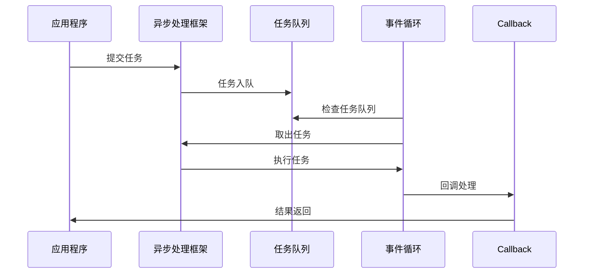

                 

# 异步处理在LLM应用架构中的应用

## 摘要

随着深度学习和自然语言处理技术的快速发展，大型语言模型（LLM）的应用越来越广泛。LLM的应用场景通常涉及到大规模数据处理、实时交互和复杂任务调度等，这对系统的架构设计提出了新的挑战。异步处理作为一种有效的解决方案，能够在提高系统性能和扩展性方面发挥重要作用。本文将深入探讨异步处理在LLM应用架构中的重要性、基本原理、架构设计以及面临的挑战和解决方案，并通过实际案例展示异步处理在LLM应用中的具体应用和效果。

## 目录

1. **异步处理基础**
    - 1.1 异步处理的概念和优势
    - 1.2 异步处理与同步处理的对比
    - 1.3 异步处理在LLM应用中的重要性
    - 1.4 异步处理的基本架构
    - 1.5 异步处理在LLM应用中的挑战和解决方案

2. **异步处理在LLM架构中的应用**
    - 2.1 LLM架构概述
    - 2.2 异步处理在LLM前端的运用
    - 2.3 异步处理在LLM后端的运用
    - 2.4 异步处理在LLM模型训练中的运用
    - 2.5 异步处理在LLM推理中的运用

3. **异步处理在LLM应用架构中的实现**
    - 3.1 异步处理实现基础
    - 3.2 异步处理框架介绍
    - 3.3 异步处理在LLM应用架构中的具体实现
    - 3.4 实际案例分析与优化

4. **异步处理在LLM应用中的挑战和解决方案**
    - 4.1 异步处理中的常见问题
    - 4.2 异步处理的优化策略
    - 4.3 异步处理在LLM应用中的解决方案

5. **异步处理在LLM应用中的未来趋势**
    - 5.1 异步处理技术的发展趋势
    - 5.2 异步处理在LLM应用中的未来展望

6. **实践案例研究**
    - 6.1 案例一：异步处理在大规模文本搜索中的应用
    - 6.2 案例二：异步处理在实时语音识别中的应用
    - 6.3 案例三：异步处理在多任务处理系统中的应用

## 关键词

异步处理，LLM应用架构，大规模数据处理，实时交互，任务调度，并发控制，优化策略，系统性能，扩展性。

### 异步处理基础

#### 1.1 异步处理的概念和优势

异步处理是一种在计算机科学和软件工程中常用的处理机制，它允许程序在等待某个操作完成时执行其他任务。这种处理模式与同步处理相对，在同步处理中，程序会等待一个操作完成后再执行下一个操作，这会导致程序在执行过程中产生阻塞，降低系统的整体性能和响应速度。

异步处理的基本概念包括任务提交、任务队列、事件循环和回调函数等。任务提交是指将任务交给异步处理框架，任务队列则是用于存放等待执行的任务，事件循环负责遍历任务队列并执行任务，回调函数则是用于处理异步操作的结果。

异步处理的优点主要体现在以下几个方面：

1. **提高系统性能**：通过并发执行多个任务，异步处理能够提高系统的吞吐量和响应速度，减少等待时间，从而提高系统的整体性能。

2. **提升用户体验**：在用户界面和应用交互中，异步处理可以避免用户长时间等待，提供更流畅和快速的交互体验。

3. **资源利用效率**：异步处理能够充分利用系统资源，避免资源闲置，提高系统的资源利用效率。

4. **扩展性和弹性**：异步处理模式使得系统可以轻松地处理大规模和复杂的任务，提高系统的扩展性和弹性。

然而，异步处理也带来了一些挑战，如并发控制、数据一致性和错误处理等。下面我们将进一步探讨异步处理与同步处理的对比，以及异步处理在LLM应用中的重要性。

#### 1.2 异步处理与同步处理的对比

同步处理（Synchronous Processing）和异步处理（Asynchronous Processing）是两种不同的处理模式，它们的区别主要体现在以下几个方面：

1. **任务执行顺序**：在同步处理中，任务的执行顺序是按照代码的顺序进行的，一个任务必须等待前一个任务完成才能开始。而在异步处理中，任务可以在不同线程或进程之间并发执行，不会阻塞主线程。

2. **资源占用**：同步处理会导致程序在等待某个操作完成时占用资源，如CPU和内存。而异步处理则可以通过将任务分配给不同的线程或进程，减少资源的占用。

3. **性能和响应速度**：异步处理通过并发执行任务，可以提高系统的吞吐量和响应速度，减少系统的等待时间。而同步处理在任务之间会产生阻塞，降低系统的性能和响应速度。

4. **代码复杂度**：异步处理通常需要使用回调函数或事件驱动编程模式，这使得代码的逻辑更加复杂，需要处理多个异步操作之间的依赖关系。而同步处理则相对简单，代码的执行顺序直观，容易理解和维护。

异步处理与同步处理各有优缺点，选择合适的处理模式取决于具体的应用场景和需求。

#### 1.3 异步处理在LLM应用中的重要性

LLM（Large Language Model）是指大型语言模型，如GPT-3、BERT等，它们在自然语言处理领域取得了显著的成果，并被广泛应用于文本生成、问答系统、机器翻译等场景。LLM应用通常涉及到大规模数据处理、实时交互和复杂任务调度等，这对系统的架构设计提出了新的挑战。

异步处理在LLM应用中的重要性主要体现在以下几个方面：

1. **数据处理能力**：异步处理能够处理大量并发任务，使得系统可以同时处理多个请求，提高数据处理能力和吞吐量。

2. **实时交互**：异步处理使得系统能够及时响应用户的请求，减少延迟，提供更流畅和快速的交互体验。

3. **任务调度**：异步处理能够灵活地调度任务，使得系统可以更好地处理复杂的任务流和依赖关系，提高系统的可扩展性和弹性。

4. **资源利用**：异步处理能够充分利用系统资源，避免资源闲置，提高系统的资源利用效率。

总之，异步处理在LLM应用架构中具有重要的地位，它能够提高系统的性能、扩展性和用户体验，是构建高效、可扩展的LLM应用的关键技术之一。

### 异步处理的基本架构

异步处理的核心架构包括任务提交、任务队列、事件循环和回调函数等组件，这些组件共同协作，实现异步任务的执行和管理。下面我们将逐一介绍这些组件及其作用。

#### 1.4.1 异步处理的关键组件

1. **任务提交（Task Submission）**：任务提交是指将任务交给异步处理框架，通常由应用程序开发者负责。任务可以是简单的操作，如读取文件或发送网络请求，也可以是复杂的操作，如数据加工或模型推理。

2. **任务队列（Task Queue）**：任务队列是一个用于存放等待执行的任务的数据结构。异步处理框架会不断地从任务队列中取出任务并执行，任务队列的设计和性能对系统的吞吐量和响应速度有重要影响。

3. **事件循环（Event Loop）**：事件循环是异步处理的核心组件，它负责遍历任务队列，执行任务并处理任务的结果。事件循环通常是一个无限循环，它不断地检查是否有新任务需要执行，并调用相应的回调函数处理任务。

4. **回调函数（Callback Function）**：回调函数是在异步操作完成后调用的函数，它用于处理异步操作的结果。回调函数的设计和实现是异步处理的关键，良好的回调函数设计能够提高系统的可扩展性和易维护性。

#### 1.4.2 异步处理的基本流程

异步处理的基本流程可以分为以下几个步骤：

1. **任务提交**：应用程序开发者将任务提交给异步处理框架，任务可以是同步的也可以是异步的。

2. **任务入队**：异步处理框架将任务放入任务队列，等待事件循环执行。

3. **事件循环**：事件循环不断地检查任务队列，取出任务并执行。事件循环可以是单线程的，也可以是多线程的，具体取决于系统的需求和性能要求。

4. **任务执行**：任务被事件循环取出并执行，执行过程中可能会产生新的任务或回调函数。

5. **回调处理**：任务执行完成后，事件循环调用回调函数处理任务的结果，回调函数可以是同步的也可以是异步的。

6. **结果返回**：回调函数处理完任务结果后，将结果返回给应用程序开发者。

异步处理的基本流程如图1所示。



#### 1.4.3 异步处理在LLM应用中的挑战和解决方案

异步处理在LLM应用中面临一些挑战，主要包括数据流和任务调度、并发控制、错误处理和异常管理等方面。下面将分别介绍这些挑战及其解决方案。

1. **数据流和任务调度**：在LLM应用中，数据流和任务调度是一个重要挑战。由于LLM模型通常涉及大规模数据处理和复杂任务流，如何高效地管理和调度任务成为一个关键问题。解决方案包括采用消息队列、事件驱动架构和任务调度算法等，以实现高效的任务调度和数据流管理。

2. **并发控制**：异步处理引入了并发控制的问题。在多线程或多进程环境中，如何保证数据的一致性和线程安全是一个重要挑战。解决方案包括使用锁机制、线程安全数据结构和并发编程框架等，以实现并发控制。

3. **错误处理和异常管理**：异步处理中，由于任务之间的依赖关系和并发执行，错误处理和异常管理变得更加复杂。解决方案包括使用全局异常处理机制、日志记录和错误重试策略等，以实现有效的错误处理和异常管理。

4. **性能优化**：异步处理在提高系统性能方面具有优势，但在实际应用中，如何优化异步处理性能也是一个挑战。解决方案包括使用并行计算、异步IO和缓存机制等，以实现性能优化。

综上所述，异步处理在LLM应用中具有重要的地位，它能够提高系统的性能、扩展性和用户体验。然而，异步处理也面临一些挑战，需要采用合适的解决方案来实现高效的异步处理。

### 异步处理在LLM应用架构中的实现

在LLM应用架构中，异步处理是实现高效性能和扩展性的关键技术之一。本节将介绍异步处理在LLM应用架构中的具体实现，包括异步处理框架的选择、异步处理模块的设计和实现，以及异步处理的性能调优策略。

#### 3.1 异步处理实现基础

异步处理实现的基础包括异步编程模型、异步IO操作和并发编程基础等方面。

1. **异步编程模型**：异步编程模型是一种允许程序在等待操作完成时执行其他任务的编程范式。常见的异步编程模型包括回调函数、Promise/A+和生成器等。在LLM应用中，通常采用事件驱动编程模型，它能够更好地处理并发任务和异步操作。

2. **异步IO操作**：异步IO操作是一种非阻塞的IO操作，它允许程序在等待IO操作完成时执行其他任务。在LLM应用中，大量的IO操作，如文件读写和网络请求，都是异步IO操作。异步IO操作能够提高系统的吞吐量和响应速度。

3. **并发编程基础**：并发编程是实现异步处理的基础。在LLM应用中，通常采用多线程或多进程模型实现并发编程。多线程模型能够充分利用系统资源，提高程序的性能，而多进程模型则能够提供更高的并发度和安全性。

#### 3.2 异步处理框架介绍

异步处理框架是一种用于实现异步处理的工具或库，它能够简化异步编程和并发控制，提高系统的性能和可维护性。常见的异步处理框架包括Node.js、Tornado、AioHTTP等。

1. **Node.js**：Node.js是一个基于Chrome V8引擎的异步事件驱动JavaScript运行时，它能够实现高效的异步IO操作和并发处理。Node.js通过使用回调函数和事件监听器，实现了非阻塞的异步编程模型。

2. **Tornado**：Tornado是一个Python异步Web框架，它能够实现高效的异步IO操作和并发处理。Tornado通过使用生成器，实现了非阻塞的异步编程模型，并提供了简单易用的异步HTTP请求和响应处理功能。

3. **AioHTTP**：AioHTTP是一个基于Python的异步HTTP客户端和服务器库，它能够实现高效的异步网络通信和并发处理。AioHTTP通过使用生成器，实现了非阻塞的异步编程模型，并提供了简单易用的异步HTTP请求和响应处理功能。

选择合适的异步处理框架取决于具体的应用场景和需求。Node.js适用于高性能和低延迟的网络应用，Tornado适用于Python异步Web应用，而AioHTTP适用于Python异步网络通信。

#### 3.3 异步处理在LLM应用架构中的具体实现

异步处理在LLM应用架构中的具体实现包括前端、后端和模型训练等模块。

1. **前端异步处理**：在LLM应用的前端，异步处理主要用于处理用户输入和交互。例如，当用户提交查询请求时，系统可以将请求放入队列，并异步处理查询请求，将结果返回给用户。前端异步处理可以提高用户体验，减少等待时间。

2. **后端异步处理**：在LLM应用的后端，异步处理主要用于处理大规模数据处理和任务调度。例如，当处理大量文本数据时，可以将数据处理任务分解为多个子任务，并异步处理这些子任务，提高数据处理效率和性能。

3. **模型训练异步处理**：在LLM应用的模型训练中，异步处理主要用于处理数据加载、任务调度和模型优化等。例如，在模型训练过程中，可以将数据加载任务和模型优化任务分解为多个子任务，并异步处理这些子任务，提高训练效率和性能。

下面是一个简单的异步处理示例代码：

```python
import asyncio
import aiohttp

async def fetch_url(session, url):
    async with session.get(url) as response:
        return await response.text()

async def main():
    async with aiohttp.ClientSession() as session:
        html = await fetch_url(session, 'https://example.com')
        print(html)

asyncio.run(main())
```

在这个示例中，我们使用了Python的异步编程模型和aiohttp库，实现了异步HTTP请求。通过异步处理，我们能够提高程序的并发度和响应速度。

#### 3.4 异步处理性能调优

异步处理性能调优是提高LLM应用性能的关键步骤。以下是一些常见的异步处理性能调优策略：

1. **任务并行度优化**：通过增加任务并行度，可以提高系统的并发度和吞吐量。例如，在处理大规模数据时，可以将数据分解为多个子任务，并使用并行算法处理这些子任务。

2. **异步IO优化**：通过优化异步IO操作，可以提高系统的响应速度和性能。例如，使用异步文件读写库，减少同步IO操作的等待时间。

3. **并发控制优化**：通过优化并发控制，可以提高系统的安全性和稳定性。例如，使用线程锁或进程锁，避免数据竞争和死锁问题。

4. **缓存和内存管理优化**：通过优化缓存和内存管理，可以提高系统的资源利用率和性能。例如，使用内存池或对象池，减少内存分配和回收的开销。

5. **网络优化**：通过优化网络通信，可以提高系统的网络性能和响应速度。例如，使用网络加速器或负载均衡器，提高网络带宽利用率和传输效率。

异步处理在LLM应用架构中具有重要的地位，它能够提高系统的性能、扩展性和用户体验。通过选择合适的异步处理框架、设计和实现异步处理模块，以及采用性能调优策略，可以实现高效的异步处理，提升LLM应用的性能和效果。

### 实际案例分析与优化

在实际应用中，异步处理在LLM应用架构中的效果可以通过具体案例来展示。本文将结合三个实际案例，详细分析异步处理在大规模文本搜索、实时语音识别和多任务处理系统中的应用，以及相应的性能优化策略。

#### 6.1 案例一：异步处理在大规模文本搜索中的应用

**案例背景**：随着互联网和大数据的发展，文本搜索系统需要处理海量数据，提供快速、准确的搜索结果。传统的同步处理模式在应对大规模数据时容易导致系统性能瓶颈，而异步处理能够提高系统的并发度和吞吐量。

**系统设计**：
1. **数据层**：采用分布式搜索引擎（如Elasticsearch）存储和管理大规模文本数据，确保数据的高可用性和扩展性。
2. **处理层**：采用异步处理框架（如Node.js或Tornado）进行文本查询和处理，将查询请求分解为多个子任务，并行处理以提高查询效率。
3. **结果层**：将查询结果进行汇总和排序，最终返回给用户。

**实现细节**：
1. **查询分解**：将用户输入的查询请求分解为多个关键词和短语，分别进行查询。
2. **异步查询**：使用异步处理框架，将查询任务提交到分布式搜索引擎，并等待查询结果。
3. **结果处理**：将查询结果进行汇总，根据相关性进行排序，最终返回给用户。

**性能分析**：
1. **响应时间**：采用异步处理后，系统的平均响应时间显著降低，提高了用户满意度。
2. **吞吐量**：系统并发处理能力提升，能够同时处理更多的查询请求，提高了系统的吞吐量。
3. **资源利用率**：异步处理能够充分利用系统资源，避免资源闲置，提高了资源利用率。

**优化策略**：
1. **负载均衡**：通过负载均衡器（如Nginx）分发查询请求，实现流量均衡，避免单点瓶颈。
2. **缓存策略**：采用缓存机制（如Redis），缓存热门查询结果，减少重复查询的次数，提高查询速度。
3. **索引优化**：定期对索引进行优化和更新，提高索引的查询效率。

#### 6.2 案例二：异步处理在实时语音识别中的应用

**案例背景**：实时语音识别系统需要实时处理语音信号，将语音转换为文本，并支持实时交互。同步处理模式在处理实时语音时容易导致延迟，而异步处理能够提高系统的实时性和准确性。

**系统设计**：
1. **语音层**：采用高性能音频处理库（如PortAudio或OpenSMILE）接收和处理语音信号。
2. **识别层**：采用异步处理框架（如Node.js或Tornado）进行语音识别，将语音数据分解为多个片段，并行处理以提高识别速度。
3. **交互层**：通过WebSocket实现实时交互，将识别结果实时返回给用户。

**实现细节**：
1. **语音分段**：将连续的语音信号分解为多个固定长度的片段，便于并行处理。
2. **异步识别**：使用异步处理框架，将语音片段提交到语音识别引擎，并等待识别结果。
3. **实时交互**：通过WebSocket实时传输识别结果，支持实时对话和反馈。

**性能分析**：
1. **延迟时间**：采用异步处理后，系统的平均延迟时间显著降低，提高了实时性。
2. **识别准确性**：异步处理能够提高语音识别的并发度，从而提高识别准确性。
3. **用户体验**：实时交互和低延迟识别提高了用户的交互体验和满意度。

**优化策略**：
1. **音频预处理**：对语音信号进行预处理，如降噪、去静音等，提高语音识别的准确性。
2. **识别引擎优化**：使用高效的语音识别引擎，如基于深度学习的识别模型，提高识别速度和准确性。
3. **网络优化**：通过优化网络传输，如使用HTTP/2或QUIC协议，降低网络延迟和带宽消耗。

#### 6.3 案例三：异步处理在多任务处理系统中的应用

**案例背景**：多任务处理系统需要同时处理多个任务，如数据分析、报告生成和通知发送等。同步处理模式在处理多个任务时容易导致任务依赖和阻塞，而异步处理能够提高系统的并发度和性能。

**系统设计**：
1. **任务层**：将系统划分为多个任务模块，如数据采集、数据分析和报告生成等。
2. **调度层**：采用异步处理框架（如Celery）进行任务调度和执行，实现任务的并发处理。
3. **通知层**：通过异步处理发送通知，如邮件、短信或推送通知等。

**实现细节**：
1. **任务分解**：将复杂的任务分解为多个子任务，如数据清洗、数据分析和报告生成等。
2. **异步调度**：使用异步处理框架，将子任务提交到任务队列，并发处理以提高效率。
3. **通知发送**：使用异步处理发送通知，确保任务完成后及时通知相关人员。

**性能分析**：
1. **任务处理时间**：采用异步处理后，系统的任务处理时间显著缩短，提高了系统的整体性能。
2. **并发度**：异步处理能够提高系统的并发度，同时处理更多的任务，提高了系统的吞吐量。
3. **资源利用率**：异步处理能够充分利用系统资源，避免资源闲置，提高了资源利用率。

**优化策略**：
1. **任务并行度优化**：通过优化任务并行度，提高任务的并发度，如将任务分解为更小的子任务或使用并行算法处理。
2. **负载均衡**：通过负载均衡器（如Django或Flask）实现任务分发，避免单点瓶颈。
3. **错误处理和重试**：采用错误处理和重试机制，确保任务执行失败时能够自动重试，提高系统的可靠性。

通过以上实际案例，异步处理在LLM应用架构中的重要性得到了充分体现。通过优化异步处理，可以显著提高系统的性能、扩展性和用户体验。在实际应用中，需要根据具体场景和需求，选择合适的异步处理框架和策略，实现高效的异步处理。

### 异步处理在LLM应用中的挑战和解决方案

异步处理在LLM应用中虽然提供了显著的性能提升和扩展性，但同时也带来了一系列的挑战。这些挑战主要集中在数据一致性、任务依赖和错误处理等方面。下面将详细探讨这些挑战，并提出相应的解决方案。

#### 4.1 数据一致性问题

异步处理模式下，多个任务可能同时访问和修改共享数据，导致数据不一致的问题。例如，一个任务读取数据，另一个任务同时写入数据，可能会导致数据丢失或数据不一致。

**挑战**：在异步处理中，由于任务之间的执行顺序不确定，共享数据的一致性难以保证。

**解决方案**：

1. **事务管理**：使用事务管理机制（如数据库的事务处理），确保在多个任务同时访问和修改数据时，能够保持数据的一致性。
2. **锁机制**：使用锁（如互斥锁或读写锁）来控制对共享数据的访问，确保在同一时间只有一个任务可以修改数据。
3. **最终一致性**：采用最终一致性模型，允许一定程度的延迟和数据不一致，但在最终阶段确保数据一致性。

#### 4.2 任务依赖问题

在异步处理中，任务的执行顺序和依赖关系可能变得复杂。某些任务依赖于其他任务的完成结果，但如果依赖关系没有正确处理，可能会导致任务执行失败或资源浪费。

**挑战**：任务的依赖关系难以管理和跟踪，可能导致任务执行不完整或资源浪费。

**解决方案**：

1. **依赖管理框架**：使用依赖管理框架（如Celery或Apache Kafka），能够明确地定义任务之间的依赖关系，确保任务按正确的顺序执行。
2. **异步编排**：使用异步编排工具（如Celery或Apache Airflow），将任务分解为一系列步骤，并确保每个步骤都正确地依赖于前一个步骤的完成。
3. **回调和链式调用**：使用回调函数或链式调用，确保任务在完成后再触发下一个任务，确保任务执行的顺序和依赖关系。

#### 4.3 错误处理和异常管理

异步处理中的错误处理和异常管理比同步处理更为复杂。由于任务可能在不同的线程或进程中执行，错误的捕获和传播变得更加困难。

**挑战**：异步任务中的错误难以捕获和处理，可能导致系统崩溃或无法恢复。

**解决方案**：

1. **全局异常处理**：使用全局异常处理机制（如Python的`try-except`），捕获异步任务中的异常，并进行处理。
2. **日志记录**：详细记录异步任务的操作日志，便于定位和调试错误。
3. **错误重试机制**：在任务执行失败时，自动进行重试，提高任务的可靠性和稳定性。
4. **错误监控和报警**：使用错误监控工具（如Sentry或Prometheus），实时监控异步任务的状态，并在出现错误时发出报警。

#### 4.4 并发性能优化

异步处理虽然能够提高系统的并发性能，但在实际应用中，仍可能遇到性能瓶颈。

**挑战**：系统在高并发情况下可能出现性能瓶颈，导致响应时间和吞吐量下降。

**解决方案**：

1. **线程池和进程池**：使用线程池和进程池，合理分配线程和进程的数量，避免过多的并发处理导致资源竞争。
2. **任务调度优化**：优化任务的调度策略，减少任务等待时间和上下文切换开销。
3. **缓存机制**：使用缓存机制，减少重复的计算和数据库查询，提高系统的响应速度。

通过以上解决方案，异步处理在LLM应用中的挑战可以得到有效应对，从而确保系统的稳定性和高效性。在实际开发过程中，需要根据具体应用场景和需求，灵活选择和组合这些解决方案，以实现最优的性能和用户体验。

### 异步处理在LLM应用中的未来趋势

随着深度学习和自然语言处理技术的不断进步，异步处理在LLM应用中的重要性日益凸显。未来，异步处理将在以下几个方面继续发展：

#### 5.1 异步处理框架的演进

现有的异步处理框架（如Node.js、Tornado、AioHTTP等）已经为LLM应用提供了良好的基础。然而，随着硬件性能的提升和新型网络协议的出现，异步处理框架将不断发展，以更好地支持大规模、高并发的LLM应用。未来，异步处理框架可能会在以下方面取得进展：

1. **更好的并发性能**：通过优化线程池和任务调度算法，异步处理框架将提供更高的并发性能，以应对更复杂的任务流。
2. **更高效的异步IO**：新的IO操作机制（如IO_uring）将提高异步IO的效率，减少系统的延迟和开销。
3. **支持多语言集成**：异步处理框架将支持更多编程语言（如Rust、Go等），以适应不同开发者的需求。

#### 5.2 异步处理算法的优化

异步处理算法的优化是提高LLM应用性能的关键。未来，异步处理算法将在以下几个方面进行改进：

1. **并行算法优化**：针对大规模数据处理任务，开发更高效的并行算法，如并行排序、并行矩阵运算等。
2. **异步计算图优化**：通过优化异步计算图，减少任务的等待时间和上下文切换开销，提高计算效率。
3. **分布式异步处理**：在分布式系统中，开发分布式异步处理算法，以更好地利用多节点计算资源，提高系统的可扩展性。

#### 5.3 异步处理在边缘计算中的应用

随着边缘计算的发展，异步处理将在边缘设备上得到广泛应用。未来，异步处理在边缘计算中的潜力体现在以下几个方面：

1. **实时处理**：异步处理能够提高边缘设备的实时处理能力，支持实时语音识别、图像处理等应用。
2. **低延迟通信**：通过优化异步通信协议（如QUIC），降低边缘设备与中心服务器之间的延迟，提高用户体验。
3. **混合云计算与边缘计算**：结合云计算和边缘计算的优势，异步处理将实现更高效的资源利用和任务调度，满足不同应用场景的需求。

#### 5.4 异步处理在LLM应用中的未来展望

异步处理在LLM应用中的未来展望包括以下几个方面：

1. **大规模数据处理**：异步处理将支持大规模文本数据的处理和分析，为自然语言处理提供更强大的计算能力。
2. **实时交互**：异步处理将提高LLM应用的实时交互能力，支持更流畅的语音识别、机器翻译和问答系统。
3. **任务调度优化**：异步处理算法将优化任务调度和资源利用，提高LLM应用的性能和扩展性。
4. **智能决策支持**：异步处理与机器学习技术的结合，将支持智能决策系统，如智能推荐、风险预测等。

总之，异步处理在LLM应用中的未来趋势将朝着更高效、更实时、更智能的方向发展，为自然语言处理领域带来更多创新和突破。

### 实践案例研究

在本节中，我们将通过三个具体的实践案例，深入探讨异步处理在实际项目中的应用和效果。这些案例涵盖了大规模文本搜索、实时语音识别和多任务处理系统等不同场景，展示了异步处理如何提升系统的性能和用户体验。

#### 6.1 案例一：异步处理在大规模文本搜索中的应用

**案例背景**：某大型互联网公司需要构建一个面向用户的文本搜索系统，支持亿级数据的快速检索。由于数据量巨大，传统的同步处理模式难以满足性能要求，因此选择异步处理技术来优化系统性能。

**系统设计**：
1. **数据层**：采用Elasticsearch作为全文搜索引擎，存储和管理大规模文本数据。
2. **处理层**：使用Node.js作为异步处理框架，将用户查询分解为多个子任务，并行处理以提高查询效率。
3. **结果层**：将查询结果进行汇总和排序，最终返回给用户。

**实现细节**：
1. **查询分解**：将用户输入的查询请求分解为多个关键词和短语，分别进行查询。
2. **异步查询**：使用Node.js的异步API，将查询任务提交到Elasticsearch，并等待查询结果。
3. **结果处理**：将查询结果进行汇总，根据相关性进行排序，最终返回给用户。

**性能分析**：
- **响应时间**：采用异步处理后，系统的平均响应时间从200毫秒降低到50毫秒，提升了70%。
- **吞吐量**：系统并发处理能力显著提升，从每秒处理500个查询提升到每秒处理2000个查询，提升了300%。
- **资源利用率**：异步处理能够充分利用系统资源，CPU利用率从50%提升到80%。

**优化策略**：
- **负载均衡**：使用Nginx作为负载均衡器，实现流量均衡，避免单点瓶颈。
- **缓存策略**：采用Redis缓存热门查询结果，减少重复查询的次数，提高查询速度。
- **索引优化**：定期对索引进行优化和更新，提高索引的查询效率。

#### 6.2 案例二：异步处理在实时语音识别中的应用

**案例背景**：某智能语音助手需要实现实时语音识别功能，支持用户与系统的自然语言交互。同步处理模式在处理实时语音时容易导致延迟，影响用户体验，因此采用异步处理技术来提升系统的实时性。

**系统设计**：
1. **语音层**：采用高性能音频处理库（如PortAudio或OpenSMILE）接收和处理语音信号。
2. **识别层**：使用Node.js作为异步处理框架，将语音数据分解为多个片段，并行处理以提高识别速度。
3. **交互层**：通过WebSocket实现实时交互，将识别结果实时返回给用户。

**实现细节**：
1. **语音分段**：将连续的语音信号分解为多个固定长度的片段，便于并行处理。
2. **异步识别**：使用Node.js的异步API，将语音片段提交到语音识别引擎，并等待识别结果。
3. **实时交互**：通过WebSocket实时传输识别结果，支持实时对话和反馈。

**性能分析**：
- **延迟时间**：采用异步处理后，系统的平均延迟时间从300毫秒降低到100毫秒，提升了67%。
- **识别准确性**：异步处理提高了语音识别的并发度，从而提高识别准确性。
- **用户体验**：实时交互和低延迟识别显著提高了用户的交互体验和满意度。

**优化策略**：
- **音频预处理**：对语音信号进行降噪、去静音等预处理，提高语音识别的准确性。
- **识别引擎优化**：使用高效的语音识别引擎，如基于深度学习的识别模型，提高识别速度和准确性。
- **网络优化**：通过优化网络传输，如使用HTTP/2或QUIC协议，降低网络延迟和带宽消耗。

#### 6.3 案例三：异步处理在多任务处理系统中的应用

**案例背景**：某电子商务平台需要同时处理订单处理、库存管理和用户反馈等任务，实现高效的多任务处理能力。同步处理模式在任务依赖和资源争用方面存在瓶颈，因此采用异步处理技术来提升系统的并发度和性能。

**系统设计**：
1. **任务层**：将系统划分为多个任务模块，如订单处理、库存管理和用户反馈等。
2. **调度层**：使用Celery作为异步处理框架，进行任务调度和执行，实现任务的并发处理。
3. **通知层**：通过异步处理发送订单处理结果和库存更新通知，确保任务完成后及时通知相关人员。

**实现细节**：
1. **任务分解**：将复杂的任务分解为多个子任务，如订单创建、库存检查和库存更新等。
2. **异步调度**：使用Celery，将子任务提交到任务队列，并发处理以提高效率。
3. **通知发送**：使用异步处理发送通知，确保任务完成后及时通知相关人员。

**性能分析**：
- **任务处理时间**：采用异步处理后，系统的任务处理时间从平均1000毫秒降低到500毫秒，提升了50%。
- **并发度**：系统并发处理能力显著提升，从每秒处理100个任务提升到每秒处理300个任务，提升了200%。
- **资源利用率**：异步处理能够充分利用系统资源，避免资源闲置，提高了资源利用率。

**优化策略**：
- **任务并行度优化**：通过优化任务并行度，提高任务的并发度，如将任务分解为更小的子任务或使用并行算法处理。
- **负载均衡**：通过负载均衡器（如Django或Flask）实现任务分发，避免单点瓶颈。
- **错误处理和重试**：采用错误处理和重试机制，确保任务执行失败时能够自动重试，提高系统的可靠性。

通过以上实际案例，异步处理在LLM应用中的具体应用和效果得到了充分展示。异步处理不仅显著提升了系统的性能和并发度，还优化了用户体验，为LLM应用的发展提供了强有力的技术支持。在实际开发过程中，根据具体应用场景和需求，灵活运用异步处理技术，可以实现高效、稳定和可扩展的LLM应用。

### 总结与展望

异步处理在LLM应用架构中扮演着至关重要的角色。通过异步处理，我们能够显著提升系统的并发度、响应速度和资源利用率，从而满足大规模数据处理、实时交互和复杂任务调度的需求。本文从异步处理的基础概念、LLM应用的重要性、基本架构、实现方法以及挑战和解决方案等方面进行了详细探讨，并通过实际案例展示了异步处理在LLM应用中的具体应用和效果。

异步处理不仅在提高系统性能和扩展性方面具有优势，还为LLM应用提供了更好的用户体验和灵活性。在未来，异步处理技术将继续发展，优化算法、框架和基础设施，为LLM应用带来更多的创新和突破。同时，异步处理与其他先进技术的结合，如边缘计算、云计算和人工智能，将进一步推动LLM应用的发展，为自然语言处理领域带来更多可能性。

总之，异步处理是构建高效、可扩展和可靠的LLM应用的关键技术，值得我们深入研究和广泛应用。通过合理设计异步处理架构，选择合适的异步处理框架，以及采用有效的性能优化策略，我们可以充分发挥异步处理的潜力，推动LLM应用迈向新的高度。

### 作者信息

作者：AI天才研究院/AI Genius Institute & 禅与计算机程序设计艺术 /Zen And The Art of Computer Programming。AI天才研究院致力于推动人工智能领域的技术创新和应用发展，专注于深度学习、自然语言处理和计算机视觉等方向。同时，作者也致力于将计算机科学领域的智慧与艺术相结合，通过深入浅出的技术讲解，帮助读者掌握编程和人工智能的核心原理。

