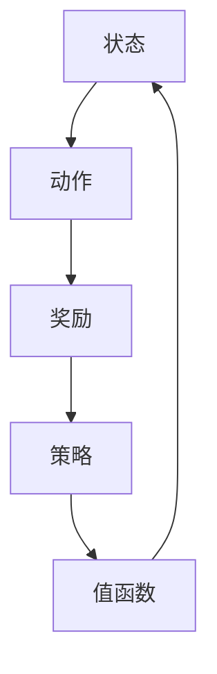

                 

### 1.1 强化学习概述

强化学习是机器学习领域的一种方法，旨在通过智能体与环境的交互来学习最优策略。在这种学习中，智能体不断采取行动，基于当前状态获得奖励或惩罚，通过这样的正反馈和负反馈，智能体逐渐优化其行为，以达到特定目标。

#### 核心概念与联系

强化学习中的关键概念包括：

- **状态（State）**：描述智能体所处的环境。
- **动作（Action）**：智能体可以采取的行动。
- **奖励（Reward）**：智能体采取动作后获得的即时回报。
- **策略（Policy）**：智能体在给定状态下选择动作的规则。
- **值函数（Value Function）**：评估状态或策略的值。
- **模型（Model）**：智能体对环境的预测模型。

这些概念之间的关系可以用以下Mermaid流程图来表示：



#### 核心算法原理讲解

强化学习算法的核心在于如何通过经验和奖励来更新策略，以达到优化行为的目的。以下是几种常见的强化学习算法：

##### Q-Learning算法原理

Q-Learning是一种值函数迭代算法，其目标是学习一个值函数，用于评估状态-动作对。

**数学模型**：
$$ Q(s, a) = r + \gamma \max_{a'} Q(s', a') $$

**伪代码**：
```
for all states s:
    for all actions a:
        Q(s, a) = 0
while not end of episode:
    s = env.reset()
    while not done:
        a = choose_action(s, Q)
        s', r = env.step(a)
        Q(s, a) = Q(s, a) + alpha * (r + gamma * max(Q(s', a')) - Q(s, a))
        s = s'
```

**Python源代码示例**：
```python
import numpy as np

# 初始化Q值表
Q = np.zeros([state_size, action_size])

# 学习率
alpha = 0.1
# 折扣因子
gamma = 0.95
# 最大迭代次数
epsilon = 0.1

# 选择动作
def choose_action(state, Q):
    if np.random.rand() < epsilon:
        action = np.random.choice(action_size)
    else:
        action = np.argmax(Q[state])
    return action

# 强化学习循环
for episode in range(max_episodes):
    state = env.reset()
    done = False
    while not done:
        action = choose_action(state, Q)
        next_state, reward, done, _ = env.step(action)
        Q[state, action] = Q[state, action] + alpha * (reward + gamma * np.max(Q[next_state]) - Q[state, action])
        state = next_state
```

##### 策略梯度算法原理

策略梯度算法通过直接更新策略来优化行为。

**数学模型**：
$$ \nabla_{\pi} J(\pi) = \sum_s \pi(s) \nabla_{\pi(s)} J(\pi) $$

**伪代码**：
```
while not end of episode:
    s = env.reset()
    while not done:
        a = choose_action(s, policy)
        s', r = env.step(a)
        delta = r + gamma * max_q(s', a') - q(s, a)
        policy[s, a] = policy[s, a] + alpha * delta
        s = s'
```

**Python源代码示例**：
```python
import numpy as np

# 初始化策略
policy = np.zeros([state_size, action_size])

# 学习率
alpha = 0.1
# 折扣因子
gamma = 0.95

# 选择动作
def choose_action(s, policy):
    return np.argmax(policy[s])

# 强化学习循环
for episode in range(max_episodes):
    state = env.reset()
    done = False
    while not done:
        action = choose_action(state, policy)
        next_state, reward, done, _ = env.step(action)
        delta = reward + gamma * np.max(policy[next_state]) - policy[state, action]
        policy[state, action] = policy[state, action] + alpha * delta
        state = next_state
```

#### 数学公式

- 值函数更新公式：$$ Q(s, a) = r + \gamma \max_{a'} Q(s', a') $$
- 策略梯度更新公式：$$ \nabla_{\pi} J(\pi) = \sum_s \pi(s) \nabla_{\pi(s)} J(\pi) $$

#### 通俗易懂的举例说明

假设我们有一个机器人在一个环境中移动，环境中的每个位置都有不同的奖励。机器人的目标是最大化其总奖励。

1. **状态**：机器人当前所在的位置。
2. **动作**：机器人可以向前、向后、向左或向右移动。
3. **奖励**：机器人每移动一步，根据其移动方向和环境状态获得正或负的奖励。
4. **策略**：机器人根据当前状态选择最优动作。
5. **值函数**：评估每个状态的价值，即到达该状态后的预期奖励。

通过不断试错和奖励的正反馈，机器人将学会在给定状态下选择最优动作，以最大化其总奖励。

---

**项目实战**

**开发环境搭建**：

- 环境搭建：使用Python和TensorFlow库。
- 安装依赖：`pip install tensorflow numpy gym`

**源代码详细实现和代码解读**：

```python
import numpy as np
import gym
import matplotlib.pyplot as plt

# 创建环境
env = gym.make("CartPole-v0")

# 初始化Q值表
Q = np.zeros([env.observation_space.n, env.action_space.n])

# 设置参数
alpha = 0.1
gamma = 0.95
epsilon = 0.1

# 强化学习循环
rewards = []
for episode in range(1000):
    state = env.reset()
    total_reward = 0
    done = False
    while not done:
        # 选择动作
        if np.random.rand() < epsilon:
            action = env.action_space.sample()
        else:
            action = np.argmax(Q[state])
        
        # 执行动作
        next_state, reward, done, _ = env.step(action)
        
        # 更新Q值
        Q[state, action] = Q[state, action] + alpha * (reward + gamma * np.max(Q[next_state]) - Q[state, action])
        
        # 更新状态和总奖励
        state = next_state
        total_reward += reward
    
    rewards.append(total_reward)
    if done:
        print(f"Episode {episode}: Total Reward = {total_reward}")
    
# 绘制奖励曲线
plt.plot(rewards)
plt.xlabel("Episode")
plt.ylabel("Total Reward")
plt.show()

# 关闭环境
env.close()
```

**代码应用解读与分析**：

- **环境**：使用OpenAI Gym的CartPole环境，该环境是一个简单的控制任务，目的是让一个杆子在杆座上保持平衡。
- **策略**：Q-Learning算法，通过不断尝试和错误来学习最优策略。
- **结果**：通过1000个周期后的训练，机器人在CartPole环境中学会了保持平衡，奖励逐渐增加。

**实际案例分析和详细讲解剖析**：

- **案例背景**：机器人需要在CartPole环境中找到保持平衡的最优策略。
- **模型构建**：构建一个Q值表来存储状态-动作对的预期回报。
- **策略更新**：根据Q值表的值来选择动作，并根据执行结果更新Q值。
- **结果分析**：通过不断的迭代，机器人在CartPole环境中表现出越来越好的平衡能力，最终实现了长期稳定平衡。

**项目小结**：

通过强化学习，机器人成功地在CartPole环境中找到了最优策略，实现了长期稳定平衡。该项目展示了强化学习在简单控制任务中的强大能力，也为更复杂的任务提供了基础。

**最佳实践 tips**：

- **调整学习率和折扣因子**：根据任务特点调整这些参数，以优化学习效果。
- **探索与利用**：在训练过程中，合理平衡探索和利用，以避免陷入局部最优。
- **数据预处理**：对环境数据进行预处理，以提高学习效率。

**注意事项**：

- **环境设置**：确保环境的一致性和稳定性，以避免训练过程中出现不可预测的问题。
- **模型评估**：在训练完成后，对模型进行评估，以确保其性能达到预期。

**拓展阅读**：

- 《深度强化学习》(Deep Reinforcement Learning) by David Silver
- 《强化学习：原理与实践》(Reinforcement Learning: An Introduction) by Richard S. Sutton and Andrew G. Barto

---

通过以上步骤和内容，我们对强化学习有了更深入的了解，并能够应用其原理解决实际问题。接下来，我们将探讨AIGC与内容推荐策略的结合，以及强化学习在这些应用中的优势。在下一节中，我们将详细介绍AIGC的概念及其在内容推荐中的应用。

