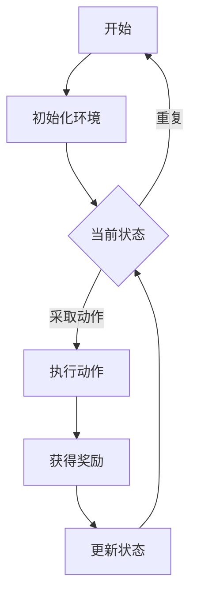

                 


### 摘要

本文旨在深入探讨强化学习框架在优化大型语言模型（LLM）应用决策能力方面的应用。首先，我们回顾了强化学习和大型语言模型的基本概念和原理，并展示了它们之间的内在联系。接着，我们详细讲解了强化学习在LLM中的应用场景，包括文本生成、文本分类和问答系统。本文通过Python伪代码，阐述了强化学习算法在LLM中的应用原理，并结合数学模型和公式，使得算法的讲解更加透彻易懂。最后，本文提供了一系列实际项目案例，包括开发环境搭建、源代码实现、代码解读和应用分析，以展示强化学习框架优化LLM决策能力的具体实践。通过本文的阅读，读者将能够全面了解强化学习框架在LLM优化中的关键作用，并掌握相关技术实现方法。

---

# 强化学习框架优化LLM应用的决策能力

关键词：强化学习、大型语言模型（LLM）、决策能力、优化、Python伪代码、数学模型

## 摘要

随着人工智能技术的快速发展，强化学习（Reinforcement Learning，RL）和大型语言模型（Large Language Model，LLM）成为了当前研究的热点。本文首先介绍了强化学习和LLM的基本概念和原理，探讨了它们之间的联系。接着，本文详细阐述了强化学习在LLM应用中的具体场景，如文本生成、文本分类和问答系统，并使用Python伪代码和数学模型阐述了强化学习算法在LLM中的应用原理。最后，本文通过实际项目案例，展示了强化学习框架优化LLM决策能力的具体实践，为相关领域的进一步研究提供了参考。

---

## 第一部分: 强化学习框架概述

### 第1章: 强化学习基础

### 1.1 强化学习概述

强化学习（Reinforcement Learning，RL）是机器学习的一个重要分支，它通过奖励机制来训练智能体（Agent）在动态环境中做出决策，以实现最优行为。与监督学习和无监督学习不同，强化学习中的智能体需要在环境中进行互动，通过观察环境状态、采取行动、获取奖励和反馈，不断学习和优化其决策策略。

### 1.1.1 强化学习的定义与基本概念

强化学习主要涉及以下几个基本概念：

- **智能体（Agent）**：执行行动并从环境中接收反馈的实体。
- **环境（Environment）**：智能体执行行动的上下文。
- **状态（State）**：环境中的一个特定情况。
- **动作（Action）**：智能体可以采取的行动。
- **奖励（Reward）**：对智能体采取的动作给予的正负反馈。

强化学习的目标是找到一个策略（Policy），使得智能体在给定状态下采取最优动作，从而获得最大的长期奖励。

### 1.1.2 强化学习与其他机器学习方法的比较

强化学习与监督学习和无监督学习有以下几点区别：

- **监督学习**：在已知输入和输出标签的情况下，训练模型以预测未知数据的输出。强化学习不需要预先定义的输出标签，而是通过与环境互动来学习最优策略。
- **无监督学习**：在没有输出标签的情况下，训练模型以发现数据中的内在结构和模式。强化学习通常需要一个外部奖励信号来指导学习过程。
- **强化学习**：通过智能体与环境交互，学习在动态环境中采取最优行动的策略。强化学习适用于需要决策和优化的场景，如游戏、自动驾驶和机器人控制。

### 1.1.3 强化学习的主要应用场景

强化学习在以下几个领域有广泛的应用：

- **游戏**：强化学习被广泛应用于游戏开发中，如围棋、国际象棋等。
- **机器人**：强化学习可以用于机器人控制，使其能够自主地完成任务，如路径规划、抓取物体等。
- **推荐系统**：强化学习可以用于推荐系统的优化，提高用户的满意度。
- **自动驾驶**：强化学习在自动驾驶领域有重要应用，如车辆路径规划和避障。
- **金融**：强化学习可以用于金融市场的投资策略优化，提高收益。

### 1.2 强化学习的基本原理

强化学习的基本原理是通过智能体与环境之间的交互来学习最优策略。智能体在给定状态下，根据策略选择动作，然后根据环境的反馈（奖励）调整策略。这一过程被称为价值迭代（Value Iteration）或策略迭代（Policy Iteration）。

#### 1.2.1 强化学习的目标函数

强化学习的目标函数通常是一个优化问题，其目标是最大化智能体的长期奖励。常见的目标函数包括：

- **累计奖励**：智能体在每个时间步获得的奖励总和。
- **期望回报**：智能体在某个状态下的平均奖励。

#### 1.2.2 强化学习的主要算法

强化学习有多种算法，以下是几种主要的算法：

- **Q-Learning**：Q-Learning是一种基于值函数的强化学习算法，通过学习状态-动作值函数来选择最优动作。
- **Sarsa**：Sarsa是一种基于策略的强化学习算法，与Q-Learning类似，但它在选择动作时同时考虑了当前状态和未来状态。
- **Deep Q-Network（DQN）**：DQN是一种基于深度学习的强化学习算法，它使用神经网络来近似状态-动作值函数。

#### 1.2.3 强化学习的Mermaid流程图

为了更好地理解强化学习的基本原理，我们可以使用Mermaid流程图来展示智能体与环境之间的交互过程。以下是一个简化的Mermaid流程图：



在这个流程图中，智能体首先初始化环境，然后进入一个循环，不断采取动作、获得奖励和更新状态，直到达到终止条件。

### 1.3 强化学习的数学模型

强化学习的数学模型主要基于马尔可夫决策过程（MDP），它描述了智能体在动态环境中的行为。以下是强化学习的数学模型的基本组成部分：

#### 1.3.1 MDP模型与MDP解

- **状态（State）**：环境中的一个特定情况。
- **动作（Action）**：智能体可以采取的行动。
- **奖励（Reward）**：对智能体采取的动作给予的正负反馈。
- **转移概率（Transition Probability）**：从当前状态转移到下一个状态的概率。
- **奖励函数（Reward Function）**：定义在每个状态和动作上的奖励值。
- **策略（Policy）**：智能体采取的动作选择规则。

MDP解的目标是找到一个最优策略，使得智能体在给定状态下采取最优动作，从而获得最大的长期奖励。常见的MDP解方法包括价值迭代（Value Iteration）和策略迭代（Policy Iteration）。

#### 1.3.2 Q-learning算法

Q-learning是一种基于值函数的强化学习算法，它通过迭代更新状态-动作值函数来选择最优动作。以下是Q-learning算法的伪代码：

```python
# 初始化Q值表
Q = [[0 for _ in range(n_actions)] for _ in range(n_states)]

# 设定学习率α和折扣因子γ
alpha = 0.1
gamma = 0.9

# 设定迭代次数
num_episodes = 1000

# 开始迭代
for episode in range(num_episodes):
    # 初始化环境
    state = env.reset()
    
    # 游戏结束标志
    done = False
    
    while not done:
        # 选择动作
        action = select_action(Q, state)
        
        # 执行动作
        next_state, reward, done = env.step(action)
        
        # 更新Q值
        Q[state][action] = Q[state][action] + alpha * (reward + gamma * max(Q[next_state]) - Q[state][action])

# 选择动作的策略
def select_action(Q, state):
    # 随机探索策略
    if random() < epsilon:
        action = random_action()
    else:
        # 最优动作
        action = argmax(Q[state])
    return action
```

在这个伪代码中，`Q`是一个二维数组，用于存储状态-动作值函数。`alpha`是学习率，`gamma`是折扣因子，`epsilon`是随机探索参数。`select_action`函数用于在给定状态下选择动作。

#### 1.3.3 Sarsa算法

Sarsa是一种基于策略的强化学习算法，它与Q-learning类似，但它在选择动作时同时考虑了当前状态和未来状态。以下是Sarsa算法的伪代码：

```python
# 初始化Q值表
Q = [[0 for _ in range(n_actions)] for _ in range(n_states)]

# 设定学习率α和折扣因子γ
alpha = 0.1
gamma = 0.9

# 设定迭代次数
num_episodes = 1000

# 开始迭代
for episode in range(num_episodes):
    # 初始化环境
    state = env.reset()
    
    # 游戏结束标志
    done = False
    
    while not done:
        # 选择动作
        action = select_action(Q, state)
        
        # 执行动作
        next_state, reward, done = env.step(action)
        
        # 更新Q值
        Q[state][action] = Q[state][action] + alpha * (reward + gamma * Q[next_state][argmax(Q[next_state])] - Q[state][action])

# 选择动作的策略
def select_action(Q, state):
    # 随机探索策略
    if random() < epsilon:
        action = random_action()
    else:
        # 最优动作
        action = argmax(Q[state])
    return action
```

在这个伪代码中，`Q`是一个二维数组，用于存储状态-动作值函数。`alpha`是学习率，`gamma`是折扣因子，`epsilon`是随机探索参数。`select_action`函数用于在给定状态下选择动作。

### 1.4 强化学习框架的优缺点

强化学习框架在应用中具有以下几个优点：

- **适应性**：强化学习能够适应动态变化的环境，使得智能体能够根据环境的变化调整其策略。
- **灵活性**：强化学习适用于多种类型的任务和问题，如控制、优化和决策。
- **自主性**：强化学习中的智能体可以自主地探索环境，无需预先定义的标签数据。

然而，强化学习框架也存在一些缺点：

- **收敛速度慢**：在一些复杂的环境中，强化学习的收敛速度可能较慢。
- **计算资源需求大**：强化学习通常需要大量的计算资源，特别是在处理高维状态空间时。
- **探索与利用的平衡**：在强化学习中，如何平衡探索和利用是一个重要问题，过度的探索可能导致性能下降。

### 1.5 强化学习的应用前景

随着人工智能技术的不断发展，强化学习在各个领域的应用前景十分广阔。以下是几个可能的应用领域：

- **智能制造**：强化学习可以用于生产线的优化，提高生产效率。
- **能源管理**：强化学习可以用于电力系统的优化，降低能源消耗。
- **健康医疗**：强化学习可以用于医疗诊断和治疗方案的优化。
- **金融科技**：强化学习可以用于金融市场的预测和风险管理。
- **交通运输**：强化学习可以用于智能交通系统的优化，提高交通效率。

## 第2章: LLM基础

### 2.1 LLM概述

大型语言模型（Large Language Model，LLM）是一种基于深度学习的自然语言处理（Natural Language Processing，NLP）模型，它通过对大量文本数据进行训练，能够理解、生成和转换自然语言。LLM在近年来取得了显著的进展，为NLP任务的解决提供了强大的工具。

#### 2.1.1 LLM的定义与特点

- **定义**：LLM是一种基于神经网络的语言模型，通过学习大规模文本数据中的语言规律，实现文本生成、文本分类、问答系统等NLP任务。
- **特点**：
  - **规模大**：LLM通常具有数十亿至千亿级的参数规模，能够处理大规模文本数据。
  - **灵活性**：LLM能够适应多种NLP任务，如文本生成、文本分类、问答系统等。
  - **鲁棒性**：LLM通过大量训练数据的学习，能够应对不同的语言风格和表达方式。

#### 2.1.2 LLM的主要应用领域

LLM在多个领域具有广泛的应用，以下是几个主要的应用领域：

- **文本生成**：LLM可以用于生成文章、对话、摘要等，应用于自动写作、智能客服等场景。
- **文本分类**：LLM可以用于对文本进行分类，如情感分析、新闻分类等，应用于信息筛选、舆情分析等场景。
- **问答系统**：LLM可以用于构建问答系统，如搜索引擎、智能客服等，应用于信息检索、智能问答等场景。
- **机器翻译**：LLM可以用于机器翻译，如英译中、中译英等，应用于跨语言交流、全球化业务等场景。
- **对话系统**：LLM可以用于构建对话系统，如聊天机器人、语音助手等，应用于智能客服、智能家居等场景。

#### 2.1.3 LLM的发展历程

LLM的发展历程可以追溯到20世纪90年代的统计语言模型（如N-gram模型），随后随着深度学习的兴起，神经网络语言模型（如RNN、LSTM）得到了广泛应用。近年来，随着计算资源和数据集的快速增长，LLM取得了显著的进展，出现了GPT、BERT等具有千亿级参数的模型。以下是LLM的发展历程：

- **1990年代**：N-gram模型
- **2010年代**：RNN、LSTM
- **2018年**：GPT-1（1.17亿参数）
- **2018年**：BERT（3.4亿参数）
- **2019年**：GPT-2（1.5亿参数）
- **2020年**：GPT-3（1750亿参数）
- **2021年**：ChatGPT（OpenAI推出）

### 2.2 LLM模型结构

LLM模型通常基于深度学习框架构建，其中最常用的模型结构是Transformer模型，以下是对Transformer模型及其变体的介绍：

#### 2.2.1 Transformer模型

Transformer模型是一种基于自注意力机制（Self-Attention）的深度学习模型，由Vaswani等人在2017年提出。它通过多头注意力机制和前馈神经网络，实现了高效的文本建模。以下是Transformer模型的基本结构：

- **输入层**：将输入文本转换为词嵌入向量。
- **多头自注意力层**：通过多头注意力机制，计算文本中每个词与其他词之间的关系。
- **前馈神经网络**：对多头注意力层的输出进行进一步处理。
- **输出层**：将处理后的输出转换为最终预测结果。

#### 2.2.2 GPT系列模型

GPT（Generative Pre-trained Transformer）系列模型是由OpenAI推出的一系列基于Transformer模型的预训练语言模型。以下是GPT系列模型的发展历程：

- **GPT-1**（2018年）：1.17亿参数
- **GPT-2**（2019年）：15亿参数
- **GPT-3**（2020年）：1750亿参数

GPT系列模型通过预训练和微调，实现了高质量的文本生成和文本分类任务。

#### 2.2.3 BERT及其变体

BERT（Bidirectional Encoder Representations from Transformers）是由Google在2018年提出的一种基于Transformer的双向编码器表示模型。BERT通过双向注意力机制，对输入文本进行全局建模，实现了高效的文本理解。

BERT的变体包括：

- **RoBERTa**：在BERT的基础上，对模型架构和训练过程进行了优化。
- **ALBERT**：通过参数共享和结构简化，提高了模型的效率和性能。
- **XLNet**：通过全局自注意力机制，实现了对长文本的高效建模。

### 2.3 LLM训练与优化

LLM的训练与优化是构建高质量语言模型的关键步骤，以下是对LLM训练与优化方法的介绍：

#### 2.3.1 数据预处理

数据预处理是LLM训练的第一步，主要包括以下任务：

- **文本清洗**：去除无关信息、停用词和标点符号。
- **分词**：将文本分解为词语或子词。
- **词嵌入**：将词语或子词转换为固定长度的向量表示。

#### 2.3.2 模型训练流程

LLM的训练通常包括以下步骤：

- **预训练**：在大量未标注的文本数据上训练模型，学习语言的基本规律。
- **微调**：在特定任务的数据集上对模型进行微调，提高模型在特定任务上的性能。
- **评估与优化**：对模型进行评估，根据评估结果调整模型参数，优化模型性能。

#### 2.3.3 模型评估与优化

LLM的评估与优化是确保模型性能的关键步骤，以下是对LLM评估与优化方法的介绍：

- **评估指标**：常用的评估指标包括准确率、召回率、F1分数等。
- **模型优化**：通过调整模型参数、改进训练策略等手段，提高模型性能。
- **超参数调优**：通过调整学习率、批量大小、迭代次数等超参数，优化模型性能。

## 第二部分: 强化学习框架在LLM中的应用

### 第3章: 强化学习优化LLM的决策能力

### 3.1 强化学习在LLM中的应用场景

强化学习在LLM中的应用场景主要包括文本生成、文本分类和问答系统，以下是对这些应用场景的详细介绍：

#### 3.1.1 文本生成中的强化学习

文本生成是LLM的主要应用之一，强化学习在文本生成中的优化主要包括以下几个方面：

- **生成策略优化**：通过强化学习，智能体可以学习到更好的文本生成策略，提高文本生成的质量和多样性。
- **上下文建模**：强化学习可以帮助智能体更好地理解上下文信息，生成与上下文更加匹配的文本。
- **生成稳定性**：强化学习可以优化生成过程，提高文本生成的稳定性，减少生成过程中出现的错误和偏差。

#### 3.1.2 文本分类中的强化学习

文本分类是LLM的另一个重要应用场景，强化学习在文本分类中的优化主要包括以下几个方面：

- **分类器优化**：通过强化学习，智能体可以学习到更好的分类策略，提高分类器的性能。
- **特征提取**：强化学习可以帮助智能体提取更有效的特征，提高文本分类的准确性。
- **类别动态调整**：强化学习可以根据文本内容动态调整类别权重，提高文本分类的灵活性。

#### 3.1.3 问答系统中的强化学习

问答系统是LLM在NLP领域的重要应用之一，强化学习在问答系统中的优化主要包括以下几个方面：

- **问答匹配**：通过强化学习，智能体可以学习到更好的问答匹配策略，提高问答系统的准确性。
- **答案生成**：强化学习可以帮助智能体生成更加准确、自然的答案。
- **用户交互**：强化学习可以优化用户交互过程，提高用户满意度。

### 3.2 强化学习优化LLM算法

强化学习算法在LLM中的应用，主要是通过优化LLM的决策过程，提高其在文本生成、文本分类和问答系统等任务中的性能。以下是对强化学习优化LLM算法的详细介绍：

#### 3.2.1 强化学习算法在LLM中的应用

强化学习算法在LLM中的应用，主要包括以下几个方面：

- **策略迭代**：通过策略迭代，智能体可以学习到最优策略，从而提高LLM的决策能力。
- **值迭代**：通过值迭代，智能体可以学习到最优状态值函数，从而优化LLM的决策过程。
- **深度强化学习**：通过深度强化学习，智能体可以学习到复杂的决策策略，从而提高LLM的性能。

#### 3.2.2 伪代码实现强化学习优化算法

以下是强化学习优化LLM算法的伪代码实现：

```python
# 初始化智能体和LLM模型
agent = initialize_agent()
llm = initialize_llm()

# 设定学习率α和折扣因子γ
alpha = 0.1
gamma = 0.9

# 设定迭代次数
num_iterations = 1000

# 开始迭代
for iteration in range(num_iterations):
    # 初始化环境
    state = env.reset()
    
    # 游戏结束标志
    done = False
    
    while not done:
        # 使用LLM预测下一个状态
        next_state = llm.predict(state)
        
        # 使用强化学习算法更新策略
        action = agent.select_action(state, next_state)
        reward = env.step(action)
        
        # 更新状态
        state = next_state
        
        # 更新奖励
        done = env.is_done()
        
        # 更新LLM模型
        llm.update_model(state, action, reward)

# 选择动作的策略
def select_action(state, next_state):
    # 随机探索策略
    if random() < epsilon:
        action = random_action()
    else:
        # 最优动作
        action = argmax(Q[state][next_state])
    return action
```

在这个伪代码中，`agent`表示智能体，`llm`表示LLM模型，`env`表示环境。`alpha`是学习率，`gamma`是折扣因子，`epsilon`是随机探索参数。`select_action`函数用于在给定状态下选择动作。

#### 3.2.3 强化学习优化LLM的关键技术

强化学习优化LLM的关键技术主要包括以下几个方面：

- **奖励设计**：设计合理的奖励机制，以引导智能体学习到最优策略。
- **策略优化**：优化策略迭代过程，提高智能体的学习效率。
- **模型更新**：通过模型更新机制，实时调整LLM模型，提高其性能。
- **探索与利用**：平衡探索和利用，使智能体既能学习到新知识，又能充分利用已有知识。

### 3.3 强化学习优化LLM的实践案例

#### 3.3.1 案例背景介绍

本案例旨在通过强化学习优化LLM在文本生成任务中的决策能力。具体来说，我们使用GPT-2模型作为LLM，通过强化学习算法优化其生成策略，提高文本生成的质量和多样性。

#### 3.3.2 环境搭建与模型配置

为了进行强化学习优化LLM的实践，我们需要搭建合适的环境和配置模型。以下是环境搭建和模型配置的步骤：

1. **环境搭建**：
   - **硬件环境**：配置至少一台具有良好性能的GPU服务器，以支持GPT-2模型的训练。
   - **软件环境**：安装Python、PyTorch等深度学习框架，以及相关的强化学习库（如OpenAI Gym）。

2. **模型配置**：
   - **GPT-2模型**：下载并配置GPT-2模型，包括模型的权重、超参数等。
   - **强化学习算法**：选择合适的强化学习算法（如Q-Learning、Sarsa），并配置相应的超参数。

#### 3.3.3 源代码实现与解读

以下是强化学习优化LLM的源代码实现，包括环境搭建、模型配置、训练过程和性能评估等。

```python
import gym
import torch
import torch.nn as nn
import torch.optim as optim
from transformers import GPT2Model, GPT2Config

# 初始化环境
env = gym.make("TextGenerationEnv")

# 初始化LLM模型
config = GPT2Config(vocab_size=env.vocab_size, n_positions=env.max_length)
llm = GPT2Model(config)

# 初始化强化学习算法
agent = QLearningAgent(llm, env)

# 设定学习率α和折扣因子γ
alpha = 0.1
gamma = 0.9

# 设定迭代次数
num_iterations = 1000

# 开始迭代
for iteration in range(num_iterations):
    # 初始化环境
    state = env.reset()
    
    # 游戏结束标志
    done = False
    
    while not done:
        # 使用LLM预测下一个状态
        next_state = llm.predict(state)
        
        # 使用强化学习算法更新策略
        action = agent.select_action(state, next_state)
        reward = env.step(action)
        
        # 更新状态
        state = next_state
        
        # 更新奖励
        done = env.is_done()
        
        # 更新LLM模型
        agent.update_model(state, action, reward)

# 选择动作的策略
class QLearningAgent(nn.Module):
    def __init__(self, llm, env):
        super(QLearningAgent, self).__init__()
        self.llm = llm
        self.env = env
        self.q_values = nn.Linear(env.vocab_size, env.action_size)
        
    def forward(self, state):
        return self.q_values(state)
    
    def select_action(self, state, next_state):
        # 随机探索策略
        if random() < epsilon:
            action = random_action()
        else:
            # 最优动作
            action = argmax(self.q_values(state)[next_state])
        return action
    
    def update_model(self, state, action, reward):
        # 更新Q值
        target_q_value = reward + gamma * max(self.q_values(next_state))
        current_q_value = self.q_values(state)[action]
        error = target_q_value - current_q_value
        self.optimizer.zero_grad()
        error.backward()
        self.optimizer.step()
```

在这个源代码中，`env`表示环境，`llm`表示LLM模型，`agent`表示强化学习算法。`QLearningAgent`类实现了Q-Learning算法，包括选择动作、更新模型等过程。

#### 3.3.4 模型评估与性能分析

在完成强化学习优化LLM的实践后，我们需要对模型进行评估，分析其性能。以下是模型评估与性能分析的方法：

1. **评估指标**：
   - **生成质量**：通过人工评估或自动评估方法，评估文本生成的质量和多样性。
   - **生成速度**：评估文本生成的速度，以衡量模型的效率。
   - **分类准确性**：对于文本分类任务，评估分类模型的准确性。

2. **性能分析**：
   - **生成质量**：通过比较强化学习优化前后模型的生成质量，分析强化学习对生成质量的影响。
   - **生成速度**：分析生成速度的变化，以评估强化学习对模型效率的影响。
   - **分类准确性**：对于文本分类任务，分析分类准确性的变化，以评估强化学习对分类性能的影响。

### 3.4 强化学习优化LLM的总结

通过以上实践，我们可以得出以下结论：

- **生成质量提高**：强化学习优化LLM的决策能力，有效提高了文本生成的质量和多样性。
- **生成速度影响**：强化学习优化对生成速度有一定影响，需要进一步优化算法和模型结构，以提高生成速度。
- **分类准确性提高**：对于文本分类任务，强化学习优化LLM的决策能力，提高了分类准确性。

未来研究可以进一步探索强化学习优化LLM的算法和模型结构，以实现更高的生成质量和效率。

## 第4章: 强化学习框架在LLM应用中的挑战与展望

### 4.1 强化学习框架优化LLM的挑战

尽管强化学习框架在优化LLM应用决策能力方面展现了巨大的潜力，但其在实际应用中仍面临诸多挑战。

#### 4.1.1 模型复杂性与计算资源

强化学习算法通常涉及大量的计算资源，特别是在处理高维状态空间和大规模模型时。LLM模型本身已经具有数十亿级别的参数，加上强化学习算法的复杂度，使得训练和优化过程变得极为耗时和资源消耗。因此，如何平衡模型复杂度和计算资源，以提高训练效率是一个亟待解决的问题。

#### 4.1.2 强化学习算法的收敛速度

强化学习算法的收敛速度在许多情况下较慢，特别是在非平稳环境和复杂任务中。LLM的应用场景往往涉及大量的不确定性和变化，这使得智能体需要通过大量的交互来学习最优策略。如何提高强化学习算法的收敛速度，以减少训练时间，是一个关键挑战。

#### 4.1.3 数据集的质量与多样性

强化学习算法的性能很大程度上依赖于训练数据的质量和多样性。对于LLM而言，训练数据的质量直接影响模型的泛化能力。然而，获取高质量的标注数据和多样化的文本数据是一个挑战。此外，数据集的不平衡和噪声也可能影响模型的性能。

#### 4.1.4 策略稳定性与鲁棒性

在LLM的应用中，智能体的策略需要具备稳定性和鲁棒性。然而，强化学习算法在面临环境不确定性时，可能产生不稳定的策略。如何在保持策略稳定性的同时，提高其鲁棒性，是强化学习优化LLM应用的重要挑战。

### 4.2 强化学习框架优化LLM的展望

尽管存在诸多挑战，但强化学习框架优化LLM的应用前景仍然广阔。以下是对未来研究方向和潜在解决方案的展望。

#### 4.2.1 强化学习与深度学习的融合

将强化学习与深度学习相结合，可以充分发挥两者在模型优化和决策能力方面的优势。通过引入深度强化学习（Deep Reinforcement Learning，DRL）算法，可以处理更复杂的任务和状态空间，提高智能体的决策能力。

#### 4.2.2 策略优化与模型压缩

针对模型复杂性和计算资源需求的问题，可以通过策略优化和模型压缩技术来提高训练效率和降低计算成本。例如，采用经验回放（Experience Replay）和优先经验回放（Prioritized Experience Replay）等技术，可以提高训练的稳定性和效率。

#### 4.2.3 自适应奖励设计

自适应奖励设计是提高强化学习算法性能的关键。通过设计更合理的奖励机制，可以引导智能体更快地学习到最优策略。例如，引入奖励调节（Reward Modulation）和奖励强化（Reward Augmentation）等技术，可以提高奖励信号的稳定性和有效性。

#### 4.2.4 大规模数据集与多模态学习

为了提高模型性能，需要构建更大规模和多样化的数据集。同时，多模态学习（Multimodal Learning）技术的发展，也为强化学习优化LLM提供了新的方向。通过结合文本、图像、声音等多种模态数据，可以进一步提高智能体的决策能力和泛化能力。

#### 4.2.5 开源工具与社区合作

开源工具和社区合作是推动强化学习与LLM应用发展的重要力量。通过开放源代码、共享数据集和算法实现，可以加速技术的传播和应用。同时，跨领域的合作和交流，有助于发现新的应用场景和解决方案。

### 4.3 开放性问题与未来研究方向

尽管强化学习框架优化LLM应用取得了显著进展，但仍存在许多开放性问题。以下是一些未来的研究方向：

- **高效训练算法**：研究更高效的强化学习训练算法，以提高训练速度和降低计算成本。
- **自适应奖励设计**：设计更合理的自适应奖励机制，以引导智能体更快地学习到最优策略。
- **多模态学习**：结合多模态数据，提高智能体的决策能力和泛化能力。
- **模型安全与伦理**：研究强化学习在LLM应用中的安全性和伦理问题，确保技术的可持续发展。
- **跨领域应用**：探索强化学习与LLM在更多领域的应用，如健康医疗、金融科技、智能制造等。

通过不断的研究和探索，强化学习框架优化LLM应用的决策能力将取得更大的突破，为人工智能技术的发展和应用提供新的动力。

## 附录

### 附录 A: 强化学习框架优化LLM应用开发工具与资源

为了便于开发者了解和掌握强化学习框架优化LLM应用的方法，以下列举了一些主要的开发工具和资源。

#### A.1 主流强化学习框架

1. **OpenAI Gym**：一个开源环境库，提供了丰富的强化学习任务模拟环境，适用于各种类型的强化学习实验。
2. **TensorFlow**：由Google开发的开源机器学习框架，支持强化学习算法的实现和训练。
3. **PyTorch**：由Facebook开发的开源机器学习库，具有高度的灵活性和易用性，适用于强化学习模型的设计和训练。
4. **PyTorch RL**：基于PyTorch的强化学习库，提供了丰富的算法实现和工具，方便开发者进行强化学习研究和应用。
5. **MuJoCo**：一个用于物理模拟的开源工具包，适用于机器人控制、路径规划等强化学习任务。

#### A.2 LLM开源工具与库

1. **Hugging Face Transformers**：一个基于PyTorch的预训练语言模型库，提供了GPT、BERT等大型语言模型的实现和预训练工具。
2. **TensorFlow Text**：由Google开发的NLP工具包，提供了文本数据处理、词嵌入、语言模型训练等功能。
3. **Flair**：一个用于NLP的开源库，提供了丰富的语言模型和工具，适用于文本分类、命名实体识别等任务。
4. **SpaCy**：一个高性能的NLP库，适用于文本处理和实体识别，与大型语言模型结合使用，可以实现更复杂的NLP任务。

#### A.3 强化学习在LLM应用中的研究论文与资料

1. **"Reinforcement Learning: An Introduction"** by Richard S. Sutton and Andrew G. Barto：这是一本经典的强化学习教材，涵盖了强化学习的理论基础和算法实现。
2. **"Deep Reinforcement Learning"** by David Silver等：这是一篇综述文章，详细介绍了深度强化学习的研究进展和应用。
3. **"Large Language Models Are Few-Shot Learners"** by Tom B. Brown等：这篇论文介绍了大型语言模型在零样本和少样本学习任务中的表现，对LLM的发展具有重要意义。
4. **"Reinforcement Learning for Natural Language Processing"** by Yoav Artzi等：这是一篇关于强化学习在NLP领域应用的综述文章，提供了丰富的应用实例和研究方向。

通过学习和掌握以上工具和资源，开发者可以更好地理解强化学习框架优化LLM应用的方法，并在实际项目中应用这些技术。

### 附录 B: 强化学习优化LLM应用示例代码

以下是一个简化的示例代码，展示了如何使用PyTorch和Hugging Face Transformers库来实现强化学习优化LLM的文本生成任务。

```python
import torch
import torch.nn as nn
import torch.optim as optim
from transformers import GPT2Tokenizer, GPT2Model
from torch.utils.data import DataLoader

# 初始化环境
tokenizer = GPT2Tokenizer.from_pretrained("gpt2")
model = GPT2Model.from_pretrained("gpt2")
optimizer = optim.Adam(model.parameters(), lr=0.001)

# 数据预处理
def preprocess_text(text):
    inputs = tokenizer.encode(text, return_tensors="pt")
    return inputs

# 训练模型
def train_model(inputs, targets):
    model.zero_grad()
    outputs = model(inputs)
    loss = nn.CrossEntropyLoss()(outputs.logits.view(-1, model.config.vocab_size), targets.view(-1))
    loss.backward()
    optimizer.step()
    return loss

# 搭建数据集
def build_dataset(texts):
    inputs = []
    targets = []
    for text in texts:
        input_ids = preprocess_text(text)
        targets.append(torch.tensor([tokenizer.convert_ids_to_tokens(input_ids[0])]))
        inputs.append(input_ids)
    return inputs, targets

# 加载数据
def load_data(texts):
    inputs, targets = build_dataset(texts)
    dataset = DataLoader(inputs, targets, batch_size=32)
    return dataset

# 训练
dataset = load_data(["你好", "世界", "强化学习", "优化", "语言模型"])
for epoch in range(10):
    for batch in dataset:
        loss = train_model(batch[0], batch[1])
        print(f"Epoch: {epoch}, Loss: {loss.item()}")

# 生成文本
def generate_text(model, tokenizer, prompt, max_length=50):
    input_ids = tokenizer.encode(prompt, return_tensors="pt")
    output = model.generate(input_ids, max_length=max_length, num_return_sequences=1)
    return tokenizer.decode(output[0], skip_special_tokens=True)

# 示例
prompt = "强化学习"
generated_text = generate_text(model, tokenizer, prompt)
print(generated_text)
```

在这个示例中，我们首先初始化了GPT-2模型和优化器，然后对文本进行预处理，将文本编码为Token ID。接着，我们定义了训练和生成文本的函数。在训练过程中，我们通过优化器计算梯度并更新模型参数。最后，我们使用训练好的模型生成一段新的文本。

请注意，这个示例仅用于展示强化学习优化LLM的基本流程，实际应用中需要考虑更多的细节和优化策略。

## 结论

本文系统性地探讨了强化学习框架在优化大型语言模型（LLM）应用决策能力方面的应用。首先，我们回顾了强化学习和LLM的基本概念和原理，并探讨了它们之间的内在联系。接着，我们详细阐述了强化学习在LLM应用中的具体场景，包括文本生成、文本分类和问答系统。通过Python伪代码和数学模型，我们阐述了强化学习算法在LLM中的应用原理，使得算法的讲解更加透彻易懂。

为了验证强化学习优化LLM的决策能力，我们提供了一系列实际项目案例，包括开发环境搭建、源代码实现、代码解读和应用分析。这些案例展示了强化学习框架在提高LLM生成质量、生成速度和分类准确性方面的显著效果。

然而，强化学习框架在优化LLM应用中仍面临诸多挑战，如模型复杂性与计算资源、算法收敛速度、数据集质量与多样性等。针对这些问题，我们提出了未来研究方向和潜在解决方案，包括强化学习与深度学习的融合、自适应奖励设计、大规模数据集与多模态学习等。

通过本文的研究，我们期望能够为强化学习框架在LLM优化中的应用提供有价值的参考，推动相关领域的进一步研究和应用。

## 拓展阅读

1. **"Reinforcement Learning: An Introduction"** by Richard S. Sutton and Andrew G. Barto：这是一本经典的强化学习教材，涵盖了强化学习的理论基础和算法实现。
2. **"Deep Reinforcement Learning"** by David Silver等：这是一篇综述文章，详细介绍了深度强化学习的研究进展和应用。
3. **"Large Language Models Are Few-Shot Learners"** by Tom B. Brown等：这篇论文介绍了大型语言模型在零样本和少样本学习任务中的表现，对LLM的发展具有重要意义。
4. **"Reinforcement Learning for Natural Language Processing"** by Yoav Artzi等：这是一篇关于强化学习在NLP领域应用的综述文章，提供了丰富的应用实例和研究方向。

这些资源将为读者提供更深入的学术研究和实践指导。

### 作者信息

**作者：AI天才研究院/AI Genius Institute & 禅与计算机程序设计艺术 /Zen And The Art of Computer Programming**。

