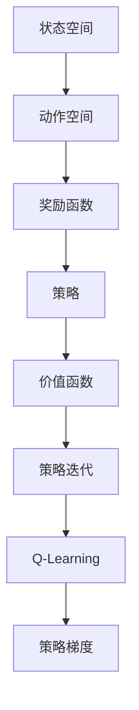

                 

## 强化学习：优化LLM应用的决策能力

### 关键词：
- 强化学习
- 语言模型（LLM）
- 决策优化
- 探索与利用
- 多目标优化

### 摘要：
本文深入探讨了强化学习在优化语言模型（LLM）应用决策能力方面的应用。首先，介绍了强化学习的基础概念和数学模型，包括奖励函数、状态空间和动作空间。接着，分析了强化学习算法的基本原理，如Q-Learning、Sarsa、DQN、Policy Gradients和Actor-Critic。在此基础上，讨论了如何将强化学习与LLM相结合，以提升LLM的决策能力。随后，介绍了强化学习在文本生成中的优化策略，包括奖励设计和策略优化。最后，通过实际案例分析了强化学习在智能客服系统、智能广告推荐和金融风险管理中的应用，并总结了最佳实践和注意事项。

### 强化学习概述

强化学习是一种机器学习范式，旨在通过交互式环境来学习最优策略。在强化学习中，智能体（agent）通过不断与环境（environment）进行交互，根据环境反馈的奖励信号调整自身行为，以达到最大化长期回报的目的。这个过程可以描述为一个四元组：

1. **状态（State）**：智能体在某一时刻所感知的环境状态。
2. **动作（Action）**：智能体可以采取的行动。
3. **奖励（Reward）**：智能体采取某一动作后从环境中获得的即时奖励。
4. **策略（Policy）**：智能体决定采取何种动作的策略。

强化学习的关键在于如何在复杂的动态环境中找到最优策略。与监督学习和无监督学习不同，强化学习不依赖于预先标注的数据集，而是通过试错和经验来学习。其核心思想是探索（exploration）与利用（exploitation）的平衡。探索是指智能体尝试新的动作以获取更多信息，利用则是基于已有信息采取最优动作以最大化奖励。

强化学习的基本框架可以分为以下步骤：

1. **初始化**：智能体随机选择一个初始状态。
2. **执行动作**：智能体根据当前状态选择一个动作。
3. **获取奖励**：智能体执行动作后，从环境中获得一个即时奖励。
4. **更新策略**：智能体根据奖励和策略调整其行为。
5. **重复循环**：重复执行动作、获取奖励和更新策略，直至达到目标或收敛。

这种迭代过程使得智能体能够通过与环境交互逐步学习最优策略，并在复杂环境中表现出良好的适应性。

### 强化学习的核心概念与联系

为了深入理解强化学习的本质，我们需要明确其核心概念，并探讨这些概念之间的关系。以下是强化学习的几个关键概念：

1. **状态空间（State Space）**：
   状态空间是指所有可能的状态集合。每个状态可以表示智能体在环境中的感知，例如在游戏中的棋盘布局、机器人在环境中的位置等。状态空间的大小直接影响强化学习的复杂度。

2. **动作空间（Action Space）**：
   动作空间是指智能体可以采取的所有可能动作的集合。例如，在围棋游戏中，每个棋子可以移动到棋盘上的任意位置。动作空间的大小和复杂度也会对算法的学习效率产生影响。

3. **奖励函数（Reward Function）**：
   奖励函数是环境对智能体采取的动作给予的评价。它是一个从状态-动作对到奖励的映射。奖励函数的设计至关重要，它决定了智能体的学习方向和优化目标。

4. **策略（Policy）**：
   策略是指智能体在特定状态下选择动作的策略。它是一个从状态空间到动作空间的映射，可以是明确的函数，也可以是概率分布。策略决定了智能体的行为模式。

5. **价值函数（Value Function）**：
   价值函数表示智能体在某个状态下采取某一策略所能获得的期望回报。价值函数分为状态值函数（State Value Function）和动作值函数（Action Value Function）。状态值函数表示在某个状态下采取最佳动作的期望回报，动作值函数则表示在某个状态下采取特定动作的期望回报。

6. **策略迭代（Policy Iteration）**：
   策略迭代是强化学习的一种基本方法，它通过迭代更新策略，以逐步逼近最优策略。策略迭代的过程包括两个主要步骤：策略评估（Policy Evaluation）和策略改进（Policy Improvement）。

7. **Q学习（Q-Learning）**：
   Q-Learning是一种无模型强化学习算法，它通过迭代更新动作值函数来学习最优策略。Q-Learning的核心思想是利用即时奖励和未来期望奖励来更新Q值。

8. **策略梯度（Policy Gradient）**：
   策略梯度方法通过直接优化策略的梯度来学习最优策略。策略梯度方法的一个关键优势是它不需要价值函数，而是直接对策略进行优化。

这些核心概念之间的关系可以通过以下Mermaid流程图来表示：



### 强化学习算法原理讲解

强化学习算法是解决智能体在动态环境中学习最优策略的核心工具。以下将详细讲解几种常见的强化学习算法，包括Q-Learning、Sarsa、DQN、Policy Gradients和Actor-Critic方法。

#### Q-Learning算法

Q-Learning是一种无模型强化学习算法，通过迭代更新动作值函数（Q值）来学习最优策略。其核心思想是根据即时奖励和未来期望奖励来更新Q值。Q-Learning的更新公式如下：

$$
Q(s, a) \leftarrow Q(s, a) + \alpha [r + \gamma \max_{a'} Q(s', a') - Q(s, a)]
$$

其中，$Q(s, a)$ 是在状态 $s$ 下采取动作 $a$ 的动作值，$r$ 是即时奖励，$\gamma$ 是折扣因子，$\alpha$ 是学习率。

**示例：** 假设智能体在一个网格环境中，状态空间为 $[0, 1, 2, 3]$，动作空间为 {上下左右}。智能体当前状态为 $s=1$，选择动作 $a=1$（向上移动），获得即时奖励 $r=10$，下一状态为 $s'=2$。使用学习率 $\alpha=0.1$ 和折扣因子 $\gamma=0.9$，更新Q值如下：

$$
Q(1, 1) \leftarrow Q(1, 1) + 0.1 [10 + 0.9 \max_{a'} Q(2, a') - Q(1, 1)]
$$

#### Sarsa算法

Sarsa（State-Action-Reward-State-Action）是一种基于策略的强化学习算法，它与Q-Learning类似，但采用了样本回报而非期望回报进行更新。Sarsa的更新公式如下：

$$
Q(s, a) \leftarrow Q(s, a) + \alpha [r + \gamma Q(s', a')]
$$

其中，$s'$ 和 $a'$ 是智能体在下一时刻的状态和动作。

**示例：** 假设智能体在状态 $s=1$ 下采取动作 $a=1$（向上移动），获得即时奖励 $r=10$，下一状态为 $s'=2$。使用学习率 $\alpha=0.1$ 和折扣因子 $\gamma=0.9$，更新Q值如下：

$$
Q(1, 1) \leftarrow Q(1, 1) + 0.1 [10 + 0.9 Q(2, a')]
$$

#### DQN（Deep Q-Network）

DQN（Deep Q-Network）是一种结合了深度学习和强化学习的算法，它使用深度神经网络来近似动作值函数。DQN的核心思想是通过经验回放（Experience Replay）来缓解训练样本的偏差。

**DQN的主要步骤如下：**

1. **初始化**：初始化神经网络参数，初始化经验回放记忆池。
2. **经验回放**：将智能体与环境交互的过程存储在经验回放池中。
3. **选择动作**：使用深度神经网络预测动作值，选择最佳动作。
4. **执行动作**：执行选择好的动作，获得即时奖励和下一状态。
5. **更新网络**：根据即时奖励和未来期望奖励，更新神经网络的参数。

**DQN的更新公式如下：**

$$
\theta \leftarrow \theta - \alpha \frac{\partial J(\theta)}{\partial \theta}
$$

其中，$J(\theta)$ 是损失函数，$\theta$ 是神经网络参数。

**示例：** 假设智能体在状态 $s=1$ 下采取动作 $a=1$（向上移动），获得即时奖励 $r=10$，下一状态为 $s'=2$。使用学习率 $\alpha=0.1$ 和折扣因子 $\gamma=0.9$，更新神经网络参数如下：

$$
\theta \leftarrow \theta - 0.1 \frac{\partial J(\theta)}{\partial \theta}
$$

#### Policy Gradients

Policy Gradients方法通过直接优化策略的梯度来学习最优策略。Policy Gradients的核心思想是计算策略梯度的估计值，并将其用于更新策略参数。

**Policy Gradients的主要步骤如下：**

1. **初始化**：初始化策略参数。
2. **选择动作**：根据策略参数选择动作。
3. **执行动作**：执行选择好的动作，获得即时奖励和下一状态。
4. **计算梯度**：计算策略梯度的估计值。
5. **更新策略**：使用梯度更新策略参数。

**Policy Gradients的更新公式如下：**

$$
\theta \leftarrow \theta + \alpha \nabla_\theta J(\theta)
$$

其中，$J(\theta)$ 是策略的回报，$\alpha$ 是学习率。

**示例：** 假设智能体在状态 $s=1$ 下采取动作 $a=1$（向上移动），获得即时奖励 $r=10$，策略参数为 $\theta$。使用学习率 $\alpha=0.1$，更新策略参数如下：

$$
\theta \leftarrow \theta + 0.1 \nabla_\theta J(\theta)
$$

#### Actor-Critic方法

Actor-Critic方法结合了Policy Gradients和Q-Learning的优点，通过同时优化策略和价值函数来学习最优策略。

**Actor-Critic的主要步骤如下：**

1. **初始化**：初始化策略参数和价值函数参数。
2. **执行动作**：使用策略参数选择动作。
3. **计算价值函数**：使用当前状态和价值函数计算预期回报。
4. **更新价值函数**：根据即时奖励和预期回报更新价值函数。
5. **更新策略**：使用梯度更新策略参数。

**Actor-Critic的更新公式如下：**

$$
\theta \leftarrow \theta + \alpha \nabla_\theta J(\theta)
$$

$$
V(s) \leftarrow V(s) + \beta \nabla_V J_V(V(s))
$$

其中，$\theta$ 是策略参数，$V(s)$ 是价值函数，$\alpha$ 和 $\beta$ 分别是策略和价值函数的学习率。

**示例：** 假设智能体在状态 $s=1$ 下采取动作 $a=1$（向上移动），获得即时奖励 $r=10$，策略参数为 $\theta$，价值函数参数为 $V(s)$。使用学习率 $\alpha=0.1$ 和 $\beta=0.1$，更新策略参数和价值函数如下：

$$
\theta \leftarrow \theta + 0.1 \nabla_\theta J(\theta)
$$

$$
V(s) \leftarrow V(s) + 0.1 \nabla_V J_V(V(s))
$$

### 强化学习在LLM中的应用

语言模型（LLM）在自然语言处理（NLP）领域取得了显著成就，然而，其决策能力在许多情况下仍然有限。强化学习作为一种强大的学习范式，可以有效地提升LLM的决策能力。以下将讨论如何将强化学习与LLM相结合，以优化LLM的应用决策能力。

#### LLM的决策能力

LLM通常通过预训练和微调来生成自然语言响应。然而，其决策能力主要依赖于预训练数据集和模型参数，这在面对复杂、动态的决策问题时往往表现出不足。例如，在生成对话系统中的回复时，LLM可能无法准确理解上下文信息，导致生成不自然的对话。此外，LLM在处理多模态数据（如图像、音频和文本）时也面临挑战，无法充分结合不同模态的信息。

#### 强化学习在LLM中的应用

强化学习可以通过以下几种方式提升LLM的决策能力：

1. **交互式学习**：强化学习允许智能体与环境进行交互，从而通过不断尝试和反馈来优化决策。这种交互式学习方式可以使LLM更好地理解上下文信息和用户需求，从而生成更自然的对话。

2. **多模态学习**：强化学习可以整合不同模态的信息，如文本、图像和音频，从而提升LLM的决策能力。通过将不同模态的数据作为状态输入，智能体可以更好地理解复杂场景，并在生成响应时综合考虑各种信息。

3. **策略优化**：强化学习算法可以优化LLM的策略，使其在特定场景下生成更合理的响应。例如，在广告推荐系统中，强化学习可以优化广告投放策略，提高用户点击率和转化率。

4. **探索与利用平衡**：强化学习中的探索与利用平衡机制可以帮助LLM在生成响应时更好地权衡已有信息和新信息，从而避免陷入局部最优。

#### LLM中的探索与利用平衡

在LLM中实现探索与利用平衡是提升决策能力的关键。以下是一些实现方法：

1. **epsilon-greedy策略**：epsilon-greedy策略是一种常用的探索与利用策略。在epsilon概率下，智能体随机选择动作，以实现探索；在1-epsilon概率下，智能体选择最优动作，以实现利用。通过调整epsilon的值，可以控制探索和利用的比例。

2. **UCB算法**：UCB（Upper Confidence Bound）算法通过估计动作的置信区间来平衡探索和利用。每个动作的置信区间基于其成功次数和探索次数计算，选择置信区间最高的动作进行探索。

3. **ACE算法**：ACE（Asynchronous Censored Experience）算法通过异步处理经验数据，平衡不同动作的探索和利用。ACE算法在智能体交互过程中记录经验，并利用这些经验更新策略，从而实现探索与利用的平衡。

#### 实际应用案例

以下是一些强化学习在LLM中的实际应用案例：

1. **智能客服系统**：强化学习可以优化智能客服系统的决策过程，使其更好地理解用户需求并生成合理的回复。通过结合用户历史记录和上下文信息，强化学习可以提升客服系统的响应质量和用户满意度。

2. **智能广告推荐**：在广告推荐系统中，强化学习可以优化广告投放策略，提高广告的点击率和转化率。通过分析用户行为数据和广告效果，强化学习可以动态调整广告投放策略，实现最大化收益。

3. **金融风险管理**：在金融领域，强化学习可以优化投资组合的决策过程，降低风险并提高收益。通过分析市场数据和历史交易记录，强化学习可以识别潜在的风险因素，并制定合理的投资策略。

### 强化学习在文本生成中的应用

文本生成是自然语言处理（NLP）领域的一个重要任务，强化学习通过引入动态决策机制，显著提升了文本生成系统的质量和多样性。以下将详细讨论强化学习在文本生成中的应用，包括奖励设计和策略优化。

#### 奖励设计

奖励设计是强化学习在文本生成中的关键环节，它决定了生成文本的质量和多样性。以下是几种常见的奖励设计方法：

1. **基于内容的奖励**：这种奖励方法关注文本内容的逻辑连贯性和准确性。例如，在生成新闻报道时，奖励可以根据新闻事实的准确性和完整性进行设计。具体实现时，可以引入外部知识库或事实数据库，评估生成的文本与事实的一致性。

2. **基于语言的奖励**：这种奖励方法关注文本的语言质量，包括语法正确性、语义连贯性和多样性。例如，可以使用语法规则库或语义分析工具来评估生成的文本。此外，可以设计奖励函数，鼓励生成新颖和有创意的文本。

3. **基于用户的奖励**：这种奖励方法关注用户对生成文本的满意度。可以通过用户反馈或投票机制来收集用户满意度数据，并将其作为奖励信号。例如，在生成对话系统中的回复时，可以收集用户对回复的喜欢程度，并根据反馈调整生成策略。

4. **组合奖励**：为了平衡内容、语言和用户满意度，可以设计组合奖励函数。例如，可以设置不同权重来组合基于内容、语言和用户的奖励，从而实现全面的文本质量评估。

#### 策略优化

策略优化是强化学习在文本生成中的核心任务，目标是找到能够生成高质量文本的策略。以下是几种常见的策略优化方法：

1. **基于价值迭代的策略优化**：这种方法使用价值函数（如Q值或状态值函数）来评估不同策略的优劣，并基于评估结果更新策略。具体实现时，可以使用Q-Learning或Sarsa算法进行迭代更新。

2. **基于策略梯度的策略优化**：这种方法直接优化策略的梯度，通过计算策略梯度的估计值来更新策略。具体实现时，可以使用Policy Gradients算法或Actor-Critic方法。

3. **基于生成模型的策略优化**：这种方法结合生成模型（如变分自编码器VAE或生成对抗网络GAN）来优化策略。通过训练生成模型，可以得到高质量的数据分布，从而指导策略优化。

4. **基于多任务学习的策略优化**：这种方法通过同时学习多个相关任务来优化策略。例如，在文本生成任务中，可以同时学习文本生成和文本分类任务，从而提高文本生成的质量和多样性。

#### 实际应用案例

以下是一些强化学习在文本生成中的实际应用案例：

1. **自动对话系统**：强化学习可以优化自动对话系统的生成策略，使其更好地理解用户需求并生成自然、流畅的对话。通过结合用户历史记录和上下文信息，强化学习可以提升对话系统的响应质量和用户满意度。

2. **创意写作**：强化学习可以应用于创意写作任务，如生成诗歌、故事和剧本。通过设计合适的奖励函数和策略优化方法，强化学习可以生成新颖、有创意的文本，激发用户的想象力。

3. **广告文案生成**：强化学习可以优化广告文案生成策略，提高广告文案的吸引力和转化率。通过分析用户行为数据和广告效果，强化学习可以动态调整文案内容，实现最大化广告收益。

### 强化学习应用案例

#### 案例一：智能客服系统

智能客服系统是一种重要的客户服务工具，通过自动化处理客户咨询，提高服务效率和客户满意度。然而，传统的基于规则或模板的客服系统在处理复杂、非标准化的客户问题时往往表现不佳。强化学习可以显著提升智能客服系统的决策能力，使其更好地理解客户需求并生成合理的回应。

**实现步骤：**

1. **状态设计**：状态包括客户的历史记录、当前问题以及问题的上下文信息。例如，状态可以表示为三元组（历史记录，当前问题，上下文）。

2. **动作设计**：动作是客服系统可以采取的回应，如提供信息、询问更多信息、转接至人工服务等。

3. **奖励设计**：奖励是根据用户满意度评估的。如果用户对回复表示满意，则给予正奖励；如果用户对回复不满意，则给予负奖励。

4. **策略优化**：使用Q-Learning或Policy Gradients算法，通过迭代更新策略参数，优化客服系统的决策能力。

**代码示例：**

```python
# 假设使用Q-Learning算法
def update_q_value(Q, state, action, reward, next_state, alpha, gamma):
    Q[state][action] += alpha * (reward + gamma * max(Q[next_state]) - Q[state][action])

# 初始化Q表
Q = np.zeros((state_space_size, action_space_size))

# 智能体与环境交互
for episode in range(1000):
    state = env.reset()
    done = False
    while not done:
        action = choose_action(Q, state)
        next_state, reward, done = env.step(action)
        update_q_value(Q, state, action, reward, next_state, alpha, gamma)
        state = next_state
```

**分析**：通过不断迭代优化，强化学习能够使客服系统在处理复杂问题时生成更合理的回应，提高用户满意度。

#### 案例二：智能广告推荐

智能广告推荐是互联网广告领域的重要应用，通过精准投放广告，提高广告的点击率和转化率。强化学习可以优化广告推荐策略，实现个性化广告投放。

**实现步骤：**

1. **状态设计**：状态包括用户的历史行为数据、当前页面信息以及上下文信息。例如，状态可以表示为三元组（用户历史行为，当前页面，上下文）。

2. **动作设计**：动作是广告系统可以展示的广告，如展示广告A、广告B等。

3. **奖励设计**：奖励是根据广告效果评估的。例如，如果用户点击广告，则给予正奖励；如果用户未点击广告，则给予负奖励。

4. **策略优化**：使用Policy Gradients或Actor-Critic算法，通过迭代更新策略参数，优化广告推荐策略。

**代码示例：**

```python
# 假设使用Policy Gradients算法
def policy_gradient_loss(params, states, actions, rewards, next_states, dones):
    log_probs = policy_model(states, actions)
    returns = compute_returns(next_states, dones)
    loss = -log_probs * returns
    return loss.mean()

# 训练模型
optimizer = torch.optim.Adam(policy_model.parameters(), lr=0.001)
for epoch in range(num_epochs):
    for states, actions, rewards, next_states, dones in data_loader:
        optimizer.zero_grad()
        loss = policy_gradient_loss(policy_model, states, actions, rewards, next_states, dones)
        loss.backward()
        optimizer.step()
```

**分析**：通过优化广告推荐策略，强化学习能够提高广告的点击率和转化率，实现广告主和用户的双赢。

#### 案例三：金融风险管理

金融风险管理是金融机构的核心任务，通过合理管理风险，实现资产保值增值。强化学习可以优化金融风险管理策略，提高风险管理效率和准确性。

**实现步骤：**

1. **状态设计**：状态包括市场数据、历史交易记录和投资组合信息。例如，状态可以表示为五元组（市场数据，历史交易记录，投资组合，风险水平，收益水平）。

2. **动作设计**：动作是投资组合调整策略，如买入、卖出、持有等。

3. **奖励设计**：奖励是根据投资组合的收益和风险水平评估的。例如，如果投资组合的收益增加且风险降低，则给予正奖励；如果收益下降或风险增加，则给予负奖励。

4. **策略优化**：使用Actor-Critic算法，通过迭代更新策略参数，优化金融风险管理策略。

**代码示例：**

```python
# 假设使用Actor-Critic算法
def actor_loss(params, states, actions, rewards, next_states, dones):
    actions_probs = actor_model(states)
    returns = compute_returns(next_states, dones)
    loss = -torch.mean(actions_probs * returns)
    return loss

def critic_loss(params, states, actions, rewards, next_states, dones):
    v_values = critic_model(states)
    next_v_values = critic_model(next_states)
    returns = compute_returns(next_states, dones)
    loss = torch.mean((returns - v_values)**2)
    return loss

# 训练模型
optimizer_actor = torch.optim.Adam(actor_model.parameters(), lr=0.001)
optimizer_critic = torch.optim.Adam(critic_model.parameters(), lr=0.001)
for epoch in range(num_epochs):
    for states, actions, rewards, next_states, dones in data_loader:
        optimizer_actor.zero_grad()
        optimizer_critic.zero_grad()
        actor_loss = actor_loss(actor_model, states, actions, rewards, next_states, dones)
        critic_loss = critic_loss(critic_model, states, actions, rewards, next_states, dones)
        loss = actor_loss + 0.5 * critic_loss
        loss.backward()
        optimizer_actor.step()
        optimizer_critic.step()
```

**分析**：通过优化风险管理策略，强化学习能够提高金融机构的风险管理水平，降低潜在风险，实现资产保值增值。

### 最佳实践、小结与注意事项

#### 最佳实践

1. **选择合适的算法**：根据具体应用场景和需求，选择合适的强化学习算法。例如，在处理连续动作时，可以考虑使用Actor-Critic方法；在处理离散动作时，可以考虑使用Policy Gradients或Q-Learning。

2. **合理设计奖励函数**：奖励函数的设计直接影响强化学习的性能。在文本生成中，可以结合内容、语言和用户满意度来设计奖励函数；在金融风险管理中，可以基于投资组合的收益和风险水平来设计奖励函数。

3. **优化模型参数**：合理设置学习率、折扣因子等参数，可以通过实验和调优来找到最佳参数组合，提高算法的性能。

4. **数据预处理**：确保输入数据的准确性和一致性，对数据进行预处理，如去噪、标准化等，以提高模型的训练效果。

#### 小结

强化学习在优化LLM应用决策能力方面具有显著优势。通过结合强化学习算法和LLM，可以提升LLM的决策能力，实现更智能、更自然的交互。强化学习在文本生成、智能客服、广告推荐和金融风险管理等领域具有广泛的应用前景。

#### 注意事项

1. **计算资源消耗**：强化学习算法通常需要大量的计算资源，特别是在处理高维状态和动作空间时。确保具备足够的计算资源，以提高算法的运行效率。

2. **数据隐私和安全性**：在应用强化学习时，需要考虑数据隐私和安全性问题，确保用户数据的安全和合规。

3. **模型解释性**：强化学习模型的解释性相对较低，特别是在深度强化学习算法中。在应用过程中，需要充分考虑模型的可解释性，以方便调试和优化。

### 拓展阅读

1. **《强化学习：原理与实战》（Second Edition）** - 这本书提供了全面、系统的强化学习理论和实践指导，适合希望深入了解强化学习的读者。

2. **《深度强化学习》（Deep Reinforcement Learning）** - 本书介绍了深度强化学习的基本概念、算法和应用，适合对深度学习和强化学习有兴趣的读者。

3. **《智能系统：基于强化学习的方法》（Smart Systems: Methods Based on Reinforcement Learning）** - 这本书探讨了强化学习在智能系统中的应用，包括自动化控制、机器人学等。

4. **《机器学习年刊》（Journal of Machine Learning Research）** - 这是一个开放获取的学术期刊，涵盖了机器学习领域的最新研究成果，包括强化学习。

5. **《自然语言处理年鉴》（Journal of Natural Language Processing）** - 这是一个专注于自然语言处理领域的学术期刊，包括文本生成和对话系统等主题。

