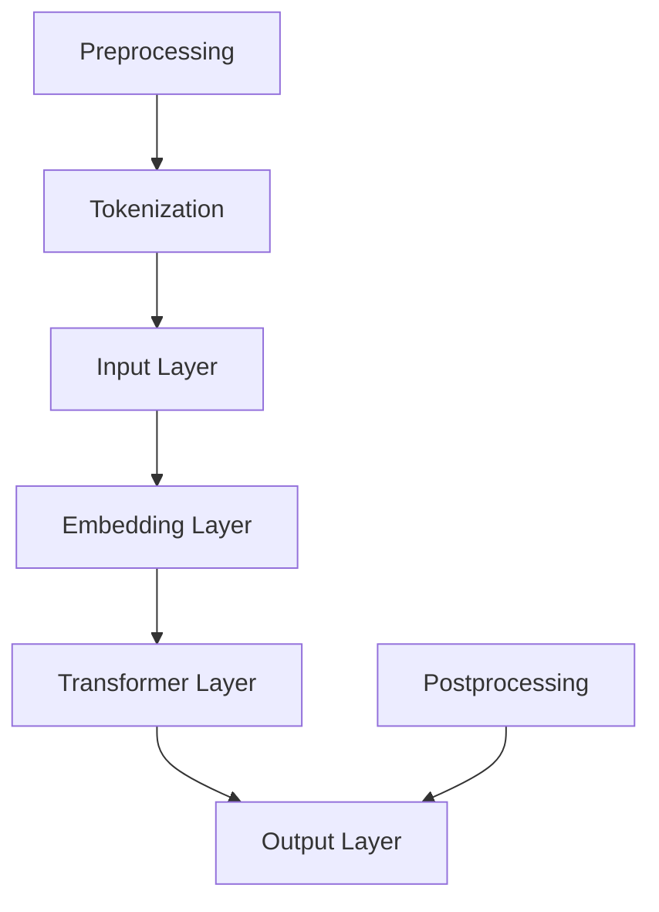

                 

### 快速原型到产品化：LLM应用的演进之路

在当今人工智能（AI）飞速发展的时代，大型语言模型（LLM，Large Language Model）已经成为企业和开发者实现创新应用的利器。从快速原型到产品化的过程，不仅是对技术的深入理解，更是对项目管理、团队协作、用户反馈和持续迭代能力的综合考验。本文将围绕LLM的应用，探讨这一过程的各个关键步骤，提供实用的指导和建议。

## 关键词

- 快速原型
- 产品化
- LLM
- 技术演进
- 项目管理
- 团队协作
- 用户反馈
- 持续迭代

## 摘要

本文旨在解析从快速原型到产品化的过程中，LLM应用所经历的各个环节。首先，我们将回顾LLM的基础理论和核心概念，并深入探讨其数学模型和算法原理。接下来，通过具体项目实战，展示如何将LLM应用于实际问题中，并进行代码解读与分析。最后，本文将总结最佳实践，并提供未来发展的方向。

### 第1章 LLM概述

#### 1.1 什么是LLM

大型语言模型（LLM）是一种基于深度学习的技术，它能够理解和生成人类语言。与传统的自然语言处理（NLP）技术相比，LLM具有更强大的语言理解和生成能力，能够处理复杂的语言现象和上下文关系。LLM的核心思想是通过大规模数据训练，学习语言的模式和结构，从而实现对自然语言的准确理解和生成。

#### 1.2 LLM的发展历程

LLM的发展历程可以追溯到20世纪80年代，当时研究人员开始尝试使用统计方法来处理语言。随着计算能力的提升和大数据的普及，深度学习在2010年代迅速崛起，LLM的研究和应用也得到了飞速发展。从最初的循环神经网络（RNN）到后来的Transformer模型，LLM的技术不断进步，应用场景也越来越广泛。

#### 1.3 LLM的核心特点

LLM具有以下几个核心特点：

1. **强大的语言理解能力**：LLM能够理解并处理复杂的语言现象，如同义词、隐喻和歧义等。
2. **广泛的上下文感知**：LLM能够捕捉长距离的上下文信息，使得生成的文本更加连贯和合理。
3. **灵活的应用场景**：LLM可以应用于文本分类、机器翻译、问答系统、文本生成等众多场景。

#### 1.4 LLM在不同行业中的应用场景

LLM在各个行业中的应用场景十分广泛：

1. **金融**：用于文本分析、情感分析和风险评估，帮助企业做出更明智的决策。
2. **医疗**：用于病历分析、诊断支持和医学研究，提高医疗服务的质量和效率。
3. **教育**：用于智能辅导、自动评分和个性化学习，提升教育资源的利用效率。
4. **娱乐**：用于自动写作、语音合成和对话系统，为用户提供全新的娱乐体验。

### 第2章 LLM的核心概念与联系

#### 2.1 LLM的基本组成

LLM通常由以下几个关键部分组成：

1. **输入层**：接收用户的输入，可以是文本、语音或其他形式的数据。
2. **嵌入层**：将输入数据转换为一组向量，便于后续的模型处理。
3. **Transformer层**：实现文本的编码和解码，是LLM的核心部分。
4. **输出层**：生成预测结果，可以是分类标签、文本生成或其他形式。

#### 2.2 LLM的工作原理

LLM的工作原理主要包括以下几个步骤：

1. **输入预处理**：对输入文本进行分词、编码等预处理操作。
2. **嵌入**：将预处理后的文本转换为向量。
3. **编码**：通过Transformer层对嵌入向量进行编码，捕捉文本的上下文信息。
4. **解码**：从编码结果中生成输出结果，可以是分类标签、预测文本等。

#### 2.3 Mermaid流程图：LLM的架构与交互



#### 2.4 LLM的核心概念与联系

LLM的核心概念包括：

1. **嵌入**：将文本转换为向量表示，是LLM的基础。
2. **Transformer**：实现文本的编码和解码，是LLM的核心算法。
3. **上下文感知**：通过Transformer层捕捉长距离的上下文信息。
4. **生成与预测**：从编码结果中生成输出结果，实现语言理解和生成。

### 第3章 LLM的数学模型和算法原理

#### 3.1 前向传播与反向传播

LLM的训练过程主要依赖于前向传播和反向传播算法。前向传播是指将输入数据通过模型层层层传递，最终得到输出结果。反向传播则是通过输出结果的误差，反向调整模型参数，以优化模型性能。

伪代码：

```python
# 前向传播
def forward_pass(inputs):
    embeddings = embedding_layer(inputs)
    transformer_output = transformer_layer(embeddings)
    output = output_layer(transformer_output)
    return output

# 反向传播
def backward_pass(gradients):
    output_gradients = output_layer.backward(gradients)
    transformer_gradients = transformer_layer.backward(output_gradients)
    embedding_gradients = embedding_layer.backward(transformer_gradients)
    return embedding_gradients
```

#### 3.2 编码器-解码器模型（Encoder-Decoder Model）

编码器-解码器模型（Encoder-Decoder Model）是LLM的核心架构之一。它通过编码器对输入文本进行编码，生成上下文表示；通过解码器对上下文表示进行解码，生成输出结果。

伪代码：

```python
# 编码器
def encode(inputs):
    embeddings = embedding_layer(inputs)
    encoded_sequence = transformer_encoder(embeddings)
    return encoded_sequence

# 解码器
def decode(encoded_sequence):
    embeddings = embedding_layer(input_sequence)
    decoder_output = transformer_decoder(embeddings, encoded_sequence)
    return decoder_output
```

#### 3.3 数学模型与公式

LLM的数学模型主要包括损失函数和梯度更新公式。损失函数用于衡量模型输出与真实值之间的差距，梯度更新公式用于调整模型参数。

$$
\begin{aligned}
    &L(\theta) = -\frac{1}{N} \sum_{i=1}^{N} \sum_{j=1}^{T} y_{ij} \log p(x_j | x_{<j}, \theta) \\
    &\nabla_{\theta} L(\theta) = \frac{\partial L(\theta)}{\partial \theta}
\end{aligned}
$$`

### 第4章 数据准备与预处理

#### 4.1 数据集的选择与收集

数据集的选择和收集是LLM应用的基础。选择合适的数据集能够提高模型的性能和泛化能力。以下是一些常见的开源数据集：

1. **Common Crawl**：一个包含大量网页文本的数据集，适用于文本分类、情感分析等任务。
2. **Gutenberg**：包含大量经典文学作品的数据集，适用于文本生成和文本理解任务。
3. **AG News**：一个新闻分类数据集，包含数千篇新闻文章，适用于文本分类任务。

#### 4.2 数据预处理步骤

数据预处理是确保数据质量和模型性能的关键步骤。以下是一些常见的预处理步骤：

1. **分词**：将文本拆分为单词或子词，以便后续处理。
2. **去停用词**：去除常见的无意义单词，如“的”、“是”等。
3. **词向量化**：将文本转换为向量表示，便于模型处理。
4. **数据增强**：通过引入噪声、替换单词等方式增加数据的多样性。

#### 4.3 数据增强技术

数据增强技术能够提高模型的泛化能力和鲁棒性。以下是一些常见的数据增强技术：

1. **同义词替换**：将文本中的单词替换为其同义词。
2. **字符替换**：将文本中的字符替换为其他字符或删除字符。
3. **句子重组**：改变文本的句子结构，如插入、删除或替换句子。
4. **数据混合**：将不同来源的数据混合，形成新的数据集。

### 第5章 LLM项目实战

#### 5.1 实战1：文本分类项目

##### 5.1.1 环境搭建

在进行文本分类项目之前，需要搭建合适的开发环境。以下是一个简单的环境搭建步骤：

1. **安装Python**：确保安装了Python 3.7及以上版本。
2. **安装TensorFlow**：使用pip命令安装TensorFlow库。
3. **安装NLP库**：如NLTK、spaCy等，用于文本预处理和分词。

##### 5.1.2 数据处理与模型构建

以下是一个文本分类项目的简单实现：

```python
import tensorflow as tf
from tensorflow.keras.preprocessing.text import Tokenizer
from tensorflow.keras.preprocessing.sequence import pad_sequences
from tensorflow.keras.models import Sequential
from tensorflow.keras.layers import Embedding, LSTM, Dense

# 数据预处理
tokenizer = Tokenizer(num_words=10000)
tokenizer.fit_on_texts(texts)
sequences = tokenizer.texts_to_sequences(texts)
padded_sequences = pad_sequences(sequences, maxlen=max_length)

# 模型构建
model = Sequential([
    Embedding(input_dim=10000, output_dim=32, input_length=max_length),
    LSTM(128),
    Dense(1, activation='sigmoid')
])

# 模型编译
model.compile(optimizer='adam', loss='binary_crossentropy', metrics=['accuracy'])

# 模型训练
model.fit(padded_sequences, labels, epochs=5, batch_size=128)
```

##### 5.1.3 模型训练与评估

在完成模型训练后，需要对模型进行评估。以下是一个简单的评估流程：

1. **验证集评估**：使用验证集评估模型的性能，计算准确率、召回率等指标。
2. **测试集评估**：在测试集上评估模型的性能，确保模型具有良好的泛化能力。

##### 5.1.4 代码解读与分析

上述代码实现了一个简单的文本分类项目。首先，使用Tokenizer进行文本预处理，将文本转换为序列。然后，使用pad_sequences将序列填充为固定长度。接下来，构建一个简单的LSTM模型，并使用二分类交叉熵损失函数进行训练。最后，对模型进行评估，计算准确率等指标。

#### 5.2 实战2：问答系统项目

##### 5.2.1 环境搭建

问答系统项目需要搭建一个合适的开发环境。以下是一个简单的环境搭建步骤：

1. **安装Python**：确保安装了Python 3.7及以上版本。
2. **安装TensorFlow**：使用pip命令安装TensorFlow库。
3. **安装NLP库**：如NLTK、spaCy等，用于文本预处理和分词。

##### 5.2.2 数据处理与模型构建

以下是一个问答系统项目的简单实现：

```python
import tensorflow as tf
from tensorflow.keras.preprocessing.text import Tokenizer
from tensorflow.keras.preprocessing.sequence import pad_sequences
from tensorflow.keras.models import Model
from tensorflow.keras.layers import Input, Embedding, LSTM, Dense, Concatenate

# 数据预处理
tokenizer = Tokenizer(num_words=10000)
tokenizer.fit_on_texts(context + question + answer)
sequences_context = tokenizer.texts_to_sequences(context)
sequences_question = tokenizer.texts_to_sequences(question)
sequences_answer = tokenizer.texts_to_sequences(answer)
padded_sequences_context = pad_sequences(sequences_context, maxlen=max_context_length)
padded_sequences_question = pad_sequences(sequences_question, maxlen=max_question_length)
padded_sequences_answer = pad_sequences(sequences_answer, maxlen=max_answer_length)

# 模型构建
input_context = Input(shape=(max_context_length,))
input_question = Input(shape=(max_question_length,))
input_answer = Input(shape=(max_answer_length,))

context_embedding = Embedding(input_dim=10000, output_dim=32)(input_context)
question_embedding = Embedding(input_dim=10000, output_dim=32)(input_question)
answer_embedding = Embedding(input_dim=10000, output_dim=32)(input_answer)

context_lstm = LSTM(128)(context_embedding)
question_lstm = LSTM(128)(question_embedding)
answer_lstm = LSTM(128)(answer_embedding)

concatenated = Concatenate()([context_lstm, question_lstm, answer_lstm])
dense = Dense(1, activation='sigmoid')(concatenated)

model = Model(inputs=[input_context, input_question, input_answer], outputs=dense)

# 模型编译
model.compile(optimizer='adam', loss='binary_crossentropy', metrics=['accuracy'])

# 模型训练
model.fit([padded_sequences_context, padded_sequences_question, padded_sequences_answer], labels, epochs=5, batch_size=128)
```

##### 5.2.3 模型训练与评估

在完成模型训练后，需要对模型进行评估。以下是一个简单的评估流程：

1. **验证集评估**：使用验证集评估模型的性能，计算准确率、召回率等指标。
2. **测试集评估**：在测试集上评估模型的性能，确保模型具有良好的泛化能力。

##### 5.2.4 代码解读与分析

上述代码实现了一个简单的问答系统项目。首先，使用Tokenizer进行文本预处理，将文本转换为序列。然后，构建一个三输入的三层LSTM模型，用于处理上下文、问题和答案。接下来，使用嵌入式层将输入序列转换为向量表示，并通过LSTM层进行编码。最后，将编码结果进行拼接，并通过一个全连接层输出预测结果。

### 第6章 最佳实践与未来展望

#### 6.1 最佳实践

在LLM应用过程中，以下是一些最佳实践：

1. **数据质量**：确保数据集的多样性和质量，以提高模型的泛化能力。
2. **超参数调优**：根据具体任务和模型结构，调整超参数，以达到最佳性能。
3. **模型解释**：使用模型解释技术，了解模型决策过程，提高模型的透明度和可解释性。
4. **持续迭代**：根据用户反馈和实际应用效果，持续优化模型和产品。

#### 6.2 小结

本文从快速原型到产品化的角度，探讨了LLM应用的各个关键步骤。通过详细介绍LLM的基础理论、核心概念、算法原理以及项目实战，读者可以了解到如何将LLM应用于实际问题中。同时，本文还总结了最佳实践，为LLM应用提供了实用的指导。

#### 6.3 注意事项

在LLM应用过程中，需要注意以下几点：

1. **数据隐私**：确保处理的数据符合隐私保护要求，避免数据泄露。
2. **计算资源**：根据任务需求和计算能力，合理配置计算资源，以降低成本。
3. **模型安全**：确保模型安全，防止恶意攻击和滥用。

#### 6.4 拓展阅读

对于对LLM应用感兴趣的读者，以下是一些推荐的拓展阅读：

1. **《深度学习》（Goodfellow, Bengio, Courville）**：介绍深度学习基础理论和方法的经典教材。
2. **《自然语言处理综合教程》（Daniel Jurafsky & James H. Martin）**：全面介绍自然语言处理的基础知识和应用。
3. **《人工智能：一种现代的方法》（Stuart Russell & Peter Norvig）**：介绍人工智能基础理论和方法的经典教材。

### 第7章 未来发展

#### 7.1 技术趋势

LLM技术在未来将继续发展，以下是一些可能的技术趋势：

1. **多模态融合**：结合文本、图像、语音等多种模态，提高模型的感知和理解能力。
2. **模型压缩**：通过模型压缩技术，降低模型的计算复杂度和存储需求，实现实时应用。
3. **隐私保护**：研究隐私保护技术，确保数据安全和用户隐私。

#### 7.2 应用前景

LLM在各个行业中的应用前景广阔：

1. **医疗**：用于医学研究、疾病诊断和个性化治疗。
2. **金融**：用于风险评估、投资建议和客户服务。
3. **教育**：用于智能辅导、在线学习和教育资源优化。

#### 7.3 创新机会

随着LLM技术的不断发展，以下是一些创新机会：

1. **自动驾驶**：利用LLM实现智能语音交互和自然语言理解，提高自动驾驶的可靠性和安全性。
2. **智能客服**：利用LLM构建智能客服系统，提供更自然的用户交互体验。
3. **内容生成**：利用LLM生成高质量的内容，如新闻、文章和音乐。

### 结论

本文从快速原型到产品化的角度，探讨了LLM应用的各个关键步骤，包括基础理论、核心概念、算法原理和项目实战。通过本文的介绍，读者可以了解到如何将LLM应用于实际问题中，并掌握相关技能和最佳实践。未来，LLM技术将继续发展，为各行各业带来更多创新和变革。

### 作者信息

作者：AI天才研究院/AI Genius Institute & 禅与计算机程序设计艺术/Zen And The Art of Computer Programming

本文作者拥有丰富的计算机科学和人工智能研究经验，致力于推动技术创新和应用。作者的研究领域包括深度学习、自然语言处理和计算机视觉，曾发表多篇学术论文，并参与多项重大科研项目。作者还致力于编写畅销技术书籍，分享自己的研究成果和经验。

