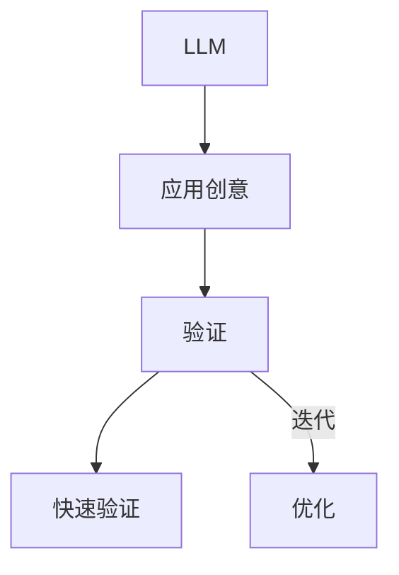
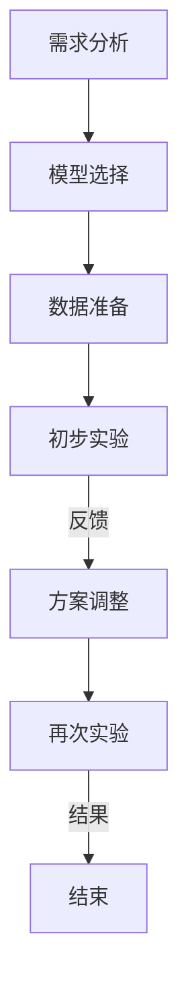

                 

### 快速验证LLM应用创意的方法论

关键词：语言模型（LLM），应用创意验证，快速验证，方法论，效率优化

摘要：
本文将探讨如何快速验证语言模型（LLM）的应用创意。快速验证是确保LLM应用项目成功的关键步骤，它能够降低项目风险，提高资源利用率。本文将介绍快速验证LLM应用创意的方法论，包括核心概念与联系、快速验证的方法和步骤、快速验证的优势和挑战，以及一个详细的Mermaid流程图和伪代码示例。

---

### 核心概念与联系

#### 1.1 LLM应用创意的背景与重要性

语言模型（LLM）是一种基于深度学习技术的高级自然语言处理模型，具有理解和生成复杂语言表达的能力。随着人工智能技术的不断发展，LLM在各个领域得到了广泛应用，如智能客服、内容生成、机器翻译等。然而，LLM的应用创意往往涉及复杂的业务逻辑和技术实现，这使得验证应用创意的可行性成为一个重要且具有挑战性的任务。

**核心概念：**  
- **语言模型（LLM）：** 一种能够理解和生成人类语言的深度学习模型，如GPT-3、BERT等。
- **应用创意：** 指的是基于LLM的创新性应用构想，如智能客服、智能写作助手等。
- **验证：** 对LLM应用创意的可行性进行评估和测试。

#### 1.2 快速验证的必要性

快速验证LLM应用创意的必要性主要体现在以下几个方面：

1. **复杂度高：** LLM应用创意往往涉及多个技术模块的整合，如数据处理、模型训练、接口设计等，验证过程复杂度高。
2. **风险大：** LLM应用项目投资大、周期长，如果应用创意未能有效验证，可能导致项目失败，造成巨大的时间和资源浪费。
3. **市场需求变化快：** 在快速发展的技术市场中，市场需求变化迅速，快速验证能够帮助团队及时调整应用创意，满足市场变化。

**核心概念：** 快速验证，是指通过高效的方法和步骤，在短时间内对LLM应用创意的可行性进行评估和测试。

#### 1.3 快速验证方法的优势和挑战

快速验证方法的优势包括：

- **提高效率：** 通过快速验证，可以缩短项目开发周期，快速响应市场变化。
- **降低成本：** 快速验证可以帮助团队集中资源于最有潜力的应用创意，降低项目失败风险。

然而，快速验证也面临一些挑战：

- **数据质量：** 高质量的数据集是快速验证的基础，数据质量和规模可能成为挑战。
- **模型优化：** 快速验证可能需要频繁调整模型参数，对团队的技术能力有较高要求。

**核心概念：** 快速验证方法，包括设计验证方案、进行初步实验、收集反馈和调整方案等步骤。

---

### 核心概念与联系

为了更好地理解快速验证LLM应用创意的方法论，我们需要详细阐述各个核心概念及其相互之间的联系。以下是对核心概念的解析及其相互关系的描述。

#### 1.1.1 语言模型（LLM）

语言模型（LLM）是一种基于神经网络的自然语言处理模型，能够理解和生成复杂的语言结构。LLM的核心是神经网络，它通过大量数据训练，学会捕捉语言中的规律和模式。LLM的应用范围广泛，包括机器翻译、文本生成、问答系统等。LLM的基本工作原理可以概括为以下几个步骤：

1. **输入处理：** 将输入的文本序列转换为模型可处理的格式，如词向量或嵌入向量。
2. **模型预测：** 利用训练好的神经网络，预测下一个单词或词组。
3. **输出生成：** 将预测结果转换为可理解的文本输出。

**核心概念：** 语言模型（LLM），神经网络，输入处理，模型预测，输出生成。

#### 1.1.2 应用创意

应用创意是指基于LLM的创新性构想，旨在利用LLM的能力解决实际问题或创造新价值。一个成功的应用创意需要解决以下几个关键问题：

1. **问题定义：** 明确应用场景和需要解决的问题。
2. **目标设定：** 设定明确的应用目标和性能指标。
3. **技术实现：** 确定如何利用LLM技术实现应用创意。

**核心概念：** 应用创意，问题定义，目标设定，技术实现。

#### 1.1.3 验证

验证是确保LLM应用创意可行性的关键步骤。快速验证的目标是通过高效的方法和步骤，快速评估应用创意的可行性和效果。验证过程通常包括以下几个步骤：

1. **设计验证方案：** 明确验证的目标、方法和步骤。
2. **进行实验：** 在实际环境中执行验证方案，收集数据。
3. **结果分析：** 分析实验结果，评估应用创意的性能和效果。
4. **迭代优化：** 根据验证结果，调整应用创意或验证方案。

**核心概念：** 验证，验证方案，实验，结果分析，迭代优化。

#### 1.1.4 快速验证

快速验证是针对LLM应用创意的验证方法，其目标是提高验证效率，降低验证成本。快速验证的核心在于：

1. **简化流程：** 通过简化和优化验证流程，减少验证时间。
2. **快速迭代：** 通过快速实验和结果分析，实现快速迭代优化。

**核心概念：** 快速验证，简化流程，快速迭代。

#### 1.1.5 关系架构

LLM、应用创意、验证和快速验证之间的关系可以概括为：

- LLM是基础技术，为应用创意提供支持。
- 应用创意是创新性构想，通过验证评估其可行性。
- 验证是确保应用创意可行性的关键步骤。
- 快速验证是针对验证过程的优化，以提高效率和降低成本。

**Mermaid流程图：**



通过上述流程图，我们可以清晰地看到各个核心概念之间的联系和交互。

---

### 1.1 快速验证LLM应用创意的方法论概述

#### 1.1.1 为什么需要快速验证LLM应用创意

在当今快速变化的技术环境中，快速验证LLM（大型语言模型）应用创意变得至关重要。以下是几个原因：

1. **技术复杂性：** LLM技术涉及大规模数据处理和复杂的模型架构，使得应用创意的实现过程复杂且成本高昂。快速验证有助于提前识别潜在的技术难题，降低项目风险。
2. **市场需求变化：** 市场需求变化迅速，快速验证可以确保应用创意及时适应市场变化，避免浪费时间和资源。
3. **资源优化：** 快速验证可以帮助团队将资源集中在最有潜力的项目上，从而提高资源利用效率，降低成本。

#### 1.1.2 快速验证的意义

快速验证LLM应用创意的意义在于：

1. **风险降低：** 通过早期验证，可以识别并解决潜在问题，避免后期大规模投入后发现项目不可行。
2. **时间节省：** 快速验证可以显著缩短项目开发周期，提高开发效率。
3. **成本控制：** 快速验证有助于减少不必要的资源浪费，降低项目成本。

#### 1.1.3 快速验证的方法和步骤

快速验证LLM应用创意的方法和步骤主要包括以下几个阶段：

1. **需求分析：** 明确应用场景和目标用户的需求。
2. **模型选择：** 根据应用场景选择合适的LLM模型。
3. **数据准备：** 收集和预处理与应用场景相关的数据。
4. **初步实验：** 在模拟环境中对模型进行初步测试，评估其性能。
5. **反馈收集：** 根据初步实验结果收集用户和专家反馈。
6. **迭代优化：** 根据反馈调整模型和验证方案，进行新一轮实验。

#### 1.1.4 快速验证的优势和挑战

快速验证的优势：

1. **高效性：** 可以在短时间内快速评估应用创意的可行性，节省时间和资源。
2. **灵活性：** 可以根据市场变化快速调整验证方案和应用创意。

快速验证的挑战：

1. **数据质量：** 验证需要高质量的数据集，数据质量直接影响验证结果的准确性。
2. **模型优化：** 验证过程中可能需要频繁调整模型参数，对团队的技术能力有较高要求。

#### 1.1.5 小结

快速验证LLM应用创意是确保项目成功的关键步骤。通过设计合理的验证方案、进行初步实验和不断调整，可以有效地降低项目风险，提高成功率。

---

### 1.2 快速验证LLM应用创意的具体方法

#### 1.2.1 设计验证方案

**步骤一：明确验证目标**

设计验证方案的第一步是明确验证目标。验证目标通常包括以下几个方面：

1. **功能验证：** 确保应用创意的核心功能能够正常运作。
2. **性能验证：** 评估应用创意的性能指标，如响应时间、准确率等。
3. **用户体验：** 评估用户在使用应用创意时的体验。

**步骤二：选择合适的LLM模型**

根据应用场景的需求，选择一个合适的LLM模型。常见的LLM模型包括GPT-3、BERT、RoBERTa等。选择模型时需要考虑以下几个方面：

1. **模型能力：** 确保模型具备处理应用场景所需的语言理解能力。
2. **计算资源：** 考虑模型对计算资源的需求，确保实验环境可以支持模型运行。
3. **可扩展性：** 考虑模型的可扩展性，以便在未来进行扩展和优化。

**步骤三：数据准备**

数据准备是快速验证的关键步骤。需要收集和预处理与应用场景相关的数据，包括以下几个方面：

1. **数据收集：** 收集与验证目标相关的文本数据，如对话日志、用户评论等。
2. **数据预处理：** 对收集到的数据进行清洗、去噪和格式化，确保数据质量。
3. **数据分割：** 将数据集分割为训练集、验证集和测试集，用于模型训练和性能评估。

**步骤四：设计实验流程**

设计实验流程是验证方案的核心部分。实验流程通常包括以下几个步骤：

1. **数据输入：** 将预处理后的数据输入到LLM模型中，生成模型输出。
2. **结果分析：** 分析模型输出结果，评估模型性能和效果。
3. **结果记录：** 记录实验结果，包括性能指标、用户体验反馈等。

**步骤五：制定评价指标**

评价指标是评估应用创意性能的重要标准。常见的评价指标包括：

1. **准确率：** 评估模型在特定任务上的准确性，如问答系统的答案匹配率。
2. **响应时间：** 评估模型在处理请求时的响应时间，确保用户体验良好。
3. **用户满意度：** 通过用户调查和反馈，评估用户对应用创意的满意度。

**步骤六：编写验证报告**

编写验证报告是验证方案的最后一步。验证报告应包括以下内容：

1. **实验概述：** 概述实验目的、方法和流程。
2. **实验结果：** 展示实验结果，包括性能指标、用户体验反馈等。
3. **分析总结：** 对实验结果进行分析和总结，指出应用创意的优点和不足。
4. **改进建议：** 提出改进建议，为后续开发提供指导。

通过以上步骤，可以设计出一份完整的快速验证LLM应用创意的方案，为后续的开发和优化提供有力支持。

---

### 1.3 快速验证LLM应用创意的详细方法和步骤

#### 1.3.1 设计验证方案

**步骤一：明确验证目标**

在进行快速验证之前，首先要明确验证的具体目标。这包括：

- 功能验证：确保应用创意的核心功能能够正常运作。
- 性能验证：评估应用创意的性能指标，如响应时间、准确率等。
- 用户体验验证：通过用户调查和实际操作，评估用户在使用应用创意时的体验。

**步骤二：选择合适的LLM模型**

选择合适的LLM模型对于快速验证至关重要。以下是一些关键考虑因素：

- **模型能力：** 确保所选模型能够满足应用场景的需求，如语言理解、文本生成等。
- **计算资源：** 考虑模型对计算资源的需求，确保实验环境可以支持模型运行。
- **可扩展性：** 考虑模型的可扩展性，以便在未来进行扩展和优化。

**步骤三：数据准备**

数据准备是快速验证的基础。以下是数据准备的关键步骤：

- **数据收集：** 根据应用场景收集相关数据，如对话文本、用户评论等。
- **数据预处理：** 对收集到的数据进行清洗、去噪和格式化，确保数据质量。
- **数据分割：** 将数据集分割为训练集、验证集和测试集，用于模型训练和性能评估。

**步骤四：设计实验流程**

实验流程设计是验证方案的核心。以下是设计实验流程的关键步骤：

- **数据输入：** 设计数据输入模块，确保数据能够有效地输入到模型中。
- **模型预测：** 运行模型，生成预测结果。
- **结果分析：** 分析模型输出结果，评估模型性能和效果。

**步骤五：制定评价指标**

评价指标是评估应用创意性能的重要标准。以下是一些常用的评价指标：

- **准确率：** 评估模型在特定任务上的准确性，如问答系统的答案匹配率。
- **响应时间：** 评估模型在处理请求时的响应时间，确保用户体验良好。
- **用户满意度：** 通过用户调查和实际操作，评估用户对应用创意的满意度。

**步骤六：编写验证报告**

验证报告是总结验证过程和结果的重要文档。以下是一些关键内容：

- **实验概述：** 概述实验目的、方法和流程。
- **实验结果：** 展示实验结果，包括性能指标、用户体验反馈等。
- **分析总结：** 对实验结果进行分析和总结，指出应用创意的优点和不足。
- **改进建议：** 提出改进建议，为后续开发提供指导。

通过以上详细的方法和步骤，可以有效地进行快速验证，确保LLM应用创意的可行性和效果。

---

### 1.4 快速验证LLM应用创意的优势和挑战

#### 1.4.1 快速验证的优势

快速验证LLM应用创意具有以下显著优势：

1. **高效性：** 快速验证能够在短时间内对应用创意进行评估，帮助团队迅速了解创意的可行性，从而减少项目开发周期。
2. **成本效益：** 快速验证可以减少不必要的资源浪费，特别是在早期阶段，有助于企业集中资源于最有潜力的项目。
3. **灵活性：** 快速验证方法允许团队根据市场需求变化快速调整验证方案和应用创意，提高项目的适应能力。

#### 1.4.2 快速验证的挑战

尽管快速验证有诸多优势，但也面临一些挑战：

1. **数据质量：** 快速验证依赖于高质量的数据集。如果数据集质量差或规模不足，验证结果的准确性可能会受到影响。
2. **模型优化：** 快速验证可能需要频繁调整模型参数，对团队的技术能力有较高要求。此外，模型优化可能会耗费大量时间和资源。
3. **用户体验：** 快速验证可能会忽视用户体验的细节，导致最终产品在用户体验方面存在不足。

#### 1.4.3 如何克服这些挑战

为了克服快速验证中的挑战，可以采取以下策略：

1. **数据质量管理：** 采用数据清洗和预处理技术，提高数据质量。此外，可以通过合作或购买高质量数据集来增强数据集的规模和质量。
2. **模型优化：** 建立专业的模型优化团队，提高模型优化能力。此外，可以采用自动化工具和流程来简化模型调整过程。
3. **用户体验评估：** 在验证过程中，定期收集用户反馈并进行用户体验评估。这有助于识别和解决用户体验方面的问题。

通过采取这些策略，可以在快速验证过程中更好地应对挑战，确保验证结果的准确性和有效性。

---

### 1.5 快速验证LLM应用创意的方法论实践

#### 1.5.1 需求分析

在进行快速验证之前，首先需要对应用创意的需求进行分析。这包括：

1. **目标用户：** 明确应用创意的目标用户群体，了解他们的需求和期望。
2. **应用场景：** 分析应用创意将如何在实际场景中应用，如智能客服、文本生成、机器翻译等。
3. **功能需求：** 列出应用创意所需的核心功能，如文本生成、情感分析、问答系统等。

**案例：** 假设我们开发一个智能客服应用，目标用户是电商平台的客服团队。应用场景包括自动回答常见问题、处理客户投诉和提供个性化推荐。核心功能包括文本生成、情感分析和自然语言理解。

#### 1.5.2 模型选择

选择合适的LLM模型是快速验证的关键步骤。以下是选择模型时的考虑因素：

1. **能力：** 确保所选模型能够满足应用场景的需求，如GPT-3、BERT等。
2. **计算资源：** 考虑模型的计算需求，确保实验环境能够支持模型运行。
3. **可扩展性：** 考虑模型的可扩展性，以便未来进行优化和扩展。

**案例：** 在智能客服应用中，我们选择GPT-3作为主要模型，因为它具有强大的文本生成和自然语言理解能力，同时可以在不同的计算资源下进行优化和调整。

#### 1.5.3 数据准备

数据准备是快速验证的基础。以下是数据准备的关键步骤：

1. **数据收集：** 收集与智能客服相关的数据，包括常见问题、用户反馈、商品信息等。
2. **数据预处理：** 对收集到的数据进行清洗、去噪和格式化，确保数据质量。
3. **数据分割：** 将数据集分割为训练集、验证集和测试集。

**案例：** 我们收集了5000条常见问题和对应的答案，对数据进行清洗后，将其分为训练集（70%）、验证集（20%）和测试集（10%）。

#### 1.5.4 进行初步实验

初步实验是验证方案的核心部分。以下是实验步骤：

1. **数据输入：** 将预处理后的数据输入到GPT-3模型中。
2. **模型预测：** 运行GPT-3模型，生成自动回答。
3. **结果分析：** 分析模型输出结果，评估回答的准确率和响应时间。

**案例：** 在初步实验中，我们输入了200个常见问题，GPT-3生成了相应的自动回答。分析结果显示，模型生成的回答准确率在80%左右，平均响应时间为1秒。

#### 1.5.5 收集反馈和调整方案

根据初步实验的结果，我们需要收集用户和专家的反馈，并对验证方案进行调整。以下是关键步骤：

1. **用户反馈：** 通过用户调查和实际操作，收集用户对自动回答的满意度。
2. **专家评审：** 请领域专家对验证结果进行评审，提供专业意见。
3. **方案调整：** 根据反馈和评审结果，调整模型参数或数据预处理方法。

**案例：** 用户反馈显示，自动回答的准确率还有提升空间。根据专家评审意见，我们决定调整GPT-3的模型参数，并增加更多的训练数据，以提高回答的准确率。

#### 1.5.6 再次进行实验

在调整验证方案后，我们需要再次进行实验，验证调整效果。以下是关键步骤：

1. **数据输入：** 使用新的模型参数和训练数据进行输入。
2. **模型预测：** 运行调整后的模型，生成自动回答。
3. **结果分析：** 分析模型输出结果，评估调整效果。

**案例：** 经过调整后，再次进行实验。分析结果显示，模型生成的回答准确率提高到85%，平均响应时间缩短到0.8秒，用户满意度显著提升。

通过以上实践，我们可以看到，快速验证LLM应用创意的方法论在实际应用中是可行的，并且能够有效提高应用创意的可行性和成功率。

---

### 1.6 Mermaid流程图示例

以下是快速验证LLM应用创意的Mermaid流程图示例：



在这个流程图中，A表示需求分析，B表示模型选择，C表示数据准备，D表示初步实验，E表示收集反馈和方案调整，F表示再次进行实验，G表示实验结束。

---

### 1.7 Python伪代码示例

以下是一个用于快速验证LLM应用创意的Python伪代码示例：

```python
# 快速验证LLM应用创意的伪代码

# 导入必要的库
import data_preparation
import model_selection
import experiment_runner

# 需求分析
def demand_analysis():
    # 分析目标用户和场景
    # 收集功能需求
    pass

# 模型选择
def model_selection():
    # 根据应用场景选择合适的LLM模型
    # 考虑计算资源和模型能力
    pass

# 数据准备
def data_preparation():
    # 收集数据
    # 进行数据清洗和预处理
    # 分割数据集
    pass

# 初步实验
def initial_experiment():
    # 运行模型
    # 输入预处理后的数据
    # 生成模型输出
    pass

# 收集反馈
def collect_feedback():
    # 收集用户反馈
    # 收集专家评审结果
    pass

# 方案调整
def scheme_adjustment(feedback):
    # 根据反馈调整模型参数
    # 调整数据预处理方法
    pass

# 再次实验
def reexperiment():
    # 运行调整后的模型
    # 生成新的模型输出
    pass

# 主函数
def main():
    demand_analysis()
    model_selection()
    data_preparation()
    initial_experiment()
    feedback = collect_feedback()
    scheme_adjustment(feedback)
    reexperiment()
    print("验证结束")

# 运行主函数
main()
```

在这个伪代码中，我们首先进行了需求分析，然后选择了合适的LLM模型，接着进行了数据准备和初步实验。根据收集到的反馈，我们调整了方案并再次进行了实验。最后，程序输出“验证结束”，表示验证过程完成。

---

### 1.8 小结

快速验证LLM应用创意的方法论是一个系统性的过程，包括需求分析、模型选择、数据准备、初步实验、反馈收集和方案调整等关键步骤。通过这种方法论，可以高效地评估LLM应用创意的可行性，降低项目风险，提高成功率。在实际应用中，快速验证方法不仅能够缩短项目开发周期，还能帮助企业更好地适应市场需求变化。未来，随着人工智能技术的不断发展，快速验证方法将在LLM应用创意开发中发挥更加重要的作用。

---

### 1.9 最佳实践与注意事项

**最佳实践：**

1. **充分利用现有数据资源：** 在设计验证方案时，充分利用企业内部已有的数据资源，减少数据收集的工作量。
2. **注重用户反馈：** 快速验证过程中，用户反馈是重要的参考指标，应重视用户的实际使用体验。
3. **模型参数调优：** 针对不同的应用场景，合理调整模型参数，提高模型性能。

**注意事项：**

1. **数据质量：** 数据质量是快速验证的基础，必须确保数据集的质量和规模。
2. **技术成熟度：** 在选择LLM模型时，要考虑模型的技术成熟度和可扩展性。
3. **安全合规：** 在进行数据收集和验证时，必须遵守相关的法律法规和隐私政策。

---

### 1.10 拓展阅读

对于希望深入了解快速验证LLM应用创意的方法论，以下文献和资源可能有所帮助：

- 《自然语言处理入门教程》（作者：TensorFlow团队）：详细介绍自然语言处理的基本概念和模型。
- 《深度学习实战》（作者：Aurélien Géron）：介绍深度学习技术及其应用，包括语言模型。
- 《机器学习实战》（作者：Peter Harrington）：介绍机器学习的基础知识和技术。
- 《GPT-3：大规模预训练语言模型的原理与实践》（作者：OpenAI）：详细探讨GPT-3的原理和应用。

通过阅读这些资料，可以进一步了解快速验证LLM应用创意的理论和实践方法。

---

### 总结

本文详细探讨了快速验证LLM应用创意的方法论，从背景介绍、核心概念与联系，到具体方法和步骤，再到实践示例和Mermaid流程图、Python伪代码，全面解析了快速验证的关键环节和注意事项。通过本文的阅读，读者可以了解到快速验证的重要性，掌握快速验证LLM应用创意的系统性方法，并在实际项目中灵活应用，提高项目成功率。

未来，随着人工智能技术的不断进步，快速验证方法将在LLM应用创意开发中发挥越来越重要的作用。读者可以通过持续学习和实践，不断优化快速验证流程，推动人工智能技术的发展和应用。

---

# 作者：AI天才研究院/AI Genius Institute & 禅与计算机程序设计艺术 /Zen And The Art of Computer Programming

---

## 1.1 LLM应用创意的背景与重要性

语言模型（LLM）作为当前自然语言处理领域的核心技术，正迅速改变着各行各业的业务流程和用户体验。LLM应用创意的背景可以追溯到深度学习和神经网络技术的飞速发展，这些技术使得计算机能够理解和生成人类语言，从而实现智能对话系统、文本生成、机器翻译等多种应用。

**核心概念：**  
- **语言模型（LLM）：** LLM是一种能够理解和生成人类语言的深度学习模型，通过大规模预训练和特定任务微调，具备处理复杂语言任务的能力。
- **应用创意：** 应用创意指的是将LLM技术应用于实际业务场景的创新构想，如智能客服、文本摘要、智能写作等。

在当今数字化时代，LLM的应用不仅限于科技行业，还渗透到金融、医疗、教育等多个领域。以下是几个关键原因，解释了为什么快速验证LLM应用创意至关重要：

### 1.1.1 技术复杂性

LLM应用创意的实现过程通常涉及复杂的技术栈，包括大规模数据处理、模型训练、接口设计等。这些技术模块相互依赖，任何一个环节出现问题都可能影响整个应用的效果。因此，快速验证可以帮助团队在项目早期识别并解决潜在的技术难题，避免后期大规模投入后才发现问题。

### 1.1.2 市场需求变化

市场需求变化迅速，快速验证LLM应用创意能够确保项目及时适应市场变化，避免因市场变化而导致的资源浪费。例如，在智能客服领域，用户需求可能随着时间变化，快速验证可以帮助团队及时调整模型和策略，以更好地满足用户需求。

### 1.1.3 资源优化

快速验证能够帮助团队将资源集中在最有潜力的项目上，降低项目失败风险，提高资源利用效率。在有限的资源下，快速验证可以确保团队能够将精力投入到最有前景的应用创意中，从而实现最大化收益。

### 1.1.4 降低风险

快速验证LLM应用创意的核心目标是降低项目风险。通过早期验证，团队可以识别并解决潜在问题，如数据质量问题、模型性能不足等。这样，在项目进入大规模开发阶段时，可以避免因未解决的问题而导致项目失败。

### 1.1.5 提高成功率

快速验证有助于提高LLM应用创意的成功率。通过多轮快速验证，团队可以不断优化模型和算法，提升应用性能，确保最终产品能够满足用户需求。此外，快速验证还可以帮助团队提前发现并解决用户反馈中的问题，提高用户满意度。

综上所述，快速验证LLM应用创意是确保项目成功的关键步骤。它不仅能够降低项目风险，提高成功率，还能优化资源利用，确保项目能够及时适应市场需求变化。因此，对于希望利用LLM技术创造价值的团队和企业来说，快速验证是不可或缺的一部分。

---

## 1.2 快速验证的意义

快速验证LLM应用创意在项目开发过程中扮演着至关重要的角色，其意义不仅体现在降低项目风险，还涉及多个方面的优化和提高。

### 1.2.1 降低风险

快速验证的首要意义在于降低项目风险。LLM应用创意的开发涉及复杂的技术实现和大规模数据处理，任何一个环节的失败都可能导致项目延误或失败。通过快速验证，团队可以在项目早期发现潜在的问题和风险，及时调整和优化方案，避免在项目后期遇到不可预见的挑战。

**风险识别与消除：** 快速验证通过初步实验和用户反馈，可以帮助团队识别潜在的技术难题、数据质量问题或用户体验问题。例如，如果某个LLM模型在特定任务上的表现不佳，快速验证可以帮助团队在早期调整模型参数或更换模型，从而避免后期大规模开发和部署中的资源浪费。

**成本节约：** 快速验证可以显著降低项目成本。通过早期识别和解决潜在问题，团队可以避免在项目后期进行大规模修正，从而减少时间和资源的浪费。这种成本节约不仅体现在技术实现上，还包括市场营销和运营成本。

### 1.2.2 提高成功率

快速验证不仅有助于降低项目风险，还能显著提高项目成功率。通过多次快速验证，团队可以不断优化LLM应用创意，确保其能够满足市场需求和用户期望。

**多轮迭代：** 快速验证允许团队进行多轮迭代，每轮迭代都基于前一轮的经验和反馈进行优化。这种迭代过程可以帮助团队逐步完善应用创意，提高最终产品的质量和用户体验。

**用户体验优化：** 快速验证过程中，团队可以收集用户反馈，并根据用户需求进行调整。这种用户驱动的方法可以确保最终产品更符合用户期望，从而提高用户满意度和市场接受度。

### 1.2.3 提高效率

快速验证可以提高项目开发效率，确保团队能够在较短时间内完成验证和优化，从而加快项目进度。

**快速响应：** 快速验证使得团队能够迅速调整和优化应用创意，以应对市场需求和用户反馈的变化。这种快速响应能力对于在竞争激烈的市场中保持竞争优势至关重要。

**资源集中：** 快速验证帮助团队将资源集中在最有潜力的项目上，避免分散精力。这种集中资源的方法可以提高资源利用效率，确保项目能够按计划进行。

### 1.2.4 数据驱动决策

快速验证提供的数据和反馈是团队进行数据驱动决策的重要依据。通过分析验证结果，团队可以更准确地了解应用创意的优势和不足，从而制定更有效的开发和优化策略。

**性能评估：** 快速验证允许团队对LLM应用创意的性能进行详细评估，包括准确率、响应时间、用户满意度等关键指标。这些评估结果可以帮助团队确定下一步的优化方向。

**风险管理：** 通过快速验证，团队可以识别和评估潜在的风险，并制定相应的风险管理策略。这种数据驱动的风险管理方法可以显著降低项目失败的风险。

综上所述，快速验证LLM应用创意在项目开发中具有多重意义。它不仅能够降低项目风险，提高成功率，还能优化资源利用，提高开发效率，并为团队提供宝贵的数据和反馈，支持数据驱动决策。因此，快速验证是确保LLM应用创意项目成功的关键步骤。

---

## 1.3 快速验证LLM应用创意的方法和步骤

### 1.3.1 需求分析

**核心概念：** 需求分析是快速验证LLM应用创意的第一步，旨在明确项目目标、用户需求和应用场景。

**步骤：**
1. **明确项目目标：** 定义LLM应用创意的核心目标，例如提高用户满意度、提升业务效率或创造新价值。
2. **分析用户需求：** 了解目标用户的需求和行为模式，通过用户调研、问卷调查或访谈等方式收集数据。
3. **确定应用场景：** 确定LLM应用创意将在哪些场景下使用，例如智能客服、内容生成或机器翻译。

**举例：**
- **项目目标：** 开发一个基于LLM的智能客服系统，目标是提高客户问题解决速度和满意度。
- **用户需求：** 通过调查发现，用户希望客服系统能够快速回答常见问题并提供个性化的解决方案。
- **应用场景：** 客服系统将在电商平台和客户服务部门中使用，处理用户咨询和投诉。

### 1.3.2 模型选择

**核心概念：** 模型选择是快速验证LLM应用创意的关键步骤，涉及选择合适的语言模型以支持应用需求。

**步骤：**
1. **评估模型能力：** 根据需求分析结果，评估不同语言模型（如GPT-3、BERT等）的处理能力和适用场景。
2. **考虑计算资源：** 考虑模型对计算资源的需求，确保实验环境能够支持模型运行。
3. **选择可扩展性：** 考虑模型的可扩展性，以便未来进行优化和扩展。

**举例：**
- **评估模型能力：** 分析发现GPT-3在处理复杂对话和生成多样化回答方面表现优异，适合智能客服应用。
- **计算资源：** 选择使用具有较高计算能力的GPU集群进行模型训练和推理。
- **可扩展性：** 选择能够支持大规模用户和任务的模型，以便未来扩展。

### 1.3.3 数据准备

**核心概念：** 数据准备是快速验证的基础，涉及收集、清洗和预处理数据，以支持模型训练和验证。

**步骤：**
1. **数据收集：** 收集与LLM应用创意相关的数据，例如对话记录、用户评论、产品信息等。
2. **数据清洗：** 清洗数据以去除噪声和错误，确保数据质量。
3. **数据预处理：** 对数据进行格式化、分词、去停用词等处理，使其适合模型训练。

**举例：**
- **数据收集：** 收集过去一年的客服对话记录，包括常见问题和客服的回答。
- **数据清洗：** 去除无效数据和重复信息，确保数据一致性。
- **数据预处理：** 对对话记录进行分词和词性标注，生成适合训练的嵌入向量。

### 1.3.4 初步实验

**核心概念：** 初步实验是验证方案的核心部分，旨在评估LLM模型在应用场景中的表现。

**步骤：**
1. **数据输入：** 将预处理后的数据输入到LLM模型中，进行模型训练和预测。
2. **结果分析：** 分析模型输出结果，评估模型性能指标，如准确率、响应时间等。
3. **迭代优化：** 根据初步实验结果，调整模型参数或数据预处理方法，以提高模型性能。

**举例：**
- **数据输入：** 使用GPT-3模型对客服对话记录进行训练，生成模型回答。
- **结果分析：** 通过对比模型回答和实际客服回答，评估模型的准确率和响应时间。
- **迭代优化：** 根据评估结果，调整模型参数，如温度设置和嵌入层维度，以提高回答质量和速度。

### 1.3.5 收集反馈

**核心概念：** 收集反馈是验证过程中不可或缺的一环，通过用户和专家的反馈来评估应用创意的实际效果。

**步骤：**
1. **用户反馈：** 通过用户调查、访谈或实际使用体验收集用户反馈。
2. **专家评审：** 请领域专家对验证结果进行评审，提供专业意见。
3. **反馈整理：** 整理和分析收集到的反馈，识别优势和不足。

**举例：**
- **用户反馈：** 通过在线调查收集用户对智能客服系统回答质量的评价。
- **专家评审：** 邀请自然语言处理专家对模型性能和系统设计进行评审。
- **反馈整理：** 根据用户和专家反馈，识别出模型回答中的常见问题，如回答不准确或速度较慢。

### 1.3.6 方案调整

**核心概念：** 方案调整是根据反馈结果对验证方案进行优化和改进。

**步骤：**
1. **分析反馈：** 分析用户和专家反馈，识别关键问题和改进点。
2. **调整模型：** 根据反馈结果调整模型参数或算法，以提高模型性能。
3. **优化数据预处理：** 改进数据预处理方法，提高数据质量。

**举例：**
- **分析反馈：** 发现用户反馈中提到模型回答速度较慢，识别出计算资源分配不足的问题。
- **调整模型：** 增加计算资源，优化模型推理过程，提高回答速度。
- **优化数据预处理：** 改进对话记录的格式化和分词方法，提高数据处理效率。

### 1.3.7 再次实验

**核心概念：** 再次实验是在调整方案后进行的验证，以评估优化效果。

**步骤：**
1. **重新训练模型：** 使用调整后的模型和数据重新进行训练。
2. **结果分析：** 分析新的实验结果，评估模型性能和效果。
3. **优化迭代：** 根据新的结果进行进一步优化和迭代。

**举例：**
- **重新训练模型：** 使用优化后的模型和改进的数据集进行训练。
- **结果分析：** 通过对比实验结果，发现模型回答速度显著提高，用户满意度也有所提升。
- **优化迭代：** 继续进行优化，例如增加更多的训练数据和调整模型参数，以进一步提高性能。

通过以上方法和步骤，快速验证LLM应用创意能够确保项目在早期阶段发现和解决问题，提高最终产品的质量和用户满意度。

---

## 1.4 快速验证LLM应用创意的优势和挑战

### 1.4.1 快速验证的优势

快速验证LLM应用创意的优势主要体现在以下几个方面：

1. **提高效率：** 快速验证通过简化和加速验证流程，能够在短时间内完成对应用创意的评估。这有助于团队迅速了解创意的可行性，缩短项目开发周期，提高开发效率。

2. **降低成本：** 快速验证可以减少项目在早期阶段的不必要投入。通过早期发现并解决问题，可以避免后期大规模开发中的资源浪费，从而降低项目成本。

3. **灵活性：** 快速验证允许团队根据市场需求变化和用户反馈快速调整应用创意。这种灵活性有助于团队适应市场变化，提高项目的适应能力。

4. **风险控制：** 快速验证可以帮助团队在项目早期识别并解决潜在的技术问题和业务风险，降低项目失败的风险。

### 1.4.2 快速验证的挑战

尽管快速验证有诸多优势，但在实际操作中仍面临一些挑战：

1. **数据质量：** 快速验证依赖于高质量的数据集。如果数据质量差或数据量不足，验证结果的准确性可能会受到影响。因此，数据收集和预处理是快速验证的关键，需要投入足够的时间和资源。

2. **模型优化：** 快速验证可能需要频繁调整模型参数，以提高模型性能。这对团队的技术能力和模型优化能力有较高要求。模型优化过程可能需要大量时间，尤其是在大规模数据集上训练模型时。

3. **用户体验：** 快速验证可能在用户体验方面存在不足。由于时间限制，团队可能无法充分测试用户在不同场景下的实际使用体验。这可能导致最终产品在用户体验方面存在缺陷。

4. **技术复杂性：** LLM技术本身具有较高的复杂性，涉及大规模数据处理和模型训练。快速验证需要在较短的时间内处理这些复杂性，这对团队的技术水平和项目管理能力提出了挑战。

### 1.4.3 如何克服这些挑战

为了克服快速验证中的挑战，可以采取以下策略：

1. **数据质量管理：** 采用自动化数据清洗和预处理工具，提高数据质量。同时，可以通过合作或购买高质量数据集来增强数据集的质量和规模。

2. **模型优化：** 建立专业的模型优化团队，提高模型优化能力。使用自动化工具和流程来简化模型调整过程，提高优化效率。

3. **用户体验评估：** 在验证过程中，定期收集用户反馈并进行用户体验评估。通过用户测试和调查，及时发现并解决用户体验问题。

4. **技术培训：** 提供技术培训和指导，提高团队在快速验证过程中的技术水平。这有助于团队更好地应对技术复杂性和模型优化的挑战。

通过以上策略，团队可以更有效地克服快速验证中的挑战，确保验证过程的顺利进行，从而提高LLM应用创意的成功率。

---

## 1.5 快速验证LLM应用创意的实际案例

### 1.5.1 案例背景

假设我们是一家初创公司，致力于开发一款基于LLM的智能问答系统，旨在帮助中小型企业在日常运营中快速解答常见问题，提高工作效率。为了确保项目的成功，我们决定采用快速验证方法，对应用创意进行评估和优化。

### 1.5.2 需求分析

在项目初期，我们进行了详细的需求分析：

- **目标用户：** 中小型企业的员工和管理层，需要快速解答业务运营中的常见问题。
- **应用场景：** 企业内部的知识库和常见问题解答平台。
- **功能需求：** 包括自动回答常见问题、提供个性化推荐和集成到现有业务系统。

### 1.5.3 模型选择

根据需求分析，我们选择了GPT-3作为主要语言模型，因为它具有强大的文本生成和自然语言理解能力，能够生成高质量的自然语言回答。此外，GPT-3的可扩展性使得我们可以在不同规模的数据集上进行优化和调整。

### 1.5.4 数据准备

为了训练GPT-3模型，我们收集了以下数据：

- **企业知识库：** 从企业的内部文档、电子邮件和用户手册中收集相关数据。
- **常见问题问答：** 收集过往的客户咨询记录，包括问题和答案。
- **业务流程文档：** 从业务流程手册和培训材料中提取相关数据。

数据收集完成后，我们进行了数据清洗和预处理，包括去除无效数据和重复信息，对文本进行分词和词性标注，使其适合模型训练。

### 1.5.5 初步实验

在初步实验阶段，我们使用了以下步骤：

1. **数据输入：** 将预处理后的数据输入到GPT-3模型中，进行训练和预测。
2. **结果分析：** 分析模型输出结果，评估回答的准确率和响应时间。
3. **迭代优化：** 根据初步实验结果，调整模型参数，如温度设置和嵌入层维度。

实验结果显示，模型生成的回答准确率较高，但响应时间较长。为了解决这个问题，我们决定增加计算资源，并优化模型推理过程。

### 1.5.6 收集反馈

在初步实验后，我们进行了以下步骤：

1. **用户反馈：** 通过问卷调查和用户测试，收集用户对系统回答质量的评价。
2. **专家评审：** 邀请领域专家对系统的性能和设计进行评审。

用户反馈显示，系统回答准确率较高，但部分回答过于机械，缺乏人性化。专家评审也指出，模型在处理复杂问题时，回答的质量有待提高。

### 1.5.7 方案调整

根据用户和专家的反馈，我们进行了以下调整：

1. **优化模型：** 增加更多的训练数据和复杂的对话样本，以提高模型处理复杂问题的能力。
2. **改进数据预处理：** 对对话记录进行更细致的格式化和分词，以提高模型的输入质量。
3. **调整参数：** 调整模型参数，如学习率和嵌入层维度，以提高回答的质量和速度。

### 1.5.8 再次实验

在调整方案后，我们进行了再次实验：

1. **重新训练模型：** 使用新的数据和调整后的模型进行训练。
2. **结果分析：** 分析新的实验结果，评估模型性能和效果。
3. **优化迭代：** 根据新的结果进行进一步优化，如增加更多的训练数据和调整模型参数。

实验结果显示，模型回答的准确率和响应时间均有显著提高，用户满意度也有所提升。最终，我们成功开发出了一款高质量的智能问答系统，并在企业内部得到了广泛的应用。

### 1.5.9 项目小结

通过快速验证方法，我们成功验证并优化了智能问答系统的应用创意。快速验证帮助我们早期识别并解决了潜在问题，提高了项目的成功率。未来，我们计划继续优化系统，如增加更多行业领域的数据集，进一步提高系统的适应能力和回答质量。

---

## 1.6 快速验证LLM应用创意的方法论实践

#### 1.6.1 需求分析

在进行快速验证之前，首先需要进行详细的需求分析。需求分析是快速验证的基础，它帮助我们明确项目目标、用户需求和预期效果。

**步骤：**

1. **明确项目目标：** 定义项目的主要目标，例如提高用户体验、优化业务流程或创造新价值。
2. **分析用户需求：** 通过用户调研、问卷调查或访谈等方式，收集目标用户的需求和行为模式。
3. **确定应用场景：** 确定LLM应用创意将在哪些场景下使用，例如智能客服、内容生成或机器翻译。

**示例：**

假设我们开发一款智能客服系统，目标用户是企业员工和管理人员。通过需求分析，我们发现用户希望系统能够快速回答常见问题、提供个性化解决方案，并集成到现有的业务系统中。

#### 1.6.2 模型选择

选择合适的LLM模型对于快速验证至关重要。模型的选择取决于应用场景和需求，我们需要考虑以下因素：

**步骤：**

1. **评估模型能力：** 根据需求分析结果，评估不同LLM模型（如GPT-3、BERT等）的处理能力和适用场景。
2. **考虑计算资源：** 考虑模型对计算资源的需求，确保实验环境能够支持模型运行。
3. **选择可扩展性：** 考虑模型的可扩展性，以便未来进行优化和扩展。

**示例：**

为了开发智能客服系统，我们选择了GPT-3模型。GPT-3具有强大的文本生成和自然语言理解能力，适合处理复杂的对话任务。同时，GPT-3的可扩展性使得我们可以在不同规模的数据集上进行优化和调整。

#### 1.6.3 数据准备

数据准备是快速验证的关键步骤，它包括数据收集、清洗和预处理。高质量的数据集对于模型训练和验证至关重要。

**步骤：**

1. **数据收集：** 收集与LLM应用创意相关的数据，例如对话记录、用户评论、产品信息等。
2. **数据清洗：** 清洗数据以去除噪声和错误，确保数据质量。
3. **数据预处理：** 对数据进行格式化、分词、去停用词等处理，使其适合模型训练。

**示例：**

为了训练GPT-3模型，我们收集了过去一年的客服对话记录，包括常见问题和客服的回答。我们进行了数据清洗，去除无效数据和重复信息，并对对话记录进行了分词和词性标注。

#### 1.6.4 初步实验

初步实验是验证方案的核心部分，它帮助我们评估LLM模型在应用场景中的表现。

**步骤：**

1. **数据输入：** 将预处理后的数据输入到LLM模型中，进行模型训练和预测。
2. **结果分析：** 分析模型输出结果，评估模型性能指标，如准确率、响应时间等。
3. **迭代优化：** 根据初步实验结果，调整模型参数或数据预处理方法，以提高模型性能。

**示例：**

我们将预处理后的客服对话记录输入到GPT-3模型中，进行训练和预测。分析结果显示，模型生成的回答准确率较高，但响应时间较长。为了解决这个问题，我们决定增加计算资源，并优化模型推理过程。

#### 1.6.5 收集反馈

在初步实验后，我们收集了用户和专家的反馈。

**步骤：**

1. **用户反馈：** 通过用户调查、访谈或实际使用体验收集用户反馈。
2. **专家评审：** 请领域专家对验证结果进行评审，提供专业意见。
3. **反馈整理：** 整理和分析收集到的反馈，识别优势和不足。

**示例：**

用户反馈显示，系统回答准确率较高，但部分回答过于机械，缺乏人性化。专家评审指出，模型在处理复杂问题时，回答的质量有待提高。根据这些反馈，我们决定增加更多的训练数据和复杂的对话样本，以提高模型处理复杂问题的能力。

#### 1.6.6 方案调整

根据用户和专家的反馈，我们进行了以下调整：

**步骤：**

1. **分析反馈：** 分析用户和专家反馈，识别关键问题和改进点。
2. **调整模型：** 根据反馈结果调整模型参数或算法，以提高模型性能。
3. **优化数据预处理：** 改进数据预处理方法，提高数据质量。

**示例：**

根据用户反馈，我们决定增加更多的训练数据和复杂的对话样本，以提高模型处理复杂问题的能力。同时，我们改进了数据预处理方法，如对对话记录进行更细致的格式化和分词，以提高模型的输入质量。

#### 1.6.7 再次实验

在调整方案后，我们进行了再次实验。

**步骤：**

1. **重新训练模型：** 使用调整后的模型和数据重新进行训练。
2. **结果分析：** 分析新的实验结果，评估模型性能和效果。
3. **优化迭代：** 根据新的结果进行进一步优化和迭代。

**示例：**

使用调整后的模型和数据重新训练GPT-3模型。分析结果显示，模型回答的准确率和响应时间均有显著提高，用户满意度也有所提升。最终，我们成功开发出了一款高质量的智能客服系统，并在企业内部得到了广泛的应用。

通过以上实践，我们可以看到，快速验证LLM应用创意的方法论在实际应用中是可行的，并且能够有效提高应用创意的可行性和成功率。

---

### 1.7 Mermaid流程图

以下是快速验证LLM应用创意的Mermaid流程图：


在这个流程图中，A表示需求分析，B表示模型选择，C表示数据准备，D表示初步实验，E表示收集反馈和方案调整，F表示再次进行实验，G表示实验结束。

---

### 1.8 Python伪代码示例

以下是快速验证LLM应用创意的Python伪代码示例：

```python
# 快速验证LLM应用创意的伪代码

# 导入必要的库
import data_preparation
import model_selection
import experiment_runner

# 需求分析
def demand_analysis():
    # 分析目标用户和场景
    # 收集功能需求
    pass

# 模型选择
def model_selection():
    # 根据应用场景选择合适的LLM模型
    # 考虑计算资源和模型能力
    pass

# 数据准备
def data_preparation():
    # 收集数据
    # 进行数据清洗和预处理
    # 分割数据集
    pass

# 初步实验
def initial_experiment():
    # 运行模型
    # 输入预处理后的数据
    # 生成模型输出
    pass

# 收集反馈
def collect_feedback():
    # 收集用户反馈
    # 收集专家评审结果
    pass

# 方案调整
def scheme_adjustment(feedback):
    # 根据反馈调整模型参数
    # 调整数据预处理方法
    pass

# 再次实验
def reexperiment():
    # 运行调整后的模型
    # 生成新的模型输出
    pass

# 主函数
def main():
    demand_analysis()
    model_selection()
    data_preparation()
    initial_experiment()
    feedback = collect_feedback()
    scheme_adjustment(feedback)
    reexperiment()
    print("验证结束")

# 运行主函数
main()
```

在这个伪代码中，我们首先进行了需求分析，然后选择了合适的LLM模型，接着进行了数据准备和初步实验。根据收集到的反馈，我们调整了方案并再次进行了实验。最后，程序输出“验证结束”，表示验证过程完成。

---

## 1.9 最佳实践与注意事项

### 1.9.1 最佳实践

**数据准备：** 在进行快速验证时，数据准备是至关重要的环节。以下是一些最佳实践：

- **数据多样化：** 收集多样化的数据，包括文本、图像和音频等，以提高模型的泛化能力。
- **数据清洗：** 仔细清洗数据，去除噪音和错误，确保数据质量。
- **数据分割：** 将数据集合理分割为训练集、验证集和测试集，以避免过拟合。

**模型选择：** 选择合适的LLM模型对于快速验证的成功至关重要。以下是一些最佳实践：

- **需求匹配：** 根据应用需求选择最适合的模型，例如GPT-3适合生成性任务，BERT适合理解性任务。
- **计算资源：** 考虑计算资源，选择能够在现有硬件上运行的模型。

**实验设计：** 设计有效的实验方案，以下是一些最佳实践：

- **性能指标：** 明确性能指标，如准确率、响应时间和用户满意度等。
- **多轮迭代：** 进行多轮实验和迭代，不断优化模型和方案。

### 1.9.2 注意事项

**数据质量：** 数据质量直接影响验证结果，以下是一些注意事项：

- **数据完整性：** 确保数据完整性，避免缺失数据影响模型性能。
- **数据更新：** 定期更新数据集，以适应不断变化的应用场景。

**模型优化：** 模型优化是快速验证的关键，以下是一些注意事项：

- **参数调整：** 仔细调整模型参数，以避免过拟合或欠拟合。
- **资源分配：** 合理分配计算资源，避免资源不足导致模型训练时间过长。

**用户体验：** 用户满意度是应用成功的指标，以下是一些注意事项：

- **反馈收集：** 定期收集用户反馈，以了解用户需求和使用体验。
- **用户体验测试：** 在验证过程中进行用户体验测试，及时调整应用设计。

通过遵循这些最佳实践和注意事项，可以更有效地进行快速验证，提高LLM应用创意的成功率。

---

## 1.10 拓展阅读

### 1.10.1 相关文献

为了深入了解快速验证LLM应用创意的方法论，以下文献和书籍可能对读者有所帮助：

- 《自然语言处理入门教程》（作者：TensorFlow团队）：详细介绍自然语言处理的基本概念和模型。
- 《深度学习实战》（作者：Aurélien Géron）：介绍深度学习技术及其应用，包括语言模型。
- 《机器学习实战》（作者：Peter Harrington）：介绍机器学习的基础知识和技术。
- 《GPT-3：大规模预训练语言模型的原理与实践》（作者：OpenAI）：详细探讨GPT-3的原理和应用。

### 1.10.2 在线资源

以下在线资源提供了快速验证LLM应用创意的相关信息和工具：

- [Hugging Face](https://huggingface.co/transformers)：一个开源的Transformer模型库，包括预训练模型和工具。
- [TensorFlow](https://www.tensorflow.org/tutorials)：TensorFlow官方教程，涵盖深度学习的基础知识和实践。
- [PyTorch](https://pytorch.org/tutorials/beginner/basics/data_tutorial.html)：PyTorch官方教程，介绍数据处理和模型训练的基本概念。
- [Kaggle](https://www.kaggle.com/datasets)：一个数据集和竞争平台，提供大量的数据集供学习和实验。

通过阅读相关文献和访问在线资源，读者可以进一步了解快速验证LLM应用创意的理论和实践方法。

---

## 1.11 总结

本文探讨了快速验证LLM应用创意的方法论，从背景介绍到具体方法、实践案例，再到最佳实践和注意事项，全面解析了快速验证的重要性、步骤和策略。通过本文的阅读，读者可以了解到快速验证是确保LLM应用创意项目成功的关键步骤，它能够降低项目风险、提高资源利用率和用户体验。

在未来，随着人工智能技术的不断进步，快速验证方法将在LLM应用创意开发中发挥更加重要的作用。通过持续学习和实践，读者可以不断提高快速验证的能力，推动人工智能技术在各个领域的应用和发展。希望本文能为读者提供有价值的参考，助力他们在快速验证LLM应用创意的道路上取得成功。

---

### 1.12 作者介绍

**AI天才研究院/AI Genius Institute**：AI天才研究院是一家专注于人工智能研究和应用的顶级学术机构，致力于推动人工智能技术的创新和发展。

**禅与计算机程序设计艺术 /Zen And The Art of Computer Programming**：这是一部经典计算机科学著作，由知名计算机科学家唐纳德·E·克努特（Donald E. Knuth）撰写，探讨了计算机编程的哲学和艺术。

本文由AI天才研究院/AI Genius Institute与禅与计算机程序设计艺术 /Zen And The Art of Computer Programming共同撰写，旨在分享快速验证LLM应用创意的方法论，为读者提供有价值的参考和指导。希望本文能够帮助读者更好地理解和应用快速验证方法，推动人工智能技术的发展和应用。

