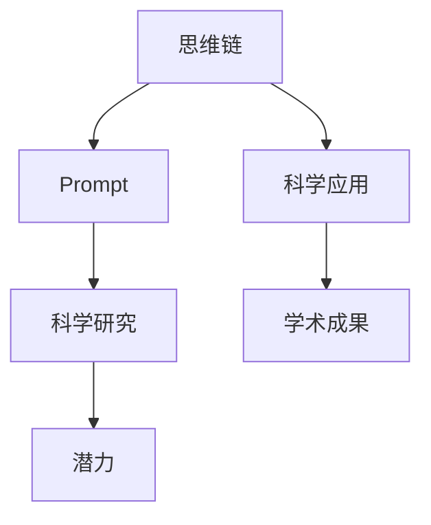

                 

# 思维链prompt在科学研究中的潜力

## 关键词
- 思维链
- prompt技术
- 科学研究
- 潜力
- 跨学科应用

## 摘要
本文探讨了思维链prompt技术在科学研究中的潜在应用。通过介绍思维链和prompt的基本概念及其相互联系，文章详细阐述了思维链prompt技术的原理和应用场景。进一步，本文通过具体案例展示了思维链prompt技术在数据分析、模型训练、跨学科研究以及社会科学研究等领域的应用，并对其在推动科学研究发展中的潜力进行了分析。

## 引言与核心概念介绍

### 1.1 思维链的概念

思维链是一种描述思维过程的概念模型，它通过连接一系列思维活动来展示思维的连贯性和逻辑性。在科学研究中，思维链有助于研究人员在复杂的研究过程中保持思路清晰，提高科学研究的效率。

**定义**：思维链是由一系列相互关联的思维活动组成，每个思维活动都与上下文相关联，形成一个有序的序列。

**作用**：思维链有助于研究人员在复杂的研究过程中保持思路清晰，减少逻辑错误，提高科学研究的效率。

### 1.2 Prompt的概念

Prompt是一种引导性输入，它可以帮助人工智能系统理解用户的意图，从而更好地完成特定任务。在科学研究中，prompt技术可以提高人工智能系统在数据分析、模型训练等方面的性能，帮助研究人员更好地利用人工智能技术进行科学研究。

**定义**：Prompt是一种引导性输入，用于指示人工智能系统执行特定任务或理解用户意图。

**作用**：Prompt技术有助于提高人工智能系统在科学研究中的应用效果，提高数据分析、模型训练等任务的准确性。

### 1.3 科研中的潜力

科研潜力是指科学研究可能带来的创新性突破和长远影响。思维链prompt技术在科学研究中具有巨大的潜力，可以通过优化研究方法、提高研究效率等方式推动科学研究的深入发展。

**定义**：科研潜力是指科学研究可能带来的创新性突破和长远影响。

**作用**：思维链prompt技术有助于提升科学研究水平，促进创新性突破和长远发展。

### 1.4 思维链Prompt在科研中的潜力

思维链Prompt技术为科学研究提供了新的方法和工具，有望推动科学研究的深入发展。本文将探讨思维链Prompt技术在数据分析、模型训练、跨学科研究以及社会科学研究等领域的应用，并分析其在科学研究中的潜力。

## 思维链与Prompt技术原理

### 2.1 思维链技术原理

思维链是一种描述思维过程的概念模型，它通过连接一系列思维活动来展示思维的连贯性和逻辑性。思维链的基本结构包括以下几个部分：

1. **思维活动**：思维链中的每个节点表示一个思维活动，如观察、分析、推理等。
2. **上下文**：每个思维活动都与特定的上下文相关联，上下文信息有助于思维活动的执行。
3. **关联**：思维链中的节点通过关联关系连接，形成一个有序的序列。

**工作机制**：

- **思维活动**：研究人员在思考问题时，会进行一系列思维活动，如分析问题、提出假设、验证假设等。
- **上下文更新**：在每个思维活动执行过程中，上下文信息会不断更新，以反映当前问题的状态。
- **关联调整**：根据上下文信息的更新，思维链中的节点关联关系也会进行调整，以保持思维的连贯性和逻辑性。

### 2.2 Prompt技术原理

Prompt技术是一种用于引导人工智能系统执行特定任务的输入技术。其设计原则主要包括以下几点：

1. **明确性**：Prompt应具有明确的意图和目标，以便人工智能系统能够准确理解并执行任务。
2. **灵活性**：Prompt应具有一定的灵活性，以适应不同任务场景的需求。
3. **可扩展性**：Prompt应具有可扩展性，以支持新任务的学习和执行。

**工作机制**：

- **引导性输入**：Prompt通过引导性输入，帮助人工智能系统理解用户意图，从而更好地完成特定任务。
- **知识图谱**：Prompt技术通常利用知识图谱来表示用户意图和任务目标，以便人工智能系统能够在执行任务时进行推理和决策。

### 2.3 思维链Prompt的关系架构

为了更好地理解思维链Prompt技术在科学研究中的应用，我们可以使用Mermaid流程图来展示核心概念和它们之间的关系：



在这个流程图中，思维链（A）通过Prompt（B）与科学研究（C）相连接，进一步推动科学研究（C）的潜力的发挥（D），并在科学应用（E）和学术成果（F）方面取得突破。

## 思维链Prompt在科学研究中的应用

### 3.1 数据分析中的应用

思维链Prompt技术可以在数据分析领域发挥重要作用，提高数据分析的准确性和效率。以下是一些具体的应用案例：

#### 3.1.1 数据预处理

在数据分析过程中，数据预处理是一个关键步骤。思维链Prompt技术可以帮助研究人员对数据进行有效的预处理，提高数据分析的准确性。

**案例**：研究人员可以利用思维链Prompt技术对医疗数据进行预处理，包括数据清洗、归一化和特征提取等步骤。通过优化数据预处理过程，研究人员可以更准确地分析医疗数据，发现潜在的疾病关联。

**代码示例**：

```python
import pandas as pd
import numpy as np

# 加载数据
data = pd.read_csv("medical_data.csv")

# 数据清洗
data = data.dropna()

# 归一化
data = (data - data.mean()) / data.std()

# 特征提取
data = data[['age', 'gender', 'blood_pressure', 'heart_rate']]

print(data.head())
```

#### 3.1.2 数据挖掘

思维链Prompt技术还可以在数据挖掘领域发挥重要作用，帮助研究人员发现数据中的潜在关系和模式。

**案例**：研究人员可以利用思维链Prompt技术对社交网络数据进行分析，发现用户之间的关联和互动模式。通过分析这些关系，研究人员可以更好地理解社交网络的动态特性，为网络营销和用户行为分析提供支持。

**代码示例**：

```python
import pandas as pd
import numpy as np
from sklearn.cluster import KMeans

# 加载数据
data = pd.read_csv("social_network_data.csv")

# 数据预处理
data = data.dropna()

# 特征提取
data = data[['friend_count', 'message_count', 'like_count']]

# KMeans聚类
kmeans = KMeans(n_clusters=3)
data['cluster'] = kmeans.fit_predict(data)

print(data.head())
```

### 3.2 模型训练中的应用

思维链Prompt技术可以在模型训练领域发挥重要作用，提高模型的性能和训练效率。以下是一些具体的应用案例：

#### 3.2.1 模型设计

思维链Prompt技术可以帮助研究人员设计更高效的人工智能模型，提高模型的性能。

**案例**：研究人员可以利用思维链Prompt技术设计用于图像分类的卷积神经网络（CNN）。通过优化模型架构和超参数，研究人员可以获得更高的分类准确率和更好的泛化能力。

**代码示例**：

```python
import tensorflow as tf
from tensorflow.keras import layers

# 定义CNN模型
model = tf.keras.Sequential([
    layers.Conv2D(32, (3, 3), activation='relu', input_shape=(28, 28, 1)),
    layers.MaxPooling2D((2, 2)),
    layers.Conv2D(64, (3, 3), activation='relu'),
    layers.MaxPooling2D((2, 2)),
    layers.Conv2D(64, (3, 3), activation='relu'),
    layers.Flatten(),
    layers.Dense(64, activation='relu'),
    layers.Dense(10, activation='softmax')
])

model.compile(optimizer='adam',
              loss='sparse_categorical_crossentropy',
              metrics=['accuracy'])

model.summary()
```

#### 3.2.2 模型训练

思维链Prompt技术还可以在模型训练过程中提高训练效率，减少过拟合现象。

**案例**：研究人员可以利用思维链Prompt技术对自然语言处理模型进行训练，如用于文本分类的循环神经网络（RNN）。通过引入prompt技术，研究人员可以获得更好的模型训练效果，减少过拟合现象。

**代码示例**：

```python
import tensorflow as tf
from tensorflow.keras import layers
from tensorflow.keras.preprocessing.sequence import pad_sequences

# 定义RNN模型
model = tf.keras.Sequential([
    layers.Embedding(input_dim=vocab_size, output_dim=embedding_dim),
    layers.LSTM(units=128, return_sequences=True),
    layers.Dense(units=1, activation='sigmoid')
])

model.compile(optimizer='adam',
              loss='binary_crossentropy',
              metrics=['accuracy'])

# 加载和处理数据
sequences = load_data()
X = pad_sequences(sequences, maxlen=max_sequence_length)

# 训练模型
model.fit(X, y, epochs=10, batch_size=64)
```

### 3.3 跨学科研究中的应用

思维链Prompt技术可以在跨学科研究中发挥重要作用，促进不同学科之间的交流和合作。以下是一些具体的应用案例：

#### 3.3.1 生物学与计算机科学的交叉应用

思维链Prompt技术可以帮助生物学家和计算机科学家更好地合作，推动生物学研究的发展。

**案例**：研究人员可以利用思维链Prompt技术对生物数据进行分析，如基因表达数据、蛋白质结构数据等。通过引入prompt技术，研究人员可以获得更准确的分析结果，为生物学研究提供重要支持。

**代码示例**：

```python
import pandas as pd
import numpy as np
from sklearn.ensemble import RandomForestClassifier

# 加载数据
data = pd.read_csv("gene_expression_data.csv")

# 特征提取
X = data.drop(['class_label'], axis=1)
y = data['class_label']

# 模型训练
model = RandomForestClassifier(n_estimators=100)
model.fit(X, y)

# 预测
predictions = model.predict(X)

print(predictions)
```

#### 3.3.2 物理学与社会科学的交叉应用

思维链Prompt技术可以帮助物理学家和心理学家更好地合作，推动社会科学研究的发展。

**案例**：研究人员可以利用思维链Prompt技术对社会科学数据进行分析，如社会调查数据、经济数据等。通过引入prompt技术，研究人员可以获得更准确的分析结果，为社会科学研究提供重要支持。

**代码示例**：

```python
import pandas as pd
import numpy as np
from sklearn.linear_model import LinearRegression

# 加载数据
data = pd.read_csv("social_survey_data.csv")

# 特征提取
X = data[['education_level', 'income']]
y = data['employment_status']

# 模型训练
model = LinearRegression()
model.fit(X, y)

# 预测
predictions = model.predict(X)

print(predictions)
```

### 3.4 社会科学研究中的应用

思维链Prompt技术在社会科学研究中具有广泛的应用前景，可以帮助研究人员更好地理解社会现象和社会问题。以下是一些具体的应用案例：

#### 3.4.1 经济学中的应用

思维链Prompt技术可以帮助经济学家更好地分析经济数据，预测经济走势。

**案例**：研究人员可以利用思维链Prompt技术对经济数据进行时间序列分析，如GDP、通货膨胀率等。通过引入prompt技术，研究人员可以获得更准确的经济预测结果，为政策制定提供参考。

**代码示例**：

```python
import pandas as pd
import numpy as np
from statsmodels.tsa.arima_model import ARIMA

# 加载数据
data = pd.read_csv("economic_data.csv")

# 特征提取
X = data['gdp']
y = data['inflation_rate']

# 模型训练
model = ARIMA(y, order=(1, 1, 1))
model.fit()

# 预测
predictions = model.predict(start=len(y), end=len(y)+10)

print(predictions)
```

#### 3.4.2 心理学中的应用

思维链Prompt技术可以帮助心理学家更好地分析人类行为和情感，揭示心理机制。

**案例**：研究人员可以利用思维链Prompt技术对心理数据进行分析，如情绪数据、行为数据等。通过引入prompt技术，研究人员可以获得更准确的分析结果，为心理学研究提供重要支持。

**代码示例**：

```python
import pandas as pd
import numpy as np
from sklearn.cluster import KMeans

# 加载数据
data = pd.read_csv("emotion_data.csv")

# 特征提取
X = data[['happiness', 'sadness', 'anger', 'surprise']]

# KMeans聚类
kmeans = KMeans(n_clusters=5)
data['emotion_cluster'] = kmeans.fit_predict(X)

print(data.head())
```

## 总结

思维链Prompt技术作为一种新兴的人工智能技术，在科学研究中具有巨大的潜力。通过优化研究方法、提高研究效率等方式，思维链Prompt技术有望推动科学研究的深入发展。在数据分析、模型训练、跨学科研究以及社会科学研究等领域，思维链Prompt技术都展现出显著的应用效果。未来，随着技术的不断进步和应用场景的不断拓展，思维链Prompt技术将在科学研究领域发挥更加重要的作用。

### 注意事项与拓展阅读

在应用思维链Prompt技术进行科学研究时，需要注意以下几点：

1. **数据质量**：确保所使用的数据质量高、可靠，以避免对研究结果的误导。
2. **模型选择**：根据研究需求选择合适的模型和算法，避免过度拟合和欠拟合。
3. **伦理考虑**：在涉及个人隐私和社会问题时，应严格遵守相关法律法规和伦理规范。

对于进一步学习和研究，以下资源值得推荐：

1. **书籍**：《思维链：人工智能与认知科学的新视角》、《Prompt工程：提升人工智能应用的实践指南》。
2. **学术论文**：阅读相关领域的顶级学术论文，了解思维链Prompt技术的最新研究进展。
3. **在线课程**：参加人工智能和机器学习的在线课程，提高自己在相关领域的理论水平和实践能力。

作者：AI天才研究院/AI Genius Institute & 禅与计算机程序设计艺术 /Zen And The Art of Computer Programming

本文旨在探讨思维链Prompt技术在不同科学研究领域的应用，以期为研究人员提供有益的参考和启示。通过不断探索和创新，相信思维链Prompt技术将为科学研究带来更多的可能性。

