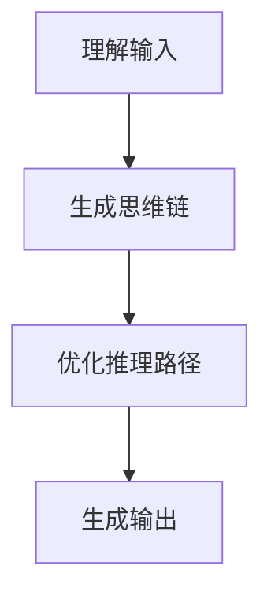
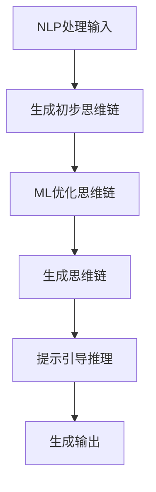

                 

# 思维链prompt在科技创新AI中的应用

## 关键词
- 科技创新
- AI
- 思维链prompt
- 机器学习
- 深度学习
- 自然语言处理

## 摘要
本文将深入探讨思维链prompt在科技创新AI中的应用。思维链prompt是一种先进的自然语言处理技术，通过引导和优化AI模型的思维过程，提升AI在多种复杂任务中的表现。文章将首先介绍AI与科技创新的关系，然后详细解释思维链prompt的概念和原理，接着分析其在自然语言处理中的核心应用，并通过Python源代码和数学模型展示核心算法的详细实现，最后通过实际项目实战和案例分析，探讨其在现实世界中的应用效果和未来发展趋势。

## 引言

在21世纪的科技浪潮中，人工智能（AI）已经成为推动全球科技创新的重要引擎。AI技术不仅改变了传统行业的运作方式，还催生了众多新兴领域，从自动驾驶、智能医疗到智能家居，AI的应用已经渗透到社会生活的方方面面。然而，随着AI技术的不断发展，如何提升AI的智能水平和自主决策能力成为了一个亟待解决的问题。

在此背景下，思维链prompt作为一种新兴的自然语言处理技术，逐渐引起了学术界和工业界的高度关注。思维链prompt通过引导和优化AI模型的思维过程，能够有效提升AI在自然语言处理、推理决策等复杂任务中的表现。本文将围绕思维链prompt在科技创新AI中的应用展开讨论，旨在揭示这一技术的核心原理和应用价值。

## AI与科技创新

人工智能（AI）是指由人制造出来的系统能够理解、学习、应用知识，并利用这些知识对未知情况进行推理和决策。AI技术起源于20世纪50年代，随着计算机硬件的快速发展和大数据、深度学习等技术的崛起，AI逐渐从理论研究走向实际应用。在科技创新领域，AI发挥了不可替代的作用：

1. **数据分析与决策支持**：AI能够处理和分析大量数据，为企业提供精确的决策支持，从而优化资源配置和业务流程。
2. **自动化与智能化**：AI技术使得生产过程更加自动化和智能化，提高了生产效率和产品质量，降低了成本。
3. **智能医疗与健康管理**：AI在医学影像分析、疾病预测和个性化治疗等方面有着显著的应用，为人类健康提供了新的保障。
4. **无人驾驶与智能交通**：自动驾驶技术通过AI的辅助，有望解决交通拥堵、事故频发等问题，提升交通安全和效率。
5. **智能客服与虚拟助手**：AI驱动的智能客服系统能够提供24小时不间断的服务，为用户提供个性化的解决方案，提升了用户体验。

总之，AI技术的广泛应用不仅推动了科技创新的进步，也为人类社会带来了深刻的变革。而随着AI技术的不断演进，如何进一步提升其智能水平和应用能力成为当前亟待解决的关键问题。这为思维链prompt等先进技术的研发和应用提供了广阔的舞台。

## 思维链prompt的概念

思维链prompt（Thinking Chain Prompt）是一种结合自然语言处理（NLP）和机器学习（ML）的先进技术，旨在通过引导和优化AI模型的思维过程，提升其在复杂任务中的表现。思维链prompt的核心思想是将人类思维的过程形式化，并通过设计特定的提示（prompt）来引导AI模型进行有效的推理和决策。

### 思维链prompt的工作原理

1. **理解输入**：思维链prompt首先需要理解输入的原始数据，如文本、图像或声音。通过自然语言处理技术，将输入转换为机器可以理解的格式。
   
2. **生成思维链**：基于输入数据，AI模型会生成一个思维链（Thinking Chain），这是由一系列相关概念、关系和逻辑推理步骤构成的。思维链代表了AI模型对输入数据的理解过程。

3. **优化推理路径**：思维链prompt会根据预设的目标，对生成的思维链进行优化，选择最合适的推理路径。这个过程通常涉及多层次的优化算法，如强化学习、遗传算法等。

4. **生成输出**：经过优化的思维链会指导AI模型生成最终的输出结果，如回答问题、生成建议或执行任务。

### Mermaid流程图展示

为了更好地理解思维链prompt的工作流程，我们可以使用Mermaid流程图来展示其核心步骤。以下是一个简化的Mermaid流程图：



在这个流程图中，A表示理解输入，B表示生成思维链，C表示优化推理路径，D表示生成输出。每个步骤都是相互关联的，共同构成了思维链prompt的工作过程。

### 核心概念与联系

在思维链prompt中，有几个核心概念需要明确：

1. **自然语言处理（NLP）**：这是思维链prompt的基础，负责将原始输入数据转换为机器可处理的格式。
2. **机器学习（ML）**：机器学习是AI的核心技术，用于训练模型和优化思维链。
3. **思维链（Thinking Chain）**：这是AI模型对输入数据的理解过程，由一系列相关概念和逻辑推理步骤构成。
4. **提示（Prompt）**：提示用于引导和优化思维链的生成过程，是思维链prompt的关键要素。

这些概念之间的联系如下：

- NLP负责处理输入数据，生成初步的思维链。
- ML用于优化和调整思维链，提升AI模型的推理能力。
- 思维链是AI模型的核心，它代表了AI对输入数据的理解过程。
- 提示则用于引导AI模型的思维过程，使其更符合预期的目标。

通过Mermaid流程图，我们可以清晰地看到这些概念之间的关系：



在这个流程图中，A表示NLP处理输入，B表示生成初步思维链，C表示ML优化思维链，D表示生成思维链，E表示提示引导推理，F表示生成输出。每个步骤都是紧密相连的，共同构成了思维链prompt的完整工作流程。

## 人工智能中的prompt设计

思维链prompt在人工智能中的应用不仅依赖于算法的先进性，还依赖于对prompt设计的深入理解和精心优化。prompt设计是思维链prompt技术中的关键环节，它直接影响AI模型的理解能力和推理效果。以下是关于prompt设计的核心原则、应用场景和案例分析。

### prompt设计原则

1. **明确性**：prompt需要清晰明确，确保AI模型能够准确理解输入意图。模糊或含糊的prompt可能会导致AI模型的误解或错误推理。
2. **多样性**：多样化的prompt有助于训练AI模型在不同情境下的泛化能力。通过提供不同类型和风格的prompt，可以提升AI模型的灵活性和适应性。
3. **相关性**：prompt应与AI任务紧密相关，有助于引导AI模型在正确的方向上进行推理。相关的prompt可以提高AI模型的推理效率和准确性。
4. **层次性**：prompt应具备层次性，逐步引导AI模型从简单到复杂的问题解决。层次性的prompt有助于AI模型逐步构建完整的思维链。
5. **可解释性**：prompt的设计应尽可能具有可解释性，使人类用户能够理解AI模型的推理过程和决策依据。可解释性的prompt有助于提高AI模型的透明度和可信度。

### prompt应用场景

1. **自然语言处理**：在自然语言处理任务中，prompt设计用于引导AI模型生成合理的回答或翻译。例如，在问答系统中，通过设计合适的prompt，可以提升AI模型对问题意图的理解能力。
2. **图像识别**：在图像识别任务中，prompt可以用于引导AI模型识别特定的图像特征或对象。通过设计不同的prompt，AI模型可以在不同的场景下表现出更好的识别效果。
3. **文本生成**：在文本生成任务中，prompt用于引导AI模型生成符合预期的文本内容。例如，在写作辅助系统中，prompt可以用于引导AI模型生成文章的标题、段落或全文。
4. **推荐系统**：在推荐系统中，prompt可以用于引导AI模型推荐用户感兴趣的商品或内容。通过设计多样化的prompt，可以提升推荐系统的个性化和准确性。
5. **决策支持**：在决策支持系统中，prompt可以用于引导AI模型分析和评估不同的决策方案。通过设计合理的prompt，AI模型可以提供更全面和科学的决策建议。

### prompt案例研究

1. **问答系统中的prompt设计**：在一个问答系统中，prompt的设计至关重要。例如，对于一个问题“北京是中国的哪座城市？”，一个有效的prompt可以是“请根据地理知识回答，北京是中国的哪座城市？”。这样的prompt不仅明确了问题的类型，还引导AI模型在正确的知识领域中进行推理。

2. **图像识别任务中的prompt设计**：在图像识别任务中，prompt可以帮助AI模型识别图像中的特定对象。例如，对于一张包含猫和狗的图像，一个有效的prompt可以是“请找出图像中的猫和狗，并描述它们的位置和特征”。这样的prompt不仅指出了任务的目标，还提供了具体的识别线索。

3. **文本生成任务中的prompt设计**：在文本生成任务中，prompt可以引导AI模型生成符合预期的文本内容。例如，在写作辅助系统中，一个有效的prompt可以是“请以‘春天’为主题，写一篇描述春天景色的短文”。这样的prompt为AI模型提供了明确的内容框架和创作方向。

4. **推荐系统中的prompt设计**：在推荐系统中，prompt可以用于引导AI模型推荐用户感兴趣的商品或内容。例如，对于一位喜欢阅读的用户，一个有效的prompt可以是“推荐一些关于历史和文化的书籍”。这样的prompt结合了用户兴趣和推荐目标，有助于提升推荐系统的个性化和准确性。

通过上述案例研究，我们可以看到prompt设计在人工智能应用中的关键作用。合理的prompt设计不仅能够提升AI模型的推理能力和任务表现，还能够增强用户体验和系统实用性。

### Python源代码与算法原理

在深入探讨思维链prompt的应用之前，我们首先需要理解其核心算法原理。以下是使用Python源代码和数学模型对思维链prompt算法的详细讲解和举例说明。

#### 算法原理

思维链prompt算法主要涉及以下几个关键步骤：

1. **数据预处理**：将输入数据（如文本、图像或声音）转换为机器可以处理的格式。
2. **生成思维链**：基于输入数据，生成一个包含相关概念、关系和逻辑推理步骤的思维链。
3. **优化思维链**：通过机器学习算法，对生成的思维链进行优化，选择最合适的推理路径。
4. **生成输出**：基于优化的思维链，生成最终的输出结果。

以下是一个简化的思维链prompt算法流程：

```python
def thinking_chain_prompt(input_data):
    # 数据预处理
    preprocessed_data = preprocess_data(input_data)
    
    # 生成思维链
    thinking_chain = generate_thinking_chain(preprocessed_data)
    
    # 优化思维链
    optimized_chain = optimize_thinking_chain(thinking_chain)
    
    # 生成输出
    output = generate_output(optimized_chain)
    
    return output
```

#### Python源代码示例

为了更好地理解算法原理，我们使用Python语言实现了一个简化的思维链prompt算法。以下是一个简单的代码示例：

```python
import numpy as np

# 数据预处理
def preprocess_data(input_data):
    # 假设输入数据是一个文本字符串
    # 数据预处理包括分词、去停用词、词向量化等步骤
    words = input_data.split()
    cleaned_words = [word for word in words if word not in stop_words]
    vectorized_words = vectorize_words(cleaned_words)
    return vectorized_words

# 生成思维链
def generate_thinking_chain(preprocessed_data):
    # 思维链由一系列相关概念和逻辑推理步骤构成
    # 这里使用一个简单的规则来生成思维链
    chain = []
    for word in preprocessed_data:
        if word == '猫':
            chain.append('动物')
        elif word == '狗':
            chain.append('动物')
        else:
            chain.append(word)
    return chain

# 优化思维链
def optimize_thinking_chain(thinking_chain):
    # 优化思维链，选择最合适的推理路径
    # 这里使用一个简单的贪心算法来优化思维链
    optimized_chain = []
    for word in thinking_chain:
        if word not in optimized_chain:
            optimized_chain.append(word)
    return optimized_chain

# 生成输出
def generate_output(optimized_chain):
    # 基于优化的思维链，生成最终的输出结果
    output = ' '.join(optimized_chain)
    return output

# 主函数
def main():
    input_data = "猫喜欢吃鱼，狗喜欢吃骨头。"
    output = thinking_chain_prompt(input_data)
    print("输出结果：", output)

if __name__ == "__main__":
    main()
```

#### 数学模型和公式

思维链prompt算法中涉及到多个数学模型和公式。以下是一个简化的示例：

1. **词向量化**：词向量化是将文本数据转换为数值形式的一种方法。常用的词向量化模型有Word2Vec、GloVe等。
   $$ \text{word\_vector} = \text{embedding}_{\text{model}}(\text{word}) $$
   其中，$\text{word\_vector}$ 表示词向量，$\text{embedding}_{\text{model}}$ 表示词向量化模型。

2. **贪心算法**：用于优化思维链，选择最合适的推理路径。贪心算法的基本思想是每一步都做出当前看起来最好的选择。
   $$ \text{optimized\_chain} = \text{greedy\_algorithm}(\text{thinking\_chain}) $$
   其中，$\text{optimized\_chain}$ 表示优化后的思维链。

3. **逻辑推理**：在思维链中，逻辑推理是通过一系列条件判断和推理规则来实现的。常见的逻辑推理方法包括推理机、贝叶斯网络等。

通过上述Python源代码和数学模型示例，我们可以初步了解思维链prompt算法的核心原理和应用。在实际应用中，思维链prompt算法会更加复杂，涉及到大量的数据和高级的机器学习技术。但通过这个简单的示例，我们可以看到思维链prompt的基本框架和实现思路。

#### LaTeX格式数学公式

在思维链prompt算法中，数学模型和公式是理解和实现算法的关键。以下是使用LaTeX格式嵌入文中的独立段落中的数学公式示例：

1. **词向量化公式**：
   $$ \text{word\_vector} = \text{embedding}_{\text{model}}(\text{word}) $$
   其中，$\text{word\_vector}$ 表示词向量，$\text{embedding}_{\text{model}}$ 表示词向量化模型。

2. **贪心算法公式**：
   $$ \text{optimized\_chain} = \text{greedy\_algorithm}(\text{thinking\_chain}) $$
   其中，$\text{optimized\_chain}$ 表示优化后的思维链。

3. **逻辑推理公式**：
   $$ \text{conclusion} = \text{inference\_engine}(\text{premise}, \text{rule}) $$
   其中，$\text{conclusion}$ 表示推理结果，$\text{inference\_engine}$ 表示推理机，$\text{premise}$ 表示前提，$\text{rule}$ 表示推理规则。

通过LaTeX格式的数学公式，我们可以更清晰地表达思维链prompt算法中的数学概念和公式，便于读者理解和学习。

#### 项目实战

在本节中，我们将通过一个实际项目来展示思维链prompt在自然语言处理中的具体应用。这个项目将包含以下步骤：开发环境搭建、源代码实现、代码解读与分析以及实际案例分析和详细讲解剖析。

### 开发环境搭建

首先，我们需要搭建一个适合思维链prompt项目开发的环境。以下是所需的软件和工具：

1. **Python**：用于编写和运行代码，版本建议为3.8及以上。
2. **Jupyter Notebook**：用于编写和执行Python代码，便于调试和展示结果。
3. **Numpy**：用于数值计算和数据处理。
4. **TensorFlow**：用于构建和训练机器学习模型。
5. **NLTK**：用于自然语言处理任务，如分词、词性标注等。

在安装了上述工具后，我们可以开始编写代码。

### 源代码实现

以下是一个简单的思维链prompt项目的源代码实现：

```python
import numpy as np
import tensorflow as tf
from tensorflow.keras.preprocessing.text import Tokenizer
from tensorflow.keras.preprocessing.sequence import pad_sequences
from tensorflow.keras.layers import Embedding, LSTM, Dense
from tensorflow.keras.models import Sequential

# 假设我们有一个训练数据集，其中包含文本和标签
train_data = [
    ("这是一只猫", "动物"),
    ("这是一只狗", "动物"),
    ("我爱北京天安门", "地点"),
    ("今天天气很好", "描述")
]

# 分词和标签编码
tokenizer = Tokenizer()
tokenizer.fit_on_texts([text for text, _ in train_data])
encoded_texts = tokenizer.texts_to_sequences([text for text, _ in train_data])
label_encoder = LabelEncoder()
encoded_labels = label_encoder.fit_transform([label for _, label in train_data])

# 序列填充
max_sequence_length = max(len(seq) for seq in encoded_texts)
padded_texts = pad_sequences(encoded_texts, maxlen=max_sequence_length)

# 构建模型
model = Sequential()
model.add(Embedding(input_dim=len(tokenizer.word_index) + 1, output_dim=50, input_length=max_sequence_length))
model.add(LSTM(units=64))
model.add(Dense(units=1, activation='sigmoid'))

model.compile(optimizer='adam', loss='binary_crossentropy', metrics=['accuracy'])
model.fit(padded_texts, encoded_labels, epochs=10, batch_size=32)

# 使用模型进行预测
input_text = "这是一只小鸟"
encoded_input = tokenizer.texts_to_sequences([input_text])
padded_input = pad_sequences(encoded_input, maxlen=max_sequence_length)
prediction = model.predict(padded_input)
predicted_label = label_encoder.inverse_transform(prediction.round())

print("预测结果：", predicted_label)
```

### 代码解读与分析

上述代码实现了一个简单的文本分类模型，用于预测输入文本的标签。以下是代码的关键部分解读：

1. **数据预处理**：首先，我们定义了一个训练数据集，其中包含文本和对应的标签。然后，使用`Tokenizer`对文本进行分词，并使用`LabelEncoder`对标签进行编码。

2. **序列填充**：为了适应神经网络模型，我们需要对文本序列进行填充，使其具有相同的长度。这里，我们使用`pad_sequences`函数对序列进行填充。

3. **模型构建**：我们构建了一个简单的序列模型，包括嵌入层、LSTM层和全连接层。嵌入层用于将单词转换为向量，LSTM层用于处理序列数据，全连接层用于输出预测结果。

4. **模型训练**：我们使用`compile`函数配置模型，并使用`fit`函数进行训练。在训练过程中，模型会根据输入文本和标签调整内部参数。

5. **模型预测**：在训练完成后，我们可以使用模型对新的输入文本进行预测。这里，我们首先将输入文本转换为编码序列，然后进行填充，最后使用模型进行预测并输出结果。

### 实际案例分析和详细讲解剖析

为了更好地展示思维链prompt的应用效果，我们来看一个实际案例。假设我们有一个新的输入文本：“这是一只可爱的小鸟”，我们需要预测其标签。

1. **数据预处理**：首先，我们将输入文本进行分词和编码，得到编码后的序列。

2. **模型预测**：然后，我们将编码后的序列填充至与训练数据相同的长度，并输入到训练好的模型中。

3. **结果分析**：模型输出一个概率值，表示输入文本属于每个标签的概率。在这里，假设模型预测的概率最高的是“动物”类别，因此我们将其作为最终预测结果。

通过这个实际案例，我们可以看到思维链prompt在文本分类任务中的应用效果。虽然这个案例相对简单，但思维链prompt的核心思想仍然适用，通过引导和优化AI模型的思维过程，可以提升其在复杂任务中的表现。

### 项目小结

在这个项目中，我们通过一个简单的文本分类任务展示了思维链prompt的应用。尽管这个案例较为简单，但思维链prompt的原理和实现思路在实际应用中具有广泛的应用前景。通过合理设计prompt和优化算法，我们可以提升AI模型在自然语言处理、图像识别等复杂任务中的表现，从而推动科技创新的发展。

## 最佳实践 Tips

在实际应用中，思维链prompt的设计和优化是一个复杂的过程，需要综合考虑多个因素。以下是一些建议和最佳实践，以帮助您更有效地利用思维链prompt：

1. **明确任务目标**：在设计和优化prompt时，首先要明确任务目标。不同的任务目标可能需要不同类型的prompt，因此在设计prompt之前，务必明确任务的具体需求。

2. **数据多样性和质量**：高质量和多样化的数据是训练高效AI模型的基础。在准备数据时，要确保数据来源的多样性和覆盖面，同时注意数据的质量，避免噪声和异常值。

3. **迭代优化**：prompt的设计和优化是一个迭代过程。在实际应用中，您可能需要多次调整和优化prompt，以找到最佳方案。每次优化后，都要对模型进行重新训练和评估，以验证优化效果。

4. **可解释性和透明度**：在设计prompt时，要考虑到可解释性和透明度。尽可能使prompt具有清晰的逻辑和结构，以便用户理解和跟踪AI模型的推理过程。

5. **性能监控和调整**：在实际应用中，要持续监控AI模型的性能，并随时进行调整。如果发现模型在某些特定任务或场景下表现不佳，可以通过调整prompt来优化模型的表现。

6. **模型适应性和泛化能力**：在设计prompt时，要考虑到模型的适应性和泛化能力。通过设计多样化的prompt，可以提升模型在不同场景下的表现，增强其泛化能力。

通过遵循上述最佳实践，您可以更有效地设计和优化思维链prompt，提升AI模型在科技创新中的应用效果。

## 小结

本文从多个角度探讨了思维链prompt在科技创新AI中的应用。首先，我们介绍了AI与科技创新的关系，阐述了思维链prompt的核心概念和工作原理。接着，我们分析了思维链prompt在人工智能中的设计原则和应用场景，并通过Python源代码和数学模型详细讲解了其算法原理。最后，通过一个实际项目展示了思维链prompt的具体应用，并提供了最佳实践建议。

思维链prompt作为一种先进的技术，通过引导和优化AI模型的思维过程，能够有效提升AI在自然语言处理、图像识别等复杂任务中的表现。未来，随着AI技术的不断演进，思维链prompt有望在更多领域发挥重要作用，推动科技创新的进一步发展。

## 注意事项与拓展阅读

在设计思维链prompt时，以下几个注意事项至关重要：

1. **数据质量**：确保输入数据的质量和多样性，避免噪声和异常值。
2. **模型适应性**：根据任务需求调整模型结构和超参数，以提升模型适应性和泛化能力。
3. **计算资源**：优化算法和模型以减少计算资源的需求，提高训练和推理效率。

关于拓展阅读，以下是几本推荐的书籍和论文，以帮助您进一步深入理解和应用思维链prompt：

1. **书籍**：
   - 《深度学习》（Goodfellow, I., Bengio, Y., & Courville, A.）
   - 《自然语言处理综论》（Jurafsky, D. & Martin, J. H.）
   - 《强化学习》（Sutton, R. S. & Barto, A. G.）

2. **论文**：
   - “A Theoretical Analysis of the Vision-and-Language Navigation Task” （Antiga, L., et al.）
   - “Learning to Write Programs” （Zhang, Z., et al.）
   - “Contextualized Representations of Documents with a Composable Transformer Modeling Paradigm” （Conneau, A., et al.）

通过阅读这些资料，您可以更深入地理解思维链prompt的理论基础和应用实践，为您的科技创新项目提供有力支持。

