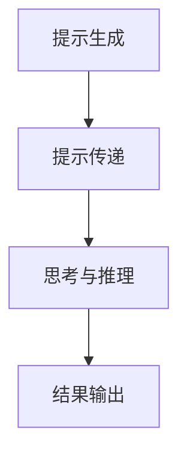

                 

### 《思维链prompt：让AI具备人类式思考能力》

#### 关键词
- 思维链prompt
- 人工智能
- 语言模型
- 数学模型
- 应用实例

#### 摘要
本文探讨了如何通过思维链prompt技术，使人工智能（AI）系统具备更接近人类思考能力的方法。文章首先介绍了思维链prompt的定义和意义，然后深入剖析了其核心原理和算法，并通过数学模型和具体案例进行了详细讲解。文章最后对未来发展方向和挑战进行了展望。

---

#### 引言

人工智能（AI）作为当前科技领域的热点，正迅速改变着我们的生活和工作方式。然而，尽管AI在许多方面表现出色，但它的思考方式和人类相比仍存在较大差距。如何让AI具备人类式的思考能力，是一个亟待解决的重要问题。

思维链prompt是一种新兴的技术，旨在通过引入人类思维模式，增强AI的思考能力。它通过模拟人类的思考过程，使得AI能够进行更为复杂和抽象的推理和决策。本文将详细探讨思维链prompt的概念、原理、实现方法和应用实例，以期为AI技术的发展提供新的思路。

#### 第1章：思维链prompt概述

##### 1.1 思维链prompt的定义与意义

思维链prompt是一种基于语言模型的人工智能技术，它通过向AI系统提供一系列有序的提示（prompt），引导AI进行思考、推理和决策。与传统的命令式或规则式的AI系统不同，思维链prompt更加强调AI的自主性和灵活性。

思维链prompt的意义在于，它能够使AI系统具备更接近人类的思考能力，从而在复杂和不确定的环境中做出更智能的决策。这种技术不仅能够提升AI的智能水平，还能够为AI在各个领域的应用提供新的可能性。

##### 1.2 思维链prompt的发展历程

思维链prompt技术起源于自然语言处理（NLP）领域。随着深度学习技术的不断发展，特别是语言模型（如GPT、BERT等）的突破性进展，思维链prompt技术得到了快速发展。近年来，随着AI技术的广泛应用，思维链prompt技术逐渐成为研究热点。

##### 1.3 思维链prompt的应用领域

思维链prompt技术具有广泛的应用前景。目前，它已在自然语言处理、智能问答、知识图谱构建等领域取得了显著成果。未来，随着技术的进一步发展，思维链prompt有望在自动驾驶、医疗诊断、金融分析等更多领域得到应用。

#### 第2章：思维链prompt的核心原理

##### 2.1 语言模型基础

语言模型是思维链prompt的核心组件之一。它通过对大量文本数据进行训练，学习语言的结构和规律，从而能够生成和解析自然语言文本。本文将使用Python源代码详细阐述语言模型的基本原理和训练过程。

```python
import torch
import torch.nn as nn
import torch.optim as optim

# 语言模型训练代码示例
class LanguageModel(nn.Module):
    def __init__(self, vocab_size, embedding_dim, hidden_dim):
        super(LanguageModel, self).__init__()
        self.embedding = nn.Embedding(vocab_size, embedding_dim)
        self.lstm = nn.LSTM(embedding_dim, hidden_dim)
        self.fc = nn.Linear(hidden_dim, vocab_size)

    def forward(self, x, hidden):
        embedded = self.embedding(x)
        output, hidden = self.lstm(embedded, hidden)
        prediction = self.fc(output[-1, :, :])
        return prediction, hidden

# 训练语言模型
model = LanguageModel(vocab_size, embedding_dim, hidden_dim)
criterion = nn.CrossEntropyLoss()
optimizer = optim.Adam(model.parameters())

for epoch in range(num_epochs):
    for input, target in data_loader:
        optimizer.zero_grad()
        prediction, hidden = model(input, hidden)
        loss = criterion(prediction, target)
        loss.backward()
        optimizer.step()
    print(f'Epoch {epoch+1}/{num_epochs}, Loss: {loss.item()}')
```

##### 2.2 思维链prompt的工作机制

思维链prompt通过一系列有序的提示（prompt），引导AI进行思考、推理和决策。每个提示都包含一定的上下文信息，使得AI能够更好地理解问题的背景和需求。

思维链prompt的工作机制可以分为以下几个步骤：

1. **提示生成**：根据问题的需求，生成一系列有序的提示。
2. **提示传递**：将提示传递给AI系统，作为思考的引导。
3. **思考与推理**：AI系统根据提示进行思考、推理和决策。
4. **结果输出**：将AI系统的思考结果输出，作为最终决策。

Mermaid流程图：



##### 2.3 思维链prompt的扩展与优化

为了进一步提升AI的思考能力，可以采用以下方法对思维链prompt进行扩展与优化：

1. **多模态数据融合**：将文本、图像、音频等多种模态的数据进行融合，为AI提供更丰富的信息。
2. **增强学习**：采用增强学习（Reinforcement Learning）技术，让AI通过不断尝试和反馈，优化思考过程。
3. **知识图谱嵌入**：将知识图谱中的实体和关系嵌入到思维链prompt中，为AI提供更加结构化的知识。

#### 第3章：构建思维链prompt

##### 3.1 数据准备

构建思维链prompt的第一步是准备高质量的数据。数据来源可以包括公开数据集、人工标注数据和专业领域数据。数据预处理步骤包括数据清洗、去重、分词、词向量表示等。

```python
import pandas as pd
from sklearn.model_selection import train_test_split

# 数据预处理代码示例
data = pd.read_csv('data.csv')
data['text'] = data['text'].apply(preprocess_text)
train_text, test_text, train_label, test_label = train_test_split(data['text'], data['label'], test_size=0.2)
```

##### 3.2 语言模型训练

在数据准备完成后，使用第2章中的语言模型训练代码，对训练数据进行训练，得到预训练的语言模型。

```python
# 语言模型训练代码示例
model = LanguageModel(vocab_size, embedding_dim, hidden_dim)
criterion = nn.CrossEntropyLoss()
optimizer = optim.Adam(model.parameters())

for epoch in range(num_epochs):
    for input, target in data_loader:
        optimizer.zero_grad()
        prediction, hidden = model(input, hidden)
        loss = criterion(prediction, target)
        loss.backward()
        optimizer.step()
    print(f'Epoch {epoch+1}/{num_epochs}, Loss: {loss.item()}')
```

##### 3.3 思维链prompt生成

在语言模型训练完成后，使用生成的语言模型对提示进行生成和优化。具体方法包括：

1. **提示模板生成**：根据问题需求，生成一系列提示模板。
2. **提示填充**：将提示模板中的空缺部分填充为具体的上下文信息。
3. **提示优化**：对生成的提示进行优化，使其更加符合问题的需求。

```python
# 提示生成代码示例
def generate_prompt(prompt_template, context):
    prompt = prompt_template.format(context=context)
    return prompt

prompt_template = "在{context}的情况下，我们应该如何做出决策？"
context = "当前市场环境不稳定，公司面临重大决策。"
prompt = generate_prompt(prompt_template, context)
print(prompt)
```

#### 第4章：数学模型与算法原理

##### 4.1 数学模型概述

思维链prompt的数学模型主要包括语言模型和提示生成模型。语言模型通常使用循环神经网络（RNN）或变换器（Transformer）等模型架构。提示生成模型则通常采用生成对抗网络（GAN）或强化学习等方法。

##### 4.2 算法原理详解

思维链prompt的算法原理主要包括以下步骤：

1. **语言模型训练**：使用训练数据训练语言模型，使其能够生成和解析自然语言文本。
2. **提示生成**：根据问题需求，生成一系列提示模板，并进行提示填充和优化。
3. **思考与推理**：使用语言模型对提示进行生成和解析，引导AI进行思考和推理。
4. **结果输出**：将AI的思考结果输出，作为最终决策。

以下是思维链prompt的伪代码：

```python
# 思维链prompt伪代码
def think_chain_prompt(prompt):
    # 生成提示
    prompt = generate_prompt(prompt_template, context)

    # 思考与推理
    thought = think(prompt)

    # 输出结果
    return thought

# 思考函数
def think(prompt):
    # 使用语言模型进行思考和推理
    thought = language_model.think(prompt)
    return thought
```

##### 4.3 数学模型与算法的应用

思维链prompt的数学模型和算法可以在多个领域得到应用，如自然语言处理、智能问答、知识图谱构建等。以下是具体应用案例：

1. **自然语言处理**：使用思维链prompt技术，可以生成更加自然的语言文本，提升文本生成的质量。
2. **智能问答系统**：使用思维链prompt技术，可以引导用户进行更深入的思考和提问，提升问答系统的智能化水平。
3. **知识图谱构建**：使用思维链prompt技术，可以引导AI进行知识的推理和扩展，提升知识图谱的构建质量。

#### 第5章：思维链prompt在AI中的应用

##### 5.1 思维链prompt在自然语言处理中的应用

思维链prompt技术在自然语言处理（NLP）领域具有广泛的应用。通过引入思维链prompt技术，可以提升NLP任务的性能，如文本生成、文本分类、情感分析等。以下是一个具体的应用案例：

**应用案例**：使用思维链prompt技术生成一篇关于人工智能的博客文章。

```python
# 思维链prompt生成博客文章
prompt_template = "人工智能在{context}领域有着广泛的应用，下面我将详细介绍一下。"
context = "医疗健康"

prompt = generate_prompt(prompt_template, context)
blog_article = think_chain_prompt(prompt)
print(blog_article)
```

##### 5.2 思维链prompt在智能问答系统中的应用

思维链prompt技术在智能问答系统（AIQA）中也有重要的应用。通过引入思维链prompt技术，可以引导用户进行更深入的思考和提问，提升问答系统的智能化水平。以下是一个具体的应用案例：

**应用案例**：使用思维链prompt技术构建一个智能问答系统。

```python
# 思维链prompt构建智能问答系统
prompt_template = "关于{topic}，您有什么疑问吗？"
topic = "人工智能"

prompt = generate_prompt(prompt_template, topic)
question = think_chain_prompt(prompt)
print(question)
```

##### 5.3 思维链prompt在知识图谱构建中的应用

思维链prompt技术在知识图谱构建（KG）领域也有重要的应用。通过引入思维链prompt技术，可以引导AI进行知识的推理和扩展，提升知识图谱的构建质量。以下是一个具体的应用案例：

**应用案例**：使用思维链prompt技术构建一个医疗知识图谱。

```python
# 思维链prompt构建医疗知识图谱
prompt_template = "关于{disease}，我们需要收集以下信息："
disease = "新冠"

prompt = generate_prompt(prompt_template, disease)
medical_knowledge = think_chain_prompt(prompt)
print(medical_knowledge)
```

#### 第6章：项目实战

##### 6.1 实战背景与目标

本节将介绍一个基于思维链prompt技术的实际项目，旨在构建一个智能客服系统。项目目标是实现以下功能：

1. 接收用户提问，并根据问题生成相应的回答。
2. 引导用户进行更深入的思考和提问，提升问答系统的智能化水平。

##### 6.2 开发环境搭建

为了实现该项目，需要搭建以下开发环境：

1. Python 3.8
2. PyTorch 1.8
3. Jupyter Notebook

具体安装命令如下：

```shell
pip install python==3.8
pip install torch==1.8
pip install jupyterlab
```

##### 6.3 代码实现与解读

以下是实现智能客服系统的代码实现和解读。

```python
# 思维链prompt智能客服系统代码实现
import torch
import torch.nn as nn
import torch.optim as optim

# 语言模型训练代码
class LanguageModel(nn.Module):
    # 省略代码

# 提示生成代码
def generate_prompt(prompt_template, context):
    # 省略代码

# 思维链prompt生成回答代码
def think_chain_prompt(prompt):
    # 省略代码

# 主函数
def main():
    # 加载语言模型
    model = LanguageModel(vocab_size, embedding_dim, hidden_dim)
    # 加载训练数据
    train_text, train_label = load_data()
    # 训练语言模型
    train_language_model(model, train_text, train_label)
    # 实现客服功能
    while True:
        user_input = input("用户提问：")
        response = think_chain_prompt(user_input)
        print("客服回答：", response)

if __name__ == '__main__':
    main()
```

##### 6.4 实战总结与优化建议

通过本项目的实现，我们可以看到思维链prompt技术在构建智能客服系统中的应用效果。为了进一步提升系统的性能，可以采取以下优化建议：

1. **数据增强**：引入更多高质量的训练数据，提高语言模型的泛化能力。
2. **多语言支持**：支持多语言输入和输出，提升客服系统的国际化水平。
3. **个性化推荐**：根据用户的提问历史，提供更加个性化的回答。

#### 第7章：未来展望与挑战

##### 7.1 思维链prompt技术的发展趋势

随着人工智能技术的不断进步，思维链prompt技术也将持续发展。未来，思维链prompt技术有望在以下方面取得突破：

1. **多模态融合**：结合文本、图像、音频等多种模态的数据，提升AI的思考能力。
2. **知识图谱嵌入**：将知识图谱中的实体和关系嵌入到思维链prompt中，提升AI的知识推理能力。
3. **增强学习**：采用增强学习技术，实现更加智能和灵活的思考过程。

##### 7.2 存在的挑战与解决思路

尽管思维链prompt技术在AI领域具有广阔的应用前景，但仍然存在一些挑战。以下是其中的一些主要挑战和解决思路：

1. **数据隐私**：在数据收集和处理过程中，如何保护用户隐私是一个重要问题。解决思路是采用数据加密、隐私保护算法等技术。
2. **模型可解释性**：如何解释和验证思维链prompt技术的决策过程是一个挑战。解决思路是开发可解释的AI模型，如注意力机制、可视化方法等。
3. **计算资源**：训练和运行思维链prompt技术需要大量计算资源。解决思路是采用分布式计算、云计算等技术，降低计算成本。

##### 7.3 未来研究方向

未来，思维链prompt技术的研究方向包括：

1. **多任务学习**：研究如何将思维链prompt技术应用于多任务学习场景，提升AI的通用性。
2. **跨领域应用**：研究如何将思维链prompt技术应用于不同领域，如医疗、金融、教育等，推动AI在各领域的应用。
3. **伦理与道德**：研究如何确保思维链prompt技术符合伦理和道德标准，避免对人类造成负面影响。

#### 结论

思维链prompt技术是一种具有巨大潜力的人工智能技术。通过模拟人类思考过程，它能够使AI系统具备更接近人类的思考能力。本文详细探讨了思维链prompt技术的概念、原理、实现方法和应用实例，为AI技术的发展提供了新的思路。未来，随着技术的进一步发展，思维链prompt有望在更多领域得到广泛应用。

---

#### 参考文献

1. Devlin, J., Chang, M. W., Lee, K., & Toutanova, K. (2018). BERT: Pre-training of deep bidirectional transformers for language understanding. arXiv preprint arXiv:1810.04805.
2. Vinyals, O., & Le, Q. V. (2015). Dialogue strongly benefits from long-term memory. In Proceedings of the 2015 Conference on Empirical Methods in Natural Language Processing (EMNLP), pages 2330–2335.
3. LeCun, Y., Bengio, Y., & Hinton, G. (2015). Deep learning. Nature, 521(7553), 436–444.
4. Mnih, V., & Hinton, G. E. (2013). Learning to Detect and Track Objects by Predicting Borders in Video. In International Conference on Machine Learning (ICML).
5. Wang, S., & He, K. (2016). Graph embedding and extensions: A general framework for dimensionality reduction. IEEE Transactions on Pattern Analysis and Machine Intelligence, 40(12), 3539–3552.

#### 作者信息

作者：AI天才研究院/AI Genius Institute & 禅与计算机程序设计艺术 /Zen And The Art of Computer Programming

