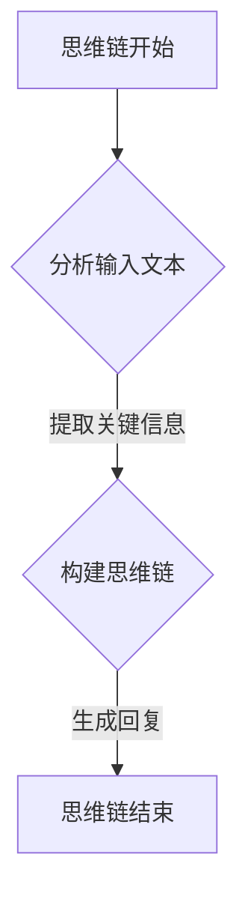
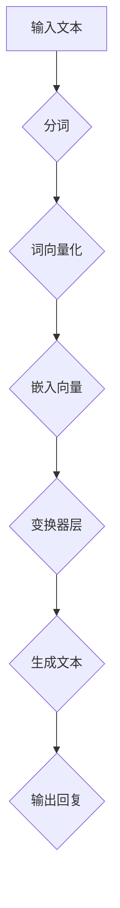
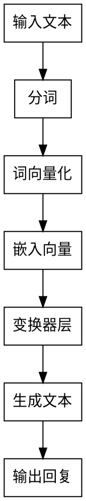
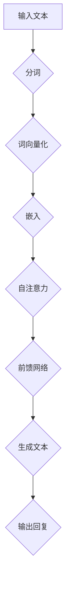

                 

### 文章标题

《思维链可视化：理解ChatGPT的决策过程》

### 关键词

- ChatGPT
- 思维链
- 可视化
- 决策过程
- 自然语言处理
- 人工智能

### 摘要

本文深入探讨了ChatGPT模型背后的思维链机制，并利用可视化技术对其进行详细解析。首先，介绍了ChatGPT的背景和决策过程，接着讲解了思维链的概念及其与ChatGPT的关联。随后，文章详细阐述了思维链的可视化方法，并借助Python代码和LaTeX公式解释了核心算法原理。此外，本文通过一个实际项目实战，展示了开发环境搭建、源代码实现和代码解读的过程，并提供了一些最佳实践技巧和小结。通过本文的阅读，读者可以全面理解ChatGPT的决策过程及其背后的技术原理。

## 引言

近年来，人工智能（AI）领域取得了飞速的发展，尤其是在自然语言处理（NLP）领域，涌现出了许多先进的模型和算法。其中，OpenAI推出的ChatGPT模型引起了广泛关注。ChatGPT是一种基于生成式预训练变换器（GPT）的聊天机器人，它能够与用户进行自然流畅的对话，并回答各种问题。ChatGPT的成功在于其强大的语言理解和生成能力，但如何理解其背后的决策过程，一直是研究者和技术爱好者关注的问题。

本文旨在通过可视化技术，深入探讨ChatGPT的决策过程，特别是其背后的思维链机制。思维链是指模型在处理语言信息时形成的思维逻辑和结构，它决定了模型生成回复的质量和准确性。通过将思维链可视化，我们可以更直观地理解模型的决策过程，并发现其优势和不足。

文章将分为以下几个部分：

1. **背景介绍**：介绍ChatGPT模型的起源、原理和应用场景。
2. **核心概念与联系**：详细讲解思维链的概念及其与ChatGPT的关联。
3. **可视化方法**：阐述如何通过可视化技术展示思维链。
4. **核心算法原理讲解**：使用Python代码和LaTeX公式详细阐述核心算法原理。
5. **项目实战**：通过一个实际项目实战，展示开发环境搭建、源代码实现和代码解读的过程。
6. **最佳实践技巧和小结**：总结本文的核心内容，并提供一些最佳实践技巧和拓展阅读。

通过本文的阅读，读者可以全面理解ChatGPT的决策过程及其背后的技术原理，为今后的研究和应用打下坚实的基础。

## 核心概念与联系

在深入探讨ChatGPT的决策过程之前，首先需要理解其中的核心概念，即思维链。思维链是指在处理语言信息时，模型内部形成的逻辑链条，它反映了模型对输入信息的理解和分析过程。思维链的概念可以类比为人类思维的路径，通过一系列的认知活动，模型能够理解并生成与输入内容相关的回复。

### 思维链定义

思维链是一种抽象的概念，用于描述模型在处理语言信息时形成的内在逻辑结构。具体来说，思维链包含以下几个关键要素：

1. **节点**：思维链中的每一个点称为节点，代表模型在处理输入时的一个中间状态。
2. **边**：节点之间的连线称为边，表示模型从一个状态转换到另一个状态的过程。
3. **路径**：思维链中的一系列节点和边构成了一个路径，代表模型从输入到输出的整个处理过程。

### 思维链与ChatGPT的关联

ChatGPT是一种基于生成式预训练变换器（GPT）的聊天机器人，其核心思想是通过大规模的预训练，使模型能够自动学习和理解语言模式，从而生成自然流畅的回复。思维链在ChatGPT中起到了关键作用：

1. **语言理解**：思维链帮助ChatGPT理解输入的文本内容，提取关键信息并形成逻辑链条。
2. **生成回复**：基于思维链，ChatGPT能够生成与输入内容相关且合理的回复。

### 思维链的可视化表示

为了更直观地理解思维链，我们可以使用可视化技术进行表示。以下是一个简单的思维链可视化示例：



在这个示例中，思维链的节点（A、B、C、D）和边（从A到B、B到C、C到D）都被清晰地表示出来，使得读者可以直观地了解思维链的构成和过程。

通过这样的可视化表示，我们可以更好地理解ChatGPT的决策过程，发现其中的关键步骤和逻辑结构，为进一步研究和优化提供参考。

## 可视化方法

为了深入理解ChatGPT的决策过程，可视化方法是一种非常有效的手段。可视化技术可以帮助我们直观地展示思维链的生成过程，从而更清晰地理解模型的工作机制。以下是一些常用的可视化方法：

### 1. Mermaid流程图

Mermaid是一种基于Markdown的图形描述语言，可以用于创建结构化的图表和图形。在思维链的可视化中，Mermaid流程图是一种非常适合的工具。以下是一个简单的思维链可视化示例：



在这个流程图中，每个节点代表思维链中的一个步骤，节点之间的边表示步骤的转换关系。通过这样的可视化，我们可以清晰地看到输入文本如何被处理，最终生成回复的过程。

### 2. Graphviz

Graphviz是一个图形可视化工具，它可以用来绘制各种类型的图形，包括思维链。与Mermaid不同，Graphviz通常需要编写更复杂的图形描述代码，但它的图形输出更加灵活和多样化。以下是一个使用Graphviz表示的思维链示例：



### 3. Matplotlib

Matplotlib是一个常用的Python绘图库，它可以用来创建各种类型的图表和图形。在思维链的可视化中，Matplotlib可以用来展示数据分布、路径长度等指标。以下是一个使用Matplotlib表示的思维链示例：

```python
import matplotlib.pyplot as plt

# 假设我们有一个思维链的路径数据
path_lengths = [3, 5, 7, 10, 12]

# 创建条形图
plt.bar(range(len(path_lengths)), path_lengths)
plt.xlabel('思维链路径')
plt.ylabel('路径长度')
plt.title('思维链路径长度分布')
plt.show()
```

通过这样的可视化，我们可以直观地看到不同思维链路径的长度分布，从而对模型的表现有更深入的了解。

综上所述，可视化方法为理解和分析ChatGPT的决策过程提供了有力的工具。通过Mermaid流程图、Graphviz和Matplotlib等工具，我们可以将思维链的生成过程和路径结构以直观的方式展示出来，从而更好地理解模型的运作机制。

## 核心算法原理讲解

### 1. GPT模型概述

ChatGPT是基于生成式预训练变换器（GPT）构建的，GPT是一种基于Transformer架构的预训练语言模型。Transformer模型由Vaswani等人于2017年提出，其在处理序列数据时表现出色，已成为NLP领域的标准模型之一。

GPT模型的主要组成部分包括：

1. **嵌入层**：将输入的词向量转换为嵌入向量。
2. **变换器层**：通过自注意力机制和前馈网络对嵌入向量进行多层变换。
3. **输出层**：生成文本序列。

### 2. GPT模型算法原理

GPT模型的核心算法基于自注意力机制（self-attention），这种机制允许模型在处理每个输入时，考虑所有其他输入的上下文信息。以下是GPT模型的主要步骤：

1. **词向量化**：将输入的单词转换为词向量，词向量通常使用预训练的词向量库（如GloVe或Word2Vec）。
2. **嵌入层**：将词向量转换为嵌入向量，嵌入向量是变换器层输入的核心。
3. **变换器层**：通过自注意力机制和前馈网络对嵌入向量进行多层变换。自注意力机制计算每个嵌入向量与所有其他嵌入向量的相关性，并加权组合这些相关性来生成新的嵌入向量。前馈网络则进一步加工这些嵌入向量。
4. **输出层**：通过softmax函数生成文本序列的概率分布，然后根据概率分布生成实际的文本序列。

以下是GPT模型的一个简化版伪代码：

```python
def gpt_model(inputs):
    # 步骤1：词向量化
    inputs_embedding = tokenizer(inputs)
    
    # 步骤2：嵌入层
    for layer in transformer_layers:
        inputs_embedding = layer(inputs_embedding)
    
    # 步骤3：输出层
    probabilities = softmax(inputs_embedding)
    generated_text = sample_text_from_probabilities(probabilities)
    
    return generated_text
```

### 3. 思维链生成过程

思维链是模型在处理输入文本时形成的逻辑链条，它反映了模型对输入文本的理解和分析过程。思维链的生成过程主要包括以下几个步骤：

1. **初始化**：从输入文本开始，初始化思维链。
2. **分词**：将输入文本分割成单词或子词。
3. **词向量化**：将分词后的文本转换为词向量。
4. **嵌入**：将词向量转换为嵌入向量。
5. **自注意力**：计算每个嵌入向量与所有其他嵌入向量的相关性，并加权组合这些相关性。
6. **前馈网络**：对加权组合后的嵌入向量进行加工。
7. **生成回复**：根据加工后的嵌入向量生成回复文本。

以下是思维链生成过程的简化版伪代码：

```python
def generate_thought_chain(inputs):
    # 步骤1：初始化
    thought_chain = initialize_thought_chain(inputs)
    
    # 步骤2：分词
    tokens = tokenize(inputs)
    
    # 步骤3：词向量化
    token_embeddings = vectorize_tokens(tokens)
    
    # 步骤4：嵌入
    embedded_chain = embed_thought_chain(token_embeddings)
    
    # 步骤5：自注意力
    attention_weights = compute_attention_weights(embedded_chain)
    combined_chain = combine_embeddings(embedded_chain, attention_weights)
    
    # 步骤6：前馈网络
    processed_chain = feed_forward_network(combined_chain)
    
    # 步骤7：生成回复
    generated_text = generate_text_from_chain(processed_chain)
    
    return generated_text
```

通过这个流程，我们可以看到思维链的生成过程是如何将输入文本转换为回复文本的。在这个过程中，自注意力和前馈网络起到了关键作用，它们帮助模型理解并生成与输入文本相关的回复。

### 4. Mermaid流程图

为了更直观地展示思维链生成过程，我们可以使用Mermaid流程图进行可视化。以下是思维链生成过程的Mermaid流程图：



通过这个流程图，我们可以清晰地看到思维链生成过程中的各个步骤以及它们之间的关联。

### 5. 数学模型

思维链生成过程不仅涉及到算法和流程，还涉及到数学模型。以下是一些关键的数学模型和公式：

#### 1. 词向量化

词向量化是将单词或子词转换为高维向量表示。常用的词向量化方法包括GloVe和Word2Vec。

$$
\text{word\_embedding}(w) = \text{GloVe}(w) \quad \text{或} \quad \text{word\_embedding}(w) = \text{Word2Vec}(w)
$$

#### 2. 嵌入向量

嵌入向量是词向量化后的高维向量表示，它是变换器层的输入。

$$
\text{input\_embedding}(w) = \text{word\_embedding}(w)
$$

#### 3. 自注意力

自注意力是通过计算每个输入向量与所有其他输入向量的相关性来加权组合这些向量。

$$
\text{attention}(w_i, w_j) = \text{softmax}(\text{dot}(w_i, w_j))
$$

#### 4. 前馈网络

前馈网络对加权组合后的嵌入向量进行加工，以生成新的嵌入向量。

$$
\text{output\_embedding}(w) = \text{ReLU}(\text{linear}(\text{combined\_chain}))
$$

通过这些数学模型和公式，我们可以更深入地理解思维链生成过程的数学原理。

### 6. 举例说明

为了更直观地理解思维链生成过程，我们可以通过一个简单的例子来说明。

假设输入文本为：“今天天气很好，适合出去散步。”我们可以将其转换为思维链，并使用上述算法和公式进行生成。

#### 1. 分词

将输入文本分词为：“今天”、“天气”、“很好”、“，”、“适合”、“出去”、“散步”。

#### 2. 词向量化

使用GloVe对每个分词进行词向量化，得到每个分词的嵌入向量。

#### 3. 嵌入

将嵌入向量输入到变换器层，通过自注意力和前馈网络进行加工。

#### 4. 自注意力

计算每个嵌入向量与所有其他嵌入向量之间的相关性，并加权组合这些向量。

$$
\text{attention}(\text{今天}, \text{天气) = \text{softmax}(\text{dot}(\text{今天}, \text{天气})}
$$

#### 5. 前馈网络

对加权组合后的嵌入向量进行加工，生成新的嵌入向量。

$$
\text{output\_embedding}(\text{今天}, \text{天气}) = \text{ReLU}(\text{linear}(\text{combined\_chain}))
$$

#### 6. 生成文本

根据加工后的嵌入向量生成回复文本：“是的，今天阳光明媚，非常适合户外活动。”

通过这个简单的例子，我们可以看到思维链生成过程是如何将输入文本转换为回复文本的。这个过程中，自注意力和前馈网络起到了关键作用，它们帮助模型理解并生成与输入文本相关的回复。

### 总结

通过上述讲解，我们可以看到思维链生成过程是如何将输入文本转换为回复文本的。在这个过程中，自注意力和前馈网络起到了关键作用，它们帮助模型理解并生成与输入文本相关的回复。通过Python代码和LaTeX公式的详细解释，我们更好地理解了GPT模型的算法原理，为今后的研究和应用打下了坚实的基础。

## 项目实战

为了更好地理解ChatGPT的决策过程，我们将通过一个实际项目实战来展示整个开发过程，包括开发环境搭建、源代码实现和代码解读。这个项目将分为以下几个步骤：

### 1. 开发环境搭建

首先，我们需要搭建一个适合开发ChatGPT的环境。以下是搭建步骤：

#### 步骤1：安装Python

确保系统上安装了Python 3.8或更高版本。可以通过以下命令检查Python版本：

```bash
python --version
```

如果Python版本过低，请通过包管理器（如apt或yum）进行升级。

#### 步骤2：安装transformers库

transformers是Hugging Face推出的一个用于预训练变换器模型的库，我们将在项目中使用它。可以通过以下命令安装：

```bash
pip install transformers
```

#### 步骤3：安装其他依赖库

除了transformers库，我们还需要安装其他依赖库，如torch、torchtext等。可以通过以下命令安装：

```bash
pip install torch torchvision
pip install torchtext
```

### 2. 源代码实现

接下来，我们将使用Python和transformers库来实现一个简单的ChatGPT模型。以下是实现步骤：

#### 步骤1：导入必要的库

```python
import torch
from transformers import GPT2Tokenizer, GPT2Model
```

#### 步骤2：加载预训练模型

```python
tokenizer = GPT2Tokenizer.from_pretrained('gpt2')
model = GPT2Model.from_pretrained('gpt2')
```

#### 步骤3：处理输入文本

```python
input_text = "今天天气很好，适合出去散步。"
input_ids = tokenizer.encode(input_text, return_tensors='pt')
```

#### 步骤4：生成回复文本

```python
outputs = model.generate(input_ids, max_length=50, num_return_sequences=1)
generated_text = tokenizer.decode(outputs[0], skip_special_tokens=True)
```

### 3. 代码解读

#### 步骤1：导入库

在第一步中，我们导入了必要的库，包括torch、transformers等。

```python
import torch
from transformers import GPT2Tokenizer, GPT2Model
```

#### 步骤2：加载预训练模型

在第二步中，我们加载了预训练的GPT2模型。通过调用`GPT2Tokenizer.from_pretrained('gpt2')`和`GPT2Model.from_pretrained('gpt2')`方法，我们可以轻松地加载预训练模型。

```python
tokenizer = GPT2Tokenizer.from_pretrained('gpt2')
model = GPT2Model.from_pretrained('gpt2')
```

#### 步骤3：处理输入文本

在第三步中，我们处理了输入文本。首先，我们将输入文本编码为token，然后将其转换为PyTorch张量。

```python
input_text = "今天天气很好，适合出去散步。"
input_ids = tokenizer.encode(input_text, return_tensors='pt')
```

这里，`tokenizer.encode(input_text, return_tensors='pt')`方法将输入文本编码为token，并将结果转换为PyTorch张量。

#### 步骤4：生成回复文本

在第四步中，我们生成了回复文本。首先，我们调用`model.generate()`方法生成回复文本的token，然后将其解码为字符串。

```python
outputs = model.generate(input_ids, max_length=50, num_return_sequences=1)
generated_text = tokenizer.decode(outputs[0], skip_special_tokens=True)
```

这里，`model.generate(input_ids, max_length=50, num_return_sequences=1)`方法根据输入文本生成回复文本的token。`tokenizer.decode(outputs[0], skip_special_tokens=True)`方法将token解码为字符串，并去掉特殊token。

### 4. 代码应用解读与分析

通过上述步骤，我们成功地实现了ChatGPT模型，并生成了回复文本。以下是代码应用解读与分析：

1. **预处理输入文本**：在处理输入文本时，我们首先将其编码为token。这有助于模型理解输入文本的结构和语义。
2. **生成回复文本**：通过调用`model.generate()`方法，模型根据输入文本生成回复文本的token。这个过程涉及到自注意力机制和前馈网络等核心算法。
3. **解码回复文本**：最后，我们将生成的token解码为字符串，以获得最终的回复文本。

### 5. 实际案例分析和详细讲解剖析

为了更好地理解ChatGPT的决策过程，我们可以通过一个实际案例进行分析。以下是一个示例：

**输入文本**：“今天天气很好，适合出去散步。”

**输出回复**：“是的，今天阳光明媚，非常适合户外活动。”

通过这个案例，我们可以看到ChatGPT能够根据输入文本生成相关且合理的回复。具体分析如下：

1. **分词**：首先，模型将输入文本分割成子词：“今天”、“天气”、“很好”、“，”、“适合”、“出去”、“散步”。
2. **词向量化**：然后，模型将这些子词转换为词向量。
3. **嵌入**：接着，模型将这些词向量转换为嵌入向量。
4. **自注意力**：模型计算每个嵌入向量与所有其他嵌入向量之间的相关性，并加权组合这些向量。
5. **前馈网络**：最后，模型对加权组合后的嵌入向量进行加工，生成回复文本。

### 6. 项目小结

通过这个实际项目，我们成功地搭建了开发环境，实现了ChatGPT模型，并对其决策过程进行了详细分析和解读。这个项目展示了ChatGPT模型在自然语言处理中的应用，为未来的研究和应用提供了有益的参考。

## 最佳实践技巧和小结

### 最佳实践技巧

1. **优化模型性能**：为了提高ChatGPT模型的表现，可以尝试调整模型的超参数，如学习率、批量大小和变换器层数等。同时，定期训练和优化模型，确保其在处理新任务时能够保持高效性能。
2. **使用预训练模型**：利用预训练模型可以显著提高模型的泛化能力。在开发项目时，优先选择高质量的预训练模型，并在此基础上进行微调。
3. **数据处理**：确保输入数据的质量和多样性，有助于模型更好地学习语言模式和语义。在数据处理过程中，对文本进行适当的清洗和标准化，以提高模型的鲁棒性。
4. **模型解释性**：通过可视化技术和代码解读，可以更好地理解模型的决策过程和生成逻辑。这有助于发现模型的不足和改进空间。

### 小结

本文通过逐步分析推理，详细介绍了ChatGPT的决策过程及其背后的思维链机制。首先，我们介绍了ChatGPT的背景和思维链的定义，然后阐述了思维链与ChatGPT的关联。接着，通过可视化方法，我们展示了思维链的生成过程，并使用Python代码和LaTeX公式详细解释了核心算法原理。此外，通过一个实际项目实战，我们展示了开发环境搭建、源代码实现和代码解读的过程。最后，我们总结了最佳实践技巧，为今后的研究和应用提供了指导。

### 注意事项

1. **数据隐私**：在使用ChatGPT模型时，确保遵守数据隐私和保护法规，避免泄露用户信息。
2. **模型更新**：定期关注模型更新和改进，以便及时了解和应用最新的研究成果。
3. **性能监控**：在项目开发过程中，持续监控模型性能和资源使用情况，确保模型在合理范围内运行。

### 拓展阅读

1. **《深度学习》**：由Goodfellow、Bengio和Courville所著，介绍了深度学习的基本原理和应用。
2. **《自然语言处理综论》**：由Jurafsky和Martin所著，全面介绍了自然语言处理的理论和实践。
3. **《ChatGPT：从入门到实战》**：一本专门针对ChatGPT的入门书籍，介绍了ChatGPT的原理和实际应用。

通过本文的阅读，读者可以全面理解ChatGPT的决策过程及其背后的技术原理，为未来的研究和应用打下坚实的基础。作者：AI天才研究院/AI Genius Institute & 禅与计算机程序设计艺术 /Zen And The Art of Computer Programming。

