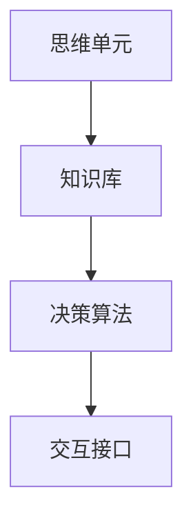

                 

首先，我们将文章结构分为几个部分，每个部分都要明确其内容和目标。以下是详细的分解：

## 文章结构分解

### 文章标题： 
《思维链在AI决策支持系统中的应用与挑战》

### 文章关键词：
思维链，AI决策支持系统，应用实例，挑战与解决方案

### 文章摘要：
本文深入探讨了思维链在AI决策支持系统中的应用及其面临的挑战。通过定义思维链的基本概念和原理，结合实际案例，我们展示了思维链如何提高AI决策的准确性和效率。同时，本文也分析了思维链应用中可能遇到的问题，并提出了相应的解决方案。

## 文章正文部分

### 引言
在这一部分，我们将简要介绍AI决策支持系统的背景和重要性，以及思维链的概念。这将帮助读者了解本文的目的和结构。

#### 背景介绍
- **AI决策支持系统的背景**：介绍AI决策支持系统的定义、功能及其在现代商业和社会管理中的重要性。
- **思维链的概念**：解释思维链的定义、组成部分以及其在AI决策支持系统中的应用潜力。

### 思维链的基本概念与原理
在这一部分，我们将详细解释思维链的基本概念、原理以及其在决策支持中的作用。

#### 核心概念与联系
- **思维链的定义**：思维链是一个由思维单元、知识库、决策算法和交互接口组成的系统。
- **思维链组成部分之间的关系架构**：使用Mermaid流程图展示思维链各部分之间的关系。



#### 核心算法原理讲解
- **知识表示**：介绍如何使用知识库来表示和处理信息。
- **推理过程**：解释思维链如何通过推理来得出决策。

```python
# 知识表示
class KnowledgeBase:
    def __init__(self):
        self.knowledge = []

    def add_knowledge(self, fact):
        self.knowledge.append(fact)

    def retrieve_knowledge(self, query):
        return [fact for fact in self.knowledge if query in fact]

# 推理过程
def infer(knowledge_base, rule, fact):
    if fact in rule['conditions']:
        return rule['conclusion']
    return None
```

### AI决策支持系统的架构与功能
在这一部分，我们将探讨AI决策支持系统的架构和功能，并解释思维链如何与这些架构和功能结合。

#### AI决策支持系统的基本架构
- **数据采集**：从不同来源收集数据。
- **数据预处理**：清洗、转换和整合数据。
- **模型训练**：使用数据训练决策模型。
- **模型部署**：将模型部署到生产环境中。

#### 思维链在AI决策支持系统中的应用场景
- **决策支持**：解释思维链如何为决策者提供支持。
- **自动化决策**：展示思维链如何实现自动化决策。

### 思维链的应用实例
在这一部分，我们将提供具体的案例，展示思维链在实际AI决策支持系统中的应用。

#### 金融行业的应用
- **风控决策**：介绍思维链在金融风控决策中的应用实例。
- **业务优化**：展示思维链如何优化金融业务流程。

#### 医疗健康领域的应用
- **诊断决策**：介绍思维链在医疗诊断决策中的应用实例。
- **资源优化**：展示思维链如何优化医疗资源分配。

### 思维链应用的挑战与解决方案
在这一部分，我们将分析思维链在应用过程中可能遇到的挑战，并探讨相应的解决方案。

#### 数据质量与隐私保护
- **挑战**：讨论数据质量和隐私保护的问题。
- **解决方案**：介绍提高数据质量和隐私保护的策略。

#### 决策过程的不确定性
- **挑战**：分析决策过程不确定性的影响。
- **解决方案**：探讨降低不确定性的方法。

#### 思维链与人类决策者之间的互动
- **挑战**：讨论思维链与人类决策者互动的问题。
- **解决方案**：提出促进互动的策略。

### 思维链在AI决策支持系统中的应用展望
在这一部分，我们将探讨思维链的未来发展趋势，以及AI决策支持系统的未来应用场景。

#### 未来发展趋势
- **技术进步**：讨论思维链技术的发展趋势。
- **应用场景**：展望思维链在AI决策支持系统中的未来应用。

### 结论
在这一部分，我们将总结本文的主要观点，并强调思维链在AI决策支持系统中的重要性。

#### 总结
- **思维链的应用**：回顾思维链在决策支持系统中的应用和优势。
- **挑战与解决方案**：总结本文提出的挑战和解决方案。

#### 小结、注意事项与拓展阅读
- **小结**：对文章内容进行简要总结。
- **注意事项**：提醒读者注意的要点。
- **拓展阅读**：推荐进一步阅读的资源。

### 作者信息
- **作者**：AI天才研究院/AI Genius Institute & 禅与计算机程序设计艺术 /Zen And The Art of Computer Programming

## 文章结构总结
本文通过逻辑清晰的结构，逐步介绍了思维链在AI决策支持系统中的应用与挑战。从基础概念到实际应用，再到挑战和解决方案，文章内容丰富且具有深度。希望通过本文，读者能够对思维链有更深入的理解，并认识到其在AI决策支持系统中的巨大潜力。

## 文章标题
《思维链在AI决策支持系统中的应用与挑战》

## 文章关键词
思维链，AI决策支持系统，应用实例，挑战与解决方案

## 文章摘要
本文深入探讨了思维链在AI决策支持系统中的应用及其面临的挑战。通过定义思维链的基本概念和原理，结合实际案例，我们展示了思维链如何提高AI决策的准确性和效率。同时，本文也分析了思维链应用中可能遇到的问题，并提出了相应的解决方案。文章结构清晰，内容丰富，适合对AI决策支持系统和思维链感兴趣的读者阅读。

