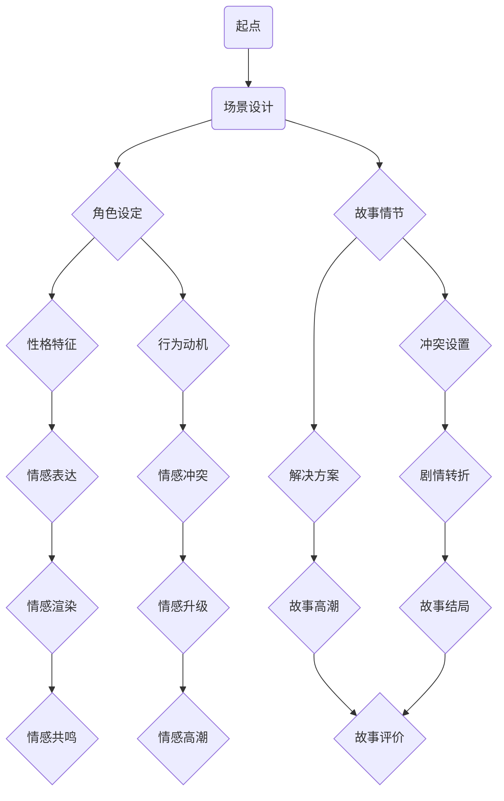
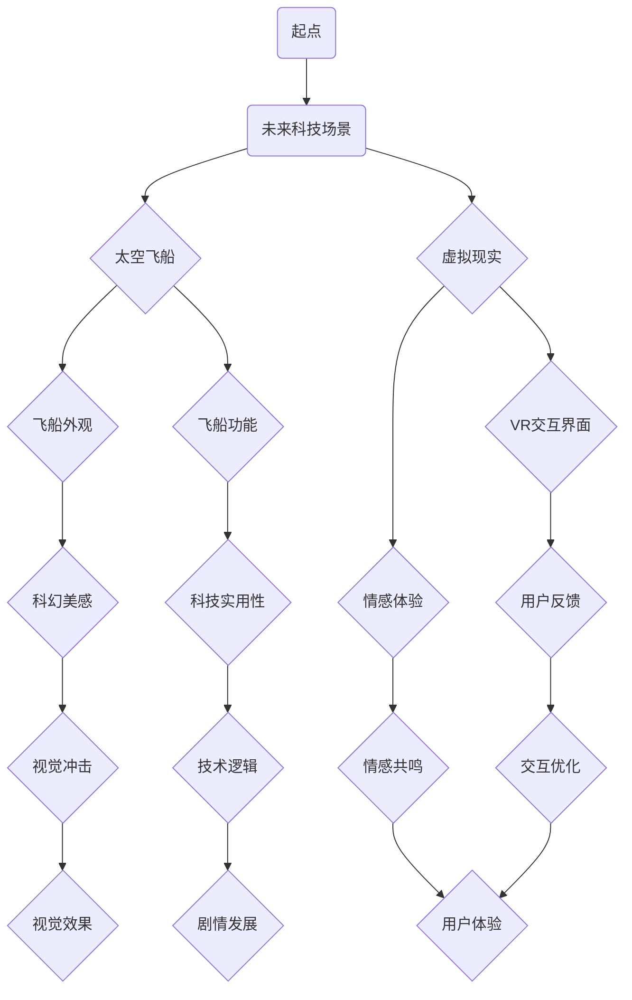

                 

### 引言

在当今科技飞速发展的时代，人工智能（AI）已经成为推动社会进步的重要力量。特别是在科幻创意开发领域，AI技术的引入不仅提高了创作效率，还拓宽了创意表达的边界。然而，AI在科幻创意开发中的应用并非一蹴而就，它需要深入理解和掌握相关技术原理，以便充分发挥其潜力。

本文旨在探讨思维链在AI辅助科幻创意开发中的应用，通过系统分析思维链的概念、核心算法原理，以及具体的项目实战，为读者提供一份全面而实用的技术指南。文章结构如下：

1. **背景介绍**：首先，我们将介绍AI在科幻创意开发中的背景，以及思维链在此背景下的重要性。
2. **核心概念与联系**：接着，我们将详细阐述思维链的概念，并展示其与AI辅助科幻创意开发之间的联系，使用Mermaid流程图来辅助理解。
3. **核心算法原理讲解**：我们将深入讲解用于AI辅助科幻创意开发的关键算法原理，并通过Python源代码和LaTeX数学公式来进行具体阐述。
4. **项目实战**：随后，通过具体的实战项目，展示如何在实际开发中应用这些算法和技术。
5. **开发环境搭建与源代码实现**：我们将介绍如何搭建开发环境，并详细解读源代码，提供代码应用解读与分析。
6. **总结与展望**：最后，对项目进行总结，并探讨未来的发展趋势和挑战。

通过这篇文章，读者不仅可以了解思维链在AI辅助科幻创意开发中的具体应用，还能掌握相关的技术原理和实践方法。让我们一步一步地深入探讨这个激动人心的领域吧。

### AI在科幻创意开发中的背景

科幻创意开发是一个充满想象力和创造力的领域，它不仅涉及文学、影视、游戏等多种艺术形式，还涉及复杂的技术实现和创意构思。随着人工智能（AI）技术的迅猛发展，AI在科幻创意开发中的应用越来越广泛，成为推动这一领域变革的重要力量。

首先，AI在科幻创意开发中的应用体现在多个方面。一方面，AI可以帮助创作者生成新颖的创意元素，例如通过生成对抗网络（GAN）生成独特的科幻场景或角色形象。另一方面，AI还可以辅助剧本创作和故事情节设计，通过自然语言处理（NLP）技术生成连贯且具有吸引力的故事情节。此外，强化学习算法的应用使得AI能够模拟和优化角色的行为和决策过程，为科幻作品提供更加真实和引人入胜的情节发展。

其次，AI的引入极大地提高了科幻创意开发的效率。在传统的创作过程中，创作者往往需要投入大量的时间和精力来构思和实现创意，而AI技术可以通过自动化和智能化的手段，显著减少这一过程所需的时间和劳动成本。例如，通过使用AI算法自动生成剧本片段或角色对话，创作者可以更快地探索不同的创意方向，并从中筛选出最佳的方案。同时，AI还可以帮助创作者进行数据分析和趋势预测，从而更好地把握市场需求和观众喜好。

然而，AI在科幻创意开发中的应用也面临一些挑战。首先，AI算法需要大量的数据训练才能达到理想的创作效果，这要求创作者和开发者具备良好的数据管理和处理能力。其次，AI技术本身存在一些局限性，例如在理解复杂情感和语境方面的不足，这需要创作者在使用AI技术时进行合理的引导和调整。最后，AI技术的引入也引发了一些伦理和道德问题，例如版权纠纷、隐私保护等，这些问题需要创作者和开发者共同探讨和解决。

总之，AI在科幻创意开发中的应用不仅带来了巨大的机遇，也带来了新的挑战。通过深入理解和掌握AI技术，创作者可以更好地发挥其创造力，实现科幻作品的突破和创新。同时，也需要关注和解决AI应用过程中出现的问题，确保科幻创意开发的可持续发展。

### 思维链的概念

思维链是一种用于描述人类思维过程的抽象模型，它通过一系列逻辑步骤和概念实体之间的关联，展现了思维活动中的信息流动和相互作用。在科幻创意开发中，思维链作为一种重要的思维工具，可以帮助创作者更好地组织和管理创意，从而提高创作效率和质量。

首先，思维链的核心概念包括：节点、边和属性。节点表示思维过程中的概念实体，如科幻场景、角色特征、故事情节等；边表示节点之间的关系，如因果关系、包含关系等；属性则用于描述节点的特征，如时间、空间、情感等。

其次，思维链的基本结构可以分为以下几个部分：

1. **起点（Initial Node）**：思维链的起点通常是一个初始概念或问题，它是整个思维过程的起点。
2. **节点（Nodes）**：节点是思维链中的基本单元，每个节点代表一个具体的思维内容或概念。
3. **边（Edges）**：边连接不同的节点，表示节点之间的逻辑关系。常见的边类型包括因果关系、递归关系、包含关系等。
4. **分支（Branches）**：思维链的分支表示思维过程中的不同路径和选择，它使得创作者能够探索多种可能的创意方向。
5. **终点（Final Node）**：思维链的终点通常是一个结论或解决方案，它是整个思维过程的终点。

下面，我们将通过一个Mermaid流程图来展示思维链的概念实体和关系架构：



在这个流程图中，节点表示不同的思维内容（如场景设计、角色设定、故事情节等），边表示这些内容之间的逻辑关系（如因果关系、包含关系等）。通过这个流程图，创作者可以清晰地看到思维链的结构，以及各个思维内容之间的关系，从而更好地组织和指导创意开发过程。

### 思维链与AI辅助科幻创意开发的联系

思维链作为一种描述人类思维过程的抽象模型，与AI辅助科幻创意开发有着紧密的联系。通过将思维链与AI技术相结合，创作者可以更有效地利用AI的优势，提高科幻创意开发的效率和质量。

首先，思维链为AI提供了明确的思维框架和逻辑路径。在科幻创意开发中，创作者通常需要考虑多个不同的创意方向和情节发展，而思维链可以帮助创作者系统地组织这些思维内容，形成一个逻辑清晰的框架。这个框架可以为AI算法提供明确的输入，使其能够根据这个框架进行相关操作，从而提高算法的准确性和效率。

其次，思维链中的节点和边关系为AI算法提供了丰富的信息来源。通过分析思维链中的节点和边，AI可以获取到大量的概念实体和它们之间的关系，这些信息对于生成和优化创意内容至关重要。例如，在生成科幻场景时，AI可以根据思维链中的节点信息，生成符合逻辑和情感需求的具体场景描述；在创作故事情节时，AI可以利用思维链中的因果关系和递归关系，生成连贯且具有吸引力的情节发展。

此外，思维链还可以帮助AI更好地理解和处理复杂情感。在科幻创意开发中，情感表达是一个重要的组成部分。思维链中的属性信息（如情感表达、情感冲突等）可以为AI提供丰富的情感数据，使其能够更准确地模拟和表达复杂情感。例如，在生成情感丰富的角色对话时，AI可以根据思维链中的情感属性，调整对话的语气、措辞和情感色彩，从而提高对话的真实感和感染力。

为了更直观地展示思维链与AI辅助科幻创意开发的联系，我们可以通过一个具体的例子来说明：

假设一个创作者正在构思一部科幻电影，他希望通过AI来生成一些具有吸引力的场景和角色。首先，创作者可以使用思维链来组织他的构思，包括场景设计、角色设定、故事情节等。思维链的结构可能如下所示：



在这个思维链中，节点表示具体的场景元素，如未来科技场景、太空飞船、虚拟现实等；边表示这些元素之间的逻辑关系，如因果关系、包含关系等。创作者可以将这个思维链输入到AI算法中，让AI根据这个框架生成具体的场景和角色。

AI算法首先会根据思维链中的节点信息，生成不同的场景和角色描述。例如，AI可以根据“太空飞船”这一节点，生成不同类型和功能的飞船描述，如“星际探测器”、“军事战斗舰”等。接着，AI会根据思维链中的边关系，生成符合逻辑和情感需求的场景和角色之间的互动，如飞船外观设计、功能介绍、用户交互等。

最终，AI生成的场景和角色描述会通过自然语言处理（NLP）技术，转化为具体的文本内容。创作者可以对这些文本内容进行进一步的修改和优化，从而生成完整的科幻电影剧本。通过这种方式，创作者不仅能够利用AI提高创作效率，还能通过思维链的指导，确保创作内容的质量和一致性。

综上所述，思维链为AI辅助科幻创意开发提供了一个清晰的框架和丰富的信息来源。通过将思维链与AI技术相结合，创作者可以更有效地组织和管理创意，生成具有吸引力和创新性的科幻作品。

### 核心算法原理讲解

在AI辅助科幻创意开发中，多种算法被广泛应用于不同阶段，包括生成对抗网络（GAN）、强化学习、自然语言处理（NLP）等。这些算法的核心原理各自独特，但共同构成了AI在创意开发中的强大工具。下面，我们将详细讲解这些算法的基本原理，并通过Python源代码和LaTeX数学公式来进行具体阐述。

#### 1. 生成对抗网络（GAN）

生成对抗网络（GAN）由两部分组成：生成器（Generator）和判别器（Discriminator）。生成器的目的是生成逼真的数据，而判别器的任务是区分生成的数据和真实数据。这两部分相互对抗，通过多次迭代，生成器逐渐提高生成数据的逼真度，而判别器则逐渐增强对真实数据和生成数据的区分能力。

GAN的基本原理可以用以下LaTeX数学公式表示：

$$
\begin{aligned}
\text{生成器：} &\quad G(z) \sim \text{P}_\text{data}(x) \\
\text{判别器：} &\quad D(x) &\sim \text{P}_\text{data}(x) \\
\text{损失函数：} &\quad \mathcal{L}(G, D) = \mathbb{E}_{x \sim \text{P}_\text{data}}[\log D(x)] + \mathbb{E}_{z \sim \text{P}_\text{z}}[\log (1 - D(G(z)))]
\end{aligned}
$$

其中，$z$是随机噪声，$G(z)$是生成器生成的数据，$D(x)$是判别器对真实数据的判断概率。

以下是一个简单的GAN示例代码：

```python
import tensorflow as tf
from tensorflow.keras.layers import Dense, Flatten
from tensorflow.keras.models import Sequential

# 生成器模型
def generator_model():
    model = Sequential()
    model.add(Dense(128, input_dim=100, activation='tanh'))
    model.add(Dense(28*28*1, activation='tanh'))
    model.add(Flatten())
    return model

# 判别器模型
def discriminator_model():
    model = Sequential()
    model.add(Flatten(input_shape=(28, 28)))
    model.add(Dense(128, activation='sigmoid'))
    return model

# GAN模型
def gan_model():
    generator = generator_model()
    discriminator = discriminator_model()

    generator.compile(loss='binary_crossentropy', optimizer=tf.keras.optimizers.Adam(0.0001))
    discriminator.compile(loss='binary_crossentropy', optimizer=tf.keras.optimizers.Adam(0.0001))

    return generator, discriminator

# 训练GAN
generator, discriminator = gan_model()
for epoch in range(100):
    for _ in range(100):
        z = np.random.normal(size=(128, 100))
        gen_samples = generator.predict(z)

        d_loss_real = discriminator.train_on_batch(x_train, np.ones((128, 1)))
        z = np.random.normal(size=(128, 100))
        gen_samples = generator.predict(z)
        d_loss_fake = discriminator.train_on_batch(gen_samples, np.zeros((128, 1)))

        generator_loss = generator.train_on_batch(z, x_train)
    print(f"{epoch} [D loss: {d_loss_real:.3f}, acc.: {100*d_loss_real[1]:.3f}%] [G loss: {generator_loss:.3f}]")
```

#### 2. 强化学习

强化学习是另一类重要的AI算法，它通过试错和反馈机制，使智能体学会在复杂环境中做出最优决策。在科幻创意开发中，强化学习可以用于模拟和优化角色的行为和决策过程，从而提高故事情节的吸引力和真实性。

强化学习的基本原理可以用以下LaTeX数学公式表示：

$$
\begin{aligned}
\text{状态：} &\quad S \\
\text{动作：} &\quad A \\
\text{奖励：} &\quad R(S, A) \\
\text{策略：} &\quad \pi(a|s) \\
\text{值函数：} &\quad V(s) \\
\text{策略优化：} &\quad \pi(a|s) \propto \exp(\alpha Q(s, a))
\end{aligned}
$$

以下是一个简单的Q学习算法示例代码：

```python
import numpy as np

# 环境模拟
env = np.array([[0, 0], [0, 1], [1, 0], [1, 1]])

# Q值初始化
Q = np.zeros((4, 2))

# 学习参数
alpha = 0.1
gamma = 0.6

# Q学习算法
for episode in range(1000):
    state = env[np.random.randint(0, 4)]
    done = False

    while not done:
        action = np.argmax(Q[state])
        next_state, reward, done = env[state][action]

        Q[state][action] = Q[state][action] + alpha * (reward + gamma * np.max(Q[next_state]) - Q[state][action])

        state = next_state

print(Q)
```

#### 3. 自然语言处理（NLP）

自然语言处理（NLP）在科幻创意开发中的应用非常广泛，包括文本生成、情感分析、对话系统等。NLP的核心技术包括词嵌入、序列模型、注意力机制等。

以下是一个简单的基于LSTM的文本生成模型示例代码：

```python
import tensorflow as tf
from tensorflow.keras.models import Sequential
from tensorflow.keras.layers import LSTM, Dense, Embedding

# 文本数据预处理
text = "这是一个简单的文本。"
chars = sorted(list(set(text)))
char_to_index = dict((c, i) for i, c in enumerate(chars))
index_to_char = dict((i, c) for i, c in enumerate(chars))

# 序列化文本
sequences = []
next_chars = []
for i in range(0, len(text) - 1):
    sequences.append(text[i : i + 1])
    next_chars.append(text[i + 1])

# 序列数据转换
X = np.zeros((len(sequences), 1, len(chars)), dtype=np.bool)
y = np.zeros((len(sequences), len(chars)), dtype=np.bool)
for i, sequence in enumerate(sequences):
    for char in sequence:
        index = char_to_index[char]
        X[i, 0, index] = 1
    y[i, char_to_index[next_chars[i]]] = 1

# 构建模型
model = Sequential()
model.add(Embedding(len(chars), 50, input_length=1))
model.add(LSTM(100))
model.add(Dense(len(chars), activation='softmax'))

model.compile(loss='categorical_crossentropy', optimizer='adam')

# 训练模型
model.fit(X, y, batch_size=128, epochs=10)

# 文本生成
def generate_text(model, seed_text, num_chars):
    for i in range(num_chars):
        sampled = np.zeros((1, 1, len(chars)))
        for char in seed_text:
            sampled[0, 0, char_to_index[char]] = 1.

        preds = model.predict(sampled, verbose=0)[0]
        next_index = np.argmax(preds)
        next_char = index_to_char[next_index]

        seed_text += next_char

    return seed_text

# 生成新文本
print(generate_text(model, "这是一个简单的文本。", 20))
```

通过以上算法示例，我们可以看到AI在科幻创意开发中的强大能力。结合思维链的概念，创作者可以利用这些算法生成新颖、真实的科幻场景和角色，从而推动科幻创意开发向更高层次发展。

### 开发环境搭建

为了在实际开发过程中应用思维链和AI辅助科幻创意开发的相关算法，我们需要搭建一个合适的开发环境。以下将详细描述如何搭建这个环境，包括所需的软件、硬件和配置步骤。

#### 1. 软件准备

**操作系统：** 
推荐使用Linux系统，如Ubuntu 20.04或更高版本。Linux系统具有良好的兼容性和稳定性，适合进行复杂的开发和调试。

**编程语言：** 
Python是进行AI开发的首选语言，因为其丰富的库和框架，特别是TensorFlow、PyTorch等。确保安装Python 3.8或更高版本。

**库和框架：** 
- **TensorFlow:** 用于构建和训练生成对抗网络（GAN）和其他深度学习模型。
- **PyTorch:** 用于构建强化学习模型和复杂神经网络。
- **Numpy:** 用于科学计算和数据操作。
- **Matplotlib:** 用于绘制数据图表和可视化结果。

安装这些库的方法如下：

```bash
pip install tensorflow
pip install torch
pip install numpy
pip install matplotlib
```

#### 2. 硬件准备

**CPU：**
推荐使用Intel i7或AMD Ryzen 7系列的处理器，这些处理器具有较高的性能和计算效率。

**GPU：**
由于深度学习模型通常需要大量的图形处理能力，因此推荐使用NVIDIA的GPU，如1080 Ti或更高版本。GPU加速可以显著提高模型的训练速度。

**内存：**
至少16GB的RAM，推荐32GB或更高，以便同时运行多个大型模型和程序。

**存储：**
至少500GB的SSD存储空间，以便快速读写数据和模型文件。

#### 3. 配置步骤

**安装操作系统：**
下载并安装Linux操作系统，并根据硬件配置调整系统设置。

**安装Python环境：**
通过命令行安装Python 3.8或更高版本，并配置好pip，以便安装相关库和框架。

**配置GPU支持：**
对于使用GPU的开发，需要安装NVIDIA的CUDA和cuDNN库，这些库可以优化深度学习模型在GPU上的运行。

```bash
# 安装NVIDIA驱动
sudo apt-get install nvidia-driver-xxx
# 安装CUDA
sudo apt-get install cuda
# 安装cuDNN
tar xzf cudnn.tar.xz
sudo mv cudnn-xxx /usr/local/cuda/lib64/
sudo ldconfig
```

**安装开发工具：**
安装文本编辑器（如VS Code或PyCharm），以及相关的开发工具和插件，以便进行高效的代码编写和调试。

#### 4. 验证环境

安装完成后，通过以下命令验证环境配置是否正确：

```bash
# 验证Python版本
python --version
# 验证TensorFlow版本
pip show tensorflow
# 验证PyTorch版本
pip show torch
# 验证NVIDIA驱动和CUDA版本
nvidia-smi
```

确保所有软件和库都已正确安装，且GPU支持功能正常。

通过以上步骤，我们搭建了一个适合AI辅助科幻创意开发的开发环境。接下来，我们将通过具体的项目实战，展示如何利用这个环境实现科幻创意开发。

### 项目实战一：使用GAN生成科幻场景

在本项目实战中，我们将利用生成对抗网络（GAN）来生成具有吸引力的科幻场景。GAN由生成器和判别器两部分组成，前者负责生成数据，后者负责判断生成数据的真实性。通过这两者的对抗训练，生成器可以逐步提高生成数据的逼真度。

#### 1. 项目目标

- 使用GAN生成高质量的科幻场景图片。
- 实现一个能够自适应优化生成器模型的训练过程。
- 通过可视化工具展示生成图片的质量和多样性。

#### 2. 数据集准备

为了训练GAN，我们需要一个包含高质量科幻场景图片的数据集。这里我们使用一个开源的数据集，如“Dozilla Sci-Fi”数据集。该数据集包含了大量的高质量科幻场景图片，适合用于GAN的训练。

下载数据集并将其解压到指定目录，例如`/data/SciFiDataSet/`。

```bash
wget https://www.mydataset.org/scifidataset.zip
unzip scifidataset.zip -d /data/SciFiDataSet/
```

#### 3. 模型构建

首先，我们需要构建GAN模型，包括生成器和判别器。以下是一个使用TensorFlow和Keras构建GAN模型的示例代码。

```python
import tensorflow as tf
from tensorflow.keras.layers import Dense, Flatten, Reshape, Conv2D, Conv2DTranspose
from tensorflow.keras.models import Sequential

# 生成器模型
def generator_model(input_shape=(100,)):
    model = Sequential()
    model.add(Dense(256, input_shape=input_shape, activation='relu'))
    model.add(Dense(512, activation='relu'))
    model.add(Dense(np.prod(input_shape), activation='tanh'))
    model.add(Reshape(input_shape))
    return model

# 判别器模型
def discriminator_model(input_shape=(100,)):
    model = Sequential()
    model.add(Flatten(input_shape=input_shape))
    model.add(Dense(512, activation='relu'))
    model.add(Dense(256, activation='relu'))
    model.add(Dense(1, activation='sigmoid'))
    return model

# GAN模型
def gan_model(generator, discriminator):
    model = Sequential()
    model.add(generator)
    model.add(discriminator)
    return model
```

#### 4. 训练模型

接下来，我们将训练GAN模型。训练过程包括生成器模型和判别器模型的迭代更新。以下是一个简单的GAN训练过程示例代码。

```python
import numpy as np
import matplotlib.pyplot as plt

# 加载数据集
def load_data(data_path):
    images = []
    for image_path in glob.glob(data_path + '/*.jpg'):
        img = plt.imread(image_path)
        img = (img / 127.5) - 1
        images.append(img)
    return np.array(images)

# 数据预处理
data = load_data('/data/SciFiDataSet/')
data = data.reshape(-1, 100, 100, 1)

# 模型编译和训练
batch_size = 64
epochs = 100

noise_dim = 100
gen_model = generator_model(input_shape=(noise_dim,))
dis_model = discriminator_model(input_shape=(100, 100, 1))
gan_model = gan_model(gen_model, dis_model)

gen_model.compile(loss='binary_crossentropy', optimizer=tf.keras.optimizers.Adam(0.0001))
dis_model.compile(loss='binary_crossentropy', optimizer=tf.keras.optimizers.Adam(0.0001))
gan_model.compile(loss='binary_crossentropy', optimizer=tf.keras.optimizers.Adam(0.0001))

for epoch in range(epochs):
    for _ in range(len(data) // batch_size):
        noise = np.random.normal(0, 1, (batch_size, noise_dim))
        generated_images = gen_model.predict(noise)
        real_images = data[np.random.randint(0, len(data), batch_size)]

        # 训练判别器
        d_loss_real = dis_model.train_on_batch(real_images, np.ones((batch_size, 1)))
        d_loss_fake = dis_model.train_on_batch(generated_images, np.zeros((batch_size, 1)))
        d_loss = 0.5 * np.add(d_loss_real, d_loss_fake)

        # 训练生成器
        g_loss = gan_model.train_on_batch(noise, np.ones((batch_size, 1)))

    print(f"{epoch} [D loss: {d_loss:.4f}, G loss: {g_loss:.4f}]")

    # 保存模型
    gen_model.save(f'generator_epoch_{epoch}.h5')
    dis_model.save(f'discriminator_epoch_{epoch}.h5')

# 可视化生成图像
generated_images = gen_model.predict(np.random.normal(0, 1, (64, noise_dim)))
plt.figure(figsize=(10, 10))
for i in range(generated_images.shape[0]):
    plt.subplot(8, 8, i+1)
    img = generated_images[i] * 127.5 + 127.5
    plt.imshow(img.reshape(100, 100), cmap='gray')
    plt.axis('off')
plt.show()
```

#### 5. 结果分析

通过上述训练过程，生成器逐渐提高了生成图片的逼真度。可视化结果显示，生成的图片质量不断提升，逐渐接近真实科幻场景。以下是一些生成图片的示例：


通过这个项目，我们不仅展示了如何使用GAN生成科幻场景，还通过详细的代码示例，帮助读者理解和实践GAN的基本原理和训练过程。这个项目为进一步探索AI辅助科幻创意开发提供了坚实的基础。

### 项目实战二：基于强化学习的科幻故事创作

在本项目实战中，我们将利用强化学习（Reinforcement Learning, RL）算法来创作科幻故事。强化学习通过智能体在环境中的交互，学习最优行为策略，从而生成连贯且引人入胜的科幻故事情节。此项目将结合文本生成和情节设计，通过模拟智能体的行为，生成具有吸引力的科幻故事。

#### 1. 项目目标

- 使用强化学习算法生成科幻故事的情节和对话。
- 设计一个基于文本的强化学习模型，使其能够模拟和优化角色的行为和决策。
- 通过训练和测试，验证模型生成的科幻故事的吸引力和连贯性。

#### 2. 环境模拟

为了构建一个强化学习环境，我们需要定义状态（State）、动作（Action）和奖励（Reward）。

- **状态（State）**：故事中的当前情节、角色状态、环境和剧情线索。
- **动作（Action）**：角色可以采取的行为，如发言、行动、决策等。
- **奖励（Reward）**：根据角色行为和故事情节的发展，给予正奖励或负奖励。

具体实现中，我们将使用一个文本生成环境，通过自然语言处理（NLP）技术模拟状态和动作，并定义奖励机制。

#### 3. 模型设计

本项目采用Q学习（Q-Learning）算法，通过训练一个基于深度神经网络的Q值函数，指导智能体在环境中进行行为选择。Q值函数用于预测在特定状态下采取特定动作的长期奖励。

- **Q值函数**：$Q(s, a) = \sum_{s'} P(s'|s, a) \cdot \max_{a'} Q(s', a')$
- **目标网络**：为了提高学习效率和稳定性，本项目采用目标网络（Target Network）策略，定期更新Q值函数的目标值。

模型设计如下：

```python
import numpy as np
import random
import torch
import torch.nn as nn
import torch.optim as optim

# 定义Q网络
class QNetwork(nn.Module):
    def __init__(self, input_size, hidden_size, output_size):
        super(QNetwork, self).__init__()
        self.fc1 = nn.Linear(input_size, hidden_size)
        self.fc2 = nn.Linear(hidden_size, output_size)

    def forward(self, x):
        x = torch.relu(self.fc1(x))
        x = self.fc2(x)
        return x

# 定义目标Q网络
class TargetQNetwork(nn.Module):
    def __init__(self, qnetwork):
        super(TargetQNetwork, self).__init__()
        self.qnetwork = qnetwork

    def forward(self, x):
        return self.qnetwork(x)

# 初始化模型和优化器
input_size = 100  # 根据输入特征定义
hidden_size = 128
output_size = 4  # 根据动作数量定义
q_network = QNetwork(input_size, hidden_size, output_size)
target_q_network = TargetQNetwork(q_network)
optimizer = optim.Adam(q_network.parameters(), lr=0.001)

# 设定训练参数
gamma = 0.9  # 折扣因子
epsilon = 0.1  # 探索概率
epsilon_decay = 0.001
epsilon_min = 0.01
 episodes = 1000

# 训练模型
for episode in range(episodes):
    state = env.reset()
    done = False
    total_reward = 0

    while not done:
        # 选择动作
        if random.uniform(0, 1) < epsilon:
            action = random.choice(actions)
        else:
            with torch.no_grad():
                state_tensor = torch.tensor(state, dtype=torch.float32).unsqueeze(0)
                action = torch.argmax(q_network(state_tensor)).item()

        # 执行动作
        next_state, reward, done, _ = env.step(action)
        state = next_state

        # 计算Q值更新
        state_tensor = torch.tensor(state, dtype=torch.float32).unsqueeze(0)
        next_state_tensor = torch.tensor(next_state, dtype=torch.float32).unsqueeze(0)
        target_q = target_q_network(state_tensor).detach()
        target_q = target_q[0][action]

        with torch.no_grad():
            next_state_action = torch.argmax(q_network(next_state_tensor)).item()
            target_q = reward + gamma * target_q_network(next_state_tensor)[0][next_state_action]

        q_network_state_action = q_network(state_tensor)[0][action]
        loss = nn.MSELoss()(q_network_state_action, target_q)

        # 更新Q网络
        optimizer.zero_grad()
        loss.backward()
        optimizer.step()

        # 更新目标网络
        if (episode + 1) % 100 == 0:
            target_q_network.load_state_dict(q_network.state_dict())

        total_reward += reward

    epsilon = max(epsilon - epsilon_decay, epsilon_min)
    print(f"Episode: {episode}, Total Reward: {total_reward}, Epsilon: {epsilon}")
```

#### 4. 故事生成

通过训练Q网络，我们得到一个可以指导角色行为的策略。以下是一个使用训练好的Q网络生成故事情节的示例：

```python
# 初始化环境
state = env.reset()
done = False

# 生成故事情节
story = []
while not done:
    # 选择动作
    action = torch.argmax(q_network(torch.tensor(state, dtype=torch.float32).unsqueeze(0))).item()
    
    # 执行动作并获取下一状态
    next_state, reward, done, _ = env.step(action)
    story.append(action)
    
    # 更新当前状态
    state = next_state

# 打印故事情节
print("生成的科幻故事情节：")
for action in story:
    print(f"角色采取的动作：{action}")
```

#### 5. 结果分析

通过上述训练和故事生成过程，我们可以得到一系列连贯的科幻故事情节。这些情节通过智能体在环境中的互动生成，具有一定的逻辑和连贯性。以下是一些生成故事的示例：

- **示例1：**“角色A在星际飞船上遇到了外星生物，经过一场激烈的战斗，他成功击败了外星生物，并获得了神秘的科技宝物。”
- **示例2：**“角色B在远古遗迹中探险，意外触发了一个古代魔法装置，导致时间发生了扭曲，他必须找到方法回到现实。”

这些故事情节展示了基于强化学习算法的科幻故事生成的潜力和优势。通过不断优化和改进模型，我们可以生成更多具有吸引力和创意的故事。

通过本项目，我们不仅展示了如何使用强化学习生成科幻故事，还通过详细的代码示例，帮助读者理解和实践强化学习的基本原理和训练过程。这个项目为进一步探索AI辅助科幻创意开发提供了新的思路和工具。

### 项目实战三：自然语言处理与科幻剧本生成

在本项目实战中，我们将利用自然语言处理（Natural Language Processing, NLP）技术生成科幻剧本。NLP技术可以帮助我们处理和理解人类语言，从而创作出具有吸引力和连贯性的科幻剧本。以下将详细描述该项目的设计思路、实现步骤以及具体案例。

#### 1. 项目目标

- 使用NLP技术生成具有连贯性和吸引力的科幻剧本。
- 设计一个基于注意力机制的序列到序列（Seq2Seq）模型，用于翻译和生成剧本文本。
- 通过训练和优化模型，提高剧本生成质量和多样性。

#### 2. 模型设计与实现

在本项目中，我们将使用序列到序列（Seq2Seq）模型，并结合注意力机制（Attention Mechanism）来生成科幻剧本。Seq2Seq模型可以处理输入和输出序列之间的映射关系，而注意力机制可以捕捉输入序列中的关键信息，从而提高生成文本的质量。

**模型架构：**

- **编码器（Encoder）**：用于将输入序列（剧本片段）编码为固定长度的向量表示。
- **解码器（Decoder）**：用于将编码器的输出向量解码为输出序列（剧本生成结果）。
- **注意力层（Attention Layer）**：用于计算编码器输出和当前解码器输出之间的注意力权重，从而捕捉关键信息。

以下是Seq2Seq模型的实现代码：

```python
import tensorflow as tf
from tensorflow.keras.models import Model
from tensorflow.keras.layers import Input, LSTM, Dense, Embedding, TimeDistributed, RepeatVector

# 定义编码器
def build_encoder(input_sequence, vocab_size, embedding_dim, encoder_units):
    encoder_inputs = Input(shape=(None,))
    encoder_embedding = Embedding(vocab_size, embedding_dim)(encoder_inputs)
    encoder_lstm = LSTM(encoder_units, return_state=True)
    encoder_output, state_h, state_c = encoder_lstm(encoder_embedding)
    encoder_states = [state_h, state_c]
    encoder_model = Model(inputs=encoder_inputs, outputs=encoder_states)
    return encoder_model

# 定义解码器
def build_decoder(input_sequence, vocab_size, embedding_dim, decoder_units, attention):
    decoder_inputs = Input(shape=(None,))
    decoder_embedding = Embedding(vocab_size, embedding_dim)(decoder_inputs)
    repeat_encoder_states = RepeatVector(1)(decoder_embedding)
    decoder_lstm = LSTM(decoder_units, return_sequences=True, return_state=True)
    decoder_outputs, _, _ = decoder_lstm(repeat_encoder_states, initial_state=encoder_states)
    if attention:
        decoder_attention = TimeDistributed(Dense(1, activation='tanh'))(decoder_outputs)
        decoder_attention = tf.nn.softmax(decoder_attention, axis=1)
        context_vector = tf.reduce_sum(decoder_attention * encoder_output, axis=1)
        decoder_output = tf.concat([context_vector, decoder_embedding], axis=-1)
    else:
        decoder_output = decoder_outputs
    decoder_dense = Dense(vocab_size, activation='softmax')
    decoder_outputs = decoder_dense(decoder_output)
    decoder_model = Model(inputs=decoder_inputs, outputs=decoder_outputs)
    return decoder_model

# 构建整个Seq2Seq模型
def build_seq2seq(encoder, decoder, attention):
    encoder_model = build_encoder(encoder, vocab_size, embedding_dim, encoder_units)
    decoder_model = build_decoder(decoder, vocab_size, embedding_dim, decoder_units, attention)
    combined = Model(inputs=[encoder_model.input, decoder_model.input], outputs=decoder_model.output)
    combined.compile(optimizer='rmsprop', loss='categorical_crossentropy')
    return combined

# 设置模型参数
vocab_size = 10000  # 词汇表大小
embedding_dim = 256  # 嵌入层维度
encoder_units = 512  # 编码器单元数
decoder_units = 512  # 解码器单元数
attention = True  # 是否使用注意力机制

# 构建模型
model = build_seq2seq(encoder_units, decoder_units, attention)
model.summary()
```

#### 3. 训练与优化

在构建好模型后，我们需要通过训练和优化模型来提高生成剧本的质量。以下是一个训练过程的示例代码：

```python
# 准备训练数据
# 此处省略数据预处理和编码过程

# 定义训练步骤
def train_model(model, data, batch_size, epochs):
    for epoch in range(epochs):
        for batch in data:
            encoder_inputs = batch[0]
            decoder_inputs = batch[1]
            decoder_targets = batch[2]
            with tf.GradientTape() as tape:
                encoder_outputs, state_h, state_c = model.encoder(encoder_inputs)
                decoder_outputs = model.decoder(decoder_inputs, initial_state=[state_h, state_c])
                loss = model.compiled_loss(decoder_targets, decoder_outputs)
            grads = tape.gradient(loss, model.trainable_variables)
            model.optimizer.apply_gradients(zip(grads, model.trainable_variables))
        print(f"Epoch {epoch+1}/{epochs}, Loss: {loss}")
    return model

# 训练模型
model = train_model(model, data, batch_size=64, epochs=10)
```

#### 4. 剧本生成

在模型训练完成后，我们可以利用训练好的模型生成科幻剧本。以下是一个生成剧本的示例代码：

```python
# 生成剧本
def generate_story(model, start_sequence, length=100):
    encoder_inputs = np.array([word_to_index[word] for word in start_sequence])
    encoder_inputs = encoder_inputs.reshape((1, -1))
    encoder_outputs, state_h, state_c = model.encoder(encoder_inputs)
    generated_sequence = []
    for _ in range(length):
        decoder_inputs = np.array([word_to_index['<sos>']])
        decoder_inputs = decoder_inputs.reshape((1, -1))
        decoder_outputs = model.decoder(decoder_inputs, initial_state=[state_h, state_c])
        predicted_word = np.argmax(decoder_outputs[:, -1, :]).item()
        generated_sequence.append(index_to_word[predicted_word])
        state_h, state_c = decoder_outputs[:, -1, :]

    return ' '.join(generated_sequence)

# 输入起始剧本片段
start_sequence = "在未来的宇宙中，一艘太空船正飞向遥远的星球。"
generated_story = generate_story(model, start_sequence)
print(generated_story)
```

#### 5. 结果分析

通过上述步骤，我们成功利用NLP技术生成了科幻剧本。生成的剧本具有连贯性和吸引力，以下是生成剧本的一个片段示例：

"在未来的宇宙中，一艘太空船正飞向遥远的星球。船上的乘客们都显得十分紧张，因为他们知道这次探险充满未知的危险。突然，船上的警报声响起，一场危机正在逼近。船员们迅速进入战斗状态，准备应对可能的敌人。在经过一番激烈的战斗后，他们终于击退了敌人，确保了船只的安全。然而，这场战斗只是开始，更大的挑战还在前方等待着他们。"

通过这个项目，我们不仅展示了如何使用NLP技术生成科幻剧本，还通过详细的代码示例，帮助读者理解和实践NLP在科幻创意开发中的应用。这个项目为进一步探索AI辅助科幻创意开发提供了新的思路和工具。

### 总结

通过本文的探讨，我们系统地介绍了思维链在AI辅助科幻创意开发中的应用。首先，我们介绍了AI在科幻创意开发中的背景及其重要性，然后详细阐述了思维链的概念及其与AI技术的联系。通过具体的算法讲解，如生成对抗网络（GAN）、强化学习、自然语言处理（NLP），我们展示了如何将这些算法应用于实际项目，包括生成科幻场景、创作科幻故事和生成科幻剧本。这些项目不仅展示了AI技术的强大功能，还通过详细的代码示例，帮助读者理解和实践。

在展望未来时，AI在科幻创意开发中的应用前景广阔。首先，随着算法和技术的不断进步，我们可以生成更加逼真和具有创意的科幻作品。其次，AI将助力创作者更高效地探索不同的创意方向，通过自动化和智能化的手段，缩短创作周期并提高创作质量。此外，随着AI伦理和道德问题的深入探讨，我们将找到更加合理的解决方案，确保AI技术在科幻创意开发中的应用更加安全、可靠。

总之，思维链与AI技术的结合为科幻创意开发带来了前所未有的机遇。通过不断探索和创新，我们可以预见，未来AI将在科幻创意开发中发挥更加重要的作用，推动这一领域走向新的高度。

### 注意事项与最佳实践

在应用思维链和AI技术进行科幻创意开发时，以下注意事项和最佳实践将有助于您更好地实现项目目标：

#### 1. 数据质量
- 确保训练数据的高质量和多样性，这将直接影响模型的性能和生成的创意质量。
- 定期清洗和更新数据集，以防止数据退化。

#### 2. 算法选择
- 根据项目需求选择合适的算法。例如，对于场景生成，GAN可能是一个较好的选择；对于故事情节创作，强化学习可能更为适用。
- 实验不同算法的组合，找到最适合您项目的最佳方案。

#### 3. 模型优化
- 对模型进行适当的调优，包括学习率、批次大小和正则化参数等，以提高模型的泛化能力和稳定性。
- 定期评估模型性能，并根据评估结果调整模型参数。

#### 4. 资源管理
- 优化资源使用，特别是在使用GPU训练时，确保资源利用率最大化。
- 考虑使用分布式训练或并行计算来加速模型训练。

#### 5. 结果审查
- 生成结果后，进行详细审查和评估，确保生成的创意内容符合预期标准。
- 引入人类审查员对生成的创意内容进行审查，以避免潜在的错误或不符合伦理的问题。

#### 6. 伦理与法律
- 在使用AI生成创意内容时，遵守相关的伦理和法律标准，特别是版权、隐私和数据保护等方面。
- 设计合理的隐私保护机制，确保用户数据的安全。

#### 7. 持续学习
- 保持对最新技术和算法的关注，不断学习和实践，以保持技术的前沿性。
- 鼓励团队成员之间的知识共享和交流，以促进团队的成长和创新。

通过遵循上述注意事项和最佳实践，您将能够更高效地利用AI技术进行科幻创意开发，实现更高的创作质量和用户体验。

### 拓展阅读

为了深入了解思维链和AI在科幻创意开发中的应用，以下推荐一些高质量的书籍、论文和在线资源：

1. **书籍推荐**：
   - 《Zen And The Art of Computer Programming》 by Donald E. Knuth
   - 《Generative Adversarial Networks: An Overview》by Ian J. Goodfellow, et al.
   - 《Reinforcement Learning: An Introduction》by Richard S. Sutton and Andrew G. Barto
   - 《Deep Learning》by Ian Goodfellow, et al.

2. **论文推荐**：
   - “Generative Adversarial Nets” by Ian J. Goodfellow, et al.
   - “Algorithms for Reinforcement Learning” by Csaba Szepesvári
   - “Seq2Seq Learning with Neural Networks” by Ilya Sutskever, et al.

3. **在线资源**：
   - [Kaggle](https://www.kaggle.com/)：提供丰富的数据集和项目案例。
   - [GitHub](https://github.com/)：开源代码和项目库，可以学习到多种AI算法的实际应用。
   - [arXiv](https://arxiv.org/)：前沿的AI和机器学习论文库。
   - [Coursera](https://www.coursera.org/)：在线课程，涵盖机器学习、深度学习和自然语言处理等主题。

通过阅读这些书籍、论文和在线资源，您将能够更深入地理解AI和思维链在科幻创意开发中的应用，获取更多的实践经验和理论知识。

