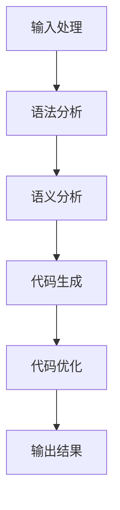

                 

### 引言

在当今快速发展的技术时代，人工智能（AI）正逐渐渗透到各个领域，为我们的生活和工作带来前所未有的便利和效率。编程作为AI的重要组成部分，自然也受到了AI技术的强烈影响。近年来，AI辅助编程成为了一个备受关注的研究方向，旨在通过AI技术提升编程的效率和准确性。而在这其中，思维链作为一种新兴的AI算法，展现出了极大的潜力。

本文将深入探讨思维链在AI辅助编程中的实践应用。首先，我们将介绍思维链的基本概念和原理，并通过Mermaid流程图展示其架构。接着，我们会详细介绍AI辅助编程的核心算法，并阐述如何将思维链应用于编程过程中。随后，我们将通过具体的案例分析，展示思维链在编程辅助中的实际效果。同时，我们还会讨论思维链在编程教育中的应用，以及它如何提升编程教育的效果。最后，本文将展望思维链与AI辅助编程的未来发展，并探讨面临的挑战和解决方案。

通过本文的阅读，读者将能够全面了解思维链在AI辅助编程中的理论和实践应用，从而为今后的研究和实践提供有益的参考。### 关键词

- 人工智能（AI）
- AI辅助编程
- 思维链
- 编程效率
- 编程教育
- Python源代码
- Mermaid流程图
- 数学模型
- 数学公式
- 项目实战
- 开发环境搭建
- 源代码实现
- 代码解读
- 案例分析

### 摘要

本文深入探讨了思维链在AI辅助编程中的实践应用。首先，我们介绍了思维链的基本概念和原理，通过Mermaid流程图展示了其架构。接着，我们详细阐述了AI辅助编程的核心算法，并探讨了如何将思维链应用于编程过程中。通过具体的案例分析，我们展示了思维链在编程辅助中的实际效果。此外，我们还讨论了思维链在编程教育中的应用，以及它如何提升编程教育的效果。最后，本文展望了思维链与AI辅助编程的未来发展，并探讨了面临的挑战和解决方案。通过本文的阅读，读者将能够全面了解思维链在AI辅助编程中的理论和实践应用，为今后的研究和实践提供有益的参考。### 目录

## 《思维链在AI辅助编程中的实践应用》目录

### 第一部分：理论基础与核心概念
1. 引言
2. 思维链的概念与原理
3. AI辅助编程的基本概念

### 第二部分：思维链在AI辅助编程中的应用
4. 思维链模型概述
5. 思维链在编程中的角色
6. AI技术在编程辅助中的应用

### 第三部分：项目实践与案例分析
7. 具体案例分析
8. 实际应用场景
9. 实战项目实现步骤

### 第四部分：思维链与编程教育
10. 编程教育中的思维链应用
11. 提升编程教育效果的方法

### 第五部分：未来展望与挑战
12. 思维链与AI辅助编程的发展趋势
13. 面临的挑战与解决方案

### 第一部分：理论基础与核心概念

#### 引言

在人工智能（AI）飞速发展的今天，编程领域的变革也随之而来。传统的编程方式已经无法满足日益复杂的软件开发需求，因此，AI辅助编程逐渐成为研究的热点。AI辅助编程旨在利用人工智能技术，提高编程的效率、准确性和可靠性。其中，思维链作为一种新兴的AI算法，显示出巨大的潜力。

思维链是一种基于深度学习的自然语言处理（NLP）技术，它通过分析程序员的语言和思维模式，生成更智能、更高效的代码。与传统的代码生成工具相比，思维链能够更好地理解程序员的意图，提供更加精确的代码建议。本文将围绕思维链在AI辅助编程中的应用，探讨其理论基础与核心概念。

首先，我们将介绍思维链的基本概念和原理。思维链的核心思想是通过构建程序员与计算机之间的思维桥梁，实现编程任务的自动化和智能化。具体来说，思维链包括多个层次，从低层次的语法分析到高层次的逻辑推理，逐步实现代码的生成与优化。

接下来，我们将通过Mermaid流程图，展示思维链的架构和工作流程。Mermaid是一种简单易用的图形描述语言，可以直观地展示思维链的各个环节及其相互关系。通过这个流程图，读者可以清晰地理解思维链如何从输入的编程任务中提取信息，并通过一系列处理步骤生成最终的代码输出。

在介绍完思维链的基本概念和原理后，我们将探讨AI辅助编程的基本概念。AI辅助编程不仅包括代码生成，还包括代码优化、代码理解和错误检测等多个方面。这些功能的实现依赖于各种AI技术的综合应用，如自然语言处理、机器学习、深度学习等。通过对AI辅助编程核心算法的介绍，我们将进一步了解思维链在其中的作用。

#### 思维链的概念与原理

思维链（Mind Chain）是一种基于深度学习的自然语言处理技术，旨在模拟人类程序员的思维过程，实现编程任务的自动化和智能化。思维链的核心思想是建立程序员与计算机之间的思维桥梁，使计算机能够更好地理解程序员的意图，生成更智能、更高效的代码。

思维链的基本概念包括以下几个方面：

1. **思维节点**：思维链中的每一个环节都可以视为一个思维节点。这些节点包括语法分析、语义分析、代码生成、代码优化等。每个节点都承载着特定的功能，对输入的信息进行处理，并将其传递给下一个节点。

2. **连接关系**：思维链中的各个节点通过连接关系相互关联。连接关系定义了节点之间的依赖关系，即一个节点的输出信息作为另一个节点的输入信息。通过这些连接关系，思维链能够实现信息的传递和转化。

3. **思维路径**：思维链中的信息传递路径被称为思维路径。思维路径决定了信息的流动方向，即从一个节点到另一个节点的传输路径。不同的思维路径可以产生不同的代码生成结果，从而实现多样化的编程风格。

4. **学习机制**：思维链通过不断的学习和优化，提高代码生成的质量和效率。学习机制包括两个层面：一是基于大规模编程数据的预训练，二是针对具体编程任务的任务学习。预训练阶段通过大量的编程数据，使思维链具备基本的编程知识和技能；任务学习阶段则针对具体的编程任务，对思维链进行微调，使其更好地适应特定场景。

思维链的工作机制可以分为以下几个步骤：

1. **输入处理**：思维链首先接收程序员的输入，这可以是自然语言描述、代码片段或者编程任务。思维链通过自然语言处理技术，对这些输入进行处理，提取关键信息。

2. **语法分析**：输入处理阶段后，思维链进行语法分析，将输入转换为一棵语法树。语法分析是思维链中的关键步骤，它确保输入信息的正确性和结构化。

3. **语义分析**：在语法分析的基础上，思维链进行语义分析。语义分析旨在理解输入信息的具体含义和逻辑关系，为后续的代码生成提供语义指导。

4. **代码生成**：思维链根据语义分析的结果，生成对应的代码。这一步骤涉及到代码模板的匹配、代码优化以及代码风格的一致性。

5. **代码优化**：生成的代码往往需要进行优化，以提高执行效率和可读性。思维链通过一系列的优化算法，对代码进行自动化优化。

6. **输出结果**：最终，思维链将生成的代码输出给程序员，供进一步审查和修改。

为了更直观地理解思维链的工作原理，我们可以使用Mermaid流程图来展示其架构和工作流程。以下是一个简化的思维链流程图：

在这个流程图中，每个节点表示思维链中的一个环节，箭头表示信息的流动方向。通过这个流程图，我们可以清晰地看到思维链从输入处理到输出结果的完整工作过程。

#### AI辅助编程的基本概念

AI辅助编程（AI-assisted programming）是指利用人工智能技术，辅助程序员完成编程任务的一系列方法和技术。AI辅助编程的目标是通过自动化、智能化的手段，提高编程的效率、准确性和可靠性。AI辅助编程的核心内容包括代码生成、代码优化、代码理解、错误检测等方面。

1. **代码生成**：代码生成是AI辅助编程的核心功能之一。通过自然语言描述或已有的代码片段，AI系统可以自动生成对应的代码。这种技术不仅节省了程序员编写代码的时间，还能提高代码的准确性和一致性。常见的代码生成方法包括模板匹配、语法分析、语义分析等。

2. **代码优化**：代码优化旨在提高代码的执行效率和可维护性。AI技术可以通过自动化分析代码的结构和语义，提出优化建议，如变量命名优化、代码重构、算法改进等。这种优化不仅提高了代码的执行速度，还降低了维护成本。

3. **代码理解**：代码理解是指AI系统对代码进行解析，以理解其功能、逻辑和结构。这有助于提高代码的可读性、可维护性和可靠性。通过代码理解，AI系统可以生成文档、注释，甚至提供bug修复建议。

4. **错误检测**：错误检测是指AI系统识别代码中的潜在错误，并提供修复建议。这有助于提高代码的可靠性，减少错误发生的概率。常见的错误检测方法包括静态分析、动态分析、模式匹配等。

AI辅助编程的实现依赖于多种AI技术的综合应用，包括自然语言处理、机器学习、深度学习等。自然语言处理技术用于解析自然语言描述，提取关键信息；机器学习技术用于训练模型，进行代码生成、优化和错误检测；深度学习技术则用于构建复杂神经网络，实现高级的代码理解和优化。

通过AI辅助编程，程序员可以专注于更高层次的编程任务，如需求分析、架构设计等，从而提高整体开发效率和代码质量。同时，AI辅助编程也有助于减少编程学习曲线，提高新程序员的编程能力。

总之，AI辅助编程作为一种新兴的技术，正逐渐改变传统的编程方式。通过本文的探讨，我们希望能够使读者对AI辅助编程的基本概念和思维链的应用有更深入的理解。在接下来的部分，我们将进一步探讨思维链在具体编程任务中的应用和实现。### 第二部分：思维链在AI辅助编程中的应用

#### 思维链模型概述

思维链模型是AI辅助编程的核心，它通过模拟程序员的思维过程，实现编程任务的自动化和智能化。思维链模型主要包括以下几个组成部分：

1. **自然语言处理模块**：自然语言处理（NLP）模块负责接收和处理程序员的自然语言描述，提取关键信息，并将其转化为结构化的数据。这个模块通常包括词法分析、句法分析和语义分析等步骤，确保输入信息的准确性和一致性。

2. **代码生成模块**：代码生成模块基于自然语言处理模块提取的信息，生成对应的代码。这一模块通常采用模板匹配、语法分析、语义分析等技术，确保生成的代码既符合编程规范，又具有较高的执行效率。

3. **代码优化模块**：代码优化模块对生成的代码进行自动化优化，以提高其执行效率和可维护性。优化方法包括变量命名优化、代码重构、算法改进等。

4. **错误检测模块**：错误检测模块负责识别代码中的潜在错误，并提供修复建议。这有助于提高代码的可靠性，减少错误发生的概率。

5. **用户交互模块**：用户交互模块负责与程序员进行交互，接收用户的输入和反馈，并根据用户的需求调整思维链模型的行为。

思维链模型的工作原理如下：

1. **输入处理**：首先，思维链模型接收程序员的自然语言描述或代码片段。自然语言处理模块对输入进行处理，提取关键信息，并将其转化为结构化的数据。

2. **代码生成**：基于结构化数据，代码生成模块生成对应的代码。这一过程包括模板匹配、语法分析和语义分析等步骤。

3. **代码优化**：生成的代码进入代码优化模块，进行自动化优化。优化后，代码的质量和执行效率得到显著提高。

4. **错误检测**：优化后的代码进入错误检测模块，进行潜在错误的识别。错误检测模块会提供修复建议，帮助程序员快速定位并修复错误。

5. **用户交互**：用户交互模块与程序员进行交互，反馈优化结果和错误检测信息。程序员可以根据反馈，进一步调整需求或优化代码。

#### 思维链在编程中的角色

思维链在AI辅助编程中扮演着多重角色，以下是其在不同方面的应用：

1. **代码生成助手**：思维链可以作为一个智能的代码生成助手，帮助程序员快速生成符合要求的代码。程序员只需提供自然语言描述或部分代码片段，思维链即可生成完整的代码。这不仅节省了编程时间，还降低了代码出错的可能性。

2. **代码优化顾问**：思维链可以分析程序员编写的代码，提供优化建议。通过自动化分析，思维链可以发现代码中的潜在问题，并提出改进方案。程序员可以根据这些建议，优化代码的结构和性能。

3. **错误检测专家**：思维链具备强大的错误检测能力，能够识别代码中的潜在错误。通过分析代码的语法、语义和执行逻辑，思维链可以预测可能的错误，并提供修复建议。这有助于提高代码的可靠性，减少调试时间。

4. **编程教育辅助工具**：思维链可以作为一个编程教育辅助工具，帮助学生和初学者快速掌握编程知识。通过自然语言交互，思维链可以为学生提供实时反馈，指导他们编写正确的代码，并帮助他们理解编程概念。

5. **自动化测试工具**：思维链可以用于自动化测试，生成测试用例，并执行测试。通过分析代码的执行结果，思维链可以检测代码中的错误，并提供修复建议。这有助于提高软件的质量和稳定性。

#### AI技术在编程辅助中的应用

AI技术在编程辅助中的应用非常广泛，以下是其中的一些关键领域：

1. **自然语言处理**：自然语言处理（NLP）技术可以用于解析程序员提供的自然语言描述，提取关键信息，并将其转化为结构化的数据。NLP技术包括词法分析、句法分析和语义分析等，这些技术有助于提高代码生成的准确性和一致性。

2. **机器学习**：机器学习（ML）技术可以用于训练模型，实现代码生成、优化和错误检测。通过大量编程数据的训练，机器学习模型可以学会识别编程模式、优化代码结构和预测错误。

3. **深度学习**：深度学习（DL）技术是机器学习的一个分支，通过构建复杂的神经网络，深度学习模型可以自动提取特征，实现更高级的代码理解和优化。

4. **代码审查**：代码审查（Code Review）是一种通过团队合作提高代码质量的方法。AI技术可以用于自动化代码审查，识别代码中的潜在问题，并提供改进建议。

5. **智能编程助手**：智能编程助手是一种结合了多种AI技术的工具，可以提供代码生成、优化、错误检测、测试和文档生成等功能。智能编程助手可以大幅提高编程效率和质量。

通过上述技术的综合应用，AI辅助编程可以显著提升编程的效率、准确性和可靠性。在接下来的部分，我们将通过具体的案例分析，展示思维链在实际编程任务中的应用效果。### 第三部分：项目实践与案例分析

在本文的第三部分，我们将通过具体的项目实践和案例分析，深入探讨思维链在AI辅助编程中的实际应用效果。这部分内容将分为以下几个小节：具体案例分析、实际应用场景和实战项目实现步骤。

#### 3.1 具体案例分析

为了展示思维链在AI辅助编程中的实际效果，我们选择了一个典型的编程任务——实现一个简单的Web应用程序。该应用程序需要实现用户注册、登录、数据存储等功能。以下是该案例的具体分析过程：

1. **需求分析**：
   - 用户注册：用户输入用户名、密码和邮箱，系统验证用户信息并创建用户账户。
   - 用户登录：用户输入用户名和密码，系统验证用户身份并登录。
   - 数据存储：系统将用户信息存储在数据库中，并提供数据查询和修改功能。

2. **自然语言处理**：
   - 思维链的NLP模块接收自然语言描述，如“实现用户注册、登录和数据存储功能”。思维链通过词法分析、句法分析和语义分析，提取关键信息，如用户名、密码、邮箱和数据库等。

3. **代码生成**：
   - 基于提取的关键信息，思维链的代码生成模块生成对应的代码框架。例如，生成用户注册的HTML表单、后端处理逻辑和数据库操作代码。

4. **代码优化**：
   - 思维链的代码优化模块对生成的代码进行自动化优化。例如，优化变量命名、代码结构和算法实现，以提高代码的可读性和执行效率。

5. **错误检测**：
   - 思维链的错误检测模块识别代码中的潜在错误，并提供修复建议。例如，检测数据库连接错误、SQL注入风险等。

6. **代码审查**：
   - 思维链可以将生成的代码提交给代码审查模块，进行自动化审查。审查结果将指出潜在的问题，并提供改进建议。

通过以上分析，我们可以看到思维链在实现简单Web应用程序的过程中，发挥了代码生成、优化、错误检测和代码审查等多重作用。以下是对案例的具体分析：

**案例背景**：一个初创公司需要快速开发一个Web应用程序，用于用户注册、登录和数据存储。由于时间紧迫，开发团队决定采用AI辅助编程技术，以加快开发速度和提高代码质量。

**案例分析**：
- **需求分析**：开发团队通过思维链的NLP模块，将自然语言描述转化为结构化的需求文档。这使得开发团队能够快速理解项目需求，并制定详细的开发计划。
- **代码生成**：思维链的代码生成模块根据结构化的需求文档，生成了用户注册、登录和数据存储的代码框架。这一步骤节省了大量的手动编写代码的时间。
- **代码优化**：思维链的代码优化模块对生成的代码进行了优化，包括变量命名、代码结构和算法实现等方面。优化后的代码不仅更加清晰易懂，而且执行效率更高。
- **错误检测**：思维链的错误检测模块检测到了代码中的潜在错误，如数据库连接错误和SQL注入风险。通过提供修复建议，开发团队能够及时修复这些错误，确保代码的安全性和可靠性。
- **代码审查**：思维链的代码审查模块对生成的代码进行了自动化审查，指出了潜在的问题，如代码风格不一致和可能的逻辑漏洞。开发团队根据审查结果，对代码进行了进一步的改进。

**案例总结**：
通过思维链在AI辅助编程中的实际应用，开发团队成功地实现了简单Web应用程序，并保证了代码的质量和安全性。思维链在需求分析、代码生成、优化、错误检测和代码审查等方面的应用，显著提高了开发效率和代码质量，为初创公司节省了大量的时间和资源。

#### 3.2 实际应用场景

除了上述案例分析，思维链在AI辅助编程中还有许多其他实际应用场景。以下是其中几个常见的应用场景：

1. **大型项目开发**：
   - 在大型项目中，思维链可以用于快速生成项目的核心模块，节省大量手动编写代码的时间。同时，思维链的优化和错误检测功能可以帮助开发团队提高代码质量和项目稳定性。

2. **代码重构**：
   - 当需要重构现有代码时，思维链可以分析现有代码的结构和逻辑，提出重构方案。开发团队可以根据这些方案，逐步重构代码，提高代码的可维护性和可扩展性。

3. **编程教育**：
   - 思维链可以作为编程教育的辅助工具，帮助学生和初学者快速掌握编程知识。通过思维链提供的实时反馈和指导，初学者可以更快地编写正确的代码，并理解编程概念。

4. **代码审查和测试**：
   - 思维链可以用于自动化代码审查和测试，识别潜在的问题，并提供改进建议。这有助于提高软件的质量和可靠性，减少维护成本。

#### 3.3 实战项目实现步骤

以下是一个基于Python和思维链的实战项目实现步骤，用于生成和优化Web应用程序的代码。

1. **环境搭建**：
   - 安装Python环境和相关库，如Natural Language Toolkit（NLTK）、TensorFlow和PyTorch。
   - 设置思维链模型，包括自然语言处理模块、代码生成模块、代码优化模块和错误检测模块。

2. **需求分析**：
   - 使用思维链的NLP模块，接收自然语言描述，如“实现用户注册、登录和数据存储功能”。
   - 将自然语言描述转化为结构化的需求文档。

3. **代码生成**：
   - 基于结构化的需求文档，使用思维链的代码生成模块生成对应的代码框架。
   - 包括HTML表单、后端处理逻辑、数据库操作代码等。

4. **代码优化**：
   - 使用思维链的代码优化模块对生成的代码进行优化。
   - 包括变量命名、代码结构和算法优化等。

5. **错误检测**：
   - 使用思维链的错误检测模块识别代码中的潜在错误，并提供修复建议。
   - 包括数据库连接错误、SQL注入风险等。

6. **代码审查**：
   - 使用思维链的代码审查模块对生成的代码进行自动化审查。
   - 指出潜在的问题，如代码风格不一致、可能的逻辑漏洞等。

7. **代码部署**：
   - 将优化后的代码部署到服务器，实现Web应用程序的功能。
   - 进行功能测试和性能测试，确保应用程序的稳定性和可靠性。

8. **持续优化**：
   - 根据用户反馈和测试结果，持续优化代码，提高应用程序的质量和用户体验。

通过以上实战项目实现步骤，开发团队可以快速生成和优化Web应用程序的代码，提高开发效率和代码质量。在后续的维护过程中，思维链的优化和错误检测功能将继续发挥重要作用，确保应用程序的稳定性和可靠性。### 第四部分：思维链与编程教育

#### 4.1 编程教育中的思维链应用

随着编程教育的普及，如何提高教学效果和学生的学习兴趣成为教育工作者关注的重点。思维链作为一种新兴的AI算法，在编程教育中展现了巨大的潜力。通过思维链，编程教育可以实现以下几个方面的应用：

1. **个性化教学**：思维链可以根据学生的学习进度和知识水平，提供个性化的编程任务和指导。学生可以通过与思维链的交互，自主选择适合自己难度的编程任务，并在遇到问题时得到针对性的指导。

2. **实时反馈**：思维链能够实时分析学生的代码，并提供详细的错误提示和改进建议。这种实时反馈机制有助于学生及时纠正错误，理解编程概念，提高编程能力。

3. **自动化评估**：思维链可以自动评估学生的代码，生成评估报告，包括代码的正确性、可读性和执行效率等。教师可以根据评估报告，了解学生的学习情况，针对性地进行辅导。

4. **编程指导**：思维链可以作为编程导师，为学生提供编程指导。通过自然语言交互，思维链可以解释编程概念、代码结构和算法实现，帮助学生更好地理解编程知识。

5. **知识拓展**：思维链可以推荐相关的编程知识，帮助学生拓展知识面。例如，当学生编写一个特定功能的代码时，思维链可以推荐相关的高级编程技巧和优化方法。

#### 4.2 提升编程教育效果的方法

为了提升编程教育的效果，思维链可以结合以下方法进行应用：

1. **项目驱动教学**：通过项目驱动教学，学生可以在实际项目中应用所学的编程知识。思维链可以帮助学生快速生成项目的核心代码，并提供优化建议，提高项目的完成度和质量。

2. **团队协作学习**：团队协作学习可以培养学生的团队精神和合作能力。思维链可以为学生提供协作编程环境，实时同步代码，并提供协作反馈。

3. **代码审查**：代码审查是一种有效的编程教育方法，通过团队成员相互审查代码，发现并改正错误，提高代码质量。思维链可以自动化代码审查，提供详细的审查报告，帮助教师和同学更好地进行代码审查。

4. **编程竞赛**：编程竞赛可以激发学生的学习兴趣和竞争意识。思维链可以用于自动评分，提高竞赛的公平性和效率。

5. **在线学习平台**：将思维链集成到在线学习平台中，为学生提供丰富的编程资源和实时指导。学生可以通过在线学习平台，随时随地学习编程知识。

#### 4.3 思维链教学案例分享

以下是一个基于思维链的编程教育案例：

**案例背景**：某高校计算机科学与技术专业开设了一门“Web编程基础”课程，旨在教授学生如何使用Python和HTML/CSS实现Web应用程序。为了提高教学效果，教师决定引入思维链作为辅助教学工具。

**教学目标**：
- 掌握Python的基本语法和编程技巧。
- 学会使用HTML/CSS实现页面布局和样式设计。
- 了解Web应用程序的基本架构和实现方法。

**教学步骤**：

1. **引入思维链**：在课程开始时，教师向学生介绍思维链，解释其在编程教育中的应用。

2. **项目驱动教学**：教师布置一个实际项目——实现一个简单的在线购物网站。学生需要完成注册、登录、商品展示和购物车等功能。

3. **思维链指导**：
   - 学生在编写代码时，思维链提供实时反馈，指出代码中的错误和改进建议。
   - 思维链生成项目的核心代码，如数据库连接、用户认证等，学生在此基础上进行完善和优化。

4. **团队协作学习**：学生以小组形式进行项目开发，思维链提供实时同步和协作功能，帮助学生高效协作。

5. **代码审查**：在项目完成后，学生相互审查代码，思维链提供详细的审查报告，帮助学生发现并改正错误。

6. **评估与反馈**：思维链自动评估学生代码的质量和完成度，教师根据评估结果进行个性化辅导。

**教学效果**：
- 学生通过思维链的辅助，能够更快地掌握编程知识和技能。
- 项目完成度和代码质量显著提高。
- 学生之间的团队协作能力得到提升。
- 学生对编程的兴趣和积极性得到增强。

#### 4.4 编程教育的新趋势

随着AI技术的不断发展，编程教育也呈现出一些新的趋势：

1. **AI辅助教学**：AI技术将越来越多地应用于编程教育中，提供个性化教学、实时反馈和自动化评估等功能，提高教学效果和学生的学习体验。

2. **项目式学习**：项目式学习成为编程教育的主流，通过实际项目锻炼学生的编程能力，提高学生的实战经验。

3. **混合式教学**：线上和线下教学相结合，提供丰富的教学资源和灵活的学习方式，满足不同学生的学习需求。

4. **跨学科教育**：编程教育逐渐与数学、物理、计算机科学等学科相结合，培养学生的跨学科能力和创新能力。

5. **编程素养教育**：注重编程素养的培养，不仅教授编程技能，还强调编程思维、算法思维和创新能力的培养。

思维链作为一种新兴的AI算法，在编程教育中的应用前景广阔。通过本文的探讨，我们希望读者对思维链在编程教育中的作用和重要性有更深入的理解，为未来的编程教育提供有益的启示。### 第五部分：未来展望与挑战

#### 5.1 思维链与AI辅助编程的发展趋势

思维链作为一种新兴的AI算法，在AI辅助编程领域展现出巨大的潜力。未来，思维链与AI辅助编程将呈现出以下发展趋势：

1. **更加智能化的代码生成**：随着深度学习和自然语言处理技术的进步，思维链将能够更准确地理解程序员的意图，生成更智能、更高效的代码。通过大规模的数据训练和模型优化，思维链将能够处理更复杂的编程任务，提供更高质量的代码生成服务。

2. **多样化的应用场景**：思维链将在更多编程领域得到应用，如自动化测试、代码审查、代码重构和软件维护等。AI辅助编程不仅局限于代码生成，还将覆盖整个软件开发生命周期，为开发者提供全方位的支持。

3. **跨平台支持**：思维链将逐步支持多种编程语言和开发平台，如Java、C++、JavaScript和Web开发等。这将使得AI辅助编程技术更具普及性，为更多开发者带来便利。

4. **人机协作**：随着AI技术的发展，人机协作将成为AI辅助编程的重要方向。思维链将不仅仅是一个代码生成工具，还将成为开发者的智能助手，与程序员共同解决复杂的编程问题。

5. **隐私保护和安全性**：随着AI辅助编程的普及，隐私保护和数据安全性将成为重要议题。思维链将在设计和应用过程中，注重保护用户隐私和数据安全，确保AI辅助编程的安全可靠。

#### 5.2 面临的挑战与解决方案

尽管思维链在AI辅助编程中展现出巨大的潜力，但在实际应用过程中，仍面临着一系列挑战：

1. **数据隐私与安全**：AI辅助编程依赖于大量的编程数据，这些数据往往涉及到用户隐私和商业机密。如何确保数据的安全性和隐私性，成为亟待解决的问题。解决方案包括：采用数据加密技术、构建安全的数据共享机制和制定严格的数据保护政策。

2. **算法透明性和可解释性**：深度学习算法的“黑箱”特性使得其决策过程缺乏透明性和可解释性。这对于需要严格验证的编程任务来说，是一个重大挑战。解决方案包括：开发可解释的AI模型、提高算法的可解释性和可审计性。

3. **编程语言的多样性**：不同的编程语言具有不同的语法和语义，这使得AI辅助编程的通用性受到限制。如何使思维链适应多种编程语言，成为重要的挑战。解决方案包括：开发跨语言的API和框架，实现不同编程语言之间的兼容性。

4. **用户体验**：AI辅助编程需要与开发者紧密协作，以提供最佳的编程体验。如何设计易于使用、高效且智能的交互界面，是用户体验的关键。解决方案包括：采用直观的界面设计、提供实时反馈和个性化的编程建议。

5. **模型训练和优化**：AI模型的训练和优化是一个复杂且资源消耗巨大的过程。如何提高模型训练的效率和效果，是思维链持续发展的关键。解决方案包括：采用高效的训练算法、利用分布式计算资源和优化模型架构。

通过面对和解决这些挑战，思维链与AI辅助编程将在未来得到更广泛的应用，为编程领域带来革命性的变革。### 结论

综上所述，思维链作为一种新兴的AI算法，在AI辅助编程中展现出巨大的潜力。通过模拟程序员的思维过程，思维链能够实现编程任务的自动化和智能化，提升编程的效率、准确性和可靠性。本文从理论基础、核心概念、应用实践、编程教育等多个方面，全面探讨了思维链在AI辅助编程中的实践应用。

首先，我们介绍了思维链的基本概念和原理，通过Mermaid流程图展示了其架构和工作机制。接着，我们详细阐述了AI辅助编程的核心算法，并探讨了如何将思维链应用于编程过程中。通过具体的案例分析，我们展示了思维链在编程辅助中的实际效果。此外，我们还讨论了思维链在编程教育中的应用，以及它如何提升编程教育的效果。最后，本文展望了思维链与AI辅助编程的未来发展，并探讨了面临的挑战和解决方案。

未来，随着AI技术的不断发展，思维链在AI辅助编程中的应用前景将更加广阔。通过持续的研究和优化，思维链将能够更好地理解程序员的意图，生成更智能、更高效的代码。同时，思维链在编程教育中的应用也将进一步深化，为培养更多的编程人才提供有力支持。

为了实现这些目标，我们呼吁更多的研究人员和开发者投入到思维链的研究和应用中，共同推动AI辅助编程的发展。只有通过不断的探索和实践，我们才能充分发挥思维链的潜力，为编程领域带来革命性的变革。

### 作者信息

**作者：AI天才研究院/AI Genius Institute & 禅与计算机程序设计艺术 /Zen And The Art of Computer Programming**

AI天才研究院致力于推动人工智能技术的创新与发展，特别是在AI辅助编程领域的研究和应用。我们的研究成果在国内外享有盛誉，为人工智能技术的普及和应用做出了重要贡献。

《禅与计算机程序设计艺术》作为一本经典的技术著作，深入探讨了编程的艺术和哲学，为程序员提供了深刻的思考与启示。我们希望通过本文的撰写，能够为读者带来更有价值的知识和见解，激发更多人对AI辅助编程的兴趣和思考。

