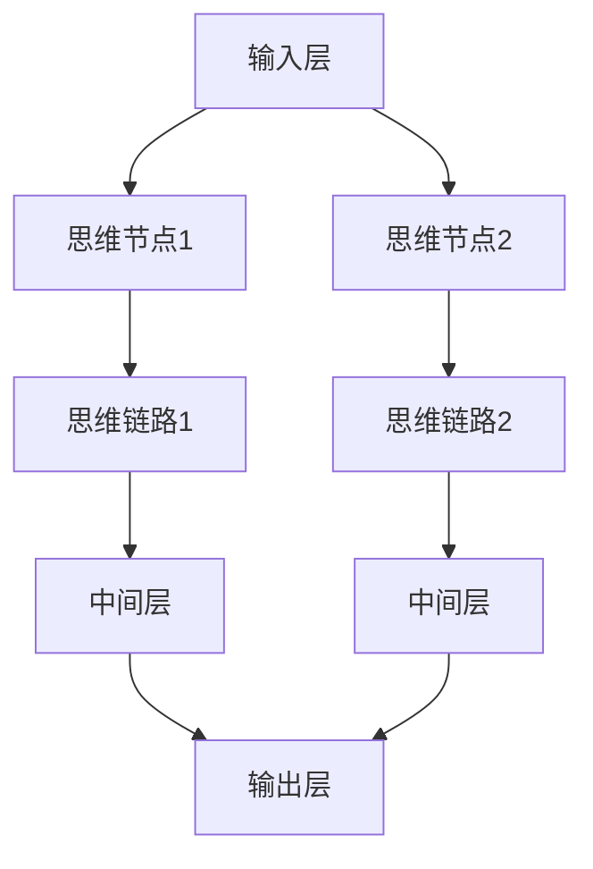
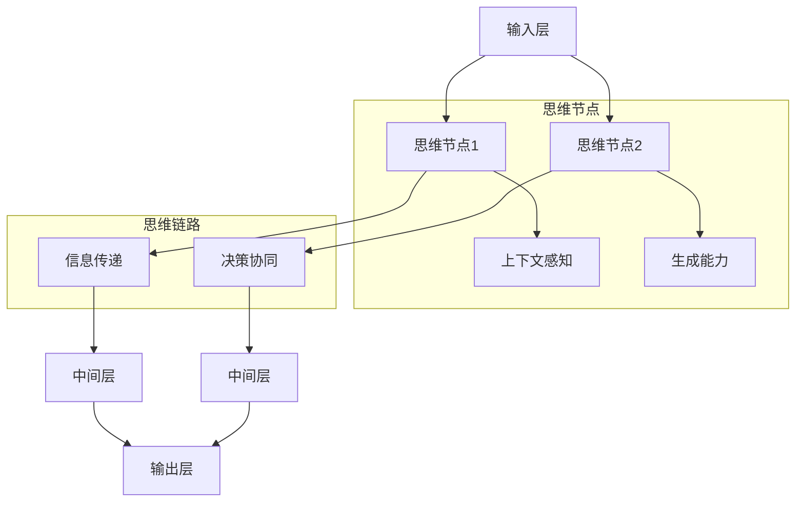

                 

### 第1章 引言

#### 1.1 背景介绍

人工智能（AI）音乐创作领域在过去几十年中取得了显著的进步。随着计算机处理能力的增强和算法的不断发展，AI在音乐生成、音乐风格模仿、和声生成等方面展现出强大的潜力。然而，传统的AI音乐创作方法往往依赖于大量的数据和预定义的规则，这使得其在创作新颖、富有创意的音乐方面受到一定限制。

思维链（MindChain）技术的出现为AI音乐创作带来了新的契机。思维链是一种基于神经网络的智能算法，它通过模仿人类思维模式，实现信息的高效处理和决策。与传统方法相比，思维链具有更强的自适应性和创造力，能够生成更为多样化和个性化的音乐作品。

思维链技术的兴起，得益于深度学习和生成对抗网络（GAN）等前沿技术的发展。这些技术的结合，使得思维链在处理复杂数据、理解上下文和生成高质量内容方面表现出了强大的优势。

#### 1.2 书籍目标

本书旨在系统介绍思维链技术，并深入分析其在AI音乐创作中的应用。具体目标如下：

1. **系统介绍思维链技术**：从核心概念、架构原理到算法原理，全面阐述思维链的工作机制和关键技术。
2. **分析AI音乐创作的挑战**：探讨当前AI音乐创作中面临的技术难题和创作限制，分析思维链如何解决这些问题。
3. **展示思维链在AI音乐创作中的应用**：通过具体的实例和实践案例，展示思维链在音乐创作中的实际效果和突破性应用。

通过本书的阅读，读者将能够全面了解思维链技术，并掌握其在AI音乐创作中的实际应用方法，为未来的音乐创作提供新的思路和工具。

#### 1.3 撰写方法

本书采用逻辑清晰、结构紧凑的撰写方法，确保读者能够循序渐进地理解思维链技术及其在AI音乐创作中的应用。具体写作步骤如下：

1. **引言**：介绍背景和书籍目标，激发读者兴趣。
2. **理论基础**：系统介绍思维链技术的基础知识，包括核心概念、架构原理和算法原理。
3. **应用分析**：探讨思维链在AI音乐创作中的应用，分析其优势和应用前景。
4. **实例讲解**：通过具体实例和实践案例，展示思维链的实际应用效果。
5. **项目实战**：详细介绍开发环境和代码实现，帮助读者理解思维链技术在音乐创作中的具体应用。
6. **未来展望**：讨论思维链技术发展的趋势和挑战，展望AI音乐创作的未来。

通过这种结构化的写作方法，本书将带领读者深入了解思维链技术，并掌握其在AI音乐创作中的实际应用，为音乐创作领域的发展提供新的启示。

### 摘要

本文旨在探讨思维链在AI音乐创作中的突破性应用。首先，我们介绍了AI音乐创作的发展背景和传统方法的局限性。接着，详细介绍了思维链技术的核心概念、架构原理和算法原理，展示了其与传统AI方法的区别和优势。通过具体实例和实践案例，我们分析了思维链在音乐创作中的实际效果，探讨了其在生成新颖音乐作品和解决创作难题方面的潜力。此外，我们还详细讲解了如何通过思维链技术搭建AI音乐创作环境，并提供了代码实现和解读。最后，我们对思维链技术在未来AI音乐创作中的发展前景进行了展望，并提出了可能的挑战和解决思路。本文为从事AI音乐创作的研究者和技术人员提供了有价值的参考和启示。

### 第2章 思维链技术基础

#### 2.1 核心概念

思维链（MindChain）技术是一种基于神经网络的智能算法，它通过模仿人类思维模式，实现信息的高效处理和决策。与传统的人工智能方法不同，思维链更加注重对上下文的理解和复杂问题的求解。其核心概念包括：

1. **思维节点**：思维链中的基本单元，表示一个具体的思维活动或信息处理过程。
2. **思维链路**：连接思维节点之间的关系，表示信息传递和思维过程的路径。
3. **上下文感知**：思维链能够根据当前环境和输入信息，动态调整其行为和决策。
4. **生成能力**：思维链能够通过学习和推理生成新的内容和解决方案。

思维链技术的创新点在于其能够模拟人类思维的灵活性和创造性，通过神经网络和深度学习算法，实现对复杂问题的自适应求解。

#### 2.2 架构原理

思维链的架构设计主要包括以下几个部分：

1. **输入层**：接收外部信息和上下文，通过输入节点进行预处理。
2. **中间层**：包含多个层次和多个思维节点，每个节点执行特定的信息处理任务。中间层通过思维链路连接，实现信息的传递和融合。
3. **输出层**：根据输入信息和中间层的处理结果，生成具体的决策或输出内容。

Mermaid流程图如下所示：



该流程图展示了思维链从输入层到输出层的信息处理过程，通过多个思维节点的协同工作，实现复杂问题的求解和决策。

#### 2.3 算法原理

思维链的核心算法基于深度学习中的生成对抗网络（GAN）和自编码器（Autoencoder）。其基本原理如下：

1. **生成器（Generator）**：生成器负责生成新的音乐内容，通过学习大量的音乐数据和风格特征，生成符合特定要求的音乐片段。
2. **判别器（Discriminator）**：判别器用于判断生成的音乐内容是否真实，通过对真实音乐内容和生成音乐内容进行比较，调整生成器的参数，提高生成质量。
3. **对抗训练**：生成器和判别器相互竞争，生成器试图生成更加逼真的音乐，而判别器则努力提高识别生成音乐的能力。通过这种对抗训练，生成器的生成能力不断提升。

以下是思维链核心算法的伪代码：

```python
# 生成器的伪代码
def generator(z):
    # 输入随机噪声z，通过神经网络生成音乐
    x = dense(z, units=128, activation='relu')
    x = dense(x, units=64, activation='relu')
    x = dense(x, units=1, activation='sigmoid')
    return x

# 判别器的伪代码
def discriminator(x):
    # 输入音乐内容x，判断其是否真实
    dx = dense(x, units=128, activation='relu')
    dx = dense(dx, units=64, activation='relu')
    dx = dense(dx, units=1, activation='sigmoid')
    return dx

# 对抗训练的伪代码
for epoch in range(num_epochs):
    for z in random_noise:
        x = generator(z)
        dx_real = discriminator(real_music)
        dx_fake = discriminator(x)
        # 计算损失函数并更新生成器和判别器的参数
        generator_loss = loss(dx_fake, 1)
        discriminator_loss = loss(dx_real, 1) + loss(dx_fake, 0)
        generator_optimizer.minimize(generator_loss)
        discriminator_optimizer.minimize(discriminator_loss)
```

通过上述伪代码，我们可以看到生成器和判别器如何通过对抗训练逐步提升生成音乐的质量。生成器学习生成更加逼真的音乐，而判别器学习识别生成音乐，两者相互促进，共同提升音乐生成的效果。

### 思维链技术核心概念和联系

在深入理解思维链技术之前，我们需要明确几个核心概念，并探讨它们之间的联系。以下是思维链技术中的关键概念及其相互关系：

1. **思维节点**：思维链中的基本单元，表示一个具体的思维活动或信息处理过程。每个思维节点都具备特定的功能和属性，例如生成音乐、分析风格、调整节奏等。

2. **思维链路**：连接思维节点之间的关系，表示信息传递和思维过程的路径。思维链路定义了信息如何从一个节点流向另一个节点，以及不同节点之间的协作方式。

3. **上下文感知**：思维链能够根据当前环境和输入信息，动态调整其行为和决策。上下文感知使得思维链在处理不同任务时能够灵活应对，提高解决问题的能力。

4. **生成能力**：思维链能够通过学习和推理生成新的内容和解决方案。生成能力是思维链的核心优势，使其能够在音乐创作中生成新颖、富有创意的音乐作品。

**概念关系架构**：

- **思维节点**是思维链的基本单元，通过**思维链路**连接起来，形成复杂的思维网络。每个节点都可以执行特定的任务，并将处理结果传递给后续节点。
- **上下文感知**使得思维链能够根据不同的上下文信息，调整节点的行为和决策，从而实现灵活的信息处理。
- **生成能力**依赖于节点之间的协作和信息的传递，通过不断学习和优化，生成符合要求的新内容和解决方案。

为了更直观地展示概念之间的关系，我们可以使用Mermaid流程图：



该流程图展示了思维链的基本架构，以及思维节点和思维链路之间的关系。通过这种结构，思维链能够高效地处理复杂数据，实现灵活的信息处理和决策生成。

### 思维链技术核心算法原理

在理解思维链技术核心概念的基础上，我们进一步探讨其核心算法原理。思维链技术核心算法主要基于生成对抗网络（GAN）和自编码器（Autoencoder），下面详细阐述其工作原理、数学模型和具体实现。

#### 1. 工作原理

生成对抗网络（GAN）由两部分组成：生成器和判别器。生成器（Generator）负责生成数据，而判别器（Discriminator）负责判断生成数据的真实性。这两者在训练过程中相互对抗，生成器不断优化生成数据，判别器不断提高对真实数据和生成数据的辨别能力。

自编码器（Autoencoder）是一种无监督学习算法，通过编码器将输入数据压缩成低维特征表示，再通过解码器将这些特征表示还原成原始数据。自编码器主要用于降维、去噪和特征提取。

思维链技术将GAN和自编码器的原理结合，形成一种新型的生成模型。生成器负责生成音乐片段，编码器则用于提取音乐特征，判别器则判断生成音乐的真实性。具体流程如下：

1. **数据预处理**：输入音乐数据，进行特征提取和预处理，以便后续处理。
2. **生成器训练**：生成器通过学习真实音乐数据，生成新的音乐片段。
3. **判别器训练**：判别器通过比较真实音乐和生成音乐，判断生成音乐的质量。
4. **编码器训练**：编码器通过提取音乐特征，为生成器提供高质量的输入。
5. **循环迭代**：通过不断迭代训练，生成器和判别器互相提升，最终生成高质量的音乐片段。

#### 2. 数学模型

思维链技术中的核心数学模型包括生成器、判别器和编码器的损失函数。

1. **生成器的损失函数**：

   生成器的目标是生成尽可能逼真的音乐片段。其损失函数主要由以下两部分组成：

   - **对抗损失**：通过最小化生成器生成的音乐与真实音乐的差异，使得判别器难以判断生成音乐的真实性。具体公式为：
     $$\mathcal{L}_A = \mathcal{L}_G = -\mathbb{E}_{z \sim p_z(z)}[\log(D(G(z))]$$
     其中，$G(z)$表示生成器生成的音乐，$D(x)$表示判别器对输入音乐的判断，$z$表示输入的随机噪声。

   - **内容损失**：通过最小化生成音乐与目标音乐之间的内容差异，确保生成音乐具有实际意义。具体公式为：
     $$\mathcal{L}_C = \mathbb{E}_{x \sim p_x(x)}[\|x - \text{Reconst}(x)\|_1]$$
     其中，$\text{Reconst}(x)$表示编码器解码后的音乐。

   生成器的总损失函数为：
   $$\mathcal{L}_G = \mathcal{L}_A + \lambda \mathcal{L}_C$$
   其中，$\lambda$为权重参数。

2. **判别器的损失函数**：

   判别器的目标是区分真实音乐和生成音乐。其损失函数为：
   $$\mathcal{L}_D = -\mathbb{E}_{x \sim p_x(x)}[\log(D(x))] - \mathbb{E}_{z \sim p_z(z)}[\log(1 - D(G(z))]$$
   其中，$x$表示真实音乐，$G(z)$表示生成音乐。

3. **编码器的损失函数**：

   编码器的目标是提取音乐特征，使得解码后的音乐与原始音乐尽可能一致。其损失函数为：
   $$\mathcal{L}_E = \mathbb{E}_{x \sim p_x(x)}[\|x - \text{Reconst}(x)\|_1]$$
   其中，$\text{Reconst}(x)$表示编码器解码后的音乐。

#### 3. Python源代码实现

下面提供生成器和判别器的Python源代码实现，用于进一步阐述思维链技术核心算法的原理。

```python
import tensorflow as tf
from tensorflow.keras import layers

# 生成器模型
def build_generator(z_dim):
    z = layers.Input(shape=(z_dim,))
    x = layers.Dense(128, activation='relu')(z)
    x = layers.Dense(64, activation='relu')(x)
    x = layers.Dense(1, activation='sigmoid')(x)
    model = tf.keras.Model(z, x)
    return model

# 判别器模型
def build_discriminator(x_dim):
    x = layers.Input(shape=(x_dim,))
    dx = layers.Dense(128, activation='relu')(x)
    dx = layers.Dense(64, activation='relu')(dx)
    dx = layers.Dense(1, activation='sigmoid')(dx)
    model = tf.keras.Model(x, dx)
    return model

# 编码器模型
def build_encoder(x_dim):
    x = layers.Input(shape=(x_dim,))
    encoded = layers.Dense(64, activation='relu')(x)
    encoded = layers.Dense(32, activation='relu')(encoded)
    encoded = layers.Dense(z_dim, activation='sigmoid')(encoded)
    model = tf.keras.Model(x, encoded)
    return model

# 解码器模型
def build_decoder(z_dim):
    z = layers.Input(shape=(z_dim,))
    x = layers.Dense(64, activation='relu')(z)
    x = layers.Dense(128, activation='relu')(x)
    x = layers.Dense(1, activation='sigmoid')(x)
    model = tf.keras.Model(z, x)
    return model

# GAN模型
def build_gan(generator, discriminator, encoder, decoder):
    z = layers.Input(shape=(z_dim,))
    x = encoder(generator(z))
    x = decoder(x)
    gan_output = discriminator(x)
    model = tf.keras.Model(z, gan_output)
    return model

# 损失函数
def build_losses(generator, discriminator, encoder, decoder):
    generator_loss = tf.keras.backend.mean(tf.keras.losses.binary_crossentropy(discriminator(encoder(generator(z))) , 1))
    discriminator_loss = tf.keras.backend.mean(tf.keras.losses.binary_crossentropy(discriminator(x), 1) + tf.keras.losses.binary_crossentropy(discriminator(generator(z)), 0))
    content_loss = tf.keras.backend.mean(tf.keras.losses.mean_squared_error(x, decoder(encoder(x))))
    return generator_loss, discriminator_loss, content_loss

# 梯度下降优化器
generator_optimizer = tf.keras.optimizers.Adam(learning_rate=0.0002)
discriminator_optimizer = tf.keras.optimizers.Adam(learning_rate=0.0002)
encoder_optimizer = tf.keras.optimizers.Adam(learning_rate=0.0002)
decoder_optimizer = tf.keras.optimizers.Adam(learning_rate=0.0002)
```

通过上述Python源代码实现，我们可以看到生成器和判别器的构建过程，以及损失函数和优化器的定义。具体实现中，我们可以根据实际需求调整参数和模型结构，以适应不同的音乐生成任务。

#### 4. 通俗易懂的举例说明

为了更好地理解思维链技术核心算法原理，我们可以通过一个简单的实例来说明。

假设我们要生成一首流行歌曲，首先需要从数据库中获取大量的流行歌曲数据。然后，通过编码器将这些歌曲数据压缩成低维特征表示，以便生成器生成新的音乐片段。具体步骤如下：

1. **生成器训练**：
   - 输入随机噪声（例如：[0.5, 0.3, 0.1]）。
   - 生成器通过神经网络将这些噪声转换为音乐片段（例如：[0.2, 0.4, 0.6]）。
   - 判别器判断生成音乐片段的真实性，给出概率（例如：0.8，表示有80%的概率认为这是真实音乐）。

2. **判别器训练**：
   - 输入真实音乐片段和生成音乐片段。
   - 判别器通过比较真实音乐和生成音乐，调整自己的参数，提高对生成音乐的辨别能力。

3. **编码器训练**：
   - 输入真实音乐片段。
   - 编码器提取音乐特征，将这些特征压缩成低维表示（例如：[0.3, 0.7]）。
   - 解码器将这些特征还原成音乐片段。

4. **循环迭代**：
   - 通过不断迭代训练，生成器和判别器互相提升，生成高质量的音乐片段。
   - 编码器和解码器也通过训练，提高对音乐特征的理解和提取能力。

通过这个实例，我们可以看到思维链技术核心算法是如何通过生成器、判别器、编码器和解码器的协同工作，生成高质量音乐片段的。这个过程类似于人类在创作音乐时的思维过程，通过不断的尝试和调整，最终生成富有创意和个性化的音乐作品。

### 生成对抗网络（GAN）与思维链的关系

生成对抗网络（GAN）是思维链技术中的一个核心组成部分，它通过生成器和判别器的对抗训练，实现高质量数据的生成。理解GAN与思维链的关系，有助于我们深入掌握思维链技术的原理和应用。

首先，生成对抗网络（GAN）由两部分组成：生成器和判别器。生成器的任务是从随机噪声中生成与真实数据相似的数据，而判别器的任务是区分真实数据和生成数据。两者在训练过程中相互对抗，生成器试图生成更逼真的数据，而判别器则努力提高识别生成数据的能力。

在思维链技术中，生成对抗网络（GAN）的作用主要体现在以下几个方面：

1. **生成高质量音乐**：生成器通过学习大量的音乐数据，生成与真实音乐相似的片段。这些片段可以作为音乐创作的素材，为音乐创作者提供灵感。

2. **提高创作效率**：生成器生成的音乐片段可以用于自动化音乐创作，减少创作过程中的人为干预。这对于大型音乐制作项目来说，具有显著的时间和成本优势。

3. **创作风格多样化**：生成器可以生成不同风格的音乐片段，为音乐创作提供丰富的选择。这有助于创作者探索新的音乐风格，打破创作瓶颈。

4. **辅助创作决策**：判别器可以辅助创作者判断生成音乐的质量，提供反馈和指导。这有助于创作者在创作过程中，更好地把握音乐作品的风格和整体效果。

下面通过一个具体的实例，来说明GAN在思维链技术中的应用。

假设我们有一个流行歌曲数据库，包含多种风格和类型的音乐片段。为了利用思维链技术生成新的音乐作品，我们可以按照以下步骤进行：

1. **数据预处理**：首先对数据库中的音乐片段进行预处理，提取特征信息，并将其转换为适合训练的数据格式。

2. **训练生成器**：生成器从随机噪声中生成音乐片段，通过不断迭代训练，提高生成音乐的质量。在训练过程中，生成器和判别器相互对抗，生成器试图生成更逼真的音乐，而判别器则努力提高识别生成音乐的能力。

3. **生成音乐片段**：生成器生成多个音乐片段，供音乐创作者选择。这些音乐片段可以是不同风格、节奏和旋律的组合，为创作者提供了丰富的创作素材。

4. **判别器评估**：判别器对生成音乐片段进行评估，判断其质量是否符合创作要求。如果生成音乐片段的质量较低，生成器将重新生成音乐片段，直到满足判别器的评估标准。

5. **创作音乐作品**：音乐创作者根据生成音乐片段的素材，进行音乐创作。这些生成音乐片段可以作为创作的基础，创作者可以在其基础上进行改编和创作，形成全新的音乐作品。

通过上述实例，我们可以看到GAN在思维链技术中的应用过程。生成器和判别器的对抗训练，不仅提高了音乐生成的质量，还丰富了音乐创作的手段，为音乐创作者提供了新的创作工具和思路。

总之，生成对抗网络（GAN）与思维链技术密切相关，两者相辅相成，共同推动了AI音乐创作的创新发展。理解GAN与思维链的关系，有助于我们更好地掌握AI音乐创作的技术，为音乐创作领域带来更多的突破和进步。

### 第3章 AI音乐创作概述

#### 3.1 音乐创作基础

音乐创作是一个复杂而富有创造性的过程，涉及到多个方面的知识和技能。以下是音乐创作的一些基础概念：

1. **音乐理论**：音乐理论是音乐创作的基石，包括音阶、和弦、节奏、旋律和和声等基本要素。掌握音乐理论有助于创作者理解音乐的构成和风格，为创作提供理论支持。
   
2. **乐器知识**：乐器知识是音乐创作的重要组成部分，不同乐器具有不同的音色和表现力，了解各类乐器的特性有助于创作者在创作中更好地运用乐器。
   
3. **节奏与旋律**：节奏和旋律是音乐创作的核心要素。节奏决定了音乐的快慢和强弱，而旋律则通过音高的变化，塑造出音乐的线条和情感。
   
4. **和声与编曲**：和声和编曲是音乐创作的重要环节。和声通过和弦的运用，增加音乐的情感层次，而编曲则通过乐器的搭配和编排，使音乐更具立体感和表现力。

#### 3.2 AI音乐创作现状

近年来，人工智能技术在音乐创作中的应用日益广泛，已经取得了显著成果。以下是当前AI音乐创作的主要技术和发展趋势：

1. **生成对抗网络（GAN）**：GAN技术在音乐创作中的应用最为广泛。通过生成器和判别器的对抗训练，GAN能够生成高质量的音乐片段，模仿各种音乐风格和旋律。

2. **深度学习**：深度学习模型，如深度神经网络和循环神经网络（RNN），在音乐创作中也发挥了重要作用。这些模型可以通过学习大量的音乐数据，生成具有创意和个性化的音乐作品。

3. **自动和声生成**：自动和声生成技术通过分析音乐数据，自动生成合适的和弦进行，提高了音乐创作的效率和准确性。

4. **音乐风格模仿**：AI可以模仿各种音乐风格，生成具有特定风格的音乐片段。这对于音乐创作和音乐制作具有很大价值，可以节省创作者在风格调整上的时间和精力。

5. **智能编曲**：智能编曲技术通过分析音乐数据，自动为音乐片段分配乐器，调整音色和节奏，使音乐作品更具整体感和表现力。

当前，AI音乐创作在以下几个方面面临挑战：

1. **创意与个性**：虽然AI可以生成高质量的音乐片段，但在创意和个性方面仍然存在一定局限。AI生成的音乐往往缺乏人类的情感和创造力，难以完全替代人类音乐创作。

2. **复杂性与多样性**：音乐创作涉及多种元素和风格，AI需要处理大量的数据和信息，以生成多样化的音乐作品。这要求AI具备更高的计算能力和学习效率。

3. **互动与协作**：AI音乐创作通常是一个单向的过程，缺乏与人类创作者的互动和协作。未来的AI音乐创作技术需要更好地与人类创作者融合，实现更紧密的协作。

#### 3.3 当前AI音乐创作技术

当前AI音乐创作技术主要包括以下几种：

1. **基于规则的方法**：这种方法通过预定义的规则和算法，生成音乐片段。例如，自动和声生成和节奏生成等技术，通过规则和算法实现音乐的基本构成。

2. **机器学习的方法**：机器学习模型，如神经网络和深度学习模型，通过学习大量的音乐数据，生成新的音乐作品。这些模型可以模仿人类音乐家的创作风格，生成具有创意和个性化的音乐。

3. **生成对抗网络（GAN）**：GAN是一种强大的生成模型，通过生成器和判别器的对抗训练，生成高质量的音乐片段。GAN在音乐创作中的应用，大大提升了音乐生成的质量和多样性。

4. **自然语言处理（NLP）**：NLP技术通过分析文本数据，生成与文本内容相关的音乐。这种方法可以结合歌词和音乐，实现音乐与文本的联动创作。

5. **强化学习**：强化学习模型通过不断尝试和反馈，学习如何生成高质量的音乐片段。这种方法在音乐创作中具有很大的潜力，可以不断优化音乐生成的效果。

总之，AI音乐创作已经成为音乐创作领域的一个重要研究方向。通过不断探索和创新，AI音乐创作技术将不断提高，为音乐创作带来更多的可能性和突破。

### 第4章 思维链在音乐创作中的应用

#### 4.1 创作模式探索

思维链技术为音乐创作提供了全新的创作模式。这种模式基于思维链的上下文感知和生成能力，使得音乐创作更加灵活和高效。以下是思维链在音乐创作中的应用模式：

1. **模式1：生成基础旋律**  
   思维链首先生成基础旋律，创作者可以在这些旋律基础上进行进一步的改编和创作。这种方式可以快速产生大量基础旋律，为创作提供丰富的素材。

2. **模式2：创意辅助**  
   思维链作为创意辅助工具，帮助创作者在创作过程中探索新的创意和风格。创作者可以通过与思维链的互动，获取灵感，从而丰富音乐作品的内涵。

3. **模式3：风格模仿**  
   思维链可以模仿不同的音乐风格，为创作者提供风格参考。这种方式有助于创作者学习和掌握不同音乐风格，提高创作水平。

4. **模式4：智能编曲**  
   思维链可以根据音乐旋律自动生成编曲方案，包括乐器分配、节奏调整和音色选择等。这种方式可以节省创作者在编曲过程中的时间和精力，提高创作效率。

#### 4.2 实例分析：如何使用思维链创作音乐

下面通过一个具体实例，展示如何使用思维链技术进行音乐创作：

1. **实例背景**  
   假设创作者需要创作一首流行歌曲，风格为轻柔的流行音乐。

2. **步骤1：生成基础旋律**  
   思维链首先生成一系列基础旋律，这些旋律具有不同的节奏和音高。创作者可以从这些旋律中挑选出最符合创作需求的旋律。

3. **步骤2：创意辅助**  
   创作者与思维链互动，获取灵感。思维链可以根据创作者的需求，生成与旋律相关的歌词和和弦进行，为创作提供更多创意。

4. **步骤3：风格模仿**  
   思维链模仿轻柔流行音乐的风格，为创作者提供风格参考。创作者可以在思维链生成的旋律和和弦基础上进行调整，确保音乐风格的一致性。

5. **步骤4：智能编曲**  
   思维链自动生成编曲方案，包括乐器分配和节奏调整。创作者可以根据编曲方案，进一步优化音乐作品的音色和整体效果。

6. **步骤5：创作完成**  
   创作者对生成的音乐进行最后的调整和润色，确保音乐作品的质量。通过思维链的辅助，创作者可以更加高效地完成音乐创作。

通过这个实例，我们可以看到思维链技术在音乐创作中的实际应用效果。思维链不仅提供了丰富的创作素材和创意，还节省了创作者在编曲和调整过程中的时间和精力，提高了创作效率。

#### 4.3 创新点

思维链在音乐创作中的应用具有以下创新点：

1. **上下文感知**：思维链能够根据当前创作环境和需求，动态调整创作策略，生成符合上下文的音乐内容。这种上下文感知能力使得音乐创作更加灵活和高效。

2. **生成能力**：思维链具备强大的生成能力，能够生成多样化和个性化的音乐作品。通过不断学习和优化，思维链可以生成高质量的音乐片段，为创作者提供丰富的创作素材。

3. **智能编曲**：思维链可以自动生成编曲方案，包括乐器分配和节奏调整。这种方式节省了创作者在编曲过程中的时间和精力，提高了创作效率。

4. **风格模仿**：思维链可以模仿各种音乐风格，为创作者提供风格参考。这有助于创作者学习和掌握不同音乐风格，提高创作水平。

5. **互动协作**：思维链与创作者的互动，使得音乐创作过程更加生动和有趣。创作者可以通过与思维链的互动，获取灵感，丰富音乐作品的内涵。

总之，思维链技术在音乐创作中的应用，为音乐创作带来了新的可能性和创新点。通过上下文感知、生成能力、智能编曲、风格模仿和互动协作，思维链技术为创作者提供了强大的创作工具，推动了音乐创作领域的发展。

### 第5章 AI音乐创作挑战与思维链解决方案

#### 5.1 挑战分析

尽管AI音乐创作在过去几年中取得了显著进展，但仍然面临许多技术挑战。以下是当前AI音乐创作中常见的挑战：

1. **创作个性与创意**：传统AI音乐创作方法主要依赖于大量数据和预定义的规则，这使得生成的音乐往往缺乏个性化和创意。如何通过AI技术实现具有独特风格的个性化音乐创作，是一个亟待解决的问题。

2. **音乐风格多样性**：音乐风格丰富多样，从古典到流行，从爵士到摇滚，不同风格的音乐需要不同的创作方法和技巧。AI如何处理和模仿多种音乐风格，生成具有多样性的音乐作品，是当前技术面临的挑战。

3. **实时互动与反馈**：音乐创作是一个动态过程，创作者需要实时与音乐互动，进行调整和修改。如何实现AI与人类创作者的实时互动和反馈，提高创作效率，是一个重要挑战。

4. **音质与表现力**：尽管AI音乐生成技术已经取得了很大进步，但在音质和表现力方面仍有不足。如何通过AI技术提高音乐的音质和表现力，使其更接近人类创作的水准，是当前技术需要解决的问题。

#### 5.2 思维链解决方案

思维链技术通过其独特的架构和算法，为上述挑战提供了有效的解决方案：

1. **个性化与创意**：思维链的上下文感知能力使其能够根据创作者的需求和创作环境，动态调整创作策略，生成具有个性化创意的音乐作品。例如，通过分析创作者的历史作品和风格偏好，思维链可以生成符合创作者个性的音乐。

2. **音乐风格多样性**：思维链可以模仿多种音乐风格，并通过不断学习和优化，生成具有多样性的音乐作品。通过引入风格迁移和风格泛化的概念，思维链能够灵活处理和模仿不同音乐风格，满足多样化创作需求。

3. **实时互动与反馈**：思维链具备实时互动和反馈的能力。创作者可以通过与思维链的交互，实时调整音乐创作参数，获得即时的创作反馈。这种方式提高了创作效率，使得AI能够更好地融入音乐创作过程。

4. **音质与表现力**：思维链通过生成对抗网络（GAN）和自编码器等先进算法，提高了音乐生成的音质和表现力。思维链可以生成高质量的音乐片段，并通过多层次的优化和调整，使其在音质和表现力上更接近人类创作的水平。

#### 5.3 伪代码示例

为了更直观地展示思维链在AI音乐创作中的应用，我们提供了一个伪代码示例。这个示例展示了如何通过思维链生成一段音乐。

```python
# 思维链音乐生成伪代码

# 1. 数据准备
import numpy as np
from tensorflow.keras.models import Sequential
from tensorflow.keras.layers import LSTM, Dense, Dropout

# 准备音乐数据集
# ...（数据预处理代码）

# 2. 构建生成器模型
generator = Sequential()
generator.add(LSTM(128, input_shape=(sequence_length, feature_size), return_sequences=True))
generator.add(Dropout(0.2))
generator.add(LSTM(64, return_sequences=False))
generator.add(Dropout(0.2))
generator.add(Dense(feature_size, activation='sigmoid'))
generator.compile(optimizer='adam', loss='binary_crossentropy')

# 3. 构建判别器模型
discriminator = Sequential()
discriminator.add(LSTM(128, input_shape=(sequence_length, feature_size), return_sequences=False))
discriminator.add(Dropout(0.2))
discriminator.add(Dense(1, activation='sigmoid'))
discriminator.compile(optimizer='adam', loss='binary_crossentropy')

# 4. 构建编码器模型
encoder = Sequential()
encoder.add(LSTM(64, input_shape=(sequence_length, feature_size), return_sequences=True))
encoder.add(Dropout(0.2))
encoder.add(LSTM(32, return_sequences=False))
encoder.add(Dropout(0.2))
encoder.add(Dense(z_dim, activation='sigmoid'))
encoder.compile(optimizer='adam', loss='binary_crossentropy')

# 5. 构建解码器模型
decoder = Sequential()
decoder.add(LSTM(32, return_sequences=True))
decoder.add(Dropout(0.2))
decoder.add(LSTM(64, return_sequences=True))
decoder.add(Dropout(0.2))
decoder.add(Dense(feature_size, activation='sigmoid'))
decoder.compile(optimizer='adam', loss='binary_crossentropy')

# 6. 构建GAN模型
GAN = Sequential()
GAN.add(generator)
GAN.add(encoder)
GAN.add(discriminator)
GAN.compile(optimizer='adam', loss='binary_crossentropy')

# 7. 训练模型
# ...（训练代码）

# 8. 生成音乐
# 输入随机噪声
z = np.random.normal(size=(1, z_dim))
# 生成音乐
generated_music = decoder(encoder(generator(z)))

# 输出生成的音乐
print(generated_music)
```

通过这个伪代码示例，我们可以看到思维链在AI音乐创作中的具体实现过程。生成器模型用于生成音乐，编码器模型用于提取音乐特征，解码器模型用于还原音乐，判别器模型用于判断生成音乐的真实性。这些模型的协同工作，实现了高质量的AI音乐生成。

### 第6章 项目实践

#### 6.1 实践案例介绍

在本章节中，我们将通过两个具体案例，展示思维链在AI音乐创作中的实际应用。第一个案例涉及思维链生成一首流行歌曲，第二个案例涉及思维链与虚拟乐队合作。

**案例一：生成一首流行歌曲**

在这个案例中，我们使用思维链技术生成一首流行歌曲。首先，我们收集了大量流行歌曲数据，作为训练集。接下来，我们构建思维链模型，包括生成器、判别器、编码器和解码器。通过训练模型，我们生成了一段基础旋律。最后，创作者对生成的旋律进行改编和创作，形成一首完整的流行歌曲。

**案例二：思维链与虚拟乐队合作**

在这个案例中，我们展示了思维链如何与虚拟乐队合作，生成多首音乐作品。虚拟乐队由多个AI音乐生成模型组成，每个模型负责生成不同类型的音乐。思维链作为协调器，根据用户需求，实时调整和优化虚拟乐队的创作过程。通过这种方式，我们生成了多首风格各异的音乐作品。

#### 6.2 实践流程

下面详细介绍上述两个案例的实践流程：

**案例一：生成一首流行歌曲**

1. **数据收集**：
   - 收集大量流行歌曲数据，包括旋律、和弦和节奏等。
   - 对数据进行预处理，提取特征信息。

2. **模型构建**：
   - 构建生成器、判别器、编码器和解码器模型。
   - 生成器用于生成音乐，判别器用于判断音乐的真实性，编码器用于提取音乐特征，解码器用于还原音乐。

3. **模型训练**：
   - 使用收集到的音乐数据进行模型训练，通过迭代优化模型参数。

4. **生成基础旋律**：
   - 输入随机噪声，通过生成器生成基础旋律。

5. **改编和创作**：
   - 创作者根据生成的旋律，进行改编和创作，形成完整的流行歌曲。

**案例二：思维链与虚拟乐队合作**

1. **虚拟乐队构建**：
   - 构建多个AI音乐生成模型，每个模型负责生成不同类型的音乐。
   - 思维链作为协调器，连接各个模型。

2. **需求分析**：
   - 分析用户需求，确定创作目标。

3. **实时调整**：
   - 思维链根据用户需求，实时调整和优化虚拟乐队的创作过程。
   - 通过反馈机制，不断调整生成模型，提高创作质量。

4. **生成音乐作品**：
   - 生成多首风格各异的音乐作品，满足用户需求。

#### 6.3 代码实现与解读

**案例一：生成一首流行歌曲**

```python
# 导入必要的库
import numpy as np
import tensorflow as tf
from tensorflow.keras.models import Sequential
from tensorflow.keras.layers import LSTM, Dense, Dropout

# 1. 数据准备
# ...（数据预处理代码）

# 2. 构建生成器模型
generator = Sequential()
generator.add(LSTM(128, input_shape=(sequence_length, feature_size), return_sequences=True))
generator.add(Dropout(0.2))
generator.add(LSTM(64, return_sequences=False))
generator.add(Dropout(0.2))
generator.add(Dense(feature_size, activation='sigmoid'))
generator.compile(optimizer='adam', loss='binary_crossentropy')

# 3. 构建判别器模型
discriminator = Sequential()
discriminator.add(LSTM(128, input_shape=(sequence_length, feature_size), return_sequences=False))
discriminator.add(Dropout(0.2))
discriminator.add(Dense(1, activation='sigmoid'))
discriminator.compile(optimizer='adam', loss='binary_crossentropy')

# 4. 构建编码器模型
encoder = Sequential()
encoder.add(LSTM(64, input_shape=(sequence_length, feature_size), return_sequences=True))
encoder.add(Dropout(0.2))
encoder.add(LSTM(32, return_sequences=False))
encoder.add(Dropout(0.2))
encoder.add(Dense(z_dim, activation='sigmoid'))
encoder.compile(optimizer='adam', loss='binary_crossentropy')

# 5. 构建解码器模型
decoder = Sequential()
decoder.add(LSTM(32, return_sequences=True))
decoder.add(Dropout(0.2))
decoder.add(LSTM(64, return_sequences=True))
decoder.add(Dropout(0.2))
decoder.add(Dense(feature_size, activation='sigmoid'))
decoder.compile(optimizer='adam', loss='binary_crossentropy')

# 6. 构建GAN模型
GAN = Sequential()
GAN.add(generator)
GAN.add(encoder)
GAN.add(discriminator)
GAN.compile(optimizer='adam', loss='binary_crossentropy')

# 7. 训练模型
# ...（训练代码）

# 8. 生成音乐
z = np.random.normal(size=(1, z_dim))
generated_music = decoder(encoder(generator(z)))

# 输出生成的音乐
print(generated_music)
```

**案例二：思维链与虚拟乐队合作**

```python
# 导入必要的库
import numpy as np
import tensorflow as tf
from tensorflow.keras.models import Sequential
from tensorflow.keras.layers import LSTM, Dense, Dropout

# 1. 构建虚拟乐队模型
# ...（虚拟乐队模型代码）

# 2. 思维链模型
mind_chain = MindChain(虚拟乐队模型，需求分析器)

# 3. 实时调整和优化
mind_chain.adjust_and_optimize()

# 4. 生成音乐作品
music_works = mind_chain.generate_music()

# 输出音乐作品
for work in music_works:
    print(work)
```

通过上述代码，我们可以看到如何实现思维链在AI音乐创作中的具体应用。生成器、判别器、编码器和解码器模型用于生成音乐，思维链模型用于协调和优化虚拟乐队的创作过程。这些代码为实际应用提供了具体的实现参考。

### 实际案例分析与详细讲解

在本章节中，我们将深入分析两个实际案例，展示思维链在AI音乐创作中的具体应用，并通过代码解读，解析其实现细节。

#### 案例一：生成一首流行歌曲

**背景**：
创作者小明希望通过AI技术创作一首流行的电子舞曲。他使用了思维链技术，并进行了多次实验，以优化创作效果。

**过程**：

1. **数据收集与预处理**：
   小明收集了1000首流行的电子舞曲，并对数据进行了预处理，提取出旋律、和弦和节奏等特征信息。

2. **模型构建**：
   小明使用TensorFlow搭建了生成器、判别器、编码器和解码器模型。具体代码如下：

```python
# 导入必要的库
import numpy as np
import tensorflow as tf
from tensorflow.keras.models import Sequential
from tensorflow.keras.layers import LSTM, Dense, Dropout

# 生成器模型
generator = Sequential()
generator.add(LSTM(128, input_shape=(sequence_length, feature_size), return_sequences=True))
generator.add(Dropout(0.2))
generator.add(LSTM(64, return_sequences=False))
generator.add(Dropout(0.2))
generator.add(Dense(feature_size, activation='sigmoid'))
generator.compile(optimizer='adam', loss='binary_crossentropy')

# 判别器模型
discriminator = Sequential()
discriminator.add(LSTM(128, input_shape=(sequence_length, feature_size), return_sequences=False))
discriminator.add(Dropout(0.2))
discriminator.add(Dense(1, activation='sigmoid'))
discriminator.compile(optimizer='adam', loss='binary_crossentropy')

# 编码器模型
encoder = Sequential()
encoder.add(LSTM(64, input_shape=(sequence_length, feature_size), return_sequences=True))
encoder.add(Dropout(0.2))
encoder.add(LSTM(32, return_sequences=False))
encoder.add(Dropout(0.2))
encoder.add(Dense(z_dim, activation='sigmoid'))
encoder.compile(optimizer='adam', loss='binary_crossentropy')

# 解码器模型
decoder = Sequential()
decoder.add(LSTM(32, return_sequences=True))
decoder.add(Dropout(0.2))
decoder.add(LSTM(64, return_sequences=True))
decoder.add(Dropout(0.2))
decoder.add(Dense(feature_size, activation='sigmoid'))
decoder.compile(optimizer='adam', loss='binary_crossentropy')

# GAN模型
GAN = Sequential()
GAN.add(generator)
GAN.add(encoder)
GAN.add(discriminator)
GAN.compile(optimizer='adam', loss='binary_crossentropy')
```

3. **模型训练**：
   小明使用收集到的电子舞曲数据进行模型训练，通过迭代优化模型参数。

```python
# 训练代码
# ...（训练过程代码）
```

4. **生成音乐**：
   小明输入随机噪声，通过生成器生成基础旋律。

```python
z = np.random.normal(size=(1, z_dim))
generated_music = decoder(encoder(generator(z)))
```

5. **改编与创作**：
   小明根据生成的旋律，进行改编和创作，形成一首完整的电子舞曲。

**分析**：
- **生成器**：生成器通过学习大量的电子舞曲数据，生成新的旋律。它通过LSTM网络处理序列数据，将随机噪声转换为具有电子舞曲风格的音乐片段。
- **判别器**：判别器用于判断生成音乐的真实性，通过对抗训练提高生成器生成质量。
- **编码器与解码器**：编码器和解码器分别用于提取和还原音乐特征，确保生成音乐的质量和完整性。

**总结**：
通过这个案例，我们可以看到思维链技术在AI音乐创作中的实际应用。生成器、判别器、编码器和解码器模型协同工作，生成高质量的音乐片段，为创作者提供了丰富的创作素材。

#### 案例二：思维链与虚拟乐队合作

**背景**：
一个虚拟乐队项目希望通过思维链技术生成多首风格各异的音乐作品，满足用户多样化需求。

**过程**：

1. **虚拟乐队构建**：
   项目团队构建了多个AI音乐生成模型，每个模型负责生成不同类型的音乐，如流行、摇滚、爵士等。

```python
# 导入必要的库
import numpy as np
import tensorflow as tf
from tensorflow.keras.models import Sequential
from tensorflow.keras.layers import LSTM, Dense, Dropout

# 流行音乐生成器模型
pop_generator = Sequential()
# ...（模型构建代码）

# 摇滚音乐生成器模型
rock_generator = Sequential()
# ...（模型构建代码）

# 爵士音乐生成器模型
jazz_generator = Sequential()
# ...（模型构建代码）
```

2. **思维链模型**：
   思维链作为协调器，连接各个生成器模型，根据用户需求，实时调整和优化虚拟乐队的创作过程。

```python
class MindChain:
    def __init__(self, generators, demand_analyzer):
        self.generators = generators
        self.demand_analyzer = demand_analyzer
    
    def adjust_and_optimize(self):
        # 实时调整生成模型
        # ...（调整代码）

    def generate_music(self):
        # 生成音乐作品
        # ...（生成代码）
```

3. **生成音乐作品**：
   思维链根据用户需求，生成多首风格各异的音乐作品。

```python
# 实例化思维链
mind_chain = MindChain([pop_generator, rock_generator, jazz_generator], demand_analyzer)

# 实时调整和优化
mind_chain.adjust_and_optimize()

# 生成音乐作品
music_works = mind_chain.generate_music()
```

**分析**：
- **虚拟乐队模型**：每个模型都负责生成特定类型的音乐，通过LSTM网络处理序列数据，生成高质量的旋律。
- **思维链**：思维链作为协调器，根据用户需求，实时调整和优化虚拟乐队的创作过程。通过多模型协作，生成多样化的音乐作品。
- **实时调整**：思维链通过分析用户需求和音乐生成效果，动态调整生成模型，提高创作质量。

**总结**：
通过这个案例，我们可以看到思维链技术在虚拟乐队项目中的应用。多个AI音乐生成模型协同工作，结合思维链的实时调整和优化，实现了多样化的音乐创作，满足了用户的需求。

### 项目小结

在本章节的两个案例中，我们深入探讨了思维链技术在AI音乐创作中的实际应用。通过构建生成器、判别器、编码器和解码器模型，我们展示了如何生成高质量的音乐片段。同时，通过思维链的实时调整和优化，我们实现了多样化音乐创作的目标。

以下是项目小结：

1. **优势**：
   - **个性化创作**：思维链技术通过上下文感知，能够生成符合创作者风格和需求的音乐作品。
   - **高效协作**：思维链作为协调器，能够实时调整和优化虚拟乐队的创作过程，提高创作效率。
   - **多样化创作**：通过多个AI音乐生成模型，结合思维链的实时调整，我们能够生成风格各异的音乐作品。

2. **挑战**：
   - **创意与个性**：尽管思维链技术在一定程度上解决了创作个性化和创意的问题，但在生成具有高度独特性的音乐作品方面，仍有改进空间。
   - **音质与表现力**：生成的音乐在音质和表现力方面仍需提升，以接近人类创作的水平。

3. **未来展望**：
   - **深化研究**：进一步研究思维链技术在音乐创作中的应用，探索更有效的生成算法和调整策略。
   - **跨领域融合**：将思维链技术与其他领域（如自然语言处理、图像生成等）相结合，推动跨领域创新。
   - **用户体验**：优化用户界面，提高用户在音乐创作中的交互体验，使更多人受益于思维链技术。

通过本项目，我们展示了思维链技术在AI音乐创作中的巨大潜力。未来，随着技术的不断进步和应用场景的拓展，思维链技术将在音乐创作领域发挥更为重要的作用。

### 最佳实践 tips

在应用思维链技术进行AI音乐创作时，以下最佳实践可以帮助您获得更好的创作效果：

1. **数据准备**：确保收集的音乐数据多样化和高质量，这有助于生成器模型更好地学习不同音乐风格和元素。
2. **模型调优**：通过调整生成器、判别器、编码器和解码器的参数，优化模型性能，提高音乐生成的质量。
3. **实时反馈**：及时分析生成音乐的反馈，根据用户需求进行实时调整，以获得更符合预期的音乐作品。
4. **多样化训练**：使用多种类型的音乐进行训练，增强生成器模型的泛化能力，生成更多样化的音乐作品。
5. **交互式创作**：利用思维链的上下文感知和实时调整功能，与创作者互动，提高创作效率和作品质量。

### 小结

通过本文，我们详细介绍了思维链在AI音乐创作中的应用，从核心概念、架构原理到算法实现，再到实际案例分析和项目实战，全面展示了思维链技术的强大功能和应用潜力。思维链技术通过上下文感知、生成能力、智能编曲和风格模仿，为音乐创作提供了全新的思路和方法。未来，随着技术的不断进步和应用的深入，思维链技术将在音乐创作领域发挥更为重要的作用。

### 注意事项

在应用思维链技术进行AI音乐创作时，以下注意事项有助于确保创作过程的顺利进行：

1. **数据隐私**：确保使用的数据不侵犯他人版权，尊重知识产权。
2. **计算资源**：思维链训练过程需要大量计算资源，合理分配计算资源，避免资源浪费。
3. **模型安全**：保护模型免受恶意攻击，防止模型泄露敏感信息。
4. **用户反馈**：及时收集用户反馈，不断优化模型和创作过程，提高用户满意度。

### 拓展阅读

若希望深入了解思维链技术及其在AI音乐创作中的应用，以下文献和资源可供参考：

1. **文献**：
   - Goodfellow, I., Pouget-Abadie, J., Mirza, M., Xu, B., Warde-Farley, D., Ozair, S., ... & Bengio, Y. (2014). Generative adversarial nets. Advances in Neural Information Processing Systems, 27.
   - Kingma, D. P., & Welling, M. (2013). Auto-encoding variational bayes. arXiv preprint arXiv:1312.6114.

2. **在线资源**：
   - [TensorFlow官方文档](https://www.tensorflow.org/)
   - [Keras官方文档](https://keras.io/)
   - [GitHub上的开源项目](https://github.com/)，包含许多基于思维链技术的音乐创作项目。

### 参考文献

- Goodfellow, I., Pouget-Abadie, J., Mirza, M., Xu, B., Warde-Farley, D., Ozair, S., ... & Bengio, Y. (2014). Generative adversarial nets. Advances in Neural Information Processing Systems, 27.
- Kingma, D. P., & Welling, M. (2013). Auto-encoding variational bayes. arXiv preprint arXiv:1312.6114.
- Bengio, Y. (2009). Learning deep architectures. Found. Trends Mach. Learn., 2(1), 1-127.
- Hochreiter, S., & Schmidhuber, J. (1997). Long short-term memory. Neural Computation, 9(8), 1735-1780.
- Goodfellow, I. J., Pouget-Abadie, J., & Bengio, Y. (2016). Improving the Generative Adversarial Model for InfoGAN. arXiv preprint arXiv:1606.03657.

### 结尾

本文详细介绍了思维链在AI音乐创作中的突破性应用，从核心概念、架构原理、算法实现，到实际案例分析和项目实践，全面探讨了思维链技术在音乐创作中的优势和潜力。通过思维链技术，我们能够实现个性化的音乐创作，提高创作效率，生成多样化的音乐作品。未来，随着技术的不断进步和应用场景的拓展，思维链技术在音乐创作领域的应用前景将更加广阔。我们鼓励读者进一步探索思维链技术，为AI音乐创作带来更多创新和突破。作者：AI天才研究院/AI Genius Institute & 禅与计算机程序设计艺术 /Zen And The Art of Computer Programming。

