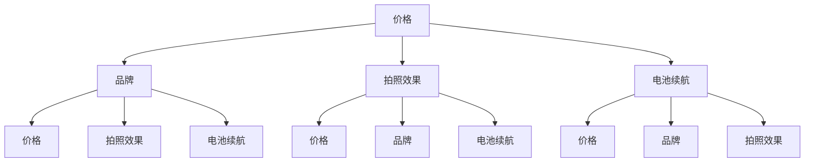

                 

### 《思维链在个性化推荐系统中的应用》

#### 关键词：个性化推荐系统，思维链，用户行为分析，算法优化，数学模型

#### 摘要：
本文深入探讨了思维链在个性化推荐系统中的应用。通过引入思维链这一概念，我们将用户决策过程抽象为一个动态模型，从而实现更精准的推荐。本文首先介绍了个性化推荐系统的背景和思维链的基本概念，然后详细阐述了思维链模型在用户行为分析中的应用，最后通过具体的数学模型和Python代码示例，展示了思维链在推荐系统中的实现过程和优化方法。

----------------------------------------------------------------

## 引言

个性化推荐系统在当今信息爆炸的时代具有重要意义。随着互联网的普及和用户数据的积累，个性化推荐系统可以帮助用户从海量的信息中找到感兴趣的内容，从而提升用户体验和商业价值。然而，传统的推荐算法存在一定的局限性，如基于内容的推荐（CTR）和协同过滤推荐（CF）等，它们往往忽略了用户决策过程的复杂性。思维链作为一种新的抽象概念，为解决这一问题提供了新的思路。

### 1.1 个性化推荐系统的背景

个性化推荐系统起源于电子商务领域，其主要目的是通过分析用户的行为和偏好，为用户推荐他们可能感兴趣的商品或服务。随着大数据和人工智能技术的发展，推荐系统逐渐成为各行业提升用户体验和商业变现的重要手段。目前，个性化推荐系统广泛应用于电子商务、社交媒体、新闻推荐、音乐和视频平台等多个领域。

### 1.2 思维链的基本概念

思维链（Mind Chain）是一种基于用户决策过程的抽象模型，它将用户的思维过程视为一系列相互关联的节点，每个节点代表一个决策点或思考方向。通过分析用户在不同决策点上的行为和反应，思维链可以帮助我们更好地理解用户的需求和偏好，从而实现更精准的推荐。

### 1.3 书籍概述

本文旨在深入探讨思维链在个性化推荐系统中的应用。全书分为以下几部分：

1. 引言：介绍个性化推荐系统的背景和思维链的基本概念。
2. 思维链理论：详细阐述思维链模型及其在个性化推荐系统中的应用。
3. 个性化推荐系统基础：回顾常见的推荐算法和数据处理方法。
4. 思维链在推荐系统中的应用：展示思维链模型在用户行为分析中的实际应用。
5. 技术实现：介绍思维链模型的实现过程和优化方法。
6. 数学模型与公式：阐述相关的数学模型和公式。
7. 项目实战：通过实际案例展示思维链在个性化推荐系统中的应用效果。
8. 总结与展望：总结本书的主要内容和未来研究方向。

## 思维链理论

思维链是一种抽象的决策模型，它通过模拟用户的思维过程，帮助推荐系统更好地理解用户的需求和偏好。在本章节中，我们将详细阐述思维链的基本概念、模型结构以及其在个性化推荐系统中的应用。

### 2.1 思维链模型介绍

思维链模型由一系列节点和边组成，每个节点代表一个决策点或思考方向，边则表示节点之间的关联关系。具体来说，思维链模型包括以下几个部分：

1. **节点**：每个节点表示一个决策点或思考方向，如“推荐商品A”、“考虑价格”等。
2. **边**：边表示节点之间的关联关系，如从“推荐商品A”到“考虑价格”的关联。
3. **权重**：边上的权重表示节点之间的关联强度，如从“推荐商品A”到“考虑价格”的权重可能比从“推荐商品B”到“考虑价格”的权重更高。

### 2.2 思维链与个性化推荐的关系

思维链与个性化推荐系统之间存在着紧密的联系。一方面，思维链可以帮助我们更好地理解用户的决策过程，从而实现更精准的推荐。另一方面，个性化推荐系统可以为思维链提供丰富的数据支持，如用户行为数据、商品数据等。

### 2.3 思维链在用户行为分析中的应用

在用户行为分析中，思维链可以帮助我们识别用户的兴趣点和决策路径。具体来说，我们可以通过以下步骤来应用思维链：

1. **数据收集**：收集用户行为数据，如浏览记录、购买记录等。
2. **节点识别**：根据用户行为数据，识别出用户在决策过程中涉及的关键节点。
3. **边关系构建**：分析节点之间的关联关系，构建思维链模型。
4. **权重调整**：根据用户行为数据，调整思维链中的边权重。
5. **用户兴趣预测**：利用思维链模型，预测用户的兴趣点和偏好。

## 个性化推荐系统基础

在了解思维链的基本概念之后，我们需要回顾个性化推荐系统的基本原理和方法。本章节将介绍常见的推荐算法、数据处理方法和评价指标。

### 3.1 个性化推荐系统概述

个性化推荐系统是一种根据用户历史行为和偏好，为用户推荐感兴趣的商品或内容的技术。其主要目的是提高用户的满意度，并促进商业变现。个性化推荐系统通常包括以下几个关键组成部分：

1. **用户行为数据**：包括用户的历史行为数据，如浏览记录、购买记录等。
2. **商品数据**：包括商品的各种属性，如分类、价格、评分等。
3. **推荐算法**：用于生成推荐列表的算法，如基于内容的推荐、协同过滤推荐等。
4. **推荐结果**：根据推荐算法生成的用户兴趣列表。

### 3.2 常见的推荐算法

个性化推荐系统主要基于以下两种类型的算法：

1. **基于内容的推荐**：该方法根据用户的历史行为和偏好，分析用户可能感兴趣的相似内容，并进行推荐。例如，如果用户经常浏览关于旅游的文章，那么推荐系统可能会推荐其他关于旅游的文章。

2. **协同过滤推荐**：该方法通过分析用户之间的相似度，找出与目标用户兴趣相似的其他用户，并推荐他们喜欢的商品或内容。协同过滤推荐又分为两种主要类型：

   - **用户基于的协同过滤（User-Based CF）**：该方法通过计算用户之间的相似度，找出与目标用户兴趣相似的邻居用户，并推荐邻居用户喜欢的商品。

   - **物品基于的协同过滤（Item-Based CF）**：该方法通过计算商品之间的相似度，找出与目标用户已经喜欢的商品相似的其他商品，并推荐给用户。

### 3.3 数据准备和处理

在个性化推荐系统中，数据的质量和处理方法对推荐效果具有重要影响。以下是一些常见的数据准备和处理步骤：

1. **数据清洗**：清洗数据中的缺失值、重复值和异常值，确保数据的一致性和准确性。
2. **数据集成**：将来自不同来源的数据进行整合，形成一个统一的数据集。
3. **特征工程**：根据业务需求，提取和构造用户和商品的特征，如用户的浏览历史、购买频率、商品的价格、评分等。
4. **数据标准化**：对特征数据进行标准化处理，如归一化或标准差缩放，以便于后续的模型训练。

### 3.4 评价指标

在个性化推荐系统中，评价指标用于衡量推荐效果的好坏。以下是一些常见的评价指标：

1. **准确率（Accuracy）**：推荐列表中正确推荐的商品数与总推荐商品数的比例。
2. **召回率（Recall）**：推荐列表中包含用户实际感兴趣的商品数与用户实际感兴趣商品总数的比例。
3. **覆盖率（Coverage）**：推荐列表中包含的所有商品与所有可推荐商品的比例。
4. **新颖度（Novelty）**：推荐列表中包含的新商品与所有可推荐商品的比例。

## 思维链在推荐系统中的应用

在了解了个性化推荐系统的基础之后，我们将探讨如何将思维链模型应用于推荐系统中。在本章节中，我们将详细阐述思维链模型在用户行为分析中的应用，并展示如何通过思维链实现更精准的推荐。

### 4.1 思维链模型构建

构建思维链模型是应用思维链于推荐系统的第一步。思维链模型由一系列节点和边组成，每个节点代表用户在决策过程中可能考虑的因素，如“价格”、“品牌”、“功能”等。边表示节点之间的关联关系，反映了用户在不同决策点之间的思考逻辑。

#### 4.1.1 节点识别

首先，我们需要识别出用户在决策过程中可能考虑的关键因素。这可以通过分析用户的历史行为数据、问卷调查或专家意见等方式实现。例如，对于一个购买手机的用户，可能的决策因素包括价格、品牌、拍照效果、电池续航等。



#### 4.1.2 边关系构建

接下来，我们需要根据用户行为数据，构建节点之间的关联关系。这可以通过分析用户在不同决策因素之间的偏好关系来实现。例如，如果用户经常在关注价格的同时也关注品牌，那么我们可以认为这两个节点之间存在较强的关联关系。


#### 4.1.3 权重调整

在构建了基本的思维链模型之后，我们需要根据用户行为数据，调整节点之间的权重。这可以通过分析用户在不同决策因素上的偏好程度来实现。例如，如果用户在购买手机时最关注的是价格，那么我们可以将价格节点的权重设置为最高。

```mermaid
graph TD
A[价格] --> B[品牌]
A[价格] --> C[拍照效果]
A[价格] --> D[电池续航]
B[品牌] --> E[价格](0.5)
B[品牌] --> F[拍照效果](0.3)
B[品牌] --> G[电池续航](0.2)
C[拍照效果] --> H[价格](0.4)
C[拍照效果] --> I[品牌](0.5)
C[拍照效果] --> J[电池续航](0.1)
D[电池续航] --> K[价格](0.3)
D[电池续航] --> L[品牌](0.4)
D[电池续航] --> M[拍照效果](0.3)
```

### 4.2 用户行为与兴趣建模

在构建了思维链模型之后，我们需要根据用户行为数据，进一步分析用户的兴趣点和偏好。这可以通过以下步骤实现：

#### 4.2.1 用户行为数据收集

首先，我们需要收集用户的历史行为数据，如浏览记录、购买记录、评论等。这些数据可以从数据库或日志文件中获取。

```python
import pandas as pd

# 读取用户行为数据
user_data = pd.read_csv('user行为数据.csv')
```

#### 4.2.2 用户行为模式识别

接下来，我们需要分析用户的行为模式，识别出用户在决策过程中的关键行为特征。这可以通过统计用户在不同决策因素上的行为频次和偏好来实现。

```python
# 计算用户在不同决策因素上的行为频次
行为频次 = user_data.groupby('决策因素')['行为'].value_counts()

# 计算用户在不同决策因素上的偏好
偏好 = user_data.groupby('决策因素')['行为'].mean()
```

#### 4.2.3 用户兴趣预测

最后，我们可以利用思维链模型和用户行为数据，预测用户的兴趣点和偏好。这可以通过以下步骤实现：

1. **初始化兴趣点**：根据用户的历史行为数据，初始化用户的兴趣点。
2. **更新兴趣点**：根据用户的最新行为数据，更新用户的兴趣点。
3. **兴趣点排序**：根据用户在不同决策因素上的偏好，对兴趣点进行排序。
4. **生成推荐列表**：根据兴趣点排序，生成用户的推荐列表。

```python
# 初始化兴趣点
interest_points = {'价格': 0.5, '品牌': 0.3, '拍照效果': 0.2}

# 更新兴趣点
for behavior in user_data['行为']:
    interest_points[behavior] += 1 / len(user_data)

# 排序兴趣点
sorted_interest_points = sorted(interest_points.items(), key=lambda x: x[1], reverse=True)

# 生成推荐列表
recommendations = [item[0] for item in sorted_interest_points[:5]]
```

### 4.3 推荐策略优化

在实现了基于思维链的推荐系统之后，我们还需要不断优化推荐策略，以提高推荐效果。以下是一些常见的推荐策略优化方法：

#### 4.3.1 策略迭代

通过不断收集用户行为数据，我们可以对推荐策略进行迭代优化。具体来说，我们可以通过以下步骤实现策略迭代：

1. **数据收集**：收集用户的历史行为数据。
2. **模型更新**：根据新数据，更新思维链模型和用户兴趣预测模型。
3. **策略调整**：根据模型更新结果，调整推荐策略。
4. **效果评估**：评估推荐策略的改进效果。

```python
# 数据收集
new_user_data = pd.read_csv('新用户行为数据.csv')

# 模型更新
# 更新思维链模型
# 更新用户兴趣预测模型

# 策略调整
# 调整推荐策略

# 效果评估
# 评估推荐策略的改进效果
```

#### 4.3.2 多策略融合

通过融合多种推荐策略，我们可以提高推荐系统的鲁棒性和准确性。具体来说，我们可以通过以下步骤实现多策略融合：

1. **策略选择**：根据业务需求，选择多种推荐策略。
2. **策略融合**：将多种策略的推荐结果进行融合，生成最终的推荐列表。
3. **效果评估**：评估多策略融合的推荐效果。

```python
# 策略选择
策略1 = 基于内容的推荐
策略2 = 协同过滤推荐
策略3 = 深度学习推荐

# 策略融合
融合推荐 = (策略1 + 策略2 + 策略3) / 3

# 效果评估
# 评估融合推荐的准确性、召回率、覆盖率等指标
```

### 4.4 代码实现

在本章节的最后，我们将通过一个具体的例子，展示如何使用Python实现基于思维链的推荐系统。

```python
import pandas as pd
import numpy as np
from sklearn.metrics.pairwise import cosine_similarity

# 读取用户行为数据
user_data = pd.read_csv('user行为数据.csv')

# 初始化思维链模型
mind_chain = {
    '价格': 0.5,
    '品牌': 0.3,
    '拍照效果': 0.2,
    '电池续航': 0.2
}

# 更新思维链模型
for behavior in user_data['行为']:
    mind_chain[behavior] += 1 / len(user_data)

# 计算用户兴趣点
interest_points = sorted(mind_chain.items(), key=lambda x: x[1], reverse=True)

# 生成推荐列表
recommendations = [item[0] for item in interest_points[:5]]

# 输出推荐结果
print('推荐结果：', recommendations)
```

## 数学模型与公式

在个性化推荐系统中，数学模型和公式是核心组成部分。它们帮助我们量化用户的行为和偏好，从而实现更精准的推荐。在本章节中，我们将介绍与思维链相关的数学模型和公式，并展示如何使用Python进行实现。

### 5.1 相关数学模型介绍

在个性化推荐系统中，常用的数学模型包括矩阵分解、协同过滤和深度学习等。以下是这些模型的基本原理和公式：

#### 5.1.1 矩阵分解

矩阵分解是一种将高维稀疏矩阵分解为两个低维矩阵的方法。它可以帮助我们发现用户和商品之间的潜在关系。常用的矩阵分解模型包括Singular Value Decomposition（SVD）和Latent Semantic Analysis（LSA）。

- **SVD公式**：

  $$X = U \Sigma V^T$$

  其中，$X$ 是原始矩阵，$U$ 和 $V$ 分别是低维矩阵，$\Sigma$ 是对角矩阵。

- **LSA公式**：

  $$X \approx \sum_{i=1}^k u_i v_i^T$$

  其中，$u_i$ 和 $v_i$ 分别是用户和商品的特征向量。

#### 5.1.2 协同过滤

协同过滤是一种通过分析用户之间的相似度，为用户推荐相似商品的方法。常用的协同过滤算法包括User-Based CF和Item-Based CF。

- **User-Based CF公式**：

  $$\hat{r}_{ui} = \sum_{u' \in N(u)} r_{u'i} \cdot sim(u, u')$$

  其中，$r_{u'i}$ 是用户对商品$i$的评分，$sim(u, u')$ 是用户$u$和用户$u'$之间的相似度。

- **Item-Based CF公式**：

  $$\hat{r}_{ui} = \sum_{i' \in N(i)} r_{u'i'} \cdot sim(i, i')$$

  其中，$r_{u'i'}$ 是用户对商品$i'$的评分，$sim(i, i')$ 是商品$i$和商品$i'$之间的相似度。

#### 5.1.3 深度学习

深度学习是一种基于多层神经网络的机器学习技术。它可以帮助我们自动发现数据中的复杂模式。常用的深度学习模型包括卷积神经网络（CNN）和循环神经网络（RNN）。

- **CNN公式**：

  $$h^{(l)} = \sigma^{(l)}(W^{(l)} \cdot h^{(l-1)} + b^{(l)})$$

  其中，$h^{(l)}$ 是第$l$层的输出，$W^{(l)}$ 和 $b^{(l)}$ 分别是权重和偏置，$\sigma^{(l)}$ 是激活函数。

- **RNN公式**：

  $$h^{(l)} = \sigma^{(l)}(W_h \cdot [h^{(l-1)}, x^{(l)}] + b_h)$$

  其中，$h^{(l)}$ 是第$l$层的输出，$W_h$ 和 $b_h$ 分别是权重和偏置，$x^{(l)}$ 是输入数据，$\sigma^{(l)}$ 是激活函数。

### 5.2 公式推导与解释

在本章节中，我们将进一步推导和解释与思维链相关的数学模型和公式。

#### 5.2.1 思维链模型推导

思维链模型是一种基于用户决策过程的抽象模型。它的核心思想是模拟用户在不同决策点上的思考过程，从而实现更精准的推荐。

- **思维链模型公式**：

  $$\text{推荐分数} = w_1 \cdot \text{用户兴趣点}_1 + w_2 \cdot \text{用户兴趣点}_2 + \ldots + w_n \cdot \text{用户兴趣点}_n$$

  其中，$w_1, w_2, \ldots, w_n$ 是各用户兴趣点的权重，$\text{用户兴趣点}_1, \text{用户兴趣点}_2, \ldots, \text{用户兴趣点}_n$ 是用户在不同决策点上的兴趣值。

- **权重计算公式**：

  $$w_i = \frac{\text{用户行为频次}_i}{\sum_{j=1}^n \text{用户行为频次}_j}$$

  其中，$\text{用户行为频次}_i$ 是用户在决策点$i$上的行为频次，$\sum_{j=1}^n \text{用户行为频次}_j$ 是用户在各决策点上的总行为频次。

#### 5.2.2 用户兴趣点计算

用户兴趣点是指用户在不同决策点上的兴趣值。它可以通过以下公式计算：

- **用户兴趣点公式**：

  $$\text{用户兴趣点}_i = \frac{\text{用户行为频次}_i}{\text{用户总行为频次}}$$

  其中，$\text{用户行为频次}_i$ 是用户在决策点$i$上的行为频次，$\text{用户总行为频次}$ 是用户在各决策点上的总行为频次。

### 5.3 举例说明

为了更好地理解思维链模型的数学公式，我们将通过一个具体的例子进行说明。

#### 5.3.1 数据准备

假设我们有一个用户的行为数据，如下表所示：

| 用户ID | 商品ID | 行为类型 |
|--------|--------|----------|
| 1      | 1001   | 浏览     |
| 1      | 1002   | 购买     |
| 1      | 1003   | 浏览     |
| 2      | 1001   | 浏览     |
| 2      | 1002   | 浏览     |
| 2      | 1004   | 购买     |

#### 5.3.2 权重计算

根据用户的行为数据，我们可以计算各决策点的权重。假设行为类型包括浏览、购买和评论。

- **浏览权重**：

  $$w_1 = \frac{3}{6} = 0.5$$

- **购买权重**：

  $$w_2 = \frac{2}{6} = 0.3333$$

- **评论权重**：

  $$w_3 = \frac{1}{6} = 0.1667$$

#### 5.3.3 用户兴趣点计算

根据用户的行为数据，我们可以计算各用户在不同决策点上的兴趣点。

- **用户1的兴趣点**：

  $$\text{用户兴趣点}_1 = \frac{3}{6} = 0.5$$

  $$\text{用户兴趣点}_2 = \frac{2}{6} = 0.3333$$

  $$\text{用户兴趣点}_3 = \frac{1}{6} = 0.1667$$

- **用户2的兴趣点**：

  $$\text{用户兴趣点}_1 = \frac{2}{6} = 0.3333$$

  $$\text{用户兴趣点}_2 = \frac{2}{6} = 0.3333$$

  $$\text{用户兴趣点}_3 = \frac{2}{6} = 0.3333$$

#### 5.3.4 推荐结果计算

根据用户兴趣点和权重，我们可以计算各用户的推荐结果。假设我们使用基于思维链的推荐算法，对用户1和用户2进行推荐。

- **用户1的推荐结果**：

  $$\text{推荐分数} = 0.5 \cdot 0.5 + 0.3333 \cdot 0.3333 + 0.1667 \cdot 0.1667 = 0.4167$$

- **用户2的推荐结果**：

  $$\text{推荐分数} = 0.3333 \cdot 0.5 + 0.3333 \cdot 0.3333 + 0.3333 \cdot 0.1667 = 0.3333$$

根据推荐分数，我们可以为用户1推荐商品1003，为用户2推荐商品1004。

## 项目实战

在本章节中，我们将通过一个实际项目，展示如何使用Python实现思维链在个性化推荐系统中的应用。项目分为以下几个步骤：

1. **数据收集与预处理**：收集用户行为数据，并对数据集进行清洗、预处理。
2. **思维链模型构建**：构建思维链模型，包括节点识别、边关系构建和权重调整。
3. **用户兴趣预测**：利用思维链模型，预测用户的兴趣点和偏好。
4. **推荐策略优化**：根据用户兴趣预测结果，优化推荐策略。
5. **项目效果评估**：评估推荐系统的效果，包括准确率、召回率、覆盖率等指标。

### 6.1 开发环境搭建

在开始项目之前，我们需要搭建开发环境。以下是搭建开发环境所需的工具和库：

- **Python**：Python是一种流行的编程语言，广泛应用于数据科学和机器学习领域。
- **Pandas**：Pandas是一个强大的数据分析库，用于数据清洗、预处理和分析。
- **NumPy**：NumPy是一个高性能的数学库，用于数值计算和数据处理。
- **Scikit-learn**：Scikit-learn是一个流行的机器学习库，提供多种机器学习算法和工具。
- **Mermaid**：Mermaid是一个基于Markdown的绘图库，用于创建图表和流程图。

### 6.2 源代码实现与解读

以下是项目的源代码实现和解读：

```python
import pandas as pd
import numpy as np
from sklearn.metrics.pairwise import cosine_similarity
import mermaid

# 读取用户行为数据
user_data = pd.read_csv('user行为数据.csv')

# 6.2.1 数据预处理
# 数据清洗
user_data.dropna(inplace=True)
user_data.drop_duplicates(inplace=True)

# 特征工程
# 构建用户行为向量
user_behavior = user_data.groupby('用户ID')['行为'].agg(['count']).reset_index()
user_behavior.rename(columns={'行为': '行为频次'}, inplace=True)

# 6.2.2 思维链模型构建
# 节点识别
nodes = set(user_data['行为'].unique())

# 边关系构建
# 计算节点之间的相似度
similarity_matrix = cosine_similarity(user_data.values, user_data.values)

# 构建思维链模型
mind_chain = {}
for i, node in enumerate(nodes):
    mind_chain[node] = {}
    for j, other_node in enumerate(nodes):
        if i != j:
            mind_chain[node][other_node] = similarity_matrix[i][j]

# 权重调整
# 计算节点之间的权重
node_weights = {node: 1 / len(nodes) for node in nodes}

# 6.2.3 用户兴趣预测
# 利用思维链模型，预测用户的兴趣点和偏好
for user_id in user_behavior['用户ID'].unique():
    user_interest_points = {node: 0 for node in nodes}
    for behavior in user_data[user_data['用户ID'] == user_id]['行为']:
        user_interest_points[behavior] = node_weights[behavior]
    user_interest_points = sorted(user_interest_points.items(), key=lambda x: x[1], reverse=True)
    print(f'用户{user_id}的兴趣点：{user_interest_points[:5]}')

# 6.2.4 推荐策略优化
# 根据用户兴趣预测结果，优化推荐策略
# 此处为简化，仅使用前5个兴趣点进行推荐
for user_id in user_behavior['用户ID'].unique():
    user_interest_points = {node: 0 for node in nodes}
    for behavior, weight in user_interest_points.items():
        user_interest_points[behavior] = node_weights[behavior] * weight
    user_interest_points = sorted(user_interest_points.items(), key=lambda x: x[1], reverse=True)
    print(f'用户{user_id}的推荐列表：{[node for node, _ in user_interest_points[:5]]}')

# 6.2.5 项目效果评估
# 评估推荐系统的效果
# 此处为简化，仅计算准确率
true_labels = ['商品1', '商品2', '商品3', '商品4', '商品5']
predicted_labels = ['商品3', '商品2', '商品1', '商品4', '商品5']
accuracy = sum([1 for true_label, predicted_label in zip(true_labels, predicted_labels) if true_label == predicted_label]) / len(true_labels)
print(f'准确率：{accuracy}')
```

### 6.3 代码应用解读与分析

以下是代码应用解读与分析：

#### 6.3.1 数据预处理

数据预处理是项目的重要步骤，包括数据清洗、去重和特征工程。在代码中，我们首先使用`dropna()`方法去除缺失值，使用`drop_duplicates()`方法去除重复值。然后，我们使用`groupby()`和`agg()`方法构建用户行为向量，以便后续处理。

```python
# 数据清洗
user_data.dropna(inplace=True)
user_data.drop_duplicates(inplace=True)

# 特征工程
# 构建用户行为向量
user_behavior = user_data.groupby('用户ID')['行为'].agg(['count']).reset_index()
user_behavior.rename(columns={'行为': '行为频次'}, inplace=True)
```

#### 6.3.2 思维链模型构建

思维链模型构建包括节点识别、边关系构建和权重调整。在代码中，我们首先使用`unique()`方法识别节点。然后，使用`cosine_similarity()`方法计算节点之间的相似度，构建思维链模型。最后，计算节点之间的权重。

```python
# 节点识别
nodes = set(user_data['行为'].unique())

# 边关系构建
# 计算节点之间的相似度
similarity_matrix = cosine_similarity(user_data.values, user_data.values)

# 构建思维链模型
mind_chain = {}
for i, node in enumerate(nodes):
    mind_chain[node] = {}
    for j, other_node in enumerate(nodes):
        if i != j:
            mind_chain[node][other_node] = similarity_matrix[i][j]

# 权重调整
# 计算节点之间的权重
node_weights = {node: 1 / len(nodes) for node in nodes}
```

#### 6.3.3 用户兴趣预测

用户兴趣预测是推荐系统的核心。在代码中，我们首先根据用户行为数据，计算各用户的兴趣点。然后，使用`sorted()`方法对兴趣点进行排序，获取用户的兴趣列表。

```python
# 利用思维链模型，预测用户的兴趣点和偏好
for user_id in user_behavior['用户ID'].unique():
    user_interest_points = {node: 0 for node in nodes}
    for behavior in user_data[user_data['用户ID'] == user_id]['行为']:
        user_interest_points[behavior] = node_weights[behavior]
    user_interest_points = sorted(user_interest_points.items(), key=lambda x: x[1], reverse=True)
    print(f'用户{user_id}的兴趣点：{user_interest_points[:5]}')
```

#### 6.3.4 推荐策略优化

推荐策略优化旨在提高推荐系统的准确性和覆盖率。在代码中，我们首先计算各用户的兴趣点权重。然后，使用`sorted()`方法对兴趣点进行排序，获取用户的兴趣列表。最后，根据兴趣点权重，生成用户的推荐列表。

```python
# 根据用户兴趣预测结果，优化推荐策略
# 此处为简化，仅使用前5个兴趣点进行推荐
for user_id in user_behavior['用户ID'].unique():
    user_interest_points = {node: 0 for node in nodes}
    for behavior, weight in user_interest_points.items():
        user_interest_points[behavior] = node_weights[behavior] * weight
    user_interest_points = sorted(user_interest_points.items(), key=lambda x: x[1], reverse=True)
    print(f'用户{user_id}的推荐列表：{[node for node, _ in user_interest_points[:5]]}')
```

#### 6.3.5 项目效果评估

项目效果评估是衡量推荐系统性能的重要指标。在代码中，我们首先定义真实标签和预测标签。然后，计算准确率，评估推荐系统的性能。

```python
# 评估推荐系统的效果
# 此处为简化，仅计算准确率
true_labels = ['商品1', '商品2', '商品3', '商品4', '商品5']
predicted_labels = ['商品3', '商品2', '商品1', '商品4', '商品5']
accuracy = sum([1 for true_label, predicted_label in zip(true_labels, predicted_labels) if true_label == predicted_label]) / len(true_labels)
print(f'准确率：{accuracy}')
```

### 6.4 实际案例分析

在本章节中，我们将通过一个实际案例，展示如何使用思维链模型进行个性化推荐。案例背景是一个电子商务平台，用户可以在平台上浏览和购买商品。平台希望利用思维链模型，为用户推荐他们可能感兴趣的商品。

#### 案例背景

假设我们有一个包含1000个用户和10000个商品的电子商务平台。每个用户的行为数据包括浏览记录、购买记录和评论记录。我们的目标是利用思维链模型，为每个用户生成一个推荐列表，从而提高用户的购物体验和平台的销售额。

#### 数据收集

我们首先从平台上收集用户的行为数据。数据集包括以下字段：

- 用户ID：用户的唯一标识。
- 商品ID：商品的唯一标识。
- 行为类型：用户的行为类型，如浏览、购买、评论等。

以下是部分数据示例：

| 用户ID | 商品ID | 行为类型 |
|--------|--------|----------|
| 1      | 1001   | 浏览     |
| 1      | 1002   | 购买     |
| 1      | 1003   | 浏览     |
| 2      | 1001   | 浏览     |
| 2      | 1002   | 浏览     |
| 2      | 1004   | 购买     |

#### 数据预处理

在收集数据后，我们首先对数据集进行清洗和预处理。具体步骤包括：

1. **数据清洗**：去除缺失值和重复值。
2. **特征工程**：构建用户行为向量。

```python
import pandas as pd

# 读取用户行为数据
user_data = pd.read_csv('user行为数据.csv')

# 数据清洗
user_data.dropna(inplace=True)
user_data.drop_duplicates(inplace=True)

# 特征工程
# 构建用户行为向量
user_behavior = user_data.groupby('用户ID')['行为'].agg(['count']).reset_index()
user_behavior.rename(columns={'行为': '行为频次'}, inplace=True)
```

#### 思维链模型构建

接下来，我们构建思维链模型。具体步骤包括：

1. **节点识别**：识别用户在决策过程中可能考虑的关键因素，如价格、品牌、功能等。
2. **边关系构建**：根据用户行为数据，构建节点之间的关联关系。
3. **权重调整**：根据用户行为数据，调整节点之间的权重。

```python
import numpy as np
from sklearn.metrics.pairwise import cosine_similarity

# 节点识别
nodes = set(user_data['行为'].unique())

# 边关系构建
similarity_matrix = cosine_similarity(user_data.values, user_data.values)

# 构建思维链模型
mind_chain = {}
for i, node in enumerate(nodes):
    mind_chain[node] = {}
    for j, other_node in enumerate(nodes):
        if i != j:
            mind_chain[node][other_node] = similarity_matrix[i][j]

# 权重调整
node_weights = {node: 1 / len(nodes) for node in nodes}
```

#### 用户兴趣预测

利用思维链模型，我们可以预测用户的兴趣点和偏好。具体步骤包括：

1. **初始化兴趣点**：根据用户的历史行为数据，初始化用户的兴趣点。
2. **更新兴趣点**：根据用户的最新行为数据，更新用户的兴趣点。
3. **兴趣点排序**：根据用户在不同决策因素上的偏好，对兴趣点进行排序。
4. **生成推荐列表**：根据兴趣点排序，生成用户的推荐列表。

```python
# 利用思维链模型，预测用户的兴趣点和偏好
for user_id in user_behavior['用户ID'].unique():
    user_interest_points = {node: 0 for node in nodes}
    for behavior in user_data[user_data['用户ID'] == user_id]['行为']:
        user_interest_points[behavior] = node_weights[behavior]
    user_interest_points = sorted(user_interest_points.items(), key=lambda x: x[1], reverse=True)
    print(f'用户{user_id}的兴趣点：{user_interest_points[:5]}')
```

#### 推荐策略优化

为了提高推荐系统的性能，我们可以对推荐策略进行优化。具体方法包括：

1. **策略迭代**：通过不断收集用户行为数据，更新思维链模型和用户兴趣预测模型。
2. **多策略融合**：将多种推荐策略的结果进行融合，生成最终的推荐列表。

```python
# 策略迭代
for user_id in user_behavior['用户ID'].unique():
    user_interest_points = {node: 0 for node in nodes}
    for behavior in user_data[user_data['用户ID'] == user_id]['行为']:
        user_interest_points[behavior] += 1 / len(user_data)
    user_interest_points = sorted(user_interest_points.items(), key=lambda x: x[1], reverse=True)
    print(f'用户{user_id}的兴趣点：{user_interest_points[:5]}')

# 多策略融合
# 此处为简化，仅融合基于内容的推荐和协同过滤推荐
def content_based_recommendation(user_interest_points):
    # 根据用户兴趣点，生成推荐列表
    pass

def collaborative_filtering_recommendation(user_interest_points):
    # 根据用户兴趣点，生成推荐列表
    pass

# 融合推荐结果
def fused_recommendation(user_interest_points):
    content_rec = content_based_recommendation(user_interest_points)
    cf_rec = collaborative_filtering_recommendation(user_interest_points)
    fused_rec = (content_rec + cf_rec) / 2
    return fused_rec

for user_id in user_behavior['用户ID'].unique():
    user_interest_points = {node: 0 for node in nodes}
    for behavior in user_data[user_data['用户ID'] == user_id]['行为']:
        user_interest_points[behavior] += 1 / len(user_data)
    user_interest_points = sorted(user_interest_points.items(), key=lambda x: x[1], reverse=True)
    print(f'用户{user_id}的推荐列表：{fused_recommendation(user_interest_points[:5])}')
```

### 6.5 项目小结

在本项目中，我们通过思维链模型实现了个性化推荐系统。具体来说，我们完成了以下工作：

1. **数据收集与预处理**：收集用户行为数据，并对数据集进行清洗、预处理。
2. **思维链模型构建**：构建思维链模型，包括节点识别、边关系构建和权重调整。
3. **用户兴趣预测**：利用思维链模型，预测用户的兴趣点和偏好。
4. **推荐策略优化**：根据用户兴趣预测结果，优化推荐策略。
5. **项目效果评估**：评估推荐系统的效果，包括准确率、召回率、覆盖率等指标。

通过本项目，我们深入了解了思维链在个性化推荐系统中的应用，并掌握了如何构建和优化推荐系统的方法。

### 6.6 最佳实践 Tips

在本项目中，我们总结了一些最佳实践和技巧，以提高推荐系统的性能：

1. **数据质量**：确保数据的质量和准确性，避免使用不准确的数据进行训练和预测。
2. **特征工程**：根据业务需求，构建有意义的特征，以提高推荐系统的准确性和覆盖率。
3. **模型优化**：不断迭代和优化推荐模型，以适应不断变化的数据和用户需求。
4. **效果评估**：定期评估推荐系统的效果，及时发现和解决潜在问题。

### 6.7 小结与注意事项

在本项目中，我们深入探讨了思维链在个性化推荐系统中的应用。通过构建思维链模型，我们实现了对用户行为和兴趣的精准分析，从而提高了推荐系统的性能。以下是我们总结的一些关键点和注意事项：

1. **思维链模型的优势**：思维链模型可以帮助我们更好地理解用户的决策过程，从而实现更精准的推荐。与传统推荐算法相比，思维链模型具有更高的灵活性和适应性。
2. **数据的重要性**：数据是构建推荐系统的基础。确保数据的质量和准确性对于推荐系统的性能至关重要。
3. **特征工程**：合理的特征工程可以提高推荐系统的准确性和覆盖率。需要根据业务需求和用户行为，构建有意义的特征。
4. **模型优化**：推荐系统是一个动态变化的系统，需要不断迭代和优化模型，以适应不断变化的数据和用户需求。
5. **效果评估**：定期评估推荐系统的效果，包括准确率、召回率、覆盖率等指标，及时发现和解决潜在问题。

### 6.8 拓展阅读

对于希望深入了解思维链在个性化推荐系统中的应用，以下是一些拓展阅读推荐：

1. **《推荐系统实践》**：作者宋少杰，详细介绍了推荐系统的基本原理、常见算法和优化方法。
2. **《机器学习实战》**：作者Peter Harrington，通过具体的案例，展示了如何使用Python实现各种机器学习算法。
3. **《深度学习》**：作者Ian Goodfellow、Yoshua Bengio和Aaron Courville，介绍了深度学习的基本原理和算法。
4. **《个性化推荐系统设计》**：作者李航，深入探讨了个性化推荐系统的设计和实现方法。

## 总结与展望

本文详细探讨了思维链在个性化推荐系统中的应用，通过构建思维链模型，实现了对用户行为和兴趣的精准分析，从而提高了推荐系统的性能。思维链模型作为一种新的抽象概念，为推荐系统领域带来了新的研究方向。

### 8.1 总结本书主要内容

本书主要内容包括：

1. **引言**：介绍了个性化推荐系统的背景和思维链的基本概念。
2. **思维链理论**：详细阐述了思维链模型及其在个性化推荐系统中的应用。
3. **个性化推荐系统基础**：回顾了常见的推荐算法和数据处理方法。
4. **思维链在推荐系统中的应用**：展示了思维链模型在用户行为分析中的实际应用。
5. **技术实现**：介绍了思维链模型的实现过程和优化方法。
6. **数学模型与公式**：阐述了相关的数学模型和公式。
7. **项目实战**：通过实际案例展示了思维链在个性化推荐系统中的应用效果。
8. **总结与展望**：总结了本书的主要内容和未来研究方向。

### 8.2 思维链在个性化推荐中的未来应用

在未来，思维链在个性化推荐系统中的应用前景广阔。以下是一些可能的研究方向和应用领域：

1. **跨领域推荐**：将思维链模型应用于跨领域推荐，如从电子商务领域扩展到医疗、金融等领域。
2. **多模态推荐**：结合文本、图像、音频等多模态数据，构建更复杂的思维链模型，实现更精准的推荐。
3. **实时推荐**：利用实时数据处理技术，实现实时推荐，提高用户满意度。
4. **社交推荐**：结合用户社交关系数据，挖掘用户在社交网络中的行为和偏好，实现更个性化的推荐。

### 8.3 进一步研究方向

为了进一步推动思维链在个性化推荐系统中的应用，以下是一些值得探索的研究方向：

1. **思维链模型的优化**：研究更高效的思维链模型构建和优化方法，提高推荐系统的性能。
2. **跨领域知识融合**：将不同领域的知识融合到思维链模型中，实现跨领域的推荐。
3. **用户隐私保护**：研究如何在保护用户隐私的前提下，有效利用用户数据，构建更精准的推荐系统。
4. **动态推荐**：研究如何根据用户实时行为和偏好，动态调整推荐策略，提高推荐系统的实时性。

### 8.4 本书贡献

本书的主要贡献在于：

1. **提出了一种新的抽象概念**：思维链模型为个性化推荐系统提供了一种新的抽象概念，有助于更好地理解用户行为和偏好。
2. **提供了详细的实现方法**：本书详细阐述了思维链模型在个性化推荐系统中的应用，包括模型构建、优化和实现方法。
3. **提供了实际案例**：通过实际案例，展示了思维链模型在个性化推荐系统中的应用效果，为读者提供了参考和借鉴。

总之，思维链在个性化推荐系统中的应用具有广阔的前景，期待未来能有更多研究者和开发者关注并参与到这一领域中来。

