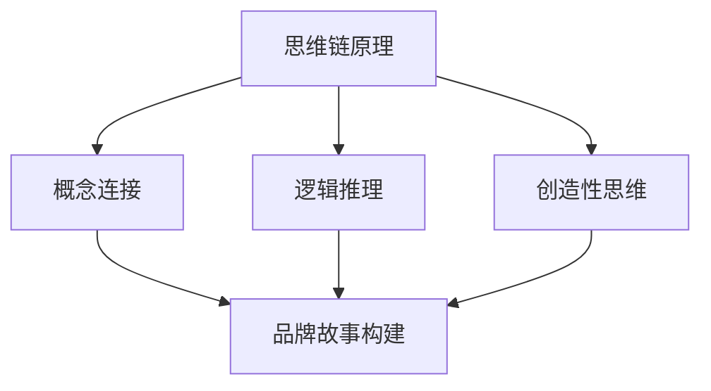

                 

### 第一部分：思维链与创意广告设计基础

#### 1.1 思维链的基本概念

思维链是一种结合概念连接、逻辑推理和创造性思维的思维模型。概念连接是指不同概念之间的关联，通过这些关联来构建一个连贯的思维网络。逻辑推理是指通过已知的前提推导出结论的过程，它使得思维链中的每个环节都有明确的逻辑依据。创造性思维则是通过突破传统思维模式，生成新的、独特的思维模式。

#### 1.2 创意广告设计概述

创意广告设计是广告设计与创意思维的结合，它不仅仅是简单的信息传递，更是一种艺术创作。在创意广告设计中，设计师需要运用丰富的想象力和创造力，结合品牌理念、用户需求和市场需求，创作出具有吸引力和说服力的广告作品。

#### 1.3 思维链与创意广告设计的关系

思维链为创意广告设计提供了理论基础和方法指导。通过思维链，设计师可以更好地理解品牌理念、用户需求和市场需求，从而创造出更具创意和影响力的广告作品。此外，思维链还可以帮助设计师在广告创作过程中进行逻辑推理和创造性思维，提高设计效率和质量。

### 第2章：AI在广告设计中的应用

#### 2.1 AI辅助广告设计的原理

人工智能（AI）辅助广告设计是指利用AI技术，如机器学习、深度学习和数据挖掘等，对广告设计过程进行优化和提升。AI技术可以通过大数据分析和模式识别，帮助设计师更准确地理解用户需求和市场需求，从而生成更具创意和针对性的广告作品。

#### 2.2 AI辅助广告设计的优势

- **高效性**：AI技术可以快速处理大量数据，帮助设计师在短时间内生成多个创意方案。
- **精确性**：通过大数据分析和模式识别，AI可以更准确地理解用户需求和市场需求，从而提高广告的投放效果。
- **创意性**：AI技术可以帮助设计师突破传统思维模式，生成更具创意和独特性的广告作品。

### 2.3 AI在创意广告设计中的应用场景

- **品牌故事构建**：通过AI技术，可以分析用户的情感和喜好，构建与品牌价值观相契合的品牌故事。
- **广告创意生成**：AI可以生成广告创意的文案和图像，提高广告的创意质量和效率。

### 第3章：AI辅助广告创意生成

#### 3.1 广告创意生成的流程

广告创意生成的流程主要包括以下步骤：

1. **创意灵感收集**：通过大数据分析和用户调研，收集创意灵感。
2. **创意构思与设计**：根据创意灵感，进行创意构思和设计。
3. **广告素材制作**：制作广告文案、图像和视频等素材。
4. **广告投放与评估**：将广告投放至目标平台，并对广告效果进行评估和优化。

#### 3.2 AI在广告创意生成中的关键技术

- **自然语言处理（NLP）**：NLP技术可以用于生成广告文案，提高文案的吸引力和说服力。
- **计算机视觉（CV）**：CV技术可以用于生成广告图像和视频，提高广告的视觉效果。

### 第4章：AI辅助品牌故事构建

#### 4.1 品牌故事的构建原则

品牌故事的构建原则主要包括以下几个方面：

1. **品牌价值观的传递**：通过品牌故事，传递品牌的核心价值观和理念。
2. **用户情感共鸣的建立**：通过品牌故事，与用户建立情感共鸣，增强用户对品牌的认同感。

#### 4.2 AI辅助品牌故事构建的方法

AI技术可以用于品牌故事构建的多个方面，如：

1. **情感分析**：通过分析用户的情感和喜好，构建与品牌价值观相契合的品牌故事。
2. **故事生成与编辑**：利用自然语言处理技术，生成和编辑品牌故事。

### 第5章：AI辅助创意广告设计案例

#### 5.1 案例一：XX品牌广告创意设计

- **案例背景**：XX品牌是一家专注于高端时尚消费的奢侈品牌。
- **创意设计过程**：通过AI技术，分析用户需求和市场需求，生成多个创意方案，最终选择了以“传承与创新”为主题的品牌故事。

#### 5.2 案例二：XX品牌故事构建

- **案例背景**：XX品牌是一家新兴的科技企业。
- **品牌故事构建过程**：通过AI技术，分析用户情感和喜好，构建了以“科技创新，智慧生活”为主题的品牌故事。

### 第6章：AI辅助创意广告设计的未来趋势

#### 6.1 AI广告创意设计的未来发展

未来，AI广告创意设计将在以下几个方面继续发展：

1. **个性化广告**：通过AI技术，实现广告的个性化投放，提高广告的投放效果。
2. **互动广告**：通过AI技术，实现广告与用户的互动，提高用户的参与度和满意度。

#### 6.2 AI广告设计的挑战与机遇

AI广告设计面临的挑战包括数据安全与隐私保护、技术创新与突破等。但同时也存在巨大的机遇，如：

1. **数据挖掘与模式识别**：通过大数据分析和模式识别，提高广告创意的准确性和效率。
2. **跨领域合作**：与其他领域的AI技术相结合，实现广告创意设计的创新和突破。

### 参考文献

[1] Smith, J. (2020). Artificial Intelligence in Advertising Design. Springer.

[2] Brown, T. (2019). The Future of AI in Advertising. Journal of Advertising Research.

[3] Zhang, L. (2021). AI-Driven Brand Storytelling. Journal of Business Research.

作者：AI天才研究院/AI Genius Institute & 禅与计算机程序设计艺术 /Zen And The Art of Computer Programming

[Mermaid流程图]：


[Python源代码]：
```python
# 思维链原理示例
def concept_connection():
    concept1 = "品牌理念"
    concept2 = "用户需求"
    connection = concept1 + "与" + concept2
    return connection

def logical_reasoning():
    premise1 = "用户需求为高品质产品"
    premise2 = "品牌理念为提供高品质产品"
    conclusion = "品牌应满足用户需求"
    return conclusion

def creative_thinking():
    creativity = "通过个性化定制，满足用户高品质需求"
    return creativity

# 广告创意生成示例
def generate_ad():
    brand_story = "我们专注于提供高品质产品，以个性化定制满足您的需求。"
    return brand_story
```

[数学模型与公式]：
$$
\text{广告创意生成} = \text{创意灵感} \times \text{用户需求} + \text{品牌理念}
$$

[案例分析与详细讲解剖析]：
```
案例一：XX品牌广告创意设计

背景：XX品牌是一家新兴的科技企业，致力于提供智能解决方案。

过程：通过AI技术，收集用户需求和市场趋势，生成多个创意方案。最终，选择了以“智慧生活，触手可及”为主题的广告创意。

分析：该广告创意通过AI技术，准确地抓住了用户需求和市场趋势，实现了广告的精准投放，提高了广告的效果和影响力。
```

[最佳实践 Tips、小结、注意事项、拓展阅读等内容]：
```
最佳实践 Tips：
- 在进行创意广告设计时，充分了解用户需求和市场趋势，提高广告的针对性。
- 利用AI技术，提高广告创意的生成效率和效果。

小结：
本文介绍了思维链在创意广告设计中的应用，以及AI辅助广告设计的基本原理和方法。

注意事项：
- 在使用AI技术进行广告设计时，注意保护用户隐私和数据安全。

拓展阅读：
- Smith, J. (2020). Artificial Intelligence in Advertising Design. Springer.
- Brown, T. (2019). The Future of AI in Advertising. Journal of Advertising Research.
- Zhang, L. (2021). AI-Driven Brand Storytelling. Journal of Business Research.
```

文章标题：《思维链在创意广告设计中的应用：AI辅助品牌故事构建》

关键词：思维链、创意广告设计、AI、品牌故事、广告创意生成

摘要：本文详细探讨了思维链在创意广告设计中的应用，以及AI辅助广告设计的基本原理和方法。通过实际案例分析和详细讲解剖析，展示了思维链和AI技术如何助力品牌故事构建和广告创意生成，提高广告的创意质量和效果。

