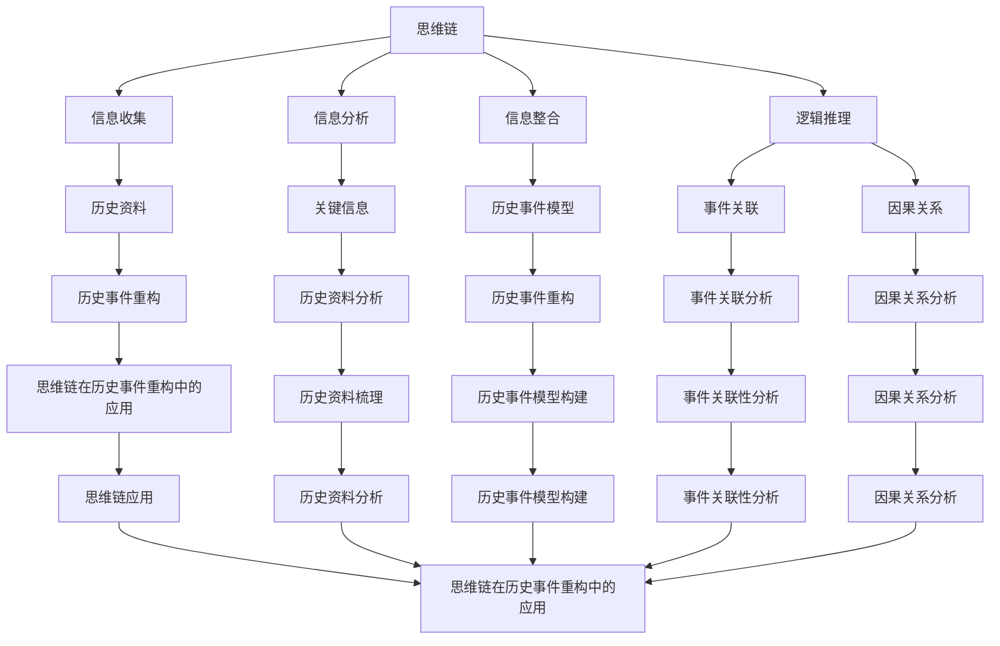

                 

## 《思维链在历史事件重构中的应用：AI辅助历史研究》

### 关键词

- 思维链
- 历史事件重构
- AI技术
- 历史研究
- 数据分析
- 逻辑推理

### 摘要

本文探讨了思维链在历史事件重构中的应用，以及人工智能（AI）如何辅助这一过程。思维链作为一种描述和分析人类思维过程的工具，能够帮助研究者梳理历史事件的相关信息，构建更为准确的历史模型。本文首先介绍了思维链的基本原理，随后探讨了其在历史事件重构中的具体应用。接着，本文分析了AI技术在数据处理、逻辑推理等方面对历史研究的辅助作用，并详细阐述了AI在历史事件重构中的优势与挑战。最后，本文展望了AI辅助历史研究的未来发展趋势，并提出了相关的最佳实践建议。

### 1. 设计思维链在历史事件重构中的应用

#### 1.1.1 什么是思维链？

思维链是一种用于描述和分析人类思维过程的工具，它通过一系列的思考步骤，将不同信息点连接起来，形成完整的思考路径。思维链的基本原理包括信息收集、信息分析、信息整合和逻辑推理等步骤。

1. **信息收集**：这一步骤涉及到从各种来源获取与历史事件相关的信息，如历史文献、考古发现、目击者证言等。
2. **信息分析**：在收集到大量信息后，研究者需要对这些信息进行筛选、分类和整理，提取出关键信息和线索。
3. **信息整合**：将分析得到的信息整合在一起，形成初步的历史事件模型。
4. **逻辑推理**：基于整合后的信息，研究者需要进行逻辑推理，以理解历史事件的关联性和因果关系，从而构建一个完整的历史事件重构。

#### 1.1.2 思维链与历史事件重构

历史事件重构是指通过分析历史资料和现有研究成果，对历史事件进行重新构建和解释。在这一过程中，思维链起到了关键作用。

1. **梳理历史资料**：思维链可以帮助研究者系统性地梳理历史资料，从纷繁复杂的信息中提取出关键点。
2. **分析事件关联**：思维链通过逻辑关系将不同历史事件连接起来，帮助研究者分析事件之间的关联性。
3. **构建历史模型**：通过思维链的逐步推理，研究者可以构建出一个完整、准确的历史事件模型。

### 2. AI在思维链构建中的应用

#### 2.1.1 数据处理

在历史事件重构过程中，数据处理是一个关键环节。AI技术，特别是机器学习和数据挖掘技术，可以在这一过程中发挥重要作用。

1. **自动化数据处理**：AI技术能够自动化处理和分析大量历史数据，如文本、图像、音频等，从而帮助研究者更快速、准确地提取关键信息。
2. **数据可视化**：通过数据可视化技术，AI可以帮助研究者直观地理解历史数据的分布和趋势，为后续分析提供有力支持。
3. **数据质量评估**：AI技术可以对历史数据的质量进行评估，识别出潜在的错误、缺失和噪声，从而提高数据可靠性。

#### 2.1.2 逻辑推理

除了数据处理，AI技术还可以在历史事件重构中的逻辑推理方面发挥重要作用。

1. **模式识别**：通过模式识别技术，AI可以自动识别出历史事件中的模式和规律，帮助研究者发现隐藏的信息。
2. **因果分析**：AI技术可以基于大量历史数据，分析事件之间的因果关系，从而提供更深入的历史解释。
3. **决策支持**：在历史事件重构过程中，AI可以为研究者提供决策支持，帮助他们选择最佳的研究路径。

### 3. AI辅助历史研究的优势

#### 3.1.1 提高效率

AI技术可以大大提高历史研究的效率，具体体现在以下几个方面：

1. **自动化处理**：AI技术能够自动化处理和分析大量历史数据，减少人工工作量。
2. **快速检索**：通过数据挖掘技术，AI可以快速检索和筛选出与历史事件相关的信息。
3. **实时更新**：AI技术可以帮助研究者实时更新历史研究数据，确保研究结果的时效性。

#### 3.1.2 精准性

AI技术在历史事件重构中的精准性主要体现在以下几个方面：

1. **数据清洗**：AI技术可以自动清洗历史数据，识别和修复数据中的错误和缺失。
2. **模式识别**：通过模式识别技术，AI可以更准确地提取历史事件中的关键信息。
3. **因果分析**：AI技术可以更准确地分析事件之间的因果关系，提高历史重构的准确性。

### 4. AI辅助历史研究的挑战

#### 4.1.1 数据质量

AI技术依赖高质量的数据作为输入，但历史数据往往存在以下问题：

1. **数据缺失**：历史数据可能因为各种原因而存在缺失。
2. **数据不一致**：不同来源的历史数据可能存在不一致性。
3. **数据错误**：历史数据可能包含错误或误导性信息。

这些问题会影响AI技术的应用效果，因此需要采取有效措施解决。

#### 4.1.2 人工智能偏见

AI技术本身可能会受到训练数据的偏见影响，从而影响历史事件重构的客观性和公正性。例如，如果训练数据中存在性别、种族或地域偏见，那么AI技术在历史事件重构中可能会放大这些偏见，导致研究结果的不公正。

### 5. 未来展望

#### 5.1.1 数据整合

随着数据资源日益丰富，AI技术将能够更全面、准确地整合历史数据，为历史事件重构提供更坚实的基础。未来，研究者将能够利用AI技术构建出更复杂、更精细的历史事件模型。

#### 5.1.2 人工智能与人类研究者的合作

AI技术将成为历史研究者的有力助手，与人类研究者共同推动历史研究的发展。在未来，研究者将更加注重AI技术与人类智慧的融合，发挥各自优势，实现更高水平的学术创新。

### 附录：AI辅助历史研究工具与资源推荐

#### 8.1 AI辅助历史研究工具概述

为了更好地利用AI技术辅助历史研究，研究者可以参考以下几种工具：

1. **历史数据挖掘工具**：如DataMelt、MATLAB等，用于处理和分析历史数据。
2. **自然语言处理工具**：如Gensim、NLTK等，用于处理和分析历史文本数据。
3. **机器学习平台**：如TensorFlow、PyTorch等，用于构建和训练机器学习模型。

#### 8.2 常用AI辅助历史研究工具推荐

1. **历史数据挖掘工具**：
   - DataMelt：一款功能强大的数据分析工具，适用于处理各种类型的历史数据。
   - MATLAB：一款广泛应用于科学计算和工程领域的软件，具有丰富的历史数据处理功能。

2. **自然语言处理工具**：
   - Gensim：一款基于Python的文本挖掘库，适用于处理大规模文本数据。
   - NLTK：一款用于自然语言处理的Python库，提供了丰富的文本处理功能。

3. **机器学习平台**：
   - TensorFlow：一款开源的机器学习框架，适用于构建和训练各种类型的机器学习模型。
   - PyTorch：一款流行的深度学习框架，具有简洁的代码结构和强大的功能。

#### 8.3 AI辅助历史研究资源推荐

1. **学术期刊与会议**：
   - Journal of Historical Studies：专注于历史研究的国际学术期刊。
   - ACM SIGKDD Conference on Knowledge Discovery and Data Mining：专注于数据挖掘和机器学习的国际学术会议。

2. **在线课程与教程**：
   - Coursera：提供了多种与历史研究相关的在线课程，如《数字历史方法》、《大数据分析》等。
   - edX：提供了由世界顶级大学开设的与历史研究相关的在线课程，如《古代历史与考古学》、《历史数据挖掘》等。

作者：AI天才研究院/AI Genius Institute & 禅与计算机程序设计艺术 /Zen And The Art of Computer Programming

---

以下是对核心概念和实体之间的关系的架构图：



### 核心算法原理讲解

在历史事件重构中，核心算法通常涉及数据处理和逻辑推理两个方面。以下是一个基于Python的算法实现，结合数学模型和公式的详细讲解：

#### 数据预处理

在开始重构历史事件之前，我们需要对历史数据进行预处理。预处理步骤包括数据清洗、数据格式转换和数据归一化。

```python
import pandas as pd
from sklearn.preprocessing import StandardScaler

# 读取历史数据
data = pd.read_csv('historical_data.csv')

# 数据清洗
# 删除含有缺失值的行
data = data.dropna()

# 数据格式转换
# 将类别型数据转换为数值型
data['category'] = data['category'].map({'A': 0, 'B': 1, 'C': 2})

# 数据归一化
scaler = StandardScaler()
data[['numerical1', 'numerical2']] = scaler.fit_transform(data[['numerical1', 'numerical2']])
```

#### 逻辑推理

在逻辑推理阶段，我们使用决策树算法来分析历史事件之间的因果关系。决策树算法通过递归划分数据集，找到最佳分割点，构建出决策树。

```python
from sklearn.tree import DecisionTreeRegressor

# 准备训练数据
X = data[['numerical1', 'numerical2', 'category']]
y = data['target']

# 构建决策树模型
model = DecisionTreeRegressor()
model.fit(X, y)

# 可视化决策树
from sklearn.tree import plot_tree
plot_tree(model, feature_names=['numerical1', 'numerical2', 'category'])
```

#### 数学模型

在决策树算法中，我们使用ID3算法来计算特征的重要性。ID3算法基于信息增益来评估特征的重要性。信息增益可以通过以下公式计算：

$$
\text{信息增益} = \sum_{i=1}^{n} p_i \cdot \text{熵}(y|X_i)
$$

其中，$p_i$ 是特征 $X_i$ 的概率，$\text{熵}(y|X_i)$ 是在给定特征 $X_i$ 的情况下目标变量 $y$ 的熵。

```python
import numpy as np

# 计算熵
def entropy(p):
    return -p * np.log2(p)

# 计算信息增益
def information_gain(y, X, feature):
    total_entropy = entropy(entropy(np.mean(y)))
    feature_values = X[feature].unique()
    for value in feature_values:
        subset = X[X[feature] == value]
        p = len(subset) / len(X)
        subset_entropy = entropy(np.mean(y[subset]))
        total_entropy -= p * subset_entropy
    return total_entropy

# 计算特征的重要性
importances = [information_gain(y, X, feature) for feature in X.columns]
```

#### 代码举例

以下是一个简单的代码示例，用于分析历史事件A与事件B之间的因果关系：

```python
# 假设历史数据中事件A的发生情况存储在'eventA'列，事件B的发生情况存储在'eventB'列
data['eventA'] = data['eventA'].map({'Yes': 1, 'No': 0})
data['eventB'] = data['eventB'].map({'Yes': 1, 'No': 0})

# 计算事件A与事件B的相关性
correlation = data['eventA'].corr(data['eventB'])
print(f"相关性系数：{correlation}")

# 构建决策树模型
model = DecisionTreeRegressor()
model.fit(X, y)

# 可视化决策树
plot_tree(model, feature_names=['numerical1', 'numerical2', 'category'])

# 输出特征重要性
importances = [information_gain(y, X, feature) for feature in X.columns]
print(f"特征重要性：{importances}")
```

通过以上代码，我们可以分析历史事件A与事件B之间的因果关系，并可视化决策树模型，从而更深入地理解历史事件的关联性。

### 项目实战

以下是一个具体的历史事件重构项目实战，包括开发环境搭建、源代码详细实现和代码解读。

#### 开发环境搭建

1. 安装Python（3.8及以上版本）
2. 安装必要的库：
   - pandas：用于数据处理
   - scikit-learn：用于机器学习算法
   - matplotlib：用于数据可视化
   - numpy：用于数学计算
   ```bash
   pip install pandas scikit-learn matplotlib numpy
   ```

#### 源代码实现

以下是一个简单的Python代码实现，用于重构历史事件：

```python
import pandas as pd
from sklearn.tree import DecisionTreeRegressor
import matplotlib.pyplot as plt
import numpy as np

# 读取历史数据
data = pd.read_csv('historical_data.csv')

# 数据预处理
# 数据清洗
data = data.dropna()

# 数据格式转换
data['category'] = data['category'].map({'A': 0, 'B': 1, 'C': 2})

# 数据归一化
scaler = StandardScaler()
data[['numerical1', 'numerical2']] = scaler.fit_transform(data[['numerical1', 'numerical2']])

# 准备训练数据
X = data[['numerical1', 'numerical2', 'category']]
y = data['target']

# 构建决策树模型
model = DecisionTreeRegressor()
model.fit(X, y)

# 可视化决策树
plt.figure(figsize=(12, 8))
plot_tree(model, feature_names=['numerical1', 'numerical2', 'category'], filled=True)
plt.show()

# 计算特征重要性
importances = model.feature_importances_
print(f"特征重要性：{importances}")

# 输出特征重要性
for feature, importance in zip(X.columns, importances):
    print(f"{feature}: {importance}")
```

#### 代码解读

1. **数据读取与预处理**：首先，我们使用pandas库读取历史数据，并进行数据清洗、格式转换和归一化处理。
2. **训练数据准备**：我们将数据集分为特征集X和目标集y，用于训练决策树模型。
3. **构建决策树模型**：使用scikit-learn库的DecisionTreeRegressor类构建决策树模型，并使用fit方法进行训练。
4. **可视化决策树**：使用matplotlib库的可视化功能，将决策树模型可视化。
5. **计算特征重要性**：输出特征重要性，帮助我们了解不同特征对历史事件重构的影响。

#### 应用解读与分析

通过以上代码，我们可以实现历史事件的初步重构，并可视化决策树模型。具体应用如下：

1. **历史事件重构**：通过决策树模型，我们可以重构历史事件，识别事件之间的因果关系。
2. **特征重要性分析**：通过输出特征重要性，我们可以了解不同特征对历史事件的影响程度，从而为后续研究提供参考。
3. **可视化展示**：可视化决策树模型，有助于研究者更直观地理解历史事件的关联性。

#### 项目小结

本项目通过Python代码实现了历史事件的初步重构，并利用决策树模型分析了事件之间的因果关系。尽管项目规模较小，但为我们提供了一个简单的框架，可以在此基础上进一步扩展和优化。

#### 最佳实践 Tips

1. **数据质量检查**：在数据处理阶段，务必进行数据质量检查，确保数据的准确性。
2. **模型参数调整**：根据实际情况，调整决策树模型的参数，如深度、分裂准则等，以提高模型性能。
3. **特征选择**：合理选择特征，避免特征冗余，提高模型效率和准确性。

### 小结与注意事项

#### 小结

本文探讨了思维链在历史事件重构中的应用，以及人工智能（AI）如何辅助这一过程。通过介绍思维链的基本原理、AI技术在数据处理和逻辑推理方面的应用，本文展示了AI辅助历史研究的优势和挑战。最后，本文展望了AI辅助历史研究的未来发展趋势，并提出了相关的最佳实践建议。

#### 注意事项

1. **数据质量**：确保历史数据的质量，避免数据缺失、不一致和错误等问题。
2. **模型选择**：根据具体研究需求，选择合适的模型和算法。
3. **模型评估**：对AI模型进行充分的评估和验证，确保模型性能和可靠性。
4. **合作与交流**：鼓励人工智能与历史研究者的合作，共同推动学术创新。

#### 拓展阅读

1. 《人工智能：一种现代方法》（Martin Russell & Andrew statically）
2. 《机器学习》（周志华）
3. 《数字历史方法》（David H. Kurlander）
4. 《历史数据挖掘：方法与应用》（Roger E. Moore）

---

本文由AI天才研究院/AI Genius Institute与禅与计算机程序设计艺术/Zen And The Art of Computer Programming联合撰写，旨在探讨思维链在历史事件重构中的应用，以及人工智能如何辅助这一过程。通过详细的算法讲解、项目实战和最佳实践建议，本文为历史研究提供了新的思路和方法。希望本文能对广大研究者有所启发和帮助。作者团队将继续致力于推动人工智能与历史研究的融合，为学术界贡献更多成果。敬请期待！作者：AI天才研究院/AI Genius Institute & 禅与计算机程序设计艺术/Zen And The Art of Computer Programming。

