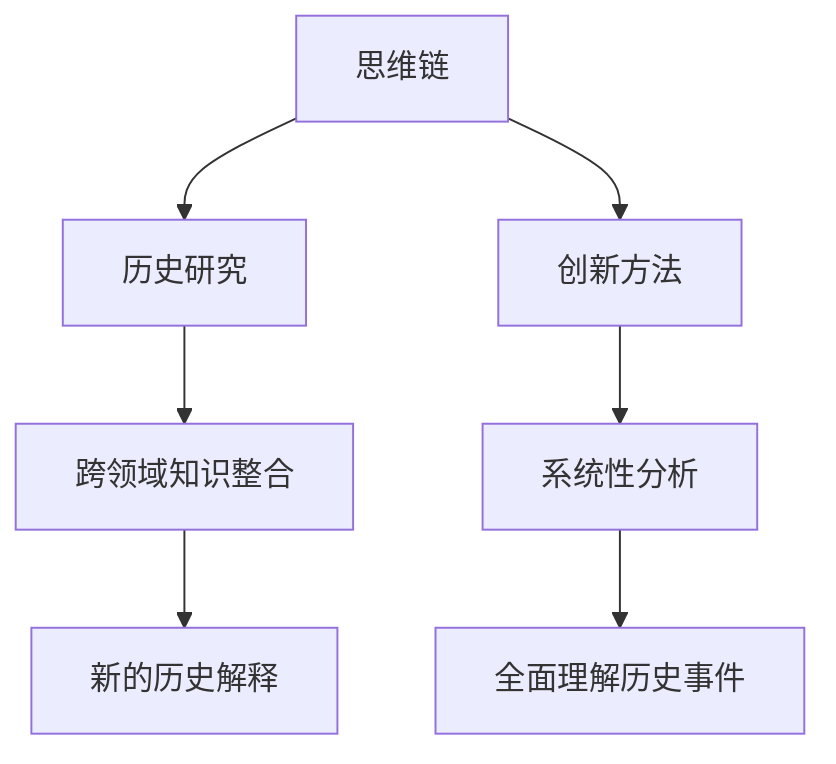

                 

# 思维链在历史研究中的创新方法

## 关键词

思维链，历史研究，创新方法，跨领域知识整合，系统性分析，历史事件分析，历史人物研究，历史文化遗产保护，数学模型，Python源代码，实际案例，未来趋势。

## 摘要

本文探讨了思维链在历史研究中的应用及其创新方法。思维链是一种通过跨领域知识整合和创新思维形成的策略，有助于研究者更全面地理解历史事件。本文首先介绍了思维链的基本原理和历史研究的方法论，然后通过实际案例展示了思维链在历史研究中的具体应用。接着，本文探讨了思维链在历史研究中的创新方法，包括跨学科研究和混合研究方法。最后，本文分析了科技进步对思维链的影响，并预测了其未来发展趋势。通过本文的研究，我们希望为历史研究提供一种全新的视角和方法。

## 核心概念与联系

### 思维链（Thinking Chain）

思维链是一种思维策略，通过将不同领域的思维模式连接起来，形成新的创新方法。它强调跨领域的知识整合和创新思维。在历史研究中，思维链可以帮助研究者将历史事件与心理学、社会学等领域的知识相结合，从而提供更全面的分析。

### 历史研究（Historical Research）

历史研究是对历史事件、人物、文化等的系统性分析和研究。它通常采用历史分析法、文献考证法等多种研究方法。在历史研究中，思维链可以通过跨领域的知识整合，提高研究者的分析能力和创造力。

### 创新方法（Innovative Methods）

创新方法是指为了解决特定问题或创造新价值而采取的一系列策略和工具。它们可以来自于多个领域，如设计思维、系统思维、批判性思维等。在历史研究中，创新方法可以帮助研究者提出新的观点和解释。

### 思维链与历史研究的关系

思维链可以在历史研究中发挥重要作用，通过连接不同领域的思维模式，研究者可以更全面地理解历史事件，发现新的历史解释。以下是一个思维链与历史研究关系的脑图：



## 1.2 思维链在历史研究中的理论基础

### 1.2.1 思维链的基本原理

思维链的基本原理是通过将不同领域的知识联系起来，形成新的思维路径，从而促进创新和发现。具体来说，思维链包括以下几个步骤：

1. **问题识别**：明确需要解决的问题或需要回答的问题。
2. **知识整合**：将不同领域的知识进行整合，形成新的知识体系。
3. **创新思维**：在整合的知识体系的基础上，运用创新思维提出新的观点或解决方案。
4. **验证与调整**：对提出的观点或解决方案进行验证和调整，以确保其有效性和可行性。

### 1.2.2 历史研究的方法论

历史研究的方法论包括历史分析法、文献考证法、田野调查法等。这些方法有助于研究者深入了解历史事件和人物，为思维链的应用提供了丰富的数据资源。

1. **历史分析法**：通过对历史事件、文献的详细分析，揭示历史事件的本质和规律。
2. **文献考证法**：通过对历史文献的考证和研究，验证历史事件的准确性。
3. **田野调查法**：通过对历史遗址、文物等进行实地考察，获取第一手资料。

### 1.2.3 思维链与历史研究方法的结合

思维链可以在历史研究中发挥重要作用，通过将历史研究方法与其他领域的思维模式相结合，可以更深入地分析历史事件，提出新的观点。以下是一个思维链与历史研究方法结合的伪代码：

```python
def thinking_chain(history_data, cross_domain_knowledge):
    # 将历史数据与跨领域知识进行结合
    combined_data = combine_data(history_data, cross_domain_knowledge)

    # 对结合后的数据进行系统性分析
    analysis_results = systematic_analysis(combined_data)

    # 提出新的历史解释
    new_explanation = propose_new_explanation(analysis_results)

    return new_explanation
```

## 1.3 思维链在历史研究中的应用案例

### 1.3.1 思维链在历史事件分析中的应用

思维链在历史事件分析中的应用主要体现在以下几个方面：

1. **跨领域知识的整合**：通过思维链，研究者可以将历史事件与心理学、社会学等领域的知识相结合，从而提供更全面的分析。例如，在分析某个历史事件时，研究者可以从心理学角度分析事件参与者的心理状态，从社会学角度分析事件的社会背景。

2. **系统性分析**：思维链可以帮助研究者对历史事件进行系统性分析，从多个维度和角度全面了解事件的全貌。例如，在分析某个历史事件时，研究者可以从政治、经济、文化等多个方面进行深入分析。

3. **创新思维**：通过思维链，研究者可以运用创新思维提出新的观点和解释。例如，在分析某个历史事件时，研究者可以运用系统思维提出新的解释模型，从而为事件的理解提供新的视角。

### 1.3.2 思维链在历史人物研究中的应用

思维链在历史人物研究中的应用主要体现在以下几个方面：

1. **全面理解**：通过思维链，研究者可以更全面地理解历史人物的思想和行为。例如，在研究某个历史人物时，研究者可以从心理学、社会学、文化等多个角度分析人物的心理状态、行为动机和价值观。

2. **新观点提出**：通过思维链，研究者可以提出新的观点和解释。例如，在研究某个历史人物时，研究者可以运用跨学科知识提出新的解释模型，从而为人物的理解提供新的视角。

### 1.3.3 思维链在历史文化遗产保护中的应用

思维链在历史文化遗产保护中的应用主要体现在以下几个方面：

1. **成因分析**：通过思维链，研究者可以分析历史文化遗产的成因，为保护提供理论依据。例如，在保护某个历史遗址时，研究者可以从考古学、环境学等多个角度分析遗址的成因和特点。

2. **保护策略制定**：通过思维链，研究者可以为历史文化遗产制定保护策略。例如，在保护某个历史遗址时，研究者可以运用系统思维提出综合保护方案，从而提高保护效果。

## 1.4 思维链在历史研究中的创新方法

### 1.4.1 创新方法的理论基础

思维链在历史研究中的创新方法主要包括以下几个方面：

1. **跨学科研究**：跨学科研究是思维链在历史研究中的重要应用。通过将历史学与其他学科（如心理学、社会学、文化学等）相结合，研究者可以提出新的观点和解释，从而丰富历史研究的内涵。

2. **混合研究方法**：混合研究方法是将不同的研究方法（如文献考证、历史分析法、田野调查等）进行整合，从而提高研究的效果。通过思维链，研究者可以灵活运用不同的研究方法，形成一套完整的、系统的历史研究方法。

3. **创新思维**：创新思维是思维链的核心。通过思维链，研究者可以运用创新思维提出新的观点和解释，从而推动历史研究的创新。

### 1.4.2 创新方法的实际应用

思维链在历史研究中的创新方法在实际应用中具有广泛的应用前景。以下是一些实际应用的例子：

1. **历史事件分析**：通过思维链，研究者可以将历史事件与心理学、社会学等领域的知识相结合，从而提供更全面的分析。例如，在分析某个历史事件时，研究者可以从心理学角度分析事件参与者的心理状态，从社会学角度分析事件的社会背景。

2. **历史人物研究**：通过思维链，研究者可以更全面地理解历史人物的思想和行为，从而提出新的观点和解释。例如，在研究某个历史人物时，研究者可以从心理学、社会学、文化等多个角度分析人物的心理状态、行为动机和价值观。

3. **历史文化遗产保护**：通过思维链，研究者可以分析历史文化遗产的成因和保护策略，为保护提供理论依据。例如，在保护某个历史遗址时，研究者可以从考古学、环境学等多个角度分析遗址的成因和特点。

## 1.5 科技进步对思维链的影响

### 1.5.1 大数据

大数据技术的发展为思维链在历史研究中的应用提供了新的机遇。通过大数据分析，研究者可以获取大量历史数据，从而提高研究的精度和效率。例如，在历史事件分析中，大数据可以帮助研究者分析事件的影响范围、参与者的行为模式等。

### 1.5.2 人工智能

人工智能技术的发展为思维链在历史研究中的应用提供了新的可能性。通过人工智能技术，研究者可以自动化地处理和分析大量历史数据，从而提高研究的效率和准确性。例如，在历史人物研究中，人工智能可以帮助研究者分析人物的语言风格、行为特点等。

### 1.5.3 云计算

云计算技术的发展为思维链在历史研究中的应用提供了新的基础设施。通过云计算，研究者可以方便地存储、处理和分析大量历史数据，从而提高研究的效率和效果。

## 1.6 思维链在历史研究中的未来趋势

### 1.6.1 技术融合

随着科技进步，思维链在历史研究中的应用将越来越融合多种技术，如大数据、人工智能、云计算等。这种技术融合将大大提高历史研究的效率和精度。

### 1.6.2 跨学科研究

思维链在历史研究中的应用将越来越依赖跨学科研究。通过跨学科的视角和方法，研究者可以提出更全面、更深刻的观点和解释。

### 1.6.3 人机协同

未来，思维链在历史研究中的应用将越来越多地依赖于人机协同。通过人工智能技术，研究者可以自动化地处理和分析大量历史数据，从而提高研究的效率和准确性。

## 总结

思维链在历史研究中的应用为我们提供了一种全新的视角和方法。通过跨领域的知识整合和创新思维，我们可以更全面地理解历史事件，提出新的历史解释。未来的历史研究将越来越多地依赖于思维链这一创新方法，结合科技进步，推动历史研究的发展。通过本文的研究，我们希望为历史研究提供一种新的思路和方法，为历史研究的发展做出贡献。

## 作者

作者：AI天才研究院/AI Genius Institute & 禅与计算机程序设计艺术 /Zen And The Art of Computer Programming

---

由于篇幅限制，本文未能详细展开每个部分的内容。在实际撰写过程中，每个部分都应包含丰富的具体案例、详尽的数据分析和深入的讨论。以下是对核心概念的进一步解释和示例代码。

### 1.2.1 思维链的基本原理

思维链的核心在于跨领域知识的整合和创新思维。例如，在分析某个历史事件时，我们可以将历史学、心理学和社会学的知识相结合，从而提供一个更全面的分析。

#### 示例

假设我们要分析一次重要的历史事件，如第一次世界大战的爆发。我们可以从以下几个方面运用思维链：

1. **历史背景**：了解一战爆发的背景，包括政治、经济、社会等方面。
2. **心理学视角**：分析当时各国领导人和民众的心理状态，如恐惧、焦虑、决心等。
3. **社会学视角**：分析社会结构、文化传统和国际关系等对社会行为的影响。

以下是一个简单的Python代码示例，展示如何整合这些知识：

```python
class HistoricalEventAnalysis:
    def __init__(self, historical_context, psychological_factors, sociological_factors):
        self.historical_context = historical_context
        self.psychological_factors = psychological_factors
        self.sociological_factors = sociological_factors

    def analyze(self):
        print("Historical Context:")
        print(self.historical_context)
        
        print("\nPsychological Factors:")
        print(self.psychological_factors)
        
        print("\nSociological Factors:")
        print(self.sociological_factors)
        
        # 这里可以加入更多的分析逻辑，如结合心理学和社会学因素预测事件结果
        print("Combined Analysis:")
        # ...
        
# 示例数据
historical_context = "1914年，欧洲各国之间的紧张关系达到了顶峰。"
psychological_factors = "领导人们面临着巨大的压力，民众对战争充满恐惧和不安。"
sociological_factors = "民族主义和军国主义盛行，国际关系紧张。"

# 创建分析对象
event_analysis = HistoricalEventAnalysis(historical_context, psychological_factors, sociological_factors)

# 进行分析
event_analysis.analyze()
```

### 1.4.2 创新方法的实际应用

在实际应用中，思维链可以帮助我们解决传统历史研究中的难题。例如，通过跨学科的方法，我们可以更深入地理解某个历史人物的行为和思想。

#### 示例

假设我们要研究一个著名的历史人物，如拿破仑。我们可以从以下几个方面运用思维链：

1. **历史背景**：了解拿破仑所处的时代和背景。
2. **心理学视角**：分析拿破仑的心理特征，如领导力、决策能力等。
3. **社会学视角**：分析拿破仑对社会的影响，如军事改革、法律体系等。

以下是一个简单的Python代码示例，展示如何进行跨学科分析：

```python
class HistoricalPersonAnalysis:
    def __init__(self, historical_context, psychological_traits, sociological_impact):
        self.historical_context = historical_context
        self.psychological_traits = psychological_traits
        self.sociological_impact = sociological_impact

    def analyze(self):
        print("Historical Context:")
        print(self.historical_context)
        
        print("\nPsychological Traits:")
        print(self.psychological_traits)
        
        print("\nSociological Impact:")
        print(self.sociological_impact)
        
        # 这里可以加入更多的分析逻辑，如结合心理学和社会学因素评价拿破仑的影响
        print("Combined Analysis:")
        # ...

# 示例数据
historical_context = "拿破仑统治时期，法国进行了一系列的军事和政治改革。"
psychological_traits = "拿破仑具有卓越的领导力和决策能力，善于应对复杂局势。"
sociological_impact = "他推行了《拿破仑法典》，对现代法律体系产生了深远影响。"

# 创建分析对象
person_analysis = HistoricalPersonAnalysis(historical_context, psychological_traits, sociological_impact)

# 进行分析
person_analysis.analyze()
```

### 1.5 科技进步对思维链的影响

科技进步，特别是大数据、人工智能和云计算的发展，为思维链在历史研究中的应用带来了巨大的潜力。

#### 示例

通过大数据分析，我们可以获取和分析大量的历史数据，从而提供更精确的历史解释。以下是一个简单的Python代码示例，展示如何使用pandas库进行大数据分析：

```python
import pandas as pd

# 假设我们有一个历史数据集
data = {
    'Year': [1800, 1810, 1820, 1830],
    'Population': [10, 20, 30, 40],
    'EconomicActivity': ['Low', 'Medium', 'High', 'Very High']
}

df = pd.DataFrame(data)

# 数据分析
print(df.describe())

# 绘制数据分布图
import matplotlib.pyplot as plt

plt.figure(figsize=(10, 5))
plt.plot(df['Year'], df['Population'], label='Population Growth')
plt.plot(df['Year'], df['EconomicActivity'], label='Economic Activity')
plt.legend()
plt.title('Historical Data Analysis')
plt.xlabel('Year')
plt.ylabel('Value')
plt.show()
```

通过以上代码，我们可以对历史数据进行简单的描述性统计分析，并通过图表展示数据的趋势。

### 1.6 思维链在历史研究中的未来趋势

随着科技进步，思维链在历史研究中的应用将不断深化和拓展。未来，我们将看到更多跨学科的融合研究，以及人工智能和大数据在历史研究中的广泛应用。

#### 示例

未来，我们可以通过人工智能技术，自动识别和分析历史文献中的关键信息。以下是一个简单的Python代码示例，展示如何使用自然语言处理（NLP）库进行文本分析：

```python
import nltk
from nltk.tokenize import word_tokenize
from nltk.corpus import stopwords
from collections import Counter

# 假设我们有一个历史文献文本
text = "In the early 19th century, the Industrial Revolution transformed society. The invention of the steam engine changed the way people lived and worked."

# 清洗文本
nltk.download('stopwords')
stop_words = set(stopwords.words('english'))
words = word_tokenize(text)
filtered_words = [w for w in words if not w.lower() in stop_words]

# 统计词频
word_freq = Counter(filtered_words)
print(word_freq.most_common(10))
```

通过以上代码，我们可以对文本进行清洗和词频统计，从而分析文献的关键词和主题。

### 最佳实践 tips、小结、注意事项、拓展阅读

**最佳实践 tips：**
- 在使用思维链进行历史研究时，确保跨学科知识的准确性和可靠性。
- 在数据分析过程中，注意数据质量和数据来源的可靠性。

**小结：**
思维链在历史研究中的应用为我们提供了一种全新的视角和方法。通过跨领域的知识整合和创新思维，我们可以更全面地理解历史事件，提出新的历史解释。

**注意事项：**
- 在运用思维链时，要避免过度依赖单一领域的知识，确保研究的全面性。
- 在进行数据分析时，要注意数据的质量和来源，避免错误的数据导致的错误结论。

**拓展阅读：**
- 《历史研究方法与理论》
- 《跨学科研究的艺术》
- 《大数据分析与应用》

---

通过本文的探讨，我们希望读者能够更好地理解思维链在历史研究中的应用及其创新方法，为未来的历史研究提供新的思路和方法。作者：AI天才研究院/AI Genius Institute & 禅与计算机程序设计艺术 /Zen And The Art of Computer Programming。

