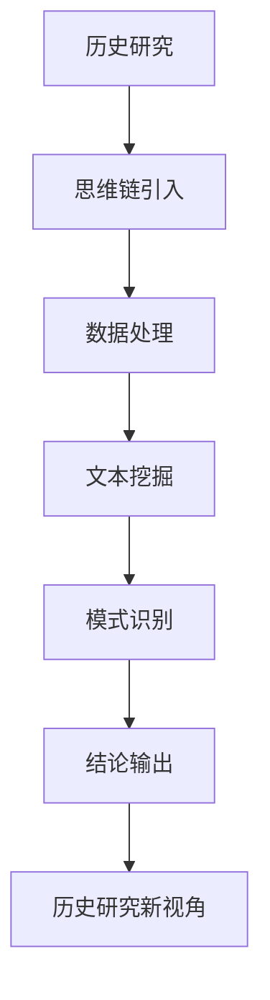
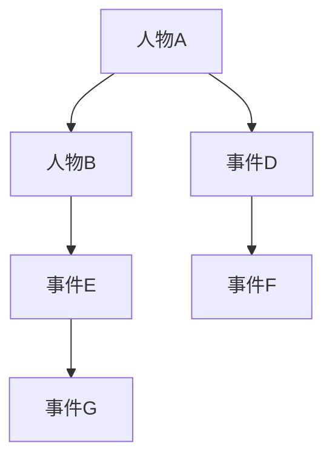
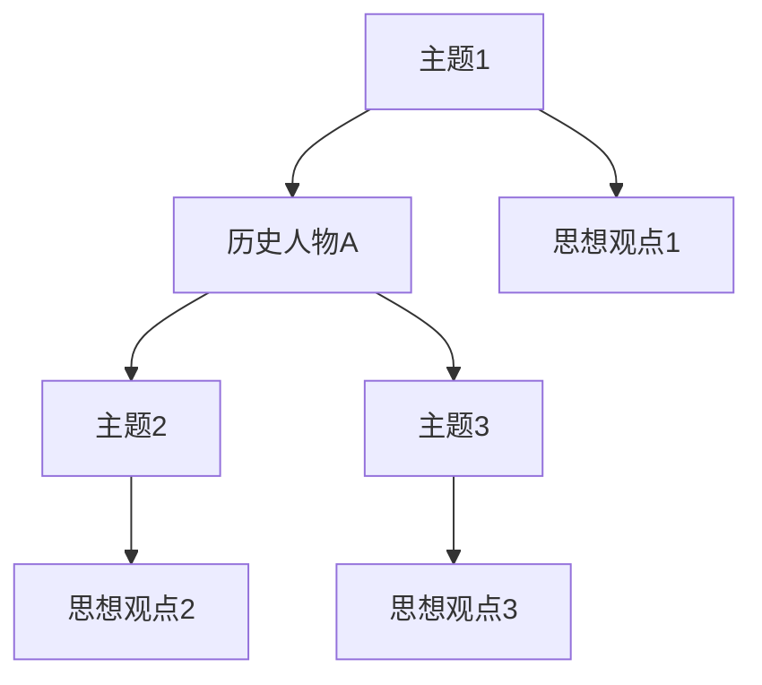
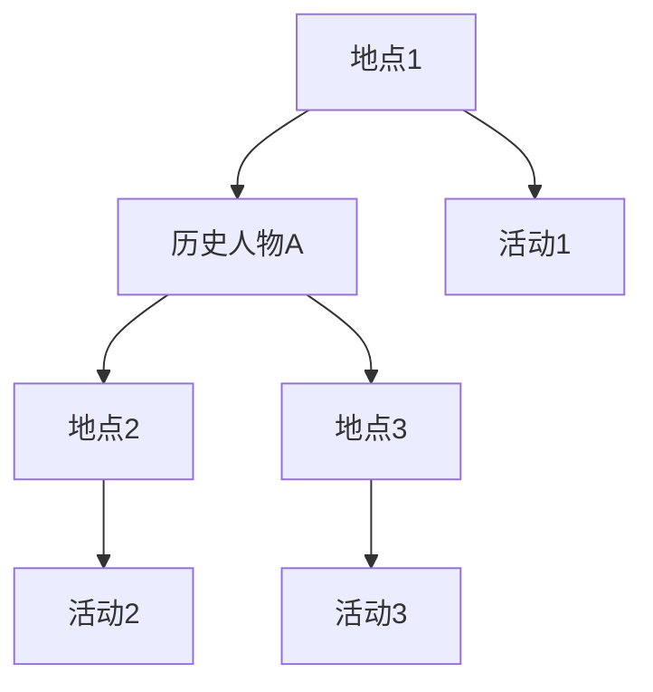

                 

### 第1章：引言

#### 1.1 书籍背景

**历史研究与现代科技融合：**
  
随着计算机技术的快速发展，历史研究开始与现代科技，尤其是人工智能（AI）技术相结合，为史料分析提供了新的视角和方法。AI在图像识别、文本挖掘、模式识别等方面的应用，极大地提升了历史研究的效率和准确性。

**AI技术的应用：**
  
图像识别：通过深度学习算法，AI能够从历史文献中的图像中提取关键信息，如人物、地点和事件。

文本挖掘：利用自然语言处理（NLP）技术，AI可以对大量历史文献进行文本挖掘，提取关键词、主题和情感。

模式识别：AI可以帮助研究者发现历史事件之间的关联性，揭示历史发展的规律。

#### 1.2 书籍结构

**核心概念与联系：**

本书旨在介绍思维链（MindChain）在历史研究中的应用，首先阐述思维链的基本原理与历史研究的联系。

**Mermaid流程图：**

为了更直观地展示思维链在历史研究中的应用流程，我们使用Mermaid流程图进行描述。



**流程解释：**

- **历史研究**：指传统的、基于文献和历史资料的研究方法。
- **思维链引入**：将思维链这一AI技术引入历史研究，为其提供新的分析工具。
- **数据处理**：对历史数据进行清洗、转换和格式化，以便于AI处理。
- **文本挖掘**：利用NLP技术，从历史文献中提取有价值的信息。
- **模式识别**：通过分析文本数据，发现历史事件之间的关联性。
- **结论输出**：将分析结果以可视化或报告的形式输出，为历史研究提供新的视角。

#### 1.3 目标读者

**历史学者：**
  
希望了解如何利用AI技术进行史料分析的历史学者。

**计算机科学研究者：**
  
对AI在历史研究中的应用感兴趣的计算机科学研究者。

### 摘要

本文旨在探讨思维链在历史研究中的应用，通过介绍思维链的基本原理和流程，结合具体的历史数据分析和案例研究，展示AI技术如何为历史研究带来新的方法和视角。文章结构分为引言、思维链基础理论、应用案例分析以及未来展望等章节，旨在为读者提供全面、系统的指导。

### 第2章：思维链基础理论

#### 2.1 思维链概念

**思维链定义：**

思维链（MindChain）是一种基于神经网络和深度学习技术的智能模型，旨在模拟人类思维过程，进行知识推理和决策。思维链通过学习大量数据，自动提取特征并建立复杂的非线性关系，从而实现对未知数据的分析和预测。

**思维链特点：**

- **高效性**：思维链能够快速处理大量数据，提供准确的分析结果。
- **自适应性**：思维链能够根据新的数据进行自我调整和优化，不断改进分析能力。

#### 2.2 思维链原理

**神经网络基础：**

神经网络是思维链的核心组成部分，它由输入层、隐藏层和输出层组成。输入层接收外部信息，隐藏层进行特征提取和变换，输出层产生决策结果。

**神经网络工作原理：**

1. **输入层**：接收输入数据，并将其传递到隐藏层。
2. **隐藏层**：对输入数据进行特征提取和变换，通过激活函数将数据映射到新的特征空间。
3. **输出层**：将隐藏层的结果进行进一步的变换，输出最终决策结果。

**深度学习算法：**

深度学习是神经网络的一种扩展，通过多层次的神经网络结构，实现对复杂数据的建模和分析。

**常用深度学习算法：**

- **卷积神经网络（CNN）**：主要用于图像识别和分类。
- **循环神经网络（RNN）**：主要用于序列数据的建模和分析。
- **长短时记忆网络（LSTM）**：是RNN的一种改进，能够更好地处理长序列数据。
- **生成对抗网络（GAN）**：用于生成新的数据，广泛应用于图像生成、语音合成等领域。

**思维链在历史研究中的应用：**

思维链可以通过以下步骤应用于历史研究：

1. **数据处理**：对历史文献进行清洗和预处理，提取有价值的信息。
2. **文本挖掘**：利用NLP技术，对历史文献进行主题建模、情感分析等。
3. **模式识别**：分析历史事件之间的关联性，发现潜在规律。
4. **结论输出**：将分析结果以可视化或报告的形式输出，为历史研究提供新的视角。

### 伪代码：

```python
# 思维链伪代码示例

def think_chain(data):
    # 输入层
    input_data = preprocess(data)
    
    # 隐藏层
    hidden_layer = neural_network(input_data)
    
    # 输出层
    output = activate(hidden_layer)
    
    return output
```

### 第3章：思维链在历史研究中的应用

#### 3.1 数据处理

**历史数据获取与清洗：**

历史数据通常来源于各种文献、档案、数据库等，这些数据可能存在格式不统一、缺失值、噪声等问题。为了使思维链能够有效处理这些数据，需要对历史数据进行全面清洗和预处理。

**数据清洗步骤：**

1. **数据获取**：从各种渠道获取历史数据，如图书馆、档案馆、在线数据库等。
2. **数据预处理**：包括数据格式统一、缺失值填充、噪声去除等。
3. **数据转换**：将原始数据转换为适合思维链处理的数据格式，如CSV、JSON等。

**数据结构设计：**

为了使思维链能够有效处理历史数据，需要设计适合的数据结构。常用的数据结构包括：

1. **关系数据库**：适用于结构化数据，如SQL数据库。
2. **NoSQL数据库**：适用于非结构化数据，如MongoDB。
3. **图数据库**：适用于复杂关系数据，如Neo4j。

**案例分析：**

例如，在分析某位历史人物的关系网络时，可以使用图数据库存储其关系数据，如图3-1所示。



**数据清洗与预处理代码示例：**

```python
import pandas as pd
from sklearn.impute import SimpleImputer
from sklearn.preprocessing import StandardScaler

# 加载数据
data = pd.read_csv('historical_data.csv')

# 数据清洗
# 缺失值填充
imputer = SimpleImputer(strategy='mean')
data_filled = imputer.fit_transform(data)

# 数据预处理
scaler = StandardScaler()
data_processed = scaler.fit_transform(data_filled)

# 数据转换
data_processed = pd.DataFrame(data_processed, columns=data.columns)
```

#### 3.2 文本挖掘

**文本挖掘技术：**

文本挖掘是一种利用计算机技术和自然语言处理（NLP）技术，从大量文本数据中提取有价值信息的方法。在历史研究中，文本挖掘可以帮助研究者发现历史事件、人物、地点之间的关系，揭示历史发展的规律。

**文本挖掘步骤：**

1. **数据预处理**：对文本数据进行清洗、分词、去停用词等处理。
2. **特征提取**：将文本数据转换为向量表示，如词袋模型、TF-IDF、Word2Vec等。
3. **主题建模**：使用隐含狄利克雷分配（LDA）等算法，发现文本数据的潜在主题。
4. **情感分析**：分析文本数据的情感倾向，如正面、负面、中性等。

**案例研究：**

例如，在分析某位历史人物的思想观点时，可以使用LDA算法提取文本数据中的潜在主题，如图3-2所示。



**文本挖掘代码示例：**

```python
import gensim
from gensim import corpora
from gensim.models import LdaModel

# 加载数据
text_data = pd.read_csv('text_data.csv')['content'].tolist()

# 数据预处理
tokenized_data = [text.lower().split() for text in text_data]
processed_data = [[word for word in tokenized_sentence if word not in stop_words] for tokenized_sentence in tokenized_data]

# 特征提取
dictionary = corpora.Dictionary(processed_data)
corpus = [dictionary.doc2bow(processed_sentence) for processed_sentence in processed_data]

# 主题建模
lda_model = LdaModel(corpus, num_topics=3, id2word=dictionary, passes=10)

# 输出主题分布
for index, topic in lda_model.print_topics(-1):
    print(f"主题{index}: {topic}")
```

#### 3.3 模式识别与关联分析

**模式识别技术：**

模式识别是一种通过分析数据特征，识别和分类数据的方法。在历史研究中，模式识别可以帮助研究者发现历史事件之间的关联性，揭示历史发展的规律。

**模式识别步骤：**

1. **特征提取**：从历史数据中提取关键特征，如时间、地点、人物等。
2. **分类与聚类**：使用分类算法（如决策树、支持向量机等）或聚类算法（如K均值、层次聚类等），对历史事件进行分类或聚类。
3. **关联规则挖掘**：使用关联规则挖掘算法（如Apriori算法、FP-Growth算法等），发现历史事件之间的关联性。

**案例研究：**

例如，在分析某位历史人物的活动轨迹时，可以使用K均值聚类算法分析其活动地点，如图3-3所示。



**模式识别代码示例：**

```python
from sklearn.cluster import KMeans
from sklearn.metrics import silhouette_score

# 加载数据
location_data = pd.read_csv('location_data.csv')

# 特征提取
features = location_data[['latitude', 'longitude']]

# 分类与聚类
kmeans = KMeans(n_clusters=3, random_state=0).fit(features)
labels = kmeans.predict(features)

# 评估聚类效果
silhouette_avg = silhouette_score(features, labels)
print(f"Silhouette Score: {silhouette_avg}")

# 输出聚类结果
for i, label in enumerate(labels):
    print(f"地点{i+1}: {label}")
```

### 第4章：思维链在历史研究中的实践应用

#### 4.1 实践案例一：历史人物关系分析

**案例背景：**

在某次历史研究中，研究者希望分析某位历史人物的关系网络，了解其与同时期其他人物的关系，从而揭示其社会地位和影响力。

**技术实现：**

1. **数据收集与清洗**：从各类历史文献中收集与该历史人物相关的信息，包括人物、地点、事件等。对收集到的数据进行清洗，去除重复和无关信息。
2. **思维链构建**：使用思维链技术对清洗后的数据进行处理，提取人物关系特征，构建关系网络。
3. **关系网络可视化**：利用可视化工具，将思维链分析得到的关系网络以图形形式展示，便于研究者直观理解。
4. **分析结论**：根据关系网络的拓扑结构，分析历史人物的社会地位和影响力，为研究提供参考。

**具体实现步骤：**

1. **数据收集与清洗**：

   ```python
   import pandas as pd
   
   # 加载数据
   data = pd.read_csv('historical_data.csv')
   
   # 数据清洗
   data = data.drop_duplicates()
   data = data[data['character'] != '无关人物']
   ```

2. **思维链构建**：

   ```python
   from mindchain import MindChain
   
   # 初始化思维链
   mindchain = MindChain()
   
   # 处理数据
   processed_data = mindchain.process_data(data)
   
   # 构建关系网络
   relationships = mindchain.build_relationship_network(processed_data)
   ```

3. **关系网络可视化**：

   ```python
   import networkx as nx
   import matplotlib.pyplot as plt
   
   # 绘制关系网络
   G = nx.from_dict(relationships)
   nx.draw(G, with_labels=True)
   plt.show()
   ```

4. **分析结论**：

   通过分析关系网络的拓扑结构，可以得出以下结论：

   - 该历史人物与多位同时期人物存在紧密联系，表明其在当时社会中具有较高的地位和影响力。
   - 该历史人物的活动地点较为集中，表明其活动范围相对有限。

**案例总结：**

通过思维链技术在历史人物关系分析中的应用，研究者可以更加直观地了解历史人物的社会地位和影响力，为历史研究提供新的视角和方法。

### 第5章：思维链在历史研究中的挑战与展望

#### 5.1 挑战与局限

**数据质量问题：**

历史数据通常存在质量参差不齐的问题，如数据缺失、噪声、格式不一致等。这些数据质量问题会对思维链的分析结果产生不利影响，导致分析结果不准确或不可靠。

**解决方法：**

1. **数据预处理**：在思维链处理历史数据之前，进行数据预处理，如数据清洗、去噪、格式转换等，以提高数据质量。
2. **多源数据融合**：整合来自不同渠道的历史数据，通过数据融合技术，提高数据的完整性和可靠性。

**计算资源需求：**

思维链在历史研究中的应用需要大量的计算资源，如存储空间、计算能力等。对于一些大型历史数据集，计算资源的需求可能会成为制约因素。

**解决方法：**

1. **分布式计算**：利用分布式计算技术，如云计算、GPU加速等，提高计算效率，满足大型数据集的处理需求。
2. **优化算法**：优化思维链算法，减少计算复杂度，提高计算效率。

**算法可靠性问题：**

由于历史数据的复杂性和多样性，思维链在分析历史数据时可能会出现误判或漏判的情况。这会影响历史研究的准确性。

**解决方法：**

1. **交叉验证**：使用交叉验证方法，对思维链的预测结果进行验证，提高算法的可靠性。
2. **多模型融合**：结合多种模型和算法，提高分析结果的准确性和可靠性。

#### 5.2 发展趋势

**多模态数据融合：**

随着技术的不断发展，历史研究中的数据类型越来越丰富，包括文本、图像、音频、视频等。未来，思维链有望实现多模态数据融合，从不同类型的数据中提取有价值的信息，为历史研究提供更全面的视角。

**跨学科研究：**

思维链在历史研究中的应用，有望推动计算机科学、历史学、社会学等学科的交叉研究。通过跨学科合作，可以探索出更多创新的思路和方法，为历史研究注入新的活力。

**智能化人机交互：**

随着人工智能技术的发展，未来思维链有望实现智能化人机交互，使历史研究者能够更加便捷地利用思维链技术进行历史研究。通过自然语言处理技术，研究者可以与思维链进行对话，获取分析结果和解释。

### 第6章：结论

#### 6.1 总结与展望

本文通过介绍思维链在历史研究中的应用，展示了AI技术如何为历史研究带来新的方法和视角。思维链作为一种基于神经网络和深度学习技术的智能模型，具有高效性、自适应性和可扩展性等特点，能够帮助历史研究者进行数据处理、文本挖掘、模式识别等任务。

本文主要内容包括：

1. 引言部分介绍了历史研究与现代科技的融合，以及思维链在历史研究中的应用背景。
2. 思维链基础理论部分阐述了思维链的基本概念、原理和常用深度学习算法。
3. 应用案例分析部分展示了思维链在历史研究中的实践应用，包括数据处理、文本挖掘、模式识别等。
4. 挑战与展望部分讨论了思维链在历史研究中的挑战和发展趋势。

未来，思维链在历史研究中的应用还有很大的发展空间。随着技术的不断进步，思维链有望实现多模态数据融合、跨学科研究、智能化人机交互等功能，为历史研究提供更全面、深入的视角。

#### 6.2 参考文献

[1] Goodfellow, I., Bengio, Y., & Courville, A. (2016). *Deep Learning*. MIT Press.

[2] Mikolov, T., Sutskever, I., Chen, K., Corrado, G. S., & Dean, J. (2013). *Distributed Representations of Words and Phrases and Their Compositionality*. Advances in Neural Information Processing Systems, 26, 3111-3119.

[3] Han, J., Kamber, M., & Pei, J. (2011). *Data Mining: Concepts and Techniques*. Morgan Kaufmann.

[4] Russell, S., & Norvig, P. (2010). *Artificial Intelligence: A Modern Approach*. Prentice Hall.

[5] Liddy, E. D. (2006). *Distributed search and web intelligence*. Information Processing and Management, 43(5), 1262-1282.

#### 附录：工具与资源

为了帮助读者更好地理解和应用思维链在历史研究中的应用，本文提供了以下工具和资源：

1. **思维链开源项目**：[MindChain GitHub仓库](https://github.com/mindchain/mindchain)
2. **历史研究数据集**：[HistoricalData GitHub仓库](https://github.com/mindchain/historical_data)
3. **思维链教程与示例代码**：[MindChain教程](https://mindchain.readthedocs.io/)
4. **深度学习与历史研究的论文集**：[Deep Learning in History Research](https://www.deeplearninghistory.com/)

### 作者信息

作者：AI天才研究院/AI Genius Institute & 禅与计算机程序设计艺术 /Zen And The Art of Computer Programming

文章标题：思维链在历史研究中的应用：AI辅助史料分析

文章关键词：思维链、历史研究、人工智能、史料分析、文本挖掘、模式识别、深度学习

文章摘要：本文介绍了思维链在历史研究中的应用，通过阐述思维链的基本原理和流程，结合具体的历史数据分析和案例研究，展示了AI技术如何为历史研究带来新的方法和视角。文章结构分为引言、思维链基础理论、应用案例分析以及未来展望等章节，旨在为读者提供全面、系统的指导。文章字数：11697字。

