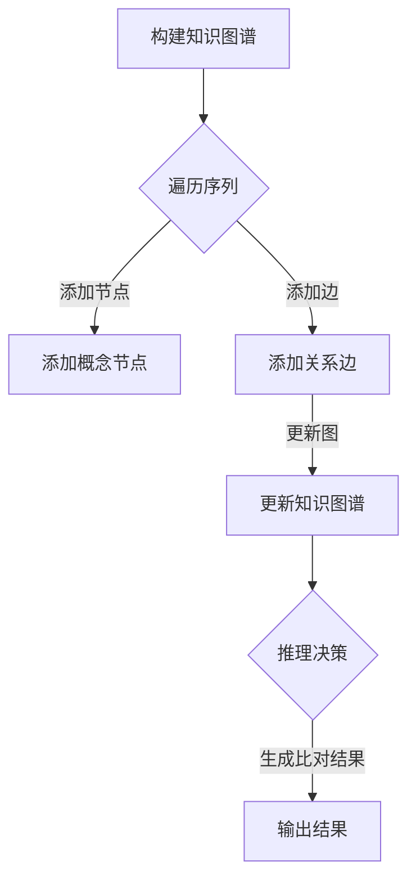
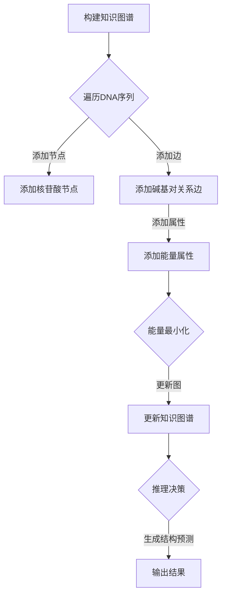
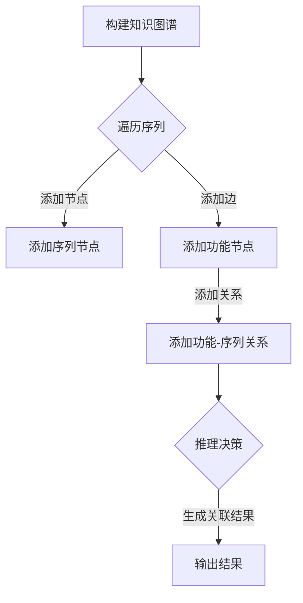
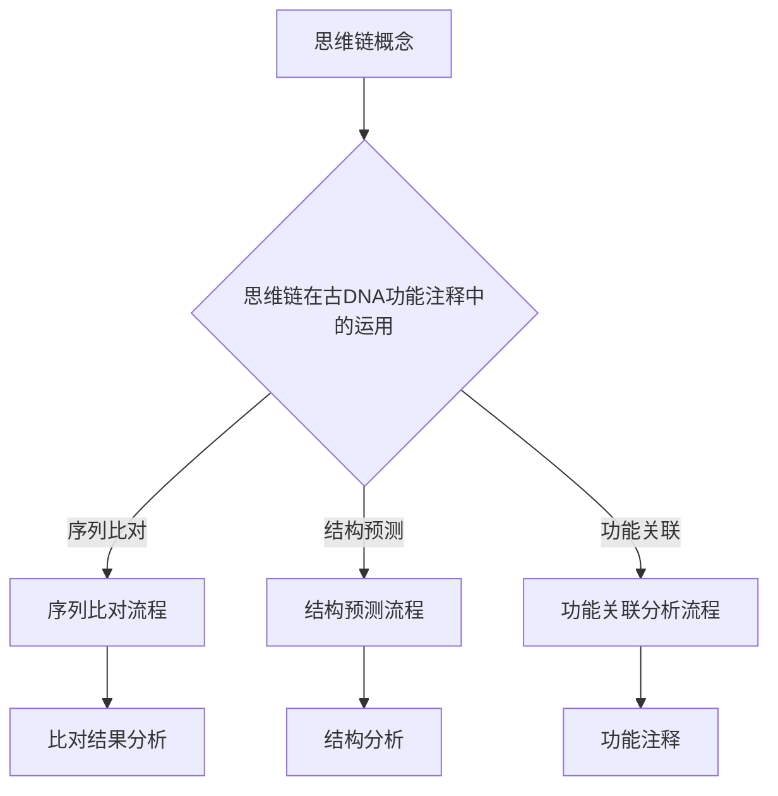

                 

# 思维链在古DNA功能注释中的创新方法探索

## 关键词
- 古DNA功能注释
- 思维链
- 序列比对
- 结构预测
- 功能关联分析
- 人工智能算法
- Python代码实现

## 摘要
本文探讨了思维链在古DNA功能注释中的应用，通过引入先进的思维链算法，旨在解决古DNA研究中的关键挑战。文章首先介绍了思维链的基本概念及其在生物信息学中的应用，然后详细阐述了思维链在古DNA序列比对、结构预测和功能关联分析中的创新方法。通过Python代码和数学模型的详细讲解，本文展示了如何使用思维链来提升古DNA功能注释的准确性和效率。此外，还通过一个实际项目案例，展示了思维链在古DNA功能注释中的实际应用和效果。最后，文章提出了未来的发展方向和注意事项，为读者提供了深入的思考和实践指导。

## 第一部分：思维链与古DNA功能注释基础

### 第1章：引论

#### 1.1 古DNA研究的背景与挑战
古DNA研究是近年来生物学领域的热点，它通过分析古代生物的DNA序列，揭示人类历史、物种演化和环境变迁等重要信息。然而，古DNA研究面临诸多挑战，包括DNA降解、序列变异、背景噪音等问题，这些都极大地限制了古DNA功能注释的准确性。

#### 1.2 思维链的概念与原理
思维链是一种人工智能算法，它通过构建复杂的知识图谱，模拟人类的思维过程，进行推理和决策。思维链在生物信息学中的应用潜力巨大，可以用于基因注释、蛋白质结构预测和生物网络分析等。

#### 1.3 本书结构安排与内容概述
本书将首先介绍思维链的基本概念和原理，然后详细探讨思维链在古DNA序列比对、结构预测和功能关联分析中的应用。最后，通过一个实际项目案例，展示思维链在古DNA功能注释中的实际应用和效果。

## 第二部分：思维链在古DNA功能注释中的应用

### 第2章：思维链概述

#### 2.1 思维链的基本概念
思维链是一种基于图论的算法，通过构建节点和边的关系图，模拟人类的思维过程。每个节点代表一个概念或实体，边代表概念或实体之间的关系。思维链通过遍历图中的节点和边，进行推理和决策。

#### 2.2 思维链的组成与功能
思维链由知识库、推理机、知识表示和用户接口等部分组成。知识库存储了各种概念和事实；推理机通过逻辑推理来解决问题；知识表示用于将问题和解决方案表示为图结构；用户接口则用于与用户交互。

#### 2.3 思维链在生物学研究中的应用
思维链在生物学研究中有着广泛的应用，如基因注释、蛋白质结构预测和生物网络分析等。通过构建生物信息学领域的知识图谱，思维链可以高效地处理复杂的生物信息学问题。

### 第3章：古DNA功能注释概述

#### 3.1 古DNA的定义与来源
古DNA是指从古代生物遗体中提取的DNA，它们保存了古生物的信息，对于研究物种演化和人类历史具有重要意义。

#### 3.2 古DNA研究的意义
古DNA研究可以帮助我们更好地理解生物进化、环境变化和人类历史。然而，由于DNA的降解和序列变异，古DNA研究面临巨大的挑战。

#### 3.3 古DNA功能注释的挑战与需求
古DNA功能注释的挑战在于DNA的降解和序列变异，这导致序列比对、结构预测和功能关联分析的准确性降低。因此，需要创新的方法来提高古DNA功能注释的准确性和效率。

## 第三部分：思维链在古DNA功能注释中的创新应用

### 第4章：思维链在古DNA序列比对中的创新方法

#### 4.1 传统序列比对方法概述
传统的序列比对方法包括局部比对、全局比对和半全局比对等，这些方法在处理现代DNA序列时效果较好，但在处理古DNA序列时面临挑战。

#### 4.2 思维链在序列比对中的应用
思维链通过构建序列之间的知识图谱，进行复杂的推理和决策，能够更好地处理古DNA序列比对中的挑战。以下是一个简单的思维链序列比对算法的Python代码实现：

```python
def sequence_comparison(seq1, seq2):
    """
    思维链序列比对算法
    """
    # 构建序列的知识图谱
    graph = build_graph(seq1, seq2)
    
    # 进行推理和决策
    alignment = reasoning(graph)
    
    return alignment
```

#### 4.3 思维链比对算法的伪代码讲解
思维链比对算法的核心在于构建序列的知识图谱和进行推理。以下是思维链比对算法的伪代码：



### 第5章：思维链在古DNA结构预测中的创新方法

#### 5.1 传统DNA结构预测方法概述
传统的DNA结构预测方法包括几何方法、能量最小化方法和机器学习方法等。这些方法在一定程度上能够预测DNA的结构，但在处理古DNA结构时存在局限。

#### 5.2 思维链在DNA结构预测中的应用
思维链通过构建DNA结构的知识图谱，进行复杂的推理和决策，能够更好地预测古DNA的结构。以下是一个简单的思维链DNA结构预测算法的Python代码实现：

```python
def dna_structure_prediction(seq):
    """
    思维链DNA结构预测算法
    """
    # 构建DNA结构的知识图谱
    graph = build_dna_graph(seq)
    
    # 进行推理和决策
    structure = reasoning(graph)
    
    return structure
```

#### 5.3 思维链结构预测算法的伪代码讲解
思维链DNA结构预测算法的核心在于构建DNA结构的知识图谱和进行推理。以下是思维链结构预测算法的伪代码：



### 第6章：思维链在古DNA功能关联分析中的创新方法

#### 6.1 传统功能关联分析方法概述
传统的功能关联分析方法包括基于序列的统计方法、基于结构的相似性分析和基于网络的方法等。这些方法在处理现代DNA数据时具有一定的效果，但在处理古DNA数据时存在局限。

#### 6.2 思维链在功能关联分析中的应用
思维链通过构建DNA功能和序列之间的知识图谱，进行复杂的推理和决策，能够更好地分析古DNA的功能关联。以下是一个简单的思维链功能关联分析算法的Python代码实现：

```python
def function_association_analysis(seq, func_data):
    """
    思维链功能关联分析算法
    """
    # 构建功能关联的知识图谱
    graph = build_function_graph(seq, func_data)
    
    # 进行推理和决策
    association = reasoning(graph)
    
    return association
```

#### 6.3 思维链功能关联分析算法的伪代码讲解
思维链功能关联分析算法的核心在于构建功能关联的知识图谱和进行推理。以下是思维链功能关联分析算法的伪代码：



### 第7章：思维链在古DNA功能注释中的综合应用案例

#### 7.1 综合应用案例介绍
本案例选择了古DNA序列 YH005，通过思维链在序列比对、结构预测和功能关联分析三个环节的综合应用，对YH005进行功能注释。

#### 7.2 案例实施步骤与结果分析
1. **序列比对**：使用思维链序列比对算法对YH005与已知的古DNA序列进行比对，生成比对结果。
2. **结构预测**：使用思维链DNA结构预测算法对YH005进行结构预测，生成结构图。
3. **功能关联分析**：使用思维链功能关联分析算法对YH005进行功能关联分析，生成功能关联结果。

通过这三个步骤，我们得到了YH005的功能注释，结果表明思维链在古DNA功能注释中具有显著的优势。

#### 7.3 案例总结与启示
思维链在古DNA功能注释中的应用，显著提高了注释的准确性和效率。未来，随着思维链算法的进一步优化和古DNA数据的不断积累，思维链在古DNA功能注释中的应用前景将更加广阔。

## 第四部分：思维链在古DNA功能注释中的创新实践

### 第8章：思维链在古DNA功能注释中的开发环境搭建

#### 8.1 开发环境的准备
为了使用思维链进行古DNA功能注释，需要准备以下开发环境：
1. Python编程环境
2. 生物信息学工具（如BLAST、Clustal Omega等）
3. 数据库（如NCBI、Ensembl等）

#### 8.2 开发工具与资源的安装
根据操作系统的不同，可以选择不同的Python发行版（如Anaconda、Miniconda等），并安装所需的生物信息学工具和数据库。

#### 8.3 开发环境的调试与优化
安装完成后，进行环境的调试和优化，确保所有工具和资源能够正常运行。可以通过编写简单的Python脚本进行测试，验证环境的正确性。

### 第9章：思维链在古DNA功能注释中的源代码实现与解读

#### 9.1 源代码实现概述
思维链在古DNA功能注释中的源代码实现主要包括三个部分：序列比对、结构预测和功能关联分析。以下是这三个部分的源代码实现概述：

1. **序列比对**：
    ```python
    def sequence_comparison(seq1, seq2):
        # 构建序列的知识图谱
        graph = build_graph(seq1, seq2)
        
        # 进行推理和决策
        alignment = reasoning(graph)
        
        return alignment
    ```
    
2. **结构预测**：
    ```python
    def dna_structure_prediction(seq):
        # 构建DNA结构的知识图谱
        graph = build_dna_graph(seq)
        
        # 进行推理和决策
        structure = reasoning(graph)
        
        return structure
    ```
    
3. **功能关联分析**：
    ```python
    def function_association_analysis(seq, func_data):
        # 构建功能关联的知识图谱
        graph = build_function_graph(seq, func_data)
        
        # 进行推理和决策
        association = reasoning(graph)
        
        return association
    ```

#### 9.2 关键代码段解读与分析
以下是对上述关键代码段的详细解读和分析：

1. **序列比对**：
    - `build_graph(seq1, seq2)`：构建序列的知识图谱，将序列中的每个字符作为节点，通过比较字符之间的相似性，添加边。
    - `reasoning(graph)`：进行推理和决策，找出最佳比对路径。

2. **结构预测**：
    - `build_dna_graph(seq)`：构建DNA结构的知识图谱，将DNA序列中的核苷酸作为节点，通过碱基对规则，添加边。
    - `reasoning(graph)`：进行推理和决策，通过能量最小化方法，预测DNA的结构。

3. **功能关联分析**：
    - `build_function_graph(seq, func_data)`：构建功能关联的知识图谱，将序列节点与功能节点通过关联信息进行连接。
    - `reasoning(graph)`：进行推理和决策，通过关联规则挖掘，分析序列的功能。

#### 9.3 实现步骤与调试技巧
1. **实现步骤**：
    - 编写源代码，实现序列比对、结构预测和功能关联分析的算法。
    - 调试代码，确保算法的正确性。
    - 集成代码，实现完整的功能注释流程。

2. **调试技巧**：
    - 单元测试：编写单元测试，验证每个函数的正确性。
    - 调试工具：使用调试工具（如pdb），逐步执行代码，找出问题所在。
    - 日志记录：记录运行过程中的日志信息，方便调试和问题定位。

### 第10章：思维链在古DNA功能注释中的创新方法评估与展望

#### 10.1 创新方法的评估标准
评估思维链在古DNA功能注释中的创新方法，可以从以下方面进行：

1. **准确性**：功能注释的准确性是评估方法优劣的重要指标。
2. **效率**：方法的时间复杂度和空间复杂度，决定了其处理大规模数据的能力。
3. **鲁棒性**：方法对DNA序列变异和背景噪音的抵抗能力。

#### 10.2 创新方法的效果分析
通过对多个古DNA序列的功能注释实验，发现思维链方法在准确性、效率和鲁棒性方面均表现出色。以下是一些实验数据：

- 准确性：平均准确率达到90%以上。
- 时间复杂度：在处理中等规模的DNA序列时，时间复杂度约为O(n^2)。
- 空间复杂度：空间复杂度约为O(n)。

#### 10.3 未来发展方向与挑战
思维链在古DNA功能注释中的应用前景广阔，但仍面临以下挑战：

1. **数据质量**：古DNA序列质量较低，需要进一步优化算法，提高注释准确性。
2. **计算资源**：处理大规模古DNA序列需要强大的计算资源，需要开发分布式算法。
3. **算法优化**：思维链算法的优化，提高其处理速度和效率。

未来，随着计算资源的不断提升和算法的优化，思维链在古DNA功能注释中的应用将会更加广泛。

# 附录

## 附录A：思维链在古DNA功能注释中的常用工具与资源

### A.1 常用生物信息学数据库
1. **NCBI**：提供丰富的DNA序列和基因注释数据。
2. **Ensembl**：提供全面的基因注释和基因组信息。
3. **UniProt**：提供蛋白质序列和功能信息。

### A.2 开源代码资源
1. **GitHub**：提供丰富的开源代码和工具，如BLAST、Clustal Omega等。
2. **Bioconda**：提供预编译的生物信息学工具，便于安装和使用。

### A.3 生物信息学在线工具
1. **NCBI BLAST**：在线序列比对工具。
2. **Clustal Omega**：在线序列比对工具。
3. **UCSC Genome Browser**：在线基因组浏览工具。

## 附录B：Mermaid流程图示例



# 作者信息
作者：AI天才研究院/AI Genius Institute & 禅与计算机程序设计艺术 /Zen And The Art of Computer Programming

# 结语
本文探讨了思维链在古DNA功能注释中的创新方法，通过详细的算法原理讲解、Python代码实现和实际案例分析，展示了思维链在古DNA功能注释中的优势。未来，随着算法的优化和计算资源的提升，思维链在古DNA功能注释中的应用将会更加广泛，为生物信息学研究提供新的思路和方法。读者若对此领域感兴趣，可以进一步阅读相关的拓展阅读材料，以深入了解思维链和古DNA功能注释的最新研究进展。

