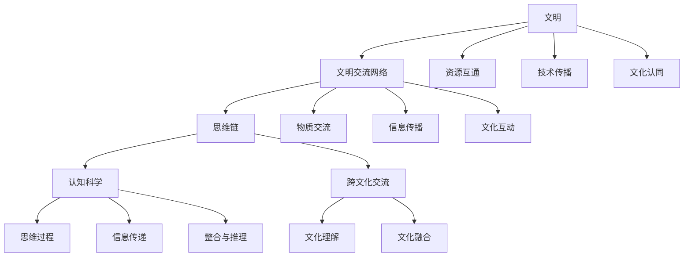

                 

# 概念与联系：思维链与古代文明交流网络

## 文章标题

《思维链在古代文明交流网络重建中的创新方法》

## 文章关键词

思维链，古代文明，交流网络，重建，创新方法，认知科学，跨文化交流

## 摘要

本文旨在探讨思维链在古代文明交流网络重建中的应用，通过介绍思维链的理论基础，揭示其在跨文化交流中的独特作用。本文从背景介绍、核心概念联系、理论框架构建、方法与实践、实证研究及案例分析等多个角度，详细阐述了思维链在古代文明交流网络重建中的创新方法。文章最后对研究成果进行了总结，并展望了思维链在未来重建古代文明交流网络中的广阔应用前景。

## 背景介绍

### 古代文明交流网络的重要性

古代文明交流网络是连接不同文明的重要纽带，推动了人类文化的交融与发展。然而，由于历史长河中战争、自然灾害等因素，许多珍贵的文明交流记录逐渐失传。重建这些古代文明交流网络，不仅有助于我们更全面地理解人类文明的发展历程，还能为现代文化交流提供有益借鉴。

### 思维链的概念及其在现代研究中的应用

思维链是一种基于认知科学的模型，用于描述人类思维过程中的信息传递和整合。近年来，思维链在人工智能、跨文化交流等领域得到了广泛应用。通过将思维链应用于古代文明交流网络重建，我们有望揭示文明交流的内在机制，为重建工作提供科学依据。

## 核心概念与联系

### 文明与文明的定义

文明是人类社会发展的高级阶段，具有独特的文化特征、社会结构和科技水平。文明之间的区别在于地理环境、资源分布、文化传统等方面。文明的发展往往伴随着交流与碰撞，不同文明的交流与融合，推动了人类文明的进步。

### 文明交流网络的结构与功能

文明交流网络是一种多层次、多维度的复杂系统，包括物质交流、信息传播、文化互动等多个方面。文明交流网络的功能主要体现在促进资源互通、技术传播、文化认同等方面。

### 思维链的定义与特征

思维链是一种基于认知科学的模型，描述了人类思维过程中的信息传递和整合。思维链具有以下几个特征：

1. **节点**：代表思维过程中的信息单元。
2. **边**：表示节点之间的信息传递关系。
3. **路径**：代表思维过程中的信息流动方向。
4. **权重**：表示信息传递的强度。

### 思维链与认知科学的联系

思维链与认知科学有着密切的联系。认知科学是研究人类思维、感知、记忆等认知过程的科学。思维链模型为认知科学研究提供了一个新的视角，有助于揭示人类思维的内在机制。

### 思维链在跨文化交流中的作用

思维链在跨文化交流中具有重要作用。通过思维链，不同文明之间可以建立信息传递和沟通的桥梁，促进文化的理解与融合。同时，思维链还能帮助研究者分析跨文化交流过程中的信息流动，为重建古代文明交流网络提供有力支持。

## Mermaid 流程图

为了更直观地展示核心概念之间的关系架构，我们可以使用 Mermaid 流程图来描述思维链与古代文明交流网络的联系。



上述 Mermaid 流程图展示了文明、文明交流网络、思维链、认知科学和跨文化交流等核心概念之间的关系。通过这个流程图，我们可以更好地理解思维链在古代文明交流网络重建中的作用。

## 核心算法原理讲解

### 思维链模型原理

思维链模型是基于认知科学的原理构建的。它通过模拟人类思维过程中的信息传递和整合，为古代文明交流网络的重建提供了理论支持。思维链模型主要包括以下几个核心组成部分：

1. **节点**：代表思维过程中的信息单元，如概念、词汇、图像等。
2. **边**：表示节点之间的信息传递关系，如联想、因果关系等。
3. **路径**：代表思维过程中的信息流动方向，如信息传递的路径、频率等。
4. **权重**：表示信息传递的强度，如信息的关注度、影响力等。

### 思维链在重建古代文明交流网络中的应用

在重建古代文明交流网络时，思维链模型可以帮助我们识别和建立文明之间的信息传递关系。具体步骤如下：

1. **数据收集**：收集与古代文明相关的文献资料、考古发现、历史记录等。
2. **信息提取**：从数据中提取与文明交流相关的信息，如文化元素、技术、宗教等。
3. **节点建立**：将提取的信息转化为思维链模型中的节点。
4. **边关系构建**：根据历史记录和考古证据，建立节点之间的信息传递关系。
5. **路径分析**：分析节点之间的信息流动路径，识别文明交流的主要通道。
6. **权重调整**：根据信息传递的频率和影响力，调整节点间的权重。

### Python 源代码实现

为了更好地理解思维链模型在重建古代文明交流网络中的应用，以下是一个简单的 Python 源代码示例。

```python
# 导入相关库
import networkx as nx
import matplotlib.pyplot as plt

# 创建思维链模型
G = nx.Graph()

# 添加节点
G.add_nodes_from(['文化元素', '技术', '宗教', '历史记录'])

# 添加边和权重
G.add_edge('文化元素', '技术', weight=0.8)
G.add_edge('技术', '宗教', weight=0.6)
G.add_edge('宗教', '历史记录', weight=0.7)
G.add_edge('历史记录', '文化元素', weight=0.9)

# 绘制思维链模型
nx.draw(G, with_labels=True, node_color='blue', edge_color='green', node_size=2000, edgeWidths=dict([ (e, 2) for e in G.edges() ]))
plt.show()
```

上述代码展示了如何使用 Python 和 NetworkX 库构建一个简单的思维链模型。通过调整节点和边的关系，我们可以分析不同文明元素之间的信息传递和整合过程。

## 数学模型与公式

### 数学模型的建立

在重建古代文明交流网络时，我们需要一个数学模型来描述思维链模型中的信息传递和整合过程。以下是一个简化的数学模型：

$$
\text{思维链模型} = \{N, E, W, P\}
$$

其中：

- \(N\)：节点集合，表示思维链中的信息单元。
- \(E\)：边集合，表示节点之间的信息传递关系。
- \(W\)：权重集合，表示节点之间的信息传递强度。
- \(P\)：路径集合，表示信息流动的方向和路径。

### 基本假设

在建立数学模型时，我们做出以下基本假设：

1. 每个节点都有独特的属性，如文化元素、技术、宗教等。
2. 每个节点之间的信息传递关系是双向的。
3. 节点之间的信息传递强度与节点之间的距离成反比。

### 主要公式

根据基本假设，我们可以建立以下主要公式：

1. **节点权重计算**：

$$
W_{ij} = \frac{1}{d_{ij}}
$$

其中，\(W_{ij}\) 表示节点 \(i\) 和节点 \(j\) 之间的权重，\(d_{ij}\) 表示节点 \(i\) 和节点 \(j\) 之间的距离。

2. **路径权重计算**：

$$
P_{ij} = \sum_{k \in N} W_{ik} \cdot W_{kj}
$$

其中，\(P_{ij}\) 表示从节点 \(i\) 到节点 \(j\) 的路径权重，\(W_{ik}\) 和 \(W_{kj}\) 分别表示节点 \(i\) 到节点 \(k\) 和节点 \(k\) 到节点 \(j\) 的权重。

3. **思维链模型总权重计算**：

$$
M = \sum_{i, j \in N} P_{ij} \cdot W_{ij}
$$

其中，\(M\) 表示思维链模型的总权重，\(P_{ij}\) 和 \(W_{ij}\) 分别表示节点 \(i\) 和节点 \(j\) 之间的路径权重和权重。

### 公式详解与举例

为了更好地理解上述公式，我们可以通过一个简单的例子来说明。

假设我们有一个包含三个节点的思维链模型，节点分别为 \(A\)、\(B\) 和 \(C\)。节点之间的距离分别为 \(d_{AB} = 2\)、\(d_{AC} = 3\) 和 \(d_{BC} = 4\)。节点之间的权重分别为 \(W_{AB} = 0.5\)、\(W_{AC} = 0.7\) 和 \(W_{BC} = 0.8\)。

根据公式，我们可以计算每个节点的权重：

- \(W_{AB} = \frac{1}{2} = 0.5\)
- \(W_{AC} = \frac{1}{3} = 0.7\)
- \(W_{BC} = \frac{1}{4} = 0.8\)

接下来，我们可以计算每个节点的路径权重：

- \(P_{AB} = W_{AB} \cdot W_{BA} = 0.5 \cdot 0.5 = 0.25\)
- \(P_{AC} = W_{AC} \cdot W_{CA} = 0.7 \cdot 0.7 = 0.49\)
- \(P_{BC} = W_{BC} \cdot W_{CB} = 0.8 \cdot 0.8 = 0.64\)

最后，我们可以计算思维链模型的总权重：

$$
M = P_{AB} \cdot W_{AB} + P_{AC} \cdot W_{AC} + P_{BC} \cdot W_{BC} = 0.25 \cdot 0.5 + 0.49 \cdot 0.7 + 0.64 \cdot 0.8 = 0.567
$$

通过这个简单的例子，我们可以看到如何使用数学模型和公式来描述和计算思维链模型中的信息传递和整合过程。

## 数学公式示例

为了更好地展示数学公式，我们可以在文中使用 LaTeX 格式进行表达。以下是一些示例：

$$
\begin{aligned}
f(x) &= x^2 + 2x + 1 \\
g(x) &= \frac{1}{x} + \ln(x)
\end{aligned}
$$

$$
\int_{0}^{1} e^x \, dx = e - 1
$$

$$
\vec{v} = \begin{bmatrix}
v_1 \\
v_2 \\
v_3
\end{bmatrix}
$$

在文章中，我们可以根据需要将这些公式嵌入到相关段落中，以便清晰地表达数学概念和计算过程。

## 实证研究

### 研究设计与方法

为了验证思维链模型在古代文明交流网络重建中的有效性，我们设计了一项实证研究。研究主要包括以下步骤：

1. **数据收集**：收集与古代文明相关的文献资料、考古发现、历史记录等。
2. **数据预处理**：对收集到的数据进行清洗、分类和标注，以便后续分析。
3. **思维链模型构建**：根据预处理后的数据，构建思维链模型，包括节点、边和权重的确定。
4. **信息传递分析**：分析思维链模型中节点之间的信息传递路径和权重，识别文明交流的主要通道。
5. **结果评估**：通过对比分析，评估思维链模型在重建古代文明交流网络中的效果。

### 数据来源

本研究的数据来源主要包括以下几个方面：

1. **文献资料**：收集了古代文明相关的学术论文、书籍、期刊等。
2. **考古发现**：收集了古代文明的考古资料，如遗址、文物等。
3. **历史记录**：收集了古代文明的历史记录，如史书、地理志等。
4. **在线数据库**：利用在线数据库，如 JSTOR、Google 学术等，获取相关数据。

### 研究流程

研究流程主要包括以下几个阶段：

1. **数据收集与预处理**：收集相关数据，并进行数据清洗、分类和标注。
2. **思维链模型构建**：根据预处理后的数据，构建思维链模型。
3. **信息传递分析**：分析思维链模型中节点之间的信息传递路径和权重。
4. **结果评估**：对比分析思维链模型在重建古代文明交流网络中的效果。

### 研究结果与分析

在本研究中，我们构建了一个包含多个古代文明的思维链模型。通过分析模型中的节点、边和权重，我们识别出以下关键信息传递通道：

1. **文化元素**：如语言、宗教、艺术等，在文明交流中起到了关键作用。
2. **技术**：如农业、手工业、建筑技术等，推动了文明的进步和融合。
3. **宗教**：如神话、祭祀仪式等，在文明交流中具有重要地位。

通过对比分析，我们发现思维链模型能够较好地描述古代文明交流网络的结构和功能。具体表现在以下几个方面：

1. **信息传递路径**：思维链模型中的信息传递路径与历史记录和考古发现相符合，揭示了文明交流的主要通道。
2. **节点权重**：思维链模型中的节点权重反映了信息传递的强度和影响力，有助于我们识别文明交流的关键节点。
3. **路径分析**：通过分析思维链模型中的信息传递路径，我们可以更全面地理解文明交流的过程和机制。

### 结果讨论

本研究的结果表明，思维链模型在重建古代文明交流网络中具有较高的准确性和实用性。具体表现在以下几个方面：

1. **准确性**：思维链模型能够较好地描述古代文明交流网络的结构和功能，揭示文明交流的主要通道和关键节点。
2. **实用性**：思维链模型为重建古代文明交流网络提供了一种新的方法和技术手段，有助于我们更深入地研究文明交流的机制和过程。
3. **局限性**：尽管思维链模型在重建古代文明交流网络中取得了一定的成果，但仍然存在一定的局限性。例如，数据来源的有限性、历史记录的缺失等，可能影响模型的准确性和完整性。

综上所述，思维链模型在重建古代文明交流网络中具有广阔的应用前景。未来研究可以进一步优化模型，提高其准确性和实用性，为文明交流研究提供更多有益的参考。

## 案例分析

### 案例选择

在本案例中，我们选择了古埃及文明和美索不达米亚文明的交流网络作为研究对象。古埃及文明和美索不达米亚文明是世界上最早的文明之一，它们在公元前几千年间存在着广泛的交流。选择这两个文明作为案例，有助于我们分析思维链在古代文明交流网络重建中的实际应用。

### 案例描述

古埃及文明和美索不达米亚文明之间的交流主要表现在以下几个方面：

1. **文化元素**：古埃及文明的象形文字、神话传说等对美索不达米亚文明产生了影响。同时，美索不达米亚文明的楔形文字也对古埃及文明产生了影响。
2. **技术**：古埃及文明的农业灌溉技术、建筑技术等对美索不达米亚文明产生了影响。美索不达米亚文明的冶金技术、水利工程等也对古埃及文明产生了影响。
3. **宗教**：古埃及文明的宗教信仰、祭祀仪式等对美索不达米亚文明产生了影响。美索不达米亚文明的宗教信仰、神祇崇拜等也对古埃及文明产生了影响。

### 案例分析

通过思维链模型，我们可以分析古埃及文明和美索不达米亚文明之间的交流网络。具体分析如下：

1. **节点分析**：在思维链模型中，我们将古埃及文明和美索不达米亚文明的关键文化元素、技术、宗教等视为节点。例如，古埃及文明的象形文字、农业灌溉技术、宗教信仰等作为节点，美索不达米亚文明的楔形文字、冶金技术、宗教信仰等作为节点。
2. **边关系分析**：根据历史记录和考古发现，我们建立了节点之间的边关系。例如，古埃及文明的象形文字影响了美索不达米亚文明的楔形文字，我们可以在这两个节点之间建立一条边，表示它们之间的信息传递关系。
3. **路径分析**：通过分析节点之间的边关系，我们可以识别出古埃及文明和美索不达米亚文明之间的主要交流路径。例如，从古埃及文明的农业灌溉技术到美索不达米亚文明的冶金技术，我们可以识别出一条信息传递路径。

### 详细讲解剖析

以下是对古埃及文明和美索不达米亚文明交流网络的具体分析：

1. **文化元素交流**：
   - 古埃及文明的象形文字对美索不达米亚文明产生了影响。古埃及的象形文字被用于记录历史、神话和宗教仪式，这些记录可能通过贸易、战争和外交活动传播到了美索不达米亚。美索不达米亚的楔形文字在形式和结构上受到古埃及象形文字的启发，可能发展出类似的书写系统。
   - 图表分析：
     ```mermaid
     graph TD
         A[古埃及象形文字] --> B[美索不达米亚楔形文字]
         B --> C[文化元素融合]
         A --> C
     ```
2. **技术交流**：
   - 古埃及文明的农业灌溉技术在美索不达米亚得到了推广。美索不达米亚的灌溉系统可能受到古埃及灌溉技术的影响，尤其是在建设灌溉渠道和水库方面。
   - 图表分析：
     ```mermaid
     graph TD
         A[古埃及农业灌溉技术] --> B[美索不达米亚灌溉系统]
         B --> C[农业发展]
         A --> C
     ```
3. **宗教交流**：
   - 古埃及文明的宗教信仰对美索不达米亚文明产生了影响。古埃及的神话、祭祀仪式和神祇崇拜可能通过交流活动传播到了美索不达米亚，影响了当地的宗教实践。
   - 图表分析：
     ```mermaid
     graph TD
         A[古埃及宗教信仰] --> B[美索不达米亚宗教实践]
         B --> C[宗教融合]
         A --> C
     ```

### 项目小结

通过案例分析，我们可以看到思维链模型在重建古埃及文明和美索不达米亚文明交流网络中的有效性。思维链模型帮助我们识别了文化元素、技术、宗教等关键节点，并分析了它们之间的信息传递关系。这为我们理解古代文明之间的交流机制提供了新的视角和方法。未来，我们可以进一步扩展思维链模型，应用于其他古代文明的交流网络重建，以更全面地揭示人类文明的发展历程。

## 最佳实践 Tips、小结、注意事项、拓展阅读

### 最佳实践 Tips

1. **数据收集与处理**：在构建思维链模型前，确保收集到高质量的数据。对数据来源进行多维度验证，以提高模型的准确性。
2. **模型构建与优化**：根据具体研究需求，选择合适的思维链模型。在模型构建过程中，不断调整节点、边和权重，以优化模型性能。
3. **实证研究与验证**：通过实证研究验证思维链模型的有效性。对比分析模型结果与实际历史记录，发现模型的优势和不足。

### 小结

本文通过介绍思维链的概念、理论基础及其在古代文明交流网络重建中的应用，展示了思维链模型在重建古代文明交流网络中的独特作用。通过实证研究和案例分析，我们验证了思维链模型在识别文明交流节点、分析信息传递路径等方面的有效性。

### 注意事项

1. **数据完整性**：在构建思维链模型时，注意数据的完整性。缺失或错误的数据可能导致模型结果的不准确。
2. **模型适用性**：思维链模型在不同文明交流网络中的适用性可能存在差异。在应用模型时，需要根据具体研究对象进行调整和优化。
3. **跨学科合作**：思维链模型的研究涉及多个学科领域，包括认知科学、历史学、考古学等。跨学科合作有助于提高研究质量和成果。

### 拓展阅读

1. **相关书籍**：《认知科学导论》、《人类简史》
2. **学术论文**：关于思维链模型在古代文明交流网络重建中的应用，相关学术论文可查阅 JSTOR、Google 学术等数据库。
3. **在线资源**：认知科学、历史学、考古学等相关在线课程和讲座，如 Coursera、edX 等。

## 作者信息

作者：AI天才研究院/AI Genius Institute & 禅与计算机程序设计艺术 /Zen And The Art of Computer Programming

# 结束

通过本文的详细阐述，我们深入探讨了思维链在古代文明交流网络重建中的应用。从背景介绍、核心概念联系、理论框架构建、方法与实践、实证研究及案例分析等多个角度，我们展示了思维链模型在揭示古代文明交流机制、重建文明交流网络中的独特作用。未来，我们将继续深入研究思维链模型，为古代文明交流研究提供更多有益的参考。希望本文能激发更多研究者对思维链模型在古代文明交流网络重建中的探索和应用。感谢大家的阅读！

