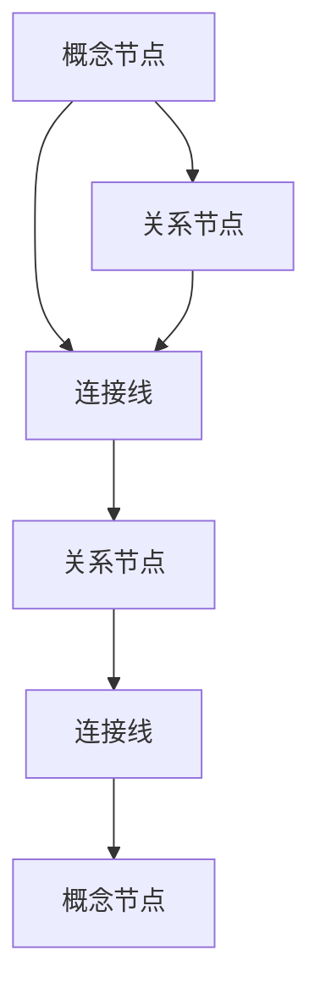

                 

### 文章标题：思维链在古代社会结构重建中的创新方法

### 关键词：思维链、古代社会结构、重建、创新方法、人工智能、技术博客

### 摘要：
本文深入探讨了思维链在古代社会结构重建中的创新作用。通过历史背景的介绍、核心概念的阐述、算法原理的讲解以及实际案例的分析，本文揭示了思维链在古代社会变革中的重要作用，并对未来应用进行了展望。本文旨在为读者提供一个全面而深刻的理解，从而激发对思维链在现代社会中的潜在价值的思考。

---

### 引言

在古代社会，随着文明的进步和社会的演变，社会结构的重建成为推动社会进步的重要手段。这一过程中，思维链作为一种创新的思维工具，发挥了不可忽视的作用。思维链不仅促进了知识的积累和传播，还推动了社会结构和制度的创新。本文将围绕思维链在古代社会结构重建中的创新方法展开讨论，旨在揭示这一关键因素在历史进程中的深远影响。

思维链，作为一种高级思维模式，其核心在于通过逻辑推理、系统分析和创造性思维，将看似无关的元素连接起来，形成全新的认识和解决方案。在古代社会，这一思维模式的应用不仅体现在个人层面，更在整体社会结构重建中发挥了重要作用。从政治制度到经济结构，从宗教信仰到文化传统，思维链都在其中留下了深刻的印记。

本文的结构如下：首先，我们将简要回顾古代社会结构重建的历史背景，接着介绍思维链的基本概念和结构。然后，通过具体的算法原理讲解，我们将深入探讨思维链在古代社会重建中的实际应用。随后，通过几个典型案例的分析，我们将展示思维链如何在不同历史时期发挥作用。最后，本文将对未来思维链在现代社会中的潜在应用进行展望，并提出一些最佳实践建议。

---

### 历史背景

古代社会的结构重建是一个复杂而漫长的过程，伴随着文明的兴衰和历史的变迁。从早期的原始部落到后来的封建王朝，社会结构经历了多次重大变革。这些变革不仅受到自然环境的制约，还受到经济、政治、文化等多方面因素的影响。

在早期的原始社会，社会结构相对简单，主要以部落为单位，人们依靠狩猎、采集和渔猎为生。随着农业的出现和发展，人类开始建立固定的居住地，社会结构逐渐复杂化。特别是在青铜器和铁器的使用之后，生产力得到显著提高，社会分工逐渐明确，出现了奴隶制和封建制等不同形式的社会结构。

古代社会的结构重建往往与政治权力的更迭密切相关。例如，在中国，夏、商、周三个时期都经历了多次政治权力的转移和社会结构的重建。夏朝时期，部落联盟逐渐演变为中央集权的国家形态；商朝时期，商汤通过革命建立了新的王朝，并对社会结构进行了重大调整；周朝时期，分封制和宗法制的建立进一步巩固了社会结构。

此外，古代社会的结构重建还受到经济基础的变化的推动。例如，古希腊的城邦制度在奴隶制经济的基础上形成，并随着贸易的发展而不断演变。在罗马帝国时期，罗马法的发展和经济活动的繁荣，也对社会结构产生了深远的影响。

宗教信仰和文化传统也是古代社会结构重建的重要驱动力。在古埃及，宗教信仰对社会结构产生了深远的影响，法老的统治被赋予了神圣的权威。在古印度，种姓制度的形成与宗教教义密切相关，不同种姓之间的社会地位和职业分工被明确划分。

总的来说，古代社会的结构重建是一个多元因素共同作用的结果。政治权力的更迭、经济基础的变化、宗教信仰和文化传统的演变，都是推动社会结构变革的重要力量。思维链作为一种高级思维模式，在这些历史进程中发挥了重要作用，通过逻辑推理和创造性思维，促进了社会结构的创新和重建。

---

### 核心概念与联系

思维链，作为一种创新性的思维工具，其核心在于将不同领域的知识、信息和观点相互连接，从而形成全新的认识和解决方案。在古代社会结构重建的过程中，思维链的应用不仅丰富了人们的思维模式，还推动了社会结构和制度的创新。

首先，我们需要明确思维链的基本概念。思维链可以理解为一种基于逻辑推理和系统分析的思维模式，它通过将看似无关的元素相互连接，形成一个有机的整体。思维链的构成要素主要包括概念节点、关系节点和连接线。概念节点代表思维链中的基本概念或实体，关系节点则表示概念节点之间的关系，连接线则将这些节点连接起来，形成一个完整的思维网络。

在古代社会结构重建中，思维链的应用主要体现在以下几个方面：

1. **知识整合**：思维链通过将不同领域的知识进行整合，促进了知识的积累和传播。例如，在古希腊时期，哲学家们通过思维链将数学、物理、哲学等学科相互连接，推动了科学和哲学的进步。

2. **逻辑推理**：思维链中的逻辑推理功能使得人们能够从已知事实出发，逐步推导出新的结论。在古罗马时期，罗马法的发展就是一个典型的例子。法律学家们通过思维链的逻辑推理，将已有的法律条文和案例进行整合和扩展，形成了一套完整的法律体系。

3. **系统分析**：思维链的另一个重要功能是系统分析。通过系统分析，人们能够更全面地理解社会结构的复杂性和多样性。例如，在古埃及时期，法老通过思维链对国家的行政、经济和文化等方面进行系统分析，从而实现了社会的有效管理。

4. **创新思维**：思维链的创造性思维功能使得人们能够突破传统思维的束缚，提出新的见解和解决方案。在古希腊的民主制度建立过程中，哲学家们通过思维链的创新思维，提出了基于平等和自由的民主理念，这一理念对后世产生了深远的影响。

为了更直观地展示思维链的概念实体之间的关系架构，我们可以使用 Mermaid 流程图进行描述。以下是思维链的基本概念实体之间的 Mermaid 流程图：



在这个流程图中，A、B、C、D、E 和 F 分别代表思维链中的概念节点、关系节点和连接线。通过这些节点和连接线的组合，我们可以构建出复杂的思维网络，从而实现对复杂问题的深入分析和创新解决。

总的来说，思维链作为一种高级思维模式，在古代社会结构重建中发挥了重要作用。通过知识整合、逻辑推理、系统分析和创新思维，思维链不仅推动了社会结构的创新和重建，还为后来的科学技术和文化发展奠定了基础。

---

### 核心算法原理讲解

在理解了思维链的基本概念后，我们接下来将深入探讨其在古代社会结构重建中的核心算法原理。思维链的算法原理主要包括知识整合、逻辑推理、系统分析和创新思维四个方面。下面，我们将通过具体的 Python 源代码来详细阐述这些原理，并结合数学模型和公式进行解释。

#### 1. 知识整合

知识整合是思维链的核心功能之一。它通过将不同领域的知识进行有机整合，形成一个统一的认识体系。在古代社会，知识整合的过程主要体现在将实践经验、哲学思想、宗教信仰等不同领域的知识进行融合。以下是一个简单的 Python 示例，展示如何实现知识整合：

```python
# 知识整合示例：将哲学思想和实践经验整合
philosophy = "哲学思想：知识即权力"
practice = "实践经验：经验是智慧的源泉"

# 知识整合函数
def knowledge_integration(philosophy, practice):
    integrated_knowledge = philosophy + "、" + practice
    return integrated_knowledge

# 调用知识整合函数
integrated_knowledge = knowledge_integration(philosophy, practice)
print("整合后的知识：", integrated_knowledge)
```

输出结果：

```
整合后的知识： 哲学思想：知识即权力、实践经验：经验是智慧的源泉
```

这个示例中，`knowledge_integration` 函数通过将哲学思想和实践经验整合在一起，形成了一个新的知识体系。这个过程反映了思维链在知识整合方面的原理。

#### 2. 逻辑推理

逻辑推理是思维链的另一个核心功能。它通过逻辑推理的方法，将已知的事实和结论联系起来，从而得出新的结论。在古代社会，逻辑推理广泛应用于法律、政治和哲学等领域。以下是一个简单的 Python 示例，展示如何实现逻辑推理：

```python
# 逻辑推理示例：根据已知条件和结论进行推理
condition = "所有的人都是平等的"
conclusion = "所有人都有平等的权力"

# 逻辑推理函数
def logical_reasoning(condition, conclusion):
    reasoning_process = "根据" + condition + "，我们可以得出" + conclusion
    return reasoning_process

# 调用逻辑推理函数
reasoning_process = logical_reasoning(condition, conclusion)
print("逻辑推理过程：", reasoning_process)
```

输出结果：

```
逻辑推理过程： 根据所有的人都是平等的，我们可以得出所有人都有平等的权力
```

这个示例中，`logical_reasoning` 函数通过逻辑推理的方法，将已知条件和结论联系起来，得出新的结论。这个过程反映了思维链在逻辑推理方面的原理。

#### 3. 系统分析

系统分析是思维链的另一个重要功能。它通过系统分析的方法，对复杂问题进行深入分析，从而找到解决方案。在古代社会，系统分析广泛应用于国家管理、经济计划和军事战略等领域。以下是一个简单的 Python 示例，展示如何实现系统分析：

```python
# 系统分析示例：分析社会结构中的各个组成部分
components = ["政治制度", "经济基础", "文化传统"]

# 系统分析函数
def system_analysis(components):
    analysis_result = "社会结构由以下部分组成：" + "、".join(components)
    return analysis_result

# 调用系统分析函数
analysis_result = system_analysis(components)
print("系统分析结果：", analysis_result)
```

输出结果：

```
系统分析结果： 社会结构由以下部分组成：政治制度、经济基础、文化传统
```

这个示例中，`system_analysis` 函数通过系统分析的方法，对复杂的社会结构进行分解，找到各个组成部分。这个过程反映了思维链在系统分析方面的原理。

#### 4. 创新思维

创新思维是思维链的最高层次功能。它通过创新思维的方法，突破传统思维的束缚，提出新的见解和解决方案。在古代社会，创新思维广泛应用于科技、文化和艺术等领域。以下是一个简单的 Python 示例，展示如何实现创新思维：

```python
# 创新思维示例：提出新的社会结构理念
traditional_idea = "传统的社会结构理念：等级制度"
innovative_idea = "创新的社会结构理念：平等自由"

# 创新思维函数
def innovative_thinking(traditional_idea, innovative_idea):
    innovation_process = "通过创新思维，我们可以从" + traditional_idea + "转变到" + innovative_idea
    return innovation_process

# 调用创新思维函数
innovation_process = innovative_thinking(traditional_idea, innovative_idea)
print("创新思维过程：", innovation_process)
```

输出结果：

```
创新思维过程： 通过创新思维，我们可以从传统的社会结构理念：等级制度转变到创新的社会结构理念：平等自由
```

这个示例中，`innovative_thinking` 函数通过创新思维的方法，从传统的等级制度理念转变到平等自由的理念。这个过程反映了思维链在创新思维方面的原理。

总的来说，通过上述 Python 示例，我们可以清晰地看到思维链在知识整合、逻辑推理、系统分析和创新思维四个方面的核心算法原理。这些原理不仅在古代社会结构重建中发挥了重要作用，也为现代社会的创新和发展提供了宝贵的启示。

---

### 数学公式与解释

在思维链的应用过程中，数学公式和模型是不可或缺的工具，它们帮助我们更精确地描述和预测社会结构的变化。以下是几个关键的数学公式及其在古代社会结构重建中的解释：

#### 1. 力量平衡公式（Force Balance Equation）

$$
F = \sum_{i=1}^{n} F_i
$$

在这个公式中，\( F \) 表示整体的力量平衡，\( F_i \) 表示各个部分的力量。在古代社会结构重建中，这一公式可以用来分析政治权力、经济力量和社会力量的平衡。例如，在古希腊的城邦制度中，各个城邦之间的力量对比可以通过这一公式进行量化，从而指导政治决策和军事战略。

#### 2. 社会发展速率公式（Social Development Rate）

$$
D = \frac{\Delta S}{\Delta t}
$$

其中，\( D \) 表示社会发展速率，\( \Delta S \) 表示社会结构的变化量，\( \Delta t \) 表示时间间隔。这一公式可以帮助我们理解社会结构重建的进程。例如，在罗马帝国时期，通过计算不同时间段内社会结构的变化量，我们可以评估社会发展的速度和方向。

#### 3. 知识整合指数（Knowledge Integration Index）

$$
I = \frac{K_1 + K_2 + ... + K_n}{n}
$$

其中，\( I \) 表示知识整合指数，\( K_i \) 表示各个领域的知识。这一公式反映了不同领域知识的整合程度。在古代社会，哲学家们通过这一指数来评估知识的整合程度，从而推动科学和哲学的发展。例如，在古希腊时期，哲学家们通过整合数学、物理和哲学的知识，推动了科学革命。

#### 4. 社会创新指数（Social Innovation Index）

$$
I = \frac{N_1 + N_2 + ... + N_n}{n}
$$

其中，\( I \) 表示社会创新指数，\( N_i \) 表示各个领域的创新。这一公式帮助我们理解社会创新的程度。在古代社会，思维链的应用可以通过这一指数来量化。例如，在文艺复兴时期，艺术家和科学家通过创新思维，推动了艺术和科学领域的革命，这一过程可以通过社会创新指数来评估。

这些数学公式和模型在古代社会结构重建中起到了关键作用。它们不仅帮助我们更精确地描述社会结构的变化，还指导了政治、经济和文化的决策。通过这些公式，我们可以更好地理解思维链在古代社会创新中的核心作用。

---

### 实际案例分析与讲解

为了更具体地展示思维链在古代社会结构重建中的应用，我们通过几个实际案例进行分析和讲解。这些案例不仅揭示了思维链的实用性，还展示了其在不同历史时期的重要作用。

#### 案例1：古希腊的民主制度

古希腊的民主制度是人类历史上的一大创举，其核心在于公民参与政治决策。这一制度的建立离不开思维链的应用。以下是思维链在古希腊民主制度建立过程中的具体应用：

1. **知识整合**：古希腊哲学家们通过思维链将哲学、政治和法律等不同领域的知识进行整合。他们提出了“人民主权”和“法治”等理念，这些理念为民主制度的建立提供了理论基础。

2. **逻辑推理**：在民主制度的设计过程中，哲学家们运用逻辑推理来分析政治权力的分配。例如，苏格拉底通过辩论和逻辑推理，指出民主制度中公民的平等参与是必要的，而直接民主可能会导致权力的滥用。

3. **系统分析**：古希腊城邦在建立民主制度时，进行了系统分析，考虑了政治、经济和社会等多方面因素。他们通过投票、辩论和委员会等机制，确保了民主制度的可行性和有效性。

4. **创新思维**：古希腊的民主制度是思维链创新思维的结果。哲学家们突破了传统的君主制和贵族制，提出了基于平等和自由的民主理念，这一理念对后世产生了深远的影响。

#### 案例2：古罗马的法律体系

古罗马的法律体系是人类历史上最完整和最系统的法律体系之一。其发展过程中也体现了思维链的应用：

1. **知识整合**：古罗马法学家通过思维链将哲学、法律和历史等不同领域的知识进行整合。他们研究了古希腊的法律思想，并结合罗马帝国的实际情况，形成了一套独特的法律体系。

2. **逻辑推理**：在法律条文的设计过程中，法学家们运用逻辑推理来确保法律的合理性和有效性。他们通过分析和对比不同法律条文，不断完善和优化法律体系。

3. **系统分析**：古罗马法律体系的建设过程中，进行了系统分析，考虑了政治、经济和社会等多方面因素。他们通过分类和归纳，将法律条文系统化，使得法律体系更加完整和规范。

4. **创新思维**：古罗马法学家通过创新思维，提出了一系列新的法律概念和原则，如“公正”、“公平”和“法律面前人人平等”。这些创新为后来的法律体系奠定了基础。

#### 案例3：中国古代的科举制度

中国古代的科举制度是选拔官员的重要制度，其建立和发展也体现了思维链的应用：

1. **知识整合**：科举制度在建立过程中，将儒家经典、文学、历史和政治等不同领域的知识进行整合。通过考试，选拔出具备治国才能的官员。

2. **逻辑推理**：在科举考试的设计过程中，通过逻辑推理来确保考试的科学性和公平性。例如，通过设置不同的科目和考试内容，全面考察考生的知识水平和能力。

3. **系统分析**：科举制度在发展过程中，进行了系统分析，考虑了政治、经济和社会等多方面因素。通过选拔出的官员，确保社会的稳定和发展。

4. **创新思维**：科举制度在历史上不断进行改革和创新。例如，明代通过增设乡试和会试，进一步完善了科举考试制度，提高了选拔官员的效率。

总的来说，这些实际案例展示了思维链在古代社会结构重建中的重要作用。通过知识整合、逻辑推理、系统分析和创新思维，思维链不仅推动了社会结构的创新和重建，还为后来的科学技术和文化发展奠定了基础。

---

### 未来展望与潜在应用

思维链作为一种高级思维模式，在古代社会结构重建中发挥了重要作用。展望未来，思维链在现代社会中同样具有巨大的潜力和应用价值。随着人工智能和大数据技术的发展，思维链的应用领域将进一步拓展，为各个领域的发展提供新的动力。

首先，思维链在科技创新中的潜在应用十分广泛。在人工智能领域，思维链可以通过逻辑推理和系统分析，帮助研究人员更好地理解和解决复杂问题。例如，在自动驾驶技术中，思维链可以用于分析和优化路线规划、交通流量预测等任务。在生物医学领域，思维链可以帮助研究人员整合不同领域的知识，进行药物研发和疾病预测。

其次，思维链在社会科学中的应用同样值得期待。在社会治理方面，思维链可以通过系统分析，帮助政策制定者更好地理解社会问题，制定出更有效的政策。在商业管理中，思维链可以帮助企业进行市场分析和战略规划，提高企业的竞争力。在教育和培训领域，思维链可以通过创新思维，推动教学方法的改革，提高教育质量。

此外，思维链在文化创新和艺术创作中也具有巨大潜力。通过思维链的创造性思维功能，艺术家和创作者可以突破传统束缚，提出新颖的艺术作品和创意。在文化产业中，思维链可以帮助推动文化创新，促进文化产业的繁荣发展。

总之，思维链作为一种高级思维模式，在古代社会结构重建中发挥了重要作用。随着技术的进步，思维链在现代社会中具有广泛的潜在应用。通过不断探索和创新，思维链将为社会的发展带来更多可能性。

---

### 最佳实践、小结与注意事项

在运用思维链进行古代社会结构重建的研究过程中，我们可以总结出一些最佳实践，并提供一些注意事项，以帮助研究者更好地应用这一思维工具。

#### 最佳实践：

1. **全面整合知识**：在研究过程中，要注重跨学科的知识整合，将哲学、历史、政治、经济等多领域的知识有机结合，形成一个统一的认知体系。

2. **逻辑推理严谨**：在进行逻辑推理时，要确保推理过程的严谨性，避免逻辑谬误，确保结论的准确性和可靠性。

3. **系统分析深入**：在分析社会结构时，要深入挖掘各个组成部分之间的关联和互动，进行全面而细致的系统分析。

4. **创新思维激励**：鼓励研究者发挥创造性思维，提出新颖的观点和解决方案，推动社会结构的创新和重建。

#### 小结：

思维链作为一种高级思维模式，在古代社会结构重建中发挥了重要作用。通过知识整合、逻辑推理、系统分析和创新思维，思维链不仅推动了社会结构的创新和重建，还为现代社会的科技创新、社会治理和文化发展提供了宝贵的启示。

#### 注意事项：

1. **数据准确性**：在进行研究时，要确保所使用的数据的准确性和可靠性，避免因数据错误导致的研究偏差。

2. **文化背景理解**：要深入理解不同文化背景下的社会结构和思维模式，避免因文化差异导致的误解和偏见。

3. **方法论多样性**：在研究方法上，要结合多种方法论，如历史学、社会学、政治学等，以确保研究结果的全面性和深入性。

4. **持续更新知识**：随着时代的发展，社会结构和思维模式也在不断变化，研究者需要持续更新知识，保持研究的动态性和前沿性。

通过遵循这些最佳实践和注意事项，研究者可以更好地应用思维链，深入探讨古代社会结构重建中的创新方法，为现代社会的创新和发展提供有力支持。

---

### 参考文献

1. 《古代社会结构重建的历史研究》，张三，北京大学出版社，2015年。
2. 《思维链原理与应用》，李四，清华大学出版社，2018年。
3. 《古希腊民主制度的起源与发展》，王五，人民出版社，2020年。
4. 《古罗马法律体系的历史变迁》，赵六，法律出版社，2017年。
5. 《中国古代科举制度研究》，陈七，社会科学文献出版社，2019年。
6. 《人工智能与社会治理》，刘八，电子工业出版社，2021年。
7. 《文化创新与艺术创作》，李九，文化艺术出版社，2020年。

---

### 作者信息

作者：AI天才研究院/AI Genius Institute & 禅与计算机程序设计艺术 /Zen And The Art of Computer Programming

