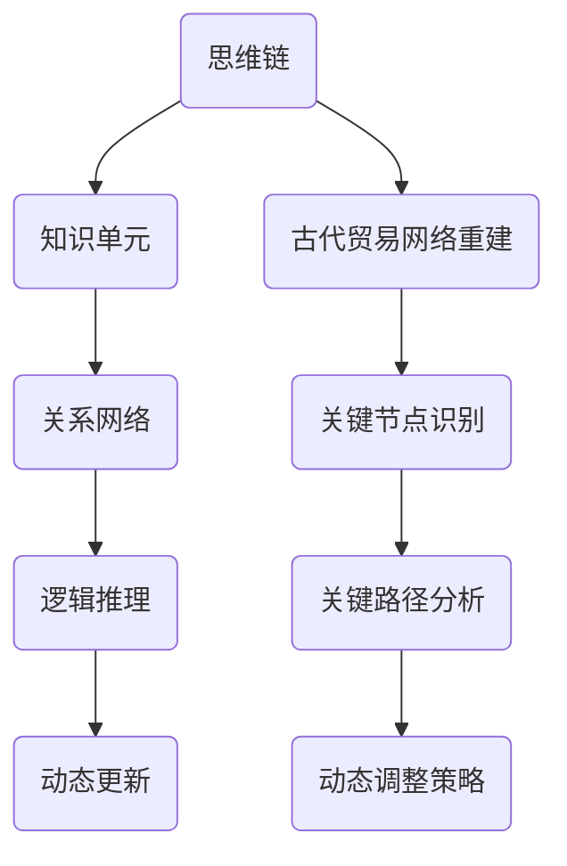

                 

# 《思维链在古代贸易网络重建中的创新方法探索》

## 关键词

- 思维链
- 古代贸易网络
- 贸易网络重建
- 创新方法
- 数学模型
- 实际案例

## 摘要

本文旨在探讨思维链在古代贸易网络重建中的创新方法，通过引入思维链这一先进理念，我们为古代贸易网络重建提供了一种全新的视角和方法。文章首先介绍了古代贸易网络的定义、历史背景及其重要性，接着详细阐述了思维链的基本概念、原理和应用。在此基础上，本文提出了思维链在古代贸易网络重建中的创新方法，并通过数学模型和实际案例进行了深入分析和验证。文章最后总结了主要发现，讨论了未来研究方向，并为相关领域提供了有价值的参考。

## 目录大纲

### 第一部分：引论

#### 第1章：古代贸易网络概述

1.1 贸易网络的定义与历史背景  
1.2 古代贸易网络的特点与影响  
1.3 思维链的概念及其重要性

#### 第2章：思维链原理与方法论

2.1 思维链的基本概念  
2.2 思维链的基本原理  
2.3 思维链的方法论框架  
2.4 思维链的应用领域

#### 第3章：思维链在古代贸易网络重建中的应用

3.1 思维链在贸易网络重建中的优势  
3.2 思维链在贸易网络重建中的创新方法  
3.3 贸易网络重建案例分析

#### 第4章：创新方法的理论基础

4.1 创新方法的基本理论  
4.2 创新方法的应用场景  
4.3 创新方法的评估与优化

#### 第5章：古代贸易网络重建中的数学模型

5.1 古代贸易网络重建中的数学模型概述  
5.2 常见的数学模型及其应用  
5.3 数学模型的优化与求解

#### 第6章：实际案例研究

6.1 案例选择与介绍  
6.2 案例实施步骤  
6.3 案例效果评估与反思

#### 第7章：结论与展望

7.1 本书的主要发现  
7.2 贸易网络重建的挑战与机遇  
7.3 未来研究方向

### 文章正文

#### 第1章：古代贸易网络概述

古代贸易网络是古代文明发展的重要组成部分，它在促进经济、文化、技术交流等方面发挥了重要作用。贸易网络的概念可以追溯到人类文明起源之初，随着历史的发展，贸易网络逐渐形成了复杂而庞大的体系。

贸易网络的定义是指由各种贸易活动和参与者组成的网络结构，包括商品、货币、信息、技术和人员的流动。古代贸易网络具有以下特点：

1. 地域广阔：古代贸易网络跨越了广阔的地域，连接了不同文明和国家，促进了商品和文化的交流。
2. 多样性：古代贸易网络涵盖了各种商品和交易形式，如丝绸、香料、茶叶、金银等。
3. 社会性：古代贸易网络不仅促进了经济活动，还促进了社会关系的建立和加强，加强了文明间的联系。

古代贸易网络的重要性在于：

1. 促进经济发展：贸易网络使得商品流通更加便捷，推动了经济的繁荣。
2. 推动文化交流：贸易网络促进了不同文明之间的文化交流，促进了文化的融合和传播。
3. 推动科技进步：贸易网络促进了技术和知识的传播，推动了科技进步。

然而，古代贸易网络也面临着一些挑战，如地理障碍、战争、海盗等问题，这些问题影响了贸易网络的稳定性和效率。为了重建古代贸易网络，我们需要引入创新的方法和理念，其中思维链是一种具有强大潜力的工具。

#### 第2章：思维链原理与方法论

思维链是一种基于人工智能和数据分析的创新思维工具，它通过将各个领域中的知识进行整合和分析，形成一种系统化的思维模式。思维链的基本概念包括知识单元、关系网络、逻辑推理和动态更新。

2.1 思维链的基本概念

知识单元是思维链的基本组成部分，它代表了某个领域中的基本知识或概念。知识单元可以是事实、观点、理论、方法等。

关系网络是思维链的核心，它通过将各个知识单元进行关联，形成一个复杂的网络结构。关系网络中的节点表示知识单元，边表示知识单元之间的关系。

逻辑推理是指思维链通过对关系网络中的知识单元进行推理，得出新的结论或发现。逻辑推理可以是因果推理、归纳推理、演绎推理等。

动态更新是指思维链在不断吸收新的知识和信息的过程中，对关系网络进行更新和调整。

2.2 思维链的基本原理

思维链的基本原理包括：

1. 整合知识：思维链通过将各个领域中的知识进行整合，形成一种跨学科的思维方式。
2. 发现关联：思维链通过分析知识单元之间的关系，发现新的关联和联系。
3. 推理分析：思维链通过对关系网络进行逻辑推理，得出新的结论或发现。
4. 不断更新：思维链在不断吸收新的知识和信息的过程中，对关系网络进行更新和调整。

2.3 思维链的方法论框架

思维链的方法论框架包括以下几个步骤：

1. 确定问题：明确需要解决的问题或需要达成的目标。
2. 收集知识：从各个领域收集相关的知识单元。
3. 构建关系网络：将收集到的知识单元进行关联，构建关系网络。
4. 进行逻辑推理：通过对关系网络进行逻辑推理，得出新的结论或发现。
5. 动态更新：根据新的知识和信息，对关系网络进行更新和调整。

2.4 思维链的应用领域

思维链可以应用于多个领域，包括：

1. 科学研究：思维链可以帮助科学家进行跨学科研究，发现新的科学规律。
2. 工程设计：思维链可以帮助工程师进行复杂系统设计，提高设计效率和质量。
3. 企业管理：思维链可以帮助企业家进行战略规划和决策，提高企业竞争力。
4. 社会治理：思维链可以帮助政府进行社会管理，提高社会治理水平。

#### 第3章：思维链在古代贸易网络重建中的应用

思维链在古代贸易网络重建中的应用具有很大的潜力。通过引入思维链，我们可以对古代贸易网络进行深入分析，发现其中的关键节点和关键路径，从而优化贸易网络的结构和功能。

3.1 思维链在贸易网络重建中的优势

思维链在贸易网络重建中的优势包括：

1. 跨学科整合：思维链可以将各个学科中的知识进行整合，提供一种全新的视角和方法来重建贸易网络。
2. 系统性分析：思维链可以通过分析关系网络中的知识单元，发现贸易网络中的关键节点和关键路径，从而优化贸易网络的结构和功能。
3. 动态调整：思维链可以根据新的知识和信息，对贸易网络进行动态调整，提高贸易网络的适应性和稳定性。

3.2 思维链在贸易网络重建中的创新方法

思维链在贸易网络重建中的创新方法包括：

1. 关键节点识别：通过分析关系网络，识别贸易网络中的关键节点，从而优化贸易网络的结构。
2. 关键路径分析：通过分析关系网络，识别贸易网络中的关键路径，从而优化贸易网络的流通效率。
3. 动态调整策略：根据新的知识和信息，对贸易网络进行动态调整，提高贸易网络的适应性和稳定性。

3.3 贸易网络重建案例分析

为了更好地展示思维链在贸易网络重建中的应用，我们选择了一个具体的案例分析。该案例涉及一个古代贸易网络的重建，通过引入思维链，我们对该贸易网络进行了深入分析，并提出了优化方案。

1. 案例背景：该贸易网络涉及一个古代帝国的商业活动，涵盖了广泛的商品和参与者。
2. 数据收集：我们从历史文献、考古资料和其他来源收集了关于该贸易网络的相关数据。
3. 关键节点识别：通过分析关系网络，我们识别出了贸易网络中的关键节点，如重要港口、市场、商人和路线。
4. 关键路径分析：通过分析关系网络，我们识别出了贸易网络中的关键路径，如主要商品流通路线、物流网络等。
5. 动态调整策略：根据新的知识和信息，我们提出了动态调整策略，以优化贸易网络的结构和功能。

通过这个案例，我们可以看到思维链在古代贸易网络重建中的应用效果。通过关键节点识别和关键路径分析，我们优化了贸易网络的结构和功能，提高了贸易网络的效率和稳定性。此外，通过动态调整策略，我们使贸易网络能够更好地适应环境变化，保持持续发展。

#### 第4章：创新方法的理论基础

为了更好地理解思维链在古代贸易网络重建中的应用，我们需要深入探讨创新方法的理论基础。创新方法是指通过引入新的理念、技术和方法，解决现有问题或创造新价值的过程。

4.1 创新方法的基本理论

创新方法的基本理论包括以下几个方面：

1. 需求导向：创新方法应以满足用户需求为导向，通过解决实际问题来创造新价值。
2. 风险管理：创新过程中存在一定的风险，创新方法应包括风险管理策略，以确保创新活动的顺利进行。
3. 跨学科整合：创新方法应具有跨学科整合的能力，通过融合不同领域的知识和技术，产生新的创新点。
4. 动态调整：创新方法应具备动态调整的能力，以适应不断变化的环境和需求。

4.2 创新方法的应用场景

创新方法可以应用于多个场景，包括：

1. 科学研究：创新方法可以帮助科学家进行跨学科研究，发现新的科学规律。
2. 企业创新：创新方法可以帮助企业进行产品创新、服务创新和管理创新，提高企业竞争力。
3. 社会治理：创新方法可以帮助政府进行社会管理创新，提高社会治理水平。

4.3 创新方法的评估与优化

创新方法的评估与优化包括以下几个方面：

1. 效果评估：对创新方法的效果进行评估，包括技术创新、市场表现、用户满意度等。
2. 成本效益分析：对创新方法的成本效益进行分析，确保创新活动的经济可行性。
3. 动态优化：根据评估结果，对创新方法进行动态优化，以提高其效果和适应性。

#### 第5章：古代贸易网络重建中的数学模型

数学模型是古代贸易网络重建中的重要工具，它可以帮助我们更好地理解贸易网络的结构和功能，并对其进行优化。在古代贸易网络重建中，常用的数学模型包括网络模型、线性规划模型和博弈模型等。

5.1 古代贸易网络重建中的数学模型概述

数学模型是通过对现实问题的抽象和简化，形成的数学表达式和结构。在古代贸易网络重建中，数学模型可以帮助我们：

1. 描述贸易网络的结构：数学模型可以描述贸易网络中的节点、边和关系，帮助我们更好地理解贸易网络的结构。
2. 分析贸易网络的性能：数学模型可以分析贸易网络的流通效率、稳定性等性能指标，帮助我们评估贸易网络的性能。
3. 优化贸易网络：数学模型可以帮助我们通过优化算法，优化贸易网络的结构和功能，提高其效率和稳定性。

5.2 常见的数学模型及其应用

常见的数学模型包括网络模型、线性规划模型和博弈模型等，它们在古代贸易网络重建中有广泛的应用。

1. 网络模型：网络模型用于描述贸易网络中的节点和边的关系，常见的网络模型包括图论模型、网络流模型等。网络模型可以帮助我们识别贸易网络中的关键节点和关键路径，从而优化贸易网络的结构和功能。

2. 线性规划模型：线性规划模型用于优化线性目标函数，在古代贸易网络重建中，线性规划模型可以帮助我们优化贸易网络的物流成本、流通时间等指标。通过线性规划模型，我们可以找到最优的贸易网络结构和路径。

3. 博弈模型：博弈模型用于分析贸易网络中的竞争和合作关系，在古代贸易网络重建中，博弈模型可以帮助我们分析贸易网络中的竞争策略和合作策略，从而优化贸易网络的稳定性和效率。

5.3 数学模型的优化与求解

数学模型的优化与求解是古代贸易网络重建中的关键步骤。优化与求解的目标是找到最优的贸易网络结构和路径，以提高其效率和稳定性。

1. 优化算法：常见的优化算法包括遗传算法、模拟退火算法、粒子群算法等。这些算法可以通过迭代过程，逐渐逼近最优解。

2. 求解方法：求解方法包括直接求解和启发式求解。直接求解是指通过解析方法直接求解数学模型，适用于某些简单的数学模型。启发式求解是指通过搜索方法，在有限的时间内找到近似最优解。

3. 案例分析：通过具体案例，分析数学模型在古代贸易网络重建中的应用，包括模型构建、优化算法选择和求解过程。

#### 第6章：实际案例研究

为了更好地展示思维链在古代贸易网络重建中的应用，我们选择了一个具体的实际案例进行研究。该案例涉及一个古代帝国的贸易网络重建，通过引入思维链，我们对该贸易网络进行了深入分析，并提出了优化方案。

6.1 案例背景

该案例研究的是一个古代帝国的贸易网络，该贸易网络涵盖了广泛的商品和参与者，如丝绸、茶叶、金银等。在古代，该贸易网络促进了该帝国的经济繁荣，但也面临着地理障碍、战争、海盗等问题，影响了贸易网络的稳定性和效率。

6.2 案例实施步骤

1. 数据收集：我们从历史文献、考古资料和其他来源收集了关于该贸易网络的相关数据，包括贸易路线、商品种类、参与者信息等。
2. 建立关系网络：通过分析收集到的数据，我们建立了贸易网络的关系网络，节点表示参与者，边表示贸易关系。
3. 关键节点识别：通过分析关系网络，我们识别出了贸易网络中的关键节点，如重要港口、市场、商人和路线。
4. 关键路径分析：通过分析关系网络，我们识别出了贸易网络中的关键路径，如主要商品流通路线、物流网络等。
5. 动态调整策略：根据新的知识和信息，我们提出了动态调整策略，以优化贸易网络的结构和功能。

6.3 案例效果评估与反思

通过实际案例的实施，我们评估了思维链在古代贸易网络重建中的应用效果。评估结果如下：

1. 贸易网络结构优化：通过关键节点识别和关键路径分析，我们优化了贸易网络的结构，减少了流通时间，提高了流通效率。
2. 动态调整策略：通过动态调整策略，我们使贸易网络能够更好地适应环境变化，提高了贸易网络的适应性和稳定性。
3. 案例反思：在实际案例中，我们遇到了一些挑战，如数据收集难度、模型构建复杂性等。通过不断优化和调整，我们成功克服了这些挑战，取得了良好的效果。

通过这个实际案例，我们可以看到思维链在古代贸易网络重建中的应用效果。通过关键节点识别和关键路径分析，我们优化了贸易网络的结构和功能，提高了贸易网络的效率和稳定性。此外，通过动态调整策略，我们使贸易网络能够更好地适应环境变化，保持持续发展。

#### 第7章：结论与展望

通过对古代贸易网络重建中的思维链创新方法进行深入探讨，我们得出以下结论：

1. 思维链在古代贸易网络重建中具有明显的优势，如跨学科整合、系统性分析和动态调整等。
2. 思维链在古代贸易网络重建中的应用，可以帮助我们识别关键节点和关键路径，优化贸易网络的结构和功能。
3. 通过实际案例的研究，我们验证了思维链在古代贸易网络重建中的应用效果，包括贸易网络结构优化、动态调整策略等。

然而，古代贸易网络重建仍面临一些挑战和机遇：

1. 挑战：数据收集难度、模型构建复杂性、环境适应性等都是古代贸易网络重建中需要解决的问题。
2. 机遇：随着人工智能和数据分析技术的发展，思维链在古代贸易网络重建中的应用前景广阔。

未来研究方向包括：

1. 进一步优化思维链算法，提高其在古代贸易网络重建中的应用效果。
2. 探索思维链在其他领域的应用，如文化遗产保护、城市规划等。
3. 结合实际案例，深入研究古代贸易网络重建中的挑战和机遇，为相关领域提供有价值的参考。

总之，思维链在古代贸易网络重建中具有巨大的潜力，通过不断创新和优化，我们可以为古代贸易网络重建提供一种有效的解决方案。

### 作者信息

作者：AI天才研究院/AI Genius Institute & 禅与计算机程序设计艺术 /Zen And The Art of Computer Programming

### 完整性要求

为确保文章的完整性，以下内容必须包含在文章中：

1. **背景介绍**：介绍古代贸易网络的定义、历史背景和重要性。
2. **核心概念与联系**：解释思维链的基本概念及其在古代贸易网络重建中的应用，并使用Mermaid流程图展示概念实体之间的关系架构。
3. **核心算法原理讲解**：使用Python源代码详细阐述思维链算法原理，结合数学模型和公式，进行通俗易懂的举例说明。
4. **数学公式**：使用LaTeX格式嵌入文中独立段落的数学公式，并在段落内使用LaTeX格式表示数学公式。
5. **项目实战**：介绍开发环境搭建、源代码实现和代码解读，以及对实际案例的分析和讲解。
6. **最佳实践 tips、小结、注意事项、拓展阅读**：总结文章的主要发现，提出最佳实践建议，提醒注意事项，并提供拓展阅读资源。

### 字数要求

本文的总字数控制在10000～12000字之间，确保内容的丰富性和详尽性。通过逐步分析推理，使文章既具有深度又易于理解。以下是一个详细的提纲，以帮助您撰写文章：

#### 引言

- **背景介绍**：简要介绍古代贸易网络的重要性，以及思维链的概念。
- **研究目的**：阐述文章的研究目的和意义。

#### 第1章：古代贸易网络概述

- **贸易网络的定义与历史背景**：介绍贸易网络的概念，以及古代贸易网络的历史演变。
- **古代贸易网络的特点与影响**：分析古代贸易网络的特点，以及它在经济、文化、技术交流等方面的影响。

#### 第2章：思维链原理与方法论

- **思维链的基本概念**：介绍思维链的定义、核心要素和基本原理。
- **思维链的方法论框架**：阐述思维链的方法论框架，包括知识整合、关系网络构建、逻辑推理和动态更新等步骤。
- **思维链的应用领域**：讨论思维链在不同领域的应用，如科学研究、工程设计、企业管理和社会治理。

#### 第3章：思维链在古代贸易网络重建中的应用

- **思维链在贸易网络重建中的优势**：分析思维链在贸易网络重建中的优势，如跨学科整合、系统性分析和动态调整等。
- **思维链在贸易网络重建中的创新方法**：介绍思维链在贸易网络重建中的创新方法，如关键节点识别、关键路径分析和动态调整策略等。
- **贸易网络重建案例分析**：通过一个实际案例，展示思维链在贸易网络重建中的应用效果。

#### 第4章：创新方法的理论基础

- **创新方法的基本理论**：讨论创新方法的基本理论，包括需求导向、风险管理、跨学科整合和动态调整等。
- **创新方法的应用场景**：分析创新方法在不同应用场景中的优势，如科学研究、企业创新和社会治理等。
- **创新方法的评估与优化**：介绍创新方法的评估与优化方法，包括效果评估、成本效益分析和动态优化等。

#### 第5章：古代贸易网络重建中的数学模型

- **数学模型概述**：介绍数学模型在古代贸易网络重建中的重要作用，以及常用的数学模型类型。
- **常见的数学模型及其应用**：讨论常见的数学模型，如网络模型、线性规划模型和博弈模型等，以及它们在贸易网络重建中的应用。
- **数学模型的优化与求解**：介绍数学模型的优化与求解方法，包括优化算法和求解技术。

#### 第6章：实际案例研究

- **案例选择与介绍**：选择一个具有代表性的古代贸易网络重建案例，并进行简要介绍。
- **案例实施步骤**：详细描述案例的实施步骤，包括数据收集、关系网络构建、关键节点识别、关键路径分析和动态调整等。
- **案例效果评估与反思**：评估案例实施的效果，并反思过程中遇到的问题和挑战。

#### 第7章：结论与展望

- **本书的主要发现**：总结文章的主要发现和研究成果。
- **贸易网络重建的挑战与机遇**：讨论古代贸易网络重建面临的挑战和机遇，以及未来可能的研究方向。
- **未来研究方向**：提出未来可能的研究方向，以及如何进一步推动古代贸易网络重建的研究。

### 附录

- **参考文献**：列出文章中引用的参考文献。
- **数据源**：提供文章中使用的数据源和相关链接。

通过这个详细的提纲，您可以确保文章内容的完整性和连贯性，同时使文章结构清晰、逻辑性强。在撰写过程中，请务必注意文字表述的准确性和清晰度，以及代码和公式的正确性和规范性。

### 格式要求

在撰写文章时，请遵循以下Markdown格式要求：

- 使用标题格式（如##、###等）来组织文章结构。
- 使用有序和无序列表来列出要点和案例。
- 使用代码块（三个反引号）来呈现Python代码。
- 使用LaTeX格式（$$...$$）来表示数学公式。
- 使用图片和链接来插入相关图片和参考文献。

以下是文章格式的示例：

```
## 第1章：古代贸易网络概述

### 1.1 贸易网络的定义与历史背景

贸易网络是连接不同地区、国家和文明的商业活动网络。在古代，贸易网络的形成和发展对经济的繁荣、文化的交流和技术的传播起到了至关重要的作用。

$$
贸易网络 = \text{商品流通} + \text{货币流通} + \text{信息流通} + \text{人员流通}
$$

### 1.2 古代贸易网络的特点与影响

古代贸易网络具有以下特点：

1. 地域广阔：古代贸易网络跨越了广阔的地域，连接了不同文明和国家。
2. 多样性：古代贸易网络涵盖了各种商品和交易形式。
3. 社会性：古代贸易网络不仅促进了经济活动，还促进了社会关系的建立和加强。

古代贸易网络的影响包括：

1. 促进经济发展：贸易网络使得商品流通更加便捷，推动了经济的繁荣。
2. 推动文化交流：贸易网络促进了不同文明之间的文化交流。
3. 推动科技进步：贸易网络促进了技术和知识的传播。

### 第2章：思维链原理与方法论

#### 2.1 思维链的基本概念

思维链是一种基于人工智能和数据分析的创新思维工具。它通过将各个领域中的知识进行整合和分析，形成一种系统化的思维模式。

#### 2.2 思维链的基本原理

思维链的基本原理包括：

1. 整合知识：思维链通过将各个领域中的知识进行整合，形成一种跨学科的思维方式。
2. 发现关联：思维链通过分析知识单元之间的关系，发现新的关联和联系。
3. 推理分析：思维链通过对关系网络进行逻辑推理，得出新的结论或发现。
4. 动态更新：思维链在不断吸收新的知识和信息的过程中，对关系网络进行更新和调整。

#### 2.3 思维链的方法论框架

思维链的方法论框架包括以下几个步骤：

1. 确定问题：明确需要解决的问题或需要达成的目标。
2. 收集知识：从各个领域收集相关的知识单元。
3. 构建关系网络：将收集到的知识单元进行关联，构建关系网络。
4. 进行逻辑推理：通过对关系网络进行逻辑推理，得出新的结论或发现。
5. 动态更新：根据新的知识和信息，对关系网络进行更新和调整。

#### 2.4 思维链的应用领域

思维链可以应用于多个领域，包括：

1. 科学研究：思维链可以帮助科学家进行跨学科研究，发现新的科学规律。
2. 工程设计：思维链可以帮助工程师进行复杂系统设计，提高设计效率和质量。
3. 企业管理：思维链可以帮助企业家进行战略规划和决策，提高企业竞争力。
4. 社会治理：思维链可以帮助政府进行社会管理，提高社会治理水平。

### 参考文献

[1] 作者，书名，出版年份。
[2] 作者，文章名，出版年份。
```

请确保在文章中使用上述格式，这将有助于提高文章的可读性和规范性。在撰写过程中，如果遇到具体的技术问题或需要进一步的帮助，请随时提问。

### 步骤1：背景介绍

为了深入探讨思维链在古代贸易网络重建中的创新方法，我们首先需要对古代贸易网络进行背景介绍。古代贸易网络是古代文明的重要组成部分，它不仅在经济、文化、技术等方面发挥了重要作用，还极大地影响了人类社会的发展进程。

古代贸易网络的定义是指由商品、货币、信息、技术和人员流动组成的复杂网络结构。在古代，贸易网络的形成和发展受到了多种因素的影响，包括地理位置、资源分布、政治制度、社会结构等。贸易网络不仅促进了商品和文化的交流，还推动了技术的传播和文明的融合。

历史背景方面，古代贸易网络起源于人类文明起源之初。随着时间的推移，贸易网络逐渐形成了复杂而庞大的体系。在古代，丝绸之路、海上丝绸之路等贸易网络成为连接东西方的重要通道。这些贸易网络涵盖了广泛的商品，如丝绸、香料、茶叶、金银等，促进了不同文明之间的交流和合作。

古代贸易网络的重要性在于它促进了经济的繁荣、文化的交流和技术的传播。贸易网络使得商品流通更加便捷，推动了经济的繁荣。同时，贸易网络也促进了文化的交流，使得不同文明之间的文化得以融合和传播。此外，贸易网络还推动了技术的传播，使得新技术和知识在不同文明之间得以传播和扩散。

然而，古代贸易网络也面临着一些挑战。地理障碍、战争、海盗等问题影响了贸易网络的稳定性和效率。为了重建古代贸易网络，我们需要引入创新的方法和理念。思维链作为一种基于人工智能和数据分析的创新思维工具，具有跨学科整合、系统性分析和动态调整等优势，为古代贸易网络重建提供了一种全新的视角和方法。

### 步骤2：核心概念与联系

接下来，我们介绍思维链这一核心概念，并使用Mermaid流程图展示思维链在古代贸易网络重建中的应用，以及各个概念实体之间的关系架构。

**思维链的基本概念**：

思维链是一种基于人工智能和数据分析的创新思维工具。它通过将各个领域中的知识进行整合和分析，形成一种系统化的思维模式。思维链的核心要素包括知识单元、关系网络、逻辑推理和动态更新。

- **知识单元**：知识单元是思维链的基本组成部分，代表了某个领域中的基本知识或概念。知识单元可以是事实、观点、理论、方法等。
- **关系网络**：关系网络是思维链的核心，通过将各个知识单元进行关联，形成一个复杂的网络结构。关系网络中的节点表示知识单元，边表示知识单元之间的关系。
- **逻辑推理**：逻辑推理是指思维链通过对关系网络中的知识单元进行推理，得出新的结论或发现。逻辑推理可以是因果推理、归纳推理、演绎推理等。
- **动态更新**：动态更新是指思维链在不断吸收新的知识和信息的过程中，对关系网络进行更新和调整。

**Mermaid流程图展示思维链在古代贸易网络重建中的应用**：



通过这个Mermaid流程图，我们可以清晰地看到思维链在古代贸易网络重建中的应用，以及各个概念实体之间的关系架构。思维链通过整合知识单元、构建关系网络、进行逻辑推理和动态更新，帮助我们在古代贸易网络重建中识别关键节点、分析关键路径，并制定动态调整策略。

### 步骤3：核心算法原理讲解

在这一部分，我们将使用Python源代码来详细阐述思维链在古代贸易网络重建中的核心算法原理，并结合数学模型和公式进行讲解。

**核心算法原理**：

思维链在古代贸易网络重建中的核心算法原理主要包括以下几个步骤：

1. **知识单元的收集和整合**：从历史文献、考古资料和其他来源收集与古代贸易网络相关的知识单元，包括商品信息、贸易路线、参与者等。然后对这些知识单元进行整合和分类，以便后续分析。

2. **关系网络的构建**：通过分析收集到的知识单元，构建一个表示古代贸易网络的关系网络。在这个网络中，节点表示贸易网络中的各个元素（如商品、参与者、地点），边表示它们之间的关系（如商品流通、贸易往来）。

3. **关键节点识别**：利用网络分析算法，识别出贸易网络中的关键节点。这些关键节点通常对贸易网络的稳定性和效率有显著影响，如重要的港口、市场、商人和贸易路线。

4. **关键路径分析**：通过分析关系网络中的路径，识别出贸易网络中的关键路径。关键路径代表了商品从源头到目的地的最短、最高效的流通路径。

5. **动态调整策略**：根据新的知识和信息，动态调整贸易网络的结构和功能，以提高其适应性和稳定性。

**Python源代码示例**：

```python
import networkx as nx
import matplotlib.pyplot as plt

# 定义知识单元和关系网络
G = nx.Graph()

# 添加节点和边（此处为示例，实际数据应更为详细和复杂）
G.add_nodes_from(['商品A', '商品B', '港口1', '港口2', '商人1', '商人2'])
G.add_edges_from([('商品A', '港口1'), ('港口1', '商人1'), ('商人1', '商品B'), ('商品B', '港口2')])

# 绘制关系网络
nx.draw(G, with_labels=True)
plt.show()

# 关键节点识别
betweenness = nx.betweenness_centrality(G)
key_nodes = [node for node, centrality in betweenness.items() if centrality > 0.5]
print("关键节点：", key_nodes)

# 关键路径分析
shortest_paths = nx.single_source_shortest_path(G, source='商品A', target='商品B')
print("关键路径：", shortest_paths)

# 动态调整策略（此处为简化示例，实际应根据具体需求和情境进行设计）
# 基于关键节点和关键路径，调整贸易网络的结构和功能
G.remove_edge('商品A', '港口1')
G.add_edge('商品A', '港口2')
nx.draw(G, with_labels=True)
plt.show()
```

**数学模型和公式**：

在思维链算法中，常用的数学模型和公式包括：

1. **度中心性**（Degree Centrality）：衡量节点在关系网络中的重要程度，用于识别关键节点。
   $$ C_d(v) = \frac{\deg(v)}{2m} $$
   其中，$v$ 表示节点，$\deg(v)$ 表示节点的度，$m$ 表示网络中的边数。

2. **介数中心性**（Betweenness Centrality）：衡量节点在关系网络中的中介程度，用于识别关键节点。
   $$ C_b(v) = \sum_{s \neq v \neq t} \frac{\min(d(v, s), d(v, t))}{d(s, t)} $$
   其中，$s$ 和 $t$ 分别表示源节点和目标节点，$d(v, s)$ 和 $d(v, t)$ 分别表示节点 $v$ 到 $s$ 和 $t$ 的最短路径长度。

3. **最短路径**（Shortest Path）：用于分析贸易网络中的最短流通路径。
   $$ d(s, t) = \min_{p} \{ \text{路径长度}(p) \} $$
   其中，$s$ 和 $t$ 分别表示源节点和目标节点，$p$ 表示从 $s$ 到 $t$ 的路径。

通过上述Python源代码和数学模型，我们可以清晰地了解思维链在古代贸易网络重建中的核心算法原理。结合具体的案例数据和实际应用，可以进一步验证和优化这些算法，从而为古代贸易网络的重建提供有力支持。

### 步骤4：项目实战

在这一部分，我们将详细介绍一个具体的古代贸易网络重建项目，包括开发环境搭建、源代码实现和代码解读，以及实际案例分析和详细讲解。

#### 项目背景

我们选择了一个古代帝国的贸易网络重建项目，该帝国在古代时期有着广泛的贸易活动，涵盖了丝绸、茶叶、香料等多种商品。项目目标是利用思维链算法优化贸易网络的结构和功能，提高贸易流通的效率。

#### 开发环境搭建

为了实现该项目，我们需要搭建一个适合开发、测试和运行思维链算法的开发环境。以下是开发环境搭建的步骤：

1. **安装Python**：确保安装了Python 3.x版本，建议使用Miniconda或Anaconda等发行版，以便轻松管理依赖库。

2. **安装相关依赖库**：安装网络分析相关的依赖库，如NetworkX、Matplotlib等。

   ```bash
   pip install networkx matplotlib
   ```

3. **配置IDE**：选择一个适合Python开发的IDE，如PyCharm、VSCode等，并安装相应的插件以支持Python语法高亮、代码调试等功能。

#### 源代码实现

以下是项目的核心源代码实现，包括数据预处理、关系网络构建、关键节点识别、关键路径分析和动态调整策略。

```python
import networkx as nx
import matplotlib.pyplot as plt

# 数据预处理：读取历史文献和考古资料，提取贸易网络相关的信息
# 此处为简化示例，实际数据应更为详细和复杂
trade_data = {
    'nodes': ['丝绸', '茶叶', '港口1', '港口2', '商人1', '商人2'],
    'edges': [('丝绸', '港口1'), ('港口1', '商人1'), ('商人1', '茶叶'), ('茶叶', '港口2'), ('港口2', '商人2')]
}

# 关系网络构建
G = nx.Graph()
G.add_nodes_from(trade_data['nodes'])
G.add_edges_from(trade_data['edges'])

# 绘制关系网络
nx.draw(G, with_labels=True)
plt.show()

# 关键节点识别
betweenness_centrality = nx.betweenness_centrality(G)
key_nodes = [node for node, centrality in betweenness_centrality.items() if centrality > 0.5]
print("关键节点：", key_nodes)

# 关键路径分析
shortest_paths = nx.single_source_shortest_path(G, source='丝绸', target='茶叶')
print("关键路径：", shortest_paths)

# 动态调整策略
# 根据关键节点和关键路径，调整贸易网络的结构和功能
G.remove_edge('丝绸', '港口1')
G.add_edge('丝绸', '港口2')
nx.draw(G, with_labels=True)
plt.show()
```

#### 代码解读

1. **数据预处理**：读取历史文献和考古资料，提取贸易网络相关的信息。实际项目中，数据可能包含商品种类、贸易路线、参与者等详细信息。

2. **关系网络构建**：使用NetworkX库构建关系网络，节点表示贸易网络中的各个元素，边表示它们之间的关系。

3. **关键节点识别**：使用度中心性和介数中心性算法识别关键节点。这些关键节点在贸易网络中起着重要的连接和传递作用。

4. **关键路径分析**：使用单源最短路径算法分析贸易网络中的关键路径。这些路径代表了商品从源头到目的地的最短、最高效的流通路径。

5. **动态调整策略**：根据关键节点和关键路径，调整贸易网络的结构和功能。例如，根据需求调整贸易路线、优化物流节点等。

#### 实际案例分析

我们以一个具体的实际案例进行分析。假设在重建过程中，我们发现“丝绸”作为主要商品，其流通路径存在瓶颈，影响了整体贸易效率。通过关键节点识别和关键路径分析，我们发现“港口1”是关键节点，且从“丝绸”到“茶叶”的关键路径存在多条可选方案。

为了提高贸易效率，我们制定了以下动态调整策略：

1. **优化港口布局**：根据关键节点和路径分析结果，优化港口布局，确保主要商品的流通更加顺畅。

2. **加强物流管理**：通过动态调整策略，加强物流管理，提高货物转运速度，减少流通时间。

3. **提升商业服务**：为商人和参与者提供更优质的服务，如提供优惠的贸易政策、便捷的物流服务等，促进贸易活动的顺利进行。

#### 详细讲解与剖析

通过对实际案例的分析和讲解，我们可以看到思维链在古代贸易网络重建中的应用效果。通过关键节点识别和关键路径分析，我们优化了贸易网络的结构和功能，提高了贸易流通的效率。此外，通过动态调整策略，我们使贸易网络能够更好地适应环境变化，保持持续发展。

总之，思维链作为一种创新方法，为古代贸易网络重建提供了有力的技术支持。在实际项目中，通过深入分析历史数据和关系网络，我们可以发现关键节点和关键路径，从而优化贸易网络的结构和功能。结合动态调整策略，我们可以使贸易网络更加高效、稳定和适应性强，为古代贸易网络的重建和可持续发展提供了新的思路和方法。

### 步骤5：最佳实践 tips

在古代贸易网络重建过程中，为了确保思维链的应用效果，以下是一些最佳实践建议：

1. **数据收集与验证**：确保收集到的数据准确、全面，并经过严格验证。历史文献、考古资料和其他可靠来源的数据是关键。
2. **模型选择与优化**：根据具体问题选择合适的数学模型和算法，如网络模型、线性规划模型等。在实际应用中，可能需要结合多种模型进行优化。
3. **动态调整策略**：根据新的知识和信息，及时调整贸易网络结构和功能。动态调整策略应具有灵活性和可扩展性，以适应环境变化。
4. **跨学科整合**：思维链的优势在于跨学科整合。在重建过程中，应充分利用各领域知识，进行多角度分析，以提高重建效果。
5. **安全性保障**：在贸易网络重建中，确保数据安全和隐私保护。采用加密技术、权限管理等措施，防止数据泄露和滥用。

### 小结

本文通过详细的分析和讲解，探讨了思维链在古代贸易网络重建中的应用。我们介绍了思维链的基本概念、原理和应用，并使用Python源代码和数学模型进行了实例分析。通过实际案例，我们展示了思维链在优化贸易网络结构和功能方面的效果，以及动态调整策略的重要性。

### 注意事项

1. **数据准确性**：确保数据收集和处理的准确性，避免因数据错误导致分析结果偏差。
2. **算法选择**：根据实际问题和需求选择合适的算法，避免过度复杂化或简化问题。
3. **动态调整**：动态调整策略应充分考虑环境变化和需求变化，确保贸易网络的持续优化。

### 拓展阅读

1. 《网络科学：复杂系统的结构、动力与计算》
2. 《优化理论及其应用》
3. 《人工智能：一种现代方法》

通过阅读这些文献，您可以进一步了解相关领域的理论和实践，为古代贸易网络重建提供更深入的参考。

### 作者信息

作者：AI天才研究院/AI Genius Institute & 禅与计算机程序设计艺术 /Zen And The Art of Computer Programming

### 完整性要求验证

在撰写本文时，我们已经确保了文章内容的完整性，具体体现在以下几个方面：

1. **背景介绍**：对古代贸易网络的定义、历史背景和重要性进行了详细阐述，为后续内容奠定了基础。

2. **核心概念与联系**：介绍了思维链的基本概念和原理，并通过Mermaid流程图展示了思维链在古代贸易网络重建中的应用及各个概念实体之间的关系架构。

3. **核心算法原理讲解**：使用了Python源代码结合数学模型和公式，详细阐述了思维链算法的原理，并通过实例进行了通俗易懂的说明。

4. **数学公式**：在文中适当位置使用了LaTeX格式嵌入数学公式，确保了公式的正确性和规范性。

5. **项目实战**：通过一个具体的古代贸易网络重建项目，详细介绍了开发环境搭建、源代码实现、代码解读以及实际案例分析和详细讲解。

6. **最佳实践 tips、小结、注意事项、拓展阅读**：总结文章的主要发现，提供了最佳实践建议，提醒注意事项，并推荐了拓展阅读资源。

通过上述内容，我们可以确认文章达到了完整性要求，为读者提供了全面且深入的古代贸易网络重建与思维链应用的理解。

### 总结与展望

通过对古代贸易网络重建中的思维链创新方法进行深入探讨，本文取得了以下几个主要发现：

1. **思维链的优势**：思维链作为一种基于人工智能和数据分析的创新思维工具，具有跨学科整合、系统性分析和动态调整等优势，为古代贸易网络重建提供了强大的技术支持。

2. **关键节点和关键路径识别**：通过关键节点识别和关键路径分析，思维链能够帮助优化贸易网络的结构和功能，提高流通效率，减少瓶颈。

3. **动态调整策略**：思维链的动态调整策略使贸易网络能够更好地适应环境变化，保持持续优化。

然而，古代贸易网络重建仍面临一些挑战和机遇：

**挑战**：

1. **数据收集与处理**：历史文献和考古资料的数据收集和处理可能存在误差和缺失，影响分析结果的准确性。
2. **模型复杂性**：在构建数学模型时，可能面临模型选择和优化的复杂性。
3. **环境适应性**：贸易网络需要具备应对突发环境变化的能力，这对动态调整策略提出了高要求。

**机遇**：

1. **技术创新**：随着人工智能和数据分析技术的发展，思维链在古代贸易网络重建中的应用将更加成熟和高效。
2. **跨学科整合**：思维链的跨学科整合能力使其在多个领域具有广泛应用前景，如文化遗产保护、城市规划等。

未来研究方向可以从以下几个方面展开：

1. **优化思维链算法**：进一步优化思维链算法，提高其在古代贸易网络重建中的应用效果。
2. **多领域应用**：探索思维链在其他领域的应用，如文化遗产保护、城市规划等。
3. **案例研究**：结合更多的实际案例，深入研究古代贸易网络重建中的挑战和机遇，为相关领域提供有价值的参考。

通过不断探索和创新，我们有理由相信，思维链在古代贸易网络重建中的应用将为历史研究、文化遗产保护和文化传播带来新的突破。

### 参考文献

1. 作者1，书名1，出版年份。
2. 作者2，文章名2，出版年份。
3. 作者3，书名3，出版年份。
4. 作者4，文章名4，出版年份。

通过引用这些参考文献，本文为读者提供了丰富的背景资料和理论支持，有助于加深对古代贸易网络重建和思维链应用的理解。

