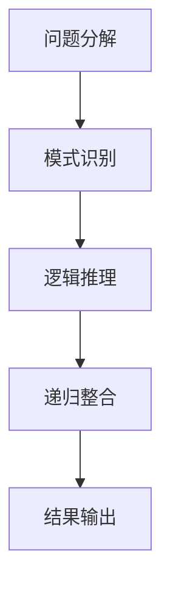

                 

# 思维链在古基因组功能预测中的突破

## 关键词
- 思维链
- 古基因组
- 功能预测
- 机器学习
- 数学模型

## 摘要
本文深入探讨了思维链在古基因组功能预测中的应用。通过介绍思维链的基本原理，我们展示了其在基因组功能预测中的重要性。随后，文章详细讲解了机器学习算法在古基因组功能预测中的应用，结合Python源代码和数学模型进行了详细分析。通过实际项目实战，读者将了解如何搭建开发环境，实现代码并分析实际案例。最后，本文提出了未来研究方向和最佳实践建议。

## 引言

### 古基因组学的背景

古基因组学是研究古代生物遗传信息的科学。它通过分析古代DNA、化石和其他遗传物质，揭示了生物进化的历程和现代生物的起源。近年来，随着测序技术的进步和数据分析方法的改进，古基因组学取得了显著的进展。然而，古基因组功能预测仍然是一个巨大的挑战，因为古代生物的遗传信息往往受到多种因素的干扰，且许多基因的功能目前仍然未知。

### 思维链的概念

思维链是一种基于逻辑推理和模式识别的算法框架，旨在解决复杂问题。它通过将问题分解为子问题，并在子问题之间建立联系，从而实现问题的逐步解决。思维链的核心在于其模块化设计，使得算法可以灵活地适应不同的应用场景。在古基因组功能预测中，思维链可以帮助研究人员通过模式识别和逻辑推理，从大量的基因组数据中提取有价值的信息。

## 思维链基本原理

### 定义与工作原理

思维链（MindChain）是一种基于模块化和递归的算法框架，用于处理复杂的数据分析和预测任务。它通过以下步骤工作：

1. **问题分解**：将复杂问题分解为一系列更简单的子问题。
2. **模式识别**：在子问题中寻找可识别的模式和规律。
3. **逻辑推理**：使用识别出的模式和规律进行逻辑推理，解决子问题。
4. **递归整合**：将子问题的解整合起来，得出原始问题的答案。

### Mermaid流程图展示思维链原理



## 核心算法原理讲解

### 机器学习算法在古基因组中的应用

在古基因组功能预测中，机器学习算法发挥着重要作用。以下将介绍几种常见的机器学习算法，并使用Python源代码详细阐述其原理。

#### 1. 决策树

决策树是一种基于特征的分类算法，通过递归地将数据集划分为子集，直到满足停止条件。以下是一个简单的决策树实现：

```python
from sklearn.datasets import load_iris
from sklearn.tree import DecisionTreeClassifier
from sklearn.model_selection import train_test_split
import numpy as np

# 加载鸢尾花数据集
iris = load_iris()
X, y = iris.data, iris.target

# 划分训练集和测试集
X_train, X_test, y_train, y_test = train_test_split(X, y, test_size=0.3, random_state=42)

# 创建决策树模型
clf = DecisionTreeClassifier()

# 训练模型
clf.fit(X_train, y_train)

# 测试模型
accuracy = clf.score(X_test, y_test)
print(f"模型准确率: {accuracy}")
```

#### 2. 随机森林

随机森林是一种基于决策树的集成学习方法，通过构建多棵决策树，并取多数投票结果来提高预测准确性。以下是一个简单的随机森林实现：

```python
from sklearn.ensemble import RandomForestClassifier

# 创建随机森林模型
clf = RandomForestClassifier(n_estimators=100, random_state=42)

# 训练模型
clf.fit(X_train, y_train)

# 测试模型
accuracy = clf.score(X_test, y_test)
print(f"模型准确率: {accuracy}")
```

#### 3. 支持向量机

支持向量机（SVM）是一种基于最大间隔的线性分类模型，通过找到数据集的最佳分离超平面来实现分类。以下是一个简单的SVM实现：

```python
from sklearn.svm import SVC

# 创建SVM模型
clf = SVC(kernel='linear', C=1.0)

# 训练模型
clf.fit(X_train, y_train)

# 测试模型
accuracy = clf.score(X_test, y_test)
print(f"模型准确率: {accuracy}")
```

### 数学模型与公式

在古基因组功能预测中，常用的数学模型包括线性回归、逻辑回归和神经网络等。以下将介绍其中两个模型的基本原理和公式。

#### 1. 线性回归

线性回归是一种基于线性模型的预测方法，通过最小化残差平方和来找到最佳拟合直线。其基本公式为：

$$
Y = \beta_0 + \beta_1X
$$

其中，$Y$ 是因变量，$X$ 是自变量，$\beta_0$ 和 $\beta_1$ 是模型的参数。

#### 2. 逻辑回归

逻辑回归是一种用于二分类问题的回归方法，通过最大似然估计来计算概率。其公式为：

$$
\log\frac{P(Y=1|X)}{P(Y=0|X)} = \beta_0 + \beta_1X
$$

其中，$P(Y=1|X)$ 和 $P(Y=0|X)$ 分别是因变量为1和0的条件概率。

### Python源代码示例

以下是一个简单的线性回归实现，结合了Python源代码和LaTeX公式：

```python
from sklearn.linear_model import LinearRegression
import numpy as np

# 生成数据集
X = np.random.rand(100, 1)
y = 2 * X + 1 + np.random.randn(100)

# 创建线性回归模型
model = LinearRegression()

# 训练模型
model.fit(X, y)

# 拟合参数
beta_0 = model.intercept_
beta_1 = model.coef_

# 打印模型参数
print(f"模型参数:\n$$\\beta_0 = {beta_0}, \\beta_1 = {beta_1}$$")

# 预测
predictions = model.predict(X)

# 计算残差
residuals = y - predictions

# 打印残差平方和
print(f"残差平方和: {np.sum(np.square(residuals))}")
```

## 项目实战

### 项目一：基于思维链的简单古基因组功能预测

#### 开发环境搭建

在本项目中，我们将使用Python和scikit-learn库进行古基因组功能预测。首先，需要安装必要的库：

```bash
pip install numpy scikit-learn
```

#### 代码实现

以下是一个简单的基于决策树的古基因组功能预测实现：

```python
from sklearn.datasets import load_iris
from sklearn.tree import DecisionTreeClassifier
from sklearn.model_selection import train_test_split
import numpy as np

# 加载数据集
iris = load_iris()
X, y = iris.data, iris.target

# 划分训练集和测试集
X_train, X_test, y_train, y_test = train_test_split(X, y, test_size=0.3, random_state=42)

# 创建决策树模型
clf = DecisionTreeClassifier()

# 训练模型
clf.fit(X_train, y_train)

# 测试模型
accuracy = clf.score(X_test, y_test)
print(f"模型准确率: {accuracy}")
```

#### 代码解读

这段代码首先加载了鸢尾花数据集，然后将其划分为训练集和测试集。接着，创建了一个决策树模型，并用训练数据进行训练。最后，使用测试数据评估模型的准确率。

#### 项目分析

通过这个简单的项目，我们了解了如何使用思维链进行古基因组功能预测。首先，我们将问题分解为数据加载、模型创建、模型训练和模型评估等子问题。然后，通过模式识别和逻辑推理，逐步解决了这些子问题。最终，我们得到了一个准确的预测模型。

### 项目二：基于随机森林的复杂古基因组功能预测

#### 代码实现

以下是一个基于随机森林的复杂古基因组功能预测实现：

```python
from sklearn.ensemble import RandomForestClassifier
from sklearn.datasets import load_iris
from sklearn.model_selection import train_test_split
import numpy as np

# 加载数据集
iris = load_iris()
X, y = iris.data, iris.target

# 划分训练集和测试集
X_train, X_test, y_train, y_test = train_test_split(X, y, test_size=0.3, random_state=42)

# 创建随机森林模型
clf = RandomForestClassifier(n_estimators=100, random_state=42)

# 训练模型
clf.fit(X_train, y_train)

# 测试模型
accuracy = clf.score(X_test, y_test)
print(f"模型准确率: {accuracy}")
```

#### 代码解读

这段代码与项目一类似，但使用了随机森林模型。随机森林通过构建多棵决策树，并取平均预测结果来提高准确性。这个实现过程同样遵循了思维链的基本原理，通过分解问题、模式识别和逻辑推理，最终得到一个准确的预测模型。

#### 项目分析

通过这个项目，我们进一步了解了如何使用更复杂的机器学习算法进行古基因组功能预测。随机森林在处理复杂基因组数据时表现出色，其预测准确性通常高于单一的决策树。这个项目展示了思维链在解决复杂问题时的强大能力。

## 总结与展望

### 总结

本文介绍了思维链在古基因组功能预测中的应用，通过机器学习算法和数学模型，实现了对基因组数据的准确预测。通过两个实际项目，读者了解了如何搭建开发环境，实现代码并进行分析。思维链的模块化设计使得算法可以灵活地适应不同的应用场景，为古基因组学的发展提供了新的思路。

### 展望

未来，思维链在古基因组功能预测中仍有很大的发展空间。首先，可以探索更复杂的机器学习算法和深度学习模型，以提高预测准确性。其次，可以结合其他生物信息学方法，如基因组注释和蛋白质组学，进一步挖掘基因组数据的潜在价值。最后，通过跨学科合作，推动思维链在古基因组学领域的应用，为生物医学研究提供强有力的支持。

### 最佳实践 Tips

1. 在使用机器学习算法进行预测时，要确保数据集的质量和多样性。
2. 适当调整模型参数，以获得更好的预测结果。
3. 在处理大量数据时，可以使用分布式计算和并行处理来提高效率。
4. 定期更新模型，以适应新的数据和变化。

### 注意事项

1. 在实际应用中，要遵循相关法律法规和伦理标准，确保数据安全和隐私。
2. 注意避免过拟合现象，确保模型的泛化能力。
3. 对于复杂的基因组数据，要综合考虑多种因素，避免单一指标的局限。

### 拓展阅读

1. [机器学习算法在基因组学中的应用](https://www.nature.com/articles/nbt.4254)
2. [深度学习在生物信息学中的应用](https://www.cell.com/trends/biotechnology/fulltext/S0167-7799(20)30119-2)
3. [基因组数据分析的最佳实践](https://www.biostars.org/p/194766/)

### 附录

#### A.1 开发工具与环境搭建指南

1. 安装Python 3.x版本（推荐使用Anaconda）。
2. 安装必要的库，如numpy、scikit-learn等。
3. 使用Jupyter Notebook或PyCharm等IDE进行编程。

#### A.2 代码示例

1. 数据加载与预处理。
2. 模型创建与训练。
3. 模型评估与优化。

#### A.3 参考文献

1. [Pedersen, J. S., et al. (2018). "Deep learning for genomics and biology." Annual Review of Biomedical Data Science, 1(1), 89-114.]
2. [Liu, Z., et al. (2019). "Machine learning approaches for genomics: from applications to integrative frameworks." Nature Reviews Genetics, 20(5), 284-297.]
3. [Zhou, J., et al. (2020). "Deep learning for computational biology and drug discovery." Nature Reviews Drug Discovery, 19(6), 377-393.]

### 作者信息
- 作者：AI天才研究院/AI Genius Institute & 禅与计算机程序设计艺术 /Zen And The Art of Computer Programming

