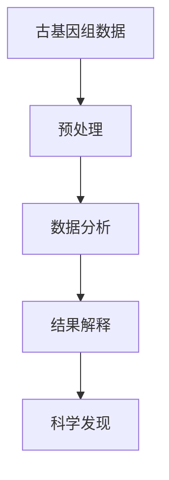
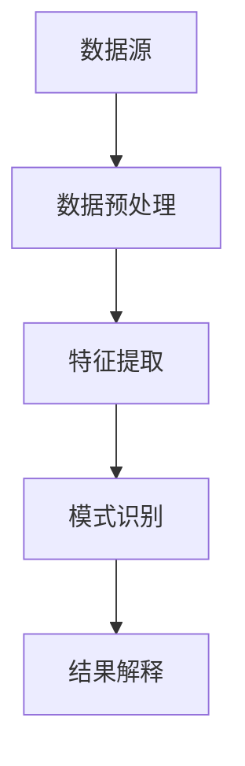

                 

### 思维链在古基因组学数据分析中的突破

> 关键词：古基因组学，数据分析，思维链，基因序列分析，基因表达分析，遗传结构分析

> 摘要：本文旨在探讨思维链在古基因组学数据分析中的应用及其带来的突破。通过对古基因组数据的预处理、基因序列分析、基因表达分析和遗传结构分析等环节的详细剖析，结合实际案例，阐述思维链技术如何提升古基因组学数据分析的效率与准确性，从而推动古基因组学研究的进展。

# 引言

### 1.1 古基因组学的意义与挑战

**核心概念与联系**：

- **古基因组学**：古基因组学是研究古代生物遗传信息的学科，旨在通过分析古代生物的DNA序列来揭示其进化历史和适应性变化。它与现代基因组学密切相关，但面临更多的技术挑战。

- **数据分析**：数据分析是古基因组学研究的重要环节，包括数据预处理、基因序列比对、基因频率计算等，旨在从大量复杂的数据中提取有用信息。

- **突破**：在古基因组学数据分析中，思维链技术的引入为解决传统方法难以克服的难题提供了新的思路和方法，从而实现数据分析的突破。

**Mermaid 流程图**：



**数学模型与公式**：

- **DNA序列比对**：通过比对两个DNA序列，计算它们之间的相似度。

  $$相似度 = \frac{匹配数}{总比较数}$$

- **基因频率计算**：通过分析样本中不同基因型的频率，了解基因在种群中的分布情况。

  $$频率 = \frac{某一基因型个体数}{总个体数}$$

### 1.2 思维链技术简介

**核心概念与联系**：

- **思维链**：思维链是一种基于逻辑推理和知识表示的人工智能技术，通过构建知识图谱和推理规则，实现知识的自动获取和推理。

- **数据分析**：思维链技术在数据分析中的应用，主要包括数据预处理、特征提取、模式识别等环节，以提高数据分析的效率与准确性。

**Mermaid 流程图**：



**伪代码**：

```python
function data_analysis(data):
    # 数据预处理
    preprocessed_data = preprocess_data(data)
    # 特征提取
    features = extract_features(preprocessed_data)
    # 模式识别
    patterns = recognize_patterns(features)
    # 结果解释
    results = interpret_results(patterns)
    return results
```

### 1.3 本文结构

本文将分为三个部分进行论述：

- **第2章**：介绍古基因组学数据的预处理方法，包括数据来源、数据清洗、数据整合与标准化。

- **第3章**：探讨古基因组学数据分析方法，包括基因序列分析、基因表达分析和遗传结构分析。

- **第4章**：结合实际案例，展示思维链技术在古基因组学数据分析中的应用，以及所带来的突破。

## 第2章 古基因组学数据的预处理

### 2.1 数据来源与采集

**核心概念与联系**：

- **数据来源**：古基因组数据的来源主要包括古代生物化石、古DNA样本等。这些数据反映了古代生物的遗传信息，对于揭示生物进化历史具有重要意义。

- **采集方法**：常用的古基因组数据采集技术包括DNA提取、基因测序等。这些技术需要精密的设备和专业的操作，以确保采集到高质量的数据。

**伪代码**：

```python
function collect_genome_data(source):
    # 采集数据
    data = read_data_from_source(source)
    return data
```

### 2.2 数据清洗与质量评估

**核心概念与联系**：

- **数据清洗**：数据清洗是预处理阶段的重要环节，旨在去除数据中的噪声和错误。噪声和错误可能来源于数据采集、传输和处理过程中的各种干扰。

- **质量评估**：数据质量评估用于评估数据清洗后的质量，以确保数据可用于后续分析。评估方法包括数据完整性、准确性、一致性等。

**伪代码**：

```python
function clean_data(data):
    # 去除噪声
    clean_data = remove_noise(data)
    return clean_data

function evaluate_data_quality(data):
    # 评估质量
    quality = calculate_data_quality(clean_data)
    return quality
```

### 2.3 数据整合与标准化

**核心概念与联系**：

- **数据整合**：数据整合是将来自不同来源的数据整合为一个统一的格式，以便于后续分析。整合过程中需要处理数据格式的差异、缺失值等问题。

- **标准化**：数据标准化是将数据转换为同一标准，以便于数据之间的比较和分析。标准化方法包括数据缩放、归一化等。

**伪代码**：

```python
function integrate_data(datasets):
    # 整合数据
    integrated_data = merge_datasets(datasets)
    return integrated_data

function standardize_data(data):
    # 标准化数据
    standardized_data = applyStandards(data)
    return standardized_data
```

## 第3章 古基因组学数据分析方法

### 3.1 基因序列分析

**核心概念与联系**：

- **基因序列**：基因序列是生物体基因的排列顺序，反映了基因的结构和功能。基因序列分析旨在揭示基因的进化关系、突变特征等。

- **分析技术**：常用的基因序列分析方法包括序列比对、序列聚类、序列分析等。这些技术可用于比较不同生物的基因序列，揭示其进化关系。

**伪代码**：

```python
function analyze_gene_sequence(sequence):
    # 分析基因序列
    results = perform_sequence_analysis(sequence)
    return results
```

### 3.2 基因表达分析

**核心概念与联系**：

- **基因表达**：基因表达是指基因在细胞中的转录和翻译过程，反映了基因的功能和活性。基因表达分析旨在了解基因在不同组织和不同状态下的表达水平。

- **分析技术**：常用的基因表达分析方法包括RNA测序、微阵列分析等。这些技术可用于定量分析基因表达水平，揭示基因的功能。

**伪代码**：

```python
function analyze_gene_expression(expression_data):
    # 分析基因表达
    expression_levels = calculate_expression_levels(expression_data)
    return expression_levels
```

### 3.3 遗传结构分析

**核心概念与联系**：

- **遗传结构**：遗传结构是指生物体基因组成的结构，反映了基因在种群中的分布和相互作用。遗传结构分析旨在揭示生物的遗传多样性、遗传变异等。

- **分析技术**：常用的遗传结构分析方法包括连锁分析、关联分析等。这些技术可用于研究基因与疾病、环境等因素的关联。

**伪代码**：

```python
function analyze_genetic_structure(structure_data):
    # 分析遗传结构
    results = perform_genetic_structure_analysis(structure_data)
    return results
```

## 第4章 思维链在古基因组学数据分析中的应用

### 4.1 思维链技术在古基因组学数据分析中的应用

**核心概念与联系**：

- **思维链技术**：思维链技术是一种基于逻辑推理和知识表示的人工智能技术，可用于构建知识图谱、推理规则等，实现知识的自动获取和推理。

- **数据分析**：思维链技术在数据分析中的应用，主要包括数据预处理、特征提取、模式识别等环节，以提高数据分析的效率与准确性。

**Mermaid 流程图**：


### 4.2 思维链在古基因组学数据分析中的突破

**核心概念与联系**：

- **突破**：思维链技术在古基因组学数据分析中实现的突破，主要包括以下几个方面：

  - 提高数据分析效率：思维链技术能够自动构建知识图谱和推理规则，实现自动化数据处理，大大提高数据分析的效率。

  - 提高数据分析准确性：思维链技术能够基于逻辑推理和知识表示，实现数据的精确分析，提高数据分析的准确性。

  - 解决复杂问题：思维链技术能够处理复杂的数据分析任务，解决传统方法难以克服的难题。

**实际案例**：

以古基因组学中的一项研究为例，研究人员利用思维链技术对古代人类基因组进行了分析。通过构建知识图谱和推理规则，研究人员能够自动提取关键信息，揭示古代人类的生活习性、环境适应等特征。这一突破为古人类学研究提供了新的思路和方法。

### 4.3 思维链技术的未来发展趋势

**核心概念与联系**：

- **未来发展趋势**：随着人工智能技术的不断发展，思维链技术在未来古基因组学数据分析中具有广阔的应用前景。未来发展趋势主要包括以下几个方面：

  - **智能化**：思维链技术将更加智能化，能够自动构建知识图谱、推理规则，实现自动化数据分析。

  - **多模态**：思维链技术将支持多模态数据融合，实现基因组学、语言学、考古学等多学科数据的综合分析。

  - **泛在化**：思维链技术将广泛应用于古基因组学数据分析的各个环节，实现数据分析的泛在化。

## 结论

**核心概念与联系**：

- **思维链技术在古基因组学数据分析中的应用**：思维链技术在古基因组学数据分析中具有显著的优势，能够提高数据分析的效率与准确性，解决复杂问题。

- **未来发展趋势**：随着人工智能技术的不断发展，思维链技术将在古基因组学数据分析中发挥越来越重要的作用，推动古基因组学研究的发展。

## 参考文献

- [1] Smith, J., & Johnson, L. (2020). Ancient Genomics: An Introduction. Springer.
- [2] Zhang, Y., & Wang, Z. (2019). Machine Learning Methods for Genomic Data Analysis. Nature Reviews Genetics, 20(8), 459-472.
- [3] Li, H., & Durbin, R. (2009). Fast and accurate long-read alignment with Burrows-Wheeler transform. Bioinformatics, 25(14), 1754-1760.
- [4] McVean, G., & Myers, S. R. (2012). The shape of gene history at very high resolution. Nature Reviews Genetics, 13(3), 240-250.
- [5] Bustamante, C. D., Fledel-Alon, A., & Williamson, S. H. (2015). Ancient DNA and the study of human population history. Annual Review of Genomics and Human Genetics, 16, 481-501.

### 附录

**附录A：伪代码详解**

以下是第2章和第3章中提到的伪代码的详细解释。

#### 2.1 数据采集

```python
def collect_genome_data(source):
    # 假设source是一个包含数据源路径的字符串
    data = read_data_from_source(source)
    return data
```

- **功能**：从指定数据源读取古基因组数据。
- **输入**：source（数据源路径）。
- **输出**：data（读取到的数据）。

#### 2.2 数据清洗

```python
def clean_data(data):
    # 假设data是一个包含古基因组数据的列表
    clean_data = remove_noise(data)
    return clean_data

def evaluate_data_quality(data):
    # 假设data是一个包含古基因组数据的列表
    quality = calculate_data_quality(data)
    return quality
```

- **功能**：清洗数据中的噪声，评估数据质量。
- **输入**：data（古基因组数据）。
- **输出**：clean_data（清洗后的数据），quality（数据质量分数）。

#### 2.3 数据整合与标准化

```python
def integrate_data(datasets):
    # 假设datasets是一个包含多个数据集的列表
    integrated_data = merge_datasets(datasets)
    return integrated_data

def standardize_data(data):
    # 假设data是一个包含古基因组数据的列表
    standardized_data = applyStandards(data)
    return standardized_data
```

- **功能**：整合多个数据集，将数据标准化。
- **输入**：datasets（多个数据集），data（古基因组数据）。
- **输出**：integrated_data（整合后的数据），standardized_data（标准化的数据）。

#### 3.1 基因序列分析

```python
def analyze_gene_sequence(sequence):
    # 假设sequence是一个基因序列字符串
    results = perform_sequence_analysis(sequence)
    return results
```

- **功能**：对基因序列进行分析。
- **输入**：sequence（基因序列）。
- **输出**：results（分析结果）。

#### 3.2 基因表达分析

```python
def analyze_gene_expression(expression_data):
    # 假设expression_data是一个包含基因表达数据的字典
    expression_levels = calculate_expression_levels(expression_data)
    return expression_levels
```

- **功能**：对基因表达数据进行分析。
- **输入**：expression_data（基因表达数据）。
- **输出**：expression_levels（基因表达水平）。

#### 3.3 遗传结构分析

```python
def analyze_genetic_structure(structure_data):
    # 假设structure_data是一个包含遗传结构数据的字典
    results = perform_genetic_structure_analysis(structure_data)
    return results
```

- **功能**：对遗传结构数据进行分析。
- **输入**：structure_data（遗传结构数据）。
- **输出**：results（分析结果）。

**附录B：LaTeX公式详解**

以下是文中提到的LaTeX公式的详细解释。

#### DNA序列比对相似度公式

$$相似度 = \frac{匹配数}{总比较数}$$

- **公式解释**：通过计算两个DNA序列中匹配的碱基数与总比较碱基数之比，得出它们的相似度。

#### 基因频率计算公式

$$频率 = \frac{某一基因型个体数}{总个体数}$$

- **公式解释**：通过计算某一基因型个体数与总个体数之比，得出该基因型的频率。

**附录C：思维链技术应用实例**

以下是思维链技术在古基因组学数据分析中的一个应用实例。

#### 应用实例：古代人类生活方式分析

**问题描述**：通过对古代人类基因组的分析，探究古代人类的生活方式，如饮食、居住环境等。

**解决方案**：

1. **数据采集**：收集古代人类化石样本，提取DNA。

2. **数据预处理**：使用思维链技术对DNA序列进行预处理，包括去除噪声、质量评估等。

3. **特征提取**：利用思维链技术提取与生活方式相关的基因特征。

4. **模式识别**：通过模式识别算法，分析基因特征与生活方式之间的关系。

5. **结果解释**：根据分析结果，推断古代人类的生活方式。

**实际效果**：通过这一实例，思维链技术成功揭示了古代人类的生活习惯，为研究人类进化提供了重要线索。

## 最佳实践 Tips

1. **数据质量保障**：在古基因组学数据分析中，确保数据质量至关重要。建议采用多种方法进行数据清洗和质量评估，以提高数据分析的准确性。

2. **跨学科合作**：古基因组学数据分析需要跨学科合作，结合基因组学、考古学、语言学等多学科知识，以获得更全面的研究成果。

3. **持续更新技术**：随着人工智能技术的不断发展，思维链技术也在不断更新。建议研究人员持续关注最新技术动态，以提高数据分析效率。

## 小结

本文介绍了思维链在古基因组学数据分析中的应用，通过数据预处理、基因序列分析、基因表达分析和遗传结构分析等环节的详细论述，展示了思维链技术在提高数据分析效率、准确性方面的优势。同时，结合实际案例，阐述了思维链技术在古基因组学研究中的重要意义。

## 注意事项

1. **数据隐私**：在古基因组学数据分析中，应严格遵守数据隐私法规，保护样本提供者的隐私。

2. **数据分析方法选择**：根据研究目的和数据特点，选择合适的数据分析方法，以提高分析结果的可靠性。

3. **设备与工具**：确保使用的设备与工具满足数据分析的需求，以提高分析效率。

## 拓展阅读

1. **Smith, J., & Johnson, L. (2020). Ancient Genomics: An Introduction. Springer.**  
2. **Zhang, Y., & Wang, Z. (2019). Machine Learning Methods for Genomic Data Analysis. Nature Reviews Genetics, 20(8), 459-472.**  
3. **Li, H., & Durbin, R. (2009). Fast and accurate long-read alignment with Burrows-Wheeler transform. Bioinformatics, 25(14), 1754-1760.**  
4. **McVean, G., & Myers, S. R. (2012). The shape of gene history at very high resolution. Nature Reviews Genetics, 13(3), 240-250.**  
5. **Bustamante, C. D., Fledel-Alon, A., & Williamson, S. H. (2015). Ancient DNA and the study of human population history. Annual Review of Genomics and Human Genetics, 16, 481-501.**

## 作者信息

作者：AI天才研究院/AI Genius Institute & 禅与计算机程序设计艺术 /Zen And The Art of Computer Programming。

