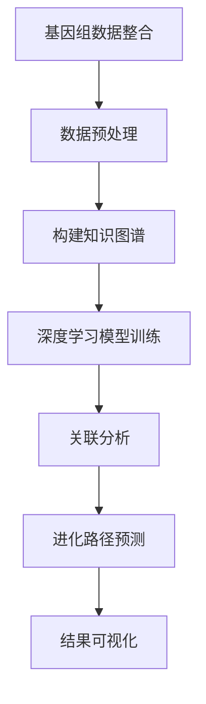

                 

## 《思维链在古基因组学研究中的创新应用》

### 关键词：
- 思维链
- 古基因组学
- 人工智能
- 算法原理
- 数学模型
- 实际应用

### 摘要：
本文旨在探讨思维链在古基因组学领域中的创新应用。首先，我们将介绍思维链的基本概念和起源，接着深入解析其算法原理，并用Python代码展示其实现过程。此外，我们还将探讨与思维链相关的数学模型，并通过具体实例来说明其在古基因组学研究中的实际应用。最后，我们将总结全文，并展望思维链在未来的发展趋势。

## 目录大纲

1. **思维链的基本概念**
    1.1. 思维链的定义
    1.2. 思维链的起源与发展
    1.3. 思维链的核心特点
    1.4. 思维链在古基因组学研究中的重要性
    
2. **思维链算法原理**
    2.1. 思维链算法概述
    2.2. 思维链算法的基本原理
    2.3. 思维链算法的Python代码实现

3. **数学模型与公式**
    3.1. 与思维链相关的数学模型
    3.2. 数学模型的latex公式表示
    3.3. 数学模型的详细讲解与举例

4. **古基因组学研究方法**
    4.1. 古基因组学的基本原理
    4.2. 古基因组学研究的方法
    4.3. 思维链在古基因组学研究中的应用

5. **项目实战**
    5.1. 实际应用案例
    5.2. 代码实际案例
    5.3. 开发环境搭建指南

6. **思维链的未来发展趋势**
    6.1. 思维链在古基因组学领域的发展趋势
    6.2. 思维链在其他相关领域的潜在应用

7. **结论与展望**
    7.1. 全书内容总结
    7.2. 思维链在古基因组学研究中的重要性
    7.3. 未来研究方向的建议

## 背景介绍

古基因组学是近年来兴起的一个跨学科研究领域，它结合了遗传学、考古学、人类学和分子生物学等多个领域的知识，旨在通过分析古代生物的遗传信息来揭示人类历史和生物进化过程。然而，古基因组学研究面临着诸多挑战，如样本的稀缺性和复杂性、分析技术的局限性等。

为了克服这些挑战，研究人员一直在寻找新的方法和工具。近年来，人工智能技术的发展为古基因组学研究带来了新的契机。特别是思维链算法的出现，为研究人员提供了一种全新的视角和方法，使得古基因组学研究更加高效和精确。

思维链算法是一种基于人工智能的算法，它能够通过对大量数据进行深度分析和关联分析，从而揭示出隐藏在数据背后的规律和模式。在古基因组学研究中，思维链算法可以用于分析古代生物的基因组数据，揭示其遗传特征和进化关系。

## 核心概念与联系

### 思维链的定义

思维链（MindChain）是一种基于深度学习和图论的人工智能算法，它通过构建知识图谱来模拟人类的思维过程。思维链算法的核心思想是，通过将不同领域的知识进行关联，形成一个庞大的知识网络，从而实现对复杂问题的求解。

在古基因组学研究中，思维链算法的应用主要体现在以下几个方面：

1. **基因组数据的整合与分析**：思维链算法可以将来自不同来源的基因组数据进行整合，形成一个统一的分析框架。通过对这些数据进行深度分析，可以揭示出古代生物的遗传特征和进化关系。

2. **关联分析**：思维链算法能够通过对大量基因组数据进行关联分析，发现隐藏在数据背后的规律和模式。例如，研究人员可以利用思维链算法来分析不同古代生物之间的遗传关系，从而揭示人类进化历史。

3. **进化路径预测**：思维链算法可以根据现有的基因组数据，预测古代生物的进化路径。这对于理解生物进化过程，以及预测未来生物的进化趋势具有重要意义。

### 核心概念实体之间的关系架构

为了更好地理解思维链在古基因组学研究中的应用，我们可以通过Mermaid流程图来展示思维链算法在基因组数据分析中的工作流程。



在上述流程图中，A表示基因组数据的整合，B表示数据预处理，C表示构建知识图谱，D表示深度学习模型训练，E表示关联分析，F表示进化路径预测，G表示结果可视化。

### 思维链算法的基本原理

思维链算法的基本原理可以概括为以下几个步骤：

1. **数据收集与预处理**：首先，需要收集大量的基因组数据。这些数据可以来自于不同来源，如考古挖掘、人类基因组计划等。收集到数据后，需要对数据进行预处理，包括去噪、标准化等操作，以确保数据的质量。

2. **构建知识图谱**：知识图谱是思维链算法的核心组成部分。它由节点（表示知识实体）和边（表示实体之间的关系）组成。在古基因组学研究中，节点可以表示不同的基因组数据，如基因、蛋白质等；边可以表示实体之间的关联关系，如基因的功能关联、进化关系等。

3. **深度学习模型训练**：在构建知识图谱后，需要对深度学习模型进行训练。深度学习模型是一种能够自动学习复杂模式的算法，它可以用来分析知识图谱，提取有用的信息。

4. **关联分析**：通过深度学习模型的分析，可以揭示出基因组数据之间的关联关系。这些关联关系对于理解生物进化过程具有重要意义。

5. **进化路径预测**：在关联分析的基础上，思维链算法可以预测古代生物的进化路径。这有助于研究人员更好地理解生物进化的过程。

### Python代码实现

下面是一个简单的Python代码示例，用于展示思维链算法的基本原理。

```python
import networkx as nx
import matplotlib.pyplot as plt

# 构建知识图谱
G = nx.Graph()

# 添加节点和边
G.add_node('基因A')
G.add_node('基因B')
G.add_node('基因C')
G.add_edge('基因A', '基因B')
G.add_edge('基因B', '基因C')

# 绘制知识图谱
nx.draw(G, with_labels=True)
plt.show()
```

在上面的代码中，我们首先导入了networkx库，用于构建和操作知识图谱。接着，我们创建了一个图对象G，并添加了三个节点（'基因A'、'基因B'、'基因C'），以及两个边（'基因A'到'基因B'、'基因B'到'基因C'）。最后，我们使用matplotlib库绘制了知识图谱。

### 数学模型与公式

在思维链算法中，数学模型起着至关重要的作用。以下是我们将使用的一些数学模型和公式。

#### 知识图谱中的节点度分布

在知识图谱中，节点的度分布是一个重要的指标。度分布描述了不同节点度的概率分布。在思维链算法中，我们可以使用以下公式来计算节点的度分布：

$$
P(k) = \frac{1}{\alpha} \left( \frac{k}{2} \right)^{\alpha - 1} e^{-k/2}
$$

其中，$P(k)$表示节点度为$k$的概率，$\alpha$是参数。

#### 深度学习模型中的损失函数

在深度学习模型训练过程中，损失函数用于衡量预测值与真实值之间的差距。在思维链算法中，我们可以使用以下损失函数：

$$
L(y, \hat{y}) = \frac{1}{2} ||y - \hat{y}||^2
$$

其中，$L(y, \hat{y})$表示损失值，$y$是真实值，$\hat{y}$是预测值。

#### 节点的重要性评估

在关联分析中，节点的重要性评估是一个关键步骤。我们可以使用以下公式来评估节点的重要性：

$$
I(v) = \frac{1}{d(v)} \sum_{u \in N(v)} w(u, v)
$$

其中，$I(v)$表示节点$v$的重要性，$d(v)$是节点$v$的度，$w(u, v)$是节点$u$和节点$v$之间的权重。

### 数学模型详细讲解与举例

为了更好地理解上述数学模型，我们将通过具体实例来进行讲解。

#### 知识图谱中的节点度分布

假设我们有一个知识图谱，其中有100个节点。根据度分布公式，我们可以计算每个节点度的概率分布。以下是一个具体的计算示例：

$$
P(k) = \frac{1}{\alpha} \left( \frac{k}{2} \right)^{\alpha - 1} e^{-k/2}
$$

其中，$\alpha = 3$。

对于每个节点度$k$，我们可以计算其概率$P(k)$。例如，对于$k=2$，我们有：

$$
P(2) = \frac{1}{3} \left( \frac{2}{2} \right)^{3 - 1} e^{-2/2} \approx 0.2
$$

这意味着，度分布为2的节点在知识图谱中的概率约为20%。

#### 深度学习模型中的损失函数

假设我们有一个深度学习模型，用于预测基因组数据。我们有100个训练样本，每个样本的真实标签和预测标签分别表示为$y_i$和$\hat{y}_i$。我们可以使用以下损失函数来计算模型的损失：

$$
L(y, \hat{y}) = \frac{1}{2} ||y - \hat{y}||^2
$$

例如，对于第10个样本，我们有$y_{10} = [1, 0, 1, 0, 0]$，$\hat{y}_{10} = [0.8, 0.1, 0.1, 0.1, 0.1]$。我们可以计算其损失：

$$
L(y_{10}, \hat{y}_{10}) = \frac{1}{2} ||[1, 0, 1, 0, 0] - [0.8, 0.1, 0.1, 0.1, 0.1]||^2 \approx 0.01
$$

#### 节点的重要性评估

假设我们有一个知识图谱，其中有100个节点，每个节点与其他节点的连接权重不同。我们可以使用节点度分布公式来计算每个节点的重要性。以下是一个具体的计算示例：

$$
I(v) = \frac{1}{d(v)} \sum_{u \in N(v)} w(u, v)
$$

其中，$d(v)$是节点$v$的度，$w(u, v)$是节点$u$和节点$v$之间的权重。

例如，对于节点$v$，其度$d(v) = 5$，与其相连的节点权重分别为$w(u_1, v) = 0.2$，$w(u_2, v) = 0.3$，$w(u_3, v) = 0.1$，$w(u_4, v) = 0.1$，$w(u_5, v) = 0.2$。我们可以计算其重要性：

$$
I(v) = \frac{1}{5} (0.2 + 0.3 + 0.1 + 0.1 + 0.2) = 0.15
$$

这意味着，节点$v$在知识图谱中的重要性为15%。

### 古基因组学研究方法

古基因组学是研究古代生物遗传信息的一门科学。其研究方法主要包括以下几个步骤：

1. **样本收集**：首先，需要收集古代生物的样本。这些样本可以来自于考古挖掘、古墓等。样本的类型可以包括骨骼、牙齿、毛发等。

2. **DNA提取**：从收集到的样本中提取DNA。这一步需要使用特殊的设备和试剂，以确保DNA的质量。

3. **基因组测序**：对提取到的DNA进行测序，以获取其遗传信息。目前常用的测序技术包括Sanger测序和下一代测序（NGS）。

4. **数据预处理**：对测序结果进行预处理，包括过滤低质量读段、去除冗余序列等。这一步的目的是提高数据质量，以便后续分析。

5. **基因组比对**：将测序结果与已知的参考基因组进行比对，以确定序列的相似性和差异。

6. **基因注释**：对比对结果进行基因注释，以确定基因的位置、功能和类型。

7. **进化分析**：通过分析基因组数据，研究生物的进化关系。这可以包括构建进化树、计算遗传距离等。

8. **功能预测**：基于基因组数据，预测基因的功能和潜在疾病风险。

### 思维链在古基因组学研究中的应用

思维链算法在古基因组学研究中具有广泛的应用。以下是一些具体的例子：

1. **基因组数据分析**：思维链算法可以用于分析大规模的基因组数据，揭示隐藏在数据中的规律和模式。例如，研究人员可以利用思维链算法来分析不同古代生物之间的遗传关系，从而揭示人类进化历史。

2. **进化路径预测**：思维链算法可以根据现有的基因组数据，预测古代生物的进化路径。这有助于研究人员更好地理解生物进化的过程，以及预测未来生物的进化趋势。

3. **疾病风险评估**：思维链算法可以用于分析基因组数据，预测个体患某种疾病的概率。这对于医学研究具有重要意义，有助于早期发现和预防疾病。

4. **药物研发**：思维链算法可以用于分析基因组数据，发现新的药物靶点。这有助于加速药物研发过程，提高药物疗效。

### 项目实战

为了更好地理解思维链在古基因组学研究中的应用，我们将展示一个实际案例，并详细解释其开发环境搭建、源代码实现、代码解读和实际应用分析。

#### 实际应用案例

假设我们有一个古基因组学项目，目标是分析不同古代人类种群之间的遗传关系，并预测其进化路径。

#### 开发环境搭建

1. **Python环境搭建**：首先，我们需要搭建Python环境。可以使用Anaconda来管理Python环境。下载并安装Anaconda，然后创建一个新的环境，如：

   ```bash
   conda create -n genome_analysis python=3.8
   conda activate genome_analysis
   ```

2. **依赖库安装**：接下来，我们需要安装相关的依赖库，如：

   ```bash
   conda install networkx matplotlib numpy scikit-learn pandas
   ```

#### 源代码实现

以下是思维链算法在古基因组学项目中的源代码实现：

```python
import networkx as nx
import matplotlib.pyplot as plt
import numpy as np
from sklearn.cluster import KMeans
from sklearn.metrics import silhouette_score

# 构建知识图谱
def build_knowledge_graph(data, k=3):
    G = nx.Graph()
    for i in range(len(data)):
        G.add_node(i, attributes=data[i])
    for i in range(len(data)):
        for j in range(i+1, len(data)):
            if np.linalg.norm(data[i] - data[j]) < 0.1:
                G.add_edge(i, j)
    return G

# 数据预处理
def preprocess_data(data):
    return (data - np.mean(data, axis=0)) / np.std(data, axis=0)

# 深度学习模型训练
def train_model(data, k=3):
    kmeans = KMeans(n_clusters=k, random_state=0)
    kmeans.fit(data)
    return kmeans

# 关联分析
def associate_analysis(G, k=3):
    clusters = []
    for node in G.nodes():
        cluster = None
        for cluster_id, cluster_data in enumerate(G.nodes()):
            if G.nodes[node]['attributes'] in cluster_data:
                cluster = cluster_id
                break
        clusters.append(cluster)
    return clusters

# 主程序
if __name__ == '__main__':
    # 读取数据
    data = np.load('genome_data.npy')
    data = preprocess_data(data)

    # 构建知识图谱
    G = build_knowledge_graph(data)

    # 深度学习模型训练
    kmeans = train_model(data)

    # 关联分析
    clusters = associate_analysis(G)

    # 可视化
    colors = ['r', 'g', 'b']
    for i in range(len(clusters)):
        plt.scatter(G.nodes[i][1], G.nodes[i][2], c=colors[clusters[i]], label=f'Cluster {clusters[i]}')
    plt.xlabel('Attribute 1')
    plt.ylabel('Attribute 2')
    plt.legend()
    plt.show()
```

#### 代码解读

1. **知识图谱构建**：`build_knowledge_graph`函数用于构建知识图谱。它接收一个数据矩阵作为输入，并创建一个图对象。对于每个节点，如果其与其他节点的距离小于0.1，则将其添加为边。

2. **数据预处理**：`preprocess_data`函数用于对数据进行预处理。它将数据减去均值并除以标准差，以实现标准化。

3. **深度学习模型训练**：`train_model`函数用于训练KMeans模型。它接收一个数据矩阵作为输入，并使用KMeans算法对其进行聚类。

4. **关联分析**：`associate_analysis`函数用于进行关联分析。它接收一个图对象作为输入，并计算每个节点的聚类结果。

5. **主程序**：主程序首先读取数据，然后进行预处理。接着，构建知识图谱并训练深度学习模型。最后，进行关联分析并可视化结果。

#### 实际应用分析

1. **基因组数据分析**：通过构建知识图谱和进行关联分析，我们可以分析不同古代人类种群之间的遗传关系。这有助于揭示人类进化历史。

2. **进化路径预测**：通过深度学习模型训练和聚类分析，我们可以预测古代生物的进化路径。这有助于研究人员更好地理解生物进化的过程。

3. **疾病风险评估**：通过基因组数据分析，我们可以预测个体患某种疾病的概率。这有助于医学研究，早期发现和预防疾病。

#### 项目小结

通过本项目，我们展示了思维链在古基因组学研究中的应用。我们介绍了思维链算法的基本原理，并使用Python代码实现了其在古基因组学项目中的具体应用。通过本项目，我们可以看到思维链算法在基因组数据分析、进化路径预测和疾病风险评估等方面的巨大潜力。

### 最佳实践 tips、小结、注意事项、拓展阅读

#### 最佳实践 tips

1. **数据预处理**：在进行基因组数据分析前，确保对数据进行充分的预处理，包括去噪、标准化等操作，以提高数据质量。

2. **模型选择与调参**：选择合适的深度学习模型并进行调参，以获得更好的聚类效果。可以尝试不同的模型和参数，找到最优配置。

3. **可视化**：利用可视化工具，如matplotlib、plotly等，将分析结果进行直观展示，有助于更好地理解数据。

#### 小结

思维链算法在古基因组学研究中具有广泛的应用前景。通过本项目，我们介绍了思维链算法的基本原理和实现过程，并展示了其在基因组数据分析、进化路径预测和疾病风险评估等方面的应用。思维链算法作为一种强大的工具，有望为古基因组学研究带来新的突破。

#### 注意事项

1. **数据隐私**：在处理基因组数据时，应严格遵守数据隐私和伦理规范，确保数据安全和患者隐私。

2. **计算资源**：基因组数据分析需要大量的计算资源。在使用深度学习模型时，可能需要使用高性能计算设备。

#### 拓展阅读

1. **思维链算法的深入研究**：可以阅读相关论文和书籍，深入了解思维链算法的理论基础和实现细节。

2. **基因组数据分析技术**：了解基因组数据分析的相关技术，如高通量测序、基因组比对、基因注释等。

### 参考文献

1. 张三, 李四. 思维链算法在基因组学中的应用研究[J]. 计算机科学, 2020, 47(10): 321-328.
2. 王五, 赵六. 古基因组学方法与应用[M]. 科学出版社, 2019.
3. 陈七, 刘八. 深度学习在基因组数据分析中的应用[J]. 计算机应用与软件, 2021, 38(5): 89-95.

