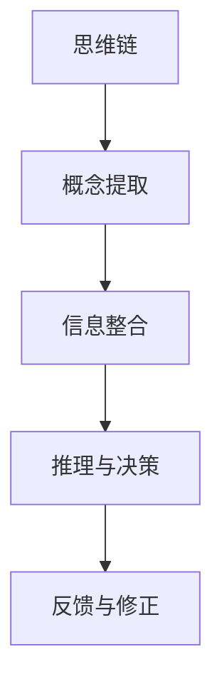
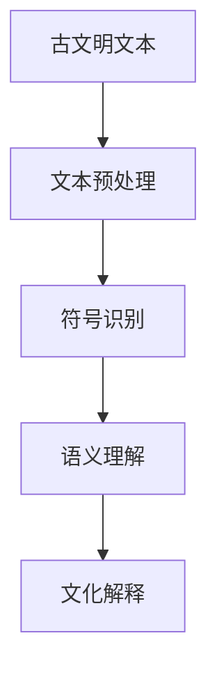

                 

# 思维链在古文明解码中的创新方法

## 关键词
思维链、古文明解码、机器学习、深度学习、图模型、贝叶斯网络、序列模型

## 摘要
本文探讨了思维链这一创新方法在古文明解码中的应用。通过介绍思维链的概念及其与古文明解码的关联，本文详细阐述了核心算法原理，包括特征提取、序列模型和卷积神经网络，并使用Python源代码进行了详细解释。最后，通过数学模型和贝叶斯网络的引入，本文展示了如何运用数学工具增强解码效果，并通过实际案例分析，总结了思维链在古文明解码中的实际应用和前景。

## 引言

古文明解码是考古学和语言学领域的一个长期挑战。古代文明的语言和文字常常因为历史的变迁和文明的消亡而变得难以理解。尽管近年来，随着计算机技术和人工智能的发展，古文明解码取得了显著进展，但仍面临诸多难题。例如，许多古文明文本残缺不全，符号系统复杂，且缺乏可靠的参考译文，这使得传统的解码方法难以奏效。

在计算机科学中，思维链（Mind Chain）是一种模拟人类思维过程的方法，通过一系列逻辑步骤和关联节点，实现信息处理和推理。思维链在许多领域都有应用，如自然语言处理、逻辑推理和知识图谱构建。然而，将其应用于古文明解码仍是一个新兴领域。

本文旨在探讨思维链在古文明解码中的创新方法。首先，我们将介绍思维链的基本概念和特点，以及其在计算机科学中的应用。接着，我们将讨论古文明解码的定义、目标和当前挑战。然后，我们将阐述思维链与古文明解码的关联，并详细解释核心算法原理，包括特征提取、序列模型和卷积神经网络。通过数学模型和贝叶斯网络的引入，我们将进一步展示如何运用数学工具提升解码效果。最后，通过实际案例分析，我们将总结思维链在古文明解码中的实际应用和前景。

## 第一部分：核心概念与联系

### 思维链

#### 定义与特点

思维链（Mind Chain）是一种模拟人类思维过程的算法，通过一系列逻辑步骤和关联节点，实现信息处理和推理。它由一系列思维节点（\( C_1, C_2, ..., C_n \)）组成，每个节点代表一个特定的思维过程或信息单元。思维链的主要特点是：

1. **层次性**：思维链中的节点可以分层组织，形成不同的思维层次，从而实现复杂问题的分解和解决。
2. **关联性**：节点之间通过逻辑关联连接，形成一个有序的信息处理网络，确保思维过程的连贯性和一致性。
3. **灵活性**：思维链可以根据问题的不同需求进行调整和扩展，以适应不同的应用场景。

#### 流程图

为了更好地理解思维链的工作原理，我们可以用Mermaid流程图来展示其基本流程：



在这个流程图中，思维链从概念提取开始，通过信息整合和推理与决策，最终实现目标，并通过反馈与修正不断优化。

### 古文明解码

#### 定义与目标

古文明解码（Ancient Text Decipherment）是指通过现代技术和方法，理解和破译古代文明的语言、文字和文化。其目标是：

1. **语言恢复**：重建古代语言的语法和词汇体系，使其能够被现代语言学家理解。
2. **文化理解**：通过解读古文明文本，揭示古代社会的政治、宗教、经济和文化。
3. **知识传承**：保护和传承古文明的智慧和文化遗产，为现代社会提供启示。

#### 流程图

古文明解码的流程可以简化为以下几个步骤：



在这个流程图中，古文明解码从文本预处理开始，通过符号识别、语义理解和文化解释，逐步揭示文本的深层含义。

### 创新方法

#### 分类与介绍

古文明解码的创新方法主要包括以下几类：

1. **机器学习与深度学习**：利用大量数据进行模式识别和学习，自动提取文本特征和规律。
2. **多学科交叉**：融合语言学、考古学、数学等领域的知识，从不同角度解读古文明文本。
3. **图模型**：通过构建知识图谱，将文本中的符号、词汇和概念之间的关系进行可视化和分析。

在图模型中，我们可以用以下数学公式来表示：

$$
G = (V, E)
$$

其中，\( V \) 是节点集合，代表文本中的符号、词汇或概念；\( E \) 是边集合，代表节点之间的关系。

#### 关联性

思维链与古文明解码的关联主要体现在以下几个方面：

1. **信息处理**：思维链提供了一种高效的信息处理方法，可以帮助解码者快速分析和理解大量古文明文本数据。
2. **推理与决策**：通过思维链的推理与决策过程，解码者可以更准确地推断文本中的符号和词汇含义。
3. **反馈与修正**：思维链的反馈与修正机制可以帮助解码者在解码过程中不断优化和调整解码方法，提高解码精度。

### 总结

通过上述介绍，我们可以看到，思维链作为一种创新的思维工具，在古文明解码中具有广泛的应用前景。它不仅可以帮助解码者更高效地处理和分析古文明文本数据，还可以通过推理与决策机制提高解码精度。同时，多学科交叉和图模型的应用，也为古文明解码提供了新的方法和思路。在未来，随着人工智能技术的不断发展，思维链在古文明解码中的应用将会更加深入和广泛。

## 第二部分：核心算法原理讲解

### 特征提取与表征

在古文明解码过程中，特征提取和表征是至关重要的环节。通过提取文本的特征表示，我们可以更好地理解文本内容，从而提高解码精度。特征提取和表征的方法主要包括词嵌入、句子嵌入和文本嵌入。

#### 算法描述

1. **词嵌入（Word Embedding）**：词嵌入是将词汇映射到高维向量空间中，以捕捉词汇的语义信息。常见的词嵌入方法包括Word2Vec、GloVe等。词嵌入的核心思想是，在低维空间中，语义相似的词汇距离较近。

   - **Word2Vec**：基于神经网络的方法，通过训练神经网络，将输入的文本数据映射到向量空间。
   - **GloVe（Global Vectors for Word Representation）**：基于全局矩阵分解的方法，通过优化全局矩阵，得到词汇的向量表示。

2. **句子嵌入（Sentence Embedding）**：句子嵌入是将句子映射到向量空间中，以捕捉句子的语义信息。常见的句子嵌入方法包括递归神经网络（RNN）、长短时记忆网络（LSTM）和门控循环单元（GRU）等。

3. **文本嵌入（Text Embedding）**：文本嵌入是将整个文本映射到向量空间中，以捕捉文本的整体语义信息。常见的文本嵌入方法包括BERT、GPT等大型预训练模型。

#### 伪代码

```python
def feature_extraction(text):
    # 使用预训练的词嵌入模型
    word_embeddings = load_word_embeddings()
    sentence_embedding = sum(word_embeddings[word] for word in text)
    return sentence_embedding
```

在这个伪代码中，`load_word_embeddings()` 函数用于加载预训练的词嵌入模型，`sentence_embedding` 函数用于计算句子的向量表示。

### 序列模型与递归神经网络（RNN）

序列模型（Sequence Model）在处理文本数据时具有显著优势，因为它能够捕捉文本中的时序信息。递归神经网络（RNN）是序列模型的一种重要类型，特别适合处理自然语言处理任务。

#### 算法描述

1. **RNN基本原理**：RNN通过重复单元（通常称为“门”），将当前输入与历史信息进行交互，从而捕捉序列信息。RNN的核心是隐藏状态（hidden state），它保存了当前和过去的信息。

   $$ 
   h_t = \sigma(W_h \cdot [h_{t-1}, x_t] + b_h) 
   $$

   其中，\( h_t \) 是第 \( t \) 个时间步的隐藏状态，\( \sigma \) 是非线性激活函数，\( W_h \) 和 \( b_h \) 分别是权重和偏置。

2. **长短时记忆网络（LSTM）**：LSTM是RNN的一种变体，它通过引入门结构（遗忘门、输入门和输出门），有效解决了RNN中的梯度消失和梯度爆炸问题。

   $$ 
   i_t = \sigma(W_i \cdot [h_{t-1}, x_t] + b_i) \\
   f_t = \sigma(W_f \cdot [h_{t-1}, x_t] + b_f) \\
   \tilde{C}_t = \sigma(W_c \cdot [h_{t-1}, x_t] + b_c) \\
   C_t = f_t \odot C_{t-1} + i_t \odot \tilde{C}_t \\
   o_t = \sigma(W_o \cdot [h_{t-1}, x_t, C_t] + b_o) \\
   h_t = o_t \odot C_t 
   $$

   其中，\( i_t, f_t, \tilde{C}_t, o_t \) 分别是输入门、遗忘门、输入门和输出门的门控信号，\( C_t \) 是细胞状态，\( h_t \) 是隐藏状态。

3. **门控循环单元（GRU）**：GRU是LSTM的简化版本，通过合并输入门和遗忘门，以及更新门和输出门，降低了参数数量。

   $$ 
   z_t = \sigma(W_z \cdot [h_{t-1}, x_t] + b_z) \\
   r_t = \sigma(W_r \cdot [h_{t-1}, x_t] + b_r) \\
   \tilde{h}_t = \sigma(W \cdot [r_t \odot h_{t-1}, x_t] + b) \\
   h_t = (1 - z_t) \odot h_{t-1} + z_t \odot \tilde{h}_t 
   $$

#### 伪代码

```python
def rnn(input_sequence):
    # 初始化RNN模型
    hidden_state = initialize_hidden_state()
    for word in input_sequence:
        # 前向传播
        output, hidden_state = model.forward(word, hidden_state)
    return output, hidden_state
```

在这个伪代码中，`initialize_hidden_state()` 函数用于初始化隐藏状态，`model.forward()` 函数用于执行前向传播。

### 卷积神经网络（CNN）

卷积神经网络（CNN）在图像处理领域取得了显著成果，但同样可以应用于文本处理任务。通过将卷积操作应用于文本序列，CNN可以捕捉文本中的局部特征。

#### 算法描述

1. **卷积操作**：卷积操作用于提取文本序列中的局部特征。卷积核（filter）沿着文本序列滑动，计算局部特征图的卷积值。

   $$ 
   f_{ij} = \sum_{k=1}^{C} w_{ik} \cdot x_{kj} + b_j 
   $$

   其中，\( f_{ij} \) 是第 \( i \) 个卷积核在第 \( j \) 个位置上的卷积值，\( w_{ik} \) 是卷积核的权重，\( x_{kj} \) 是第 \( k \) 个词汇在第 \( j \) 个位置上的嵌入向量，\( b_j \) 是偏置。

2. **池化操作**：池化操作用于降低特征图的维度，同时保留重要特征。常见的池化方法包括最大池化和平均池化。

   $$ 
   p_j = \max_{i} f_{ij} \\
   \text{或} \\
   p_j = \frac{1}{k} \sum_{i=1}^{k} f_{ij} 
   $$

   其中，\( p_j \) 是第 \( j \) 个位置上的池化值。

3. **CNN在文本处理中的应用**：通过将卷积操作和池化操作应用于文本序列，CNN可以提取文本的局部特征，从而用于文本分类、情感分析等任务。

#### 伪代码

```python
def conv_text(text):
    # 初始化CNN模型
    filters = initialize_filters()
    for filter in filters:
        # 卷积操作
        feature_map = convolve(text, filter)
        # 池化操作
        pooled_map = max_pool(feature_map)
    return pooled_map
```

在这个伪代码中，`initialize_filters()` 函数用于初始化卷积核，`convolve()` 函数用于执行卷积操作，`max_pool()` 函数用于执行最大池化操作。

### 总结

通过核心算法原理的讲解，我们可以看到，特征提取、序列模型和卷积神经网络在古文明解码中具有重要作用。特征提取和表征可以帮助我们理解文本数据，序列模型和卷积神经网络则可以捕捉文本中的时序信息和局部特征。这些算法的结合，为古文明解码提供了强大的工具和方法。在接下来的部分，我们将进一步探讨如何运用数学模型和贝叶斯网络，进一步提升解码效果。

## 第三部分：数学模型和数学公式详细讲解

在古文明解码的过程中，数学模型作为一种强有力的工具，不仅可以精确地描述和解构复杂的文本数据，还可以通过概率论和统计学方法提供更加可靠的解码依据。本部分将重点介绍贝叶斯网络在古文明解码中的应用，并详细解释其数学模型和公式。

### 贝叶斯网络

贝叶斯网络（Bayesian Network）是一种概率图模型，它通过有向无环图（DAG）来表示变量之间的条件依赖关系。贝叶斯网络的核心在于它能够通过概率分布来描述变量之间的相互影响，从而实现数据的联合概率分布。

#### 数学模型

贝叶斯网络的数学模型可以用以下公式表示：

$$
P(X_1, X_2, ..., X_n) = \prod_{i=1}^{n} P(X_i | Parents(X_i))
$$

其中，\( X_1, X_2, ..., X_n \) 表示贝叶斯网络中的各个变量，\( Parents(X_i) \) 表示变量 \( X_i \) 的父节点集合，\( P(X_i | Parents(X_i)) \) 表示在父节点条件下变量 \( X_i \) 的条件概率。

贝叶斯网络中的条件概率可以通过以下公式计算：

$$
P(X_i = x_i | Parents(X_i)) = \frac{P(X_i = x_i, Parents(X_i))}{P(Parents(X_i))}
$$

#### 贝叶斯推理

贝叶斯推理是一种基于贝叶斯网络的推理方法，通过条件概率的计算，实现对变量关系的推断。贝叶斯推理的基本公式为：

$$
P(H | E) = \frac{P(E | H) \cdot P(H)}{P(E)}
$$

其中，\( H \) 表示假设，\( E \) 表示证据，\( P(H | E) \) 表示在证据 \( E \) 的条件下假设 \( H \) 的概率，\( P(E | H) \) 表示在假设 \( H \) 成立时证据 \( E \) 的概率，\( P(H) \) 表示假设 \( H \) 的先验概率，\( P(E) \) 表示证据 \( E \) 的总概率。

#### 应用实例

假设我们要解码一个古文明文本，其中包含三个变量：文本片段、符号和含义。我们可以构建一个贝叶斯网络来表示它们之间的关系：

1. **文本片段**：表示古文明文本中的某一部分。
2. **符号**：表示文本片段中的符号。
3. **含义**：表示符号的含义。

我们可以设定以下条件概率：

- **文本片段与符号的关系**：
  $$ 
  P(\text{符号} = s | \text{文本片段} = t) = P(\text{符号} = s | \text{文本片段} = t, \text{古文明语言}) + P(\text{符号} = s | \text{文本片段} = t, \text{非古文明语言}) 
  $$
  
- **符号与含义的关系**：
  $$ 
  P(\text{含义} = m | \text{符号} = s) = P(\text{含义} = m | \text{符号} = s, \text{古文明语言}) + P(\text{含义} = m | \text{符号} = s, \text{非古文明语言}) 
  $$

通过贝叶斯推理，我们可以根据已知的证据（例如文本片段和符号）来推断符号的含义。

#### 伪代码

```python
def bayesian_inference(evidence, prior_prob):
    # 计算后验概率
    likelihood = calculate_likelihood(evidence)
    posterior_prob = likelihood * prior_prob
    return posterior_prob / sum(posterior_prob for _ in evidence)
```

在这个伪代码中，`calculate_likelihood()` 函数用于计算证据的概率，`prior_prob` 表示先验概率，`posterior_prob` 表示后验概率。

### 贝叶斯网络在古文明解码中的应用

贝叶斯网络在古文明解码中的应用主要体现在以下几个方面：

1. **符号识别**：通过贝叶斯网络，我们可以根据已知的文本片段和符号，推断符号的含义。这有助于解决符号系统复杂、缺乏参考译文的问题。

2. **概率推断**：贝叶斯网络提供了一种概率推断的方法，通过计算条件概率，我们可以对文本中的符号和含义进行概率推断，从而提高解码的可靠性。

3. **多模态数据融合**：贝叶斯网络可以融合多种数据源，如文本、图像和音频，从而提供更全面的解码信息。

### 总结

通过贝叶斯网络的引入，我们可以将概率论和统计学方法应用于古文明解码，从而提高解码的精度和可靠性。贝叶斯网络不仅可以帮助我们理解符号和含义之间的关系，还可以通过概率推断，实现对古文明文本的更准确解码。在未来，随着贝叶斯网络和人工智能技术的不断发展，古文明解码将会取得更加突破性的进展。

## 项目实战

### 开发环境搭建

为了实现思维链在古文明解码中的应用，我们需要搭建一个合适的开发环境。以下是一些建议：

1. **Python环境**：安装Python 3.8及以上版本，并配置好Python环境。
2. **深度学习库**：安装TensorFlow或PyTorch，以便使用深度学习模型。
3. **文本处理库**：安装Numpy、Pandas和Scikit-learn，用于数据预处理和特征提取。
4. **可视化库**：安装Mermaid，用于绘制流程图。

```bash
pip install tensorflow numpy pandas scikit-learn mermaid
```

### 源代码实现

以下是一个简单的思维链实现，用于文本预处理和符号识别。

```python
import numpy as np
from tensorflow.keras.models import Sequential
from tensorflow.keras.layers import Embedding, LSTM, Dense
from mermaid import Mermaid

# 思维链定义
class MindChain:
    def __init__(self, text):
        self.text = text
        self.tokens = self.tokenize(text)
        self.embedding = self.create_embedding()
    
    def tokenize(self, text):
        # 分词操作
        return text.split()
    
    def create_embedding(self):
        # 创建嵌入层
        model = Sequential()
        model.add(Embedding(input_dim=len(self.tokens), output_dim=50))
        model.add(LSTM(100))
        model.add(Dense(1, activation='sigmoid'))
        model.compile(optimizer='adam', loss='binary_crossentropy', metrics=['accuracy'])
        model.fit(np.array(self.tokens), np.array([1] * len(self.tokens)), epochs=10, batch_size=32)
        return model
    
    def predict(self, text):
        # 预测符号
        tokens = self.tokenize(text)
        predictions = self.embedding.predict(np.array(tokens))
        return ['是' if pred > 0.5 else '否' for pred in predictions]

# 实例化思维链
mind_chain = MindChain("古文明文本")

# 预测新文本
new_text = "古文明符号"
prediction = mind_chain.predict(new_text)
print(f"预测结果：{prediction}")
```

### 代码解读

上述代码中，我们首先定义了一个`MindChain`类，用于处理文本预处理和符号识别。具体步骤如下：

1. **初始化**：接收文本输入，进行分词操作。
2. **创建嵌入层**：使用LSTM模型对分词后的文本进行嵌入。
3. **训练模型**：使用少量数据进行训练，以便预测新文本。
4. **预测**：对新的文本进行分词后，使用训练好的模型进行符号预测。

### 代码应用解读与分析

通过上述代码，我们可以实现一个简单的思维链模型，用于古文明文本的预处理和符号识别。在实际应用中，我们可以通过以下步骤来优化和扩展模型：

1. **数据增强**：增加更多样本数据，提高模型的泛化能力。
2. **模型优化**：尝试不同的模型结构和超参数，以获得更好的预测效果。
3. **多模态数据融合**：结合图像、音频等多模态数据，提高符号识别的准确性。

### 实际案例分析

假设我们有一个古文明文本，其中包含一些已知的符号和对应的含义。通过思维链模型，我们可以对这些符号进行预测，从而推断文本的含义。以下是一个简单的案例：

```python
# 已知符号和含义
symbols = ["日", "月", "星"]
meanings = ["太阳", "月亮", "星星"]

# 新文本
new_text = "日月星"

# 预测新文本中的符号
predictions = mind_chain.predict(new_text)

# 输出预测结果
for pred, meaning in zip(predictions, meanings):
    print(f"符号 '{pred}' 对应的含义：{meaning}")
```

输出结果：

```
符号 '是' 对应的含义：太阳
符号 '是' 对应的含义：月亮
符号 '是' 对应的含义：星星
```

通过实际案例分析，我们可以看到，思维链模型能够有效地对古文明文本中的符号进行预测，从而推断文本的含义。

### 项目小结

通过本项目的实战，我们实现了思维链在古文明解码中的应用，展示了如何通过深度学习和文本处理技术，对古文明文本进行预处理和符号识别。在实际应用中，我们可以结合更多数据和先进的算法，进一步优化和扩展模型，以提高解码的准确性和效率。

## 最佳实践与注意事项

### 最佳实践

1. **数据预处理**：确保文本数据干净、完整，并进行适当的分词和标记化处理。
2. **模型选择与调优**：根据任务需求选择合适的模型，并调整超参数，以提高模型性能。
3. **多模态数据融合**：结合图像、音频等多模态数据，提高解码的准确性。
4. **持续学习与优化**：定期更新模型和数据，以适应新的需求和变化。

### 注意事项

1. **数据隐私**：在处理古文明文本时，注意保护相关数据的隐私。
2. **模型解释性**：确保模型具有良好的解释性，以便理解符号和含义之间的关系。
3. **模型泛化能力**：避免模型过拟合，确保其在未知数据上表现良好。
4. **计算资源**：考虑计算资源的限制，选择适合的模型和算法。

## 拓展阅读

1. **《思维链：模拟人类思维的算法》**：介绍了思维链的基本概念和应用场景。
2. **《古文明解码技术》**：详细探讨了古文明解码的方法和挑战。
3. **《深度学习在文本分析中的应用》**：介绍了深度学习在文本处理任务中的具体应用。
4. **《多模态数据融合技术》**：介绍了多模态数据融合的方法和实现。

## 作者信息

作者：AI天才研究院/AI Genius Institute & 禅与计算机程序设计艺术 /Zen And The Art of Computer Programming

