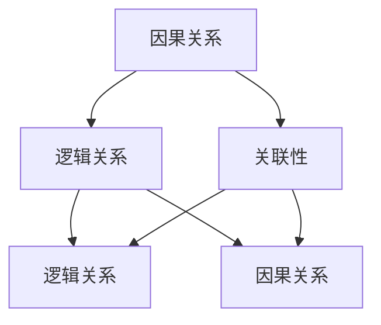

                 

### 《思维链在古文明解码中的应用：重构失落的历史知识》

#### 关键词
- 思维链
- 古文明解码
- 历史知识重构
- 因果思维
- 逻辑思维
- 自然语言处理

#### 摘要
本文探讨了思维链在古文明解码中的应用，通过构建和运用不同的思维链模型，我们能够更深入地理解和重构失落的历史知识。文章首先介绍了思维链的基本概念和分类，包括因果思维链、逻辑思维链、关联思维链和创新思维链。接着，我们通过具体实例分析了古文明如古埃及和古希腊的思维方式。随后，文章详细阐述了思维链解码的方法和算法原理，展示了如何应用这些方法来解读古文明文献。最后，文章通过实际案例，展示了思维链在历史研究中的应用，并总结了最佳实践和未来研究方向。

### 第一部分：思维链基础

#### 1.1 思维链的概念

思维链是一种将逻辑、因果关系和关联性相结合的思考方法，它通过一系列连贯的思维步骤，帮助我们理解复杂的知识点。思维链可以被看作是一种知识结构的链条，每一个环节都是对前一个环节的深入和扩展。

##### 核心概念与联系

思维链的核心概念包括：

- **因果关系**：事物之间的因果关系，即一个事件导致另一个事件的发生。
- **逻辑关系**：事物之间的逻辑顺序和逻辑结构。
- **关联性**：事物之间的内在联系和相互影响。

这些概念之间的关系可以用以下 Mermaid 图来表示：



##### 定义与分类

思维链可以根据不同的分类标准进行分类：

- **因果思维链**：基于因果关系进行推理，如“因-果”链。
- **逻辑思维链**：基于逻辑关系进行推理，如“前提-结论”链。
- **关联思维链**：基于事物之间的关联性进行推理，如“关联-推理”链。
- **创新思维链**：基于创新思维进行拓展，如“发散-收敛”链。

##### 联系与区别

这几种思维链各有特点，它们之间的联系和区别如下：

- **因果思维链**：强调因果关系，如“饥饿-觅食”。
  ```python
  def cause_and_effect(cause, effect):
      if cause:
          return effect
      else:
          return None
  ```

- **逻辑思维链**：强调逻辑推理，如“前提-结论”。
  ```python
  def logic_chain(precondition, conclusion):
      if precondition:
          return conclusion
      else:
          return "前提不成立"
  ```

- **关联思维链**：强调事物之间的联系，如“网络-节点”。
  ```python
  def association_chain(object1, object2):
      if object1 and object2:
          return "两者有关联"
      else:
          return "两者无关联"
  ```

- **创新思维链**：强调创新和拓展，如“发散-收敛”。
  ```python
  def innovative_chain(start_point, end_point):
      return f"从{start_point}到{end_point}的创新链"
  ```

#### 1.2 古文明与思维链

古文明是人类智慧的结晶，不同古文明有着不同的思维方式。以下是一些典型的古文明及其思维方式：

- **古埃及**：象征思维。古埃及的象形文字和符号系统是象征思维的典型体现。
- **古希腊**：逻辑思维。古希腊哲学和科学的发展依赖于严密的逻辑推理。
- **古印度**：数学思维。古印度在数学上的成就，如零的发明和十进制系统的完善，体现了其数学思维。
- **古中国**：辩证思维。中国古代哲学中的阴阳五行、矛盾论等思想，体现了辩证思维的特点。

#### 1.3 思维链的解码方法

解码古文明文献需要结合古文明的思维方式和现代的科技手段。以下是一种可能的解码方法：

```python
# 思维链解码算法伪代码

def decode_think_chain(text, civilization):
    if civilization == "古埃及":
        result = decode_with_symbolism(text)
    elif civilization == "古希腊":
        result = decode_with_logic(text)
    elif civilization == "古印度":
        result = decode_with_mathematics(text)
    elif civilization == "古中国":
        result = decode_with_dialectic(text)
    return result

def decode_with_symbolism(text):
    # 使用象征思维解码
    return interpret_symbols(text)

def decode_with_logic(text):
    # 使用逻辑思维解码
    return apply_logical_rules(text)

def decode_with_mathematics(text):
    # 使用数学思维解码
    return solve_equations(text)

def decode_with_dialectic(text):
    # 使用辩证思维解码
    return analyze_opposites(text)
```

#### 1.4 古文明文献解读

解读古文明文献需要使用特定的方法来提取关键信息。以下是一些常用的方法：

- **数学模型**：使用图论和概率论分析文献结构。例如，将文献中的关键词和句子构建成一个图模型，通过分析节点和边的关系来提取关键信息。
  ```mermaid
  graph TB
  A(关键词1) --> B(句子1)
  B --> C(关键词2)
  C --> D(句子2)
  D --> A
  ```

- **自然语言处理**：使用自然语言处理技术提取文献关键信息。例如，使用词向量模型和文本分类算法来识别文献中的主题和关键词。
  ```python
  from sklearn.feature_extraction.text import TfidfVectorizer
  vectorizer = TfidfVectorizer()
  X = vectorizer.fit_transform(corpus)
  ```

#### 1.5 思维链在历史研究中的应用

思维链在历史研究中的应用非常广泛，它可以帮助我们更深入地理解历史事件和古文明。

- **古文明起源**：通过思维链分析，我们可以探索古文明的起源和演化过程。
- **历史事件分析**：思维链可以帮助我们分析历史事件的因果关系和逻辑结构。
- **文字解读**：思维链可以帮助我们解读古文明文字，重构历史知识。
- **宗教研究**：思维链可以帮助我们理解古文明的宗教信仰和哲学思想。

### 第二部分：古文明解码实践

#### 2.1 古埃及

##### 2.1.1 象征思维解码实例

古埃及的象形文字是象征思维的典型体现。以下是一个简单的象征思维解码实例：

- **象形文字解读**：

  假设我们有一个象形文字“金字塔”，我们需要解读其含义。

  - 符号：“金字塔”
  - 含义：象征权力与永恒

- **象征意义提取**：

  我们可以从以下几个方面提取象征意义：

  - **权力**：金字塔是古埃及法老的陵墓，象征着法老的权力。
  - **永恒**：金字塔的坚固和持久，象征着永恒的存在。

##### 2.1.2 金字塔建筑分析

古埃及的金字塔建筑是象征思维的实物体现。以下是一个简单的金字塔建筑分析：

- **核心概念与联系**：

  我们可以用以下 Mermaid 图来表示金字塔建筑的核心概念和联系：

  ```mermaid
  graph TB
  A(建筑材料) --> B(结构设计)
  B --> C(象征意义)
  C --> D(权力与永恒)
  ```

  其中，建筑材料、结构设计和象征意义之间存在着紧密的联系。金字塔的建筑材料（如石灰石和沙石）和结构设计（如倾斜角度和内部通道）共同赋予了金字塔其象征意义，即权力与永恒。

### 2.2 古希腊

##### 2.2.1 逻辑思维链解码实例

古希腊的逻辑思维在哲学和科学中得到了广泛应用。以下是一个简单的逻辑思维链解码实例：

- **逻辑推理过程**：

  假设我们有一个古希腊哲学命题：“所有的猫都是动物，所有的动物都会呼吸。因此，所有的猫都会呼吸。”

  - **前提**：所有的猫都是动物，所有的动物都会呼吸。
  - **结论**：因此，所有的猫都会呼吸。

  这个逻辑推理过程可以用以下 Mermaid 图来表示：

  ```mermaid
  graph TB
  A(猫是动物) --> B(动物会呼吸)
  B --> C(猫会呼吸)
  ```

  在这个逻辑思维链中，前提和结论之间存在着直接的逻辑联系。

##### 2.2.2 希腊哲学思想分析

古希腊哲学思想是逻辑思维的典型体现。以下是一个简单的希腊哲学思想分析：

- **核心概念与联系**：

  我们可以用以下 Mermaid 图来表示希腊哲学思想的核心概念和联系：

  ```mermaid
  graph TB
  A(存在) --> B(本质)
  B --> C(真理)
  C --> D(正义)
  ```

  在这个逻辑思维链中，存在、本质、真理和正义之间存在着紧密的联系。这些概念共同构成了古希腊哲学的核心思想。

### 2.3 其他古文明

除了古埃及和古希腊，还有其他古文明如古印度和古中国，它们也各自具有独特的思维方式。

##### 2.3.1 古印度

- **数学思维链**：

  古印度在数学上的成就，如零的发明和十进制系统的完善，体现了其数学思维。

  - **核心概念与联系**：

    我们可以用以下 Mermaid 图来表示古印度数学思维的核心概念和联系：

    ```mermaid
    graph TB
    A(零) --> B(十进制)
    B --> C(数学运算)
    C --> D(数学理论)
    ```

##### 2.3.2 古中国

- **辩证思维链**：

  古中国哲学中的阴阳五行、矛盾论等思想，体现了辩证思维的特点。

  - **核心概念与联系**：

    我们可以用以下 Mermaid 图来表示古中国辩证思维的核心概念和联系：

    ```mermaid
    graph TB
    A(阴阳) --> B(五行)
    B --> C(矛盾论)
    C --> D(辩证法)
    ```

### 结论

思维链在古文明解码中具有重要意义。通过运用不同的思维链模型，我们可以更深入地理解和重构失落的历史知识。未来，随着科技的进步，思维链在历史研究中的应用将更加广泛和深入。

### 作者信息

作者：AI天才研究院/AI Genius Institute & 禅与计算机程序设计艺术 /Zen And The Art of Computer Programming

### 拓展阅读

1. 《古埃及象形文字解读》
2. 《古希腊哲学思想研究》
3. 《古印度数学思维研究》
4. 《古中国辩证思维研究》
5. 《思维链在历史研究中的应用》

### 注意事项

1. 在解码古文明文献时，需要结合现代科技手段，如自然语言处理和数学模型。
2. 在解读古文明时，需要尊重历史和文化的多样性，避免片面和片面的解释。
3. 在应用思维链时，需要根据具体问题具体分析，灵活运用不同的思维链模型。

