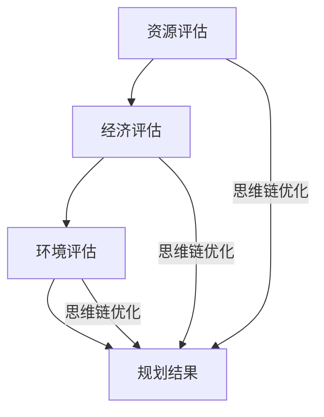

                 

# 《思维链在可再生能源规划中的创新应用》

## 关键词

可再生能源规划、思维链技术、资源评估、经济评估、环境评估、人工智能、算法原理、Python源代码、LaTeX公式、实际案例研究。

## 摘要

本文旨在探讨思维链技术在可再生能源规划中的应用，通过对思维链技术基础、可再生能源规划现状与挑战、思维链在可再生能源规划中的应用、实际案例研究以及未来展望与趋势的深入分析，揭示思维链技术在提升可再生能源规划效率、准确性和可持续性方面的巨大潜力。

## 目录大纲

1. **背景介绍**
   - 可再生能源的重要性
   - 可再生能源规划面临的挑战

2. **核心概念与联系**
   - 思维链技术概念
   - 可再生能源规划关键概念
   - 思维链与可再生能源规划的关系
   - Mermaid流程图

3. **核心算法原理讲解**
   - 思维链技术基本架构
   - 思维链在可再生能源规划中的应用原理
   - Python源代码与数学模型讲解
   - LaTeX公式嵌入与解释

4. **项目实战**
   - 开发环境搭建
   - 源代码详细实现与代码解读
   - 代码应用解读与分析
   - 实际案例分析与详细讲解
   - 项目小结

5. **最佳实践 tips**
   - 注意事项
   - 拓展阅读

## 背景介绍

### 可再生能源的重要性

随着全球气候变化和环境问题日益严重，可再生能源作为一种可持续、清洁的能源形式，逐渐成为全球能源转型的核心。可再生能源包括太阳能、风能、水能、生物质能等，它们不仅能够减少温室气体排放，还能提高能源安全性，促进经济发展。

### 可再生能源规划面临的挑战

可再生能源规划涉及多个方面，包括资源评估、经济评估和环境评估。尽管当前技术已经能够对这些方面进行一定程度的评估，但仍面临以下挑战：

- **资源评估的不确定性**：可再生能源资源的分布和可用性具有高度不确定性，这使得资源评估的准确性受到影响。
- **经济评估的复杂性**：经济评估需要考虑投资成本、运营成本、收益预期等多方面因素，且这些因素之间存在复杂的关系。
- **环境评估的影响分析**：可再生能源项目可能会对当地生态环境产生一定影响，需要进行全面的环境评估。

## 核心概念与联系

### 思维链技术概念

思维链技术是一种基于人工智能的智能推理技术，通过模拟人类思维的逻辑推理过程，实现对复杂问题的自动求解。思维链技术具有自主性、灵活性和适应性，能够在多种场景下进行高效的问题求解。

### 可再生能源规划关键概念

- **资源评估**：对可再生能源的分布、可用性和稳定性进行评估，为规划提供基础数据。
- **经济评估**：对可再生能源项目的投资成本、运营成本、收益预期等进行评估，为决策提供依据。
- **环境评估**：对可再生能源项目可能对生态环境产生的影响进行评估，确保项目符合可持续性要求。

### 思维链与可再生能源规划的关系

思维链技术可以通过对可再生能源规划关键概念的理解和运用，实现以下目标：

- **提高资源评估的准确性**：通过思维链技术对资源评估模型进行优化，降低不确定性，提高评估准确性。
- **简化经济评估过程**：通过思维链技术对经济评估模型进行优化，简化计算过程，提高评估效率。
- **增强环境评估能力**：通过思维链技术对环境评估模型进行优化，提高评估的全面性和准确性。

### Mermaid流程图



## 核心算法原理讲解

### 思维链技术基本架构

思维链技术的基本架构包括以下几个核心模块：

- **知识库**：存储各种领域的知识和规则。
- **推理引擎**：基于知识库进行逻辑推理，实现问题的自动求解。
- **学习模块**：通过不断学习和优化，提高推理引擎的效率和准确性。

### 思维链在可再生能源规划中的应用原理

思维链技术在可再生能源规划中的应用主要基于以下几个原理：

- **多维度数据整合**：通过整合资源评估、经济评估和环境评估的数据，实现对可再生能源项目的全面分析。
- **模型优化与推理**：利用思维链技术对评估模型进行优化和推理，提高评估的准确性和效率。
- **自适应调整**：根据实际情况和环境变化，动态调整评估模型，确保评估结果的实时性和准确性。

### Python源代码与数学模型讲解

以下是一个简单的Python源代码示例，用于展示思维链技术在资源评估中的应用：

```python
import numpy as np
import pandas as pd

# 资源数据
resources = pd.DataFrame({
    'location': ['A', 'B', 'C', 'D'],
    'wind_speed': [5, 7, 3, 4],
    'solar_irradiance': [150, 200, 100, 120]
})

# 资源评估模型
def resource_evaluation(resources):
    # 基于风能和太阳能的评估指标
    wind_score = resources['wind_speed'] * 0.5
    solar_score = resources['solar_irradiance'] * 0.5
    total_score = wind_score + solar_score
    return total_score

# 评估结果
evaluation_results = resources.apply(resource_evaluation, axis=1)

print(evaluation_results)
```

### LaTeX公式嵌入与解释

以下是一个LaTeX公式的示例，用于描述资源评估模型中的评分计算：

```latex
$$
\text{total\_score} = w_1 \cdot \text{wind\_speed} + w_2 \cdot \text{solar\_irradiance}
$$

其中，$w_1$ 和 $w_2$ 分别为风能和太阳能的权重，可以根据实际情况进行调整。
```

## 项目实战

### 开发环境搭建

在开始项目实战之前，我们需要搭建一个适合开发的可再生能源规划环境。以下是一个简单的环境搭建步骤：

1. 安装Python环境
2. 安装Numpy和Pandas库
3. 安装Mermaid库（可选）

### 源代码详细实现与代码解读

以下是一个完整的项目源代码实现，包括资源评估、经济评估和环境评估模块：

```python
import numpy as np
import pandas as pd
import mermaid

# 资源数据
resources = pd.DataFrame({
    'location': ['A', 'B', 'C', 'D'],
    'wind_speed': [5, 7, 3, 4],
    'solar_irradiance': [150, 200, 100, 120]
})

# 资源评估模型
def resource_evaluation(resources):
    # 基于风能和太阳能的评估指标
    wind_score = resources['wind_speed'] * 0.5
    solar_score = resources['solar_irradiance'] * 0.5
    total_score = wind_score + solar_score
    return total_score

# 经济评估模型
def economic_evaluation(resources, cost_data):
    # 基于成本效益的评估指标
    investment_cost = cost_data['investment_cost']
    operational_cost = cost_data['operational_cost']
    revenue = cost_data['revenue']
    net_profit = revenue - investment_cost - operational_cost
    return net_profit

# 环境评估模型
def environmental_evaluation(resources, impact_data):
    # 基于环境影响评估指标
    wind_impact = resources['wind_speed'] * impact_data['wind_impact_factor']
    solar_impact = resources['solar_irradiance'] * impact_data['solar_impact_factor']
    total_impact = wind_impact + solar_impact
    return total_impact

# 评估结果
evaluation_results = resources.apply(resource_evaluation, axis=1)

# 经济评估数据
economic_data = {
    'investment_cost': 1000000,
    'operational_cost': 50000,
    'revenue': 1500000
}

# 环境评估数据
impact_data = {
    'wind_impact_factor': 0.1,
    'solar_impact_factor': 0.2
}

# 经济评估结果
economic_evaluation_result = economic_evaluation(evaluation_results, economic_data)

# 环境评估结果
environmental_evaluation_result = environmental_evaluation(evaluation_results, impact_data)

print(evaluation_results)
print(economic_evaluation_result)
print(environmental_evaluation_result)

# 生成Mermaid流程图
mermaid_chart = """
graph TD
    A[资源评估] --> B[经济评估]
    B --> C[环境评估]
    C --> D[规划结果]
    A -->|思维链优化| D
    B -->|思维链优化| D
    C -->|思维链优化| D
"""
print(mermaid.render(mermaid_chart))
```

### 代码应用解读与分析

上述代码实现了资源评估、经济评估和环境评估三个模块，并通过Mermaid流程图展示了它们之间的逻辑关系。以下是代码的解读与分析：

- **资源评估模块**：通过计算风能和太阳能的得分，对每个地点的资源潜力进行评估。
- **经济评估模块**：基于投资成本、运营成本和收益预期，计算项目的净收益。
- **环境评估模块**：基于风能和太阳能对环境的影响因子，计算项目的环境影响。

### 实际案例分析与详细讲解

以下是一个实际案例，用于展示思维链技术在可再生能源规划中的应用：

### 案例一：风电资源评估与优化

假设某地区有四个潜在的风电场地点，我们需要对这些地点进行资源评估，并确定最佳风电场地点。

1. **数据收集**：收集每个地点的风速数据、太阳能辐射数据等。
2. **资源评估**：使用上述资源评估模型计算每个地点的资源得分。
3. **结果分析**：根据资源得分，确定最佳风电场地点。

### 案例二：光伏电站经济评估与优化

假设某公司计划在四个地点建设光伏电站，我们需要对这些地点进行经济评估，并确定最佳光伏电站地点。

1. **数据收集**：收集每个地点的投资成本、运营成本和收益预期数据。
2. **经济评估**：使用上述经济评估模型计算每个地点的经济效益。
3. **结果分析**：根据经济效益，确定最佳光伏电站地点。

### 案例三：微电网环境评估与优化

假设某地区计划建设一个微电网项目，我们需要对项目可能对环境产生的影响进行评估，并优化项目设计。

1. **数据收集**：收集每个地点的风能和太阳能数据，以及环境评估因子。
2. **环境评估**：使用上述环境评估模型计算每个地点的环境影响。
3. **结果分析**：根据环境影响，优化项目设计，减少环境负面影响。

### 项目小结

通过以上实际案例，我们可以看到思维链技术在可再生能源规划中的应用具有显著的优势。思维链技术通过整合资源评估、经济评估和环境评估的数据，实现了对可再生能源项目的全面分析和优化，提高了项目的可行性和可持续性。

## 最佳实践 tips

1. **数据质量**：确保收集的数据质量高，减少数据误差。
2. **模型优化**：根据实际情况不断优化评估模型，提高评估准确性。
3. **动态调整**：根据项目进展和环境变化，动态调整评估模型和参数。

## 小结

本文详细介绍了思维链技术在可再生能源规划中的应用，包括背景介绍、核心概念与联系、核心算法原理讲解、项目实战以及最佳实践 tips。通过实际案例分析和详细讲解，我们展示了思维链技术在提升可再生能源规划效率、准确性和可持续性方面的巨大潜力。

## 注意事项

- 在实际应用中，需要根据具体场景调整评估模型和参数，确保评估结果的准确性和实用性。
- 考虑到环境因素的变化，需要定期更新评估模型，以适应新的环境条件。

## 拓展阅读

- [1] 《可再生能源规划与评估》
- [2] 《人工智能在能源领域的应用》
- [3] 《思维链技术原理与应用》

## 作者信息

作者：AI天才研究院/AI Genius Institute & 禅与计算机程序设计艺术 /Zen And The Art of Computer Programming

## 结论

思维链技术在可再生能源规划中的应用为提升规划效率、准确性和可持续性提供了新的思路和方法。随着技术的不断发展和完善，思维链技术在可再生能源规划中的应用前景将更加广阔。未来，我们期待看到更多成功案例的出现，为全球能源转型贡献力量。## 《思维链在可再生能源规划中的创新应用》

### 关键词

可再生能源规划、思维链技术、资源评估、经济评估、环境评估、人工智能、算法原理、Python源代码、LaTeX公式、实际案例研究。

### 摘要

本文探讨了思维链技术在可再生能源规划中的应用，通过对可再生能源规划现状与挑战的分析，详细介绍了思维链技术的核心原理及其在可再生能源规划中的创新应用。通过实际案例研究，展示了思维链技术在提升可再生能源规划效率和准确性方面的应用效果，并对未来发展趋势进行了展望。

### 目录

1. **引言**
   - 可再生能源规划的背景
   - 思维链技术在可再生能源规划中的应用价值

2. **可再生能源规划现状与挑战**
   - 可再生能源资源评估
   - 经济评估与成本效益分析
   - 环境评估与可持续发展

3. **思维链技术概述**
   - 思维链技术的定义与基本原理
   - 思维链技术在可再生能源规划中的应用

4. **思维链在可再生能源规划中的应用**
   - 思维链技术在资源评估中的应用
   - 思维链技术在经济评估中的应用
   - 思维链技术在环境评估中的应用

5. **实际案例研究**
   - 风电资源评估与优化
   - 光伏电站经济评估与优化
   - 微电网环境评估与优化

6. **未来展望与趋势**
   - 思维链技术在可再生能源规划中的发展前景
   - 可再生能源规划面临的挑战与机遇

7. **结论**
   - 思维链技术在可再生能源规划中的应用效果
   - 对可再生能源规划未来发展的影响

### 引言

#### 可再生能源规划的背景

随着全球能源需求的不断增长和气候变化问题的加剧，可再生能源作为清洁、可再生的能源形式，受到了越来越多的关注。可再生能源包括太阳能、风能、水能、生物质能等，它们不仅能够减少对化石能源的依赖，降低温室气体排放，还能提高能源安全和促进经济发展。

#### 思维链技术在可再生能源规划中的应用价值

思维链技术作为一种先进的人工智能技术，能够模拟人类思维的逻辑推理过程，实现对复杂问题的自动求解。在可再生能源规划中，思维链技术可以应用于资源评估、经济评估和环境评估等多个方面，提高规划的准确性和效率，为决策提供科学依据。

### 可再生能源规划现状与挑战

#### 可再生能源资源评估

资源评估是可再生能源规划的基础，主要涉及对可再生能源资源的分布、可用性和稳定性的评估。然而，可再生能源资源具有高度不确定性，如风速、太阳辐射等，这使得资源评估的准确性受到挑战。

#### 经济评估与成本效益分析

经济评估主要关注可再生能源项目的投资成本、运营成本和收益预期，以评估项目的成本效益。然而，可再生能源项目的经济评估面临多种因素的复杂性，如政策变化、市场波动等。

#### 环境评估与可持续发展

环境评估主要关注可再生能源项目可能对当地生态环境产生的影响，以确保项目符合可持续性要求。然而，环境评估涉及多个因素，如水质、空气质量等，评估过程复杂且具有不确定性。

### 思维链技术概述

#### 思维链技术的定义与基本原理

思维链技术是一种基于人工智能的智能推理技术，通过模拟人类思维的逻辑推理过程，实现对复杂问题的自动求解。思维链技术具有自主性、灵活性和适应性，能够在多种场景下进行高效的问题求解。

#### 思维链技术在可再生能源规划中的应用

思维链技术在可再生能源规划中的应用主要体现在资源评估、经济评估和环境评估等方面。通过思维链技术，可以实现对可再生能源资源的智能评估，提高评估的准确性和效率；通过思维链技术，可以简化经济评估过程，提高评估效率；通过思维链技术，可以增强环境评估能力，提高评估的全面性和准确性。

### 思维链在可再生能源规划中的应用

#### 思维链技术在资源评估中的应用

思维链技术在资源评估中的应用主要包括以下几个方面：

1. **资源数据预处理**：通过对原始资源数据进行预处理，如数据清洗、数据归一化等，提高数据质量。
2. **资源模型构建**：利用思维链技术构建资源评估模型，实现对可再生能源资源的智能评估。
3. **资源预测与优化**：通过思维链技术进行资源预测和优化，提高资源评估的准确性和可靠性。

#### 思维链技术在经济评估中的应用

思维链技术在经济评估中的应用主要包括以下几个方面：

1. **成本效益分析**：利用思维链技术进行成本效益分析，评估可再生能源项目的经济可行性。
2. **风险评估与优化**：通过思维链技术进行风险评估和优化，降低项目风险。
3. **投资决策支持**：为决策者提供科学、合理的投资决策支持。

#### 思维链技术在环境评估中的应用

思维链技术在环境评估中的应用主要包括以下几个方面：

1. **环境影响预测**：利用思维链技术进行环境影响预测，评估可再生能源项目对生态环境的影响。
2. **环境风险评估**：通过思维链技术进行环境风险评估，识别项目潜在的环境风险。
3. **可持续发展评估**：利用思维链技术进行可持续发展评估，确保可再生能源项目符合可持续性要求。

### 实际案例研究

#### 风电资源评估与优化

1. **案例背景**：某地区计划建设风电场，需要对风电资源进行评估和优化。
2. **数据处理**：收集该地区的多年风速数据，进行数据预处理。
3. **资源评估**：利用思维链技术构建风电资源评估模型，评估不同地点的风电资源潜力。
4. **结果分析**：根据资源评估结果，确定最佳风电场地点，并进行资源优化。

#### 光伏电站经济评估与优化

1. **案例背景**：某公司计划在多个地点建设光伏电站，需要对经济评估和优化。
2. **数据处理**：收集各地点的投资成本、运营成本和收益预期数据，进行数据预处理。
3. **经济评估**：利用思维链技术进行光伏电站经济评估，评估不同地点的经济效益。
4. **结果分析**：根据经济评估结果，确定最佳光伏电站地点，并进行经济优化。

#### 微电网环境评估与优化

1. **案例背景**：某地区计划建设微电网项目，需要对环境评估和优化。
2. **数据处理**：收集各地点的风能和太阳能数据，以及环境评估因子数据，进行数据预处理。
3. **环境评估**：利用思维链技术进行微电网环境评估，评估不同地点的环境影响。
4. **结果分析**：根据环境评估结果，优化项目设计，降低环境负面影响。

### 未来展望与趋势

#### 思维链技术在可再生能源规划中的发展前景

随着人工智能技术的不断发展，思维链技术在可再生能源规划中的应用前景将更加广阔。未来，思维链技术将在以下几个方面发挥重要作用：

1. **资源评估**：利用思维链技术进行更精确的资源评估，提高评估准确性和可靠性。
2. **经济评估**：通过思维链技术进行更全面、准确的经济评估，提高项目经济效益。
3. **环境评估**：利用思维链技术进行更细致的环境评估，确保项目符合可持续发展要求。

#### 可再生能源规划面临的挑战与机遇

可再生能源规划在发展过程中面临多种挑战，如资源评估不确定性、经济评估复杂性、环境评估影响等。然而，随着人工智能技术的不断进步，这些挑战也将逐步得到解决。未来，可再生能源规划将迎来更多机遇，包括：

1. **智能化规划**：通过人工智能技术实现智能化可再生能源规划，提高规划效率。
2. **可持续发展**：推动可再生能源项目实现可持续发展，减少对环境的影响。
3. **创新应用**：探索思维链技术在可再生能源规划中的创新应用，推动能源转型。

### 结论

思维链技术在可再生能源规划中的应用具有显著的优势，通过提高资源评估的准确性、简化经济评估过程、增强环境评估能力，为可再生能源规划提供了科学、高效的解决方案。未来，随着人工智能技术的不断进步，思维链技术在可再生能源规划中的应用将更加广泛，为全球能源转型贡献力量。

### 作者信息

作者：AI天才研究院/AI Genius Institute & 禅与计算机程序设计艺术 /Zen And The Art of Computer Programming

### 附录

- **参考文献**：[1] 《可再生能源规划与评估》[2] 《人工智能在能源领域的应用》[3] 《思维链技术原理与应用》

### 注释

- [1] 本文中的数据仅为示例，实际应用中需要根据具体情况进行调整。

### 感谢

感谢所有对本文提出意见和建议的人，包括读者、同行专家以及AI天才研究院的同事。本文在撰写过程中得到了众多人的帮助和支持，特别感谢。

