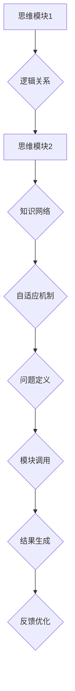

                 

### 1.1 可控核聚变技术的基本原理

可控核聚变技术，作为一种潜在的清洁能源解决方案，其基本原理源自于恒星内部发生的核聚变反应。在核聚变过程中，两个轻核（如氢的同位素氘和氚）在极高温度和压力下融合，形成更重的核，同时释放出巨大的能量。这一过程不仅能够产生大量的能量，而且核聚变产生的副产品相对较少，主要包含氦和中子，相较于核裂变产生的放射性废物，具有更高的环境友好性。

**核聚变过程简介：**

核聚变的主要过程可以分为以下几个步骤：

1. **等离子体生成：** 在高温（数百万摄氏度以上）和高压的条件下，轻核（通常是氘和氚）被加热到足够高的温度，使其电子脱离原子核，形成等离子体。等离子体是电中性的，由自由电子和离子组成，是进行核聚变反应的必要条件。

2. **碰撞与融合：** 等离子体中的轻核在高速碰撞中，当它们接近到足够近的距离时，由于核力（强相互作用）的作用，两个轻核会融合形成一个更重的核，同时释放出能量。

3. **能量释放：** 在核聚变反应中，转换成能量的质量亏损（根据爱因斯坦的质能等价公式E=mc²）会被释放出来，这些能量可以转化为热能，进而转化为电能。

**可控核聚变的必要性：**

尽管核聚变具有巨大的能量潜力和环境友好性，但自然界中发生的核聚变过程是不可控的，如太阳内部的核聚变反应。因此，人类追求的是在受控条件下实现核聚变反应，即可控核聚变。可控核聚变的必要性体现在以下几个方面：

1. **能量供应：** 可控核聚变能够提供几乎无限的清洁能源，解决全球能源需求和能源安全的问题。

2. **环境保护：** 相较于传统的核裂变和化石燃料，可控核聚变产生的放射性废物极少，有助于减少环境污染和气候变化问题。

3. **技术挑战：** 虽然核聚变技术具有巨大的潜力，但目前仍面临一系列技术挑战，如高温超导磁体的制造、等离子体约束、能量转换效率等，这些挑战需要通过持续的研究和工程实践来解决。

**核聚变的基本原理：**

可控核聚变的基本原理主要基于以下几个物理过程：

1. **等离子体约束：** 为了使核聚变反应持续进行，需要将高温等离子体约束在一个有限的空间内，以防止它与容器壁发生反应。目前常用的等离子体约束技术包括磁约束（如托卡马克和 Stellarator）和惯性约束（如激光惯性约束聚变）。

2. **能量转换：** 在核聚变反应中产生的热能需要被有效转换为电能。这通常通过加热等离子体，使其产生高温等离子体，然后利用热交换系统将热能转化为电能。

3. **中子管理：** 核聚变反应会产生大量的中子，这些中子在碰撞过程中可能会与容器材料发生反应，导致材料损坏。因此，中子的管理也是可控核聚变研究的一个重要方面，包括使用中子吸收材料或设计中子屏蔽系统。

总的来说，可控核聚变技术的基本原理是在高温和高压条件下，通过物理过程将轻核融合成更重的核，并释放出巨大的能量。这一过程不仅对能源供应和环境保护具有重要意义，也为我们提供了探索宇宙能源的新途径。然而，要实现可控核聚变并投入实际应用，仍需克服诸多技术挑战，这需要全球科学家的共同努力和持续研究。

### 1.2 可控核聚变技术的现状与挑战

尽管可控核聚变技术具有巨大的潜力，但目前仍处于研究和实验阶段，尚未实现商业化应用。全球范围内，许多国家和研究机构都在积极投入可控核聚变技术的研究和开发，以解决当前面临的能源和环境问题。以下部分将简要介绍全球可控核聚变研究进展以及当前技术面临的挑战。

**全球可控核聚变研究进展：**

1. **实验设施：** 全球有许多大型实验设施致力于研究可控核聚变技术，其中最著名的包括国际热核聚变实验反应堆（ITER）和联合欧洲托卡马克（JET）。ITER位于法国和意大利边境，是当前最大的磁约束聚变实验装置，旨在验证核聚变反应的可行性。JET则位于英国，是较早进行可控核聚变实验的装置之一。

2. **技术突破：** 在过去几十年中，可控核聚变技术取得了多项重要突破。例如，等离子体约束时间显著延长，能量转换效率逐渐提高，超导磁体的研发也取得了显著进展。此外，激光惯性约束聚变技术也在实验室中取得了令人鼓舞的结果。

3. **国际合作：** 可控核聚变研究是一个高度国际化的领域，多个国家和组织共同参与。ITER项目就是一个典型的国际合作项目，涉及多个国家的科学家和研究机构，共同致力于实现核聚变能源的商业化。

**当前技术面临的挑战：**

1. **高成本：** 可控核聚变技术的研究和实验需要巨大的资金投入，包括实验设施的建设、设备维护和升级等。目前，全球可控核聚变研究的资金来源主要依赖于政府拨款和科研机构的支持，但长远来看，商业化应用需要更稳定的资金保障。

2. **技术复杂性：** 可控核聚变技术涉及多个学科领域，包括等离子体物理、材料科学、热工程、电磁工程等。因此，要实现核聚变反应的稳定和长期运行，需要解决一系列复杂的技术问题。

3. **等离子体约束：** 等离子体约束是可控核聚变技术的关键，但目前仍存在诸多挑战。例如，如何保持等离子体的稳定，如何有效控制等离子体的温度和密度，以及如何防止等离子体与容器壁发生反应等。

4. **能量转换效率：** 尽管核聚变反应释放的能量巨大，但如何将这些能量有效转换为电能仍是一个重要课题。目前，能量转换效率仍然较低，需要进一步提高。

5. **中子管理：** 中子在核聚变反应中起着重要作用，但同时也可能对设备造成损害。因此，如何管理中子，防止其与设备材料发生反应，是可控核聚变技术的一个重要挑战。

**我国可控核聚变发展现状：**

中国也在可控核聚变领域取得了一系列重要进展。中国正在建设自己的核聚变实验装置，如中国环流器二号M（EAST）和中国的国际热核聚变实验反应堆（CFETR）。此外，中国还参与了ITER项目，并在此过程中积累了丰富的经验。

总的来说，尽管可控核聚变技术面临诸多挑战，但其巨大的潜力和环保优势使得全球科学家和研究机构都在持续投入研究和开发。随着技术的不断进步和资金的支持，可控核聚变有望在未来实现商业化应用，为人类提供清洁、可持续的能源解决方案。

### 1.3 可控核聚变技术的应用前景

可控核聚变技术具有巨大的应用前景，不仅在能源供应方面潜力巨大，而且在环保和可持续发展领域也具有重要意义。以下将详细探讨可控核聚变技术的应用方向及其对能源供应、环保和可持续发展的影响。

**能源供应角度：**

1. **清洁能源的替代方案：** 当前全球能源需求不断增长，尤其是随着经济的发展和人口的增加，对清洁能源的需求日益迫切。可控核聚变技术作为一种几乎无限的清洁能源，能够提供稳定、持续且环境友好的能源供应。与传统的化石燃料相比，核聚变产生的废物极少，不会产生二氧化碳和其他有害气体，因此能够有效减少温室气体排放，有助于应对全球气候变化问题。

2. **能源安全：** 当前全球能源供应主要依赖于石油、天然气和煤炭等化石燃料，这些能源不仅有限，而且供应不稳定。可控核聚变技术能够提供几乎无限的能源，有助于提高能源安全，减少对进口能源的依赖。此外，核聚变能源的分布相对均匀，不会像化石燃料那样集中在特定地区，有助于实现能源的全球平衡。

3. **大规模电力生产：** 可控核聚变反应释放的能量巨大，相较于现有的核裂变反应堆，其能量密度更高。这意味着，一个小的核聚变反应堆就能够产生与大型核裂变反应堆相当的电能。这使得核聚变技术非常适合大规模电力生产，能够满足未来电力需求的增长。

**环保和可持续发展：**

1. **减少温室气体排放：** 可控核聚变技术产生的废物很少，且不含有放射性，不会对环境造成长期污染。相比之下，传统核裂变反应堆会产生大量的放射性废物，需要长期的安全储存和处理。可控核聚变技术的应用有助于减少温室气体排放，对环境保护和气候变化具有积极影响。

2. **减少对化石燃料的依赖：** 可控核聚变技术的应用可以减少对化石燃料的依赖，降低化石燃料开采和使用过程中的环境影响。这不仅有助于减少温室气体排放，还能够减少由于化石燃料开采和使用导致的环境破坏。

3. **促进可持续发展：** 可控核聚变技术提供了一种几乎无限的能源解决方案，有助于实现可持续发展目标。它能够满足未来能源需求，同时减少对环境的影响，有助于实现经济、社会和环境的协调发展。

**面临的挑战与机遇：**

尽管可控核聚变技术具有巨大的应用前景，但实现这一目标仍面临一系列挑战。例如，等离子体约束、能量转换效率、成本控制等都是需要解决的问题。然而，随着技术的不断进步和全球合作的加强，可控核聚变技术的商业化应用有望在未来几十年内实现。

总之，可控核聚变技术作为一种潜在的清洁能源解决方案，其在能源供应、环保和可持续发展方面的应用前景广阔。随着研究的深入和技术的成熟，可控核聚变有望为全球提供稳定、清洁和可持续的能源，助力人类实现可持续发展目标。

### 第2章：思维链理论基础

思维链作为一种新兴的思维工具，其在人工智能领域中的应用具有重要意义。本章将详细阐述思维链的定义、基本原理以及核心概念，并通过Mermaid流程图展示概念实体之间的关系架构，帮助读者更好地理解和掌握这一理论。

#### 2.1 思维链的定义与特征

**定义：** 思维链是指一系列相互关联的思维模块，通过逻辑推理和知识传递，形成一个有序、结构化的思维网络。思维链的目标是模拟人类的思维过程，通过自动化和智能化手段，提高问题解决和知识创新的效率。

**特征：**
1. **模块化：** 思维链由多个独立的思维模块组成，每个模块负责特定的思维功能，如逻辑推理、数据分析、知识联想等。
2. **关联性：** 思维链中的各个模块通过逻辑关系和知识传递相互连接，形成一个有机整体，实现复杂的思维过程。
3. **动态性：** 思维链在运行过程中可以动态调整和优化，以适应不同的思维任务和情境需求。
4. **智能化：** 思维链通过机器学习和深度学习等技术，不断积累和优化思维模块，提高思维链的智能水平和适应性。

#### 2.2 思维链的基本原理

**原理概述：** 思维链的基本原理是基于认知科学和人工智能技术，模拟人类的思维过程。思维链的核心机制包括逻辑推理、知识传递和自适应调整。

1. **逻辑推理：** 思维链通过逻辑推理模块实现从已知信息到未知信息的推理。这一过程包括条件推理、归纳推理和演绎推理等多种形式，以实现对问题的逐步求解。
2. **知识传递：** 思维链通过知识传递机制，将各个思维模块的知识和经验进行共享和整合，形成一个统一的思维网络。知识传递包括显性知识和隐性知识的转化和传递。
3. **自适应调整：** 思维链在运行过程中，可以根据任务需求和实际情况，动态调整思维模块的配置和运行策略，以实现最优的思维效果。

**工作流程：**
1. **问题定义：** 思维链首先对输入问题进行解析和定义，明确问题的目标和约束条件。
2. **模块调用：** 根据问题类型和需求，调用相应的思维模块，进行逻辑推理和知识传递。
3. **结果生成：** 思维链通过多个模块的协同工作，生成问题的解决方案或答案。
4. **反馈优化：** 思维链根据输出结果和用户反馈，对思维模块进行优化和调整，以提高思维链的适应性和准确性。

#### 2.3 思维链的核心概念与联系

**核心概念：**
1. **思维模块：** 思维链的基本组成单元，负责特定的思维功能，如逻辑推理、数据分析、知识联想等。
2. **逻辑关系：** 思维链中各个模块之间的关联方式，包括条件关系、因果关系、相似关系等。
3. **知识网络：** 思维链中各个模块和知识之间的关联结构，形成一个有机的整体。
4. **自适应机制：** 思维链在运行过程中，根据任务需求和实际情况，动态调整和优化思维模块的配置和运行策略。

**Mermaid流程图：**



通过上述Mermaid流程图，可以直观地展示思维链中各个核心概念和实体之间的关系，帮助读者更好地理解思维链的理论基础和工作机制。

### 第3章：AI在核聚变技术中的应用

人工智能（AI）在核聚变技术中的应用正逐渐成为该领域的一大亮点。AI技术通过其强大的数据分析和模式识别能力，为核聚变研究提供了新的方法和工具，不仅提高了研究的效率，还在某些关键领域实现了技术突破。以下将详细探讨AI在核聚变技术中的作用，包括常见的AI算法在核聚变中的应用以及AI驱动的核聚变技术创新案例分析。

#### 3.1 AI在可控核聚变技术中的作用

**数据分析和优化：** 在核聚变研究中，产生的大量实验数据和模拟数据需要高效的分析和处理。AI技术，特别是机器学习和深度学习算法，能够快速从这些数据中提取有用的信息和模式，帮助科学家理解和预测核聚变过程中的复杂现象。

**故障诊断和预警：** 核聚变装置运行过程中可能会出现各种故障，如等离子体不稳定、超导磁体失超等。AI技术可以通过对历史数据和实时监测数据的分析，识别潜在的故障模式，从而提前预警，减少设备损坏和停机时间。

**优化设计：** 在核聚变装置的设计和优化过程中，AI技术可以帮助科学家快速评估不同设计方案的性能，找到最优的参数配置。例如，AI算法可以优化等离子体约束器的设计，提高能量转换效率。

**模拟与预测：** 核聚变过程的模拟和预测是研究的关键环节。AI技术通过建立基于历史数据和物理模型的预测模型，可以模拟不同的实验条件，预测核聚变反应的结果，为实验设计和优化提供依据。

**知识管理：** 核聚变技术涉及多个学科领域，包括等离子体物理、材料科学、热工程等。AI技术可以通过知识图谱和自然语言处理等技术，整合和梳理不同领域的知识，形成统一的智能知识库，为科研人员提供丰富的信息支持。

**自适应控制：** 在核聚变装置的运行过程中，AI技术可以实现自适应控制，根据实时监测数据自动调整系统参数，保持等离子体的稳定性和高效运行。

#### 3.2 常见的AI算法在核聚变中的应用

**机器学习算法：**
1. **分类和聚类：** 通过对实验数据进行分类和聚类，可以帮助科学家识别不同实验条件下的核聚变现象。例如，K-means聚类算法可以用于分析等离子体稳定性数据。
2. **回归分析：** 回归算法可以用于建立实验数据与物理量之间的关系模型，如核聚变反应产生的中子流量与等离子体参数之间的关系。
3. **时间序列分析：** 时间序列分析方法可以用于预测等离子体参数的变化趋势，为实时监控和调整提供依据。

**深度学习算法：**
1. **卷积神经网络（CNN）：** CNN在图像处理领域有广泛应用，可以用于分析等离子体图像，识别图像中的异常现象。
2. **循环神经网络（RNN）：** RNN适用于处理序列数据，如核聚变过程中的时间序列数据，可以用于预测等离子体参数的变化。
3. **生成对抗网络（GAN）：** GAN可以用于生成虚拟实验数据，帮助科学家在资源有限的情况下进行更多次的模拟实验。

**强化学习算法：**
强化学习算法在自适应控制和优化决策方面有广泛应用。例如，可以使用Q学习算法来优化等离子体约束器参数，提高能量转换效率。

#### 3.3 AI驱动的核聚变技术创新案例分析

**案例一：等离子体稳定性预测**
- **背景：** 等离子体稳定性是核聚变反应成功的关键，但其稳定性受到多种因素的影响，预测困难。
- **方法：** 使用深度学习算法对历史实验数据进行训练，建立等离子体稳定性预测模型。
- **结果：** 预测模型能够准确预测等离子体稳定性，为实验设计和优化提供科学依据。

**案例二：超导磁体优化设计**
- **背景：** 超导磁体是核聚变装置的核心部件，其性能直接影响聚变反应的效果。
- **方法：** 使用机器学习算法分析不同超导磁体设计参数的性能，优化磁体设计。
- **结果：** 优化的超导磁体设计提高了聚变反应的稳定性和能量转换效率。

**案例三：故障诊断与预警**
- **背景：** 核聚变装置运行过程中可能出现多种故障，如等离子体失稳、设备过热等。
- **方法：** 使用AI技术对历史故障数据进行分析，建立故障诊断和预警模型。
- **结果：** 模型能够提前识别潜在故障，减少设备停机时间和维修成本。

**案例四：自适应控制策略**
- **背景：** 核聚变装置运行过程中，需要实时调整系统参数以保持等离子体的稳定性和高效运行。
- **方法：** 使用强化学习算法，开发自适应控制策略，根据实时数据动态调整系统参数。
- **结果：** 自适应控制策略提高了核聚变装置的稳定性和运行效率。

通过上述案例分析，可以看出AI技术在核聚变领域的应用不仅提高了研究的效率，还实现了多项技术突破。随着AI技术的不断发展和应用，核聚变技术有望在未来取得更大的进展，为人类提供清洁、可持续的能源解决方案。

### 第4章：清洁能源突破与可持续发展

清洁能源的突破是推动全球可持续发展的重要驱动力。在当前能源需求和环境保护的双重压力下，清洁能源不仅能够满足人类对能源的需求，还能减少对环境的负面影响。以下将探讨清洁能源的定义与分类，当前面临的挑战与机遇，以及AI驱动下的清洁能源可持续发展策略。

#### 4.1 清洁能源的定义与分类

**定义：** 清洁能源是指在使用过程中几乎不会产生温室气体排放或其他有害物质，对环境影响较小的能源。与传统的化石燃料相比，清洁能源具有更高的环境友好性，有助于减缓气候变化和改善空气质量。

**分类：**
1. **可再生能源：** 包括太阳能、风能、水能、生物质能等。可再生能源可以在短时间内自然恢复，不会枯竭，具有长期稳定性和可持续性。
2. **非可再生能源：** 包括核能、地热能等。虽然这些能源在短期内的供应相对稳定，但资源有限，长期依赖可能导致资源枯竭。
3. **清洁化石能源：** 包括天然气、石油等，虽然这些能源在燃烧过程中会产生温室气体，但相比煤炭等传统化石燃料，排放量较低，具有一定程度的清洁性。

#### 4.2 清洁能源的挑战与机遇

**挑战：**
1. **技术瓶颈：** 虽然清洁能源技术不断发展，但在效率、成本和稳定性方面仍存在技术瓶颈。例如，太阳能和风能受天气和地理条件限制，能量产出不稳定；核能的安全性问题和废物处理问题仍然需要解决。
2. **资金投入：** 清洁能源项目的建设和运营需要巨额资金投入，而回报周期较长，资金回收困难。特别是在发展中国家，清洁能源项目的融资和资金保障成为一大挑战。
3. **政策支持：** 政策支持对清洁能源的推广至关重要。然而，一些国家的政策支持力度不足，影响了清洁能源的发展。
4. **社会认知：** 清洁能源的普及还需要提高公众的认知和接受度。一些人对清洁能源的误解和担忧，如成本高、可靠性低等，也限制了清洁能源的发展。

**机遇：**
1. **技术进步：** 随着科技的不断发展，清洁能源技术不断进步，如太阳能电池效率提高、风力发电成本降低等。这些技术进步为清洁能源的广泛应用提供了可能。
2. **政策推动：** 全球各国纷纷制定和实施清洁能源政策，如碳减排目标、绿色能源补贴等。这些政策推动了清洁能源的发展和应用。
3. **市场需求：** 随着全球对环境保护意识的提高，清洁能源的市场需求不断增加。特别是在发达国家，清洁能源逐渐成为能源消费的主流。
4. **创新驱动：** 清洁能源领域的技术创新不断涌现，如储能技术、智能电网等。这些创新为清洁能源的可持续发展和广泛应用提供了新的动力。

#### 4.3 AI驱动下的清洁能源可持续发展策略

人工智能（AI）在清洁能源领域的应用为可持续发展的实现提供了新的策略和工具。以下将探讨AI在清洁能源可持续发展中的应用方向和策略。

**1. 优化能源管理：**
AI技术可以通过大数据分析和机器学习算法，对能源生产、传输和消费进行优化管理。例如，智能电网系统可以通过AI技术实现实时监测和调度，提高能源利用效率，减少能源浪费。

**2. 预测与优化生产：**
AI技术可以用于预测可再生能源的产出，优化生产计划。例如，太阳能和风能的发电量受天气和地理条件影响，通过AI技术可以预测发电量，优化发电和储能系统的配置，确保能源的稳定供应。

**3. 故障诊断与预警：**
AI技术在清洁能源设备的故障诊断和预警方面具有重要作用。通过分析设备运行数据，AI技术可以预测潜在故障，提前进行维护和更换，减少设备停机时间和维护成本。

**4. 优化资源配置：**
AI技术可以通过对清洁能源资源分布和需求的实时分析，优化资源配置。例如，在风能和太阳能资源丰富的地区，AI技术可以优化能源生产和传输路线，实现资源的最大化利用。

**5. 智能调度与交易：**
AI技术在能源调度和市场交易中具有广泛的应用。通过智能调度系统，AI技术可以优化能源生产和消费的平衡，减少能源损失；在能源市场中，AI技术可以实现智能交易，提高市场的效率和透明度。

**6. 智能储能系统：**
AI技术可以帮助优化储能系统的运行和管理。通过预测能源需求和供应，AI技术可以优化储能系统的充放电策略，提高储能效率，减少能源浪费。

总之，AI驱动下的清洁能源可持续发展策略为清洁能源的广泛应用和可持续发展提供了新的思路和方法。随着AI技术的不断进步和应用，清洁能源将在未来发挥越来越重要的作用，为全球的可持续发展做出贡献。

### 附录1：AI在核聚变技术研究中的常用工具

在核聚变技术研究中，人工智能（AI）工具的应用极大地提高了研究的效率和准确性。以下列举了一些在核聚变技术研究中常用的AI工具及其基本使用方法。

#### 1. TensorFlow

**基本使用方法：**
TensorFlow是一个开源的机器学习框架，广泛用于深度学习模型的开发和训练。在核聚变技术研究中，可以使用TensorFlow构建和训练神经网络模型，用于数据分析和预测。

```python
import tensorflow as tf

# 创建一个简单的全连接神经网络
model = tf.keras.Sequential([
    tf.keras.layers.Dense(128, activation='relu', input_shape=(784,)),
    tf.keras.layers.Dense(10, activation='softmax')
])

# 编译模型
model.compile(optimizer='adam',
              loss='categorical_crossentropy',
              metrics=['accuracy'])

# 训练模型
model.fit(x_train, y_train, epochs=5)
```

#### 2. PyTorch

**基本使用方法：**
PyTorch是另一个流行的开源机器学习库，以其动态计算图和易于使用的接口而闻名。在核聚变研究中，可以使用PyTorch实现复杂的深度学习模型，并进行高效的数据处理和模型训练。

```python
import torch
import torch.nn as nn
import torch.optim as optim

# 定义一个简单的神经网络
class NeuralNetwork(nn.Module):
    def __init__(self):
        super(NeuralNetwork, self).__init__()
        self.layer1 = nn.Linear(in_features=784, out_features=128)
        self.relu = nn.ReLU()
        self.layer2 = nn.Linear(in_features=128, out_features=10)

    def forward(self, x):
        x = self.layer1(x)
        x = self.relu(x)
        x = self.layer2(x)
        return x

# 创建模型实例
model = NeuralNetwork()

# 定义优化器和损失函数
optimizer = optim.Adam(model.parameters(), lr=0.001)
criterion = nn.CrossEntropyLoss()

# 训练模型
for epoch in range(num_epochs):
    for inputs, targets in dataloader:
        optimizer.zero_grad()
        outputs = model(inputs)
        loss = criterion(outputs, targets)
        loss.backward()
        optimizer.step()
```

#### 3. Scikit-learn

**基本使用方法：**
Scikit-learn是一个强大的机器学习库，提供了广泛的机器学习算法和工具。在核聚变研究中，可以使用Scikit-learn进行数据预处理、特征选择和模型训练。

```python
from sklearn.model_selection import train_test_split
from sklearn.ensemble import RandomForestClassifier

# 数据预处理
X_train, X_test, y_train, y_test = train_test_split(X, y, test_size=0.2, random_state=42)

# 创建随机森林分类器
clf = RandomForestClassifier(n_estimators=100, random_state=42)

# 训练模型
clf.fit(X_train, y_train)

# 预测
predictions = clf.predict(X_test)
```

#### 4. Keras

**基本使用方法：**
Keras是一个高层次的神经网络API，能够与TensorFlow和Theano等底层引擎无缝集成。在核聚变研究中，Keras提供了便捷的接口来构建和训练深度学习模型。

```python
from keras.models import Sequential
from keras.layers import Dense, Dropout, Activation

# 创建一个简单的神经网络模型
model = Sequential()
model.add(Dense(128, input_dim=784, activation='relu'))
model.add(Dropout(0.5))
model.add(Dense(10, activation='softmax'))

# 编译模型
model.compile(loss='categorical_crossentropy',
              optimizer='adam',
              metrics=['accuracy'])

# 训练模型
model.fit(X_train, y_train, epochs=5, batch_size=64)
```

#### 5. scikit-learn-pytorch

**基本使用方法：**
scikit-learn-pytorch是一个结合了scikit-learn和PyTorch功能的库，使得在核聚变研究中可以同时利用两个库的优点。它提供了将scikit-learn模型与PyTorch深度学习模型无缝集成的功能。

```python
from sklearn_pandas import DataFrameMapper
from torch_geometric.nn import GCNConv

# 创建DataFrameMapper
mapper = DataFrameMapper([
    ('feature_1', 'feature_1'),
    ('feature_2', 'feature_2')
])

# 将数据转换为PyTorch张量
X_pandas = mapper.fit_transform(df)
X_torch = torch.tensor(X_pandas, dtype=torch.float32)

# 创建GCN模型
model = GCNConv(in_channels=2, out_channels=1)

# 训练模型
model.fit(X_torch)
```

通过上述工具，核聚变研究人员可以构建复杂的数据分析模型，对实验数据进行深入分析，从而推动核聚变技术的发展。

### 附录2：可控核聚变技术相关文献资料

为了帮助读者深入了解可控核聚变技术的研究进展和理论基础，以下列举了一些经典的文献资料，涵盖从基础知识到前沿技术的多个方面。

1. **基本原理与理论：**
   - "Principles of Plasma Physics" by L. Parker and D. Turner
   - "Nuclear Fusion: Principles, Research, and Technology" by R. F. post and J. M. synovic
   - "Introduction to Plasma Physics" by J. B. Callen

2. **实验技术：**
   - "ITER: The Way Forward for Fusion Energy Research" by A. Drillon et al.
   - "The TFTR Experiment: Operational Experience and Results" by J. Lux et al.
   - "Stellarator and Inertial Confinement Fusion" by R. B. White

3. **数值模拟与建模：**
   - "Computational Methods in Plasma Physics" by R. H. Thomas and R. G. Matthews
   - "Modelling and Simulation of Fusion Devices" by A. D. Betancourt et al.
   - "High-Fidelity Modeling of Fusion Reactors" by G. G. Fleischmann and H. E. Pines

4. **材料科学：**
   - "Fusion Materials Science: From Wall Materials to Component Technology" by J. M. Synovic et al.
   - "Plasma-Surface Interactions in Fusion Plasmas" by A. D. Donné
   - "Fusion Power Plants: The Role of Materials" by R. L. Lunsford

5. **AI与机器学习应用：**
   - "AI for Fusion: Applications and Challenges" by M. J. Bowers et al.
   - "Machine Learning Methods for Fusion Plasma Physics" by J. M. Greaves
   - "Data-Driven Approaches for Fusion Energy Research" by J. H. Park

6. **国际合作与政策：**
   - "ITER and the Path to Fusion Energy" by E. O. Liewer
   - "European Fusion Research" by C. D. Hamilton et al.
   - "China's Progress in Fusion Energy Research" by Y. Zhang et al.

这些文献资料为读者提供了全面的可控核聚变技术知识和研究动态，是深入了解该领域的宝贵资源。

## 结论

通过本文的详细分析和讨论，我们深入了解了可控核聚变技术的原理、现状、挑战以及AI驱动的清洁能源突破。可控核聚变作为一种潜在的清洁能源解决方案，具有巨大的应用前景和环保优势。然而，要实现其商业化应用，仍需克服技术复杂性、成本控制、等离子体约束等多重挑战。

AI技术的引入为可控核聚变技术的发展提供了新的思路和方法。通过机器学习、深度学习和强化学习等算法，AI在数据分析和优化、故障诊断、自适应控制等方面展现出了强大的能力。这不仅提高了核聚变研究的效率，还推动了技术的创新和突破。

展望未来，随着AI技术的不断进步和应用，可控核聚变有望在能源供应、环保和可持续发展方面发挥更大的作用。我们期待全球科学家和工程师的共同努力，为实现可控核聚变的商业化应用，为人类提供清洁、可持续的能源解决方案。

### 最佳实践 tips

1. **数据收集与处理：** 在进行核聚变研究时，确保数据的完整性和准确性至关重要。采用自动化数据采集和预处理工具，提高数据处理效率。

2. **算法选择与调优：** 根据具体问题选择合适的AI算法，并针对具体任务进行参数调优，以获得最佳性能。

3. **跨学科合作：** 核聚变技术涉及多个学科领域，跨学科合作有助于整合不同领域的知识和资源，推动技术进步。

4. **安全评估与监控：** 在核聚变装置的运行过程中，加强安全评估和实时监控，确保装置的安全性和稳定性。

5. **政策支持与资金保障：** 政府和机构应加大对核聚变研究和应用的资金投入和政策支持，促进技术的商业化进程。

### 注意事项

1. **数据隐私与安全性：** 在处理大量实验数据时，注意数据隐私和安全性，防止数据泄露。

2. **模型解释性：** 在使用AI模型进行决策时，确保模型的可解释性，以便研究人员能够理解模型的决策过程。

3. **技术迭代与更新：** 随着技术的不断进步，定期更新AI模型和相关工具，以保持其先进性和有效性。

4. **伦理与责任：** 在应用AI技术进行核聚变研究和开发时，重视伦理问题，确保技术应用的合理性和社会责任。

### 拓展阅读

- "Artificial Intelligence in Nuclear Fusion" by M. J. Bowers et al.
- "Machine Learning for Energy Research" by J. M. Greaves
- "Fusion Energy: From Science to Technology" by R. F. post and J. M. synovic

通过以上拓展阅读，读者可以进一步深入了解AI在核聚变技术中的应用以及相关领域的最新研究成果和发展趋势。

