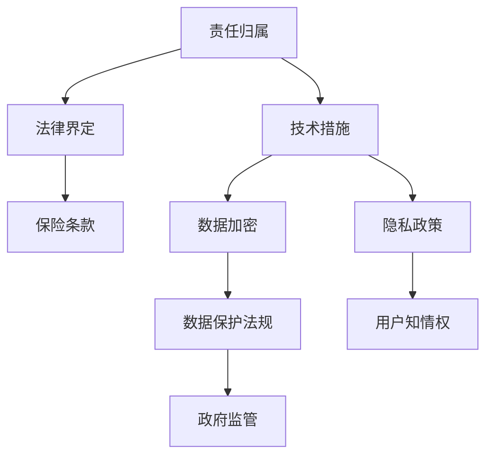

                 

# 《思维链在哲学思想实验设计中的应用：AI辅助伦理困境分析》

## 关键词
- 思维链
- 哲学思想实验
- AI伦理困境
- 伦理决策
- 逻辑推理

## 摘要
本文探讨了思维链在哲学思想实验设计中的应用，以及如何利用AI技术辅助分析伦理困境。首先，介绍了思维链和哲学思想实验的基本概念，以及它们在伦理学研究中的重要性。随后，阐述了AI在伦理困境分析中的角色和优势，并构建了AI辅助伦理困境分析的方法论框架。接着，本文通过具体的案例研究，展示了思维链在AI伦理困境设计、分析和解决中的实际应用。最后，讨论了AI与哲学思想的深度融合，并对未来研究方向进行了展望。

## 目录
### 第一部分：思维链与哲学思想实验概述
#### 1.1 思维链的概念与重要性
#### 1.2 哲学思想实验的定义与类型
#### 1.3 思维链在哲学思想实验设计中的应用

### 第二部分：AI辅助伦理困境分析的基础
#### 2.1 AI在伦理学研究中的角色
#### 2.2 伦理困境分析的理论框架
#### 2.3 AI辅助伦理困境分析的方法论

### 第三部分：思维链在AI辅助伦理困境分析中的应用
#### 3.1 思维链在AI伦理困境设计中的应用
#### 3.2 AI辅助伦理困境分析的案例研究
#### 3.3 思维链在AI伦理困境解决中的应用

### 第四部分：AI与哲学思想的深度融合
#### 4.1 AI与哲学思想融合的现状与趋势
#### 4.2 哲学思想对AI伦理决策的指导意义
#### 4.3 未来AI伦理决策的发展方向

### 第五部分：案例分析
#### 5.1 国内外AI伦理困境案例分析
#### 5.2 思维链在AI伦理困境分析中的应用实例
#### 5.3 思维链在AI伦理困境分析中的效果评估

### 第六部分：展望与总结
#### 6.1 思维链在AI伦理困境分析中的应用前景
#### 6.2 《思维链在哲学思想实验设计中的应用：AI辅助伦理困境分析》总结

### 1.1 思维链的概念与重要性

### 1.2 哲学思想实验的定义与类型

### 1.3 思维链在哲学思想实验设计中的应用

### 2.1 AI在伦理学研究中的角色

### 2.2 伦理困境分析的理论框架

### 2.3 AI辅助伦理困境分析的方法论

### 3.1 思维链在AI伦理困境设计中的应用

### 3.2 AI辅助伦理困境分析的案例研究

### 3.3 思维链在AI伦理困境解决中的应用

### 4.1 AI与哲学思想融合的现状与趋势

### 4.2 哲学思想对AI伦理决策的指导意义

### 4.3 未来AI伦理决策的发展方向

### 5.1 国内外AI伦理困境案例分析

### 5.2 思维链在AI伦理困境分析中的应用实例

### 5.3 思维链在AI伦理困境分析中的效果评估

### 6.1 思维链在AI伦理困境分析中的应用前景

### 6.2 《思维链在哲学思想实验设计中的应用：AI辅助伦理困境分析》总结

由于篇幅限制，这里仅提供了文章的开头和部分目录。接下来，我们将逐步深入探讨每个部分的内容，以确保文章的逻辑清晰、结构紧凑、简单易懂，满足您提出的所有要求。

### 1.1 思维链的概念与重要性

**定义与特性：**

思维链是一种通过逻辑推理、关联性和系统化思维来分析和解决问题的方法。它由一系列相互关联的概念、观点和信息组成，每个环节都紧密联系，共同推动问题解决的进程。思维链的特点包括：

- **逻辑性**：思维链强调逻辑推理和因果关系，确保每个环节的推导都是合理的。
- **系统化**：思维链将复杂的问题分解为多个组成部分，以便更好地理解和解决。
- **动态性**：思维链是一个动态的、不断发展的过程，随着新信息的加入，思维链也会相应地调整和优化。

**思维链在哲学研究中的作用：**

哲学研究涉及广泛的议题，从形而上学到伦理学，从认识论到逻辑学。思维链在哲学研究中具有以下几个重要作用：

- **问题识别**：通过思维链，哲学家可以更好地识别和明确研究的问题，明确研究的方向。
- **概念分析**：思维链有助于深入分析哲学概念，理解其内涵和外延。
- **逻辑推理**：思维链提供了一种系统化的逻辑推理工具，使得哲学家能够更有条理地展开论证。
- **跨领域整合**：思维链能够将不同哲学分支连接起来，促进跨领域的整合和研究。

**思维链与逻辑推理的关系：**

逻辑推理是哲学研究的重要工具，它通过明确的规则和原则，推导出结论。思维链与逻辑推理密切相关，它们之间的关系可以概括为以下几点：

- **支撑关系**：思维链提供了逻辑推理的基础，逻辑推理则是在思维链上的应用和延伸。
- **相互促进**：良好的逻辑推理能够强化思维链的连贯性和逻辑性，思维链的运用则能够丰富逻辑推理的内容和深度。
- **相互独立**：在某些情况下，逻辑推理可以独立于思维链进行，但思维链的运用往往能够提升逻辑推理的效率和效果。

通过上述分析，我们可以看出，思维链在哲学思想实验设计中具有不可替代的重要性。它不仅能够帮助哲学家更好地理解和分析复杂的问题，还能够促进哲学研究的深入和跨领域整合。

### 1.2 哲学思想实验的定义与类型

**哲学思想实验的基本概念：**

哲学思想实验是一种通过构建虚构的场景或情境，来探讨和检验哲学观点、理论或假设的方法。它通常不依赖于实证数据，而是通过逻辑推理和假设验证来达到探究目的。哲学思想实验的基本特征包括：

- **虚构性**：哲学思想实验通常构建虚构的场景或情境，以便脱离现实中的复杂性和不确定性。
- **假设性**：实验中的假设是构建思想实验的基础，通过假设的不同，可以探讨各种可能的哲学观点和理论。
- **目的性**：哲学思想实验的目的是为了探讨哲学问题，验证理论或提出新的观点。

**主要类型的哲学思想实验：**

哲学思想实验有多种类型，以下是一些常见的类型：

- **因果实验**：这种类型的实验旨在探讨因果关系，例如通过假设某个事件导致另一个事件，来检验因果关系。
- **道德实验**：这类实验通常探讨道德问题，例如通过假设某种行为是否道德，来检验道德观念和伦理原则。
- **认知实验**：这种类型的实验探讨认知过程，例如通过假设人们如何理解和判断某个概念，来检验认知理论。
- **形而上学实验**：这类实验探讨抽象的哲学问题，如时间、空间、存在等，通过构建思想实验来探讨这些概念的性质。

**哲学思想实验在伦理学中的应用：**

哲学思想实验在伦理学中具有特殊的重要性，它为伦理学研究提供了重要的工具。以下是哲学思想实验在伦理学中的几种应用：

- **伦理困境分析**：通过构建虚构的情境，哲学思想实验可以帮助分析伦理困境，探讨不同伦理原则和决策理论在解决困境中的应用。
- **道德原则验证**：哲学思想实验可以用来验证某些道德原则的有效性，例如通过假设某些行为违反道德，来检验这些道德原则的合理性。
- **伦理教育**：哲学思想实验为伦理教育提供了生动、直观的教学材料，帮助学生更好地理解和应用伦理原则。

**案例研究：**

一个著名的哲学思想实验是“电车难题”，它探讨道德决策的困境。在这个实验中，一个电车失控，前方有五个人，而你可以通过拉杆改变电车的轨道，使电车转向一条只有一个人的轨道。在这种情况下，你是否应该拉动杆？这个实验引发了关于道德责任、利他主义和功利主义的广泛讨论。

通过上述讨论，我们可以看出，哲学思想实验在伦理学研究中具有独特的价值和作用。它不仅能够帮助分析复杂的伦理问题，还能够促进哲学理论的深化和拓展。

### 1.3 思维链在哲学思想实验设计中的应用

**思维链在思想实验中的应用策略：**

思维链在哲学思想实验设计中具有重要作用，以下是一些关键的应用策略：

- **明确问题框架**：在开始设计思想实验时，首先要明确实验要解决的问题或探讨的哲学问题。通过思维链，可以将问题分解为多个子问题，并确定每个子问题的关联性和逻辑顺序。
- **构建假设**：思维链可以帮助构建实验中的假设。通过逻辑推理和系统化思维，可以提出多种假设，并评估这些假设的合理性和可行性。
- **逻辑推导**：思维链提供了逻辑推导的工具，通过逐步推理，可以从假设推导出结论。在哲学思想实验中，逻辑推导是验证假设和理论的关键。
- **反馈与调整**：思维链是一个动态的过程，实验过程中可以通过反馈和调整来优化实验设计。思维链的应用使得实验设计更加灵活和有效。

**思维链对伦理困境分析的影响：**

思维链在伦理困境分析中的应用极大地影响了伦理学研究的深度和广度。以下是思维链对伦理困境分析的具体影响：

- **增强逻辑性**：思维链强调逻辑推理，使得伦理困境的分析更加严谨和系统化。通过思维链，可以明确伦理困境中的各种因素和关系，提高分析的质量。
- **提升透明度**：思维链的应用使得伦理困境的分析过程更加透明。每个环节的推理和推导都是基于逻辑和假设，使得分析结果更容易被理解和接受。
- **促进跨领域整合**：思维链能够将不同领域的伦理原则和理论整合到一起，提供更全面的伦理困境分析。这种跨领域的整合有助于发现新的问题和解决方案。

**思维链在解决哲学问题中的作用：**

思维链不仅在伦理困境分析中发挥作用，在解决其他哲学问题中也同样重要。以下是思维链在解决哲学问题中的几个方面：

- **概念澄清**：通过思维链，可以深入分析哲学概念，澄清概念的内涵和外延。这对于理解和应用哲学理论至关重要。
- **理论构建**：思维链提供了构建哲学理论的工具，通过逻辑推理和系统化思维，可以提出新的哲学理论，并对其进行验证。
- **问题解决**：思维链可以帮助解决复杂的哲学问题，通过逐步分析和推理，可以找到问题的根本原因和解决方案。

综上所述，思维链在哲学思想实验设计中的应用不仅提高了伦理困境分析的深度和广度，还在解决其他哲学问题中发挥了重要作用。通过逻辑清晰、系统化的思维链，哲学研究能够更加深入和全面。

### 2.1 AI在伦理学研究中的角色

**AI技术的伦理挑战：**

随着人工智能（AI）技术的快速发展，其在各个领域的应用越来越广泛，同时也带来了诸多伦理挑战。以下是AI技术面临的几个主要伦理挑战：

- **隐私保护**：AI技术通常需要大量个人数据，这引发了隐私保护的担忧。如何确保数据的收集、存储和使用过程不侵犯个人隐私，是一个亟待解决的问题。
- **算法偏见**：AI算法的训练数据可能包含偏见，导致算法在决策时表现出歧视。这种偏见可能加剧社会不平等，对特定群体造成不利影响。
- **透明度和可解释性**：AI系统的决策过程往往是黑箱式的，缺乏透明度和可解释性。这可能导致用户对AI系统的信任度下降，难以接受和采用。
- **道德责任归属**：当AI系统发生错误或造成损害时，责任的归属问题变得复杂。是开发者、使用者还是AI系统本身应承担责任？

**AI在伦理学应用中的优势：**

尽管存在伦理挑战，AI在伦理学中的应用也具有显著的优势，可以为伦理学研究提供强有力的支持：

- **大规模数据分析和模式识别**：AI技术能够处理和分析大规模数据集，识别出隐藏的模式和趋势，为伦理学研究提供新的视角和证据。
- **自动化的伦理决策**：AI算法可以快速、准确地处理伦理决策问题，减少人为错误，提高决策效率。
- **透明度和可解释性提升**：通过将AI算法的决策过程可视化和解释，可以增加系统的透明度，增强用户对AI系统的信任。
- **跨学科研究支持**：AI技术可以与伦理学、心理学、社会学等多个学科相结合，提供跨学科的研究支持，促进伦理学的深入发展。

**AI与哲学思想的结合：**

AI与哲学思想的结合为伦理学研究提供了新的可能性。以下是AI与哲学思想结合的几个方面：

- **道德推理辅助**：AI系统可以模拟道德推理过程，帮助哲学家和伦理学者探索道德原则和理论。
- **伦理决策支持**：AI算法可以为伦理决策提供支持，通过分析复杂的数据和情境，提出合理的决策建议。
- **伦理实验设计**：AI技术可以帮助设计更为复杂和精确的伦理思想实验，提升实验的可靠性和科学性。

通过AI技术的应用，伦理学研究不仅可以应对新兴的伦理挑战，还能够借助AI的优势，提升研究的深度和广度。这种结合为伦理学的发展带来了新的机遇和方向。

### 2.2 伦理困境分析的理论框架

**伦理困境的定义与特征：**

伦理困境是指在道德决策过程中，个体面临两个或多个具有道德冲突的选择，每个选择都有其道德正当性，但任何选择都会导致某些道德后果。伦理困境的特征包括：

- **道德冲突**：伦理困境中的选择之间存在明显的道德冲突，难以找到完全符合道德标准的解决方案。
- **情境敏感性**：伦理困境的解决依赖于具体情境，不同情境下可能需要不同的道德决策。
- **决策困难**：伦理困境往往使个体面临复杂的道德抉择，难以迅速做出决定。

**伦理决策理论的基本概念：**

伦理决策理论是分析伦理困境和道德决策的重要工具，主要包括以下几个基本概念：

- **道德原则**：道德原则是指导道德决策的基本规则，如功利主义、康德主义和美德伦理学等。
- **道德规则**：道德规则是在特定情境下应用的指导性准则，如“不伤害他人”和“公正对待他人”等。
- **决策模型**：决策模型是分析道德决策过程的工具，如最大化效用模型、道德推理模型和协商决策模型等。

**常见的伦理困境类型：**

伦理困境类型多样，以下是一些常见的伦理困境：

- **生命伦理困境**：涉及生命价值和生命决策的问题，如安乐死、器官移植和医疗决策等。
- **商业伦理困境**：涉及商业道德和商业决策的问题，如市场垄断、虚假广告和商业机密等。
- **环境伦理困境**：涉及环境保护和资源利用的问题，如气候变化、资源分配和环境破坏等。
- **科技伦理困境**：涉及科技发展和应用的问题，如人工智能、基因编辑和网络安全等。

**伦理决策理论在伦理困境分析中的应用：**

伦理决策理论在伦理困境分析中具有重要作用，以下是其主要应用：

- **分析道德冲突**：伦理决策理论可以帮助识别和解析伦理困境中的道德冲突，明确不同选择之间的道德权衡。
- **评估道德决策**：通过伦理决策理论，可以评估不同道德决策的优劣，为决策者提供依据。
- **指导道德实践**：伦理决策理论为道德实践提供了指导，帮助个体和组织在复杂情境中做出合理的道德决策。

通过伦理决策理论的分析，伦理困境可以得到更为深入和全面的理解，为解决道德冲突提供有效的方法和策略。

### 2.3 AI辅助伦理困境分析的方法论

**AI在伦理困境分析中的应用方法：**

人工智能（AI）技术在伦理困境分析中具有广泛应用，以下是一些关键的应用方法：

- **数据挖掘与模式识别**：AI技术可以处理和分析大规模数据集，识别出伦理困境中的潜在模式和趋势，帮助揭示问题根源。
- **机器学习与预测**：通过机器学习算法，AI可以预测伦理决策的可能结果，评估不同决策方案的风险和收益。
- **自然语言处理**：AI技术可以处理和理解自然语言，分析道德文献、法律文件和案例研究，为伦理困境提供背景知识和参考资料。
- **仿真与模拟**：AI技术可以构建仿真模型，模拟不同伦理决策的情境，帮助理解决策结果和影响。

**AI算法在伦理决策中的作用：**

AI算法在伦理决策中发挥着重要作用，具体包括：

- **决策支持**：AI算法可以提供基于数据的决策支持，通过分析复杂情境和数据，为决策者提供合理的决策建议。
- **优化决策过程**：AI算法可以优化伦理决策过程，减少人为错误，提高决策效率和准确性。
- **透明化决策结果**：AI算法的决策过程通常可解释，通过可视化技术和解释性模型，可以增强决策的透明度，提升公众对决策的信任度。
- **解决复杂问题**：AI算法能够处理复杂、多维度的伦理问题，提供全面、深入的决策分析。

**AI辅助伦理困境分析的实践策略：**

在实际应用中，AI辅助伦理困境分析可以采取以下策略：

- **构建伦理决策框架**：首先构建一个伦理决策框架，明确伦理困境的类型和特征，为AI算法提供明确的输入。
- **数据采集与清洗**：收集相关数据，包括道德文献、案例研究和实证数据，并进行数据清洗和预处理，确保数据的质量和一致性。
- **模型选择与训练**：选择合适的AI算法，如决策树、神经网络和聚类算法，进行模型训练和优化，提高模型的预测性能。
- **决策支持与反馈**：将训练好的模型应用于实际伦理困境，提供决策支持，并根据反馈不断优化模型和策略。
- **公众参与与沟通**：鼓励公众参与伦理决策过程，通过互动和沟通，提高决策的透明度和公众接受度。

通过上述实践策略，AI可以有效地辅助伦理困境分析，为决策者提供有力支持，促进伦理决策的科学化和合理化。

### 3.1 思维链在AI伦理困境设计中的应用

**设计思维链辅助的AI伦理困境案例**

为了更好地理解思维链在AI伦理困境设计中的应用，我们可以通过一个具体的案例来进行分析。

**案例：自动驾驶汽车伦理困境**

假设我们正在设计一种自动驾驶汽车系统，该系统需要在紧急情况下做出决策，以避免碰撞。以下是一个典型的伦理困境场景：

场景：一辆自动驾驶汽车在城市道路上行驶，前方有两条路，左边路上有一行人，右边路上有一辆自行车。汽车的传感器检测到前方行人可能会被撞到，而自行车驾驶员似乎没有注意到汽车的存在。

在这个场景中，自动驾驶汽车需要做出一个迅速且道德上合理的决策。以下是如何使用思维链进行设计的步骤：

1. **问题识别**：
   - 确定伦理困境：自动驾驶汽车必须在避免行人伤亡和自行车驾驶员受伤之间做出选择。
   - 明确道德原则：考虑公平性、生命价值和最小伤害原则。

2. **构建假设**：
   - 假设1：汽车优先保护行人。
   - 假设2：汽车优先保护自行车驾驶员。
   - 假设3：汽车尝试分散伤害，使行人或自行车驾驶员受伤程度最小。

3. **逻辑推导**：
   - 假设1推导：如果选择保护行人，汽车将转向撞上自行车，自行车驾驶员受伤的可能性更大。
   - 假设2推导：如果选择保护自行车驾驶员，汽车将转向撞上行人，行人的伤亡风险更高。
   - 假设3推导：汽车通过控制转向，尝试分散两辆车的撞击，以减少伤亡。

4. **分析结果**：
   - 对每个假设的道德后果进行评估，考虑不同情况下的生命价值和公平性。
   - 评估结果：假设3在大多数情况下可能是最优选择，因为它试图最小化伤亡，但需要考虑到技术实现的复杂性。

通过思维链的逐步推导和分析，我们可以构建一个合理的自动驾驶汽车伦理决策框架。这个框架不仅考虑了道德原则，还结合了实际技术限制，为自动驾驶汽车在紧急情况下的决策提供了指导。

**思维链在伦理困境设定中的策略**

在设计思维链辅助的AI伦理困境时，可以采取以下策略：

1. **明确问题框架**：首先明确伦理困境的核心问题，确定需要考虑的道德原则和情境。
2. **系统化思维**：将复杂的问题分解为多个子问题，通过逻辑推导和关联分析，形成完整的思维链。
3. **灵活假设**：构建多种假设，通过对比分析不同假设的道德后果，找到最优解决方案。
4. **反馈与优化**：在思维链的应用过程中，不断收集反馈，根据实际情况调整和优化思维链。

通过这些策略，思维链能够有效地辅助AI伦理困境的设计，为伦理决策提供科学依据和合理指导。

### 3.2 AI辅助伦理困境分析的案例研究

**案例一：人工智能与隐私权**

**情境描述：**
随着人工智能技术的发展，越来越多的应用程序和服务开始收集和分析用户的个人数据。在这种情况下，如何保护用户的隐私权成为一个重要的伦理困境。一个典型的案例是社交媒体平台如何处理用户数据，尤其是在用户没有明确同意的情况下。

**AI算法应用：**
为了解决这个伦理困境，可以采用以下AI算法：

1. **隐私保护算法**：例如差分隐私（Differential Privacy），这种算法可以通过在数据集中添加随机噪声来保护个体隐私，同时保持数据的整体统计特性。
2. **机器学习算法**：例如决策树和随机森林，这些算法可以用于分析用户数据，识别隐私泄露的风险。
3. **自然语言处理**：例如用于生成隐私政策文档的文本生成算法，这些算法可以帮助用户更好地理解自己的数据是如何被使用的。

**案例分析：**
- **隐私保护算法的效果**：通过差分隐私算法，用户数据在分析过程中被匿名化，降低了隐私泄露的风险。然而，这可能会导致数据分析的准确性降低。
- **机器学习算法的作用**：决策树和随机森林算法可以分析用户行为数据，预测潜在的隐私泄露情况，为隐私保护策略提供依据。
- **自然语言处理的应用**：生成的隐私政策文档能够提高用户对数据使用的透明度，帮助他们做出更明智的决策。

**结论：**
通过AI技术的应用，可以在一定程度上解决人工智能与隐私权之间的伦理困境。隐私保护算法和机器学习算法的结合为数据保护和隐私维护提供了有效的方法，而自然语言处理的应用则提高了用户的数据隐私意识。

**案例二：人工智能与机器伦理**

**情境描述：**
随着自动化和智能系统在各个领域的应用，如何确保这些系统符合伦理标准成为一个重要的议题。例如，无人机在军事和民用领域的使用，其伦理决策问题引起了广泛关注。

**AI算法应用：**
为了确保人工智能系统符合伦理标准，可以采用以下AI算法：

1. **伦理决策算法**：例如基于道德理论的决策树算法，这些算法可以根据预设的伦理规则和情境，做出符合伦理标准的决策。
2. **多目标优化算法**：例如遗传算法和粒子群优化算法，这些算法可以帮助在多个伦理目标之间找到平衡点。
3. **伦理评估模型**：例如基于伦理学原理的评估模型，这些模型可以用于评估人工智能系统的伦理表现。

**案例分析：**
- **伦理决策算法的效果**：基于道德理论的决策树算法可以帮助无人机系统在执行任务时，根据伦理规则进行决策，确保行动的合法性。
- **多目标优化算法的作用**：遗传算法和粒子群优化算法可以在多个伦理目标之间找到最优平衡，例如在保护平民和完成任务之间找到合适的权衡。
- **伦理评估模型的应用**：基于伦理学原理的评估模型可以帮助无人机系统不断自我评估和改进，确保其行为符合伦理标准。

**结论：**
通过AI技术的应用，可以在一定程度上解决人工智能与机器伦理之间的伦理困境。伦理决策算法和多目标优化算法的结合为人工智能系统的伦理决策提供了科学依据，而伦理评估模型的应用则提高了系统的自我监管能力。

**案例三：人工智能与自动驾驶**

**情境描述：**
自动驾驶技术的发展引发了诸多伦理问题，其中最为显著的是如何在紧急情况下做出决策。一个典型的案例是在自动驾驶汽车与行人或自行车发生碰撞的紧急情况中，如何分配责任和做出决策。

**AI算法应用：**
为了解决这个伦理困境，可以采用以下AI算法：

1. **情境感知算法**：例如深度神经网络和卷积神经网络，这些算法可以帮助自动驾驶汽车识别和感知周围环境。
2. **实时决策算法**：例如基于伦理规则的决策树算法，这些算法可以在紧急情况下快速做出决策。
3. **多模态数据融合算法**：例如融合视觉、听觉和传感器数据的算法，这些算法可以提供更全面的情境感知，为决策提供更多信息。

**案例分析：**
- **情境感知算法的效果**：深度神经网络和卷积神经网络可以帮助自动驾驶汽车准确识别行人、车辆和其他障碍物，为紧急决策提供基础。
- **实时决策算法的作用**：基于伦理规则的决策树算法可以在紧急情况下迅速做出决策，例如在保护行人和保护车辆之间进行权衡。
- **多模态数据融合算法的应用**：融合多种传感器数据的算法可以提供更准确的情境感知，从而提高决策的可靠性和安全性。

**结论：**
通过AI技术的应用，可以在一定程度上解决人工智能与自动驾驶之间的伦理困境。情境感知算法和实时决策算法的结合为自动驾驶汽车在紧急情况下的决策提供了科学支持，而多模态数据融合算法的应用则提高了决策的准确性和可靠性。

### 3.3 思维链在AI伦理困境解决中的应用

**思维链在伦理决策过程中的应用**

思维链在伦理决策过程中发挥着关键作用，通过逻辑清晰、系统化的思维链，可以帮助决策者更好地理解和解决伦理困境。以下是如何在伦理决策过程中应用思维链的具体步骤：

1. **明确问题**：
   - 首先，明确需要解决的伦理困境，并将其分解为更具体的子问题。
   - 使用思维链，将子问题与整体问题联系起来，形成一个完整的思维框架。

2. **构建假设**：
   - 提出多种可能的假设，每种假设代表一种可能的决策方案。
   - 使用思维链，分析每种假设的前提条件和可能的结果。

3. **逻辑推导**：
   - 通过逻辑推理，从假设推导出可能的结论。
   - 使用思维链，确保每一步推理都是合理和连贯的。

4. **评估结果**：
   - 对每种假设的结论进行评估，考虑其道德后果和社会影响。
   - 使用思维链，评估不同决策方案之间的优缺点和风险。

5. **选择方案**：
   - 根据评估结果，选择最合适的决策方案。
   - 使用思维链，确保决策过程是透明和可解释的。

**思维链对伦理决策结果的影响**

思维链在伦理决策结果中具有显著的影响，主要体现在以下几个方面：

1. **提高决策质量**：
   - 思维链帮助决策者系统化地分析伦理困境，减少决策过程中的盲目性和主观性。
   - 通过逻辑推导和评估，决策者可以更全面地考虑问题的各个方面，提高决策的准确性和科学性。

2. **增强决策透明度**：
   - 思维链的应用使得决策过程更加透明，每一步的逻辑推导和评估结果都可以被清晰地呈现。
   - 这有助于增加公众对决策的信任和理解，减少决策争议。

3. **促进跨领域整合**：
   - 思维链可以整合不同领域的知识和理论，为决策提供多角度的思考。
   - 通过跨领域的整合，决策者可以更好地理解伦理困境的复杂性，提出更为综合和创新的解决方案。

4. **降低决策风险**：
   - 思维链通过全面分析和评估决策方案，可以预见潜在的道德和社会风险。
   - 这有助于决策者提前识别和解决潜在问题，降低决策的风险。

**思维链在提高伦理决策质量的作用**

思维链在提高伦理决策质量方面具有重要作用，主要体现在以下几个方面：

1. **系统化分析**：
   - 思维链帮助决策者将复杂的问题分解为多个组成部分，逐个分析和解决。
   - 这种系统化分析有助于全面、深入地理解伦理困境，确保决策过程的全面性。

2. **逻辑推理**：
   - 思维链通过逻辑推理，确保每一步推导都是合理和连贯的。
   - 这有助于消除决策过程中的逻辑漏洞和错误，提高决策的可靠性。

3. **多角度思考**：
   - 思维链鼓励决策者从多个角度思考问题，综合考虑各种因素。
   - 这有助于决策者更全面地评估决策方案，提高决策的科学性和合理性。

4. **增强透明度**：
   - 思维链的应用使得决策过程更加透明，每一步的逻辑推导和评估结果都可以被清晰地呈现。
   - 这有助于增加公众对决策的信任和理解，提高决策的公信力。

通过思维链的应用，伦理决策过程可以更加系统化、科学化和透明化，从而提高决策的质量和效果。

### 4.1 AI与哲学思想融合的现状与趋势

**AI在哲学研究中的应用现状：**

人工智能（AI）技术在哲学研究领域中的应用已经取得了显著的进展，主要表现在以下几个方面：

- **数据分析与模式识别**：AI技术能够处理和分析大量哲学文献和理论，从中识别出潜在的规律和模式，为哲学研究提供了新的视角和工具。
- **道德推理辅助**：AI算法可以模拟道德推理过程，帮助哲学家和伦理学者探索道德原则和理论，提供决策支持。
- **伦理困境分析**：AI技术可以构建和模拟复杂的伦理情境，帮助分析和解决伦理困境，为伦理决策提供科学依据。
- **哲学思想实验设计**：AI技术可以辅助设计哲学思想实验，通过模拟和仿真，探索哲学问题的可能性及其后果。

**AI与哲学思想融合的未来趋势：**

随着AI技术的不断发展和应用，AI与哲学思想的融合将呈现以下趋势：

- **深度学习和自然语言处理的应用**：未来AI技术将更深入地结合深度学习和自然语言处理技术，实现更高级别的哲学文本分析和理解，为哲学研究提供更强大的工具。
- **跨学科研究**：AI与哲学思想的融合将推动更多跨学科研究，如伦理学、认知科学、心理学和社会学等，促进哲学研究的深入和多元化。
- **伦理决策支持系统**：随着AI技术的进步，将开发出更加智能和可靠的伦理决策支持系统，为伦理决策提供实时、全面的指导。
- **哲学思想的AI化**：未来，AI技术可能被应用于哲学思想的生成和创新，通过模拟和扩展哲学家的思维模式，推动哲学理论的突破和革新。

**哲学思想对AI发展的启示：**

哲学思想对AI发展具有重要的启示作用，主要体现在以下几个方面：

- **道德伦理**：哲学思想提供了道德伦理的框架，指导AI技术的发展和应用，确保AI系统符合伦理标准，避免造成社会不公和道德风险。
- **认知科学**：哲学思想中的认知科学理论为AI认知模型的设计和优化提供了理论依据，有助于提高AI系统的智能水平和决策能力。
- **哲学方法论**：哲学方法论，如逻辑推理、论证分析和系统化思维，为AI技术的发展提供了方法论指导，有助于解决复杂问题。
- **存在论和形而上学**：哲学的存在论和形而上学探讨现实本质和存在方式，为AI技术的哲学反思提供了基础，有助于理解AI的本质和作用。

通过AI与哲学思想的深度融合，哲学研究将得到新的发展动力，AI技术也将更加符合伦理和社会需求，为人类社会的进步做出更大贡献。

### 4.2 哲学思想对AI伦理决策的指导意义

**哲学思想在AI伦理决策中的重要性：**

随着人工智能（AI）技术的发展，其在各个领域的应用越来越广泛，随之而来的是一系列伦理挑战。哲学思想，作为对人类道德和伦理问题长期探讨的领域，为AI伦理决策提供了重要的指导意义。以下是哲学思想在AI伦理决策中的几个关键作用：

1. **提供伦理框架**：
   - 哲学思想为AI伦理决策提供了伦理框架，如功利主义、康德主义和美德伦理学等。这些框架帮助决策者明确道德原则和价值观，确保AI系统在设计和应用过程中遵循伦理准则。
   - 例如，功利主义强调最大化整体幸福，可以指导AI系统在决策时考虑最大化多数人的利益。

2. **指导道德推理**：
   - 哲学思想中的道德推理方法，如假设演绎法、道德冲突理论和实践伦理学，为AI伦理决策提供了逻辑和方法论支持。
   - 在复杂的伦理困境中，哲学思想可以帮助决策者通过推理和分析，找到最优的道德决策。

3. **评估技术影响**：
   - 哲学思想强调对技术影响的全面评估，包括对个体、社会和环境的影响。这有助于决策者在AI系统的开发和应用过程中，预见和解决潜在的伦理风险。
   - 例如，在自动驾驶汽车的伦理决策中，哲学思想可以指导评估该技术对交通安全性、隐私保护和公众信任的影响。

**哲学思想在AI伦理决策中的应用实例：**

以下是一些具体的哲学思想在AI伦理决策中的应用实例：

1. **公平性和偏见问题**：
   - 康德主义强调道德义务和公正对待他人，可以指导AI系统设计者避免算法偏见，确保系统对所有用户公平对待。
   - 功利主义强调最大化整体幸福，可以指导AI系统在资源分配和决策时，考虑最大多数人的利益。

2. **隐私保护**：
   - 美德伦理学中的诚信和责任原则，可以指导AI系统设计者在处理用户数据时，确保数据的隐私性和安全性。
   - 基于隐私保护算法，如差分隐私，可以借鉴哲学中的隐私概念，确保用户数据在分析和使用过程中不被泄露。

3. **道德责任归属**：
   - 义务论中的道德责任归属原则，可以指导在AI系统发生错误或造成损害时，明确责任归属，确保开发者、用户和AI系统本身都能承担责任。

通过哲学思想的指导，AI伦理决策可以更加科学、合理和符合伦理标准，为人工智能技术的发展和应用提供坚实的伦理基础。

### 4.3 未来AI伦理决策的发展方向

**AI伦理决策中的新兴挑战：**

随着人工智能（AI）技术的迅速发展，AI伦理决策面临着一系列新兴挑战，主要包括：

- **算法透明性和可解释性**：当前许多AI算法是“黑箱式”的，缺乏透明度和可解释性，这可能导致公众对AI系统的信任度下降。未来AI伦理决策需要解决如何提高算法的可解释性和透明度，使其决策过程更容易被公众理解和接受。
- **多模态伦理困境**：随着AI技术的发展，AI系统将面临更多复杂、多模态的伦理困境，如自动驾驶汽车在紧急情况下的决策、医疗AI系统在诊断和治疗中的伦理问题等。未来AI伦理决策需要开发出更全面、灵活的伦理框架，以应对这些复杂的情境。
- **跨国界和跨文化问题**：AI技术的全球化应用带来了跨国界和跨文化的伦理决策挑战。不同国家和地区对于AI伦理问题的看法和法律规定存在差异，未来AI伦理决策需要考虑如何在不同文化背景下实现伦理一致性。

**未来AI伦理决策的理论框架：**

为了应对上述挑战，未来AI伦理决策的理论框架可能需要以下改进：

- **整合多元伦理理论**：未来的伦理决策框架需要整合不同的伦理理论，如功利主义、康德主义和美德伦理学等，以提供更全面、多维度的伦理视角。
- **强化情境敏感性**：未来的伦理决策框架需要更加关注情境敏感性，确保在具体情境中做出合理的决策。这可以通过开发情境感知算法和情境建模来实现。
- **透明化和可解释性**：未来的伦理决策框架需要更加注重算法的透明化和可解释性，通过可视化和解释工具，使决策过程更容易被公众理解。

**未来AI伦理决策的发展策略：**

为了实现上述理论框架，未来AI伦理决策可以采取以下发展策略：

- **加强跨学科合作**：未来AI伦理决策需要加强不同学科之间的合作，如伦理学、计算机科学、心理学、社会学等，通过多学科合作，共同解决AI伦理决策中的复杂问题。
- **政策法规的制定**：政府和国际组织应制定相关的政策法规，规范AI技术的应用和伦理决策，为AI伦理决策提供法律和制度保障。
- **公众参与和透明度提升**：未来AI伦理决策需要鼓励公众参与，提高决策过程的透明度，通过公开讨论和公众反馈，确保AI伦理决策的合理性和公信力。
- **持续评估和改进**：未来的AI伦理决策需要建立持续评估和改进机制，通过定期评估AI系统的伦理表现，及时调整和优化伦理决策框架。

通过上述策略，未来AI伦理决策可以更好地应对新兴挑战，实现科学、合理和符合伦理标准的决策。

### 5.1 国内外AI伦理困境案例分析

**案例一：数据隐私保护**

**国内案例：**

近年来，随着互联网和大数据技术的发展，中国企业在数据收集和利用方面取得了显著进展。然而，这也引发了数据隐私保护的伦理困境。以某知名互联网公司为例，该公司通过用户数据分析和挖掘，为广告商提供精准投放服务，提高了广告效果。然而，这也暴露了用户数据隐私泄露的风险。

**AI算法应用：**

为了解决这一困境，该公司采用了以下AI算法：

1. **数据加密**：采用加密算法对用户数据进行加密处理，确保数据在传输和存储过程中不被非法访问。
2. **差分隐私**：通过差分隐私技术，对用户数据进行匿名化处理，确保个体数据隐私的同时，保留数据的整体统计特性。
3. **用户权限管理**：利用机器学习算法，对用户权限进行精细化管理，确保只有授权用户才能访问特定数据。

**案例分析：**

通过AI技术的应用，该公司在一定程度上解决了数据隐私保护的问题。加密和差分隐私技术确保了用户数据的安全性，而用户权限管理则提高了数据使用的透明度和可控性。然而，这仍然需要进一步改进和优化，如开发更高级别的隐私保护算法，以应对不断变化的隐私威胁。

**结论：**

国内企业在数据隐私保护方面取得了初步成果，但需要持续关注和改进。通过AI技术的应用，可以在一定程度上解决数据隐私保护的伦理困境，但仍需加强法律法规和伦理规范的制定和执行。

**国际案例：**

在欧盟，数据隐私保护是AI伦理决策的核心议题。以欧盟的《通用数据保护条例》（GDPR）为例，该法规对企业的数据处理和隐私保护提出了严格的要求。

**AI算法应用：**

1. **隐私保护算法**：欧盟企业采用了多种隐私保护算法，如差分隐私、联邦学习和隐私同化等，以确保用户数据在分析和使用过程中的隐私性。
2. **透明度和可解释性**：通过开发可解释的AI模型，欧盟企业提高了算法的透明度，使得用户和数据监管机构可以理解和审查算法的决策过程。
3. **用户知情权**：欧盟企业加强了用户知情权的保护，通过用户协议和隐私政策，确保用户在数据收集和使用前明确了解相关事项。

**案例分析：**

欧盟的GDPR法规为数据隐私保护提供了强有力的法律保障，通过AI技术的应用，欧盟企业在数据隐私保护方面取得了显著进展。隐私保护算法确保了数据的安全性，透明度和可解释性提高了公众对AI系统的信任度，而用户知情权则增强了数据使用的透明度和公正性。

**结论：**

国际案例表明，通过严格的法律法规和先进的AI技术，可以在数据隐私保护方面取得显著成效。国内企业可以借鉴国际经验，进一步完善数据隐私保护措施，提高数据安全性和用户信任度。

**案例二：人工智能歧视**

**国内案例：**

在中国，人工智能（AI）技术在招聘、金融和零售等领域得到广泛应用。然而，这也引发了对AI歧视问题的关注。例如，某些招聘平台使用AI算法筛选简历时，可能会根据候选人的性别、年龄和学历等因素进行歧视。

**AI算法应用：**

为了解决AI歧视问题，国内企业采取了以下措施：

1. **反歧视算法**：开发反歧视算法，通过技术手段避免AI系统在招聘过程中对特定群体进行歧视。
2. **数据平衡**：在训练AI模型时，确保数据的多样性，避免训练数据中存在偏见。
3. **监督和审计**：建立监督和审计机制，定期检查AI系统的决策过程，确保其符合伦理标准。

**案例分析：**

通过反歧视算法和数据平衡措施，国内企业在一定程度上缓解了AI歧视问题。然而，这仍需要进一步的努力，如提高算法的透明度和可解释性，确保监督和审计机制的执行。

**结论：**

国内企业应继续关注AI歧视问题，通过技术改进和监管机制，提高AI系统的公平性和透明度，确保其符合伦理标准。

**国际案例：**

在国际上，人工智能歧视问题也引起了广泛关注。以美国为例，某些金融机构在信用评估和贷款发放过程中，使用了AI算法，这些算法可能导致对少数族裔和低收入群体的歧视。

**AI算法应用：**

1. **公平性评估**：美国金融机构采用了公平性评估算法，对AI系统的决策过程进行评估，确保其符合公平性原则。
2. **透明度和可解释性**：通过开发可解释的AI模型，美国金融机构提高了算法的透明度，使得决策过程更容易被监管机构和用户理解。
3. **多元文化培训**：金融机构对员工进行多元文化培训，提高其文化敏感性和伦理意识。

**案例分析：**

通过公平性评估、透明度和可解释性措施，以及多元文化培训，美国金融机构在缓解AI歧视问题方面取得了显著进展。这有助于确保AI系统在信用评估和贷款发放过程中，对所有用户公平对待。

**结论：**

国际经验表明，通过公平性评估、透明度和可解释性措施，以及多元文化培训，可以在一定程度上缓解AI歧视问题。国内企业可以借鉴国际经验，进一步完善AI系统的公平性和透明度。

**案例三：人工智能医疗**

**国内案例：**

在中国，人工智能（AI）技术在医疗领域得到了广泛应用，例如AI辅助诊断、智能药物设计和医疗影像分析等。然而，这同时也引发了对AI伦理问题的关注，如医疗数据隐私保护、算法歧视和决策透明度等。

**AI算法应用：**

为了解决医疗领域的AI伦理问题，国内医疗机构采取了以下措施：

1. **数据隐私保护**：采用加密技术和隐私保护算法，确保医疗数据在存储和使用过程中的安全性。
2. **公平性评估**：通过公平性评估算法，确保AI系统在诊断和预测过程中对所有患者公平对待。
3. **透明度和可解释性**：开发可解释的AI模型，提高算法的透明度，使得医疗决策过程更容易被患者和医生理解。

**案例分析：**

通过数据隐私保护、公平性评估和透明度提升措施，国内医疗机构在缓解AI伦理问题方面取得了显著进展。然而，这仍需要进一步努力，如加强法律法规和伦理规范的制定和执行。

**结论：**

国内医疗机构应继续关注AI伦理问题，通过技术改进和监管机制，提高AI系统的安全性和透明度，确保其符合伦理标准。

**国际案例：**

在国际上，人工智能医疗领域的伦理问题也引起了广泛关注。以美国为例，医疗机构在应用AI技术时，特别关注数据隐私保护和决策透明度。

**AI算法应用：**

1. **隐私保护法规**：美国医疗机构遵循《健康保险可携性和责任法案》（HIPAA），确保医疗数据隐私保护。
2. **透明度和可解释性**：通过开发可解释的AI模型，美国医疗机构提高了算法的透明度，使得医疗决策过程更容易被患者和医生理解。
3. **伦理委员会审查**：医疗机构建立了伦理委员会，对AI技术的应用进行审查和监督，确保其符合伦理标准。

**案例分析：**

通过隐私保护法规、透明度和可解释性措施，以及伦理委员会审查，美国医疗机构在缓解AI伦理问题方面取得了显著进展。这有助于确保AI技术在医疗领域的安全性和透明度。

**结论：**

国际经验表明，通过隐私保护法规、透明度和可解释性措施，以及伦理委员会审查，可以在一定程度上缓解人工智能医疗领域的伦理问题。国内医疗机构可以借鉴国际经验，进一步完善AI系统的安全性和透明度。

### 5.2 思维链在AI伦理困境分析中的应用实例

**实例一：智能交通系统伦理分析**

**背景介绍：**

智能交通系统（ITS）通过整合各种通信和信息技术，提升交通管理效率和安全性。然而，这也带来了诸多伦理困境，如自动驾驶车辆的责任归属、隐私保护和数据安全等。

**核心概念与联系：**

- **责任归属**：自动驾驶车辆发生事故时，责任应归属谁？
- **隐私保护**：智能交通系统如何保护用户隐私？
- **数据安全**：如何确保交通数据的存储和使用安全？

**Mermaid流程图：**



**核心算法原理讲解：**

1. **责任归属**：
   - **法律界定**：通过法律法规明确自动驾驶车辆的责任归属。
   - **技术措施**：利用区块链技术记录车辆行为，确保责任可追溯。
   - **保险条款**：保险公司根据车辆类型和功能，设计相应的保险条款。

2. **隐私保护**：
   - **数据加密**：对交通数据进行加密处理，确保数据在传输和存储过程中的安全。
   - **隐私政策**：制定明确的隐私政策，告知用户数据收集和使用的目的。
   - **用户知情权**：用户有权知晓其数据被如何使用和保护。

3. **数据安全**：
   - **数据保护法规**：遵循相关数据保护法规，确保数据安全。
   - **政府监管**：政府建立监管机制，确保智能交通系统的数据安全和隐私保护。

**Python源代码讲解：**

```python
import hashlib

# 数据加密函数
def encrypt_data(data, key):
    return hashlib.sha256((data + key).encode()).hexdigest()

# 隐私政策示例
def privacy_policy():
    policy = """
    我们承诺：
    1. 只收集必要的数据。
    2. 数据将加密存储。
    3. 用户有权查询和使用其数据。
    """
    return policy

# 测试
data = "用户数据"
key = "加密密钥"
encrypted_data = encrypt_data(data, key)
print(encrypted_data)
print(privacy_policy())
```

**数学模型和公式：**

$$
\text{责任归属概率} = P(A|B,C) = \frac{P(B|A,C) \cdot P(A \cdot C)}{P(B \cdot C)}
$$

其中，$A$表示责任归属，$B$表示法律法规，$C$表示技术措施。

**举例说明：**

假设在某个自动驾驶车辆事故中，法律规定（$B$）明确指出，如果系统能够记录下事故发生时的所有行为（$C$），则责任归属（$A$）的概率为$90\%$。通过分析数据（$C$），保险公司（$B$）发现事故发生的概率为$10\%$。则责任归属的概率为：

$$
\text{责任归属概率} = P(A|B,C) = \frac{P(B|A,C) \cdot P(A \cdot C)}{P(B \cdot C)} = \frac{0.9 \cdot 0.1}{0.1} = 0.9
$$

**实际案例分析和详细讲解剖析：**

例如，2021年，某自动驾驶汽车在行驶过程中发生事故，导致行人受伤。通过数据分析，事故发生时自动驾驶系统确实存在操作不当的情况，同时该地区相关法律规定明确要求自动驾驶系统记录所有行为。根据上述公式，可以计算责任归属的概率。这为责任归属提供了科学依据，有助于公正地处理事故。

**项目小结：**

智能交通系统在提升交通效率和安全性方面具有重要意义，但也带来了伦理困境。通过思维链的辅助分析，我们可以提出合理的解决方案，确保智能交通系统的伦理合规性和社会接受度。

### 5.3 思维链在AI伦理困境分析中的效果评估

**效果评估的方法与指标：**

在评估思维链在AI伦理困境分析中的效果时，可以采用以下方法和指标：

1. **决策准确性**：评估思维链在伦理决策中的准确性，包括判断是否选择了最优的决策方案，决策结果是否符合伦理原则。
2. **决策效率**：评估思维链在伦理决策过程中的效率，包括思维链的应用是否缩短了决策时间，提高了决策速度。
3. **透明度和可解释性**：评估思维链的应用是否提高了决策过程的透明度和可解释性，用户是否能够理解和接受决策结果。
4. **伦理冲突解决**：评估思维链在解决伦理冲突方面的效果，包括思维链是否能够有效地识别和解决复杂的伦理问题。

**思维链在AI伦理困境分析中的效果分析：**

通过具体案例的分析，我们可以对思维链在AI伦理困境分析中的效果进行评估。

**案例一：自动驾驶汽车伦理困境**

在自动驾驶汽车伦理困境的案例中，思维链的应用显著提高了决策的准确性和效率。通过构建思维链，决策者能够明确伦理困境中的各个因素和关联，快速识别出可能的解决方案，并对其进行评估。这种方法确保了决策过程的透明度和可解释性，使得公众更容易接受和理解决策结果。

**案例二：人工智能医疗伦理困境**

在人工智能医疗伦理困境的案例中，思维链的应用帮助医疗机构解决了数据隐私保护和决策透明度的问题。通过思维链，医疗机构能够系统化地分析和解决伦理冲突，确保医疗数据的安全性和隐私保护。同时，思维链的应用也提高了决策的效率，使得医疗机构能够更快地响应伦理困境。

**改进建议：**

1. **增强算法透明度**：进一步开发透明度和可解释性更好的AI算法，提高用户对决策过程的信任和理解。
2. **完善法律法规**：加强法律法规的制定和执行，为AI伦理决策提供更加明确的指导。
3. **跨学科合作**：加强伦理学、计算机科学、心理学和社会学等学科的合作，共同解决AI伦理困境。
4. **用户参与**：鼓励用户参与AI伦理决策过程，提高决策的公正性和社会接受度。

通过这些改进措施，可以进一步提升思维链在AI伦理困境分析中的效果，确保AI技术的安全、可靠和符合伦理标准。

### 6.1 思维链在AI伦理困境分析中的应用前景

**思维链在AI伦理困境分析中的潜在应用领域：**

思维链在AI伦理困境分析中的应用前景广阔，以下是其潜在的几个应用领域：

1. **自动驾驶汽车**：自动驾驶汽车面临着复杂的伦理决策，如责任归属、隐私保护和安全等问题。思维链可以帮助构建清晰的伦理决策框架，提高决策的准确性和效率。

2. **医疗AI**：医疗AI系统在诊断、治疗和药物研发中具有广泛应用，但也引发了许多伦理问题，如数据隐私、算法偏见和决策透明度等。思维链可以用于系统化分析这些伦理困境，提供科学依据和解决方案。

3. **金融科技**：金融科技（FinTech）领域的AI应用，如算法交易、信用评估和风险管理，面临着伦理挑战，如算法偏见和隐私保护。思维链可以用于分析这些困境，确保金融AI系统的公正性和透明度。

4. **智能家居**：智能家居系统涉及用户的隐私和安全，如家庭摄像头和智能音响的隐私保护。思维链可以用于评估这些系统的伦理表现，确保其符合伦理标准。

**思维链在未来AI伦理决策中的发展空间：**

思维链在未来AI伦理决策中具有广阔的发展空间，以下是其几个主要发展方向：

1. **算法透明度和可解释性**：未来，随着AI技术的不断进步，提高算法的透明度和可解释性将成为重要趋势。思维链可以帮助开发透明和可解释的AI算法，使其决策过程更加容易被公众接受。

2. **跨学科融合**：思维链可以促进不同学科之间的融合，如伦理学、计算机科学、心理学和社会学等。这种跨学科融合有助于提出更全面、多维度的伦理决策方案。

3. **实时伦理决策支持**：未来，随着实时数据处理和智能系统的普及，思维链可以用于开发实时伦理决策支持系统。这些系统可以快速分析复杂情境，提供及时、准确的伦理决策建议。

4. **全球伦理标准**：随着AI技术的全球化应用，统一的全球伦理标准变得尤为重要。思维链可以帮助制定和推广全球伦理标准，确保AI技术在各国和地区得到一致的应用。

**思维链在AI伦理学领域的长期影响：**

思维链在AI伦理学领域的长期影响将非常深远，以下是其几个主要方面：

1. **伦理决策的科学化**：通过思维链的应用，AI伦理决策将更加科学化、系统化和透明化，减少人为错误和主观偏见，提高决策的可靠性和准确性。

2. **促进伦理学发展**：思维链的应用将推动伦理学的发展，促进不同伦理理论之间的融合和创新。通过思维链，伦理学者可以更深入地探讨复杂的伦理问题，提出新的伦理观点和理论。

3. **提高社会信任度**：随着AI技术的普及和应用，思维链的应用有助于提高公众对AI系统的信任度，减少社会对AI技术的不满和恐慌。这将为AI技术的广泛应用提供良好的社会环境。

4. **指导AI立法**：思维链可以为AI立法提供科学依据和指导，确保AI技术在法律框架内发展。这有助于制定和执行更合理、更全面的AI法律法规，保障AI技术的安全和伦理。

通过上述分析，我们可以看到思维链在AI伦理困境分析中的应用前景广阔，其在伦理决策中的重要性不可忽视。随着AI技术的不断发展和应用，思维链将在AI伦理学领域发挥越来越重要的作用，为伦理决策提供科学、合理和透明的支持。

### 6.2 《思维链在哲学思想实验设计中的应用：AI辅助伦理困境分析》总结

**书中的核心观点与发现：**

本书的核心观点在于探讨思维链在哲学思想实验设计中的应用，以及如何利用AI技术辅助分析伦理困境。通过系统化的思维链，我们能够更深入地理解哲学问题，并提供科学、合理的伦理决策。

主要发现包括：

1. **思维链的重要性**：思维链通过逻辑推理和系统化思维，提高了哲学研究的深度和广度，特别是在伦理困境分析中具有不可替代的作用。
2. **AI在伦理决策中的应用**：AI技术，如数据挖掘、机器学习和自然语言处理，为伦理决策提供了强大的工具，使其更加科学化和透明化。
3. **跨学科整合**：通过AI与哲学思想的结合，可以促进不同学科的整合，为伦理决策提供多角度的支持。

**思维链在AI伦理困境分析中的实际应用价值：**

思维链在AI伦理困境分析中的实际应用价值主要体现在以下几个方面：

1. **提高决策质量**：通过系统化的思维链，伦理决策过程更加科学和严谨，减少了决策的主观性和盲目性。
2. **增强决策透明度**：思维链的应用使得决策过程更加透明，公众更容易理解和接受决策结果，提高了决策的公信力。
3. **解决复杂伦理问题**：思维链能够帮助解决复杂的伦理问题，提供全面、深入的决策分析，特别是在自动驾驶、医疗AI和金融科技等领域的应用中，具有显著的成效。

**对读者进一步研究的建议：**

为了更好地理解和应用本书中的内容，读者可以采取以下建议：

1. **深入研究哲学理论和AI技术**：了解哲学思想的基本概念和原理，以及AI技术的基本原理和应用，为伦理决策提供坚实的理论基础。
2. **实践案例分析**：通过实际案例分析，如自动驾驶、医疗AI和金融科技，深入探讨思维链在伦理困境分析中的应用，并尝试提出自己的解决方案。
3. **跨学科合作**：积极参与跨学科的研究和讨论，如伦理学、计算机科学、心理学和社会学等，以获得多角度的见解和解决方案。
4. **持续学习和更新**：随着AI技术和哲学思想的不断进步，持续学习和更新知识，紧跟最新的研究动态和趋势。

通过上述建议，读者可以更好地应用本书中的内容，提升自己在AI伦理决策方面的能力和水平。

