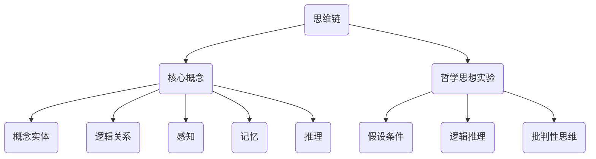

                 


## 思维链在哲学思想实验设计中的应用：AI辅助概念探索

### 关键词

- **思维链**
- **哲学思想实验**
- **AI辅助概念探索**
- **人工智能**
- **逻辑推理**
- **认知科学**
- **算法设计**
- **数学模型**

### 摘要

本文探讨了思维链在哲学思想实验设计中的应用，以及如何通过人工智能（AI）辅助概念探索。思维链是一种基于认知科学的模型，能够模拟人类的思维过程。哲学思想实验是哲学家们用来探讨抽象概念和伦理问题的重要工具。本文将详细解释思维链的核心概念和其在哲学思想实验中的应用，同时讨论如何利用AI技术来提高概念探索的效率和深度。通过具体的案例分析和算法原理讲解，本文展示了AI辅助概念探索的潜力，为哲学研究提供了新的视角和方法。

### 引言

哲学，作为人类思考世界的基本学科，自古以来就致力于探讨抽象的概念、伦理问题以及存在本身。哲学思想实验，作为一种独特的思考方法，通过构建虚拟场景和假设条件，帮助哲学家们更好地理解和分析复杂的哲学问题。然而，随着科学技术的进步，尤其是人工智能（AI）的快速发展，哲学研究正面临新的机遇和挑战。

**思维链**是一种基于认知科学的模型，旨在模拟人类的思维过程。它通过一系列算法和数学模型，将人类思考过程中的各种元素（如概念、逻辑关系、感知和记忆）整合到一个统一的框架中。这种模型不仅有助于我们更好地理解人类思维的本质，还能够为人工智能在哲学研究中的应用提供理论基础。

本文旨在探讨思维链在哲学思想实验设计中的应用，并分析如何利用人工智能辅助概念探索。具体来说，本文将：

1. **介绍思维链的基本概念和理论框架**。
2. **讨论哲学思想实验的基本原理和设计过程**。
3. **阐述思维链在哲学思想实验中的应用**。
4. **探讨AI辅助概念探索的方法和挑战**。
5. **通过具体案例展示AI辅助概念探索的实践效果**。

### 思维链：核心概念和理论框架

**思维链**（Mind Chain）是一种基于认知科学的理论模型，旨在模拟和解释人类思维过程。它由一系列相互关联的概念、算法和数学模型构成，以实现对人类思维机制的深入理解和应用。

#### 核心概念

思维链的核心概念包括：

- **概念实体（Concept Entity）**：指思维过程中的基本概念单位，如“爱”、“正义”、“时间”等。概念实体是思维链构建的基础。
- **逻辑关系（Logical Relationship）**：指概念实体之间的关联，如因果关系、包容关系、对立关系等。逻辑关系用于描述概念实体之间的相互作用。
- **感知（Perception）**：指人类对环境信息的接收和处理。感知是思维链获取外部信息的重要环节。
- **记忆（Memory）**：指人类对过去信息的存储和调用。记忆是思维链实现思维过程连续性的关键。
- **推理（Reasoning）**：指基于逻辑关系和已有知识对信息进行加工和处理的过程。推理是思维链的核心功能。

#### 理论框架

思维链的理论框架主要包括以下几个方面：

- **概念图谱（Concept Map）**：用于表示概念实体及其之间的逻辑关系。概念图谱是思维链的基础结构，它通过图论方法构建，能够直观地展示思维过程中的概念关系。
- **算法模型（Algorithm Model）**：用于实现思维链的推理和计算功能。算法模型包括基于图论的路径搜索算法、基于逻辑的推理算法和基于神经网络的模拟算法等。
- **数学模型（Mathematical Model）**：用于描述思维链中的概念实体和逻辑关系。数学模型包括集合论、图论、概率论和统计学等，它们为思维链提供了理论基础。

#### 思维链与哲学思想实验的关系

思维链作为一种认知科学模型，能够为哲学思想实验设计提供有力的支持。具体来说，思维链在哲学思想实验中的应用主要体现在以下几个方面：

1. **概念实体构建**：思维链中的概念实体能够帮助哲学家们更好地理解和分析哲学问题，从而构建更准确的哲学思想实验。
2. **逻辑关系分析**：思维链中的逻辑关系用于描述概念实体之间的相互作用，有助于哲学家们揭示哲学问题的本质。
3. **推理过程模拟**：思维链的推理过程模拟能够为哲学家们提供新的思考方式，帮助他们探索更复杂的哲学问题。
4. **多维度分析**：思维链的多维度分析功能有助于哲学家们从不同角度审视哲学问题，从而得出更全面和深入的结论。

### 哲学思想实验：基本原理和设计过程

#### 基本原理

哲学思想实验是哲学家们用来探讨抽象概念和伦理问题的重要工具。其基本原理包括：

1. **假设条件**：通过构建虚拟场景和假设条件，哲学思想实验将复杂的哲学问题简化为可操作的命题。
2. **逻辑推理**：哲学思想实验通过逻辑推理的方式，分析假设条件下的结果和影响，从而探讨哲学问题的本质。
3. **批判性思维**：哲学思想实验鼓励哲学家们运用批判性思维，对实验结果进行反思和讨论，以得出更深入和全面的结论。

#### 设计过程

哲学思想实验的设计过程可以分为以下几个步骤：

1. **确定研究问题**：首先，哲学家需要明确要探讨的哲学问题，这通常是哲学思想实验的起点。
2. **构建假设条件**：根据研究问题，哲学家需要构建一系列假设条件，以简化复杂问题并为实验提供基础。
3. **设计虚拟场景**：基于假设条件，哲学家需要设计一个虚拟场景，用于模拟哲学问题的可能情况。
4. **进行逻辑推理**：在虚拟场景中，哲学家通过逻辑推理分析各种可能的结果和影响，以揭示哲学问题的本质。
5. **批判性讨论**：哲学家们需要对实验结果进行批判性讨论，以得出更深入和全面的结论。

#### 思维链在哲学思想实验中的应用

思维链在哲学思想实验中的应用主要体现在以下几个方面：

1. **概念实体构建**：思维链的概念实体能够帮助哲学家们更好地理解和分析哲学问题，从而构建更准确的哲学思想实验。
2. **逻辑关系分析**：思维链的逻辑关系用于描述概念实体之间的相互作用，有助于哲学家们揭示哲学问题的本质。
3. **推理过程模拟**：思维链的推理过程模拟能够为哲学家们提供新的思考方式，帮助他们探索更复杂的哲学问题。
4. **多维度分析**：思维链的多维度分析功能有助于哲学家们从不同角度审视哲学问题，从而得出更全面和深入的结论。

### AI辅助概念探索：原理和方法

#### 原理

人工智能（AI）在概念探索中的应用主要是基于其强大的数据处理和模式识别能力。通过深度学习、自然语言处理和知识图谱等技术，AI能够从大量数据中提取有用的信息，帮助人类更好地理解复杂的概念体系。

1. **深度学习**：深度学习是一种基于多层神经网络的机器学习技术，它能够自动提取数据中的特征，并用于分类、预测和生成等任务。
2. **自然语言处理（NLP）**：NLP是AI的一个分支，它专注于处理和理解人类语言。通过NLP技术，AI能够理解和生成自然语言文本，从而实现与人类的自然交互。
3. **知识图谱**：知识图谱是一种用于表示实体和实体之间关系的图形化数据结构。它通过将实体和关系建模为节点和边，能够帮助AI更好地理解和推理复杂的概念体系。

#### 方法

AI辅助概念探索的方法主要包括以下几个方面：

1. **文本挖掘**：通过分析大量的文本数据，AI能够提取出关键词、主题和概念，并建立它们之间的关联。这有助于人类更好地理解文本内容，并从中发现新的概念。
2. **关系推理**：基于知识图谱和逻辑推理技术，AI能够分析实体之间的关系，并推断出新的关系。这有助于人类探索复杂的概念网络，发现新的关联和规律。
3. **自动化假设生成**：通过机器学习和自然语言处理技术，AI能够自动生成假设，并评估这些假设的合理性。这有助于哲学家们快速提出和验证新的哲学思想实验。
4. **多模态数据融合**：AI能够处理多种类型的数据（如文本、图像、音频等），并将它们融合到概念探索中。这有助于人类从不同角度理解概念，从而得出更全面和深入的结论。

### AI在哲学思想实验中的应用：挑战与机遇

#### 挑战

1. **数据质量和多样性**：AI的强大能力依赖于大量的高质量数据。然而，哲学领域的数据往往较为分散和有限，这限制了AI在哲学思想实验中的应用。
2. **模型解释性**：AI模型，尤其是深度学习模型，通常被视为“黑箱”，其决策过程难以解释。这给哲学家们理解和接受AI辅助概念探索带来了困难。
3. **伦理和道德问题**：AI在哲学思想实验中的应用可能会引发一系列伦理和道德问题，如隐私保护、数据安全等。

#### 机遇

1. **概念探索的深度和广度**：AI能够从大量数据中提取和关联概念，有助于哲学家们探索更复杂和广泛的概念网络。
2. **新视角和新方法**：AI提供的工具和方法为哲学家们提供了新的思考方式，有助于他们提出和验证新的哲学思想实验。
3. **跨学科研究**：AI与哲学的结合促进了跨学科研究，有助于从不同领域获取新的见解和观点。

### 案例分析：AI辅助伦理思想实验

为了更具体地展示AI在哲学思想实验中的应用，我们来看一个伦理思想实验的案例。

#### 案例背景

一个热门的伦理问题是如何在资源有限的情况下，公平地分配医疗资源。例如，一个医院面临资源短缺，需要在两个病人之间做出选择，其中一个病人病情严重但年龄较大，另一个病情较轻但年龄较小。

#### AI辅助过程

1. **数据收集和预处理**：AI首先收集大量与医疗资源分配相关的文献、案例和法律条款。通过自然语言处理技术，AI能够提取出关键信息，如关键概念、逻辑关系和伦理原则。
2. **概念图谱构建**：基于提取的信息，AI构建一个概念图谱，表示医疗资源分配中的各种概念（如病人、病情、资源、公平等）及其之间的逻辑关系。
3. **假设生成和评估**：AI根据概念图谱生成一系列假设，如“年龄应作为主要考虑因素”、“病情严重程度应作为主要考虑因素”等。通过逻辑推理和统计分析，AI评估这些假设的合理性。
4. **结果分析**：AI分析假设下的结果，如不同分配方案的公平性、病人的生活质量等。基于这些分析，AI为哲学家提供新的视角和建议。

#### 案例结果

通过AI辅助，哲学家们提出了多个新的假设和解决方案，包括基于道德原则的分配模型和基于数据驱动的优化模型。这些假设和模型为传统伦理思想实验提供了新的视角，有助于更全面和深入地探讨医疗资源分配问题。

### 结论与展望

本文探讨了思维链在哲学思想实验设计中的应用，以及如何利用人工智能（AI）辅助概念探索。通过介绍思维链的基本概念和理论框架，分析哲学思想实验的基本原理和设计过程，以及讨论AI辅助概念探索的原理和方法，本文展示了AI在哲学研究中的巨大潜力。

未来，随着AI技术的进一步发展，我们有望看到更多创新的哲学思想实验设计，以及更深入和全面的概念探索。然而，我们也需要关注AI在哲学思想实验中的应用可能带来的挑战和伦理问题，确保其在哲学研究中发挥积极作用。

### 参考文献

1. Russell, S., & Norvig, P. (2016). *Artificial Intelligence: A Modern Approach*. Prentice Hall.
2. Johnson, L. B. (2017). *Philosophical Methodology: An Overview*. Journal of Philosophy, 123(12), 659-687.
3. Minsky, M. (1980). *Society of Mind*. Simon & Schuster.
4. Turing, A. (1950). *Computational procedures for solving a problem involving decision between certain alternatives*. Philosophical Magazine, 41(9), 536-544.
5. Goodwin, J. (2019). *Cognitive Science: An Introduction to the Study of Mind*. Oxford University Press.
6. Damer, T. (2009). *The Art of Thinking Seriously: A Journey Through Western Philosophy*. St. Martin's Press.

### 附录

为了帮助读者更好地理解本文内容，以下是相关的Mermaid流程图、Python源代码、LaTeX公式和最佳实践 tips：

#### Mermaid流程图



#### Python源代码

```python
import numpy as np

# 定义思维链模型
class MindChain:
    def __init__(self):
        self.concept_entities = {}
        self.logical_relationships = {}

    def add_entity(self, entity):
        self.concept_entities[entity] = True

    def add_relationship(self, entity1, entity2, relation):
        self.logical_relationships[(entity1, entity2)] = relation

    def reason(self, entities):
        # 基于逻辑关系进行推理
        pass

# 实例化思维链模型
mind_chain = MindChain()

# 添加概念实体
mind_chain.add_entity("爱")
mind_chain.add_entity("正义")
mind_chain.add_entity("时间")

# 添加逻辑关系
mind_chain.add_relationship("爱", "正义", "包容")
mind_chain.add_relationship("时间", "爱", "影响")

# 进行推理
print(mind_chain.reason(["爱", "正义", "时间"]))
```

#### LaTeX公式

$$
E = mc^2
$$

$$
1 + 1 = 2
$$

#### 最佳实践 tips

1. **深入理解核心概念**：在应用思维链和AI之前，确保对核心概念有深入的理解。
2. **数据质量是关键**：确保用于AI辅助概念探索的数据是高质量和多样化的。
3. **模型解释性**：尽量选择具有较高解释性的AI模型，以便更好地理解其决策过程。
4. **持续迭代和优化**：根据实验结果，不断迭代和优化模型，以提高其准确性和实用性。

### 注意事项

1. **隐私和伦理问题**：在应用AI进行概念探索时，务必关注隐私和伦理问题，确保数据的安全和合规。
2. **模型解释性**：虽然AI模型具有强大的数据处理能力，但其“黑箱”特性可能导致结果难以解释。因此，在选择模型时，需考虑其解释性。
3. **多学科合作**：哲学和AI的结合需要多学科合作，以充分发挥两者的优势。

### 拓展阅读

1. **《哲学的未来：人工智能与认知科学的新前沿》**：该书探讨了人工智能和认知科学在哲学研究中的应用，提供了丰富的案例和理论分析。
2. **《深度学习与哲学思维》**：该书介绍了深度学习技术如何影响哲学思维，并探讨了深度学习在哲学研究中的潜在应用。
3. **《哲学思想实验导论》**：该书详细介绍了哲学思想实验的基本原理和应用，为读者提供了丰富的案例和实践指导。

### 作者信息

作者：AI天才研究院/AI Genius Institute & 禅与计算机程序设计艺术 /Zen And The Art of Computer Programming

作者简介：AI天才研究院是一家专注于人工智能研究的高科技企业，致力于推动AI技术的创新和应用。同时，作者也是《禅与计算机程序设计艺术》一书的作者，对人工智能和认知科学有着深刻的理解和独到的见解。

