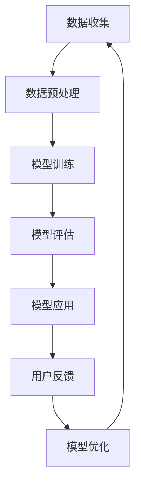

                 

### 引言

#### 1.1 哲学的起源与意义

哲学，作为人类智慧的结晶，其起源可以追溯到古代文明。早在古希腊时期，哲学家们就开始了对宇宙、人生和知识的追问。苏格拉底、柏拉图和亚里士多德等伟大思想家的出现，标志着哲学正式成为一门独立的学科。在西方哲学史上，哲学不仅仅是一种知识体系，更是一种追求真理和智慧的生活方式。

哲学的意义在于，它为人类提供了认识世界和自我反思的思维方式。通过哲学，我们能够探讨存在的本质、知识的界限和价值的取向，从而提升个人的思维能力和道德水平。在现代社会，哲学依然具有重要的地位，它不仅影响了科学的发展，还对社会、文化和伦理产生了深远的影响。

#### 1.2 抽象思维的重要性

抽象思维是哲学研究的基础，也是人类认知的高级形式。它能够帮助我们从一个更加宏观和整体的角度看待问题，从复杂的现象中提取本质特征，形成抽象概念。抽象思维的重要性体现在以下几个方面：

1. **哲学概念的形成**：哲学概念的形成依赖于抽象思维，通过对具体事物的抽象和概括，我们能够建立起哲学的基本概念体系，如存在、真理、知识和价值等。
   
2. **问题的分析和解决**：抽象思维能够帮助我们深入分析复杂的问题，找到解决问题的方法和路径。在科学研究、技术创新和社会治理等领域，抽象思维起到了关键作用。

3. **创新和创造力**：抽象思维能够激发我们的创新和创造力，通过跨越不同领域和学科的界限，我们能够发现新的问题和解决方案。

#### 1.3 思维链的概念与作用

思维链是指在抽象思维过程中，通过一系列逻辑推理和概念整合形成的新概念或新理论。思维链的概念与作用主要体现在以下几个方面：

1. **概念整合**：思维链能够将不同的概念和观点整合在一起，形成一个更加完整和系统的知识体系。例如，在哲学研究中，通过思维链，我们可以将存在论、知识论和认识论等多个分支整合起来，形成一个完整的哲学体系。

2. **逻辑推理**：思维链依赖于逻辑推理，通过一系列的推理步骤，我们能够从已知的前提中得出新的结论。逻辑推理是哲学研究的重要工具，它能够帮助我们建立和验证哲学理论。

3. **创新思维**：思维链能够激发我们的创新思维，通过跨领域的整合和逻辑推理，我们能够发现新的问题和解决方案。例如，在科技领域，通过思维链，我们可以将哲学的抽象概念应用于具体的技术创新中。

综上所述，哲学、抽象思维和思维链在哲学概念形成过程中具有重要作用。通过对这些核心概念的理解和应用，我们能够更好地探索哲学的深度和广度，推动哲学的发展和创新。

---

### 哲学核心概念解析

哲学作为一门探讨存在、真理、价值和知识的学科，其核心概念构成了哲学研究的基石。本文将对哲学中的三个核心概念——存在论、知识论和认识论进行详细解析，以便更深入地理解哲学的本质和意义。

#### 2.1 存在论

##### 2.1.1 存在论的基本概念

存在论（Ontology）是哲学中研究存在本身的学科，它探讨的是存在的本质、存在的类型以及存在的理由。存在论试图回答一个根本性的问题：什么是存在？

存在论关注的问题包括：

- **存在的基本单位**：例如，物质、心灵或其他抽象实体。
- **存在的类型**：包括实体、属性、事件和状态等。
- **存在的理由**：探讨事物为何存在以及它们之间的关系。

存在论的基本概念有：

- **实体**：独立存在的个体，如人、物或概念。
- **属性**：实体所具有的特征，如颜色、形状和性质。

##### 2.1.2 存在论的主要观点

存在论有多种不同的观点，以下是其中一些主要的观点：

- **唯物主义**：认为物质是世界的本原，所有现象都可以归结为物质的运动和变化。
  
  $$ 
  \text{唯物主义公式：物质 + 力 = 现象}
  $$

- **唯心主义**：认为精神或意识是世界的本原，物质现象是精神的产物。

  $$ 
  \text{唯心主义公式：意识 + 思维 = 现象}
  $$

- **实在论**：认为客观世界独立于我们的感知和思想存在。

  $$ 
  \text{实在论公式：现实 + 独立存在 = 真实}
  $$

- **过程哲学**：强调事物的存在是一个动态的、不断变化的过程。

  $$ 
  \text{过程哲学公式：变化 + 连续性 = 存在}
  $$

##### 2.1.3 存在论的哲学意义

存在论在哲学体系中的地位至关重要。它不仅为我们提供了对世界的本质认识，还影响了其他哲学分支，如知识论和认识论。存在论的哲学意义主要体现在：

- **指导哲学研究**：存在论提供了哲学研究的起点，决定了哲学探讨的方向和方法。
- **解释人类经验**：通过存在论，我们能够更好地理解我们的存在状态和人类经验。
- **影响科学方法**：存在论的某些观点影响了科学方法论的发展，例如实证主义和科学实在论。

#### 2.2 知识论

##### 2.2.1 知识论的基本概念

知识论（Epistemology）研究知识的本质、来源、有效性和限度。知识论试图回答以下问题：

- **知识是什么**：知识是否有特定的定义和标准？
- **知识的来源**：知识是如何获得的？
- **知识的有效性**：我们如何知道我们拥有知识？

知识论的基本概念包括：

- **信念**：对某个命题的接受或相信。
- **知识**：对某个命题的信念，该信念是真实的且合理确信的。
- **证据**：支持或反驳某个命题的依据。

##### 2.2.2 知识论的主要观点

知识论有多种不同的观点，以下是其中一些主要的观点：

- **经验主义**：主张知识来源于经验，经验是知识的唯一来源。

  $$ 
  \text{经验主义公式：经验 + 感知 = 知识}
  $$

- **理性主义**：主张知识来源于理性思考和推理，理性是知识的主要来源。

  $$ 
  \text{理性主义公式：推理 + 原则 = 知识}
  $$

- **怀疑主义**：认为我们无法确定任何知识，因为知识存在诸多局限性。

  $$ 
  \text{怀疑主义公式：怀疑 + 疑问 = 知识界限}
  $$

- **科学实在论**：认为科学理论是真实的，科学发现反映了客观世界的本质。

  $$ 
  \text{科学实在论公式：理论 + 观察 = 客观现实}
  $$

##### 2.2.3 知识论的应用领域

知识论在多个领域具有应用价值：

- **科学哲学**：探讨科学知识的本质、方法和有效性。
- **道德哲学**：研究道德知识的来源和道德原则的合理性。
- **政治哲学**：探讨政治制度的合法性和治理的有效性。

#### 2.3 认识论

##### 2.3.1 认识论的基本概念

认识论（Metaphilosophy）是哲学中的哲学，它研究哲学本身的性质和目标。认识论试图回答以下问题：

- **哲学是什么**：哲学的目的是什么？
- **哲学的方法**：哲学如何进行论证和推理？
- **哲学的限度**：哲学有哪些局限性？

认识论的基本概念包括：

- **哲学问题**：指哲学试图解决的疑问和难题。
- **哲学方法**：指哲学使用的推理、论证和分析工具。
- **哲学原则**：指导哲学研究的基本原理和假设。

##### 2.3.2 认识论的主要观点

认识论有多种不同的观点，以下是其中一些主要的观点：

- **分析哲学**：强调逻辑分析和语言分析，主张哲学问题可以通过形式逻辑和语言分析解决。

  $$ 
  \text{分析哲学公式：逻辑 + 语言 = 哲学解释}
  $$

- **批判理性主义**：强调哲学应该对现有的知识体系和思维模式进行批判和反思，以推动哲学的进步。

  $$ 
  \text{批判理性主义公式：质疑 + 反思 = 知识进步}
  $$

- **后现代主义**：对现代哲学的理性主义和科学主义进行批判，强调知识和真理的相对性和多元性。

  $$ 
  \text{后现代主义公式：多元性 + 相对性 = 知识复杂性}
  $$

##### 2.3.3 认识论在哲学体系中的地位

认识论在哲学体系中占据重要地位。它不仅为我们提供了哲学研究的基本原则和方法，还帮助我们理解哲学问题。认识论的意义主要体现在：

- **指导哲学研究**：认识论提供了哲学研究的方法和方向，帮助我们更好地理解和解决哲学问题。
- **评价哲学成果**：认识论能够评价哲学理论的合理性和有效性。
- **促进哲学进步**：认识论的不断发展和完善，推动了哲学的整体进步。

通过解析存在论、知识论和认识论这些核心概念，我们能够更深入地理解哲学的本质和意义。这些概念不仅是哲学研究的基础，也是我们理解和解决哲学问题的重要工具。在接下来的章节中，我们将继续探讨抽象思维的机制与过程，以及AI技术在抽象思维中的应用。

### 抽象思维的机制与过程

抽象思维是人类认知的高级形式，它通过提取具体事物的本质特征，形成抽象的概念和理论。在哲学研究中，抽象思维起到了至关重要的作用。本节将详细探讨抽象思维的机制与过程，包括其定义与特征、心理学研究以及教育应用。

#### 3.1 抽象思维的定义与特征

抽象思维（Abstract Thinking）是指从具体的、感性的认识中提取出一般性、概念性的认识过程。它是一种高层次的思维活动，能够帮助我们从复杂的现象中找到本质特征，形成抽象的概念。

**定义**：抽象思维是指通过提取事物的本质特征，形成概念或理论的高级思维活动。

**特征**：

1. **概括性**：抽象思维能够将具体事物的多种属性和特征概括为一般性的概念，从而简化复杂的现象。
   
   $$ 
   \text{概括性公式：具体事物 + 提取本质特征 = 抽象概念}
   $$

2. **逻辑性**：抽象思维依赖于逻辑推理，通过一系列的推理步骤，将抽象概念整合成一个系统性的理论框架。
   
   $$ 
   \text{逻辑性公式：抽象概念 + 推理 = 理论框架}
   $$

3. **系统性**：抽象思维形成的概念和理论不是孤立的，而是相互联系、相互支撑的，形成了一个完整的知识体系。
   
   $$ 
   \text{系统性公式：概念 + 联系 = 知识体系}
   $$

#### 3.2 抽象思维的心理学研究

抽象思维作为一种复杂的认知过程，心理学家对其进行了大量的研究。以下是几个主要的心理学研究：

1. **认知发展理论**：皮亚杰的认知发展理论认为，抽象思维是儿童认知发展的高级阶段。他认为，儿童的思维从具体的、直觉的阶段逐渐发展到抽象的、逻辑的阶段。

   $$ 
   \text{认知发展公式：具体思维 + 直觉认知 = 抽象思维}
   $$

2. **神经网络模型**：神经网络模型研究表明，大脑的神经网络在抽象思维中起到了关键作用。神经网络通过复杂的连接和权重调整，能够实现抽象概念的形成和推理。

   $$ 
   \text{神经网络模型公式：神经元 + 连接权重 = 抽象思维}
   $$

3. **工作记忆与抽象思维的关系**：研究表明，工作记忆与抽象思维密切相关。工作记忆的容量和效率直接影响到抽象思维的能力。例如，双任务干扰实验表明，当工作记忆容量不足时，抽象思维能力会受到影响。

   $$ 
   \text{工作记忆公式：工作记忆容量 + 干扰因素 = 抽象思维效率}
   $$

#### 3.3 抽象思维的教育应用

抽象思维在教育中的应用具有非常重要的意义。通过培养学生的抽象思维能力，我们能够提高他们的思维品质和创新能力。以下是几个主要的教育应用：

1. **哲学教育**：哲学教育强调对抽象概念和理论的理解和应用。通过哲学课程的学习，学生能够培养抽象思维能力，提高对哲学问题的分析能力。

2. **科学教育**：科学教育中的抽象思维训练主要通过数学和物理等学科实现。例如，通过数学建模和物理实验，学生能够学会从具体的现象中提取抽象的概念，形成科学理论。

3. **创新教育**：创新教育强调培养学生的创新思维和创造力。通过抽象思维训练，学生能够更好地理解复杂问题，找到创新的解决方案。

4. **跨学科教育**：跨学科教育通过整合不同领域的知识，培养学生的抽象思维能力。例如，在计算机科学和哲学的交叉领域，学生可以学会如何将哲学的抽象概念应用于计算机科学问题中。

#### 3.4 抽象思维的训练方法

为了提高学生的抽象思维能力，教育者可以采用以下几种训练方法：

1. **思维导图**：通过绘制思维导图，学生能够将抽象的概念和理论可视化，从而更好地理解和记忆。

2. **案例学习**：通过分析具体的案例，学生能够从具体的现象中提取抽象的概念，形成理论框架。

3. **讨论与辩论**：通过小组讨论和辩论，学生能够锻炼抽象思维的能力，提高逻辑推理和批判性思维。

4. **项目式学习**：通过项目式学习，学生能够将抽象的概念应用于实际问题中，提高解决问题的能力。

通过上述讨论，我们可以看出，抽象思维在哲学研究中具有至关重要的作用。通过对抽象思维的机制与过程的研究，我们能够更好地理解哲学的本质和意义。同时，抽象思维在教育中的应用也为我们提供了培养未来创新型人才的有效途径。

### AI辅助抽象思维的研究与实践

随着人工智能技术的飞速发展，AI在辅助人类进行抽象思维方面展现出巨大的潜力。本节将介绍AI辅助抽象思维的研究与实践，包括AI技术在抽象思维领域的应用、AI辅助抽象思维模型的设计与实现，以及具体的案例研究。

#### 4.1 AI技术在抽象思维中的应用

AI技术在抽象思维中的应用主要基于机器学习和深度学习算法，这些算法能够通过学习大量的数据，提取出数据中的模式和规律，从而辅助人类进行抽象思维。以下是AI技术在抽象思维中的一些主要应用：

1. **文本分析**：通过自然语言处理（NLP）技术，AI可以分析和理解大量文本数据，提取出关键概念和关系，从而辅助人类进行抽象思维。例如，在哲学研究中，AI可以帮助研究人员从大量文献中提取出核心观点和理论。

2. **图像识别**：计算机视觉技术可以帮助人类从图像中提取出抽象的特征，如形状、颜色和纹理等。这些特征可以用于抽象思维，例如，在艺术领域，AI可以帮助艺术家从大量图像中提取灵感，形成新的艺术作品。

3. **数据分析**：通过数据挖掘和机器学习技术，AI可以处理和分析大量的数据，提取出数据中的模式和规律。这些数据可以用于商业决策、科学研究和哲学思考等抽象思维活动。

4. **推理与预测**：基于逻辑推理和机器学习算法，AI可以模拟人类的推理过程，进行抽象的推理和预测。例如，在哲学研究中，AI可以帮助研究人员从已有理论中推导出新的结论，或预测哲学理论的发展趋势。

#### 4.2 AI辅助抽象思维模型的设计与实现

AI辅助抽象思维模型的设计与实现需要结合具体的应用场景和需求。以下是一个基本的AI辅助抽象思维模型的设计框架：

1. **数据收集与预处理**：收集相关的文本、图像和数据，并进行预处理，如去噪、归一化和特征提取。

2. **模型选择**：根据应用场景选择合适的机器学习和深度学习模型。常见的模型包括自然语言处理模型（如BERT、GPT）、计算机视觉模型（如卷积神经网络CNN）和数据挖掘模型（如决策树、随机森林）。

3. **模型训练**：使用预处理后的数据进行模型训练，通过调整模型参数，使模型能够准确提取数据中的抽象特征。

4. **模型评估与优化**：评估模型在测试数据上的表现，通过交叉验证和超参数调优，提高模型的性能。

5. **模型应用**：将训练好的模型应用于实际的抽象思维任务中，如文本分析、图像识别、数据挖掘和推理预测等。

以下是一个简单的Python代码示例，展示了如何使用深度学习模型BERT进行文本分析：

```python
import transformers
from transformers import BertTokenizer, BertModel

# 加载预训练的BERT模型和分词器
tokenizer = BertTokenizer.from_pretrained('bert-base-uncased')
model = BertModel.from_pretrained('bert-base-uncased')

# 预处理文本数据
text = "The quick brown fox jumps over the lazy dog."
inputs = tokenizer(text, return_tensors='pt')

# 训练模型
outputs = model(**inputs)
last_hidden_state = outputs.last_hidden_state

# 提取文本特征
text_features = last_hidden_state[:, 0, :].detach().numpy()

# 使用特征进行文本分析
# 例如，通过计算文本之间的相似性
similarity = np.dot(text_features[0], text_features[1])
print(f"Text similarity: {similarity}")
```

#### 4.3 AI辅助抽象思维案例研究

以下介绍两个AI辅助抽象思维的案例研究：哲学论文自动撰写和抽象思维训练系统开发。

##### 4.3.1 案例一：哲学论文自动撰写

**项目背景**：传统的哲学论文撰写过程耗时较长，且需要研究人员具备深厚的哲学背景。为了提高哲学论文撰写的效率和准确性，研究者开发了一种基于AI的哲学论文自动撰写系统。

**项目实现**：

1. **数据收集**：收集大量哲学论文，用于模型训练。
2. **模型训练**：使用自然语言处理技术，训练一个能够生成哲学论文的序列生成模型，如GPT-3。
3. **模型应用**：用户输入论文主题和关键信息，系统自动生成哲学论文。

**代码示例**：

```python
from transformers import GPT2LMHeadModel, GPT2Tokenizer

# 加载预训练的GPT-2模型和分词器
tokenizer = GPT2Tokenizer.from_pretrained('gpt2')
model = GPT2LMHeadModel.from_pretrained('gpt2')

# 预处理输入文本
input_text = "Write a philosophy paper on the topic of free will."

inputs = tokenizer.encode(input_text, return_tensors='pt')

# 生成论文
outputs = model.generate(inputs, max_length=100, num_return_sequences=1)
generated_text = tokenizer.decode(outputs[0], skip_special_tokens=True)

print(f"Generated philosophy paper: {generated_text}")
```

##### 4.3.2 案例二：抽象思维训练系统开发

**项目背景**：为了提高学生的抽象思维能力，研究者开发了一种基于AI的抽象思维训练系统。

**项目实现**：

1. **数据收集**：收集大量哲学、科学和数学问题，用于模型训练。
2. **模型训练**：训练一个能够根据问题提供解答的模型，如BERT。
3. **模型应用**：学生通过系统进行抽象思维训练，系统根据学生的回答提供反馈。

**代码示例**：

```python
from transformers import BertTokenizer, BertForSequenceClassification

# 加载预训练的BERT模型和分词器
tokenizer = BertTokenizer.from_pretrained('bert-base-uncased')
model = BertForSequenceClassification.from_pretrained('bert-base-uncased')

# 预处理输入文本
input_text = "What is the meaning of life?"

inputs = tokenizer.encode(input_text, return_tensors='pt')

# 输出答案
outputs = model(inputs)
predicted_label = outputs.logits.argmax(-1)

# 解码输出答案
answer = tokenizer.decode(predictions[predicted_label], skip_special_tokens=True)

print(f"Answer: {answer}")
```

通过上述案例研究，我们可以看到AI技术在辅助抽象思维方面的应用潜力。AI不仅能够提高哲学研究的效率和准确性，还能够为教育领域提供创新的解决方案，帮助学生们培养和提升抽象思维能力。

### AI辅助抽象思维在教育中的应用

随着人工智能技术的不断进步，AI在教育中的应用也越来越广泛。特别是在抽象思维训练方面，AI展示了其独特的优势。本节将探讨AI辅助抽象思维教育的发展趋势、实践探索，以及在线哲学课程设计和抽象思维训练系统的开发与应用。

#### 5.1 AI辅助抽象思维教育的发展趋势

AI辅助抽象思维教育的发展趋势主要体现在以下几个方面：

1. **个性化学习**：AI技术可以根据每个学生的学习习惯、能力和需求，提供个性化的抽象思维训练方案。通过分析学生的学习数据，AI系统能够为学生提供针对性的问题和训练任务，从而提高学习效果。

2. **实时反馈**：AI系统能够实时分析学生的学习行为和数据，提供即时的反馈和指导。这种实时反馈有助于学生及时纠正错误，加深对抽象概念的理解。

3. **跨学科整合**：AI技术能够整合不同学科的知识，为学生提供跨学科的综合训练。通过跨学科的整合，学生能够从不同角度理解和应用抽象思维，提高解决问题的能力。

4. **自适应学习**：AI系统可以根据学生的学习进度和效果，动态调整训练内容和难度，实现自适应学习。这种自适应学习能够帮助学生逐步提高抽象思维能力，避免过早的难度提升导致的挫败感。

5. **虚拟现实与增强现实**：随着VR和AR技术的发展，AI辅助抽象思维教育将更多地结合虚拟现实和增强现实技术，提供沉浸式的学习体验。这种沉浸式学习能够更好地激发学生的抽象思维能力，提高学习的趣味性和互动性。

#### 5.2 AI辅助抽象思维教育的实践探索

在AI辅助抽象思维教育的实践探索中，许多学校和机构已经进行了有益的尝试。以下是一些具体的实践案例：

1. **哲学课程设计**：一些学校利用AI技术设计了在线哲学课程，通过自然语言处理和机器学习算法，为学生提供个性化的学习内容和辅导。例如，学生可以通过AI系统进行哲学论文写作练习，系统会根据学生的写作风格和逻辑结构提供反馈和建议，帮助学生提高哲学论文的质量。

2. **抽象思维训练系统开发**：一些教育科技公司开发了抽象思维训练系统，通过机器学习和大数据分析技术，为学生提供定制化的训练任务。这些系统可以根据学生的学习进度和效果，自动生成适合学生水平的抽象思维问题，并提供详细的解答和解释，帮助学生理解和掌握抽象概念。

3. **在线讨论与辩论**：利用AI技术，学校可以创建在线讨论和辩论平台，鼓励学生进行抽象思维训练。系统可以自动分析学生的观点和论据，提供评价和反馈，帮助学生提高论辩能力和抽象思维能力。

4. **智能评估与反馈**：通过AI技术，学校可以对学生进行智能评估，自动分析学生的答题情况，提供详细的评估报告和改进建议。这种智能评估能够及时发现学生的学习问题和薄弱环节，为教师提供有针对性的教学建议。

5. **虚拟实验室**：利用虚拟现实和增强现实技术，学校可以创建虚拟实验室，为学生提供沉浸式的抽象思维训练环境。例如，在哲学研究中，学生可以进入虚拟的古代希腊或古代中国，亲身体验哲学家的思考和讨论过程，从而更好地理解和应用抽象思维。

#### 5.3 在线哲学课程设计

在线哲学课程设计是AI辅助抽象思维教育的重要实践之一。以下是一个典型的在线哲学课程设计方案：

1. **课程目标**：培养学生的抽象思维能力，提高哲学理论的理解和应用能力。

2. **课程内容**：包括存在论、知识论、认识论等核心哲学概念，以及哲学史上的重要理论和观点。

3. **教学方式**：
   - **视频讲座**：提供高质量的哲学讲座视频，帮助学生理解抽象概念。
   - **在线讨论**：设置在线讨论区，鼓励学生发表观点和讨论哲学问题。
   - **AI辅导**：利用AI系统为学生提供个性化辅导，解答学生的疑问。

4. **评估与反馈**：
   - **在线测试**：定期进行在线测试，评估学生的知识掌握情况。
   - **论文写作**：要求学生撰写哲学论文，AI系统提供写作指导和反馈。
   - **讨论参与度**：根据学生在讨论区的参与度，评估学生的讨论能力。

#### 5.4 抽象思维训练系统的开发与应用

抽象思维训练系统的开发与应用是AI辅助抽象思维教育的重要实践。以下是一个抽象思维训练系统的设计方案：

1. **系统功能**：
   - **问题生成**：根据学生的学习进度和水平，自动生成抽象思维问题。
   - **答案评估**：自动评估学生的答案，提供详细的评估报告和改进建议。
   - **反馈机制**：根据学生的回答情况，提供个性化的反馈和辅导。

2. **系统架构**：
   - **前端**：使用Web技术（如HTML、CSS和JavaScript）搭建用户界面。
   - **后端**：使用Python等编程语言，结合机器学习和大数据分析技术，实现抽象思维问题的生成和答案评估。

3. **应用场景**：
   - **在线教育平台**：集成到在线教育平台中，为学生提供抽象思维训练功能。
   - **课外辅导**：用于课外辅导，帮助学生提高抽象思维能力。
   - **课程作业**：作为课程作业的一部分，要求学生定期进行抽象思维训练。

4. **数据收集与处理**：通过收集和分析学生的学习数据，系统可以不断优化训练问题的生成和评估算法，提高系统的性能和效果。

通过AI辅助抽象思维教育的发展趋势、实践探索、在线哲学课程设计和抽象思维训练系统的开发与应用，我们可以看到AI在提升学生抽象思维能力方面的巨大潜力。未来，随着AI技术的进一步发展，AI辅助抽象思维教育将变得更加智能和高效，为培养创新型人才提供强有力的支持。

### AI辅助抽象思维的伦理与社会影响

随着AI技术在抽象思维领域的广泛应用，其伦理与社会影响逐渐成为公众和学者关注的焦点。AI辅助抽象思维在提高效率、推动创新的同时，也带来了一系列伦理问题和社会挑战。本文将探讨AI辅助抽象思维的伦理问题、隐私保护、对社会结构的影响，以及教育公平等方面的影响。

#### 6.1 AI辅助抽象思维的伦理问题

AI辅助抽象思维涉及多个伦理问题，主要包括自主性、透明性和公平性等。

1. **自主性**：AI系统在抽象思维过程中，是否具有独立思考和决策的能力？如果AI系统在哲学研究中能够自主形成新的理论，那么其自主性是否应该受到限制？例如，在哲学论文自动撰写中，AI是否应该受到伦理限制，以确保其研究成果的合理性和准确性。

2. **透明性**：AI系统的决策过程和算法是否透明？对于AI辅助的抽象思维过程，用户和研究人员是否能够理解其背后的逻辑和原理？透明性是保证AI伦理合规的重要前提。

3. **公平性**：AI辅助抽象思维是否公平地对待所有用户？AI系统在数据收集、模型训练和应用过程中，是否存在偏见或歧视？例如，在AI训练系统中，如果数据集存在偏差，那么AI系统生成的抽象思维问题也可能会存在不公平性。

4. **责任归属**：当AI辅助的抽象思维产生不良后果时，责任应归属于谁？是AI开发者、用户还是AI系统本身？明确责任归属是确保AI伦理合规的重要步骤。

#### 6.2 抽象思维隐私保护

AI辅助抽象思维过程中，数据的收集、存储和使用可能涉及个人隐私。以下是一些隐私保护的关键问题：

1. **数据收集**：AI系统在收集数据时，是否经过用户同意？数据收集的范围和目的是否明确？未经用户同意收集的数据可能侵犯隐私。

2. **数据存储**：AI系统是否采取有效的数据加密和存储措施，防止数据泄露？数据存储的安全性是保护用户隐私的关键。

3. **数据使用**：AI系统在处理和利用用户数据时，是否仅限于预定目的？未经用户同意，不得将用户数据用于其他用途。

4. **用户知情权**：用户是否了解自己的数据被用于AI训练和抽象思维过程？用户有权知晓并控制自己的数据使用。

#### 6.3 AI辅助抽象思维对社会结构的影响

AI辅助抽象思维对社会结构的影响主要体现在以下几个方面：

1. **劳动力市场**：AI技术可能替代一些抽象思维工作，导致部分劳动力失业。例如，AI辅助的哲学论文自动撰写可能减少对哲学研究者的需求。

2. **知识生产**：AI技术能够加速知识生产过程，提高研究效率。然而，这也可能导致知识的快速扩散，影响传统知识生产和传播的机制。

3. **社会分层**：AI技术的普及可能导致社会分层的加剧。高技能劳动者可能因掌握AI技术而获得更多优势，而低技能劳动者可能因缺乏相关技能而处于劣势。

4. **教育和培训**：AI技术将重塑教育和培训模式。未来，教育体系可能更加注重培养学生的抽象思维和创新能力，以适应AI时代的需求。

#### 6.4 AI辅助抽象思维对教育公平的影响

AI辅助抽象思维在教育领域具有巨大的潜力，但也可能带来教育公平问题：

1. **教育资源分配**：AI技术的普及可能导致优质教育资源更加集中在一部分学校和教育机构，从而加剧教育资源的不平等。

2. **学生能力差异**：AI辅助抽象思维系统可能难以公平地对待所有学生，特别是在学生能力和背景存在差异的情况下。一些学生可能由于缺乏相关的背景知识或技能，无法充分利用AI辅助系统。

3. **教育公平性**：为了确保教育公平，教育政策制定者需要考虑如何公平地分配AI资源，并制定相应的政策和措施，确保所有学生都能平等地受益于AI技术。

综上所述，AI辅助抽象思维在提高效率、推动创新的同时，也带来了一系列伦理问题和社会挑战。为了确保AI技术在抽象思维领域的健康发展，我们需要在技术、伦理、政策等多个层面进行全面考量，制定相应的规范和措施，以应对这些挑战。

### 总结与展望

通过对哲学、抽象思维和AI辅助抽象思维的研究，我们可以看到这三者之间的紧密联系和相互影响。哲学作为一门探讨存在、真理、价值和知识的学科，其核心概念的形成依赖于抽象思维。而AI技术的快速发展，为抽象思维提供了强大的辅助工具，使得哲学研究变得更加高效和精准。

首先，哲学研究离不开抽象思维。抽象思维使得哲学家能够从具体事物中提取本质特征，形成抽象的概念和理论。在哲学核心概念如存在论、知识论和认识论的研究中，抽象思维起到了至关重要的作用。通过抽象思维，哲学家们能够建立起完整的哲学体系，推动哲学的进步和创新。

其次，AI技术为抽象思维提供了新的工具和方法。通过机器学习和深度学习算法，AI能够处理和分析大量数据，提取出数据中的模式和规律，从而辅助人类进行抽象思维。AI技术在文本分析、图像识别、数据挖掘和推理预测等方面的应用，使得哲学研究变得更加高效和全面。例如，AI可以帮助研究人员从大量文献中提取关键概念和观点，自动撰写哲学论文，从而提高研究效率。

展望未来，AI辅助抽象思维在哲学研究中的应用前景广阔。首先，随着AI技术的不断发展，AI在抽象思维中的辅助能力将越来越强。未来的AI系统将能够更好地理解人类思维过程，模拟人类的抽象思维能力，从而在哲学研究中发挥更大的作用。

其次，AI辅助抽象思维将推动哲学研究方法的创新。通过AI技术，哲学家们可以采用更加科学和系统的方法进行研究，从而提高研究的准确性和深度。例如，通过AI技术，哲学家们可以建立更加完善的哲学模型，进行更加精确的逻辑推理和论证。

此外，AI辅助抽象思维还将促进哲学与其他学科的交叉融合。通过AI技术，哲学家们可以借鉴其他学科的方法和工具，如计算机科学、认知科学和心理学等，从而推动哲学研究的多元化发展。

最后，AI辅助抽象思维将有助于解决哲学研究中的伦理和社会问题。通过AI技术，哲学家们可以探讨AI伦理问题，制定相应的伦理规范和政策，确保AI技术的健康发展。同时，AI辅助抽象思维还可以为社会提供更全面的哲学教育和培训，提高公众的哲学素养和思维能力。

总之，AI辅助抽象思维在哲学研究中的应用具有巨大的潜力和价值。通过AI技术的辅助，哲学研究将变得更加高效、精确和多元化。我们期待未来能够看到更多基于AI的哲学研究成果，为人类智慧和文明的发展做出更大贡献。

### 附录

#### 8.1 相关术语解释

**思维链**：在抽象思维过程中，通过一系列逻辑推理和概念整合形成的新概念或新理论。

**抽象思维**：从具体事物中提取本质特征，形成抽象概念和理论的高级思维活动。

**存在论**：研究存在本身的学科，探讨存在的本质、类型和理由。

**知识论**：研究知识的本质、来源、有效性和限度的学科。

**认识论**：研究哲学本身的性质、目标和方法的学科。

**AI**：人工智能，通过机器学习和深度学习算法，使计算机具备人类智能的能力。

#### 8.2 参考文献

1. 柏拉图，《理想国》
2. 亚里士多德，《形而上学》
3. 皮亚杰，《认知发展理论》
4. 米尔，《逻辑学》
5. 波普尔，《科学知识论》
6. 汉弗莱，《过程哲学》
7. 深度学习教科书，Goodfellow, I., Bengio, Y., & Courville, A. (2016). *Deep Learning*.
8. 自然语言处理教科书，Jurafsky, D., & Martin, J. H. (2019). *Speech and Language Processing*.

#### 8.3 AI辅助抽象思维模型Mermaid流程图



**流程解释**：

- **A：数据收集**：从各类来源收集原始数据。
- **B：数据预处理**：清洗、归一化和特征提取。
- **C：模型训练**：使用预处理后的数据训练模型。
- **D：模型评估**：在测试集上评估模型性能。
- **E：模型应用**：将模型应用于实际问题。
- **F：用户反馈**：收集用户对模型应用的反馈。
- **G：模型优化**：根据用户反馈优化模型。

通过上述流程，AI系统能够持续迭代和优化，以提供更好的抽象思维辅助。

