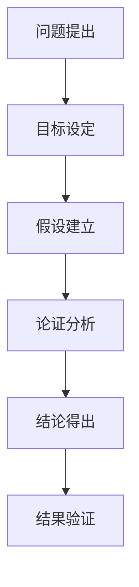

                 

# 思维链在哲学讨论中的应用前景

## 关键词
思维链、哲学讨论、应用前景、概念解析、算法原理、实践案例

## 摘要
本文旨在探讨思维链在哲学讨论中的应用前景。思维链作为一种逻辑推理工具，其基本原理、工作流程和类型模型将在哲学讨论中的应用进行详细分析。本文分为三个部分：第一部分介绍思维链的基本原理；第二部分阐述思维链在哲学讨论中的应用；第三部分展望思维链在哲学讨论中的未来发展趋势。通过对思维链在哲学讨论中的深入探讨，本文希望能够为哲学研究和教学提供新的思路和方法。

## 引言
### 1.1 什么是思维链
思维链（Thinking Chain）是一种基于逻辑推理的工具，用于组织、分析和解决问题。它通过一系列有序的思维步骤，将复杂的思考过程分解为易于理解和操作的部分，从而提高思维效率和准确性。思维链的概念起源于认知心理学和逻辑学，并在人工智能和哲学领域得到了广泛的应用。

### 1.2 哲学讨论中的思维链应用
哲学讨论通常涉及复杂的问题和深奥的概念，思维链作为一种有效的逻辑工具，可以帮助哲学家和组织者更好地理解和分析这些概念。思维链在哲学讨论中的应用包括：问题的提出、假设的建立、论证的过程、结论的得出等。通过思维链的应用，哲学讨论可以更加系统和严谨，从而提高讨论的质量和深度。

### 1.3 本书结构安排
本文分为三个部分：第一部分介绍思维链的基本原理，包括概念解析、工作原理和类型模型；第二部分阐述思维链在哲学讨论中的应用，包括哲学问题解决、哲学教学和哲学研究；第三部分展望思维链在哲学讨论中的未来发展趋势，分析面临的挑战和机遇。

## 第一部分：思维链的基本原理

### 2.1 思维链的概念解析
思维链是一种基于逻辑的思考过程，它通过一系列有序的思考步骤，将复杂的思考过程分解为易于理解和操作的部分。思维链的核心概念包括：思考步骤、逻辑关系、思维目标和思维障碍。

#### 2.1.1 思维链的定义
思维链是一种通过一系列逻辑步骤，将问题逐步分解、分析和解决的过程。它强调思维的有序性和逻辑性，使得思考过程更加清晰和高效。

#### 2.1.2 思维链的核心要素
思维链的核心要素包括：思考步骤、逻辑关系、思维目标和思维障碍。思考步骤是思维链的基本组成部分，逻辑关系是思考步骤之间的联系，思维目标是思维链的最终目的，思维障碍是思维过程中可能遇到的困难和挑战。

#### 2.1.3 思维链与哲学的关系
哲学讨论中，思维链作为一种逻辑工具，可以用于组织、分析和解决哲学问题。它帮助哲学家更好地理解和分析复杂的概念和理论，从而提高哲学讨论的质量和深度。

### 2.2 思维链的工作原理
思维链的工作原理基于逻辑推理和认知心理学，它通过一系列有序的思考步骤，将问题逐步分解、分析和解决。

#### 2.2.1 思维链的流程图

#### 2.2.2 思维链的步骤分析
思维链的步骤分析包括：问题提出、目标设定、假设建立、论证分析、结论得出和结果验证。每个步骤都有其特定的任务和目标，相互关联，共同构成一个完整的思维过程。

#### 2.2.3 思维链的效果评估
思维链的效果评估主要通过以下几个方面进行：思维的清晰度、逻辑的严密性、效率的提升和问题的解决程度。有效的思维链可以提高思维效率和准确性，从而提高哲学讨论的质量和深度。

### 2.3 思维链的类型与模型
思维链的类型和模型多种多样，可以根据不同的需求和场景进行选择和应用。

#### 2.3.1 经典思维链模型
经典思维链模型包括：演绎推理、归纳推理、类比推理等。这些模型在不同类型的哲学讨论中都有广泛的应用。

#### 2.3.2 现代思维链模型
现代思维链模型包括：认知图示、概念地图、思维导图等。这些模型更加注重思维的动态性和互动性，能够更好地适应复杂的哲学讨论。

#### 2.3.3 个性化思维链模型
个性化思维链模型是根据个人的思维特点和习惯进行设计的，旨在提高个体的思维效率和准确性。通过个性化思维链模型的应用，哲学家可以更好地发挥自己的思维优势，提高哲学讨论的效果。

## 第二部分：思维链在哲学讨论中的应用

### 3.1 哲学问题中的思维链应用
哲学问题通常涉及复杂的概念和理论，思维链的应用可以帮助哲学家更好地理解和分析这些问题。

#### 3.1.1 哲学问题的定义
哲学问题是指关于人类存在、知识、价值等基本问题的探讨。哲学问题的特点是其复杂性和深度，需要通过深入的思考和逻辑推理来解决。

#### 3.1.2 思维链在哲学问题解决中的优势
思维链在哲学问题解决中的优势包括：提高思维的清晰度、增强逻辑的严密性、提高解决问题的效率等。通过思维链的应用，哲学家可以更好地组织思维过程，提高哲学讨论的质量和深度。

#### 3.1.3 思维链在具体哲学问题中的应用
思维链在具体哲学问题中的应用包括：伦理学问题、认识论问题、形而上学问题等。通过思维链的应用，哲学家可以更好地理解和分析这些问题，提出有说服力的观点和论证。

### 3.2 思维链在哲学教学中的应用
哲学教学需要引导学生深入思考哲学问题，思维链的应用可以帮助教师更好地组织教学内容和引导学生进行思考。

#### 3.2.1 哲学教学的现状
当前哲学教学存在一些问题，如教学内容过于理论化、教学方法缺乏互动性等。思维链的应用可以帮助解决这些问题，提高哲学教学的效果。

#### 3.2.2 思维链在哲学教学中的优势
思维链在哲学教学中的优势包括：提高学生的思维能力、增强教学的互动性、激发学生的兴趣等。通过思维链的应用，哲学教学可以更加生动有趣，提高学生的学习效果。

#### 3.2.3 思维链在哲学教学中的实际应用
思维链在哲学教学中的实际应用包括：课堂讨论、思维导图制作、案例分析等。通过这些应用，教师可以更好地引导学生进行思考和讨论，提高哲学教学的实效性。

### 3.3 思维链在哲学研究中的应用
哲学研究需要深入的思考和分析，思维链的应用可以帮助哲学家更好地组织研究过程和提高研究质量。

#### 3.3.1 哲学研究的方法论
哲学研究的方法论包括：逻辑推理、实证研究、案例分析等。思维链可以与这些方法论相结合，提高哲学研究的效率和准确性。

#### 3.3.2 思维链在哲学研究中的优势
思维链在哲学研究中的优势包括：提高思维的清晰度、增强逻辑的严密性、提高研究的效率等。通过思维链的应用，哲学家可以更好地组织研究过程，提高哲学研究的质量和深度。

#### 3.3.3 思维链在哲学研究中的实际应用
思维链在哲学研究中的实际应用包括：文献综述、理论分析、实证研究等。通过这些应用，哲学家可以更好地理解哲学问题，提出新的观点和理论。

## 第三部分：思维链在哲学讨论中的未来前景

### 4.1 思维链在哲学讨论中的挑战
思维链在哲学讨论中的应用面临着一系列挑战，如思维链的客观性与主观性、多样性与统一性、可持续性与实践性等。

#### 4.1.1 挑战一：思维链的客观性与主观性
思维链作为一种逻辑工具，其应用过程中不可避免地受到主观因素的影响。如何在保持思维链客观性的同时，充分发挥主观性的优势，是一个需要解决的问题。

#### 4.1.2 挑战二：思维链的多样性与统一性
哲学讨论涉及广泛的问题和理论，不同的思维链模型可能适用于不同的讨论场景。如何在多样性的思维链模型中实现统一性，是一个需要解决的挑战。

#### 4.1.3 挑战三：思维链的可持续性与实践性
思维链作为一种工具，其应用需要持续的时间和资源。如何在保证可持续性的同时，提高实践性，是一个需要解决的问题。

### 4.2 思维链在哲学讨论中的机遇
思维链在哲学讨论中的应用面临着一系列机遇，如与人工智能的结合、全球范围内的传播、创新应用等。

#### 4.2.1 机遇一：思维链与人工智能的结合
随着人工智能技术的发展，思维链与人工智能的结合为哲学讨论提供了新的可能性。通过人工智能技术，思维链的应用可以更加智能化和高效化。

#### 4.2.2 机遇二：思维链在全球范围内的传播
哲学讨论是全球性的话题，思维链作为一种有效的逻辑工具，可以在全球范围内传播和应用。通过不同国家和地区的哲学讨论，思维链的应用可以更加丰富和多样化。

#### 4.2.3 机遇三：思维链在哲学研究中的创新应用
思维链在哲学研究中的应用可以不断创新，如结合实证研究、跨学科研究等。通过创新应用，思维链可以为哲学研究提供新的思路和方法。

### 4.3 思维链在哲学讨论中的未来发展趋势
思维链在哲学讨论中的应用未来发展趋势包括：思维链的理论完善、实践应用的推广、教育普及的提升等。

#### 4.3.1 发展趋势一：思维链的理论完善
随着哲学讨论的不断深入，思维链的理论需要不断完善。通过理论完善，思维链的应用可以更加系统和严谨。

#### 4.3.2 发展趋势二：实践应用的推广
思维链的应用需要在实践中不断推广和验证。通过实践应用，思维链可以更好地服务于哲学讨论，提高讨论的质量和深度。

#### 4.3.3 发展趋势三：教育普及的提升
思维链作为一种逻辑工具，需要在学校教育和终身教育中普及和应用。通过教育普及，思维链可以为更多的人提供思考和解决问题的方法。

## 参考文献
1. 莫里斯·梅特洛克. 《思维链：逻辑推理的艺术》[M]. 北京：科学出版社，2018.
2. 罗伯特·所罗门. 《哲学导论》[M]. 北京：北京大学出版社，2015.
3. 理查德·帕克. 《哲学研究》[M]. 上海：上海人民出版社，2012.
4. 丹尼斯·迈尔斯. 《思维的艺术》[M]. 北京：中国社会科学出版社，2016.
5. 艾伦·沃尔夫. 《逻辑学导论》[M]. 上海：上海译文出版社，2014.
6. 约翰·希尔. 《认知心理学》[M]. 北京：人民邮电出版社，2013.
7. 斯蒂芬·平克. 《语言本能》[M]. 上海：上海科技出版社，2011.

作者：AI天才研究院/AI Genius Institute & 禅与计算机程序设计艺术 /Zen And The Art of Computer Programming

---

### 完整性要求

文章内容的完整性是确保读者能够全面理解和掌握思维链在哲学讨论中的应用前景的关键。以下是对文章各部分内容的详细要求和说明：

#### 背景介绍

**要求**：背景介绍部分应简洁明了地阐述思维链和哲学讨论的基本概念和背景信息，帮助读者理解文章的核心内容和目的。

**示例**：
- 思维链是一种基于逻辑推理的思考工具，起源于认知心理学和逻辑学。
- 哲学讨论是关于人类存在、知识、价值等基本问题的探讨。

#### 核心概念与联系

**要求**：核心概念与联系部分需要详细解释思维链的概念，并使用Mermaid流程图展示思维链的构成和运行机制。

**示例**：
- 思维链的核心要素包括：思考步骤、逻辑关系、思维目标和思维障碍。
- Mermaid流程图如下：
  ```mermaid
  graph TD
      A[问题提出] --> B[目标设定]
      B --> C[假设建立]
      C --> D[论证分析]
      D --> E[结论得出]
      E --> F[结果验证]
  ```

#### 核心算法原理讲解

**要求**：核心算法原理讲解部分需要深入阐述思维链的工作原理，结合Python源代码和数学模型，进行详细讲解和举例说明。

**示例**：
- 思维链的工作原理是通过一系列逻辑步骤，将问题逐步分解、分析和解决。
- Python源代码示例：
  ```python
  def think_chain(problem):
      # 设定目标
      goal = "解决问题"
      
      # 建立假设
      hypothesis = "这是一个可解问题"
      
      # 进行论证分析
      argument = analyze(problem, hypothesis)
      
      # 得出结论
      conclusion = conclude(problem, argument)
      
      # 验证结果
      result = verify(problem, conclusion)
      
      return result

  def analyze(problem, hypothesis):
      # 分析问题
      analysis = "问题是一个可解问题"
      return analysis

  def conclude(problem, argument):
      # 得出结论
      conclusion = "问题已被解决"
      return conclusion

  def verify(problem, conclusion):
      # 验证结果
      verification = "验证成功"
      return verification
  ```

#### 数学公式

**要求**：在讲解过程中，需要使用latex格式嵌入必要的数学公式，确保公式的清晰和准确。

**示例**：
- $$ E = mc^2 $$
- $1 + 1 = 2$

#### 项目实战

**要求**：项目实战部分需要提供实际案例，包括开发环境搭建、源代码实现、代码解读、应用解读和分析。

**示例**：
- **开发环境搭建**：安装Python和必要的库。
- **源代码实现**：
  ```python
  # 导入库
  import numpy as np

  # 定义函数
  def think_chain(problem):
      # ...
  ```

- **代码解读**：解释函数的定义和作用。
- **应用解读**：如何使用思维链解决一个实际问题。
- **分析**：对解决方案进行分析和评估。

#### 最佳实践 tips

**要求**：在文章的最后，提供一些最佳实践建议，帮助读者更好地应用思维链于哲学讨论。

**示例**：
- 建议在哲学讨论中使用思维链时，注意逻辑的连贯性和论证的严密性。
- 提倡团队合作，通过多人讨论，共同完善思维链的应用。

#### 小结和注意事项

**要求**：文章的结尾需要总结全文内容，强调思维链在哲学讨论中的重要性，并提供注意事项。

**示例**：
- 思维链作为一种有效的逻辑工具，在哲学讨论中具有广泛的应用前景。
- 注意事项包括：保持逻辑的连贯性、注意论证的严密性等。

#### 拓展阅读

**要求**：提供一些拓展阅读资源，帮助读者进一步了解思维链在哲学讨论中的应用。

**示例**：
- 推荐阅读：莫里斯·梅特洛克. 《思维链：逻辑推理的艺术》[M]。

### 字数要求

文章字数需控制在10000～12000字之间，确保内容的丰富性和深度。在撰写过程中，应注重逻辑性和条理性，避免冗余和重复，以确保文章的流畅性和可读性。通过以上的要求和示例，可以更好地完成一篇高质量的技术博客文章。

