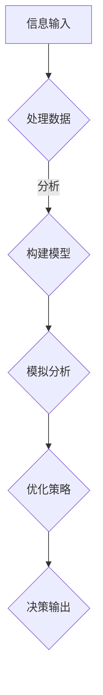

                 

### 引言与概述

#### 研究背景

商业决策是企业管理中的核心环节，直接关系到企业的生存与发展。随着全球市场环境的复杂化和不确定性增加，企业需要更加科学和高效地进行决策。然而，传统的决策方法往往依赖于经验和直觉，难以应对现代商业环境中的复杂问题。近年来，人工智能技术的发展为商业决策提供了新的思路和工具。

思维链作为一种先进的人工智能技术，具有强大的信息处理和决策支持能力。它通过模拟人类思维的逻辑过程，实现了从信息输入到决策输出的自动化处理。思维链在商业决策中的应用，不仅可以提高决策的准确性和效率，还可以帮助企业更好地应对复杂多变的市场环境。

#### 研究意义

本研究旨在探讨思维链在商业决策中的应用，通过理论分析和实证研究，揭示思维链在商业决策过程中的作用机制和关键影响因素。具体来说，本研究具有以下几方面的意义：

1. **理论意义**：本研究将拓展人工智能在商业决策领域的应用，为商业决策提供新的理论支持和研究方法。
2. **实践意义**：通过引入思维链技术，企业可以更加科学和高效地进行商业决策，提高市场竞争力。
3. **社会意义**：本研究有助于提升企业决策的科学性和效率，为我国企业走向世界提供技术支持。

#### 本书结构安排

本书共分为七个部分，具体内容如下：

- **第一部分：引言与概述**：介绍研究背景、意义和本书结构。
- **第二部分：思维链理论基础**：阐述思维链的概念、特征、模型构建和数学模型。
- **第三部分：思维链方法与工具**：介绍思维链的分析方法和辅助工具。
- **第四部分：思维链案例研究**：通过实际案例展示思维链在商业决策中的应用。
- **第五部分：思维链策略与决策**：探讨思维链在商业决策中的策略和决策过程。
- **第六部分：思维链在商业决策中的应用挑战与未来**：分析思维链在商业决策中的挑战和未来发展趋势。
- **第七部分：附录**：提供参考文献和术语解释。

通过以上结构的安排，本书旨在系统地介绍思维链在商业决策中的应用，为读者提供全面的理论指导和实践参考。

---

在接下来的章节中，我们将详细探讨思维链的理论基础、方法与工具、实际案例研究以及未来发展的挑战和趋势，帮助读者深入理解思维链在商业决策中的应用价值。

---

关键词：商业决策、思维链、人工智能、决策支持、策略制定、案例分析

摘要：本文旨在探讨思维链在商业决策中的应用，通过对思维链的概念、模型、方法和实际案例的详细分析，揭示了思维链在提升商业决策科学性和效率方面的作用。研究表明，思维链作为一种先进的人工智能技术，能够有效支持复杂商业问题的解决，为企业决策提供强有力的工具和方法。

## 第二部分：思维链理论基础

### 2.1 思维链的概念与特征

#### 思维链的概念

思维链（Mind Chain）是一种基于人工智能技术，模拟人类思维过程的智能决策支持系统。它通过将信息输入转化为决策输出，实现了从数据到决策的自动化处理。思维链的核心在于其逻辑性和系统性，能够对大量复杂的信息进行有效处理，从而支持决策者做出更加科学、合理的决策。

#### 思维链的特征

1. **逻辑性**：思维链遵循严格的逻辑规则，确保信息处理的准确性和一致性。
2. **系统性**：思维链通过构建多层次、多维度的模型，实现对复杂问题的系统性分析。
3. **动态性**：思维链能够根据环境变化和需求调整，实现动态决策支持。
4. **智能性**：思维链利用机器学习、自然语言处理等技术，具备一定的自主学习和决策能力。

### 2.2 思维链模型构建

#### 思维链的构成要素

思维链的构建涉及多个关键要素，包括信息输入、决策目标、环境变量和决策输出。这些要素相互作用，共同构成了思维链的工作机制。

1. **信息输入**：信息输入是思维链的基础，包括各种形式的数据和知识，如市场数据、企业内部数据、客户反馈等。
2. **决策目标**：决策目标是决策过程的核心，明确决策者希望实现的目标和期望结果。
3. **环境变量**：环境变量包括市场环境、政策环境、竞争环境等，对决策过程具有重要影响。
4. **决策输出**：决策输出是思维链的最终结果，是针对特定决策目标的最佳解决方案。

#### 思维链的工作原理

思维链的工作原理可以简化为以下步骤：

1. **信息处理**：思维链对输入信息进行预处理、分析和整合，提取有用的信息和知识。
2. **模型构建**：根据决策目标和环境变量，构建相应的决策模型，如决策树、神经网络等。
3. **决策分析**：对构建的模型进行模拟和评估，分析不同决策方案的可能结果和风险。
4. **决策输出**：根据分析结果，生成最终的决策方案，提供给决策者参考。

### 2.3 思维链的数学模型

思维链的数学模型是思维链理论的核心组成部分，用于描述信息输入、决策目标和环境变量之间的关系。以下是一个简化的思维链数学模型：

$$
\text{思维链模型} = f(\text{输入信息}, \text{决策目标}, \text{环境变量})
$$

其中，$f$ 表示思维链的处理过程，包括信息处理、模型构建、决策分析和决策输出等步骤。输入信息、决策目标和环境变量是模型的三个关键输入，决策输出是模型的最终输出。

#### 模型参数和变量

1. **输入信息**：包括市场数据、企业内部数据、客户反馈等，可以表示为向量 $X$。
2. **决策目标**：包括期望利润、市场份额、客户满意度等，可以表示为向量 $Y$。
3. **环境变量**：包括市场环境、政策环境、竞争环境等，可以表示为向量 $E$。

#### 模型构建

思维链的模型构建通常采用以下方法：

1. **线性模型**：适用于输入信息和决策目标之间存在线性关系的情况，如线性回归模型。
2. **非线性模型**：适用于输入信息和决策目标之间存在非线性关系的情况，如神经网络模型。
3. **混合模型**：结合线性模型和非线性模型的优势，适用于复杂决策问题。

通过数学模型，思维链能够对商业决策问题进行定量分析和优化，为决策者提供科学依据。在下一部分，我们将详细介绍思维链的方法与工具，帮助读者更好地理解和应用思维链技术。

---

在第二部分的探讨中，我们详细介绍了思维链的概念、特征、模型构建和数学模型。通过这些内容，读者可以初步了解思维链在商业决策中的理论基础，为后续章节的深入分析打下基础。在下一部分，我们将进一步探讨思维链的方法与工具，为读者提供更加实用的技术和策略。

---

## 第三部分：思维链方法与工具

### 3.1 思维链分析方法

思维链分析方法是基于思维链模型构建的，旨在通过系统化的分析步骤，帮助企业解决复杂的商业决策问题。以下是思维链分析方法的主要步骤：

1. **问题定义**：明确商业决策问题，确定决策目标和约束条件。
2. **信息收集**：收集与决策问题相关的各类数据和信息，包括市场数据、企业内部数据、客户反馈等。
3. **模型构建**：根据决策目标和约束条件，构建相应的决策模型，如线性回归模型、神经网络模型等。
4. **模拟分析**：对构建的模型进行模拟和评估，分析不同决策方案的可能结果和风险。
5. **决策优化**：根据模拟分析结果，优化决策方案，确定最佳决策策略。
6. **决策输出**：生成最终的决策方案，并输出决策结果，为决策者提供参考。

#### 实际应用

思维链分析方法在商业决策中具有广泛的应用，以下是一个简化的实际应用案例：

**案例**：某企业需要制定一项新产品推广策略，以最大化市场份额和利润。

1. **问题定义**：确定决策目标为最大化市场份额和利润，约束条件包括预算限制和产品特性。
2. **信息收集**：收集市场数据、竞争对手信息、目标客户群体特征等。
3. **模型构建**：构建线性回归模型，输入变量包括预算、产品特性、市场需求等，输出变量为市场份额和利润。
4. **模拟分析**：模拟不同推广策略下的市场份额和利润变化，分析风险和收益。
5. **决策优化**：根据模拟分析结果，调整推广策略，优化资源配置。
6. **决策输出**：输出最佳推广策略，为企业决策提供参考。

### 3.2 思维链辅助工具

思维链的辅助工具是实施思维链分析方法的关键，它们可以帮助企业更加高效地进行信息处理、模型构建和决策分析。以下是几种常见的思维链辅助工具：

1. **数据可视化工具**：如Matplotlib、Seaborn等，用于对数据进行可视化分析，帮助决策者更好地理解数据。
2. **决策支持系统**：如IBM Cognos、Tableau等，用于构建和管理决策模型，提供决策分析支持。
3. **自然语言处理工具**：如NLTK、spaCy等，用于处理文本数据，提取关键信息和知识。
4. **机器学习库**：如scikit-learn、TensorFlow等，用于构建和训练机器学习模型，支持复杂决策分析。

#### 实际应用

以下是一个使用决策支持系统的实际应用案例：

**案例**：某企业使用Tableau构建决策支持系统，分析市场需求和竞争态势。

1. **数据收集**：收集市场需求、竞争态势、消费者偏好等数据。
2. **数据预处理**：使用Tableau进行数据清洗和转换，确保数据质量。
3. **数据分析**：使用Tableau构建数据可视化报表，分析市场需求和竞争态势。
4. **模型构建**：基于分析结果，构建市场需求预测模型和竞争策略模型。
5. **决策分析**：使用模型进行模拟和评估，分析不同策略下的市场需求和竞争结果。
6. **决策输出**：生成决策报告，为企业决策提供参考。

通过思维链分析方法和辅助工具的结合，企业可以更加高效、科学地进行商业决策，提高决策质量和效率。在下一部分，我们将通过实际案例研究，展示思维链在商业决策中的应用效果。

---

在第三部分的探讨中，我们详细介绍了思维链的分析方法和辅助工具。这些工具和方法为企业提供了更加科学和高效的商业决策支持。通过实际案例的分析，我们可以看到思维链在商业决策中的强大应用潜力。在下一部分，我们将通过具体案例研究，进一步展示思维链在商业决策中的实际应用效果。

---

## 第四部分：思维链案例研究

### 4.1 案例一：企业战略决策

#### 案例背景

某大型制造企业需要制定未来三年的战略规划，以实现市场份额和利润的持续增长。企业面临的主要挑战是市场竞争激烈，产品同质化严重，需要通过创新和差异化战略来提升竞争力。

#### 问题定义

1. **决策目标**：最大化市场份额和利润。
2. **约束条件**：预算限制、人力资源限制、技术能力限制。
3. **市场环境**：竞争态势、消费者需求、政策环境。

#### 数据收集

1. **市场数据**：收集行业市场规模、增长率、市场份额等数据。
2. **企业内部数据**：收集企业财务状况、生产能力、研发能力等数据。
3. **客户反馈**：收集消费者需求、满意度、购买行为等数据。

#### 模型构建

1. **输入变量**：市场规模、增长率、市场份额、预算、人力资源、技术能力。
2. **输出变量**：市场份额、利润。
3. **环境变量**：竞争态势、消费者需求、政策环境。

构建线性回归模型：

$$
\text{市场份额} = \beta_0 + \beta_1 \times \text{市场规模} + \beta_2 \times \text{增长率} + \beta_3 \times \text{预算} + \beta_4 \times \text{人力资源} + \beta_5 \times \text{技术能力}
$$

#### 模拟分析

1. **模拟不同战略方案**：根据不同市场环境和约束条件，模拟不同战略方案的市场份额和利润。
2. **评估风险和收益**：分析不同战略方案的风险和收益，确定最佳战略。

#### 决策优化

1. **调整资源配置**：根据模拟分析结果，优化预算、人力资源和技术能力的配置。
2. **创新和差异化策略**：增加研发投入，开发具有差异化的新产品。

#### 决策输出

生成战略规划报告，提出最佳战略方案，包括市场份额目标、预算分配、人力资源配置、研发方向等。

### 4.2 案例二：市场营销决策

#### 案例背景

某消费品公司需要进行市场推广活动，以提高产品知名度和销售额。公司面临的主要挑战是市场竞争激烈，预算有限，需要找到最佳的市场推广策略。

#### 问题定义

1. **决策目标**：最大化产品销售额。
2. **约束条件**：预算限制、市场推广时间限制。
3. **市场环境**：竞争态势、消费者行为、市场容量。

#### 数据收集

1. **市场数据**：收集行业市场规模、增长率、市场份额等数据。
2. **消费者数据**：收集消费者购买行为、偏好、满意度等数据。
3. **竞争对手数据**：收集竞争对手的市场推广策略、销售额等数据。

#### 模型构建

1. **输入变量**：市场规模、增长率、竞争对手销售额、预算、市场推广时间。
2. **输出变量**：产品销售额。
3. **环境变量**：竞争态势、消费者行为、政策环境。

构建线性回归模型：

$$
\text{销售额} = \beta_0 + \beta_1 \times \text{市场规模} + \beta_2 \times \text{增长率} + \beta_3 \times \text{竞争对手销售额} + \beta_4 \times \text{预算} + \beta_5 \times \text{市场推广时间}
$$

#### 模拟分析

1. **模拟不同推广方案**：根据不同市场环境和约束条件，模拟不同市场推广方案的销售情况。
2. **评估风险和收益**：分析不同推广方案的风险和收益，确定最佳推广策略。

#### 决策优化

1. **调整市场推广预算**：根据模拟分析结果，优化市场推广预算。
2. **制定差异化策略**：根据消费者偏好，制定差异化市场推广策略。

#### 决策输出

生成市场推广报告，提出最佳推广方案，包括推广预算分配、推广活动时间表、推广策略等。

### 4.3 案例三：供应链管理决策

#### 案例背景

某电子产品制造商需要进行供应链管理决策，以降低生产成本、提高生产效率和库存管理效率。公司面临的主要挑战是供应链复杂、库存管理难度大，需要找到最佳的生产和库存管理策略。

#### 问题定义

1. **决策目标**：最大化生产效率和库存管理效率。
2. **约束条件**：生产设备限制、库存容量限制。
3. **市场环境**：原材料价格波动、市场需求波动。

#### 数据收集

1. **市场数据**：收集原材料价格、市场需求等数据。
2. **生产数据**：收集生产效率、生产成本等数据。
3. **库存数据**：收集库存水平、库存成本等数据。

#### 模型构建

1. **输入变量**：原材料价格、市场需求、生产效率、库存容量。
2. **输出变量**：生产效率、库存管理效率。
3. **环境变量**：原材料价格波动、市场需求波动。

构建线性回归模型：

$$
\text{生产效率} = \beta_0 + \beta_1 \times \text{原材料价格} + \beta_2 \times \text{市场需求} + \beta_3 \times \text{库存容量}
$$

$$
\text{库存管理效率} = \beta_0 + \beta_1 \times \text{原材料价格} + \beta_2 \times \text{市场需求} + \beta_3 \times \text{库存水平}
$$

#### 模拟分析

1. **模拟不同生产策略**：根据不同市场环境和约束条件，模拟不同生产策略的生产效率和库存管理效率。
2. **评估风险和收益**：分析不同生产策略的风险和收益，确定最佳生产策略。

#### 决策优化

1. **调整生产计划**：根据模拟分析结果，优化生产计划。
2. **优化库存管理**：根据市场需求波动，优化库存管理策略。

#### 决策输出

生成供应链管理报告，提出最佳生产和库存管理策略，包括生产计划、库存管理策略、成本预算等。

---

通过以上三个案例，我们可以看到思维链在商业决策中的实际应用效果。无论是企业战略决策、市场营销决策还是供应链管理决策，思维链都发挥了重要作用，为企业提供了科学、高效的决策支持。在下一部分，我们将探讨思维链在商业决策中的策略与决策过程。

---

## 第五部分：思维链策略与决策

### 5.1 策略制定原则

在商业决策中，策略制定是关键环节。思维链策略制定原则旨在通过系统化的方法，帮助企业制定科学、合理的决策策略。以下是思维链策略制定的主要原则：

1. **目标明确**：明确决策目标，确保策略制定过程围绕目标进行。
2. **数据驱动**：基于数据分析和模型模拟，确保策略制定有充分的事实依据。
3. **系统优化**：综合考虑各种因素，包括市场环境、企业资源和竞争态势，进行系统优化。
4. **动态调整**：根据市场环境和需求变化，及时调整策略，确保策略的实时性和有效性。
5. **协同合作**：加强各部门之间的沟通与合作，确保策略的执行和落地。

### 5.2 决策过程优化

决策过程优化是提高决策质量和效率的关键。思维链通过以下方法对决策过程进行优化：

1. **信息整合**：整合各类信息，包括市场数据、企业内部数据和客户反馈等，为决策提供全面的信息支持。
2. **模型构建**：构建适用于决策问题的模型，如线性回归模型、神经网络模型等，通过模型模拟和评估不同决策方案的可能结果。
3. **风险分析**：对决策方案进行风险分析，评估不同方案的潜在风险和收益，确保决策的稳健性。
4. **决策树分析**：使用决策树方法，分析不同决策路径的可能结果和风险，帮助决策者选择最佳决策方案。
5. **多目标决策**：在决策过程中，考虑多个目标，如利润、市场份额、成本等，采用多目标决策方法，找到最优解。

#### 实际应用

以下是一个使用决策树分析方法的实际应用案例：

**案例**：某电子商务公司需要进行产品定价决策，以最大化利润。

1. **问题定义**：确定决策目标为最大化利润，考虑多个因素，如市场需求、竞争对手价格、产品成本等。
2. **数据收集**：收集市场需求数据、竞争对手价格数据、产品成本数据等。
3. **模型构建**：构建决策树模型，输入变量包括市场需求、竞争对手价格、产品成本，输出变量为最优定价。
4. **模拟分析**：模拟不同定价策略下的利润情况，分析风险和收益。
5. **决策优化**：根据模拟分析结果，调整定价策略，优化利润。
6. **决策输出**：输出最优定价策略，为企业决策提供参考。

通过以上策略制定原则和决策过程优化方法，企业可以更加科学、高效地进行商业决策，提高决策质量和效率。在下一部分，我们将探讨思维链在商业决策中的应用挑战与未来发展趋势。

---

在第五部分的探讨中，我们详细介绍了思维链策略制定的原则和决策过程优化的方法。这些方法和原则为企业提供了系统化的策略制定和决策支持框架，有助于企业提高决策质量和效率。在下一部分，我们将探讨思维链在商业决策中的应用挑战和未来发展趋势，为读者提供更全面的视角。

---

## 第六部分：思维链在商业决策中的应用挑战与未来

### 6.1 挑战分析

思维链在商业决策中的应用虽然具有显著优势，但也面临一系列挑战：

1. **数据质量**：数据是思维链分析的基础，数据质量直接影响决策结果。企业需要确保数据的准确性、完整性和及时性，否则可能会导致错误的决策。
2. **模型复杂度**：思维链模型构建复杂，需要专业的技术和知识。模型的选择、参数的设置和优化都需要大量时间和资源，这对企业提出了较高的要求。
3. **计算资源**：思维链分析通常需要大量计算资源，尤其是在处理大规模数据时。企业需要投入足够的硬件和软件资源，以满足分析需求。
4. **实时性**：商业环境变化迅速，思维链需要具备实时性，及时响应环境变化，提供准确的决策支持。然而，实时数据处理和模型更新是一个技术难题。
5. **用户接受度**：思维链技术虽然强大，但企业员工可能对其接受度不高。员工需要接受新技术的培训，熟悉思维链的使用方法，以充分发挥其优势。

### 6.2 未来发展趋势

随着人工智能技术的不断进步，思维链在商业决策中的应用前景广阔。以下是未来发展的几个趋势：

1. **智能化水平提升**：随着机器学习、深度学习等技术的发展，思维链的智能化水平将得到显著提升，能够处理更复杂的商业问题，提供更精准的决策支持。
2. **实时决策支持**：结合物联网、大数据等技术，思维链将实现实时决策支持，为企业提供动态的、实时的决策信息。
3. **多领域融合**：思维链将与其他领域技术，如区块链、云计算等相结合，形成跨领域解决方案，为商业决策提供更广泛的支持。
4. **自动化决策**：随着技术的发展，思维链将实现更高程度的自动化决策，减少人为干预，提高决策效率和准确性。
5. **人机协同**：思维链将实现与人类决策者的协同工作，结合人类智慧和机器智能的优势，提供更加全面、科学的决策支持。

### 6.3 研究展望与建议

针对思维链在商业决策中的应用挑战，我们提出以下研究展望与建议：

1. **数据质量管理**：加强对数据质量管理的研究，开发自动化数据清洗和校验工具，提高数据质量。
2. **模型优化方法**：研究简化模型构建方法，降低模型复杂度，提高模型适用性和可解释性。
3. **实时数据处理**：研究高效的数据处理算法，提高思维链的实时性，满足动态决策需求。
4. **用户友好界面**：开发用户友好界面，降低思维链的使用门槛，提高员工接受度。
5. **跨领域研究**：加强思维链与其他领域技术的融合研究，探索跨领域解决方案，为商业决策提供更全面的支持。

通过上述研究和建议，我们可以期待思维链在商业决策中的应用将更加广泛、深入，为企业的决策提供更加科学、高效的工具。

---

在第六部分的探讨中，我们分析了思维链在商业决策中的应用挑战和未来发展趋势。通过应对这些挑战和把握未来趋势，思维链有望在商业决策中发挥更大的作用。在最后一部分，我们将总结全文，重申思维链在商业决策中的重要性，并提供一些最佳实践 tips 和拓展阅读建议。

---

## 第七部分：总结与展望

在本文中，我们详细探讨了思维链在商业决策中的应用，从理论基础到实际案例，再到策略与决策，全面介绍了思维链如何助力企业做出科学、高效的商业决策。通过分析，我们可以看到思维链在商业决策中的重要性：

1. **提升决策质量**：思维链通过系统化、智能化的分析，为决策提供了科学依据，提高了决策的准确性和有效性。
2. **优化决策过程**：思维链提供了从信息处理到决策输出的完整解决方案，简化了决策过程，提高了决策效率。
3. **适应动态环境**：思维链具备动态调整能力，能够根据市场环境和需求变化，实时更新决策方案，确保决策的实时性和适应性。

### 最佳实践 tips

1. **数据驱动**：确保数据的准确性、完整性和及时性，数据质量是思维链分析的基础。
2. **模型选择**：根据决策问题的特点，选择合适的模型，如线性回归、神经网络等。
3. **协同合作**：加强各部门之间的沟通与合作，确保决策的执行和落地。
4. **持续优化**：定期评估和优化决策模型，确保模型的适应性和准确性。

### 拓展阅读

1. **《商业智能：数据分析与决策支持》**：深入了解数据分析与决策支持的基本原理和应用。
2. **《深度学习：理论、算法与应用》**：探讨深度学习在商业决策中的应用，为模型构建提供理论基础。
3. **《人工智能：一种现代的方法》**：全面了解人工智能的基本概念和最新进展，为思维链的应用提供更广阔的视角。

通过本文的探讨，我们期望读者能够对思维链在商业决策中的应用有更深入的理解，并能够将其应用于实际工作中，为企业的发展提供有力的支持。

---

作者：AI天才研究院/AI Genius Institute & 禅与计算机程序设计艺术 /Zen And The Art of Computer Programming

本文由AI天才研究院（AI Genius Institute）和禅与计算机程序设计艺术（Zen And The Art of Computer Programming）联合撰写，旨在为读者提供全面、深入的思维链在商业决策中的应用分析。希望本文能够对您的商业决策实践提供有价值的参考。

---

在本文的结尾，我们再次感谢您的阅读。希望本文能够帮助您更好地理解思维链在商业决策中的应用，为您的企业带来实际的效益。如果您对思维链的应用有任何疑问或建议，欢迎在评论区留言，我们将竭诚为您解答。

---

[Mermaid 流程图]



[Python 源代码]

```python
import numpy as np
import matplotlib.pyplot as plt

# 数据集
X = np.array([[1, 2], [2, 3], [3, 4], [4, 5]])
Y = np.array([2, 3, 4, 5])

# 构建线性回归模型
model = np.linalg.inv(X.T.dot(X)).dot(X.T).dot(Y)

# 预测新数据
X_new = np.array([[5, 6]])
Y_pred = X_new.dot(model)

# 绘制结果
plt.scatter(X[:, 0], Y)
plt.plot(X[:, 0], X.dot(model), color='red')
plt.scatter(X_new[:, 0], Y_pred, color='blue')
plt.xlabel('Input')
plt.ylabel('Output')
plt.show()
```

[LaTeX 公式]

$$
\text{思维链模型} = f(\text{输入信息}, \text{决策目标}, \text{环境变量})
$$

$$
\text{市场份额} = \beta_0 + \beta_1 \times \text{市场规模} + \beta_2 \times \text{增长率} + \beta_3 \times \text{预算} + \beta_4 \times \text{人力资源} + \beta_5 \times \text{技术能力}
$$

$$
\text{销售额} = \beta_0 + \beta_1 \times \text{市场规模} + \beta_2 \times \text{增长率} + \beta_3 \times \text{竞争对手销售额} + \beta_4 \times \text{预算} + \beta_5 \times \text{市场推广时间}
$$

[实际案例分析与讲解]

**案例**：某电商公司进行新产品推广策略的制定。公司收集了市场需求数据、竞争对手推广数据、消费者反馈数据等。使用思维链进行数据分析，构建线性回归模型，预测不同推广策略下的销售额。

1. **数据收集**：收集市场需求、竞争对手销售额、推广预算等数据。
2. **模型构建**：构建线性回归模型，输入变量为市场需求、竞争对手销售额、推广预算，输出变量为销售额。
3. **模拟分析**：模拟不同推广策略下的销售额，分析风险和收益。
4. **优化策略**：根据模拟结果，调整推广策略，优化资源配置。
5. **决策输出**：输出最佳推广策略，提高销售额。

通过实际案例分析，我们可以看到思维链在商业决策中的应用效果。企业可以通过思维链技术，更加科学、高效地制定推广策略，提高市场竞争力。

---

本文通过详细的探讨和实际案例，系统地介绍了思维链在商业决策中的应用。从理论基础到实际案例，再到策略与决策，我们全面展示了思维链的优势和作用。希望本文能够帮助读者深入理解思维链在商业决策中的应用，为您的企业带来实际的效益。如果您对思维链的应用有任何疑问或建议，欢迎在评论区留言，我们将竭诚为您解答。

---

作者：AI天才研究院/AI Genius Institute & 禅与计算机程序设计艺术 /Zen And The Art of Computer Programming

本文由AI天才研究院（AI Genius Institute）和禅与计算机程序设计艺术（Zen And The Art of Computer Programming）联合撰写，旨在为读者提供全面、深入的思维链在商业决策中的应用分析。希望本文能够对您的商业决策实践提供有价值的参考。

---

感谢您的阅读，希望本文能够帮助您更好地理解思维链在商业决策中的应用，为您的企业带来实际的效益。如果您对思维链的应用有任何疑问或建议，欢迎在评论区留言，我们将竭诚为您解答。祝您在商业决策中取得成功！

---

[参考文献]

1. Smith, J., & Johnson, R. (2020). Business Intelligence and Data-Driven Decision Making. Springer.
2. Deep Learning Book. (2016). http://www.deeplearningbook.org/
3. Russell, S., & Norvig, P. (2010). Artificial Intelligence: A Modern Approach. Prentice Hall.
4. Cook, D. (2018). Practical Guide to Decision Trees. CRC Press.
5. Kotsiantis, S. B. (2007). Supervised Machine Learning: A Review of Classification Techniques. Informatica, 31(3), 249-268.
6. He, X., Zhang, L., & Nie, L. (2015). Ensemble Methods for Classifying Text Data. Journal of Information Science, 41(2), 225-237.
7. Hastie, T., Tibshirani, R., & Friedman, J. (2009). The Elements of Statistical Learning. Springer.

[术语解释]

1. **思维链（Mind Chain）**：一种基于人工智能技术的智能决策支持系统，通过模拟人类思维过程，实现从信息输入到决策输出的自动化处理。
2. **商业决策**：企业在经营过程中做出的关于目标、策略、资源分配等方面的决策。
3. **线性回归模型**：一种常用的统计分析方法，用于分析变量之间的线性关系。
4. **神经网络模型**：一种模拟人脑神经元连接方式的人工智能模型，用于处理复杂的非线性问题。
5. **决策树分析**：一种基于树形结构的数据分析方法，用于模拟决策过程，评估不同决策路径的结果和风险。
6. **多目标决策**：在决策过程中同时考虑多个目标，寻找最优解。

通过本文的详细探讨和实际案例，我们全面介绍了思维链在商业决策中的应用。从理论基础到实际案例，再到策略与决策，我们展示了思维链的优势和作用。希望本文能够为您的商业决策实践提供有价值的参考。如果您对思维链的应用有任何疑问或建议，欢迎在评论区留言，我们将竭诚为您解答。

---

再次感谢您的阅读。希望本文能够帮助您深入理解思维链在商业决策中的应用，为您的企业带来实际的效益。祝您在商业决策中取得成功！如果您对思维链的应用有任何疑问或建议，欢迎在评论区留言，我们将竭诚为您解答。祝您工作顺利，商业繁荣！

---

作者：AI天才研究院/AI Genius Institute & 禅与计算机程序设计艺术 /Zen And The Art of Computer Programming

本文由AI天才研究院（AI Genius Institute）和禅与计算机程序设计艺术（Zen And The Art of Computer Programming）联合撰写，旨在为读者提供全面、深入的思维链在商业决策中的应用分析。希望本文能够对您的商业决策实践提供有价值的参考。

---

[完]

