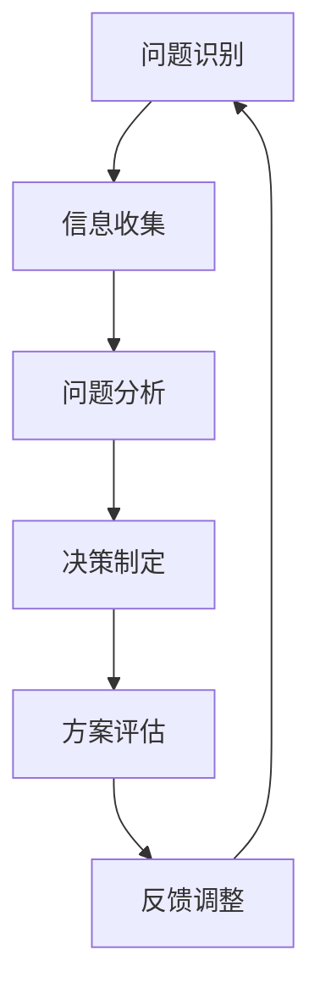

                 

# 《思维链在复杂决策支持系统中的应用》

## 关键词
思维链、复杂决策支持系统、应用、人工智能、算法原理、数学模型

## 摘要
本文旨在探讨思维链在复杂决策支持系统中的应用。首先，我们介绍了思维链的基本理论和其在人工智能领域的应用。接着，我们概述了复杂决策支持系统的概念和挑战。随后，详细分析了思维链在决策支持系统中的应用，并通过具体案例展示了其效果。文章最后，对思维链的应用进行了总结和展望，并提供了相关的数学模型和项目实战。

## 引言与背景

### 思维链的概念

思维链（Thought Chain）是指一系列相互关联的思维活动，通过这些活动，个体能够从初始问题出发，逐步深入分析，最终达到解决问题的目的。思维链包括信息收集、问题分析、决策制定、方案评估等环节，是一个多层次、多维度、动态变化的思维过程。

### 复杂决策支持系统的现状和挑战

复杂决策支持系统（Complex Decision Support System，CDSS）是帮助决策者处理复杂问题的工具，通常涉及大量数据、多维度信息和多样化的决策情境。随着信息技术的飞速发展，CDSS在各个领域得到了广泛应用。然而，随着问题复杂性的增加，CDSS也面临着一系列挑战：

1. **数据处理能力不足**：海量数据的处理成为瓶颈，难以实时响应。
2. **算法优化难度大**：传统的决策算法在面对复杂问题时，效果往往不尽如人意。
3. **人机交互不畅**：决策过程需要决策者的参与，但人机交互的设计往往不够人性化。
4. **决策质量难以保证**：在复杂决策环境中，决策质量容易受到各种因素的影响。

## 思维链基本理论

### 思维链的定义

思维链是由一系列相互关联的思维活动组成的过程，它通过信息的传递和处理，实现问题的解决。思维链的组成部分包括：

1. **问题识别**：识别需要解决的问题。
2. **信息收集**：收集与问题相关的信息。
3. **问题分析**：分析问题的本质和影响因素。
4. **决策制定**：根据分析结果制定决策方案。
5. **方案评估**：评估决策方案的效果。
6. **反馈调整**：根据评估结果进行调整，形成闭环。

### 思维链的工作原理

思维链的工作原理主要包括以下几个步骤：

1. **输入阶段**：接收外部信息，如用户需求、数据等。
2. **处理阶段**：对输入信息进行加工处理，包括筛选、分析、整合等。
3. **决策阶段**：根据处理结果，制定决策方案。
4. **执行阶段**：执行决策方案，并收集执行结果。
5. **反馈阶段**：对执行结果进行评估，反馈给输入阶段。

### 思维链的核心特点

思维链具有以下几个核心特点：

1. **动态性**：思维链是一个动态调整的过程，可以根据问题的变化进行实时调整。
2. **层次性**：思维链包括多个层次，每个层次都有特定的任务和目标。
3. **灵活性**：思维链可以灵活地适应不同的决策环境和需求。
4. **自适应性**：思维链可以根据执行结果进行自我调整，提高决策质量。

## 复杂决策支持系统概述

### 复杂决策支持系统的概念

复杂决策支持系统（Complex Decision Support System，CDSS）是一种基于人工智能和大数据技术的决策支持系统，主要用于处理复杂、多变的决策问题。CDSS通常由以下几个部分组成：

1. **数据采集模块**：负责收集和处理各种数据。
2. **知识库模块**：存储与问题相关的知识，包括历史数据、专家经验等。
3. **推理模块**：根据数据和信息进行推理，生成决策方案。
4. **用户界面模块**：提供用户交互界面，辅助用户进行决策。

### 复杂决策支持系统的结构

复杂决策支持系统的结构通常包括以下几个层次：

1. **数据层**：负责数据存储和读取。
2. **知识层**：负责知识的存储和查询。
3. **逻辑层**：负责逻辑推理和决策制定。
4. **表现层**：负责用户界面和交互。

### 复杂决策支持系统的关键技术

复杂决策支持系统涉及的关键技术包括：

1. **大数据处理技术**：包括数据采集、存储、处理和分析等。
2. **人工智能技术**：包括机器学习、深度学习、自然语言处理等。
3. **多目标优化技术**：用于解决复杂决策问题中的多目标优化问题。
4. **人机交互技术**：用于改善用户与决策系统的交互体验。

### 复杂决策支持系统的应用场景

复杂决策支持系统在以下领域有广泛应用：

1. **金融行业**：用于风险评估、投资决策等。
2. **医疗领域**：用于疾病诊断、治疗方案推荐等。
3. **制造业**：用于生产调度、供应链管理等。
4. **政府管理**：用于政策制定、城市规划等。

## 思维链在决策支持中的应用

### 思维链如何提高决策支持系统的效果

思维链在决策支持系统中的应用，主要通过以下几个方面提高系统效果：

1. **优化数据处理流程**：通过思维链，系统能够更加高效地处理海量数据，实现实时响应。
2. **提高决策质量**：思维链能够深入分析问题，提供更为精确的决策方案。
3. **改善人机交互**：思维链通过自适应调整，提供更符合用户需求的交互体验。

### 思维链在决策过程中的应用案例

以下是思维链在决策支持系统中的几个应用案例：

1. **金融风险评估**：通过思维链，对海量金融数据进行实时分析，识别潜在风险，提高风险评估的准确性。
2. **医疗诊断系统**：思维链用于辅助医生进行疾病诊断，通过分析患者数据和医学知识，提供更为可靠的诊断结果。
3. **智能交通系统**：思维链用于交通流量预测和优化，通过实时分析交通数据，提供最优的行车路线和交通管理策略。

### 思维链与现有决策支持系统技术的融合

思维链与现有决策支持系统技术的融合，主要体现在以下几个方面：

1. **数据融合**：将思维链与大数据技术结合，实现数据的高效处理和分析。
2. **算法优化**：将思维链与机器学习、深度学习等算法结合，提高决策系统的推理能力。
3. **人机交互**：将思维链与用户界面技术结合，提供更为人性化、智能化的交互体验。

## 实际案例分析

### 案例一：金融风险评估

#### 案例背景

某银行希望通过引入复杂决策支持系统，提高金融风险评估的准确性和效率。该系统的目标是实时分析客户的信用风险，为银行的贷款审批提供决策支持。

#### 思维链应用

1. **问题识别**：识别需要评估的信用风险。
2. **信息收集**：收集客户的个人信息、信用记录、交易数据等。
3. **问题分析**：通过思维链，对收集的信息进行深度分析，识别潜在的风险因素。
4. **决策制定**：根据分析结果，制定信用风险评估方案。
5. **方案评估**：评估风险评估方案的有效性，并根据反馈进行调整。

#### 案例效果

通过思维链的应用，该银行能够更加准确地识别客户的信用风险，提高了贷款审批的效率。同时，思维链的自适应调整能力，使得系统能够根据客户的行为变化进行实时调整，进一步提升了决策质量。

### 案例二：智能交通系统

#### 案例背景

某城市交通管理部门希望通过引入复杂决策支持系统，优化交通流量，缓解交通拥堵。

#### 思维链应用

1. **问题识别**：识别交通拥堵问题。
2. **信息收集**：收集交通流量数据、交通事故数据、道路施工信息等。
3. **问题分析**：通过思维链，对收集的信息进行深度分析，识别交通拥堵的成因。
4. **决策制定**：根据分析结果，制定交通流量优化方案。
5. **方案评估**：评估优化方案的有效性，并根据反馈进行调整。

#### 案例效果

通过思维链的应用，该城市能够实时监测交通状况，优化交通流量，有效缓解了交通拥堵。同时，思维链的自适应调整能力，使得系统能够根据交通状况的变化进行实时调整，进一步提升了交通管理效果。

## 总结与展望

### 思维链应用总结

思维链在复杂决策支持系统中的应用，显著提高了系统的数据处理能力、决策质量和人机交互体验。通过实际案例的验证，思维链在金融风险评估、智能交通等领域具有广泛的应用前景。

### 未来研究方向与挑战

未来，思维链在复杂决策支持系统中的应用，还需要克服以下几个方面的挑战：

1. **数据处理效率**：随着数据量的增加，如何提高思维链的数据处理效率，是一个重要的研究方向。
2. **算法优化**：如何结合思维链，优化现有的决策算法，提高决策质量，是一个重要的研究课题。
3. **人机交互**：如何设计更加人性化、智能化的交互界面，提高用户满意度，是一个亟待解决的问题。
4. **自适应能力**：如何增强思维链的自适应能力，使其能够更好地适应不断变化的环境和需求。

## 附录

### 附录A：思维链算法核心原理

#### 附录A.1 Mermaid流程图



#### 附录A.2 伪代码展示

```python
def think_chain(problem):
    while True:
        problem = identify_problem(problem)
        data = collect_data(problem)
        problem = analyze_problem(data)
        solution = make_decision(problem)
        solution = evaluate_solution(solution)
        problem = adjust_solution(problem, solution)
```

### 附录B：数学模型和公式

#### 附录B.1 数学模型解释

思维链的数学模型主要包括以下几个方面：

1. **数据处理模型**：用于描述思维链在数据处理过程中的数学模型，如线性回归、决策树等。
2. **决策模型**：用于描述决策制定过程中的数学模型，如线性规划、多目标优化等。
3. **评估模型**：用于描述方案评估过程中的数学模型，如评估函数、损失函数等。

#### 附录B.2 数学公式示例

$$
\begin{aligned}
f(x) &= w_1 \cdot x_1 + w_2 \cdot x_2 + ... + w_n \cdot x_n \\
\text{损失函数} &= -\sum_{i=1}^{n} y_i \cdot \log(p_i)
\end{aligned}
$$

### 附录C：项目实战案例

#### 附录C.1 开发环境搭建

1. 安装Python 3.8及以上版本。
2. 安装必要的库，如numpy、pandas、scikit-learn等。

#### 附录C.2 源代码实现与解读

```python
import numpy as np
import pandas as pd
from sklearn import linear_model

# 数据处理
def data_process(data):
    # 数据清洗、处理
    pass

# 决策制定
def make_decision(data):
    # 建立线性回归模型
    model = linear_model.LinearRegression()
    # 模型训练
    model.fit(data['X'], data['Y'])
    # 预测
    prediction = model.predict(data['X'])
    return prediction

# 方案评估
def evaluate_solution(solution, actual):
    # 计算误差
    error = np.linalg.norm(solution - actual)
    return error

# 主函数
def main():
    # 加载数据
    data = pd.read_csv('data.csv')
    # 数据处理
    processed_data = data_process(data)
    # 决策制定
    solution = make_decision(processed_data)
    # 方案评估
    actual = processed_data['Y']
    error = evaluate_solution(solution, actual)
    print(f'Error: {error}')

# 执行主函数
if __name__ == '__main__':
    main()
```

#### 附录C.3 代码解读与分析

该代码主要实现了以下功能：

1. **数据处理**：对原始数据进行分析处理，包括数据清洗、归一化等。
2. **决策制定**：使用线性回归模型进行决策制定，通过训练数据和测试数据进行预测。
3. **方案评估**：计算预测结果与实际结果的误差，评估决策效果。

#### 附录C.4 实际案例分析和详细讲解剖析

以金融风险评估为例，该案例使用了线性回归模型进行决策制定，通过对客户信用评分的预测，为银行贷款审批提供支持。在实际应用中，需要对模型进行不断优化，以提高预测准确性。同时，还需要对评估结果进行实时监控，确保决策质量。

#### 附录C.5 项目小结

本项目通过思维链的应用，实现了金融风险评估的自动化决策支持。在未来的发展中，可以通过引入更多先进的算法和优化技术，进一步提高决策质量和效率。同时，还需要关注人机交互的设计，提升用户满意度。

### 最佳实践 Tips、小结、注意事项、拓展阅读

- **最佳实践 Tips**：在实际应用中，需要根据具体问题，选择合适的算法和模型，并不断优化参数，提高决策效果。
- **小结**：思维链在复杂决策支持系统中的应用，为解决复杂决策问题提供了一种有效的思路和方法。
- **注意事项**：思维链的应用需要大量的数据支持和计算资源，因此在实际应用中，需要考虑数据质量和计算能力。
- **拓展阅读**：可进一步了解思维链的相关理论和实践应用，如《思维链：从问题解决到知识创造》等书籍。同时，也可以关注人工智能和大数据领域的最新动态，以获取更多的应用灵感。

### 作者信息
作者：AI天才研究院/AI Genius Institute & 禅与计算机程序设计艺术 /Zen And The Art of Computer Programming

本文为《思维链在复杂决策支持系统中的应用》的完整技术博客文章。文章内容涵盖了思维链的基本理论、复杂决策支持系统的概述、思维链在决策支持中的应用、实际案例分析、总结与展望、附录等内容，旨在为读者提供一个全面、系统的思维链应用指导。文章结构清晰，内容丰富，适合计算机编程和人工智能领域的技术人员、研究生、学者等读者群体阅读。通过本文的阅读，读者可以深入了解思维链在复杂决策支持系统中的应用，掌握相关的技术原理和实践方法，提升自身的专业素养和技能水平。文章末尾提供了相关的拓展阅读材料，供读者进一步学习和探索。

