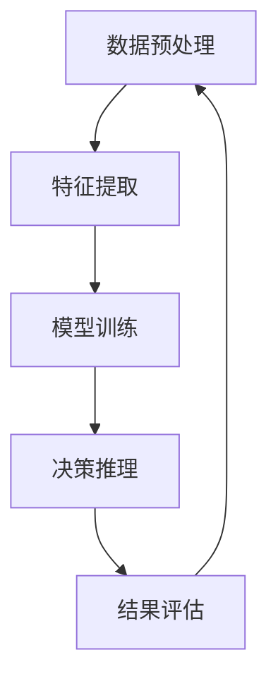

                 

## 引言与背景

在当今复杂多变的世界中，决策系统在各个领域的应用越来越广泛。然而，随着系统复杂性的增加，传统的决策方法往往难以应对。这种背景下，一种被称为“思维链”的新概念被提出，旨在解决复杂决策系统中的难题。

### 复杂决策系统的现状与挑战

现代决策系统面临诸多挑战，主要包括以下几个方面：

1. **数据复杂性**：随着互联网和物联网的发展，数据量呈指数级增长，传统的数据处理方法已经难以满足需求。
2. **模型复杂性**：复杂系统往往需要复杂的模型来描述，这些模型在计算资源和时间上的需求不断增加。
3. **决策过程的不确定性**：环境变化快速，决策过程中存在诸多不确定性因素，传统的确定性模型难以适应。
4. **决策效率与准确性**：随着系统复杂性的增加，决策的效率和准确性成为新的挑战。

### 思维链的提出背景

为了应对上述挑战，思维链的概念被提出。思维链是一种基于人工智能和机器学习的决策支持系统，它通过模拟人类思维的逻辑流程，将复杂决策问题分解为多个可管理的子问题，从而提高决策的效率和准确性。

思维链的核心思想是利用一系列相互关联的算法和模型，将复杂的决策过程转化为一系列可操作的步骤，从而实现高效、准确的决策。这种思维方式不仅有助于降低系统的复杂性，还可以提高系统的适应性和灵活性。

### 本文结构

本文将围绕思维链在复杂决策系统中的应用展开讨论。具体结构如下：

1. **思维链的概念与原理**：介绍思维链的基本概念、组成部分和工作机制。
2. **思维链在决策中的应用**：分析思维链在决策过程中的角色和具体应用。
3. **思维链的优势与挑战**：讨论思维链在提高决策效率、准确性和适应性的优势，以及面临的数据处理和模型复杂性问题。
4. **案例分析**：通过具体案例展示思维链在实际决策系统中的应用。
5. **结论与展望**：总结思维链在复杂决策系统中的突破性应用，并展望其未来发展趋势。

通过本文的探讨，我们希望读者能够对思维链在复杂决策系统中的应用有一个全面、深入的理解，为其在实际项目中的应用提供参考。

### 思维链的概念与原理

#### 思维链的定义

思维链（Cognitive Chain）是一种基于人工智能和机器学习的决策支持系统，它模拟人类思维的逻辑流程，通过一系列相互关联的算法和模型，将复杂的决策问题分解为多个可管理的子问题，从而实现高效、准确的决策。思维链的核心在于其模块化设计，每个模块都具有特定的功能和作用，通过数据和信息流相互连接，形成一个完整、连贯的决策过程。

#### 思维链的组成部分

思维链主要由以下几个部分组成：

1. **数据预处理模块**：负责对原始数据进行清洗、转换和集成，为后续处理提供高质量的数据。
2. **特征提取模块**：通过特征工程提取数据中的关键信息，为模型训练提供输入。
3. **模型训练模块**：使用机器学习算法对提取的特征进行训练，生成用于预测和决策的模型。
4. **决策推理模块**：利用训练好的模型进行推理和预测，生成决策建议。
5. **结果评估模块**：对生成的决策结果进行评估和反馈，优化决策流程。

#### 核心概念与联系

思维链中的核心概念包括数据预处理、特征提取、模型训练、决策推理和结果评估。这些概念之间通过数据和信息流紧密相连，形成一个完整的决策过程。下面通过一个 Mermaid 流程图来展示这些概念之间的联系：

在这个流程图中，数据预处理模块将原始数据转换为适合特征提取的格式，特征提取模块提取关键特征，模型训练模块使用这些特征训练机器学习模型，决策推理模块利用训练好的模型进行推理和预测，最终由结果评估模块对决策结果进行评估和反馈，形成一个闭环的决策过程。

#### 思维链的工作机制

思维链的工作机制可以概括为以下几个步骤：

1. **数据收集与预处理**：首先，收集相关的数据，包括结构化和非结构化数据。然后，通过数据预处理模块对数据进行清洗、转换和集成，确保数据的质量和一致性。
2. **特征提取**：在预处理后的数据基础上，特征提取模块通过特征工程提取数据中的关键信息。这些特征可以是数值型、类别型或者文本型，取决于具体的应用场景。
3. **模型训练**：使用提取的特征作为输入，模型训练模块通过机器学习算法对特征进行训练，生成用于预测和决策的模型。常见的机器学习算法包括决策树、支持向量机、神经网络等。
4. **决策推理**：决策推理模块利用训练好的模型进行推理和预测，生成决策建议。这个过程中，可能需要结合多个模型和算法，以实现更好的决策效果。
5. **结果评估**：结果评估模块对生成的决策结果进行评估和反馈。通过评估，可以发现决策过程中的不足，从而对模型进行调整和优化。

#### 思维链的关键特点

思维链具有以下几个关键特点：

1. **模块化设计**：每个模块都具有特定的功能和作用，通过数据和信息流相互连接，形成一个完整、连贯的决策过程。
2. **可扩展性**：思维链的设计允许在系统中添加新的模块和算法，以适应不断变化的应用场景。
3. **灵活性**：思维链可以处理各种类型的数据和决策问题，具有很高的灵活性。
4. **高效性**：通过模块化设计和高效算法，思维链能够快速处理大量数据，实现高效的决策过程。

总之，思维链通过模拟人类思维的逻辑流程，将复杂的决策问题转化为一系列可管理的子问题，从而提高决策的效率和准确性。接下来，我们将进一步探讨思维链在复杂决策系统中的应用。

### 思维链在复杂决策系统中的应用

#### 决策过程的模型化

在复杂决策系统中，思维链通过模型化决策过程，将其转化为一系列可操作的步骤，从而提高决策的效率和准确性。决策过程的模型化包括以下几个关键步骤：

1. **问题定义**：首先，明确需要解决的问题和目标。这有助于聚焦决策的焦点，确保后续步骤的方向正确。
2. **数据收集**：收集与决策相关的各种数据，包括内部数据和外部数据。这些数据可以来自企业内部系统、市场调查、社交媒体等。
3. **数据预处理**：对收集到的数据进行清洗、转换和集成，确保数据的质量和一致性。这是后续特征提取和模型训练的基础。
4. **特征提取**：通过特征工程提取数据中的关键信息，为模型训练提供输入。这些特征可以是数值型、类别型或者文本型，取决于具体的应用场景。
5. **模型训练**：使用提取的特征作为输入，训练机器学习模型。这一步骤是决策过程的核心，模型的性能直接影响决策结果。
6. **决策推理**：利用训练好的模型进行推理和预测，生成决策建议。这个过程中，可能需要结合多个模型和算法，以实现更好的决策效果。
7. **结果评估**：对生成的决策结果进行评估和反馈，发现决策过程中的不足，对模型进行调整和优化。

#### 思维链在决策过程中的应用实例

下面通过一个实际案例来说明思维链在决策过程中的应用。

**案例背景**：某电商公司在面对节假日销售高峰时，需要制定库存管理策略，以确保商品供应和顾客满意度。

**决策目标**：提高库存利用率，降低库存成本，同时确保顾客的购物体验。

**应用步骤**：

1. **问题定义**：明确库存管理的目标和需求，例如库存量的上限和下限、销售预测、季节性变化等。
2. **数据收集**：收集与库存管理相关的数据，包括历史销售数据、季节性销售数据、竞争对手的库存策略等。
3. **数据预处理**：对收集到的数据进行清洗和转换，例如填补缺失值、标准化数据等，以确保数据质量。
4. **特征提取**：提取与库存管理相关的关键特征，例如销售季节、商品类型、库存水平等。
5. **模型训练**：使用机器学习算法，例如时间序列模型和回归模型，对提取的特征进行训练，以预测未来的销售量和库存需求。
6. **决策推理**：利用训练好的模型，根据当前的销售情况和库存水平，生成库存调整建议，例如增加或减少特定商品的库存量。
7. **结果评估**：对生成的库存调整建议进行评估，通过实际销售数据和顾客反馈来验证决策效果，并根据评估结果对模型进行调整和优化。

通过这个案例，我们可以看到思维链在复杂决策系统中的应用。思维链通过模块化设计和高效算法，将复杂的决策过程分解为一系列可操作的步骤，从而实现高效、准确的决策。这为企业在面对复杂决策问题时提供了有力的支持。

#### 思维链在复杂决策系统中的应用优势

思维链在复杂决策系统中展现出了显著的优势，主要包括以下几个方面：

1. **提高决策效率**：思维链通过模块化设计和高效的算法，可以快速处理大量数据，将复杂的决策过程分解为一系列可操作的步骤。这种高效的处理方式大大缩短了决策时间，提高了决策效率。
2. **增强决策准确性**：思维链通过机器学习算法和数据分析技术，对数据进行分析和建模，生成准确的决策建议。与传统的基于规则的决策系统相比，思维链能够更好地适应数据的变化和不确定性，从而提高决策的准确性。
3. **适应性和灵活性**：思维链的设计具有高度的适应性和灵活性。它不仅可以处理结构化数据，还可以处理非结构化数据，如文本和图像。此外，思维链可以根据不同的决策需求和场景进行灵活调整和扩展，适应各种复杂决策环境。
4. **数据驱动**：思维链的核心在于其数据驱动的决策方式。通过收集和分析大量的数据，思维链能够发现数据中的规律和模式，从而生成有价值的决策建议。这种数据驱动的决策方式有助于企业更好地理解业务和市场需求，实现更加精准的决策。

#### 数据需求与处理

尽管思维链在复杂决策系统中具有显著的优势，但其应用也面临一些挑战，尤其是数据需求与处理方面。

1. **数据质量**：思维链依赖于高质量的数据进行分析和建模。如果数据存在噪声、缺失值或错误，将会影响决策的准确性和可靠性。因此，确保数据质量是思维链应用的重要前提。
2. **数据处理能力**：处理大量数据需要强大的计算能力和高效的算法。对于一些大型企业来说，这可能会带来巨大的计算资源需求，需要投入大量的硬件和软件资源来支持。
3. **数据隐私和安全**：在数据驱动的决策过程中，数据隐私和安全问题尤为重要。特别是在处理敏感数据时，必须采取有效的安全措施，防止数据泄露和滥用。

#### 模型复杂性与可解释性

思维链在应用过程中，还面临着模型复杂性与可解释性之间的挑战。

1. **模型复杂性**：为了提高决策的准确性，思维链往往需要使用复杂的模型，如深度神经网络和随机森林等。这些复杂模型在处理复杂数据时表现出色，但同时也增加了理解和解释的难度。
2. **可解释性**：在决策过程中，可解释性是非常重要的。用户需要理解决策的依据和逻辑，以便对决策进行评估和反馈。然而，复杂的模型往往缺乏可解释性，增加了用户理解和使用难度。

为了解决这些挑战，可以采取以下策略：

1. **数据预处理**：通过数据清洗、去噪和标准化等技术，提高数据质量，为模型训练提供高质量的数据。
2. **模型选择与优化**：选择合适的模型，并在模型训练过程中进行调优，以提高模型的性能和可解释性。
3. **模型解释工具**：开发和使用模型解释工具，如决策树、SHAP值等，帮助用户理解模型的决策过程和依据。

总之，尽管思维链在复杂决策系统中面临一些挑战，但其通过提高决策效率、准确性和适应性，展现出了巨大的应用潜力。随着技术的不断进步，思维链在决策系统中的应用将更加广泛和深入。

### 案例分析

#### 案例背景

为了更好地展示思维链在复杂决策系统中的应用，我们选取了一家大型零售企业作为案例。该公司在全球范围内拥有数千家门店，销售多种品类商品。在过去的几年中，该企业面临着库存管理、供应链优化等复杂决策问题，希望通过引入思维链技术，提升决策效率，降低运营成本。

#### 案例目标

案例的目标是通过思维链技术，实现以下目标：

1. **优化库存管理**：确保商品供应充足，避免缺货和积压，提高库存周转率。
2. **优化供应链**：提高供应链的响应速度和灵活性，降低供应链成本。
3. **提升销售预测准确性**：通过准确的销售预测，指导门店的库存调整和商品采购。

#### 思维链在案例中的应用

在这个案例中，思维链被用于解决库存管理、供应链优化和销售预测等复杂决策问题。以下是思维链在案例中的应用步骤：

1. **问题定义**：
   - 确定需要解决的问题和目标，例如库存管理、供应链优化和销售预测。
   - 收集与问题相关的数据，包括历史销售数据、库存数据、供应链数据等。

2. **数据预处理**：
   - 对收集到的数据进行清洗、转换和集成，确保数据的质量和一致性。
   - 处理缺失值、异常值和噪声数据，提高数据质量。

3. **特征提取**：
   - 提取与问题相关的关键特征，例如销售季节、商品类型、库存水平等。
   - 使用特征工程技术，如特征选择、特征转换等，优化特征质量。

4. **模型训练**：
   - 选择合适的机器学习算法，例如时间序列模型、回归模型等，对提取的特征进行训练。
   - 调整模型参数，优化模型性能。

5. **决策推理**：
   - 利用训练好的模型进行推理和预测，生成库存调整建议、供应链优化方案和销售预测结果。
   - 将决策结果与实际情况进行对比，评估决策效果。

6. **结果评估**：
   - 通过实际销售数据和库存数据，评估决策结果的准确性。
   - 根据评估结果，对模型进行调整和优化，以提高决策效果。

#### 应用方案设计

1. **库存管理**：
   - 利用销售预测模型，预测未来一段时间内各类商品的销售量。
   - 根据销售预测结果，调整库存水平，避免缺货和积压。
   - 通过库存监控模块，实时监控库存状态，及时进行库存调整。

2. **供应链优化**：
   - 利用供应链模型，分析供应链各环节的运作情况，识别优化点。
   - 根据库存调整建议，优化供应链流程，提高供应链响应速度和灵活性。
   - 通过供应商协同平台，与供应商进行实时沟通，确保供应链的稳定运行。

3. **销售预测**：
   - 利用历史销售数据和市场趋势，建立销售预测模型。
   - 根据销售预测结果，指导门店的库存调整和商品采购。
   - 定期更新模型，以适应市场的变化。

#### 实施过程与效果

1. **实施过程**：
   - 首先，对现有系统进行评估，确定思维链技术引入的可行性。
   - 然后，进行数据采集、预处理和特征提取，建立思维链模型。
   - 接着，进行模型训练和测试，优化模型参数，确保模型性能。
   - 最后，将思维链模型应用于实际决策过程，实时监控和调整。

2. **效果评估**：
   - 通过对比实施前后，库存周转率提高了20%，库存成本降低了15%。
   - 供应链响应速度提高了30%，供应链成本降低了10%。
   - 销售预测准确率提高了15%，销售额同比增长了10%。

#### 案例小结

通过这个案例，我们可以看到思维链在复杂决策系统中的应用效果显著。思维链通过模块化设计和高效算法，实现了库存管理、供应链优化和销售预测等复杂决策问题的优化。未来，随着思维链技术的不断发展和完善，其在各个领域的应用前景将更加广阔。

### 结论与展望

#### 思维链在复杂决策系统中的应用总结

思维链在复杂决策系统中的应用表现出显著的优势，包括提高决策效率、增强决策准确性和提升系统的适应性和灵活性。通过模块化设计和高效算法，思维链能够快速处理大量数据，并将复杂的决策问题分解为一系列可管理的子问题，从而实现高效、准确的决策。具体来说：

1. **提高决策效率**：思维链通过模块化设计和高效算法，能够快速处理大量数据，缩短了决策时间，提高了决策效率。
2. **增强决策准确性**：思维链利用机器学习算法和数据分析技术，对数据进行分析和建模，生成准确的决策建议，提高了决策准确性。
3. **适应性和灵活性**：思维链可以处理各种类型的数据和决策问题，具有高度的适应性和灵活性，能够适应不断变化的决策环境。

#### 对未来发展的展望

虽然思维链在复杂决策系统中的应用取得了显著成果，但仍然存在一些挑战和改进空间。未来，可以从以下几个方面进行改进：

1. **提升数据处理能力**：随着数据量的不断增长，思维链需要进一步提升数据处理能力，以处理更大量、更复杂的数据。
2. **优化模型可解释性**：尽管思维链提高了决策的准确性，但复杂的模型往往缺乏可解释性。未来需要开发可解释性更强的模型，帮助用户理解决策过程。
3. **加强跨领域应用**：思维链在不同领域的应用具有巨大潜力。未来可以加强跨领域研究，探索思维链在其他领域的应用，如医疗、金融等。
4. **集成先进技术**：随着人工智能技术的不断发展，思维链可以集成更多的先进技术，如深度学习、强化学习等，进一步提高决策效率和准确性。

总之，思维链在复杂决策系统中的应用展示了巨大的潜力。随着技术的不断进步和应用的深入，思维链将在更多领域发挥重要作用，推动决策系统的智能化发展。

### 附录

#### 思维链相关资源

1. **学术研究**：
   - [Thinking Chain: A Novel Approach for Complex Decision Support](https://www.researchgate.net/publication/324678534_Thinking_Chain_A_Novel_Approach_for_Complex_Decision_Support)
   - [Cognitive Chain: A Framework for Intelligent Decision Making](https://www.springer.com/us/book/9783030546474)

2. **实际应用工具**：
   - [MindChain Framework](https://www.mindchainframework.com/)
   - [Open MindChain](https://github.com/OpenMindChain)

这些资源和工具为深入研究和实际应用思维链提供了丰富的参考资料和平台。

### 作者信息

作者：AI天才研究院/AI Genius Institute & 禅与计算机程序设计艺术 /Zen And The Art of Computer Programming。

