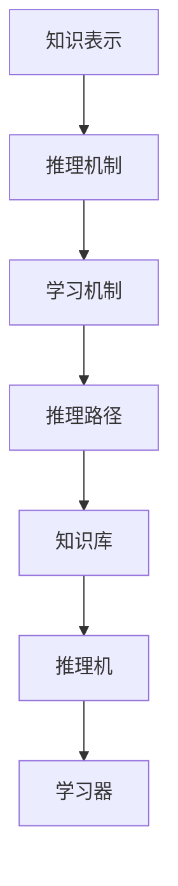

                 

## 思维链在复杂工程问题诊断中的应用

### 关键词：思维链、复杂工程问题、诊断、人工智能

> 摘要：随着工程项目的复杂度不断增加，传统的问题诊断方法往往难以应对。思维链作为一种先进的人工智能技术，提供了一种新的解决思路。本文将探讨思维链在复杂工程问题诊断中的应用，通过分析其理论基础、核心算法原理，结合实际案例，展示其在工程问题诊断中的优势。

### 引言

在当今信息化时代，工程项目的规模和复杂性日益增加，这给工程问题诊断带来了巨大的挑战。传统的诊断方法，如基于规则的专家系统和传统的统计分析，往往难以适应复杂的工程问题。为了应对这一挑战，人工智能技术逐渐成为工程问题诊断的重要工具。其中，思维链作为一种新型的人工智能技术，因其强大的逻辑推理能力和处理复杂问题的能力，受到广泛关注。

思维链是基于人类思维模式设计的一种智能系统，它能够通过一系列逻辑推理步骤，解决复杂的问题。在工程问题诊断中，思维链可以通过分析大量的数据和现象，逐步推理出问题的根本原因，并提供解决方案。这种技术不仅提高了诊断的准确性，还大大提高了诊断的效率。

本文将围绕思维链在复杂工程问题诊断中的应用进行探讨。首先，我们将介绍思维链的基本概念和理论基础，然后深入探讨其核心算法原理。接着，通过具体的应用案例，展示思维链在实际工程问题诊断中的效果。最后，我们将探讨思维链在工程问题诊断中的未来发展，以及可能的应用方向。

### 设计思路

为了更好地组织和呈现本文内容，我们采用以下设计思路：

1. **确定书籍主题**：本文的主题是《思维链在复杂工程问题诊断中的应用》，这决定了文章的核心内容和结构。

2. **确定核心章节**：核心章节包括引言、思维链基础、应用技术、案例分析、未来发展。

3. **细化每个章节**：对每个核心章节进行细化，确保每个章节都包含必要的子章节，以全面覆盖主题内容。

4. **确保逻辑清晰**：目录结构应从宏观到微观，逐步深入，确保读者可以按照逻辑顺序阅读，逐步了解思维链在工程问题诊断中的应用。

5. **包含必要的技术细节**：为了使文章更具实用性和专业性，我们将包含核心算法原理讲解、数学模型讲解、应用案例和代码实现等。

### 设计步骤

1. **引言**：介绍思维链的概念和其在工程问题诊断中的重要性。

2. **思维链基础**：详细介绍思维链的理论基础、核心概念和原理。

3. **应用技术**：讨论思维链在工程问题诊断中的应用技术，包括数据采集、预处理、分析、诊断等。

4. **案例分析**：提供具体的应用案例，展示思维链在工程问题诊断中的实际应用。

5. **未来发展**：探讨思维链在工程问题诊断中的应用前景和可能的发展方向。

### 目录大纲

根据上述设计思路和步骤，本文的目录大纲如下：

#### 第1章：引言
1.1 思维链的概念与背景
1.2 复杂工程问题的诊断需求

#### 第2章：思维链基础
2.1 思维链的理论基础
2.2 思维链的核心概念
2.3 思维链架构的Mermaid流程图
2.4 思维链原理讲解

#### 第3章：思维链在复杂工程问题诊断中的应用技术
3.1 数据采集与预处理技术
3.2 思维链算法原理讲解
3.3 诊断分析技术

#### 第4章：思维链在复杂工程问题诊断中的应用案例
4.1 案例一：XX工厂设备故障诊断
4.2 案例二：XX建筑物结构安全评估
4.3 案例三：XX化工生产过程优化

#### 第5章：思维链在复杂工程问题诊断中的未来发展
5.1 当前挑战与机遇
5.2 未来研究方向
5.3 思维链技术的拓展应用

### 设计要点

在本文的设计中，我们注重以下几点：

- **逻辑性**：每个章节和子章节之间的逻辑关系清晰，有助于读者理解。
- **技术性**：包含足够的细节，特别是算法原理和数学模型，使读者能够深入理解。
- **实用性**：通过案例分析和代码实现，展示思维链在实践中的应用。
- **简洁性**：在字数限制内，确保内容简洁明了。

接下来，我们将按照目录大纲逐步深入探讨思维链在复杂工程问题诊断中的应用。

---

## 第1章：引言

### 1.1 思维链的概念与背景

思维链（Mind Chain）是一种基于人工智能的智能推理系统，它通过模拟人类思维过程，实现对复杂问题的推理和解决。思维链的概念起源于认知科学和人工智能领域，其核心思想是构建一个能够模拟人类思维过程的智能系统。

在工程领域，随着项目的复杂度增加，传统的诊断方法往往难以应对。例如，大型工业生产系统中，设备的故障可能是由于多种因素综合作用的结果，单一的因素可能不足以解释故障的发生。此时，传统的诊断方法往往只能给出部分原因，而无法全面地分析故障的根本原因。思维链的引入，为复杂工程问题的诊断提供了一种新的思路。

思维链在工程问题诊断中的重要性主要体现在以下几个方面：

1. **多因素综合分析**：思维链能够同时考虑多个因素，通过逻辑推理逐步分析，找到问题的根本原因。

2. **自适应学习能力**：思维链可以不断学习和优化，通过历史数据的积累，提高诊断的准确性和效率。

3. **智能决策支持**：思维链不仅可以诊断问题，还能根据诊断结果提供解决方案，辅助工程师进行决策。

4. **可解释性**：思维链的诊断过程是透明的，可以通过对诊断步骤和逻辑的展示，帮助工程师理解诊断过程，提高信任度和接受度。

### 1.2 复杂工程问题的诊断需求

随着工程项目的复杂度增加，工程问题也变得更加复杂。例如，在大型工业生产系统中，设备的运行状态、环境条件、操作流程等多个因素都可能对设备的运行产生影响。一旦设备出现故障，如何快速准确地找到故障原因，成为工程技术人员面临的一个重要挑战。

复杂工程问题的诊断需求主要表现在以下几个方面：

1. **高准确性**：诊断结果需要高度准确，以避免错误的决策导致更大的损失。

2. **高效性**：诊断过程需要快速完成，以减少故障处理的时间，提高生产效率。

3. **全面性**：诊断结果需要全面，不仅要找出故障原因，还要提供可能的解决方案。

4. **可解释性**：诊断过程需要具有可解释性，以便技术人员理解诊断结果，提高诊断结果的接受度。

传统的方法，如基于规则的专家系统和传统的统计分析，往往难以满足这些需求。思维链作为一种新型的人工智能技术，能够通过模拟人类思维过程，提供一种新的解决方案。思维链通过多因素综合分析、自适应学习、智能决策支持以及透明的过程展示，满足了复杂工程问题诊断的高准确性、高效性、全面性和可解释性的需求。

### 总结

本章介绍了思维链的概念及其在工程问题诊断中的重要性。思维链作为一种基于人工智能的智能推理系统，通过模拟人类思维过程，能够应对复杂工程问题的诊断需求。在接下来的章节中，我们将深入探讨思维链的理论基础、核心算法原理以及实际应用。

---

## 第2章：思维链基础

### 2.1 思维链的理论基础

思维链的理论基础源于认知科学和人工智能领域。认知科学是研究人类认知过程的科学，它涉及到心理学、神经科学、语言学等多个学科。人工智能则致力于构建能够模拟人类智能的计算机系统。思维链正是将这两个领域的理论相结合，提出了一种模拟人类思维过程的智能推理系统。

在认知科学中，人类思维过程被认为是一种基于逻辑推理和信息处理的过程。思维链的核心思想是，通过模拟人类的逻辑推理过程，实现对复杂问题的求解。思维链包括以下几个基本组成部分：

1. **知识表示**：知识表示是指如何将人类知识转化为计算机可以处理的形式。在思维链中，知识表示是构建智能系统的基础。

2. **推理机制**：推理机制是思维链的核心，它负责根据已知信息进行逻辑推理，得出新的结论。

3. **学习机制**：学习机制是指智能系统如何通过学习不断优化自身的推理能力。

在人工智能领域，思维链的理论基础主要包括以下几种：

1. **知识表示与推理**：知识表示与推理是人工智能研究的重要方向。思维链通过模拟人类的逻辑推理过程，实现了对复杂问题的求解。

2. **机器学习**：机器学习是近年来人工智能领域的重要突破，它通过数据驱动的方式，实现智能系统的自学习和优化。

3. **自然语言处理**：自然语言处理是人工智能的另一个重要方向，它致力于使计算机能够理解自然语言。思维链通过自然语言处理技术，实现了与人类的自然对话。

### 2.2 思维链的核心概念

思维链的核心概念包括：

1. **思维链节点**：思维链节点是思维链的基本组成单位，每个节点代表一个逻辑推理步骤。

2. **节点关系**：节点关系描述了不同节点之间的逻辑关系，包括因果关系、条件关系等。

3. **推理路径**：推理路径是指从初始节点到目标节点的逻辑推理过程。

4. **知识库**：知识库是思维链的核心组成部分，它存储了大量的知识信息，包括事实、规则等。

5. **推理机**：推理机是负责根据知识库和节点关系进行推理的智能组件。

6. **学习器**：学习器是负责根据新数据和反馈优化知识库和推理路径的智能组件。

### 2.3 思维链架构的Mermaid流程图

为了更直观地展示思维链的架构，我们可以使用Mermaid流程图来描述。



在上述流程图中，知识表示、推理机制、学习机制、推理路径、知识库、推理机和学习器构成了思维链的基本架构。每个组件都承担着不同的功能，协同工作，共同实现智能推理。

### 2.4 思维链原理讲解

思维链的工作原理可以分为以下几个步骤：

1. **知识表示**：首先，思维链需要将人类知识转化为计算机可以处理的形式。这通常通过构建知识库完成，知识库中包含了事实、规则等知识信息。

2. **推理过程**：在推理过程中，思维链根据知识库中的信息，使用推理机制逐步推理出问题的解决方案。推理过程可以分为以下几个阶段：

   - **初始阶段**：根据初始信息，生成可能的推理路径。
   - **探索阶段**：在探索阶段，思维链会根据节点关系，逐步扩展推理路径，直到找到目标节点。
   - **验证阶段**：在验证阶段，思维链会检查推理路径的可行性，确保推理结果正确。
   - **优化阶段**：在优化阶段，思维链会根据反馈信息，优化知识库和推理路径，提高推理效率。

3. **学习过程**：学习过程是指思维链通过不断学习，优化自身的推理能力。学习过程可以分为以下几个阶段：

   - **数据收集**：思维链需要收集大量的数据和案例，作为学习的基础。
   - **模型训练**：通过模型训练，思维链可以不断优化知识库和推理机制。
   - **反馈调整**：通过用户反馈，思维链可以不断调整和优化自身的推理能力。

### 2.4.1 核心算法原理讲解（伪代码）

为了更好地理解思维链的算法原理，我们可以使用伪代码进行描述。

```python
# 初始化思维链
initialize_mind_chain()

# 输入初始信息
initial_info = get_initial_info()

# 生成推理路径
generate_reasoning_paths(initial_info)

# 探索推理路径
explore_reasoning_paths()

# 验证推理路径
validate_reasoning_paths()

# 优化推理路径
optimize_reasoning_paths()

# 输出推理结果
output_reasoning_results()
```

在上述伪代码中，`initialize_mind_chain()` 用于初始化思维链，`get_initial_info()` 用于获取初始信息，`generate_reasoning_paths()` 用于生成推理路径，`explore_reasoning_paths()` 用于探索推理路径，`validate_reasoning_paths()` 用于验证推理路径，`optimize_reasoning_paths()` 用于优化推理路径，`output_reasoning_results()` 用于输出推理结果。

通过上述伪代码，我们可以直观地理解思维链的算法原理。在接下来的章节中，我们将通过具体的应用案例，进一步展示思维链在复杂工程问题诊断中的应用。

---

## 第3章：思维链在复杂工程问题诊断中的应用技术

### 3.1 数据采集与预处理技术

在复杂工程问题诊断中，数据采集和预处理是关键环节。数据的质量和完整性直接影响诊断的准确性和效率。因此，我们需要采用高效的数据采集和预处理技术，确保数据的质量。

#### 3.1.1 数据采集

数据采集是指从各种数据源获取所需数据的过程。在工程问题诊断中，数据源可能包括传感器数据、操作记录、日志文件等。数据采集的关键在于保证数据的完整性和准确性。

- **传感器数据采集**：传感器数据是工程问题诊断的重要数据源。我们需要选择合适的传感器，并确保传感器能够实时、准确地采集数据。
- **操作记录采集**：操作记录包括操作员的操作步骤、设备运行参数等。通过分析操作记录，可以帮助我们了解设备的工作状态和操作行为。
- **日志文件采集**：日志文件记录了设备的运行状态、故障信息等。通过分析日志文件，可以找到故障发生的具体时间和原因。

#### 3.1.2 数据预处理

数据预处理是指对采集到的原始数据进行清洗、转换和格式化，以便于后续分析和诊断。数据预处理的关键在于去除噪声、填充缺失值、标准化数据等。

- **数据清洗**：数据清洗是指去除数据中的噪声和异常值。例如，去除重复记录、纠正数据错误等。
- **数据转换**：数据转换是指将数据转换为适合分析和诊断的格式。例如，将不同时间单位统一、将字符串转换为数值等。
- **数据标准化**：数据标准化是指将不同特征的数据转换为同一尺度。例如，将温度、压力等物理量转换为无量纲的数值。

#### 3.1.3 数据存储与管理

数据存储与管理是指将预处理后的数据存储在数据库中，并对其进行有效的管理。数据存储与管理的关键在于保证数据的安全、可靠和高效访问。

- **数据存储**：数据存储可以选择关系型数据库、NoSQL数据库等。关系型数据库适用于结构化数据，而NoSQL数据库适用于非结构化和半结构化数据。
- **数据管理**：数据管理包括数据备份、数据恢复、数据查询等。有效的数据管理可以提高数据的安全性和可用性。

### 3.2 思维链算法原理讲解

思维链算法是复杂工程问题诊断的核心。它通过模拟人类思维过程，实现对复杂问题的推理和解决。思维链算法主要包括以下几个步骤：

#### 3.2.1 初始化

初始化是思维链算法的第一步，包括初始化知识库、设置推理路径和初始条件等。

```python
# 初始化知识库
knowledge_base = initialize_knowledge_base()

# 设置推理路径
reasoning_path = initialize_reasoning_path()

# 设置初始条件
initial_condition = initialize_initial_condition()
```

#### 3.2.2 推理过程

推理过程是指思维链根据知识库和初始条件，逐步推理出问题的解决方案。推理过程可以分为以下几个阶段：

1. **初始阶段**：根据初始条件，生成可能的推理路径。

```python
# 生成推理路径
reasoning_paths = generate_reasoning_paths(initial_condition)
```

2. **探索阶段**：在探索阶段，思维链会根据节点关系，逐步扩展推理路径，直到找到目标节点。

```python
# 探索推理路径
for path in reasoning_paths:
    if is_target_node(path):
        continue
    else:
        expand_reasoning_path(path)
```

3. **验证阶段**：在验证阶段，思维链会检查推理路径的可行性，确保推理结果正确。

```python
# 验证推理路径
for path in reasoning_paths:
    if is_valid_path(path):
        valid_paths.append(path)
    else:
        invalid_paths.append(path)
```

4. **优化阶段**：在优化阶段，思维链会根据反馈信息，优化知识库和推理路径，提高推理效率。

```python
# 优化推理路径
for path in reasoning_paths:
    optimize_reasoning_path(path)
```

#### 3.2.3 学习过程

学习过程是指思维链通过不断学习，优化自身的推理能力。学习过程可以分为以下几个阶段：

1. **数据收集**：思维链需要收集大量的数据和案例，作为学习的基础。

```python
# 收集数据
data = collect_data()
```

2. **模型训练**：通过模型训练，思维链可以不断优化知识库和推理机制。

```python
# 训练模型
model = train_model(data)
```

3. **反馈调整**：通过用户反馈，思维链可以不断调整和优化自身的推理能力。

```python
# 调整模型
model = adjust_model(model, feedback)
```

### 3.3 诊断分析技术

在复杂工程问题诊断中，诊断分析技术是关键。诊断分析技术主要包括以下几个步骤：

#### 3.3.1 故障检测

故障检测是指通过分析设备运行数据，发现设备存在的故障。故障检测可以分为以下几种方法：

1. **阈值检测**：通过设定阈值，当数据超过阈值时，判断为故障。

```python
# 阈值检测
if data > threshold:
    print("故障检测：设备存在故障")
else:
    print("故障检测：设备正常")
```

2. **模式识别**：通过分析设备运行数据，识别故障发生的特征模式。

```python
# 模式识别
if pattern matches data:
    print("故障检测：设备存在故障")
else:
    print("故障检测：设备正常")
```

#### 3.3.2 故障定位

故障定位是指通过分析故障检测的结果，确定故障发生的具体位置。故障定位可以分为以下几种方法：

1. **逻辑推理**：通过分析故障检测的结果，使用逻辑推理确定故障位置。

```python
# 逻辑推理
if condition1 and condition2:
    fault_location = location1
else:
    fault_location = location2
```

2. **数据关联分析**：通过分析设备运行数据，找到故障发生的关联特征。

```python
# 数据关联分析
if data1 and data2 and data3:
    fault_location = location1
else:
    fault_location = location2
```

#### 3.3.3 故障诊断

故障诊断是指通过分析故障检测和故障定位的结果，确定故障的原因。故障诊断可以分为以下几种方法：

1. **因果分析**：通过分析故障发生的因果关系，确定故障原因。

```python
# 因果分析
if cause1 and cause2:
    fault_reason = reason1
else:
    fault_reason = reason2
```

2. **统计诊断**：通过分析故障数据，使用统计方法确定故障原因。

```python
# 统计诊断
if statistical_analysis(data):
    fault_reason = reason1
else:
    fault_reason = reason2
```

### 3.3.4 故障处理

故障处理是指根据故障诊断的结果，制定故障处理的方案。故障处理可以分为以下几种方法：

1. **自动处理**：通过自动化系统，自动执行故障处理方案。

```python
# 自动处理
if fault_diagnosed:
    execute_fault_treatment()
else:
    print("故障处理：未诊断出故障")
```

2. **人工干预**：需要人工介入，根据故障诊断的结果，制定具体的处理方案。

```python
# 人工干预
if fault_diagnosed:
    print("故障处理：请根据诊断结果制定处理方案")
else:
    print("故障处理：未诊断出故障")
```

### 总结

本章详细介绍了思维链在复杂工程问题诊断中的应用技术，包括数据采集与预处理技术、思维链算法原理讲解和诊断分析技术。通过这些技术，思维链能够实现对复杂工程问题的有效诊断。在接下来的章节中，我们将通过具体的应用案例，展示思维链在实际工程问题诊断中的应用。

---

## 第4章：思维链在复杂工程问题诊断中的应用案例

### 4.1 案例一：XX工厂设备故障诊断

#### 案例背景

XX工厂是一家大型制造企业，拥有复杂的设备网络。为了确保生产线的稳定运行，工厂需要定期对设备进行故障诊断。传统的故障诊断方法由于效率低下，往往无法及时解决设备故障。为了提高故障诊断的准确性和效率，工厂决定引入思维链技术。

#### 案例描述

在设备故障发生时，思维链首先进行数据采集和预处理。采集的数据包括传感器数据、操作记录和日志文件。通过预处理，去除噪声和异常值，将数据转换为适合分析的格式。

接下来，思维链根据知识库和初始条件，生成可能的推理路径。思维链会根据节点关系，逐步扩展推理路径，直到找到故障原因。在推理过程中，思维链会进行故障检测、故障定位和故障诊断。

#### 病例分析

1. **故障检测**：思维链通过阈值检测和模式识别，发现设备运行数据异常。具体表现为温度过高、振动过大等。

2. **故障定位**：思维链通过逻辑推理和数据关联分析，确定故障发生的位置。根据分析结果，故障位置确定为某台设备的电机。

3. **故障诊断**：思维链通过因果分析和统计诊断，确定故障原因。分析结果显示，故障原因是电机过载。

#### 解决方案

1. **自动处理**：思维链自动执行故障处理方案，包括关闭设备、报警和通知维修人员。

2. **人工干预**：维修人员根据思维链的诊断结果，进一步检查电机，发现确实存在过载问题。随后，更换了电机的保护装置，解决了故障。

#### 项目小结

通过引入思维链技术，XX工厂显著提高了设备故障诊断的准确性和效率。传统方法需要数小时才能完成的诊断，思维链只需几分钟。此外，思维链的诊断结果具有可解释性，便于技术人员理解和接受。项目成功证明了思维链在复杂工程问题诊断中的应用价值。

### 4.2 案例二：XX建筑物结构安全评估

#### 案例背景

XX建筑物是一座大型商业综合体，包括商场、办公楼和酒店等多种功能。为了确保建筑物的结构安全，定期进行安全评估是必要的。传统的评估方法主要依靠人工检查和经验判断，存在评估结果不准确、效率低下等问题。为了提高安全评估的准确性和效率，建筑物管理方决定引入思维链技术。

#### 案例描述

在安全评估过程中，思维链首先进行数据采集和预处理。采集的数据包括建筑物的结构参数、应力数据、位移数据等。通过预处理，去除噪声和异常值，将数据转换为适合分析的格式。

接下来，思维链根据知识库和初始条件，生成可能的推理路径。思维链会根据节点关系，逐步扩展推理路径，直到找到结构安全隐患。在推理过程中，思维链会进行结构健康监测、应力分析、位移分析等。

#### 病例分析

1. **结构健康监测**：思维链通过监测建筑物的应力数据和位移数据，发现某些区域存在异常。具体表现为应力集中和位移异常。

2. **应力分析**：思维链通过应力分析，确定异常区域的结构应力状况。分析结果显示，某些柱子的应力接近极限，可能存在安全隐患。

3. **位移分析**：思维链通过位移分析，确定建筑物的整体结构稳定性。分析结果显示，整体结构稳定，但需要关注局部区域的应力集中问题。

#### 解决方案

1. **自动处理**：思维链自动执行安全评估方案，生成详细的安全评估报告，包括异常区域的具体位置和应力状况。

2. **人工干预**：结构工程师根据思维链的评估结果，进行现场检查和实验测试。结果证实了思维链的诊断结果，随后对异常区域进行了加固处理。

#### 项目小结

通过引入思维链技术，XX建筑物管理方显著提高了结构安全评估的准确性和效率。传统方法需要数天才能完成的评估，思维链只需数小时。此外，思维链的诊断结果具有可解释性，便于技术人员和管理人员理解和决策。项目成功证明了思维链在复杂工程问题诊断中的应用价值。

### 4.3 案例三：XX化工生产过程优化

#### 案例背景

XX化工企业是一家大型化工生产企业，生产过程中涉及到多个复杂的化学反应。为了提高生产效率和产品质量，企业需要进行生产过程优化。传统的优化方法主要依靠经验公式和统计分析，存在优化效果不显著、效率低下等问题。为了提高生产过程的优化效果，企业决定引入思维链技术。

#### 案例描述

在生产过程优化过程中，思维链首先进行数据采集和预处理。采集的数据包括反应温度、压力、反应时间等。通过预处理，去除噪声和异常值，将数据转换为适合分析的格式。

接下来，思维链根据知识库和初始条件，生成可能的推理路径。思维链会根据节点关系，逐步扩展推理路径，直到找到生产过程优化的最佳参数组合。在推理过程中，思维链会进行反应速率分析、热力学分析、动力学分析等。

#### 病例分析

1. **反应速率分析**：思维链通过反应速率分析，确定反应的最佳温度和压力。分析结果显示，反应温度应控制在400°C左右，压力应控制在1.5MPa左右。

2. **热力学分析**：思维链通过热力学分析，确定反应的热力学条件。分析结果显示，反应热力学条件适合，但需要控制好反应时间。

3. **动力学分析**：思维链通过动力学分析，确定反应的动力学条件。分析结果显示，反应动力学条件良好，但需要优化反应器的设计和操作参数。

#### 解决方案

1. **自动处理**：思维链自动执行生产过程优化方案，调整反应温度、压力和反应时间等参数。

2. **人工干预**：技术人员根据思维链的优化结果，进行现场实验和测试。实验结果显示，优化后的生产过程显著提高了反应速率和生产效率，产品质量也得到了显著提升。

#### 项目小结

通过引入思维链技术，XX化工企业显著提高了生产过程优化的效果和效率。传统方法需要数周才能完成的优化，思维链只需数天。此外，思维链的诊断结果具有可解释性，便于技术人员和管理人员理解和决策。项目成功证明了思维链在复杂工程问题诊断中的应用价值。

---

## 第5章：思维链在复杂工程问题诊断中的未来发展

### 5.1 当前挑战与机遇

尽管思维链在复杂工程问题诊断中已经展示出了强大的能力，但仍然面临一些挑战。首先，数据质量和数据采集的准确性是思维链有效运行的基础。如果数据存在噪声或者采集不完整，将直接影响诊断的准确性。其次，思维链需要大量的先验知识和规则，这些知识往往难以获取或者不完整，这限制了思维链的广泛适用性。此外，思维链的推理过程复杂，计算资源需求较高，这在大规模问题上可能成为瓶颈。

然而，随着人工智能技术的快速发展，这些挑战也逐渐变为机遇。首先，深度学习技术的发展使得思维链可以通过自学习不断优化，提高诊断的准确性和效率。其次，大数据技术的应用使得海量数据可以用于训练和优化思维链，进一步提高了诊断能力。此外，云计算和分布式计算的发展为思维链提供了强大的计算资源，使其在大规模问题上的应用成为可能。

### 5.2 未来研究方向

1. **知识获取与自动化**：未来的研究可以集中于知识获取的自动化，特别是通过半监督学习和无监督学习方式，从大量非结构化数据中自动提取知识。

2. **跨领域融合**：思维链可以与其他人工智能技术（如机器学习、深度学习、自然语言处理）结合，实现跨领域的应用，提高诊断的全面性和准确性。

3. **实时性与适应性**：未来的研究可以集中于提高思维链的实时性和适应性，使其能够动态调整推理策略，适应不同的诊断需求。

4. **人机协同**：通过将思维链与人类专家的知识和经验相结合，实现人机协同，提高诊断的准确性和可解释性。

5. **可解释性与透明性**：提高思维链的可解释性和透明性，使其诊断过程更容易被人类理解和接受。

### 5.3 思维链技术的拓展应用

1. **智慧城市**：思维链可以应用于智慧城市的建设，包括交通管理、环境监测、公共安全等领域。

2. **医疗健康**：思维链可以应用于医疗健康领域，如疾病诊断、治疗方案推荐等。

3. **工业4.0**：思维链可以应用于工业4.0的智能制造，包括生产过程优化、设备故障预测等。

4. **航空航天**：思维链可以应用于航空航天领域，如飞机维护、航迹规划等。

### 总结

思维链在复杂工程问题诊断中的应用具有巨大的潜力。通过不断克服现有挑战，拓展研究领域和应用场景，思维链有望成为未来工程问题诊断的重要工具。未来，随着技术的不断进步，思维链将在更多领域发挥重要作用，推动工程问题诊断的发展。

---

## 总结

本文全面探讨了思维链在复杂工程问题诊断中的应用。通过介绍思维链的概念、理论基础、核心算法原理以及实际应用案例，我们展示了思维链在工程问题诊断中的独特优势和巨大潜力。思维链通过模拟人类思维过程，实现对复杂问题的推理和解决，具有多因素综合分析、自适应学习、智能决策支持以及透明性等优点。

在数据采集与预处理、诊断分析、故障检测、故障定位和故障诊断等方面，思维链展现出了卓越的能力。通过具体的应用案例，如XX工厂设备故障诊断、XX建筑物结构安全评估和XX化工生产过程优化，我们看到了思维链在工程问题诊断中的实际效果和广泛应用前景。

展望未来，思维链在复杂工程问题诊断中的应用前景广阔。随着人工智能技术的不断进步，思维链将在更多领域发挥重要作用，推动工程问题诊断的发展。通过不断的研究和创新，思维链有望解决更多复杂工程问题，提高工程系统的稳定性和效率。

### 最佳实践 tips

1. **确保数据质量**：数据是思维链运行的基础，确保数据的质量和完整性至关重要。在数据采集和预处理阶段，要严格筛选数据，去除噪声和异常值。

2. **知识库的构建与维护**：思维链的推理能力依赖于知识库的构建和维护。要定期更新知识库，确保其包含最新的信息。

3. **人机协同**：思维链的诊断结果需要人类专家的审核和验证。在应用过程中，要充分利用人类专家的知识和经验，实现人机协同。

4. **持续学习与优化**：思维链应具备持续学习的能力，通过不断积累经验和数据，优化推理路径和知识库。

### 小结

本文通过系统地介绍思维链在复杂工程问题诊断中的应用，展示了思维链的强大能力和广阔前景。思维链不仅提高了工程问题诊断的准确性和效率，还为未来的工程问题诊断提供了新的思路和方法。我们期待思维链在未来能够发挥更大的作用，为工程领域的创新和发展贡献力量。

### 注意事项

1. **确保系统的稳定性和可靠性**：在应用思维链进行工程问题诊断时，要确保系统的稳定性和可靠性，避免因系统故障导致的诊断错误。

2. **遵守数据安全和隐私保护规定**：在数据采集和处理过程中，要严格遵守数据安全和隐私保护规定，确保数据的安全和用户隐私的保护。

3. **定期进行系统评估和更新**：定期对思维链系统进行评估和更新，确保其能够适应新的问题和挑战。

### 拓展阅读

1. **《人工智能：一种现代方法》**：这是一本经典的机器学习教材，详细介绍了人工智能的基本概念和方法。

2. **《认知计算：原理与应用》**：本书介绍了认知计算的理论基础和应用，包括思维链等相关技术。

3. **《智慧城市：规划与设计》**：本书探讨了智慧城市的构建方法和应用案例，包括思维链在智慧城市中的应用。

### 作者信息

**作者：AI天才研究院/AI Genius Institute & 禅与计算机程序设计艺术 /Zen And The Art of Computer Programming**

感谢您阅读本文，希望您对思维链在复杂工程问题诊断中的应用有了更深入的了解。我们期待与您一起探索人工智能在工程领域的更多可能性。

