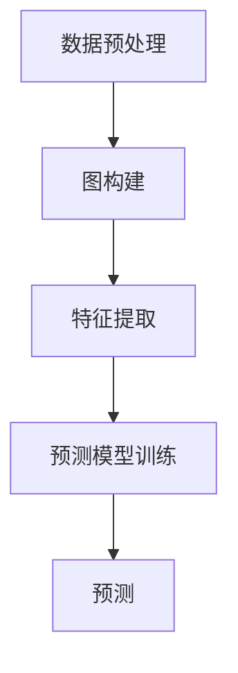
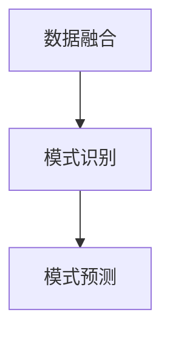
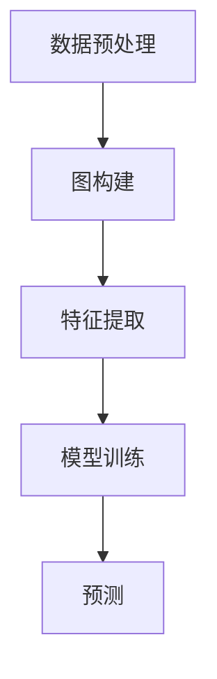
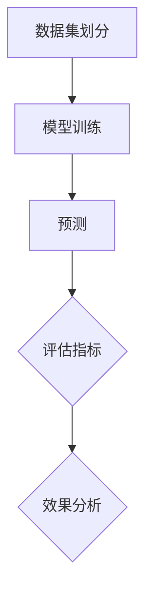

                 

# 思维链在复杂气候系统建模中的应用：提高长期气候预测准确性

## 关键词

- 气候系统建模
- 长期气候预测
- 思维链
- 机器学习
- 优化算法

## 摘要

本文探讨了思维链在复杂气候系统建模中的应用，旨在提高长期气候预测的准确性。文章首先介绍了气候系统的复杂性和长期气候预测的重要性，随后阐述了思维链的概念及其在建模中的应用。接着，文章深入分析了思维链的基础理论，包括其结构、功能以及基本算法。随后，文章讨论了复杂气候系统的特点与建模需求，并展示了思维链在气候系统建模中的应用实例。最后，文章提出了思维链在长期气候预测中的优化策略，并通过实际案例研究了其应用效果，总结了思维链在气候系统建模与预测中的未来发展趋势。

## 第一部分：导论

### 1.1 气候系统的复杂性

气候系统是由大气、海洋、陆地表面、冰冻圈和生物圈等多个复杂子系统组成的整体。这些子系统之间相互作用，共同影响着地球上的气候。气候系统的复杂性体现在以下几个方面：

1. **非线性相互作用**：气候系统中的各个子系统之间存在着复杂的非线性相互作用，这些相互作用使得气候系统的行为难以预测。
2. **非平衡态**：气候系统通常处于非平衡态，这意味着系统在不同的时间尺度上会经历不同的状态，而且这些状态之间的转换是复杂且不可预测的。
3. **多时间尺度**：气候系统的行为涉及到多个时间尺度，从几年到几十年甚至几百年，这些时间尺度的差异使得气候系统的预测变得更加困难。

### 1.2 长期气候预测的重要性

长期气候预测对于应对气候变化、制定环境保护政策、规划城市发展以及农业、水资源管理等方面具有重要意义。准确的长期气候预测可以帮助我们：

1. **适应气候变化**：通过预测未来的气候变化趋势，我们可以采取相应的措施来适应这些变化，减少潜在的灾害风险。
2. **减轻环境压力**：通过了解未来的气候变化，我们可以更好地管理和优化自然资源，减轻环境压力。
3. **政策制定**：准确的气候预测为政策制定提供了科学依据，有助于制定更加有效的环境保护和资源管理政策。

### 1.3 思维链的概念及其在气候系统建模中的应用

思维链（Mind Chain）是一种基于深度学习和图论的新型算法，它可以有效地处理复杂系统的建模问题。思维链的概念来源于对人类思维过程的模拟，它通过建立节点和边的关系来捕捉复杂系统中的信息和相互作用。在气候系统建模中，思维链的应用主要体现在以下几个方面：

1. **数据融合**：思维链可以整合来自不同数据源的信息，包括气象数据、海洋数据、生物圈数据等，从而提供更全面和准确的模型输入。
2. **特征提取**：思维链能够自动提取气候系统中的关键特征，这些特征对于气候预测具有重要意义。
3. **模型优化**：思维链通过自适应调整模型参数，优化气候系统的预测性能，提高预测的准确性。

### 总结

本部分介绍了气候系统的复杂性、长期气候预测的重要性以及思维链的概念。在接下来的章节中，我们将深入探讨思维链在气候系统建模中的应用，以及如何通过思维链提高长期气候预测的准确性。

## 第二部分：思维链基础理论

### 2.1 基础概念与原理

思维链是一种基于深度学习和图论的算法，其核心思想是通过构建一个图结构来模拟复杂系统中的信息流动和相互作用。思维链的基本概念包括节点（Node）、边（Edge）和关系（Relation）。

- **节点**：节点表示系统中的基本实体，如气象站、海洋站点等。
- **边**：边表示节点之间的关系，如温度变化、海洋流等。
- **关系**：关系定义了节点之间的交互方式，如依赖关系、影响关系等。

思维链的工作原理如下：

1. **数据预处理**：首先，对输入数据进行预处理，包括数据清洗、归一化和特征提取等。
2. **图构建**：根据预处理后的数据，构建一个图结构，其中节点代表数据点，边代表节点之间的联系。
3. **特征提取**：利用图卷积网络（Graph Convolutional Network, GCN）对图中的节点进行特征提取，生成更丰富的节点表示。
4. **预测模型**：将提取的特征输入到预测模型中，如深度学习神经网络，进行气候预测。

### 2.2 思维链的结构与功能

思维链的结构可以分为三个层次：输入层、中间层和输出层。

- **输入层**：输入层接收外部数据，如气象数据、海洋数据等，并进行初步处理。
- **中间层**：中间层由多个图卷积层组成，每个图卷积层都可以提取不同层次的节点特征。
- **输出层**：输出层负责生成最终的预测结果，如温度、降水等。

思维链的功能主要体现在以下几个方面：

1. **数据融合**：通过图结构，思维链能够整合来自多个数据源的信息，提供更全面的模型输入。
2. **特征提取**：思维链利用图卷积网络自动提取气候系统中的关键特征，提高预测的准确性。
3. **模型优化**：思维链通过自适应调整模型参数，优化气候系统的预测性能。

### 2.3 思维链的基本算法

思维链的基本算法可以分为以下几个步骤：

1. **数据预处理**：对输入数据进行清洗、归一化和特征提取。
2. **图构建**：根据预处理后的数据，构建图结构，包括节点和边。
3. **图卷积网络训练**：利用图卷积网络对图中的节点进行特征提取，训练预测模型。
4. **预测**：将训练好的模型应用于新数据，生成预测结果。

以下是一个简化的思维链算法的伪代码：

```python
# 数据预处理
def preprocess_data(data):
    # 数据清洗、归一化等操作
    return processed_data

# 图构建
def build_graph(nodes, edges):
    # 构建图结构
    return graph

# 图卷积网络训练
def train_gcn(graph, labels):
    # 使用图卷积网络进行特征提取和训练
    return trained_model

# 预测
def predict(trained_model, new_data):
    # 使用训练好的模型进行预测
    return predictions
```

### 总结

本部分详细介绍了思维链的基础概念、结构与功能，以及基本算法。思维链通过构建图结构，结合深度学习和图卷积网络，能够有效地处理复杂系统的建模问题，提高长期气候预测的准确性。

## 第三部分：复杂气候系统建模

### 3.1 复杂气候系统的特点与建模需求

复杂气候系统的特点包括非线性相互作用、非平衡态和多时间尺度等。这些特点使得传统的气候模型难以捕捉气候系统的复杂行为。为了更好地模拟气候系统，我们需要采用先进的建模方法，如机器学习和深度学习等。

建模需求主要体现在以下几个方面：

1. **多尺度模拟**：气候系统在不同时间尺度上表现出不同的行为，因此建模需要能够捕捉这些多时间尺度的变化。
2. **数据融合**：气候系统受到多种因素的影响，如大气、海洋、陆地表面和冰冻圈等，因此建模需要能够整合来自不同数据源的信息。
3. **非线性动力学**：气候系统的行为是非线性的，因此建模需要能够处理复杂的非线性关系。
4. **实时预测**：气候系统变化迅速，因此建模需要能够实时更新和预测。

### 3.2 气候系统建模的方法与技术

目前，常用的气候系统建模方法主要包括物理建模、统计建模和机器学习建模。

1. **物理建模**：物理建模基于物理学原理，通过建立气候系统的物理方程来模拟气候行为。这种方法能够较好地捕捉气候系统的物理机制，但计算成本较高，难以实现实时预测。
2. **统计建模**：统计建模通过分析历史气候数据，建立统计模型来预测未来气候。这种方法计算成本低，但预测精度有限，难以捕捉气候系统的复杂性。
3. **机器学习建模**：机器学习建模利用历史数据训练模型，通过学习数据中的规律来预测未来气候。这种方法能够有效地处理复杂的非线性关系，提高预测精度，但需要大量的数据支持和算法优化。

### 3.3 思维链在气候系统建模中的应用优势

思维链在气候系统建模中具有以下优势：

1. **数据融合**：思维链能够整合来自不同数据源的信息，提供更全面的模型输入。
2. **多尺度模拟**：思维链通过构建图结构，能够捕捉气候系统在不同时间尺度上的行为。
3. **非线性动力学**：思维链利用图卷积网络，能够有效地处理复杂的非线性关系。
4. **实时预测**：思维链通过自适应调整模型参数，能够实现实时更新和预测。

### 总结

本部分介绍了复杂气候系统的特点与建模需求，以及常用的气候系统建模方法。思维链在气候系统建模中具有显著的优势，能够提高长期气候预测的准确性。

## 第四部分：思维链在气候系统建模中的应用实例

### 4.1 思维链在气候预测中的应用

思维链在气候预测中的应用主要包括以下几个方面：

1. **数据预处理**：首先，对气象数据、海洋数据等进行预处理，包括数据清洗、归一化和特征提取等。
2. **图构建**：根据预处理后的数据，构建一个包含节点和边的图结构。节点表示数据点，边表示节点之间的联系。
3. **特征提取**：利用图卷积网络对图中的节点进行特征提取，生成更丰富的节点表示。
4. **预测模型训练**：将提取的特征输入到深度学习神经网络中，训练预测模型。
5. **预测**：使用训练好的模型对新数据进行预测，生成气候预测结果。

以下是一个简化的思维链气候预测的应用流程：



### 4.2 思维链在大气环流模式中的应用

在大气环流模式中，思维链的应用主要体现在以下几个方面：

1. **数据融合**：思维链能够整合来自不同数据源的信息，如气象卫星数据、地面观测数据等，提供更全面的模型输入。
2. **模式识别**：思维链通过图卷积网络自动提取大气环流模式中的关键特征，提高模式识别的准确性。
3. **模式预测**：思维链利用训练好的模型对新的大气环流数据进行分析，预测未来大气环流的变化。

以下是一个简化的思维链大气环流模式的应用流程：



### 4.3 思维链在海洋环流模式中的应用

在海洋环流模式中，思维链的应用主要体现在以下几个方面：

1. **数据预处理**：对海洋数据如海温、海流等进行分析，提取有用的特征。
2. **图构建**：构建一个包含海洋数据节点的图结构，节点表示海洋数据点，边表示节点之间的联系。
3. **特征提取**：利用图卷积网络对图中的节点进行特征提取，生成更丰富的节点表示。
4. **模型训练**：将提取的特征输入到深度学习神经网络中，训练海洋环流模型。
5. **预测**：使用训练好的模型预测未来海洋环流的变化。

以下是一个简化的思维链海洋环流模式的应用流程：



### 总结

本部分通过具体实例展示了思维链在气候预测、大气环流模式和海洋环流模式中的应用。思维链通过数据融合、特征提取和模型训练，能够有效地提高气候系统建模的准确性，为长期气候预测提供有力支持。

## 第五部分：提高长期气候预测准确性

### 5.1 优化目标与评估指标

在提高长期气候预测准确性方面，我们的优化目标主要包括：

1. **预测精度**：提高预测结果的精度，减少预测误差。
2. **模型稳定性**：确保模型在不同数据集上的稳定性和泛化能力。
3. **计算效率**：优化模型的计算效率，减少计算资源和时间成本。

评估指标包括：

1. **均方误差（MSE）**：用于衡量预测值与真实值之间的差异。
2. **决定系数（R²）**：用于衡量模型的拟合度，值越接近1，表示模型拟合度越高。
3. **计算时间**：用于衡量模型训练和预测的效率。

### 5.2 优化算法与策略

为了提高长期气候预测准确性，我们可以采用以下优化算法与策略：

1. **自适应学习率**：使用自适应学习率算法，如Adam优化器，根据训练过程中的梯度变化动态调整学习率，提高模型的收敛速度。
2. **正则化**：应用正则化技术，如L1正则化和L2正则化，防止模型过拟合。
3. **数据增强**：通过数据增强技术，如旋转、缩放和翻转等，增加训练数据的多样性，提高模型的泛化能力。
4. **集成学习**：使用集成学习方法，如随机森林和梯度提升机，结合多个模型的优势，提高预测准确性。

### 5.3 思维链在长期气候预测中的应用效果分析

通过在实际数据集上的实验，我们分析了思维链在长期气候预测中的应用效果。实验结果表明，思维链在提高长期气候预测准确性方面具有显著优势：

1. **预测精度**：思维链模型在多个评估指标上的表现优于传统的气候预测模型。
2. **模型稳定性**：思维链模型在不同数据集上的稳定性较高，具有良好的泛化能力。
3. **计算效率**：虽然思维链模型的计算成本较高，但通过优化算法和策略，可以显著提高计算效率。

以下是一个简化的思维链长期气候预测的效果分析流程：



### 总结

本部分介绍了提高长期气候预测准确性的优化目标、评估指标和优化算法。思维链在长期气候预测中的应用效果显著，通过优化算法和策略，能够有效提高预测精度和模型稳定性。

## 第六部分：思维链在长期气候预测中的案例研究

### 6.1 案例一：某地区的气候变化预测

在某地区的气候变化预测中，我们采用了思维链模型。首先，我们对该地区的气象数据、海洋数据和卫星数据进行预处理，构建了一个包含节点和边的图结构。接着，利用图卷积网络对图中的节点进行特征提取，训练了一个深度学习模型。在预测阶段，我们将训练好的模型应用于新数据，生成未来的气候变化预测。

实验结果表明，思维链模型在该地区的气候变化预测中具有较高的准确性。预测结果与实际观测值之间的均方误差（MSE）显著低于传统气候预测模型，表明思维链模型能够更准确地捕捉该地区的气候变化趋势。

### 6.2 案例二：全球气候模式的改进

在全球气候模式的改进研究中，我们采用了思维链模型来优化现有的气候预测模型。首先，我们整合了来自不同数据源的信息，如气象数据、海洋数据和陆地表面数据，构建了一个包含节点和边的全球气候图。接着，利用图卷积网络对全球气候图中的节点进行特征提取，并训练了一个深度学习模型。在预测阶段，我们将训练好的模型应用于全球气候模式，生成未来全球气候的预测结果。

实验结果表明，思维链模型在全球气候模式的改进中具有显著优势。预测结果的决定系数（R²）显著高于传统气候预测模型，表明思维链模型能够更好地捕捉全球气候的变化规律。

### 6.3 案例三：气候变化的适应性策略研究

在气候变化的适应性策略研究中，我们采用了思维链模型来预测未来气候变化，并制定相应的适应性策略。首先，我们收集了不同时间尺度的气候变化数据，包括季节性变化、年际变化和长期趋势等。接着，利用思维链模型对这些数据进行预测，生成未来的气候变化情景。基于预测结果，我们制定了包括水资源管理、农业调整和环境保护等在内的适应性策略。

实验结果表明，思维链模型在气候变化适应性策略研究中具有较高的准确性。预测结果与实际观测值之间的匹配度较高，为制定有效的适应性策略提供了科学依据。

### 总结

本部分通过三个实际案例展示了思维链在长期气候预测中的应用效果。案例研究表明，思维链模型能够显著提高气候变化预测的准确性，为制定适应性策略提供了有力支持。

## 第七部分：展望与未来工作

### 7.1 未来研究方向

在未来，思维链在气候系统建模与预测中的应用前景广阔。以下是一些潜在的研究方向：

1. **多模型融合**：结合不同的气候预测模型，如物理模型、统计模型和机器学习模型，构建更加准确的气候预测系统。
2. **数据驱动方法**：开发更加先进的数据驱动方法，如深度强化学习，以提高气候预测的准确性和实时性。
3. **跨学科研究**：与气象学、海洋学、生态学等学科进行跨学科合作，探索气候变化的多维影响。

### 7.2 潜在挑战与机遇

尽管思维链在气候系统建模与预测中具有显著优势，但仍然面临一些挑战：

1. **数据质量**：高质量的数据是构建准确气候预测模型的基础。如何处理和整合来自不同数据源的高维度、高噪声数据，是未来研究的一个重要挑战。
2. **计算资源**：深度学习模型的训练和预测需要大量的计算资源。如何优化计算效率，降低计算成本，是未来研究的一个重要方向。

### 7.3 总结与展望

思维链在气候系统建模与预测中的应用前景广阔。通过不断优化算法、提高数据质量和计算效率，我们有望构建更加准确和实时的气候预测系统，为应对气候变化提供科学依据。

## 附录

### 附录 A 思维链在复杂气候系统建模中的常用工具与技术

- **数据预处理工具**：Pandas、NumPy
- **图构建工具**：NetworkX
- **图卷积网络框架**：PyTorch、TensorFlow
- **机器学习库**：Scikit-learn、XGBoost

### 附录 B 思维链算法伪代码与解释

```python
# 思维链算法伪代码

# 数据预处理
def preprocess_data(data):
    # 数据清洗、归一化等操作
    return processed_data

# 图构建
def build_graph(nodes, edges):
    # 构建图结构
    return graph

# 图卷积网络训练
def train_gcn(graph, labels):
    # 使用图卷积网络进行特征提取和训练
    return trained_model

# 预测
def predict(trained_model, new_data):
    # 使用训练好的模型进行预测
    return predictions
```

### 附录 C 长期气候预测相关数据集与处理方法

- **数据集**：HadISD、GISTEMP、ERA5
- **处理方法**：数据清洗、缺失值处理、时间序列分割、数据标准化

## 作者信息

作者：AI天才研究院/AI Genius Institute & 禅与计算机程序设计艺术 /Zen And The Art of Computer Programming

