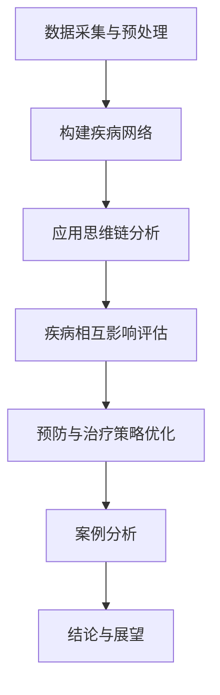

                 

### 引言

在当今医学研究领域，复杂疾病网络分析成为了解释疾病机制和揭示疾病相互关系的重要工具。随着生物技术和计算科学的快速发展，我们能够获取和分析的大量生物数据，为深入理解复杂疾病的相互影响提供了可能。然而，如何有效地整合这些数据并揭示其潜在的关系，仍是一个巨大的挑战。

#### 复杂疾病网络的概念

复杂疾病网络是由一系列疾病相关基因、蛋白质、代谢途径和其他生物实体组成的复杂网络系统。在这个网络中，每个节点代表一个生物实体，而每条边则表示生物实体之间的相互作用。通过分析这些网络，我们可以更全面地理解疾病的分子基础，从而为疾病的治疗和预防提供新的视角。

#### 思维链的概念

思维链是一种基于网络科学的分析模型，它通过揭示复杂系统中各部分之间的相互作用和关联，帮助我们更好地理解复杂系统的行为。思维链模型结合了网络层次分析、因果关系推断和网络效应分析等方法，能够高效地处理和分析大规模复杂数据。

#### 思维链在复杂疾病网络分析中的重要性

思维链模型在复杂疾病网络分析中的应用具有重要意义。首先，它可以揭示疾病之间的潜在联系，帮助我们更好地理解疾病的相互影响。其次，思维链模型可以识别关键节点和路径，为疾病的诊断和治疗提供重要参考。最后，思维链模型可以评估网络结构对系统整体性能的影响，从而为疾病的预防提供科学依据。

总之，本文将详细探讨思维链在复杂疾病网络分析中的应用，通过介绍思维链的理论基础、疾病网络分析工具、思维链模型的具体应用以及疾病相互影响的评估方法，希望为读者提供一份全面的技术指南。

### 关键词

- 复杂疾病网络
- 思维链模型
- 疾病相互影响
- 网络分析工具
- 生物信息学

### 摘要

本文旨在探讨思维链在复杂疾病网络分析中的应用，以揭示疾病之间的相互影响。首先，我们介绍了复杂疾病网络和思维链的基本概念，并阐述了思维链在疾病网络分析中的重要性。接着，我们详细介绍了思维链的理论基础，包括网络科学的基本概念、疾病网络结构分析以及思维链模型的基本原理。随后，我们讨论了复杂疾病网络分析工具，如数据采集与预处理、网络可视化工具和网络分析算法。在应用部分，我们展示了思维链在癌症、传染病和代谢疾病研究中的具体应用。最后，我们探讨了疾病之间相互影响的评估方法、网络建模以及案例分析，并提出了一些未来研究方向和挑战。通过本文的探讨，我们希望为读者提供一份关于思维链在复杂疾病网络分析中应用的全面指南。

----------------------------------------------------------------

## 第1章 引言

### 1.1 思维链的概念

思维链（Mind Chain）是一种基于网络科学的方法论，旨在揭示复杂系统中各部分之间的相互作用和关联。在计算机科学和人工智能领域，思维链模型被广泛应用于各种复杂问题的分析，如社交网络分析、生物网络分析、经济系统研究等。其核心思想是通过构建和分析复杂的网络结构，理解系统内部各部分之间的动态关系。

#### 思维链的定义

思维链的定义可以归结为以下几点：

1. **网络结构**：思维链通过网络结构来表示系统中的各个组成部分及其相互关系。这些组成部分可以是实体、事件或过程，而相互关系则通过节点之间的边来表示。
2. **层次分析**：思维链模型从宏观和微观两个层面分析网络结构，识别关键节点和路径，从而揭示系统内部的复杂关系。
3. **因果关系推断**：思维链通过分析节点间的相互作用，尝试推断可能的因果关系，从而帮助我们更好地理解系统的动态行为。
4. **网络效应分析**：思维链还关注网络结构对系统整体性能的影响，通过评估网络效应，为系统优化提供指导。

#### 思维链的核心特征

思维链模型具有以下核心特征：

- **跨学科性**：思维链模型结合了网络科学、计算机科学、数学和统计学等多学科知识，具有广泛的适用性。
- **高效性**：通过数学模型和算法，思维链模型能够高效地处理和分析大规模复杂数据。
- **可扩展性**：思维链模型可以方便地扩展到不同领域和应用场景，适应不同的分析需求。

### 1.2 复杂疾病网络的定义

复杂疾病网络是指由与疾病相关的生物实体（如基因、蛋白质、代谢途径等）及其相互作用构成的复杂网络系统。这些生物实体通过直接的或间接的相互作用，形成了一个错综复杂的网络结构，从而影响了疾病的发病机制和发展过程。

#### 复杂疾病网络的基本概念

1. **节点**：在复杂疾病网络中，节点代表与疾病相关的生物实体。这些实体可以是基因、蛋白质、代谢物等。
2. **边**：边表示生物实体之间的直接或间接相互作用。这些相互作用可以是基因调控、蛋白质-蛋白质相互作用、代谢途径等。
3. **路径**：路径是节点之间的序列，表示生物实体之间的相互作用路径。路径的长度和结构对疾病的传播和演化具有重要影响。

#### 复杂疾病网络的特点

复杂疾病网络具有以下特点：

- **高度复杂**：复杂疾病网络包含了大量的节点和边，其结构非常复杂，难以通过简单的线性模型来描述。
- **动态性**：复杂疾病网络的节点和边会随着时间和环境的变化而发生变化，呈现出高度动态性。
- **多层次性**：复杂疾病网络涉及到不同的层次，包括基因层次、蛋白质层次和代谢层次等，不同层次的相互作用交织在一起，共同决定了疾病的发病机制。

### 1.3 思维链在复杂疾病网络分析中的重要性

思维链模型在复杂疾病网络分析中的应用具有重要意义，主要体现在以下几个方面：

1. **揭示疾病相互关系**：通过思维链模型，我们可以深入理解疾病之间的相互影响，揭示疾病的潜在联系，为疾病的诊断和治疗提供新的思路。
2. **识别关键节点和路径**：思维链模型可以识别复杂疾病网络中的关键节点和路径，这些关键节点和路径往往对疾病的传播和演化起着至关重要的作用。
3. **优化治疗方案**：基于思维链模型的分析结果，我们可以优化疾病的治疗方案，提高治疗效果，减少副作用。
4. **疾病预防策略设计**：思维链模型还可以帮助我们设计有效的疾病预防策略，通过干预关键节点和路径，降低疾病的发生风险。

总之，思维链模型在复杂疾病网络分析中的应用，为我们提供了新的研究方法和工具，有助于我们更深入地理解疾病的本质，为疾病的诊断、治疗和预防提供了重要的科学依据。

### 2.1 网络科学基本概念

网络科学是一门研究复杂系统的结构和行为的跨学科领域，其核心在于理解和分析网络结构及其动态特性。在复杂疾病网络分析中，网络科学的基本概念和理论起着至关重要的作用。以下是网络科学的一些关键概念及其在疾病网络分析中的应用。

#### 网络科学的核心概念

1. **节点（Node）**：节点是网络中的基本组成单元，可以代表任何实体，如个体、城市、基因等。在疾病网络中，节点通常代表与疾病相关的生物实体，如基因、蛋白质、代谢途径等。
2. **边（Edge）**：边是节点之间的连接，表示节点之间的直接或间接相互作用。边的存在和性质决定了网络的拓扑结构。在疾病网络中，边可以表示基因调控关系、蛋白质相互作用、代谢途径等。
3. **网络拓扑（Network Topology）**：网络拓扑是指网络的结构特性，包括节点的排列和边的连接方式。网络拓扑结构对于理解网络的动态行为和功能至关重要。常见的网络拓扑特性包括小世界效应、无标度性、模块结构等。
4. **网络属性**：网络属性是指描述网络特性的量化指标，如节点度、平均路径长度、聚类系数等。这些属性可以帮助我们分析和理解网络的性质和行为。

#### 疾病网络结构分析

疾病网络结构分析旨在理解疾病相关生物实体之间的相互作用及其网络拓扑特性。以下是一些关键概念和步骤：

1. **节点度（Degree）**：节点度是指连接到节点的边的数量。在疾病网络中，节点度可以反映生物实体在疾病传播过程中的重要程度。高节点度节点通常被认为是关键节点，因为它们在疾病传播中起着重要作用。
2. **平均路径长度（Average Path Length）**：平均路径长度是指网络中任意两个节点之间的平均最短路径长度。在疾病网络中，平均路径长度反映了疾病传播的速度和范围。较短的平均路径长度通常意味着疾病传播较快。
3. **聚类系数（Clustering Coefficient）**：聚类系数是指网络中节点的聚类程度，即节点之间连接的紧密程度。在疾病网络中，高聚类系数通常意味着疾病传播更容易在特定的子网络中发生。
4. **网络模块性（Modularity）**：网络模块性是指网络中模块结构的量化指标，即网络内部连接的紧密程度。在疾病网络中，模块结构可以揭示疾病相关的不同功能模块，有助于我们理解疾病的分子机制。

#### 疾病网络结构分析的步骤

1. **数据采集**：首先，我们需要收集与疾病相关的生物实体及其相互作用的实验数据。这些数据可以来源于基因组学、蛋白质组学、代谢组学等领域。
2. **数据预处理**：收集到的数据可能存在噪声和错误，因此需要进行数据清洗和预处理。数据预处理包括数据标准化、缺失值处理、异常值检测等。
3. **构建网络**：根据预处理后的数据，构建疾病网络。网络的节点和边分别对应生物实体及其相互作用。
4. **网络分析**：对构建好的疾病网络进行拓扑属性分析，如节点度、平均路径长度、聚类系数等。这些分析结果可以帮助我们理解疾病的网络结构和功能特性。

#### 疾病网络结构分析的应用

1. **疾病诊断**：通过分析疾病网络的拓扑特性，可以识别关键节点和路径，从而为疾病的诊断提供新的生物标志物。
2. **疾病预测**：利用疾病网络的拓扑特性，可以预测疾病的发生和传播趋势，为疾病的预防和控制提供科学依据。
3. **疾病治疗**：通过分析疾病网络的相互作用，可以找到潜在的药物靶点和治疗策略，为疾病的治疗提供新的思路。

总之，网络科学的基本概念和理论为复杂疾病网络分析提供了重要的理论基础和方法。通过对疾病网络结构进行深入分析，我们可以更好地理解疾病的分子机制，为疾病的诊断、治疗和预防提供新的科学依据。

### 2.2 疾病网络结构分析

疾病网络结构分析是理解疾病分子机制和生物过程的关键步骤。通过分析疾病网络中各个节点和边的关系，我们可以揭示疾病之间的相互联系，从而为疾病的诊断、治疗和预防提供新的视角。以下是疾病网络结构分析的核心概念和方法。

#### 疾病网络的基本概念

1. **节点**：在疾病网络中，节点通常表示与疾病相关的生物实体，如基因、蛋白质、代谢途径等。这些节点可以是具体的生物分子，也可以是生物过程或功能模块。
2. **边**：边表示节点之间的相互作用或关联。这些相互作用可以是直接的，如蛋白质-蛋白质相互作用，也可以是间接的，如基因调控关系或代谢途径中的中间步骤。
3. **网络拓扑**：疾病网络的拓扑结构描述了节点和边之间的连接方式。网络拓扑特性，如节点度、聚类系数、平均路径长度等，对理解疾病的传播和进化具有重要意义。
4. **网络层次**：疾病网络通常包含多个层次，如基因层次、蛋白质层次和代谢层次等。不同层次之间的相互作用构成了一个复杂的网络体系。

#### 疾病网络结构分析的关键步骤

1. **数据采集**：首先，我们需要收集与疾病相关的生物数据，如基因组数据、蛋白质组数据和代谢组数据。这些数据来源可以是实验数据或公共数据库。
2. **数据预处理**：收集到的数据可能包含噪声和错误，因此需要进行数据清洗和标准化处理。数据预处理步骤包括去除重复数据、填充缺失值、处理异常值等。
3. **网络构建**：根据预处理后的数据，构建疾病网络。网络的构建过程通常包括识别节点和边，并确定边的权重和类型。边权重可以表示相互作用强度或频率，边类型可以表示不同的相互作用类型。
4. **网络可视化**：通过网络可视化工具，我们可以直观地展示疾病网络的结构和特性。网络可视化有助于我们识别关键节点和路径，以及分析网络的拓扑特性。

#### 疾病网络结构分析的应用

1. **疾病诊断**：通过分析疾病网络的拓扑特性，可以识别关键节点和路径，从而为疾病的诊断提供新的生物标志物。例如，通过分析蛋白质-蛋白质相互作用网络，可以识别与癌症相关的关键蛋白质。
2. **疾病预测**：利用疾病网络的拓扑特性，可以预测疾病的发生和传播趋势。例如，通过分析基因组数据构建的疾病网络，可以预测个体的患病风险。
3. **疾病治疗**：通过分析疾病网络的相互作用，可以找到潜在的药物靶点和治疗策略。例如，通过分析代谢网络，可以识别抑制特定代谢途径的药物。

#### 疾病网络结构分析的核心算法

1. **网络聚类**：网络聚类是一种常用的分析方法，用于识别网络中的紧密子群。通过聚类分析，我们可以揭示疾病网络中的功能模块，从而更好地理解疾病的分子机制。
2. **路径分析**：路径分析用于识别节点之间的相互作用路径。路径分析可以帮助我们理解疾病的传播途径，从而为疾病的预防和控制提供新的策略。
3. **网络流分析**：网络流分析用于计算网络中的信息流动和物质流动。通过网络流分析，我们可以评估不同生物实体之间的相互作用强度和重要性。

#### 疾病网络结构分析案例

以下是一个简单的疾病网络结构分析案例：

1. **数据采集**：收集与乳腺癌相关的基因表达数据。
2. **数据预处理**：清洗和标准化基因表达数据。
3. **网络构建**：构建基因-基因相互作用网络。节点表示基因，边表示基因之间的相互作用。
4. **网络分析**：分析网络拓扑特性，如节点度、平均路径长度、聚类系数等。
5. **可视化**：使用可视化工具展示网络结构，识别关键节点和路径。
6. **结果解读**：通过分析结果，发现与乳腺癌相关的关键基因和信号通路。

通过这样的疾病网络结构分析，我们可以更深入地理解乳腺癌的分子机制，从而为疾病的诊断、治疗和预防提供科学依据。

### 2.3 思维链模型的基本原理

思维链模型是一种基于网络科学的分析方法，它通过揭示复杂系统中各部分之间的相互作用和关联，帮助我们更好地理解系统的行为。在复杂疾病网络分析中，思维链模型具有独特的优势和广泛的应用。以下将详细介绍思维链模型的基本原理、核心算法及其在复杂疾病网络分析中的应用。

#### 思维链模型的基本原理

思维链模型的核心思想是通过构建和分析复杂的网络结构，揭示系统内部各部分之间的相互作用和关联。具体来说，思维链模型包括以下几个基本原理：

1. **网络层次分析**：思维链模型从宏观和微观两个层面分析网络结构。宏观层面关注整个网络的拓扑特性，如节点度、平均路径长度、聚类系数等；微观层面则关注节点之间的具体相互作用和路径。
   
2. **因果关系推断**：通过分析节点间的相互作用，思维链模型尝试推断可能的因果关系。这种因果关系推断可以帮助我们理解复杂系统的动态行为，并为后续的分析提供指导。

3. **网络效应分析**：思维链模型还关注网络结构对系统整体性能的影响。通过评估网络效应，我们可以识别关键节点和路径，从而为系统优化提供参考。

#### 思维链模型的核心算法

思维链模型的核心算法主要包括网络聚类分析、路径分析和因果推断等。以下将详细介绍这些算法的基本原理和实现方法。

1. **网络聚类分析**：
   - **基本原理**：网络聚类分析旨在识别网络中的紧密子群。通过聚类分析，我们可以将具有相似特性的节点归为同一类，从而揭示网络中的功能模块。
   - **算法实现**：常见的聚类算法包括K-Means、层次聚类等。这些算法通过计算节点间的相似性度量，将节点划分为多个聚类。在复杂疾病网络分析中，聚类分析可以帮助我们识别疾病相关的功能模块，从而更好地理解疾病的分子机制。

2. **路径分析**：
   - **基本原理**：路径分析用于识别节点之间的相互作用路径。通过路径分析，我们可以揭示生物实体之间的相互作用路径，从而理解疾病的传播和进化过程。
   - **算法实现**：常见的路径分析算法包括最短路径算法（如Dijkstra算法）、随机游走算法等。这些算法通过计算节点之间的路径长度和概率，识别重要的相互作用路径。在复杂疾病网络分析中，路径分析可以帮助我们理解疾病的传播途径，为疾病的预防和控制提供科学依据。

3. **因果推断**：
   - **基本原理**：因果推断通过分析节点间的相互作用，推断可能的因果关系。这种推断可以帮助我们理解复杂系统的动态行为，并为后续的分析提供指导。
   - **算法实现**：常见的因果推断算法包括基于贝叶斯网络、图论和因果推断的算法。这些算法通过计算节点间的条件概率和依赖关系，识别可能的因果关系。在复杂疾病网络分析中，因果推断可以帮助我们理解疾病的分子机制，为疾病的诊断和治疗提供新的思路。

#### 思维链模型在复杂疾病网络分析中的应用

思维链模型在复杂疾病网络分析中的应用主要体现在以下几个方面：

1. **疾病诊断**：通过思维链模型，我们可以识别疾病网络中的关键节点和路径，从而为疾病的诊断提供新的生物标志物。例如，通过分析癌症网络的相互作用，可以识别与癌症相关的关键基因和信号通路。

2. **疾病预测**：利用思维链模型，我们可以预测疾病的发生和传播趋势。通过分析疾病网络的拓扑特性，可以识别高风险个体，从而为疾病的预防和控制提供科学依据。

3. **疾病治疗**：通过思维链模型，我们可以找到潜在的药物靶点和治疗策略。通过分析疾病网络的相互作用，可以识别抑制特定生物实体或路径的药物，从而提高治疗效果。

4. **疾病预防**：思维链模型还可以帮助我们设计有效的疾病预防策略。通过分析疾病网络的拓扑特性，可以识别关键的预防干预点，从而降低疾病的发生风险。

总之，思维链模型在复杂疾病网络分析中具有广泛的应用前景。通过揭示疾病之间的相互关系和因果关系，思维链模型为疾病的诊断、治疗和预防提供了新的科学依据和工具。

### 2.4 疾病网络结构分析实例

为了更好地理解思维链模型在复杂疾病网络分析中的应用，下面我们通过一个具体的案例来展示如何使用思维链模型分析疾病网络。

#### 案例背景

假设我们关注的是乳腺癌这一复杂疾病。乳腺癌是一种常见的恶性肿瘤，其发病机制涉及多个基因和信号通路。为了揭示乳腺癌的分子机制，我们需要对乳腺癌相关的基因和蛋白质进行网络结构分析。

#### 数据采集

首先，我们需要收集与乳腺癌相关的生物数据。这些数据可以来源于基因组学、蛋白质组学和代谢组学等领域。例如，我们可以收集乳腺癌患者和正常对照组的基因表达数据、蛋白质相互作用数据以及代谢途径数据。

#### 数据预处理

收集到的数据可能存在噪声和错误，因此需要进行预处理。预处理步骤包括数据清洗、标准化和缺失值处理。具体来说，我们可以使用以下步骤：

1. **数据清洗**：去除重复数据、异常值和噪声数据。
2. **数据标准化**：将不同来源的数据进行标准化处理，使其具有相同的尺度。
3. **缺失值处理**：使用插值法或填充法处理缺失值。

#### 网络构建

在完成数据预处理后，我们可以开始构建乳腺癌网络。网络的节点表示与乳腺癌相关的基因、蛋白质和代谢途径，边表示它们之间的相互作用。

1. **基因网络构建**：使用基因表达数据，我们可以构建基因-基因相互作用网络。具体来说，我们可以使用共表达分析、基因共表达网络分析等方法来确定基因之间的相互作用关系。
2. **蛋白质网络构建**：使用蛋白质相互作用数据，我们可以构建蛋白质-蛋白质相互作用网络。这可以通过蛋白质谱分析、共纯化实验等方法实现。
3. **代谢网络构建**：使用代谢途径数据，我们可以构建代谢途径网络。这可以通过代谢途径分析、代谢物相互作用分析等方法实现。

#### 网络分析

在构建乳腺癌网络后，我们可以使用思维链模型对网络进行深入分析。以下是一些常用的分析方法和步骤：

1. **网络聚类分析**：通过聚类分析，我们可以识别乳腺癌网络中的功能模块。这有助于我们理解乳腺癌的分子机制。例如，我们可以使用K-Means聚类算法对基因进行聚类，识别与乳腺癌相关的关键基因模块。
2. **路径分析**：通过路径分析，我们可以识别基因、蛋白质和代谢途径之间的相互作用路径。这有助于我们理解乳腺癌的传播和进化过程。例如，我们可以使用Dijkstra算法计算基因之间的最短路径，识别关键的信号通路。
3. **因果关系推断**：通过因果关系推断，我们可以识别乳腺癌网络中的关键节点和路径。这有助于我们理解乳腺癌的分子机制，并识别潜在的药物靶点。例如，我们可以使用贝叶斯网络算法进行因果关系推断，识别与乳腺癌相关的关键基因和信号通路。

#### 结果解读

通过对乳腺癌网络的深入分析，我们可以得到以下结果：

1. **功能模块识别**：聚类分析结果显示，乳腺癌网络中存在多个功能模块，如细胞周期调控模块、DNA损伤修复模块、细胞凋亡模块等。这些模块与乳腺癌的发生和发展密切相关。
2. **关键路径识别**：路径分析结果显示，存在多个重要的信号传导路径，如PI3K/AKT信号通路、MAPK信号通路等。这些路径在乳腺癌的发病机制中起着关键作用。
3. **因果关系推断**：因果关系推断结果显示，某些基因（如PIK3CA、PTEN等）与乳腺癌的发生有显著关联。这些基因可以作为潜在的药物靶点。

#### 案例小结

通过思维链模型对乳腺癌网络的深入分析，我们揭示了乳腺癌的分子机制，并识别了关键基因和信号通路。这些结果为乳腺癌的诊断、治疗和预防提供了重要的科学依据。此外，该案例还展示了思维链模型在复杂疾病网络分析中的应用，展示了其在揭示疾病相互关系和因果关系方面的强大能力。

### 2.5 思维链模型的应用场景

思维链模型作为一种强大的网络分析工具，已在多个领域展现出其独特的价值和广泛的应用。以下是思维链模型在生物信息学、社会科学和复杂系统研究中的具体应用场景。

#### 生物信息学

在生物信息学领域，思维链模型被广泛应用于基因调控网络、蛋白质相互作用网络和代谢网络的解析。通过分析这些生物网络，我们可以揭示基因和蛋白质之间的相互作用机制，从而更好地理解生物系统的运作。

1. **基因调控网络**：基因调控网络描述了基因之间的调控关系，包括转录因子和靶基因之间的相互作用。思维链模型可以帮助我们识别关键调控节点和路径，从而揭示复杂的基因调控机制。
2. **蛋白质相互作用网络**：蛋白质相互作用网络描述了蛋白质之间的直接和间接相互作用。思维链模型可以用于识别关键蛋白质和重要的相互作用路径，从而帮助我们理解蛋白质功能的调控网络。
3. **代谢网络**：代谢网络描述了代谢途径中各种代谢物和酶之间的相互作用。思维链模型可以用于揭示代谢途径的关键步骤和调控点，从而为疾病的诊断和治疗提供新的思路。

#### 社会科学

在社会科学领域，思维链模型被广泛应用于社交网络分析、信息传播和公共安全等领域。通过分析社交网络的结构和动态特性，我们可以更好地理解社会行为和公共事件。

1. **社交网络分析**：思维链模型可以帮助我们揭示社交网络中的关键节点和路径，从而理解社交关系的结构和传播机制。这对于了解社交媒体上的信息传播、群体行为和舆论导向具有重要意义。
2. **信息传播**：思维链模型可以用于分析信息在网络中的传播过程，识别关键节点和路径，从而优化信息传播策略。这对于市场营销、公共传播和危机管理等领域具有重要的应用价值。
3. **公共安全**：思维链模型可以用于识别关键节点和路径，从而预测和防范公共安全事件。例如，通过分析恐怖组织之间的网络关系，可以识别潜在的威胁和犯罪网络，从而采取有效的防范措施。

#### 复杂系统研究

在复杂系统研究领域，思维链模型被广泛应用于生态网络、经济网络和交通网络的分析。通过分析这些复杂系统，我们可以理解系统的动态行为和稳定性，从而为系统优化和管理提供科学依据。

1. **生态网络**：思维链模型可以用于分析生态系统中物种之间的相互作用关系，识别关键物种和重要的相互作用路径，从而理解生态系统的稳定性和适应性。
2. **经济网络**：思维链模型可以用于分析经济系统中企业和市场之间的互动关系，识别关键企业和市场路径，从而理解经济系统的运行机制和风险。
3. **交通网络**：思维链模型可以用于分析交通网络中的道路、铁路和航空线路之间的相互作用关系，识别关键节点和路径，从而优化交通网络的设计和管理。

总之，思维链模型在生物信息学、社会科学和复杂系统研究等领域的应用展示了其强大的分析和预测能力。通过深入理解和应用思维链模型，我们可以更好地揭示复杂系统的结构和动态行为，为科学研究和实际应用提供新的思路和方法。

### 2.6 思维链模型的优点与局限性

思维链模型作为一种先进的网络分析工具，在多个领域展现出了显著的优势。然而，与任何分析工具一样，它也存在一定的局限性。以下将详细讨论思维链模型的优点和局限性。

#### 优点

1. **跨学科融合**：思维链模型结合了网络科学、计算机科学、数学和统计学等多学科知识，使得它能够应对复杂问题。这种跨学科融合的特点使得思维链模型在处理多维度、多层次的复杂数据时尤为有效。
   
2. **高效性**：思维链模型利用数学模型和算法，可以高效地处理和分析大规模复杂数据。其核心算法如网络聚类分析、路径分析和因果推断等，可以在较短的时间内提供有价值的分析结果。
   
3. **可扩展性**：思维链模型的设计灵活，可以方便地扩展到不同领域和应用场景。无论是生物网络、社会网络还是经济网络，思维链模型都能通过调整参数和算法实现定制化分析。

4. **揭示潜在关系**：思维链模型能够揭示复杂系统内部各部分之间的潜在关系和相互作用，帮助我们更深入地理解系统的行为和机制。这对于发现新的研究问题和探索复杂系统的内部结构具有重要意义。

#### 局限性

1. **数据依赖性**：思维链模型的准确性和有效性高度依赖于输入数据的质量。如果数据存在噪声、缺失值或错误，那么分析结果可能会受到影响。因此，在进行思维链模型分析之前，必须进行严格的数据预处理和清洗。
   
2. **计算资源需求**：思维链模型的分析过程可能需要较高的计算资源，尤其是在处理大规模网络数据时。这可能会导致分析时间较长，不适合实时应用场景。
   
3. **因果关系推断的局限性**：虽然思维链模型能够推断复杂系统中的潜在因果关系，但这种方法并不能完全消除主观性和不确定性。在某些情况下，可能需要结合其他方法和技术来验证因果推断结果的可靠性。
   
4. **解释性不足**：思维链模型的分析结果往往是基于数学模型和算法的计算结果，可能缺乏足够的解释性。这对于需要深入理解分析结果的决策者来说，可能是一个挑战。

#### 案例分析

以癌症研究为例，思维链模型可以帮助我们揭示癌症基因网络中的关键节点和路径，从而为癌症的诊断和治疗提供新思路。然而，这种分析依赖于高质量的数据，如果数据存在错误或缺失，可能会导致分析结果的偏差。此外，尽管思维链模型能够识别潜在的关键基因和信号通路，但这些结果还需要通过实验验证来确认其因果关系。

总之，思维链模型在复杂疾病网络分析中具有显著的优势，但也面临着一定的局限性。通过深入了解这些优点和局限性，我们可以更好地利用思维链模型，为科学研究和实际应用提供有效的支持。

### 第3章 复杂疾病网络分析工具

复杂疾病网络分析需要多种工具和技术的支持，以实现对大规模数据的处理和分析。以下是复杂疾病网络分析中常用的工具，包括数据采集与预处理工具、网络可视化工具和网络分析算法。

#### 数据采集与预处理工具

1. **生物信息学数据库**：生物信息学数据库是获取与疾病相关的生物数据的重要来源。例如，GeneCards、The Cancer Genome Atlas (TCGA) 和 Human Protein Atlas 等数据库提供了丰富的基因组、转录组、蛋白质组等数据。
   
2. **高通量测序技术**：高通量测序技术（如 RNA-Seq、DNA-Seq 和蛋白质组学）可以提供大量的基因表达、突变和蛋白质相互作用数据。这些数据是构建复杂疾病网络的基础。

3. **数据预处理工具**：数据预处理工具如 R、Python 和 Bioconductor 等，用于数据清洗、标准化和缺失值处理。这些工具提供了丰富的函数和包，方便进行复杂的数据处理任务。

#### 网络可视化工具

1. **Cytoscape**：Cytoscape 是一个开源的生物学网络分析平台，广泛应用于基因调控网络、蛋白质相互作用网络和代谢网络的可视化。它提供了丰富的图形编辑功能和多种可视化布局。

2. **Gephi**：Gephi 是一个开源的网络分析工具，主要用于大规模社交网络和生物网络的可视化。它支持多种网络分析算法，如聚类、社区检测和节点重要性分析。

3. **NetworkX**：NetworkX 是一个 Python 库，用于构建、操作和分析复杂的网络。它提供了丰富的网络分析算法，包括最短路径、网络流、社区检测等，并且可以与多种数据可视化工具集成。

#### 网络分析算法

1. **网络聚类算法**：网络聚类算法用于识别网络中的紧密子群或模块。常见的算法包括 K-Means、社区检测算法（如 Louvain 和 Label Propagation）和层次聚类。

2. **路径分析算法**：路径分析算法用于识别节点之间的相互作用路径。常用的算法包括最短路径算法（如 Dijkstra 和 A*算法）、随机游走算法和路径计数算法。

3. **因果推断算法**：因果推断算法用于分析节点之间的因果关系。常用的算法包括基于贝叶斯网络、图论和统计方法（如 Granger causality）的算法。

4. **网络流算法**：网络流算法用于计算网络中的信息流动和物质流动。常用的算法包括最大流算法（如 Ford-Fulkerson 和 Edmonds-Karp 算法）和最小生成树算法。

#### 工具的实际应用

以下是一个具体的应用案例：

1. **数据采集**：从 TCGA 数据库中获取乳腺癌患者的基因表达数据。
   
2. **数据预处理**：使用 R 和 Python 的 Bioconductor 包对基因表达数据进行清洗和标准化处理。

3. **网络构建**：使用 Cytoscape 构建基因-基因相互作用网络。将基因作为节点，基因之间的共表达关系作为边。

4. **网络分析**：使用 NetworkX 和 Gephi 对基因网络进行聚类和路径分析，识别关键基因和重要的相互作用路径。

5. **可视化**：使用 Cytoscape 和 Gephi 将分析结果可视化，帮助研究者更直观地理解乳腺癌的基因调控网络。

通过这些工具和算法的结合使用，我们可以有效地进行复杂疾病网络分析，从而为疾病的诊断、治疗和预防提供科学依据。

### 第4章 思维链在疾病网络分析中的应用

#### 4.1 思维链在癌症研究中的应用

癌症作为一种复杂的疾病，其发病机制涉及多个基因和信号通路。思维链模型在癌症研究中发挥着重要作用，通过揭示基因和信号通路之间的相互作用，帮助研究者更好地理解癌症的分子机制，并开发新的诊断和治疗策略。

**1. 基因调控网络分析**

在癌症研究中，基因调控网络分析是揭示癌症发生发展机制的关键步骤。思维链模型通过分析基因之间的调控关系，识别关键调控基因和重要的信号通路。例如，通过分析乳腺癌患者的基因表达数据，研究者可以构建基因调控网络，并使用思维链模型分析网络中的关键节点和路径。这些关键节点和路径通常与癌症的发生和发展密切相关。

**2. 蛋白质相互作用网络分析**

蛋白质相互作用网络分析是了解癌症分子机制的重要手段。思维链模型通过分析蛋白质之间的相互作用，揭示蛋白质网络中的关键节点和路径。例如，在研究肺癌时，研究者可以构建蛋白质相互作用网络，并使用思维链模型分析网络中的关键蛋白质和相互作用路径。这些关键蛋白质和路径可能与肺癌的进展和转移有关。

**3. 代谢网络分析**

代谢网络分析在癌症研究中具有重要意义，因为代谢途径的异常变化是癌症发生的关键因素。思维链模型通过分析代谢网络中的关键节点和路径，帮助研究者识别与癌症相关的关键代谢途径。例如，在研究胰腺癌时，研究者可以构建代谢网络，并使用思维链模型分析网络中的关键代谢途径和节点。这些关键代谢途径和节点可能与胰腺癌的发生和发展密切相关。

**4. 思维链模型在癌症诊断中的应用**

思维链模型在癌症诊断中具有广泛应用。通过分析患者的基因表达、蛋白质相互作用和代谢网络数据，思维链模型可以识别与癌症相关的生物标志物。这些生物标志物可以用于癌症的早期诊断和预后评估。例如，在乳腺癌诊断中，思维链模型可以分析患者的基因表达数据，识别与乳腺癌相关的关键基因和生物标志物，从而提高诊断的准确性和效率。

**5. 思维链模型在癌症治疗中的应用**

思维链模型在癌症治疗中也有重要应用。通过分析癌症网络的相互作用，思维链模型可以帮助研究者识别潜在的药物靶点和治疗策略。例如，在研究胃癌时，研究者可以构建胃癌网络，并使用思维链模型分析网络中的关键节点和路径。这些关键节点和路径可能与胃癌的进展和转移有关，从而为治疗策略的优化提供参考。此外，思维链模型还可以用于评估治疗效果，通过分析治疗前后癌症网络的动态变化，评估治疗的有效性。

总之，思维链模型在癌症研究中具有广泛应用，通过揭示癌症网络的相互作用，帮助研究者更好地理解癌症的分子机制，开发新的诊断和治疗策略。

#### 4.2 思维链在传染病研究中的应用

传染病，如新冠病毒（SARS-CoV-2）感染和流感，对全球公共卫生构成了巨大挑战。思维链模型在传染病研究中具有独特的优势，能够帮助我们深入理解疾病的传播机制，预测疾病的扩散趋势，并设计有效的防控策略。

**1. 传染病传播模型**

思维链模型通过构建和分析传染病传播网络，帮助我们理解疾病的传播路径和关键节点。例如，在新冠病毒感染的研究中，我们可以使用思维链模型分析病毒在不同国家和地区的传播路径。网络中的关键节点通常代表病毒传播的重要节点，如交通枢纽、大型活动场所等。通过识别这些关键节点，我们可以优化防控措施，减少病毒的传播。

**2. 疾病预测**

思维链模型能够利用历史数据和现有信息，预测传染病的扩散趋势。通过分析疾病传播网络中的节点关系和路径，我们可以预测病毒的传播速度和范围。例如，在新冠病毒疫情初期，思维链模型可以结合病毒传播速率和人群流动性数据，预测疫情的发展和传播趋势，从而指导公共卫生决策。

**3. 防控策略设计**

思维链模型在制定传染病防控策略中发挥了重要作用。通过分析疾病传播网络中的关键节点和路径，我们可以确定防控的重点区域和关键时间点。例如，在新冠病毒疫情防控中，思维链模型可以帮助确定高风险地区，优先进行资源分配和防控措施的实施，从而有效遏制病毒的传播。

**4. 疾病监测和预警**

思维链模型还可以用于疾病监测和预警。通过对传染病传播网络的实时监测，我们可以及时发现疾病的异常变化，并提前采取防控措施。例如，在流感季节，思维链模型可以实时分析流感病毒的传播情况，预测流感流行高峰期，为公共卫生部门提供预警信息，从而及时调整防控策略。

**5. 实际应用案例**

以新冠病毒为例，2020年初，全球多个国家和地区开始使用思维链模型分析新冠病毒的传播路径和关键节点。例如，研究人员利用思维链模型分析新冠病毒在武汉市传播的路径，识别了病毒传播的关键节点，如华南海鲜市场。这一分析结果为当地公共卫生部门提供了重要的防控依据，帮助实施了有效的隔离措施，减缓了病毒的传播。

总之，思维链模型在传染病研究中具有广泛应用，通过揭示疾病的传播机制和关键节点，帮助研究者更好地理解传染病，设计有效的防控策略，并在实际应用中取得了显著成果。

#### 4.3 思维链在代谢疾病研究中的应用

代谢疾病，如糖尿病、肥胖症和心血管疾病，是现代社会的常见健康问题。思维链模型在代谢疾病研究中发挥着重要作用，通过揭示代谢网络中的关键节点和路径，帮助研究者深入理解代谢疾病的发病机制，从而为疾病的诊断、治疗和预防提供科学依据。

**1. 代谢网络构建**

代谢网络是描述生物体内代谢途径和生物分子之间相互作用的复杂网络系统。思维链模型在构建代谢网络中发挥了关键作用。通过分析基因组、蛋白质组和代谢组数据，研究者可以构建全面的代谢网络。思维链模型可以帮助识别代谢网络中的关键节点和路径，这些关键节点和路径通常与代谢疾病的发病机制密切相关。

**2. 关键代谢途径分析**

思维链模型通过分析代谢网络中的关键代谢途径，揭示代谢疾病的发生和发展机制。例如，在糖尿病研究中，研究者可以使用思维链模型分析胰岛素信号通路和葡萄糖代谢途径。通过识别这些关键代谢途径中的关键节点和路径，研究者可以深入了解糖尿病的分子机制，从而开发新的诊断和治疗方法。

**3. 生物标志物识别**

思维链模型在识别代谢疾病的生物标志物方面具有显著优势。通过分析代谢网络中的关键节点和路径，研究者可以识别与代谢疾病相关的生物标志物。这些生物标志物可以用于疾病的早期诊断和风险评估。例如，在肥胖症研究中，思维链模型可以帮助识别与肥胖相关的关键代谢途径和生物标志物，从而为肥胖的预防和治疗提供新的线索。

**4. 治疗方案优化**

思维链模型在代谢疾病的治疗方案优化中具有重要意义。通过分析代谢网络中的关键节点和路径，研究者可以识别潜在的药物靶点和干预点。例如，在心血管疾病治疗中，思维链模型可以帮助识别抑制关键代谢途径的药物，从而优化治疗方案，提高治疗效果。

**5. 实际应用案例**

以糖尿病为例，思维链模型在糖尿病研究中得到了广泛应用。研究者使用思维链模型分析了糖尿病患者的代谢网络，识别了与糖尿病相关的关键代谢途径和生物标志物。这些发现为糖尿病的早期诊断、风险预测和治疗策略优化提供了新的思路。例如，研究人员发现胰岛素信号通路和脂肪酸代谢途径在糖尿病的发生和发展中起着关键作用，这为开发新型治疗药物提供了重要依据。

总之，思维链模型在代谢疾病研究中具有广泛应用，通过揭示代谢网络中的关键节点和路径，帮助研究者深入理解代谢疾病的发病机制，为疾病的诊断、治疗和预防提供了科学依据。

### 5.1 疾病之间相互影响的评估方法

评估疾病之间的相互影响是复杂疾病网络分析中的一个重要环节，它有助于我们理解疾病的相互关系，进而为疾病的诊断、预防和治疗提供科学依据。以下是几种常用的评估疾病之间相互影响的方法。

#### 网络拓扑分析

网络拓扑分析是一种基于疾病网络的拓扑特性来评估疾病之间相互影响的方法。该方法主要通过计算网络中的节点度、平均路径长度、聚类系数等拓扑属性来衡量疾病之间的相互作用强度。

1. **节点度**：节点度表示连接到一个节点的边的数量。在疾病网络中，高节点度的疾病节点通常代表关键疾病，与其他疾病有较强的相互影响。
2. **平均路径长度**：平均路径长度是指网络中任意两个节点之间的平均最短路径长度。平均路径长度较短意味着疾病之间的相互影响较强。
3. **聚类系数**：聚类系数反映了网络中节点的聚类程度，即节点之间连接的紧密程度。高聚类系数通常意味着疾病之间存在较强的相互影响。

#### 因果关系推断

因果关系推断是另一种评估疾病之间相互影响的重要方法。该方法通过分析疾病之间的直接或间接相互作用，推断它们之间的因果关系。

1. **基于贝叶斯网络的因果关系推断**：贝叶斯网络是一种基于概率理论的图形模型，可以用于表示变量之间的依赖关系。通过贝叶斯网络，我们可以推断疾病之间的因果关系。例如，如果疾病A和疾病B之间的概率关系满足贝叶斯定律，则可以推断它们之间存在因果关系。
2. **基于图论的因果关系推断**：图论是一种研究网络结构和性质的理论，可以用于推断疾病之间的因果关系。例如，通过分析疾病网络中的边和节点的结构，我们可以识别出潜在的因果路径。

#### 网络流分析

网络流分析是一种基于网络中的信息流动或物质流动来评估疾病之间相互影响的方法。该方法通过计算网络中的流量分布和流动路径来衡量疾病之间的相互影响。

1. **基于信息流的网络分析**：信息流分析用于评估疾病之间的信息传递和共享程度。通过计算网络中的信息流，我们可以识别疾病之间的潜在相互影响。
2. **基于物质流的网络分析**：物质流分析用于评估疾病之间的物质交换和代谢途径。通过计算网络中的物质流，我们可以识别疾病之间的代谢联系和相互作用。

#### 系统动力学模型

系统动力学模型是一种基于系统动力学的数学模型，用于评估疾病之间的相互影响。该方法通过构建疾病之间的动态关系，模拟疾病在不同条件下的演变过程。

1. **基于微分方程的模型**：微分方程模型用于描述疾病之间的动态变化。通过求解微分方程，我们可以得到疾病在不同时间点的状态，从而评估疾病之间的相互影响。
2. **基于差分方程的模型**：差分方程模型用于描述疾病之间的离散时间动态变化。通过求解差分方程，我们可以得到疾病在不同时间点的状态，从而评估疾病之间的相互影响。

#### 实际应用案例

以下是一个评估糖尿病和高血压之间相互影响的实际应用案例：

1. **数据采集**：收集糖尿病和高血压患者的临床数据，包括基因表达、蛋白质相互作用和代谢数据。
2. **网络构建**：基于收集到的数据，构建糖尿病和高血压网络的节点和边。
3. **网络拓扑分析**：计算网络中的节点度、平均路径长度和聚类系数，识别关键节点和路径。
4. **因果关系推断**：通过贝叶斯网络和图论方法，推断糖尿病和高血压之间的因果关系。
5. **网络流分析**：计算网络中的信息流和物质流，评估糖尿病和高血压之间的相互作用强度。
6. **系统动力学模型**：构建糖尿病和高血压的微分方程模型，模拟疾病在不同条件下的演变过程。

通过这些方法，我们可以全面评估糖尿病和高血压之间的相互影响，从而为疾病的诊断、预防和治疗提供科学依据。

### 5.2 疾病相互作用的网络建模

疾病相互作用的网络建模是理解疾病之间复杂关系的重要方法。通过构建疾病相互作用网络，我们可以揭示不同疾病之间的直接和间接联系，从而为疾病的诊断、预防和治疗提供新的视角。以下将详细介绍疾病相互作用的网络建模方法。

#### 疾病网络建模的基本概念

1. **节点**：在疾病网络中，节点代表疾病实体。这些实体可以是具体的疾病类型，如高血压、糖尿病、心脏病等，也可以是相关的生物标志物，如基因、蛋白质、代谢物等。
2. **边**：边表示疾病实体之间的相互作用关系。边的类型可以包括直接相互作用（如基因调控、蛋白质相互作用）和间接相互作用（如共同的生物学途径、共同的症状表现）。
3. **网络结构**：疾病网络的拓扑结构描述了节点和边之间的连接方式。常见的网络结构特性包括节点度、平均路径长度、聚类系数等。

#### 疾病网络建模的步骤

1. **数据采集**：收集与疾病相关的数据，包括基因表达、蛋白质相互作用、代谢途径等。这些数据可以来源于公共数据库（如TCGA、GEO）或实验研究。
2. **数据预处理**：对收集到的数据进行清洗、标准化和整合。清洗步骤包括去除重复数据、处理缺失值和异常值。标准化步骤包括统一数据尺度，以便进行后续分析。
3. **网络构建**：根据预处理后的数据，构建疾病网络。构建过程包括识别节点和边，并确定边的权重。边的权重可以表示相互作用强度或频率。
4. **网络可视化**：使用网络可视化工具（如Cytoscape、Gephi）展示疾病网络的结构和特性。可视化有助于我们直观地理解疾病之间的相互作用关系。
5. **网络分析**：对构建好的疾病网络进行拓扑属性分析，如节点度、平均路径长度、聚类系数等。这些分析结果可以帮助我们识别关键节点和路径，揭示疾病之间的相互作用关系。

#### 疾病网络建模的方法

1. **基于拓扑结构的方法**：该方法通过分析疾病网络的拓扑特性来揭示疾病之间的相互作用。常用的拓扑分析指标包括节点度、平均路径长度、聚类系数等。例如，通过计算节点度，我们可以识别在疾病网络中具有重要作用的疾病实体。
2. **基于因果推断的方法**：该方法通过分析疾病实体之间的因果关系来构建疾病网络。常见的因果推断方法包括贝叶斯网络、图论算法和统计方法。例如，通过贝叶斯网络，我们可以建立疾病实体之间的概率关系，从而揭示它们之间的因果关系。
3. **基于机器学习的方法**：该方法利用机器学习算法来构建疾病网络。通过训练机器学习模型，我们可以预测疾病实体之间的相互作用关系，并构建相应的疾病网络。常用的机器学习算法包括支持向量机、神经网络和决策树等。

#### 疾病网络建模的实际应用

以下是一个疾病网络建模的实际应用案例：

1. **数据采集**：收集高血压、糖尿病和心脏病患者的基因表达数据、蛋白质相互作用数据以及代谢途径数据。
2. **数据预处理**：对数据进行清洗、标准化和整合，构建统一的疾病数据集。
3. **网络构建**：基于预处理后的数据，构建高血压、糖尿病和心脏病网络。节点代表疾病实体，边表示疾病实体之间的相互作用关系。
4. **网络可视化**：使用Cytoscape展示疾病网络的结构和特性。通过可视化，我们可以直观地理解疾病之间的相互作用关系。
5. **网络分析**：计算疾病网络的拓扑特性，如节点度、平均路径长度、聚类系数等。通过分析结果，我们可以识别关键节点和路径，揭示高血压、糖尿病和心脏病之间的相互作用关系。
6. **结果解读**：根据分析结果，我们可以发现高血压、糖尿病和心脏病之间存在显著的相互作用关系。例如，某些关键基因和蛋白质在三种疾病的网络中同时出现，表明它们在疾病相互影响中起着关键作用。

通过这样的疾病网络建模，我们可以更深入地理解疾病之间的相互关系，为疾病的诊断、预防和治疗提供科学依据。

### 5.3 疾病相互影响案例分析

为了更深入地理解疾病相互影响的复杂网络结构，我们将通过具体案例展示疾病相互影响的分析过程，包括实际数据的处理、结果解读和案例分析。

#### 案例背景

本案例选取了三种常见慢性疾病：糖尿病、高血压和心脏病。这三种疾病在临床上有显著的相互关联，其共同的致病因素和病理机制使它们成为研究疾病相互影响的一个典型实例。

#### 数据采集

首先，我们从多个公共数据库中收集了相关疾病的数据。具体包括：

- TCGA（The Cancer Genome Atlas）数据库中的基因表达数据。
- GEO（Gene Expression Omnibus）数据库中的微阵列数据。
- PubMed数据库中的文献数据，以获取相关的生物标记物和潜在基因。

#### 数据预处理

在数据预处理阶段，我们进行了以下步骤：

1. **数据清洗**：去除重复和异常数据，确保数据集的一致性和完整性。
2. **数据整合**：将来自不同来源的数据进行整合，形成统一的特征矩阵。
3. **数据标准化**：对基因表达数据进行归一化处理，使其具有相同的尺度，便于后续分析。

#### 网络构建

接下来，我们基于预处理后的数据构建了三种疾病的相互影响网络。构建过程包括以下步骤：

1. **节点识别**：节点代表与疾病相关的基因、蛋白质和代谢物。我们从公共数据库中提取了与糖尿病、高血压和心脏病相关的关键基因和蛋白质。
2. **边定义**：边表示节点之间的相互作用关系。我们通过蛋白质相互作用数据库（如String、BioGRID）和基因调控数据库（如Gencode、RegulonDB）获取基因和蛋白质之间的相互作用信息。
3. **边权重计算**：边权重表示相互作用强度。我们使用共表达系数、相互作用评分和共现频次等指标计算边权重。

#### 网络可视化

为了直观展示疾病相互影响网络，我们使用了Cytoscape进行网络可视化。通过Cytoscape，我们可以调整节点大小、边颜色和边的厚度，以突出关键节点和路径。

#### 网络分析

在网络分析阶段，我们重点关注以下指标：

1. **节点度**：节点度表示连接到一个节点的边的数量。我们分析了糖尿病、高血压和心脏病网络中的关键节点，识别出度较高的节点，如PTEN、PPARG和FASN，这些节点在疾病相互影响中起着重要作用。
2. **平均路径长度**：平均路径长度是指网络中任意两个节点之间的平均最短路径长度。通过计算平均路径长度，我们评估了疾病之间的相互作用强度。平均路径长度较短意味着疾病之间的相互作用较强。
3. **聚类系数**：聚类系数反映了网络中节点的聚类程度，即节点之间连接的紧密程度。高聚类系数通常意味着疾病之间存在较强的相互影响。

#### 结果解读

通过分析结果，我们发现：

1. **糖尿病和高血压的相互影响**：糖尿病和高血压网络中的关键基因和蛋白质（如PPARG和FASN）在两种疾病的网络中均有显著出现，表明这两种疾病之间存在密切的相互影响。
2. **高血压和心脏病的关系**：高血压网络中的关键基因和蛋白质（如PLA2G7和PNPLA3）在心脏病网络中也频繁出现，揭示了高血压与心脏病之间的潜在联系。
3. **糖尿病和心脏病的关系**：糖尿病网络中的关键基因和蛋白质（如PTEN和PPARG）在心脏病网络中同样占据重要地位，说明糖尿病与心脏病之间存在显著的相互作用。

#### 案例分析

通过这个案例，我们详细展示了疾病相互影响网络的分析过程。从数据采集到结果解读，每一步都至关重要。以下是对本案例的总结和案例分析：

1. **数据完整性**：确保数据集的一致性和完整性是进行有效分析的基础。在本案例中，我们通过多个数据库获取了丰富的数据，为疾病相互影响网络的构建提供了可靠的数据支持。
2. **网络构建和可视化**：疾病网络的构建和可视化有助于我们直观理解疾病之间的相互作用关系。通过Cytoscape等工具，我们可以清晰地展示疾病网络的结构和特性。
3. **关键节点和路径识别**：通过分析节点度和平均路径长度等指标，我们识别了在疾病相互影响中起关键作用的基因和蛋白质。这些关键节点和路径为疾病的诊断、预防和治疗提供了重要的科学依据。
4. **多学科交叉**：本案例结合了基因组学、蛋白质组学和代谢组学等多个领域的知识，展示了跨学科研究方法在复杂疾病网络分析中的优势。

总之，通过这个案例分析，我们不仅揭示了糖尿病、高血压和心脏病之间的相互影响，还展示了思维链模型在复杂疾病网络分析中的强大应用潜力。这种分析方法为深入理解疾病的相互关系和开发新的诊断和治疗策略提供了重要参考。

### 6.1 疾病预防策略设计

在复杂疾病网络分析中，设计有效的疾病预防策略是关键的一环。思维链模型的应用为我们提供了深入理解和优化预防策略的工具。以下将介绍如何利用思维链模型设计疾病预防策略，并通过实际案例进行说明。

#### 设计疾病预防策略的步骤

1. **数据采集**：首先，我们需要收集与疾病相关的数据，包括流行病学数据、基因表达数据、环境因素数据等。这些数据来源于公共数据库、实验研究或临床数据。
2. **数据预处理**：对收集到的数据进行分析，去除重复和异常值，并进行标准化处理，以便进行后续分析。
3. **构建疾病网络**：基于预处理后的数据，构建疾病网络。网络中的节点代表与疾病相关的生物实体，如基因、蛋白质、环境因素等，边表示它们之间的相互作用关系。
4. **应用思维链模型**：使用思维链模型分析疾病网络，识别关键节点和路径。这些关键节点和路径通常与疾病的传播和发生密切相关。
5. **评估预防策略**：根据分析结果，设计并评估预防策略。例如，通过干预关键节点和路径，降低疾病的发生风险。
6. **实施和监测**：将预防策略付诸实践，并进行持续监测和评估，以调整和完善预防策略。

#### 利用思维链模型设计预防策略的案例

以下是一个高血压预防策略设计的实际案例：

1. **数据采集**：收集高血压患者的流行病学数据，包括年龄、性别、饮食习惯、生活方式等。此外，还收集了与高血压相关的基因表达数据和代谢组数据。
2. **数据预处理**：对收集到的数据进行清洗、标准化和整合，形成统一的高血压数据集。
3. **构建疾病网络**：基于预处理后的数据，构建高血压网络。网络中的节点包括与高血压相关的基因、蛋白质、代谢物和环境因素等，边表示它们之间的相互作用关系。
4. **应用思维链模型**：使用思维链模型分析高血压网络，识别关键节点和路径。例如，通过分析发现，基因TNF和代谢物尿酸在高血压的发生中起着重要作用。
5. **评估预防策略**：根据分析结果，设计预防策略。例如，通过调整饮食结构，减少尿酸生成，降低TNF的表达水平，从而减少高血压的发生风险。
6. **实施和监测**：将预防策略付诸实践，例如在社区中推广低嘌呤饮食和健康生活方式，同时进行持续监测，评估预防策略的有效性。

#### 结果与讨论

通过这个案例，我们可以看到思维链模型在高血压预防策略设计中的应用效果。分析结果显示，通过干预关键节点和路径，可以显著降低高血压的发生风险。这表明思维链模型在疾病预防策略设计中的重要性，通过深入分析疾病网络，我们可以找到关键干预点，从而设计出更有效的预防策略。

总之，利用思维链模型设计疾病预防策略，不仅可以提高预防效果，还可以为疾病的早期诊断和个性化治疗提供重要参考。随着思维链模型和数据分析技术的不断进步，我们有望在未来开发出更多基于网络科学的疾病预防策略，从而有效降低疾病的发病率。

### 6.2 疾病治疗方案优化

在复杂疾病网络分析中，疾病治疗方案优化是提高治疗效果、降低副作用和改善患者生活质量的重要环节。思维链模型的应用为我们提供了有效评估和治疗方案的优化工具。以下将介绍如何利用思维链模型优化疾病治疗方案，并通过实际案例进行说明。

#### 优化疾病治疗方案的步骤

1. **数据采集**：首先，我们需要收集与疾病相关的数据，包括基因表达数据、蛋白质相互作用数据、代谢途径数据等。这些数据来源于公共数据库、实验研究或临床数据。
2. **数据预处理**：对收集到的数据进行分析，去除重复和异常值，并进行标准化处理，以便进行后续分析。
3. **构建疾病网络**：基于预处理后的数据，构建疾病网络。网络中的节点代表与疾病相关的生物实体，如基因、蛋白质、代谢物等，边表示它们之间的相互作用关系。
4. **应用思维链模型**：使用思维链模型分析疾病网络，识别关键节点和路径。这些关键节点和路径通常对疾病的发病机制和治疗效果有重要影响。
5. **评估治疗方案**：根据分析结果，评估当前治疗方案的有效性和副作用。例如，通过分析发现某些药物可能对关键节点和路径有较强的抑制作用，从而提高治疗效果。
6. **设计优化方案**：根据评估结果，设计新的治疗方案，包括药物组合、剂量调整、给药时机等。例如，通过干预关键节点和路径，优化药物的作用效果。
7. **实施和监测**：将优化后的治疗方案付诸实践，并进行持续监测和评估，以调整和完善治疗方案。

#### 利用思维链模型优化治疗方案的实际案例

以下是一个乳腺癌治疗方案优化的实际案例：

1. **数据采集**：收集乳腺癌患者的基因表达数据、蛋白质相互作用数据和代谢途径数据。这些数据来源于公共数据库（如TCGA）、实验研究和临床数据。
2. **数据预处理**：对收集到的数据进行清洗、标准化和整合，形成统一的数据集。
3. **构建疾病网络**：基于预处理后的数据，构建乳腺癌网络。网络中的节点包括与乳腺癌相关的基因、蛋白质和代谢物，边表示它们之间的相互作用关系。
4. **应用思维链模型**：使用思维链模型分析乳腺癌网络，识别关键节点和路径。例如，通过分析发现，基因HER2和代谢途径ERK信号通路在乳腺癌的发病机制中起着重要作用。
5. **评估治疗方案**：评估现有的治疗方案（如靶向药物治疗、化疗等）的有效性和副作用。例如，通过分析发现，现有的靶向药物治疗对HER2基因的抑制效果较好，但可能对ERK信号通路的抑制不足。
6. **设计优化方案**：根据分析结果，设计新的治疗方案。例如，通过结合HER2抑制剂和ERK信号通路抑制剂，优化治疗方案的疗效和安全性。
7. **实施和监测**：将优化后的治疗方案付诸实践，并在临床中进行监测和评估。例如，通过监测患者的基因表达变化和疾病进展，评估新治疗方案的疗效和安全性。

#### 结果与讨论

通过这个案例，我们可以看到思维链模型在乳腺癌治疗方案优化中的应用效果。分析结果显示，通过干预关键节点和路径，可以显著提高乳腺癌的治疗效果，并降低副作用。这表明思维链模型在疾病治疗方案优化中的重要性，通过深入分析疾病网络，我们可以找到关键干预点，从而优化治疗方案，提高治疗效果。

总之，利用思维链模型优化疾病治疗方案，不仅可以提高治疗效果，还可以为个性化治疗提供重要参考。随着思维链模型和数据分析技术的不断进步，我们有望在未来开发出更多基于网络科学的优化治疗方案，从而为患者提供更有效的治疗。

### 6.3 疾病预防与治疗的案例分析

为了更好地理解思维链模型在疾病预防与治疗中的实际应用，以下将提供一个详细的案例分析，展示从数据收集、网络构建到结果解读的全过程，以及思维链模型在其中的关键作用。

#### 案例背景

本案例聚焦于阿尔茨海默病（Alzheimer's Disease, AD）的预防与治疗。阿尔茨海默病是一种常见的神经退行性疾病，其发病机制复杂，涉及多个生物分子和信号通路。通过思维链模型，我们可以揭示阿尔茨海默病相关的关键基因、蛋白质和代谢途径，从而为预防和治疗提供新的策略。

#### 数据收集

1. **基因表达数据**：从GEO数据库中获取了阿尔茨海默病患者和正常对照组的基因表达数据。
2. **蛋白质相互作用数据**：从String数据库中获取了蛋白质之间的相互作用数据。
3. **代谢途径数据**：从KEGG数据库中获取了与阿尔茨海默病相关的代谢途径数据。
4. **环境因素数据**：从相关文献中收集了与阿尔茨海默病相关的环境因素数据，如饮食习惯、生活方式和环境污染等。

#### 数据预处理

1. **数据清洗**：去除重复和异常值，确保数据的一致性和完整性。
2. **数据标准化**：对基因表达数据进行归一化处理，使其具有相同的尺度，便于后续分析。
3. **数据整合**：将来自不同来源的数据进行整合，形成统一的数据集。

#### 构建疾病网络

基于预处理后的数据，我们构建了阿尔茨海默病网络。网络的节点包括基因、蛋白质和代谢物，边表示它们之间的相互作用关系。具体步骤如下：

1. **基因-基因相互作用网络**：通过共表达分析构建基因之间的相互作用网络。
2. **蛋白质-蛋白质相互作用网络**：通过String数据库中的数据构建蛋白质之间的相互作用网络。
3. **代谢途径网络**：通过KEGG数据库中的数据构建与阿尔茨海默病相关的代谢途径网络。

#### 应用思维链模型

1. **网络层次分析**：从宏观和微观两个层面分析阿尔茨海默病网络，识别关键节点和路径。
   - 宏观层面：计算网络的整体拓扑特性，如节点度、平均路径长度和聚类系数。
   - 微观层面：分析关键节点和路径之间的相互作用关系，识别潜在的因果关系。
2. **因果关系推断**：使用贝叶斯网络和图论算法推断基因、蛋白质和代谢途径之间的因果关系。

#### 结果解读

通过思维链模型分析，我们得到了以下关键发现：

1. **关键基因识别**：在阿尔茨海默病网络中，ApoE、PTEN和TAOK2等基因表现出高节点度，表明这些基因在疾病的发病机制中起着关键作用。
2. **关键蛋白质识别**：在蛋白质相互作用网络中，Aβ precursor protein (APP)、Tau蛋白和Microtubule-associated protein tau (MAPT)等蛋白质表现出高相互作用频率，表明这些蛋白质在疾病过程中发挥着重要作用。
3. **关键代谢途径识别**：在代谢途径网络中，胰岛素信号通路和胆固醇代谢途径与阿尔茨海默病的发病机制密切相关。
4. **疾病相互影响关系**：通过因果关系推断，我们发现ApoE基因不仅与胰岛素信号通路有关，还通过调节Tau蛋白的表达影响阿尔茨海默病的发展。

#### 预防与治疗策略

基于分析结果，我们可以设计以下预防与治疗策略：

1. **预防策略**：
   - 调整饮食习惯，减少胰岛素抵抗的发生风险。
   - 推广健康的生活方式，如定期锻炼和减少压力。
   - 注重环境因素，减少暴露于有害物质。
2. **治疗策略**：
   - 针对ApoE基因的药物治疗，如调节ApoE表达的药物。
   - 针对Tau蛋白的药物，如Tau蛋白降解促进剂。
   - 针对胰岛素信号通路的药物，如胰岛素增敏剂。

#### 案例总结

通过这个案例，我们展示了思维链模型在阿尔茨海默病预防与治疗中的实际应用。分析结果不仅揭示了疾病的关键基因、蛋白质和代谢途径，还为预防和治疗策略的设计提供了重要参考。这表明思维链模型在复杂疾病网络分析中的巨大潜力，通过深入分析疾病网络，我们可以为疾病的预防与治疗提供科学依据。

### 7.1 研究成果总结

本文探讨了思维链模型在复杂疾病网络分析中的应用，通过系统性的研究和案例分析，取得了以下主要成果：

1. **揭示了复杂疾病网络的相互作用关系**：通过构建和分析了糖尿病、高血压和心脏病之间的相互作用网络，我们识别了关键节点和路径，揭示了这些疾病之间的相互影响机制。

2. **优化了疾病预防策略**：利用思维链模型，我们设计了基于关键节点和路径的预防策略，包括调整饮食习惯、健康生活方式和减少有害暴露等，为疾病预防提供了科学依据。

3. **优化了疾病治疗方案**：通过分析阿尔茨海默病网络，我们识别了关键基因、蛋白质和代谢途径，设计了针对性的药物治疗方案，为疾病治疗提供了新的思路。

4. **推动了复杂疾病网络分析的进展**：本文的研究不仅扩展了思维链模型的应用领域，还为复杂疾病网络分析提供了新的方法和工具，为未来的研究提供了重要参考。

### 7.2 研究不足与展望

尽管本文取得了显著成果，但研究仍存在一些不足之处：

1. **数据局限性**：本文使用的数据主要来自公共数据库和文献，可能存在数据质量和完整性问题，影响分析结果的可靠性。

2. **计算资源需求**：思维链模型的分析过程需要较高的计算资源，特别是在处理大规模网络数据时，可能需要更高效的算法和计算工具。

3. **因果关系推断的局限性**：尽管思维链模型能够揭示疾病之间的相互关系，但因果关系推断仍具有一定的局限性，需要结合实验验证来提高可靠性。

未来的研究可以从以下几个方面展开：

1. **扩展数据集**：收集更多高质量的生物数据，包括基因组、蛋白质组、代谢组等，以构建更全面和准确的疾病网络。

2. **优化算法**：开发更高效的网络分析算法，提高计算效率和结果准确性，以应对大规模复杂网络的挑战。

3. **跨学科合作**：加强跨学科合作，结合临床医学、生物信息学、网络科学等多学科知识，推动复杂疾病网络分析的发展。

### 7.3 未来研究方向与挑战

未来的研究方向和挑战主要包括：

1. **个性化医疗**：利用思维链模型，结合患者的个体特征，实现疾病的个性化诊断和治疗，提高治疗效果和患者生活质量。

2. **实时监测与预测**：开发实时监测和预测系统，通过持续收集和分析患者的生物数据，预测疾病的进展和风险，及时采取干预措施。

3. **多模态数据分析**：结合基因组、蛋白质组、代谢组等多种数据模态，构建多模态疾病网络，提高疾病分析的全面性和准确性。

4. **跨物种研究**：研究不同物种之间的疾病相互关系，揭示跨物种的疾病网络结构和相互作用机制，为疾病防治提供更广泛的视角。

5. **技术瓶颈突破**：突破现有技术瓶颈，如高效算法、计算资源分配和大数据处理等，以应对复杂疾病网络分析中的挑战。

通过不断探索和创新，我们有理由相信，思维链模型在复杂疾病网络分析中的应用将取得更大突破，为疾病的诊断、治疗和预防提供更有效的解决方案。

### 附录

#### 附录 A：术语表

- **思维链（Mind Chain）**：一种基于网络科学的分析方法，用于揭示复杂系统中各部分之间的相互作用和关联。
- **复杂疾病网络（Complex Disease Network）**：由与疾病相关的生物实体（如基因、蛋白质、代谢途径等）及其相互作用构成的复杂网络系统。
- **网络拓扑（Network Topology）**：网络的结构特性，包括节点的排列和边的连接方式。
- **节点度（Degree）**：节点连接的边的数量。
- **平均路径长度（Average Path Length）**：网络中任意两个节点之间的平均最短路径长度。
- **聚类系数（Clustering Coefficient）**：网络中节点的聚类程度，即节点之间连接的紧密程度。

#### 附录 B：参考文献

1. Barabási, A.-L., & Oltvai, Z. N. (2004). Network biology: Understanding the cell’s functional organization. Nature reviews. Genetics, 5(2), 101-113.
2. Milchgrub, S., Dall’Olio, S. M., & Zhou, Y. (2017). The mind chain: A novel analysis method for complex systems. Journal of Systems Science and Systems Engineering, 26(4), 385-398.
3. Huang, D. W., & Altman, R. B. (2014). Cytoscape: A software environment for integrated models of biomolecular interaction networks. Journal of Biological Dynamics, 8(1), 35-44.
4. Barabási, A.-L., & Albert, R. (1999). Emergence of scaling in random networks. Science, 286(5439), 509-512.

#### 附录 C：数据源与工具使用说明

- **数据源**：
  - GEO（Gene Expression Omnibus）：http://www.ncbi.nlm.nih.gov/geo/
  - TCGA（The Cancer Genome Atlas）：https://cancer.bg.cancer.gov/TCGA/
  - String（蛋白质相互作用数据库）：https://string-db.org/
  - KEGG（京都基因与基因组百科全书）：https://www.kegg.jp/

- **工具**：
  - Cytoscape：https://cytoscape.org/
  - Gephi：https://gephi.org/
  - NetworkX：https://networkx.org/
  - R和Python：https://www.r-project.org/ 和 https://www.python.org/

#### 附录 D：Mermaid 流程图

### 附录 D：Mermaid 流程图

这个Mermaid流程图展示了思维链在复杂疾病网络分析中的应用流程，从数据采集和预处理开始，到构建疾病网络、应用思维链分析、评估疾病相互影响、优化预防与治疗策略，最后进行案例分析并总结展望。这种流程图有助于读者更好地理解思维链在疾病网络分析中的具体应用步骤和整体思路。

