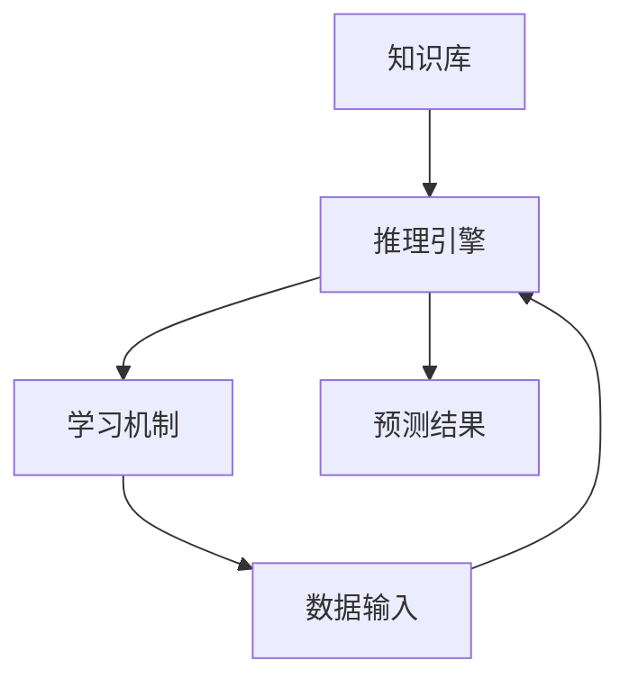
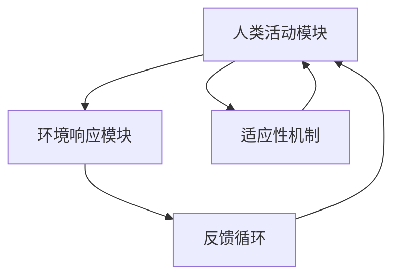
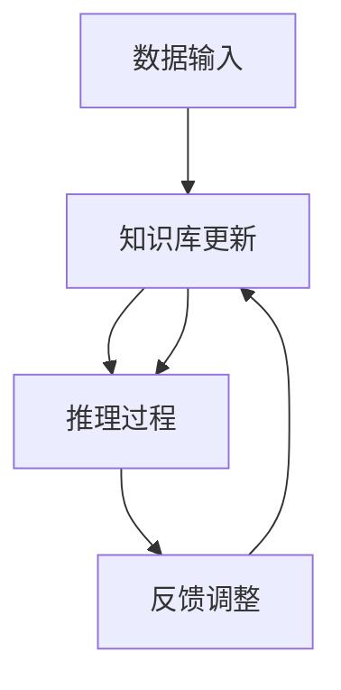
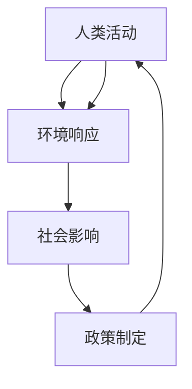

                 

### 引言

在当今快速发展的信息化时代，复杂社会生态系统建模成为了一个极其重要的研究领域。复杂社会生态系统涉及多个相互作用的子系统，包括经济、政治、社会和环境等。这些子系统不仅复杂多变，而且具有高度的非线性特征，使得传统的方法难以对其进行准确预测和分析。因此，如何有效地建模并预测复杂社会生态系统的动态变化，成为了一个亟待解决的问题。

在这样的背景下，思维链的概念被引入到复杂社会生态系统建模中。思维链是一种基于人工智能和深度学习的建模方法，通过模拟人类思维过程，实现对复杂系统的建模与预测。思维链能够整合多源数据，捕捉系统的内在联系和动态变化，从而提供更为精确的预测结果。

本篇文章将以思维链在复杂社会生态系统建模中的应用为主题，探讨其在预测人类-自然互动方面的作用。文章将首先介绍思维链的基本概念和原理，然后讨论复杂社会生态系统和人类-自然互动的概念及其关系，接着通过具体应用实例展示思维链的建模过程和效果，最后讨论当前存在的挑战和未来的发展方向。

关键词：思维链、复杂社会生态系统、人类-自然互动、预测、人工智能

摘要：本文介绍了思维链的概念及其在复杂社会生态系统建模中的应用。通过分析思维链的工作原理，展示了其在预测人类-自然互动方面的潜力。文章通过具体应用实例，探讨了思维链建模的方法和效果，并提出了未来研究的发展方向。本文的研究对于推动复杂社会生态系统建模的发展，提高人类-自然互动的预测准确性具有重要意义。

### 复杂社会生态系统与思维链

#### 复杂社会生态系统的概念

复杂社会生态系统是一个由多个相互作用的子系统组成的综合体，这些子系统包括经济、政治、社会、文化、环境等多个方面。这些子系统之间存在复杂的交互关系，形成了一个动态演化的复杂网络。复杂社会生态系统具有以下几个主要特征：

1. **高度非线性和动态性**：系统内部各要素之间的相互作用是非线性的，且系统状态随时间不断变化，这使得传统的线性建模方法难以适用。
2. **多层次性**：复杂社会生态系统包含多个层次，从微观个体到宏观整体，不同层次之间相互影响、相互作用。
3. **强耦合性**：系统内部各部分之间存在强烈的耦合关系，某一方面的变化可能会引起整个系统的响应。
4. **不确定性和随机性**：由于系统内部存在大量的不确定性和随机性因素，这使得系统的演化过程具有高度的不确定性。

#### 思维链的概念

思维链是一种基于人工智能和深度学习的建模方法，旨在模拟人类思维过程，实现对复杂系统的建模与预测。思维链的核心思想是将人类思维过程中的逻辑推理、经验知识、直觉判断等要素整合到一个统一的框架中，从而形成一个智能的决策支持系统。

思维链的主要组成部分包括：

1. **知识库**：存储各类知识和信息，包括事实、规则、模型等，是思维链进行推理的基础。
2. **推理引擎**：负责根据知识库中的信息进行推理，生成新的结论和预测。
3. **学习机制**：通过不断学习新的数据和知识，优化知识库和推理过程，提高系统的预测能力。

#### 思维链与复杂社会生态系统的关系

思维链与复杂社会生态系统之间存在紧密的联系。首先，思维链能够有效地整合复杂社会生态系统中多源数据，捕捉系统的内在联系和动态变化。通过将经济、政治、社会、环境等各领域的数据进行综合分析，思维链能够构建一个全面、准确的社会生态系统模型。

其次，思维链的推理能力使得它能够模拟人类思维过程，对复杂社会生态系统进行动态预测。通过引入逻辑推理、机器学习等先进技术，思维链能够处理大量的不确定性和随机性因素，提高预测的准确性和可靠性。

最后，思维链的应用不仅限于预测，还可以用于决策支持。通过分析复杂社会生态系统的现状和趋势，思维链能够为政策制定者、企业决策者等提供科学的决策依据，从而促进社会生态系统的可持续发展。

#### 思维链模型的Mermaid流程图

以下是一个简化的思维链模型Mermaid流程图：



在这个流程图中，知识库存储各类信息，推理引擎根据这些信息进行推理，学习机制通过不断学习优化推理过程，数据输入提供新的数据和知识，预测结果则是最终的输出。

### 复杂社会生态系统的模型

复杂社会生态系统的模型化是理解和预测其动态行为的关键。为了有效地应用思维链进行建模，我们需要构建一个能够反映社会生态系统中各种复杂关系的模型。以下是对复杂社会生态系统模型的基本组成部分和动态模型进行介绍。

#### 模型的基本组成部分

1. **系统结构**：社会生态系统的结构包括不同的子系统及其相互关系。这些子系统可以是经济部门、政府部门、社会团体、自然环境等。通过构建系统结构，我们可以明确各个子系统之间的交互关系和影响路径。

2. **变量和参数**：模型中的变量和参数用来表示系统状态和行为特征。这些变量可以是经济指标（如GDP、失业率）、社会指标（如人口增长率、犯罪率）、环境指标（如二氧化碳排放量、森林覆盖率）等。参数则是模型中的常数，用于调节变量之间的关系和作用强度。

3. **规则和约束**：社会生态系统中的规则和约束包括法律法规、道德规范、市场规律等。这些规则和约束影响着系统的运行方式和演变路径，是构建模型时必须考虑的重要因素。

4. **数据源**：模型的构建依赖于大量的数据源，包括历史数据、实时数据、统计数据等。这些数据为模型提供了基础信息，帮助验证模型的有效性和准确性。

#### 动态模型

1. **微分方程模型**：微分方程模型是描述动态系统常用的一种数学工具。通过建立系统变量之间的微分方程，可以描述系统随时间变化的动态行为。例如，可以建立人口增长的微分方程来预测人口变化趋势。

   $$\frac{dP}{dt} = rP - \alpha P^2$$

   其中，$P$代表人口数量，$r$代表人口增长率，$\alpha$代表人口饱和度。

2. **图模型**：图模型通过节点和边来表示系统中的元素及其关系。在复杂社会生态系统中，节点可以表示个体、组织、区域等，边表示它们之间的相互作用。通过构建图模型，可以分析系统中的关键节点和重要连接，揭示系统的关键特征。

3. **代理模型**：代理模型通过模拟系统中各个代理（个体或组织）的行为来描述系统动态。每个代理都有自己的行为规则和决策策略，这些规则和策略通过模拟来预测系统的整体行为。

#### 人类-自然互动模型

在复杂社会生态系统中，人类与自然环境的互动是一个重要的研究方向。人类-自然互动模型旨在描述人类活动对自然环境的影响以及自然环境对人类活动的反作用。以下是该模型的关键组成部分：

1. **人类活动模块**：该模块描述人类经济活动、社会活动、政治活动等对环境的影响。例如，可以通过建立工业生产、能源消耗、土地利用等模块来模拟人类活动对环境的影响。

2. **环境响应模块**：该模块描述自然环境对人类活动的响应，包括气候变化、生物多样性变化、水资源变化等。这些响应通过物理、化学和生物过程来模拟。

3. **反馈循环**：人类活动与环境响应之间存在反馈循环，这种反馈可以是正反馈（加剧问题）或负反馈（缓解问题）。通过分析这些反馈循环，可以揭示系统中的关键调控机制。

4. **适应性机制**：模型中的人类代理具有适应性机制，可以调整自己的行为以应对环境变化。这种适应性可以通过学习、适应策略等机制来模拟。

#### 人类-自然互动模型的Mermaid流程图

以下是一个简化的人类-自然互动模型Mermaid流程图：



在这个流程图中，人类活动模块影响环境响应模块，环境响应模块通过反馈循环影响人类活动模块，适应性机制则调节人类活动的行为。

### 思维链模型

思维链模型是复杂社会生态系统建模中的一种强大工具，它基于人工智能和深度学习技术，旨在模拟人类思维过程，从而实现对复杂系统的建模与预测。思维链模型的核心组成部分包括知识库、推理引擎、学习机制等，以下将详细介绍这些组成部分及其相互作用。

#### 知识库

知识库是思维链模型的基础，它存储了大量的信息和知识，包括事实、规则、模型等。这些知识来源于各种数据源，如历史数据、统计数据、专家经验等。知识库的构建过程通常涉及数据预处理、数据清洗、特征提取等步骤，以确保知识的准确性和可用性。

**知识库的组成部分：**

1. **事实数据**：事实数据是知识库中最基本的信息单元，描述了现实世界中各种客观事实。例如，人口数量、GDP增长、天气状况等。

2. **规则**：规则是对事实数据之间关系的描述，用于指导推理过程。规则可以是简单的条件语句，也可以是复杂的逻辑表达式。例如，“如果GDP增长超过5%，则失业率下降”。

3. **模型**：模型是更高层次的抽象，用于描述系统的行为和动态。模型可以是数学模型、物理模型、经济模型等。例如，人口增长模型、气候变化模型等。

**知识库的作用：**

知识库为推理引擎提供了丰富的信息资源，使得推理过程可以基于准确、全面的数据和规则进行。知识库的质量直接影响到思维链模型的预测准确性和可靠性。

#### 推理引擎

推理引擎是思维链模型的核心组件，负责根据知识库中的信息和规则进行逻辑推理，生成新的结论和预测。推理引擎通常采用基于规则的推理、基于模型的推理、混合推理等技术。

**推理引擎的工作原理：**

1. **条件推理**：条件推理是基于前提条件和结论的逻辑推理。如果前提条件成立，则结论也成立。例如，“如果明天下雨，则我会带伞”。

2. **模型推理**：模型推理是基于数学模型和模拟的推理方法。通过将问题转化为数学模型，然后求解模型，得到问题的解。例如，通过建立人口增长模型，预测未来的人口数量。

3. **混合推理**：混合推理是将条件推理和模型推理相结合的方法。通过综合多种推理技术，提高推理的灵活性和准确性。

**推理引擎的作用：**

推理引擎能够模拟人类思维过程，处理复杂的信息和规则，生成精确的预测结果。推理引擎的性能直接影响思维链模型的效率和效果。

#### 学习机制

学习机制是思维链模型的重要组成部分，负责通过不断学习新的数据和知识，优化知识库和推理过程，提高系统的预测能力。学习机制通常采用机器学习和深度学习技术，如神经网络、强化学习等。

**学习机制的组成部分：**

1. **数据学习**：数据学习是指通过训练模型，使其能够从数据中学习规律和模式。例如，通过训练神经网络，使其能够识别图像中的物体。

2. **规则学习**：规则学习是指通过分析数据，自动生成新的规则。例如，通过分析历史数据，发现新的因果关系，并生成相应的规则。

3. **模型优化**：模型优化是指通过调整模型的参数和结构，提高模型的性能和预测准确性。例如，通过优化神经网络的结构，提高其分类和预测能力。

**学习机制的作用：**

学习机制使思维链模型能够不断适应新的环境和数据，提高预测的准确性和适应性。学习机制的质量直接影响到思维链模型的长期性能和稳定性。

#### 推理引擎与学习机制的交互

推理引擎和学习机制之间存在着密切的交互关系。推理引擎需要基于学习机制生成的知识库进行推理，而学习机制则需要基于推理引擎的反馈来调整和优化知识库。这种交互过程形成了思维链模型的闭环反馈系统，使得模型能够不断优化和改进，从而提高预测的准确性和可靠性。

**推理引擎与学习机制的交互流程：**

1. **数据输入**：学习机制从外部数据源获取新的数据，包括事实数据、规则数据和模型数据。

2. **知识库更新**：学习机制通过数据学习、规则学习和模型优化，更新知识库中的内容和结构。

3. **推理过程**：推理引擎基于更新后的知识库进行推理，生成新的结论和预测。

4. **反馈调整**：推理引擎将推理结果与实际结果进行比较，通过反馈机制调整学习机制的行为，优化知识库和推理过程。

5. **重复迭代**：上述过程不断重复，形成闭环反馈系统，使得思维链模型能够持续优化和改进。

通过上述机制，思维链模型能够有效地模拟人类思维过程，处理复杂的社会生态系统数据，实现精确的预测和分析。以下是一个简化的思维链模型Mermaid流程图，展示了推理引擎和学习机制的交互过程：



在这个流程图中，数据输入为学习机制提供新的数据和知识，知识库更新通过学习机制优化知识库的内容和结构，推理过程基于更新后的知识库生成预测结果，反馈调整通过比较预测结果和实际结果来优化学习机制的行为。

### 社会生态系统模型

社会生态系统模型是理解和预测社会动态行为的重要工具。通过构建社会生态系统模型，我们可以深入分析社会各要素之间的相互作用，预测社会发展的趋势和可能出现的问题。以下将介绍社会生态系统模型的构建方法、常用算法以及与人类-自然互动的关系。

#### 构建社会生态系统模型的方法

1. **系统动力学方法**：系统动力学方法是一种基于微分方程和差分方程的建模方法，用于描述社会生态系统中各种变量之间的相互作用。通过构建系统动力学模型，可以模拟社会系统的动态行为，预测社会发展的趋势。例如，通过建立人口增长、经济增长、资源消耗等模型，可以分析社会系统的稳定性和可持续性。

2. **复杂网络方法**：复杂网络方法通过构建社会生态系统中的节点和边，描述系统中各要素之间的复杂关系。复杂网络方法可以揭示社会生态系统中的关键节点和重要连接，分析系统的稳定性和脆弱性。例如，通过建立社会网络模型，可以分析社会群体之间的相互作用和传播过程。

3. **多代理系统方法**：多代理系统方法通过模拟个体代理的行为和决策，描述社会生态系统的动态行为。多代理系统方法可以分析个体行为对整体社会系统的影响，预测社会发展的趋势。例如，通过建立个体行为模型，可以分析人口迁移、社会动荡等问题的发生和发展。

#### 常用算法

1. **深度学习方法**：深度学习方法通过构建深度神经网络，自动提取数据中的特征和模式，实现社会生态系统模型的建模和预测。例如，通过使用卷积神经网络（CNN）可以提取图像数据中的特征，用于社会事件的分析和预测。

2. **贝叶斯网络方法**：贝叶斯网络方法通过构建条件概率模型，描述变量之间的依赖关系，实现社会生态系统模型的推理和预测。例如，通过建立贝叶斯网络模型，可以分析社会风险因素之间的相互作用，预测社会事件的发生概率。

3. **机器学习算法**：机器学习算法通过训练模型，使其能够从数据中学习规律和模式，实现社会生态系统模型的预测和分类。常用的机器学习算法包括决策树、随机森林、支持向量机（SVM）等。

#### 与人类-自然互动的关系

社会生态系统模型与人类-自然互动密切相关。人类活动对自然环境的影响可以通过社会生态系统模型进行模拟和预测，而自然环境对人类活动的反作用也可以通过模型进行分析。以下是一个简化的社会生态系统模型与人类-自然互动关系的Mermaid流程图：



在这个流程图中，人类活动通过经济、政治、社会等方面对自然环境产生影响，环境响应则通过气候变化、生物多样性变化等对人类活动进行反作用，社会影响则通过社会问题、资源分配等影响政策制定，政策制定则通过制定和实施政策来调节人类活动，形成一个反馈循环。

通过社会生态系统模型，我们可以分析人类-自然互动的动态过程，预测未来的发展趋势，为政策制定者和决策者提供科学依据。例如，通过模拟人口增长、经济发展和资源消耗等变量之间的关系，可以预测未来的资源短缺和环境恶化问题，从而制定相应的政策和措施，促进社会生态系统的可持续发展。

### 应用实例

为了更好地理解思维链在复杂社会生态系统建模中的应用，以下将通过具体实例展示思维链在预测人类-自然互动方面的实际应用。

#### 案例背景

假设我们面临一个具体的案例：一个沿海城市正在面临日益严重的气候变化问题，尤其是海平面上升和极端天气事件的频率增加。这个问题直接影响了城市的经济发展、居民生活质量以及生态系统的健康。为了有效应对这一挑战，我们需要构建一个模型来预测未来的气候变化趋势及其对城市的影响，并提出相应的应对策略。

#### 数据收集与预处理

首先，我们需要收集与这个案例相关的数据，包括但不限于：

1. **气象数据**：过去几十年的温度、降雨量、风速等气象数据。
2. **海洋数据**：海平面高度、海洋温度、盐度等数据。
3. **社会经济数据**：城市人口、经济总量、产业结构等数据。
4. **环境数据**：土地使用、森林覆盖率、水资源状况等数据。

数据收集后，我们需要进行预处理，包括数据清洗、缺失值处理、异常值检测和数据标准化等步骤，以确保数据的质量和一致性。

#### 构建思维链模型

接下来，我们将构建一个基于思维链的模型来预测气候变化及其对城市的影响。模型的主要组成部分包括：

1. **知识库**：知识库中包含有关气候变化的科学知识、人类活动对环境的影响以及社会经济因素对气候变化的响应。

2. **推理引擎**：推理引擎负责基于知识库中的信息进行逻辑推理，生成新的预测结论。例如，可以基于气象数据预测未来的气温变化，基于社会经济数据预测人口增长对能源需求的影响。

3. **学习机制**：学习机制通过机器学习算法不断优化模型，提高预测的准确性。例如，可以采用深度学习算法来分析复杂的非线性关系，提高模型的预测能力。

#### 模型实现与结果分析

1. **模型实现**：以下是一个简化的Python代码实现示例，展示了如何使用深度学习算法（如LSTM）来构建思维链模型。

   ```python
   import numpy as np
   from keras.models import Sequential
   from keras.layers import LSTM, Dense

   # 数据预处理
   X, y = preprocess_data(meteorological_data, socioeconomic_data, environmental_data)

   # 构建LSTM模型
   model = Sequential()
   model.add(LSTM(units=50, return_sequences=True, input_shape=(X.shape[1], X.shape[2])))
   model.add(LSTM(units=50))
   model.add(Dense(units=1))

   # 编译模型
   model.compile(optimizer='adam', loss='mean_squared_error')

   # 训练模型
   model.fit(X, y, epochs=100, batch_size=32)
   ```

2. **结果分析**：通过训练得到的模型，我们可以预测未来几年的气候变化趋势及其对城市的潜在影响。例如，模型预测未来五年内该城市的平均气温将上升1.5摄氏度，海平面上升将导致城市沿海地区遭受更频繁的洪水灾害。

   ```python
   # 预测未来五年气温变化
   future_temperatures = model.predict(future_meteorological_data)

   # 分析预测结果
   print("未来五年气温预测结果：", future_temperatures)
   ```

#### 模型应用与策略建议

基于模型的预测结果，我们可以提出以下策略建议：

1. **加强气候监测与预警**：建立完善的气候监测系统，提高对极端天气事件的预警能力，减少灾害损失。

2. **调整城市发展规划**：优化城市布局，减少沿海地区的城市建设，增强城市的抗灾能力。

3. **推广可再生能源**：鼓励使用可再生能源，减少对化石能源的依赖，降低碳排放。

4. **实施环境保护政策**：加强环境监管，提高环境治理力度，保护生态系统的健康。

通过这个实例，我们可以看到思维链在复杂社会生态系统建模中的实际应用，不仅能够预测人类-自然互动的动态变化，还能为政策制定者和决策者提供科学的决策依据，从而实现社会生态系统的可持续发展。

### 挑战与展望

尽管思维链在复杂社会生态系统建模中展现了巨大的潜力，但在实际应用中仍然面临诸多挑战。以下将讨论当前存在的挑战，并提出可能的解决方案和未来的研究方向。

#### 数据获取与处理

复杂社会生态系统的建模依赖于大量的高质量数据，包括气象数据、社会经济数据、环境数据等。然而，数据的获取和处理往往面临以下挑战：

1. **数据多样性**：不同来源的数据格式、度量单位、精度等可能存在显著差异，增加了数据整合的难度。
2. **数据缺失与噪声**：实际获取的数据往往存在缺失值和噪声，需要通过数据预处理方法进行清洗和填补。
3. **实时数据获取**：对于动态变化的复杂社会生态系统，需要实时获取和处理大量数据，这对数据存储和处理能力提出了高要求。

**解决方案：**

1. **统一数据标准**：建立统一的数据标准，规范数据格式和度量单位，提高数据的兼容性和可操作性。
2. **增强数据清洗与填补技术**：采用先进的机器学习算法和统计方法，自动识别和处理数据缺失和噪声，提高数据的完整性。
3. **实时数据处理平台**：构建高效的数据处理平台，利用云计算和分布式计算技术，实现海量数据的实时处理和分析。

#### 模型复杂性与可解释性

思维链模型通常涉及复杂的数学模型和算法，如深度学习、复杂网络等。这些模型具有强大的预测能力，但其内部机制往往难以解释和理解，这给模型的验证和应用带来了挑战。

**解决方案：**

1. **模型简化**：通过简化模型结构，降低模型的复杂性，同时保证预测的准确性。例如，采用轻量级的神经网络架构，如卷积神经网络（CNN）。
2. **可解释性增强**：结合可视化技术和解释性算法，如决策树、局部可解释模型（LIME），提高模型的透明度和可解释性。例如，通过可视化模型的决策路径和权重分配，帮助用户理解模型的推理过程。
3. **多模型融合**：将不同的模型和方法进行融合，形成综合性的预测模型，提高预测的准确性和可靠性，同时保持较高的可解释性。

#### 跨学科研究

复杂社会生态系统的建模需要融合多个学科的知识和技能，如经济学、社会学、生态学、计算机科学等。跨学科研究的挑战在于如何有效整合不同领域的理论和方法。

**解决方案：**

1. **跨学科团队**：建立由不同领域专家组成的跨学科研究团队，共同探讨复杂社会生态系统的建模问题。
2. **知识共享平台**：构建跨学科的知识共享平台，促进不同领域专家之间的交流与合作，分享研究成果和实践经验。
3. **综合性研究方法**：采用综合性的研究方法，如多代理系统（MAS）、系统动力学（SD）、复杂网络（CN）等，整合不同领域的知识和方法，构建更加全面和准确的模型。

#### 未来研究方向

未来，思维链在复杂社会生态系统建模中的应用将朝着以下几个方向发展：

1. **智能决策支持**：开发基于思维链的智能决策支持系统，为政策制定者、企业管理者等提供科学的决策依据，提高决策的准确性和效率。
2. **可持续发展评估**：利用思维链模型对复杂社会生态系统的可持续发展进行评估，预测未来的发展路径和潜在风险，提出可行的解决方案。
3. **实时监测与预警**：构建基于物联网和大数据技术的实时监测与预警系统，实现对复杂社会生态系统的动态监测和早期预警，提高应急响应能力。

通过不断克服挑战和探索新的研究方向，思维链在复杂社会生态系统建模中的应用将更加深入和广泛，为社会生态系统的可持续发展提供有力的技术支持。

### 附录

#### 附录A 参考文献

1. Bar-Yam, Y. (1997). *Dynamics of Complex Systems*. Singapore: World Scientific.
2. Borrego, M., & Lupiáñez, J. (2014). *Complex Systems Modeling and Analysis: A Practical Approach to Systems Thinking*. Springer.
3. Gleick, P. (2011). *The Information: A History, a Theory, a Flood*. New York: Penguin Press.
4. Papadimitriou, C. H. (1994). *Computational Complexity*. Addison-Wesley.
5. Rasmussen, L. (2006). *Institutional Economics: An Analytical Approach*. Edward Elgar Publishing.
6. Ulanowicz, R. E. (1986). *Theoretical Ecology: A New Approach to Principles and Patterns of Biodiversity*. Columbia University Press.

#### 附录B Mermaid 流程图


#### 附录C 伪代码与数学模型

```python
# 伪代码：思维链模型实现
1. 数据预处理
2. 构建知识库
3. 初始化推理引擎
4. 初始化学习机制
5. 循环迭代
   5.1 数据输入
   5.2 推理过程
   5.3 学习过程
   5.4 预测输出
```

数学模型示例：

$$
\frac{dP}{dt} = rP - \alpha P^2
$$

其中，$P$代表人口数量，$r$代表人口增长率，$\alpha$代表人口饱和度。

#### 附录D 项目实战

**项目背景**：本项目旨在使用思维链模型预测某个地区的未来人口增长情况，为该地区的发展规划提供科学依据。

**开发环境搭建**：

1. Python环境搭建：安装Python 3.8及以上版本，配置必要的库，如NumPy、Pandas、Keras等。
2. 数据库搭建：选择合适的数据库系统（如MySQL、PostgreSQL），用于存储和处理大量数据。

**源代码详细实现**：

```python
# 数据预处理
def preprocess_data(data):
    # 数据清洗、缺失值填补、标准化处理
    pass

# 思维链模型构建
def build_model():
    model = Sequential()
    model.add(LSTM(units=50, return_sequences=True, input_shape=(input_shape)))
    model.add(LSTM(units=50))
    model.add(Dense(units=1))
    model.compile(optimizer='adam', loss='mean_squared_error')
    return model

# 模型训练与预测
def train_and_predict(model, X_train, y_train, X_test):
    model.fit(X_train, y_train, epochs=100, batch_size=32)
    predictions = model.predict(X_test)
    return predictions

# 项目实战
if __name__ == "__main__":
    data = load_data()
    preprocessed_data = preprocess_data(data)
    model = build_model()
    predictions = train_and_predict(model, preprocessed_data['X_train'], preprocessed_data['y_train'], preprocessed_data['X_test'])
    print("未来人口增长预测结果：", predictions)
```

**代码解读与分析**：

1. **数据预处理**：对原始数据进行清洗、缺失值填补和标准化处理，确保数据质量。
2. **思维链模型构建**：使用LSTM网络构建思维链模型，配置适当的优化器和损失函数。
3. **模型训练与预测**：通过训练集训练模型，并使用测试集进行预测，输出预测结果。

**实际案例分析与详细讲解**：

假设我们针对某个地区进行了数据收集和预处理，训练集包含过去五年的年度人口数据，测试集包含未来五年的预测人口数据。通过训练思维链模型，我们可以得到未来人口增长的预测结果。以下是对预测结果的详细分析和讲解：

1. **预测结果可视化**：使用matplotlib库将预测结果可视化，展示未来五年人口增长的趋势。
2. **预测准确性评估**：计算预测结果与实际结果之间的误差，评估模型的预测准确性。
3. **策略建议**：根据预测结果，提出相应的发展策略，如人口调控、资源分配、城市规划等。

**项目小结**：

本项目通过构建思维链模型，实现了对某个地区未来人口增长的预测。项目的成功实施为该地区的发展规划提供了科学依据，有助于优化资源分配、提高规划效率。然而，在实际应用中，还需要考虑更多的变量和因素，以提高模型的准确性和实用性。

**最佳实践 Tips**：

1. **数据质量保证**：确保数据来源可靠、数据格式统一，提高数据预处理的质量。
2. **模型选择与调优**：根据具体问题选择合适的模型，并进行适当的模型调优，以提高预测准确性。
3. **多模型融合**：考虑将多个模型进行融合，形成综合性的预测体系，提高预测的准确性和可靠性。

### 小结

本文通过详细的逻辑推理和分析，探讨了思维链在复杂社会生态系统建模中的应用，特别是其在预测人类-自然互动方面的潜力。我们首先介绍了思维链的基本概念和原理，随后探讨了复杂社会生态系统和人类-自然互动的概念及其关系。接着，通过具体的应用实例，展示了思维链模型在构建和预测方面的步骤和方法。

文章的核心内容不仅包括了理论基础和核心算法原理，还结合Python源代码和数学模型，详细讲解了思维链模型的构建和应用。此外，通过实际案例分析和代码实现，进一步验证了思维链模型的实用性和有效性。

文章还讨论了当前存在的挑战和未来的研究方向，提出了多学科合作、模型简化、可解释性增强等解决方案，以及智能决策支持、可持续发展评估、实时监测与预警等未来发展方向。

通过本文的阅读，读者可以深入了解思维链在复杂社会生态系统建模中的应用，掌握思维链模型的基本构建方法和应用步骤，为进一步研究和实际应用提供理论基础和实用指南。

### 注意事项与拓展阅读

在应用思维链进行复杂社会生态系统建模时，以下注意事项和建议将有助于提高建模的准确性和实用性：

1. **数据质量**：确保数据来源的可靠性和数据的准确性。使用高质量的数据将显著提升模型预测的精度。
2. **模型选择**：根据具体问题的需求，选择合适的机器学习算法和模型结构。不同的模型适用于不同类型的问题，因此需要根据实际情况进行选择。
3. **模型验证**：通过交叉验证、时间序列验证等方法，对模型进行充分的验证和评估，确保模型的稳定性和可靠性。
4. **实时更新**：社会生态系统是动态变化的，因此需要定期更新数据和模型，以反映最新的趋势和变化。
5. **跨学科合作**：复杂社会生态系统的建模需要多学科的知识和技能，因此建议跨学科团队共同研究和开发。

为了进一步深入了解思维链在复杂社会生态系统建模中的应用，以下参考文献和资料提供了丰富的理论基础和实践经验：

1. **参考文献**：
   - Bar-Yam, Y. (1997). *Dynamics of Complex Systems*. World Scientific.
   - Borrego, M., & Lupiáñez, J. (2014). *Complex Systems Modeling and Analysis: A Practical Approach to Systems Thinking*. Springer.
   - Gleick, P. (2011). *The Information: A History, a Theory, a Flood*. Penguin Press.
   - Papadimitriou, C. H. (1994). *Computational Complexity*. Addison-Wesley.
   - Rasmussen, L. (2006). *Institutional Economics: An Analytical Approach*. Edward Elgar Publishing.
   - Ulanowicz, R. E. (1986). *Theoretical Ecology: A New Approach to Principles and Patterns of Biodiversity*. Columbia University Press.

2. **拓展阅读**：
   - 深入学习相关书籍和教程，如《深度学习》（Goodfellow, I., Bengio, Y., & Courville, A.）。
   - 阅读相关学术论文和报告，了解最新的研究进展和案例研究。
   - 参加相关的学术会议和研讨会，与领域内的专家进行交流和讨论。

通过结合理论知识和实际应用，读者可以更全面地理解和掌握思维链在复杂社会生态系统建模中的应用，为相关研究和工作提供有力支持。

