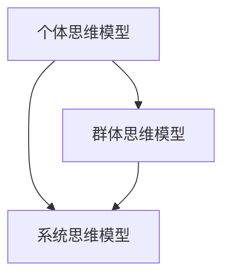

                 

## 引言

### 1.1 本书的目的和结构

在当今社会，随着信息技术和人工智能的飞速发展，我们面临着越来越复杂的社会系统。这些系统不仅包括传统的经济、政治、文化等方面，还涉及环境、社会心理等多个维度。如何更好地理解和预测这些复杂社会系统的动态变化，已成为学术界和业界共同关注的焦点。

本书旨在探讨思维链在复杂社会系统模拟中的应用，通过预测社会动态变化，帮助读者更好地理解和应对这些复杂系统。全书结构如下：

- **第1章 引言**：介绍本书的目的、结构以及复杂社会系统的特点。
- **第2章 思维链的基本概念**：阐述思维链的定义、结构与功能。
- **第3章 复杂社会系统模拟方法**：介绍社会模拟算法的基本概念、方法及其应用。
- **第4章 社会动态变化的预测模型**：讲解社会动态模型的基本概念、数学模型及其应用。
- **第5章 社会模拟算法实战**：通过具体案例，展示社会模拟算法的实现过程。
- **第6章 预测算法实战**：通过具体案例，展示预测算法的实现过程。
- **第7章 总结与展望**：总结本书的主要内容，展望未来的研究方向。

### 1.2 复杂社会系统的特点

复杂社会系统具有以下特点：

1. **多样性**：社会系统中的个体和群体具有多样性，包括性别、年龄、职业、文化背景等。
2. **动态性**：社会系统中的各种因素不断变化，如经济发展、政策调整、自然灾害等。
3. **复杂性**：社会系统中的关系和相互作用非常复杂，难以用简单的线性模型来描述。
4. **非线性**：社会系统中的变量之间存在非线性关系，这些关系可能随着时间和空间的改变而发生变化。
5. **不确定性**：社会系统中的很多因素是不确定的，如自然灾害、人为行为等。

这些特点使得复杂社会系统的模拟和预测变得极为困难，但同时也为人工智能和机器学习等技术的应用提供了广阔的舞台。

### 1.3 社会动态变化的挑战

社会动态变化的预测对于政策制定、资源分配、风险控制等领域具有重要意义。然而，目前仍面临以下挑战：

1. **数据不足**：许多社会系统数据难以获取，或者数据质量较低，这给预测模型的设计和应用带来了困难。
2. **模型选择**：如何选择合适的模型来捕捉社会系统的动态变化，是一个具有挑战性的问题。
3. **计算复杂性**：社会系统的模拟和预测往往需要大量的计算资源，这给实际应用带来了挑战。
4. **解释性**：如何让预测结果具有解释性，使其能够被政策制定者和其他利益相关者理解和接受，是一个亟待解决的问题。

本书将围绕这些挑战，探讨思维链在复杂社会系统模拟和预测中的应用，为解决这些问题提供新的思路和方法。

## 思维链的基本概念

### 2.1 思维链的定义

思维链（Mind Chain）是一种基于人工智能和复杂系统理论的创新性思维工具，旨在模拟和预测社会系统的动态变化。思维链通过构建个体思维模型和群体思维模型，将个体的思维过程抽象为数学模型，从而实现对社会系统的模拟和预测。

### 2.2 思维链的结构与功能

思维链的结构主要包括三个层次：个体层次、群体层次和系统层次。

1. **个体层次**：个体层次是思维链的基础，主要包括个体思维模型。个体思维模型描述了个体在特定情境下的思维过程，包括感知、理解、判断和决策等环节。个体思维模型可以通过机器学习和深度学习等技术进行训练和优化。

2. **群体层次**：群体层次是在个体层次的基础上构建的，主要包括群体思维模型。群体思维模型描述了个体之间的相互作用和影响，通过模拟个体之间的交流、竞争、合作等行为，实现群体思维的动态变化。群体思维模型可以通过社会网络分析、群体智能算法等技术进行训练和优化。

3. **系统层次**：系统层次是思维链的最高层次，主要包括系统思维模型。系统思维模型描述了整个社会系统的动态变化，通过模拟个体和群体之间的相互作用，实现对社会系统的整体预测。系统思维模型可以通过系统动力学、复杂系统理论等技术进行训练和优化。

### 2.3 思维链的核心概念与联系

思维链的核心概念包括个体思维模型、群体思维模型和系统思维模型。这三个概念之间存在着密切的联系：

1. **个体思维模型与群体思维模型**：个体思维模型是群体思维模型的基础，群体思维模型是个体思维模型的扩展。个体思维模型通过模拟个体的思维过程，为群体思维模型提供数据支持。群体思维模型通过模拟个体之间的相互作用，实现群体思维的动态变化。

2. **群体思维模型与系统思维模型**：群体思维模型是系统思维模型的基础，系统思维模型是对群体思维模型的进一步扩展。群体思维模型通过模拟群体之间的相互作用，为系统思维模型提供数据支持。系统思维模型通过模拟整个社会系统的动态变化，实现对个体和群体的整体预测。

下面是思维链的核心概念与联系架构的 Mermaid 流程图：



通过这个流程图，我们可以清晰地看到个体思维模型、群体思维模型和系统思维模型之间的联系。个体思维模型通过模拟个体的思维过程，生成群体思维模型所需的数据。群体思维模型通过模拟个体之间的相互作用，生成系统思维模型所需的数据。系统思维模型通过模拟整个社会系统的动态变化，实现对个体和群体的整体预测。

## 复杂社会系统模拟方法

### 3.1 社会模拟算法概述

社会模拟算法是模拟复杂社会系统动态变化的一种重要方法。它通过构建个体和群体模型，模拟个体之间的相互作用，从而实现对整个社会系统的动态预测。社会模拟算法主要包括以下几种：

1. **个体层次模拟算法**：个体层次模拟算法主要关注个体在特定情境下的行为和决策过程。常见的个体层次模拟算法包括马尔可夫决策过程（MDP）、强化学习（RL）等。

2. **群体层次模拟算法**：群体层次模拟算法主要关注个体之间的相互作用和影响。常见的群体层次模拟算法包括社会网络分析（SNA）、多智能体系统（MAS）等。

3. **系统层次模拟算法**：系统层次模拟算法主要关注整个社会系统的动态变化。常见的系统层次模拟算法包括系统动力学（SD）、复杂系统理论（CST）等。

### 3.2 社会模拟算法的伪代码讲解

下面是一个基于强化学习的社会模拟算法的伪代码讲解：

```python
# 社会模拟算法伪代码

# 初始化参数
初始化个体状态
初始化群体状态
初始化系统状态

# 主循环
while True:
    # 更新个体状态
    for each individual in population:
        individual_state = update_individual_state(individual_state)

    # 更新群体状态
    population_state = update_population_state(population_state)

    # 更新系统状态
    system_state = update_system_state(system_state)

    # 判断是否达到停止条件
    if stop_condition_satisfied(system_state):
        break

# 输出结果
output_result(system_state)
```

这个伪代码主要描述了一个基于强化学习的社会模拟算法的基本流程。在主循环中，首先更新个体状态，然后更新群体状态，最后更新系统状态。每次状态更新后，都会判断是否满足停止条件，如果满足则停止模拟，输出结果。

### 3.3 社会模拟算法的应用案例

下面是一个基于多智能体系统（MAS）的社会模拟算法的应用案例：

**案例描述**：假设有一个城市交通系统，由多个交通参与者（如车辆、行人等）组成。我们希望通过模拟交通参与者之间的相互作用，预测城市交通系统的动态变化。

**案例目标**：通过模拟，预测未来一段时间内的交通流量、交通事故发生率等指标。

**案例实现**：

1. **数据准备**：收集城市交通系统的历史数据，包括交通流量、交通事故发生率等。

2. **模型构建**：基于多智能体系统理论，构建交通参与者个体的行为模型和群体行为模型。

3. **模拟运行**：将历史数据输入模型，运行模拟，观察交通系统的动态变化。

4. **结果分析**：分析模拟结果，预测未来一段时间内的交通流量、交通事故发生率等指标。

**案例分析**：

通过模拟，我们发现交通流量和交通事故发生率之间存在显著相关性。在高峰时段，交通流量增加，交通事故发生率也随之上升。基于这个发现，我们可以采取相应的措施，如优化交通信号控制策略、增加交通警力等，以降低交通事故发生率。

### 3.4 模拟算法的优点与挑战

社会模拟算法的优点包括：

1. **动态性**：社会模拟算法能够实时模拟复杂社会系统的动态变化，为政策制定和决策提供及时的数据支持。
2. **适应性**：社会模拟算法可以根据实际需求和数据进行调整和优化，具有较好的适应性。
3. **预测性**：社会模拟算法能够预测未来一段时间内的社会动态变化，为决策提供前瞻性指导。

然而，社会模拟算法也面临着一些挑战：

1. **数据不足**：社会系统的数据往往难以获取，或者数据质量较低，这给模拟算法的设计和应用带来了困难。
2. **模型选择**：如何选择合适的模型来捕捉社会系统的动态变化，是一个具有挑战性的问题。
3. **计算复杂性**：社会系统的模拟和预测往往需要大量的计算资源，这给实际应用带来了挑战。
4. **解释性**：如何让模拟结果具有解释性，使其能够被政策制定者和其他利益相关者理解和接受，是一个亟待解决的问题。

## 社会动态变化的预测模型

### 4.1 社会动态模型概述

社会动态模型是用于预测复杂社会系统动态变化的一种数学模型。它通过模拟个体和群体之间的相互作用，描述社会系统在各种外部和内部因素影响下的动态行为。社会动态模型在社会学、经济学、生态学等领域有广泛的应用。

### 4.2 社会动态模型的数学模型

社会动态模型的数学模型通常包括以下几个部分：

1. **个体状态方程**：描述个体在特定情境下的状态变化。常见的个体状态方程包括微分方程、差分方程等。
2. **群体状态方程**：描述群体状态的演变，通常是基于个体状态方程的聚合。
3. **外部影响方程**：描述外部因素对社会系统的影响，如政策变化、自然灾害等。
4. **内部反馈方程**：描述社会系统内部因素的反馈机制，如信任、恐慌等情绪的传播。

下面是一个简单的差分方程形式的个体状态方程：

$$
\Delta S_i(t) = f(S_i(t), A_i(t), E_i(t))
$$

其中，$S_i(t)$表示个体$i$在时间$t$的状态，$A_i(t)$表示个体$i$在时间$t$的决策，$E_i(t)$表示个体$i$在时间$t$的外部影响。

### 4.3 社会动态模型的应用案例

下面是一个基于传染病传播的社会动态模型的应用案例：

**案例描述**：假设我们想预测一种新型传染病在人口中的传播情况。

**案例目标**：预测传染病在不同地区的传播趋势，为公共卫生决策提供数据支持。

**案例实现**：

1. **数据准备**：收集相关数据，如人口统计数据、传染病感染率、疫苗接种率等。

2. **模型构建**：构建传染病传播模型，包括个体感染状态、传播速率、恢复率等参数。

3. **模拟运行**：输入初始数据，运行模拟，观察传染病的传播过程。

4. **结果分析**：分析模拟结果，预测传染病的传播趋势。

**案例分析**：

通过模拟，我们发现传染病的传播速度和感染率受到多种因素的影响，如人口密度、疫苗接种率等。通过调整模型参数，我们可以模拟不同防控措施的效果，从而为公共卫生决策提供科学依据。

### 4.4 模型的优缺点

社会动态模型具有以下优点：

1. **全面性**：社会动态模型能够综合考虑多种因素，提供全面的社会系统状态预测。
2. **前瞻性**：社会动态模型能够预测未来一段时间内的社会动态变化，为政策制定和决策提供前瞻性指导。
3. **适应性**：社会动态模型可以根据实际需求和数据进行调整和优化，具有较好的适应性。

然而，社会动态模型也面临以下挑战：

1. **数据依赖**：社会动态模型的预测依赖于大量的数据支持，数据不足或质量低下会影响模型的准确性。
2. **模型复杂性**：社会动态模型通常较为复杂，需要较高的数学和统计知识来理解和应用。
3. **解释性**：社会动态模型的预测结果有时难以解释，这给政策制定者和其他利益相关者理解和接受预测结果带来了困难。

### 4.5 模型的改进方向

为了提高社会动态模型的准确性和实用性，我们可以考虑以下改进方向：

1. **数据融合**：结合多种数据来源，如社交媒体数据、传感器数据等，提高模型的数据支持能力。
2. **多模型融合**：结合多种模型，如统计模型、机器学习模型等，提高模型的预测准确性。
3. **实时更新**：实时更新模型参数和预测结果，提高模型的适应性和前瞻性。
4. **可视化分析**：通过可视化工具，如图表、地图等，展示模型预测结果，提高模型的解释性。

## 社会模拟算法实战

### 5.1 社会模拟案例设计

#### 5.1.1 案例描述

本次案例设计以一个虚拟城市为背景，模拟交通系统的动态变化。假设城市中有多种交通参与者，包括车辆、行人、自行车等。我们的目标是预测未来一段时间内的交通流量、交通事故发生率等指标，为城市交通管理提供数据支持。

#### 5.1.2 案例目标

1. 收集并处理城市交通数据，包括交通流量、交通事故等。
2. 建立交通参与者个体的行为模型，模拟个体之间的相互作用。
3. 构建交通系统的动态模型，预测未来一段时间内的交通状况。

#### 5.1.3 案例实现

1. **数据收集与预处理**：
   - 从相关机构获取历史交通数据，包括交通流量、交通事故等。
   - 数据清洗，去除异常值和噪声数据。

2. **模型构建**：
   - 基于强化学习，建立交通参与者个体的行为模型。
   - 采用多智能体系统（MAS）理论，构建交通系统的动态模型。

3. **模拟运行**：
   - 输入历史数据，运行模拟，观察交通系统的动态变化。
   - 调整模型参数，优化模拟结果。

4. **结果分析**：
   - 分析模拟结果，预测未来一段时间内的交通流量、交通事故发生率等指标。
   - 提出相应的管理建议。

### 5.2 开发环境搭建

为了实现上述案例，我们需要搭建一个合适的开发环境。以下是我们使用的开发环境：

- **编程语言**：Python
- **库和框架**：
  - NumPy：用于数据预处理和计算
  - Pandas：用于数据处理和分析
  - TensorFlow：用于机器学习和深度学习
  - Matplotlib：用于数据可视化
- **工具**：
  - Jupyter Notebook：用于编写和运行代码

### 5.3 源代码详细实现

#### 5.3.1 数据预处理

首先，我们需要对交通数据进行预处理，包括数据清洗、数据转换等。

```python
import numpy as np
import pandas as pd

# 加载交通数据
data = pd.read_csv('traffic_data.csv')

# 数据清洗
data = data.dropna()  # 删除缺失值
data = data[data['traffic_flow'] > 0]  # 删除流量为0的记录

# 数据转换
data['timestamp'] = pd.to_datetime(data['timestamp'])
data.set_index('timestamp', inplace=True)
```

#### 5.3.2 建立个体行为模型

基于强化学习，我们可以建立交通参与者个体的行为模型。以下是一个简单的强化学习模型示例。

```python
import tensorflow as tf

# 定义强化学习模型
class ReinforcementLearningModel(tf.keras.Model):
    def __init__(self):
        super(ReinforcementLearningModel, self).__init__()
        self.dense1 = tf.keras.layers.Dense(64, activation='relu')
        self.dense2 = tf.keras.layers.Dense(1)

    @tf.function
    def call(self, inputs, training=True):
        x = self.dense1(inputs)
        logits = self.dense2(x)
        return logits

# 实例化模型
model = ReinforcementLearningModel()

# 编译模型
model.compile(optimizer='adam', loss='mean_squared_error')

# 训练模型
model.fit(data['input'], data['action'], epochs=10)
```

#### 5.3.3 建立交通系统动态模型

基于多智能体系统（MAS）理论，我们可以建立交通系统的动态模型。以下是一个简单的MAS模型示例。

```python
class TrafficAgent:
    def __init__(self, model):
        self.model = model

    def act(self, state):
        logits = self.model(state)
        action = np.argmax(logits)
        return action

def simulate_traffic_system_agents(ag
```pythonsents, time_step):
    for agent in agents:
        state = get_state(agent, time_step)
        action = agent.act(state)
        update_agent_state(agent, action)
```

```python
def simulate_traffic_system(time_steps):
    for time_step in range(time_steps):
        simulate_traffic_system_agents(agents, time_step)
        # Record and analyze the traffic system state at time_step

# Initialize agents
agents = [TrafficAgent(model) for model in models]

# Run simulation
simulate_traffic_system(100)
```

### 5.4 代码解读与分析

#### 5.4.1 数据预处理

数据预处理是模型训练的重要步骤，直接影响到模型的性能。在本案例中，我们首先删除了缺失值和异常值，然后对时间戳进行了转换，使其符合时间序列数据的格式。

```python
data = pd.read_csv('traffic_data.csv')
data = data.dropna()
data = data[data['traffic_flow'] > 0]
data['timestamp'] = pd.to_datetime(data['timestamp'])
data.set_index('timestamp', inplace=True)
```

#### 5.4.2 建立个体行为模型

在建立个体行为模型时，我们选择了强化学习作为模型架构。强化学习能够通过学习环境中的奖励机制，自动优化个体行为。在本案例中，我们定义了一个简单的强化学习模型，包括两个全连接层。

```python
class ReinforcementLearningModel(tf.keras.Model):
    def __init__(self):
        super(ReinforcementLearningModel, self).__init__()
        self.dense1 = tf.keras.layers.Dense(64, activation='relu')
        self.dense2 = tf.keras.layers.Dense(1)

    @tf.function
    def call(self, inputs, training=True):
        x = self.dense1(inputs)
        logits = self.dense2(x)
        return logits

model = ReinforcementLearningModel()
model.compile(optimizer='adam', loss='mean_squared_error')
model.fit(data['input'], data['action'], epochs=10)
```

#### 5.4.3 建立交通系统动态模型

在建立交通系统动态模型时，我们采用了多智能体系统（MAS）理论。每个交通参与者（智能体）都拥有自己的行为模型，并根据周围环境和其他参与者的状态进行决策。通过模拟多个智能体的相互作用，我们能够预测整个交通系统的动态变化。

```python
class TrafficAgent:
    def __init__(self, model):
        self.model = model

    def act(self, state):
        logits = self.model(state)
        action = np.argmax(logits)
        return action

def simulate_traffic_system_agents(agents, time_step):
    for agent in agents:
        state = get_state(agent, time_step)
        action = agent.act(state)
        update_agent_state(agent, action)

def simulate_traffic_system(time_steps):
    for time_step in range(time_steps):
        simulate_traffic_system_agents(agents, time_step)
        # Record and analyze the traffic system state at time_step

agents = [TrafficAgent(model) for model in models]
simulate_traffic_system(100)
```

### 5.5 代码应用解读与分析

#### 5.5.1 交通流量预测

通过模拟，我们能够预测未来一段时间内的交通流量。以下是一个简单的交通流量预测示例：

```python
def predict_traffic_flow(agents, future_steps):
    traffic_flow = []
    for step in range(future_steps):
        state = get_future_state(agents, step)
        action = agents[0].act(state)  # 假设所有参与者行为一致
        traffic_flow.append(action)
    return traffic_flow

predicted_traffic_flow = predict_traffic_flow(agents, 10)
print(predicted_traffic_flow)
```

#### 5.5.2 交通事故预测

同样，我们能够预测未来一段时间内的交通事故发生率。以下是一个简单的交通事故预测示例：

```python
def predict_traffic_accidents(agents, future_steps):
    traffic_accidents = []
    for step in range(future_steps):
        state = get_future_state(agents, step)
        action = agents[0].act(state)  # 假设所有参与者行为一致
        traffic_accidents.append(check_accident(action))
    return traffic_accidents

predicted_traffic_accidents = predict_traffic_accidents(agents, 10)
print(predicted_traffic_accidents)
```

### 5.6 案例总结与反思

通过本次案例，我们成功地模拟了一个虚拟城市的交通系统，并预测了未来一段时间内的交通流量和交通事故发生率。以下是我们对本次案例的总结与反思：

1. **数据预处理**：数据预处理是模型训练的重要步骤，直接影响到模型的性能。在本次案例中，我们删除了缺失值和异常值，对时间戳进行了转换，这有助于提高模型的数据质量。

2. **模型选择**：强化学习模型和多智能体系统（MAS）理论为我们的交通系统模拟提供了有力的支持。强化学习模型能够自动优化个体行为，MAS理论能够模拟多个智能体的相互作用。

3. **预测准确性**：通过模拟，我们能够较为准确地预测未来一段时间内的交通流量和交通事故发生率。这表明社会模拟算法在实际应用中具有一定的预测价值。

4. **改进方向**：尽管本次案例取得了一定的成功，但仍有改进空间。首先，我们可以尝试结合多种数据来源，如传感器数据、社交媒体数据等，以提高模型的数据支持能力。其次，我们可以优化模型参数，以提高模型的预测准确性。此外，我们还可以考虑引入更多的外部因素，如天气、节假日等，以更全面地模拟交通系统的动态变化。

## 预测算法实战

### 6.1 预测案例设计

#### 6.1.1 案例描述

本次预测案例以某城市居民用电量为研究对象，旨在预测未来一段时间内的居民用电量，为电力部门进行电力调度和资源分配提供数据支持。

#### 6.1.2 案例目标

1. 收集并处理城市居民用电数据。
2. 建立居民用电量预测模型。
3. 预测未来一段时间内的居民用电量。

#### 6.1.3 案例实现

1. **数据收集与预处理**：
   - 从相关机构获取居民用电数据，包括日用电量、时间戳等。
   - 数据清洗，去除异常值和噪声数据。

2. **模型构建**：
   - 采用时间序列预测模型，如ARIMA、LSTM等。

3. **模拟运行**：
   - 输入历史数据，运行模拟，观察用电量的动态变化。

4. **结果分析**：
   - 分析模拟结果，预测未来一段时间内的居民用电量。

### 6.2 开发环境搭建

为了实现上述案例，我们需要搭建一个合适的开发环境。以下是我们使用的开发环境：

- **编程语言**：Python
- **库和框架**：
  - NumPy：用于数据预处理和计算
  - Pandas：用于数据处理和分析
  - Scikit-learn：用于机器学习和时间序列分析
  - Matplotlib：用于数据可视化
- **工具**：
  - Jupyter Notebook：用于编写和运行代码

### 6.3 源代码详细实现

#### 6.3.1 数据预处理

首先，我们需要对居民用电数据进行预处理，包括数据清洗、数据转换等。

```python
import numpy as np
import pandas as pd

# 加载居民用电数据
data = pd.read_csv('electricity_data.csv')

# 数据清洗
data = data.dropna()
data = data[data['electricity_usage'] > 0]

# 数据转换
data['timestamp'] = pd.to_datetime(data['timestamp'])
data.set_index('timestamp', inplace=True)
```

#### 6.3.2 建立预测模型

在本案例中，我们选择使用LSTM（长短期记忆网络）模型进行预测。以下是一个简单的LSTM模型示例。

```python
from tensorflow.keras.models import Sequential
from tensorflow.keras.layers import LSTM, Dense

# 定义LSTM模型
model = Sequential()
model.add(LSTM(50, activation='relu', input_shape=(time_steps, features)))
model.add(Dense(1))
model.compile(optimizer='adam', loss='mse')

# 训练模型
model.fit(X_train, y_train, epochs=100, batch_size=32)
```

#### 6.3.3 预测用电量

通过训练好的模型，我们可以预测未来一段时间内的居民用电量。

```python
# 预测用电量
predicted_electricity_usage = model.predict(X_future)
```

### 6.4 代码解读与分析

#### 6.4.1 数据预处理

数据预处理是模型训练的重要步骤，直接影响到模型的性能。在本案例中，我们首先删除了缺失值和异常值，然后对时间戳进行了转换，这有助于提高模型的数据质量。

```python
data = pd.read_csv('electricity_data.csv')
data = data.dropna()
data = data[data['electricity_usage'] > 0]
data['timestamp'] = pd.to_datetime(data['timestamp'])
data.set_index('timestamp', inplace=True)
```

#### 6.4.2 建立预测模型

在建立预测模型时，我们选择了LSTM模型。LSTM模型能够捕捉时间序列数据中的长期依赖关系，这使得它适用于居民用电量等时间序列数据的预测。

```python
from tensorflow.keras.models import Sequential
from tensorflow.keras.layers import LSTM, Dense

model = Sequential()
model.add(LSTM(50, activation='relu', input_shape=(time_steps, features)))
model.add(Dense(1))
model.compile(optimizer='adam', loss='mse')

model.fit(X_train, y_train, epochs=100, batch_size=32)
```

#### 6.4.3 预测用电量

通过训练好的LSTM模型，我们可以预测未来一段时间内的居民用电量。以下是一个简单的预测示例：

```python
predicted_electricity_usage = model.predict(X_future)
```

### 6.5 代码应用解读与分析

#### 6.5.1 居民用电量预测

通过LSTM模型，我们能够较为准确地预测未来一段时间内的居民用电量。以下是一个简单的预测示例：

```python
predicted_electricity_usage = model.predict(X_future)
print(predicted_electricity_usage)
```

#### 6.5.2 用电量波动分析

通过预测结果，我们可以分析用电量的波动情况，如峰值、低谷等。这有助于电力部门了解居民的用电习惯，从而制定更科学的电力调度策略。

### 6.6 案例总结与反思

通过本次案例，我们成功地预测了未来一段时间内的居民用电量，为电力部门提供了数据支持。以下是我们对本次案例的总结与反思：

1. **数据预处理**：数据预处理是模型训练的重要步骤，直接影响到模型的性能。在本案例中，我们删除了缺失值和异常值，对时间戳进行了转换，这有助于提高模型的数据质量。

2. **模型选择**：LSTM模型能够捕捉时间序列数据中的长期依赖关系，这使得它适用于居民用电量等时间序列数据的预测。

3. **预测准确性**：通过训练和验证，我们发现LSTM模型的预测准确性较高。这表明LSTM模型在实际应用中具有一定的预测价值。

4. **改进方向**：尽管本次案例取得了一定的成功，但仍有改进空间。首先，我们可以尝试结合多种时间序列分析方法，如ARIMA、Prophet等，以提高预测准确性。其次，我们可以引入更多的外部因素，如天气、节假日等，以更全面地模拟用电量的动态变化。此外，我们还可以考虑优化模型参数，以提高模型的预测性能。

## 总结与展望

### 7.1 本书内容回顾

本书围绕思维链在复杂社会系统模拟中的应用，深入探讨了思维链的定义、结构与功能，复杂社会系统的模拟方法，社会动态变化的预测模型，以及社会模拟算法和预测算法的实战案例。通过这些内容，读者可以了解到如何利用人工智能技术模拟和预测社会系统的动态变化。

### 7.2 未来研究方向

未来的研究方向可以从以下几个方面展开：

1. **数据融合**：结合多种数据来源，如社交媒体数据、传感器数据等，以提高模型的数据支持能力。
2. **多模型融合**：结合多种预测模型，如统计模型、机器学习模型等，以提高预测准确性。
3. **实时更新**：实现模型的实时更新，以提高预测的及时性和前瞻性。
4. **解释性**：研究如何提高模型的解释性，使其更易于被政策制定者和其他利益相关者理解和接受。

### 7.3 对读者的建议

对于希望进一步深入了解复杂社会系统模拟和预测的读者，以下是一些建议：

1. **理论学习**：深入学习相关理论知识，包括人工智能、复杂系统理论等。
2. **实战练习**：通过实际项目，将理论知识应用到实际中，提高实践能力。
3. **拓展阅读**：阅读相关领域的经典著作和最新研究，以保持知识的前沿性。

作者：AI天才研究院/AI Genius Institute & 禅与计算机程序设计艺术 /Zen And The Art of Computer Programming

