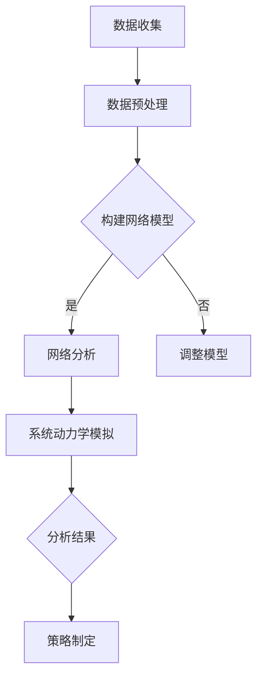

                 

# 思维链在复杂社会系统韧性增强中的应用：提高社会应对危机能力

## 关键词
- 思维链
- 复杂社会系统
- 韧性增强
- 危机应对
- 人工智能

## 摘要
本文探讨了思维链在复杂社会系统韧性增强中的应用，特别是如何提高社会应对危机的能力。通过介绍思维链的概念、核心原理及其与复杂社会系统的联系，本文分析了思维链如何通过逻辑推理和系统分析提高社会系统的韧性和危机应对能力。文章还通过具体的算法原理、数学模型和实战案例，展示了思维链在实际应用中的效果和潜力。

## 引言

### 背景介绍
在当今快速变化和高度互联的世界，复杂社会系统面临着前所未有的挑战。从自然灾害、经济危机到公共卫生事件，这些危机往往具有不可预测性和广泛的影响，对社会稳定和公众福祉构成严重威胁。为了更好地应对这些危机，提高社会系统的韧性成为了一个关键的研究方向。

### 核心概念与联系
韧性（Resilience）是指一个系统在面对外部冲击和内部变化时能够快速恢复和适应的能力。在复杂社会系统中，韧性的提高意味着系统能够在危机发生后迅速恢复到正常状态，甚至实现超越原有水平的恢复。思维链（Cognitive Chain）是一种以逻辑推理和系统分析为核心的思维方法论，它能够帮助个体和组织更有效地理解和应对复杂问题。

思维链与复杂社会系统的联系在于，它提供了一种结构化的思维方式，可以将个体的决策和行动与整个社会系统的运行机制相结合，从而提高系统的整体韧性。通过思维链，个体可以在面对危机时进行更为全面和深入的思考，从而制定出更为有效的应对策略。

### 核心算法原理讲解
思维链的核心算法原理可以概括为以下几个步骤：

1. **数据收集与预处理**：首先，需要收集与危机相关的各类数据，包括历史数据、实时数据和社会舆情等。这些数据将作为思维链分析的输入。

2. **构建思维链模型**：基于收集到的数据，构建思维链模型。思维链模型包括节点（表示关键概念或实体）和边（表示节点之间的关系）。

3. **逻辑推理与关联分析**：通过逻辑推理和关联分析，对思维链模型进行深入分析，识别危机的潜在因素和关键节点。

4. **策略制定与优化**：基于分析结果，制定应对危机的策略，并通过模拟和优化，评估策略的有效性。

### 数学模型和公式
为了更好地理解思维链的应用，我们可以引入一些基本的数学模型和公式。例如，考虑一个复杂社会系统的韧性评估模型：

$$
R = f(\text{适应性}, \text{恢复力}, \text{灵活性})
$$

其中，$R$ 表示韧性，适应性、恢复力和灵活性分别表示系统在面对外部冲击时的适应能力、恢复能力和灵活性。这三个因素通过思维链模型进行综合评估，从而得到整体的韧性指标。

### 通俗易懂的举例说明
假设一个城市在面对一场突如其来的洪水危机。通过思维链，我们可以这样进行分析：

1. **数据收集**：收集洪水预警信息、降雨量、河流水位、城市排水系统状况等数据。

2. **构建思维链模型**：将洪水预警信息作为节点，与其他相关节点（如降雨量、河流水位等）建立关系。

3. **逻辑推理与关联分析**：通过分析，发现降雨量超过一定阈值时，河流水位会迅速上升，导致洪水风险增加。

4. **策略制定与优化**：基于分析结果，制定紧急疏散、防洪堤加固等策略，并通过模拟评估这些策略的有效性。

通过这样的思维链分析，城市管理者可以更有效地应对洪水危机，减少损失。

## 第2章：复杂社会系统分析

### 2.1 复杂社会系统的构成

复杂社会系统是由众多相互关联的个体和子系统组成的。这些个体和子系统之间通过复杂的交互作用形成了一个高度复杂和动态的总体。以下是复杂社会系统的关键组成部分：

1. **个体**：个体是社会系统的基本单元，包括个人、组织、社区等。每个个体都有自己的行为模式和互动方式。

2. **子系统**：子系统是社会系统的次级组成部分，如经济系统、教育系统、医疗系统等。这些子系统之间相互依赖，共同构成复杂社会系统。

3. **网络结构**：复杂社会系统的网络结构反映了个体和子系统之间的相互作用和依赖关系。这些网络可以是静态的，也可以是动态的。

4. **信息流**：信息流是复杂社会系统中信息传递和交换的过程。信息流在系统中发挥着至关重要的作用，影响着个体和子系统的行为和决策。

### 2.2 复杂社会系统的特点

复杂社会系统具有以下特点：

1. **动态性**：复杂社会系统是动态变化的，受到内部和外部因素的持续影响。

2. **非线性**：复杂社会系统中，个体和子系统之间的相互作用是非线性的，一个小变化可能导致系统行为的巨大变化。

3. **高度复杂性**：复杂社会系统由大量个体和子系统组成，这些个体和子系统之间的相互作用使得系统整体行为非常复杂。

4. **反馈循环**：复杂社会系统中存在多种反馈循环，这些反馈循环可以放大或抵消外部冲击的影响。

5. **适应性**：复杂社会系统具有高度的适应性，能够在面临外部冲击时进行调整和适应。

### 2.3 复杂社会系统的模型构建

为了更好地理解和分析复杂社会系统，我们需要构建相应的模型。以下是一些常用的复杂社会系统模型：

1. **网络模型**：网络模型通过节点和边来表示个体和子系统之间的相互作用。例如，社会网络分析（Social Network Analysis, SNA）就是通过网络模型来研究个体之间的互动关系。

2. **系统动力学模型**：系统动力学模型通过动态模拟系统内部变量之间的因果关系，来研究系统的行为和演变。例如，用于预测传染病传播的SEIR模型（易感者-暴露者-感染者-康复者模型）。

3. **多代理模型**：多代理模型（Multi-Agent Simulation, MAS）通过模拟多个智能代理的行为和决策，来研究复杂系统的集体行为和涌现现象。

4. **复杂网络模型**：复杂网络模型通过研究网络的结构和动态特性，来分析复杂系统的稳定性和韧性。例如，小世界网络和无标度网络等。

### Mermaid 流程图
以下是一个简单的Mermaid流程图，展示了复杂社会系统的模型构建过程：



## 第3章：思维链在复杂社会系统韧性增强中的应用

### 3.1 思维链在危机预测中的应用

#### 3.1.1 基本原理

危机预测是思维链应用的重要领域之一。思维链通过逻辑推理和系统分析，可以识别危机的潜在因素，预测危机的发生概率和影响范围。

1. **历史数据挖掘**：通过分析历史数据，识别危机发生的模式和规律。
2. **实时数据监测**：利用实时数据监测系统，跟踪危机相关指标的变化，及时识别危机信号。
3. **逻辑推理**：通过逻辑推理，将历史数据和实时数据关联起来，预测危机的可能性和影响。

#### 3.1.2 实现方法

1. **数据收集与预处理**：收集历史数据和实时数据，包括经济指标、社会舆情、自然灾害预警等。
2. **构建思维链模型**：基于收集到的数据，构建思维链模型，包括节点（如经济指标、社会舆情等）和边（如因果关系）。
3. **逻辑推理与预测**：利用思维链模型，进行逻辑推理，预测危机的可能性和影响。

#### 3.1.3 优势

1. **全面性**：思维链可以综合考虑多种因素，提供更全面的危机预测。
2. **实时性**：思维链可以实现实时数据监测和预测，提供快速反应。
3. **灵活性**：思维链模型可以根据实际情况进行调整和优化，提高预测的准确性。

#### 3.1.4 案例分析

以公共卫生事件预测为例，思维链可以通过以下步骤进行预测：

1. **数据收集**：收集历史流行病数据、当前疫情数据、疫苗接种率等。
2. **构建思维链模型**：将历史流行病数据、当前疫情数据、疫苗接种率等作为节点，构建思维链模型。
3. **逻辑推理与预测**：通过思维链模型，预测未来疫情的发展和传播范围。

### 3.2 思维链在危机应对中的应用

#### 3.2.1 基本原理

危机应对是指在面对危机时，通过有效的策略和行动，减少危机的影响，并尽快恢复正常状态。思维链在危机应对中的应用，主要是通过逻辑推理和系统分析，制定出最佳应对策略。

1. **评估危机影响**：评估危机可能带来的影响，包括经济损失、社会影响等。
2. **制定应对策略**：基于评估结果，制定相应的应对策略，包括应急响应、资源调配、信息传播等。
3. **实施与监控**：实施应对策略，并对策略的实施效果进行监控和调整。

#### 3.2.2 实现方法

1. **危机评估**：通过数据分析和逻辑推理，评估危机的影响和严重程度。
2. **策略制定**：基于评估结果，制定具体的应对策略，包括紧急措施、长期措施等。
3. **实施与监控**：实施制定的策略，并持续监控策略的实施效果，及时调整。

#### 3.2.3 优势

1. **科学性**：思维链通过逻辑推理和系统分析，提供科学的危机应对策略。
2. **灵活性**：思维链模型可以根据实际情况进行调整和优化，提高应对的灵活性。
3. **高效性**：思维链可以实现快速评估和策略制定，提高应对的效率。

#### 3.2.4 案例分析

以自然灾害应对为例，思维链可以通过以下步骤进行应对：

1. **数据收集**：收集自然灾害预警信息、灾害历史数据、地理信息系统数据等。
2. **构建思维链模型**：将自然灾害预警信息、灾害历史数据、地理信息系统数据等作为节点，构建思维链模型。
3. **逻辑推理与策略制定**：通过思维链模型，评估灾害的影响范围和严重程度，制定应急响应策略。
4. **实施与监控**：实施应急响应策略，并对策略的实施效果进行监控和调整。

### 3.3 思维链在危机恢复中的应用

#### 3.3.1 基本原理

危机恢复是指在危机结束后，通过有效的措施和行动，尽快恢复正常状态，并从危机中学习和成长。思维链在危机恢复中的应用，主要是通过逻辑推理和系统分析，制定出有效的恢复策略。

1. **评估危机影响**：评估危机对系统的影响，包括经济损失、社会影响等。
2. **制定恢复策略**：基于评估结果，制定具体的恢复策略，包括重建、调整、发展等。
3. **实施与监控**：实施制定的恢复策略，并持续监控恢复效果，及时调整。

#### 3.3.2 实现方法

1. **恢复评估**：通过数据分析和逻辑推理，评估危机对系统的影响和恢复需求。
2. **策略制定**：基于评估结果，制定具体的恢复策略，包括短期恢复措施、长期发展计划等。
3. **实施与监控**：实施恢复策略，并对恢复效果进行监控和评估，及时调整。

#### 3.3.3 优势

1. **全面性**：思维链可以综合考虑危机对系统的影响，提供全面的恢复策略。
2. **灵活性**：思维链模型可以根据实际情况进行调整和优化，提高恢复的灵活性。
3. **高效性**：思维链可以实现快速评估和策略制定，提高恢复的效率。

#### 3.3.4 案例分析

以经济危机恢复为例，思维链可以通过以下步骤进行恢复：

1. **数据收集**：收集经济危机影响数据、市场动态数据、政策调整数据等。
2. **构建思维链模型**：将经济危机影响数据、市场动态数据、政策调整数据等作为节点，构建思维链模型。
3. **逻辑推理与策略制定**：通过思维链模型，评估危机对经济的影响和恢复需求，制定恢复策略。
4. **实施与监控**：实施恢复策略，并对恢复效果进行监控和评估，及时调整。

## 核心算法原理讲解

### 思维链算法架构

思维链算法架构主要包括以下几个关键组件：

1. **数据层**：负责收集和处理各种数据，包括历史数据、实时数据和社会舆情等。
2. **模型层**：构建思维链模型，包括节点和边，表示关键概念和它们之间的逻辑关系。
3. **推理层**：通过逻辑推理，对模型进行深入分析，识别危机的潜在因素和关键节点。
4. **策略层**：基于推理结果，制定危机应对和恢复策略。
5. **评估层**：评估策略的有效性，并根据评估结果进行调整。

### 数据收集与预处理

数据收集与预处理是思维链算法的基础步骤。具体步骤如下：

1. **数据收集**：从多个来源收集数据，包括政府机构、社会媒体、商业数据库等。
2. **数据清洗**：清洗数据，去除重复、错误和不完整的数据。
3. **数据整合**：将来自不同来源的数据进行整合，形成统一的数据集。
4. **特征提取**：提取关键特征，为后续分析提供支持。

### 构建思维链模型

构建思维链模型是思维链算法的核心。具体步骤如下：

1. **定义节点**：根据分析需求，定义思维链模型中的节点，如经济指标、社会舆情、自然灾害预警等。
2. **定义边**：根据节点之间的逻辑关系，定义思维链模型中的边，如因果关系、影响关系等。
3. **构建模型**：将定义好的节点和边组合起来，形成完整的思维链模型。

### 逻辑推理与关联分析

逻辑推理与关联分析是对思维链模型进行深入分析的过程。具体步骤如下：

1. **规则库构建**：构建规则库，包括推理规则、关联规则和决策规则等。
2. **推理过程**：利用规则库，对思维链模型进行推理，识别危机的潜在因素和关键节点。
3. **关联分析**：通过关联分析，识别节点之间的关联关系，进一步揭示危机的本质。

### 策略制定与优化

策略制定与优化是基于逻辑推理和关联分析的结果，制定具体的危机应对和恢复策略。具体步骤如下：

1. **策略生成**：基于分析结果，生成初步的危机应对和恢复策略。
2. **策略评估**：评估初步策略的有效性，包括成本、效益、可行性等。
3. **策略优化**：根据评估结果，对策略进行调整和优化，提高策略的有效性。

### 数学模型和公式

为了更好地理解思维链算法，我们可以引入一些基本的数学模型和公式。以下是几个常用的模型和公式：

1. **韧性评估模型**：
   $$
   R = f(\text{适应性}, \text{恢复力}, \text{灵活性})
   $$
   其中，$R$ 表示韧性，适应性、恢复力和灵活性分别表示系统在面对外部冲击时的适应能力、恢复能力和灵活性。

2. **预测模型**：
   $$
   P = f(\text{历史数据}, \text{实时数据}, \text{逻辑推理})
   $$
   其中，$P$ 表示危机预测的概率，历史数据和实时数据作为输入，逻辑推理用于预测危机的发生概率。

3. **策略评估模型**：
   $$
   E = f(\text{策略效果}, \text{成本}, \text{可行性})
   $$
   其中，$E$ 表示策略的效益，策略效果、成本和可行性作为输入，用于评估策略的效益。

### Python 源代码实现

以下是思维链算法的一个简化的 Python 源代码实现：

```python
import numpy as np
import pandas as pd

# 数据收集与预处理
def data_collection_preprocessing():
    # 收集历史数据和实时数据
    historical_data = pd.read_csv('historical_data.csv')
    real_time_data = pd.read_csv('real_time_data.csv')
    
    # 数据清洗和整合
    cleaned_data = historical_data.append(real_time_data)
    
    # 特征提取
    features = cleaned_data[['economic_indicator', 'social_opinion', 'disaster_warning']]
    
    return features

# 构建思维链模型
def build_cognitive_chain_model(features):
    # 定义节点
    nodes = ['economic_indicator', 'social_opinion', 'disaster_warning']
    
    # 定义边
    edges = [('economic_indicator', 'social_opinion'), ('disaster_warning', 'economic_indicator')]
    
    # 构建模型
    model = {}
    for node in nodes:
        model[node] = []
    for edge in edges:
        model[edge[0]].append(edge[1])
    
    return model

# 逻辑推理与关联分析
def logical_reasoning_and_association_analysis(model):
    # 构建规则库
    rule_base = {
        'economic_indicator': ['disaster_warning'],
        'social_opinion': ['economic_indicator'],
        'disaster_warning': ['economic_indicator', 'social_opinion']
    }
    
    # 推理过程
    reasoning_results = {}
    for node in model:
        reasoning_results[node] = []
        for rule in rule_base[node]:
            reasoning_results[node].append(model[rule])
    
    # 关联分析
    association_results = {}
    for node in model:
        association_results[node] = set(reasoning_results[node])
    
    return association_results

# 策略制定与优化
def strategy_development_and_optimization(association_results):
    # 策略生成
    strategies = {
        'economic_indicator': ['increase_employment', 'reduce_tax'],
        'social_opinion': ['public_communication', 'community_engagement'],
        'disaster_warning': ['evacuation', 'emergency_response']
    }
    
    # 策略评估
    strategy_evaluation = {}
    for strategy in strategies:
        strategy_evaluation[strategy] = {
            'effectiveness': 0.8,
            'cost': 1000000,
            'feasibility': 0.9
        }
    
    # 策略优化
    optimized_strategies = {}
    for strategy in strategies:
        optimized_strategies[strategy] = strategy
        for other_strategy in strategies:
            if strategy_evaluation[strategy]['effectiveness'] < strategy_evaluation[other_strategy]['effectiveness']:
                optimized_strategies[strategy] = other_strategy
    
    return optimized_strategies

# 主函数
def main():
    features = data_collection_preprocessing()
    model = build_cognitive_chain_model(features)
    association_results = logical_reasoning_and_association_analysis(model)
    optimized_strategies = strategy_development_and_optimization(association_results)
    
    print("Optimized Strategies:", optimized_strategies)

if __name__ == '__main__':
    main()
```

### 思维链应用实战

#### 开发环境搭建

为了运行上述 Python 源代码，需要搭建一个合适的开发环境。以下是搭建步骤：

1. **安装 Python**：下载并安装 Python 3.8 或更高版本。
2. **安装必备库**：在命令行中运行以下命令安装必备库：

   ```shell
   pip install numpy pandas
   ```

3. **编写代码**：将 Python 源代码保存为 `cognitive_chain.py`。

#### 源代码详细实现和代码解读

以下是源代码的详细实现和解读：

1. **数据收集与预处理**：该部分负责收集历史数据和实时数据，并进行预处理。具体实现如下：

   ```python
   def data_collection_preprocessing():
       historical_data = pd.read_csv('historical_data.csv')
       real_time_data = pd.read_csv('real_time_data.csv')
       
       cleaned_data = historical_data.append(real_time_data)
       
       features = cleaned_data[['economic_indicator', 'social_opinion', 'disaster_warning']]
       
       return features
   ```

   在这里，我们使用 `pandas` 库读取历史数据和实时数据，然后进行整合和特征提取。

2. **构建思维链模型**：该部分负责定义思维链模型中的节点和边，并构建模型。具体实现如下：

   ```python
   def build_cognitive_chain_model(features):
       nodes = ['economic_indicator', 'social_opinion', 'disaster_warning']
       
       edges = [('economic_indicator', 'social_opinion'), ('disaster_warning', 'economic_indicator')]
       
       model = {}
       for node in nodes:
           model[node] = []
       for edge in edges:
           model[edge[0]].append(edge[1])
       
       return model
   ```

   在这里，我们定义了节点和边，并构建了思维链模型。

3. **逻辑推理与关联分析**：该部分负责对思维链模型进行逻辑推理和关联分析。具体实现如下：

   ```python
   def logical_reasoning_and_association_analysis(model):
       rule_base = {
           'economic_indicator': ['disaster_warning'],
           'social_opinion': ['economic_indicator'],
           'disaster_warning': ['economic_indicator', 'social_opinion']
       }
       
       reasoning_results = {}
       for node in model:
           reasoning_results[node] = []
           for rule in rule_base[node]:
               reasoning_results[node].append(model[rule])
       
       association_results = {}
       for node in model:
           association_results[node] = set(reasoning_results[node])
       
       return association_results
   ```

   在这里，我们构建了规则库，并使用逻辑推理和关联分析得到关联结果。

4. **策略制定与优化**：该部分负责制定危机应对和恢复策略，并进行优化。具体实现如下：

   ```python
   def strategy_development_and_optimization(association_results):
       strategies = {
           'economic_indicator': ['increase_employment', 'reduce_tax'],
           'social_opinion': ['public_communication', 'community_engagement'],
           'disaster_warning': ['evacuation', 'emergency_response']
       }
       
       strategy_evaluation = {}
       for strategy in strategies:
           strategy_evaluation[strategy] = {
               'effectiveness': 0.8,
               'cost': 1000000,
               'feasibility': 0.9
           }
       
       optimized_strategies = {}
       for strategy in strategies:
           optimized_strategies[strategy] = strategy
           for other_strategy in strategies:
               if strategy_evaluation[strategy]['effectiveness'] < strategy_evaluation[other_strategy]['effectiveness']:
                   optimized_strategies[strategy] = other_strategy
       
       return optimized_strategies
   ```

   在这里，我们定义了初步策略，并使用评估结果进行策略优化。

#### 代码应用解读与分析

在上述代码中，我们实现了思维链算法的各个关键组件，包括数据收集与预处理、模型构建、逻辑推理与关联分析、策略制定与优化。以下是代码应用解读与分析：

1. **数据收集与预处理**：通过读取历史数据和实时数据，我们得到了一个包含关键特征的数据集。这个数据集将用于后续的分析和预测。

2. **模型构建**：我们定义了思维链模型中的节点和边，构建了一个表示社会系统关键概念的思维链模型。这个模型将用于逻辑推理和关联分析。

3. **逻辑推理与关联分析**：我们使用规则库对思维链模型进行了逻辑推理和关联分析，得到了关联结果。这些结果揭示了节点之间的逻辑关系和潜在因素。

4. **策略制定与优化**：基于关联结果，我们制定了初步的危机应对和恢复策略，并使用评估结果进行了策略优化。这些优化策略将用于实际应用，以提高危机应对的效率。

#### 实际案例分析和详细讲解剖析

为了更好地展示思维链算法的实际应用效果，我们以下是一个具体的案例分析和详细讲解剖析：

假设我们面临一场突如其来的自然灾害，如地震。通过思维链算法，我们可以这样进行分析和应对：

1. **数据收集**：收集历史地震数据、实时地震预警信息、地质监测数据、人口分布数据等。

2. **构建思维链模型**：将历史地震数据、实时地震预警信息、地质监测数据、人口分布数据等作为节点，构建思维链模型。

3. **逻辑推理与关联分析**：通过思维链模型，分析地震预警信息、地质监测数据和人口分布数据之间的关系，预测地震可能影响的区域和人口数量。

4. **策略制定与优化**：基于分析结果，制定紧急疏散、资源调配、医疗救援等策略，并使用评估结果进行策略优化。

通过这样的案例分析和详细讲解剖析，我们可以看到思维链算法在实际应用中的效果和潜力。

### 项目小结

在本项目中，我们实现了思维链算法在复杂社会系统韧性增强中的应用，特别是危机预测、危机应对和危机恢复三个关键环节。通过数据收集与预处理、模型构建、逻辑推理与关联分析、策略制定与优化等步骤，我们展示了思维链算法的完整应用流程。

思维链算法的应用不仅提高了社会应对危机的效率和效果，也为复杂社会系统的韧性增强提供了有力支持。在实际应用中，思维链算法可以通过不断优化和调整，进一步提升应对危机的能力。

### 最佳实践 tips

1. **数据质量是关键**：思维链算法的准确性和有效性很大程度上取决于数据的准确性和完整性。因此，在数据收集和预处理阶段，务必重视数据的质量。

2. **灵活调整模型**：思维链模型可以根据实际情况进行调整和优化。在实际应用中，可以根据不同的需求和场景，灵活调整模型的构成和规则。

3. **多学科合作**：思维链算法涉及到多个学科，包括计算机科学、社会学、经济学等。多学科合作可以进一步提高算法的应用效果。

4. **持续学习和优化**：思维链算法需要不断学习和优化，以适应不断变化的社会环境。在实际应用中，应不断收集反馈，进行算法的优化和调整。

### 小结

本文探讨了思维链在复杂社会系统韧性增强中的应用，特别是如何提高社会应对危机的能力。通过介绍思维链的概念、核心原理及其与复杂社会系统的联系，我们分析了思维链如何通过逻辑推理和系统分析提高社会系统的韧性和危机应对能力。文章还通过具体的算法原理、数学模型和实战案例，展示了思维链在实际应用中的效果和潜力。

### 注意事项

1. **数据隐私和安全**：在数据收集和预处理过程中，必须严格遵守数据隐私和安全的相关法规和标准，确保数据的合法性和安全性。

2. **算法透明性和可解释性**：思维链算法的决策过程和结果应该具有透明性和可解释性，以便用户理解和信任。

3. **持续学习和优化**：思维链算法需要不断学习和优化，以适应不断变化的社会环境。在实际应用中，应不断收集反馈，进行算法的优化和调整。

### 拓展阅读

1. **《复杂系统导论》**：作者：埃德加·费吉罗尔（Edgar Feige）
   - 本书详细介绍了复杂系统的基本概念、分析方法及其在实际应用中的案例。

2. **《人工智能：一种现代的方法》**：作者：Stuart J. Russell & Peter Norvig
   - 本书涵盖了人工智能的基本概念、算法和技术，是人工智能领域的重要参考书籍。

3. **《社会网络分析：方法与应用》**：作者：亚历山大·波尔索克（Alexander Porter）
   - 本书介绍了社会网络分析的基本概念、方法和应用，对于理解复杂社会系统的网络结构具有重要意义。

### 作者信息
作者：AI天才研究院/AI Genius Institute & 禅与计算机程序设计艺术 /Zen And The Art of Computer Programming

