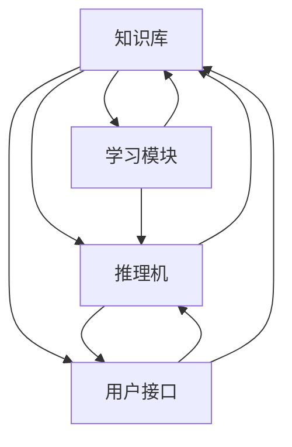
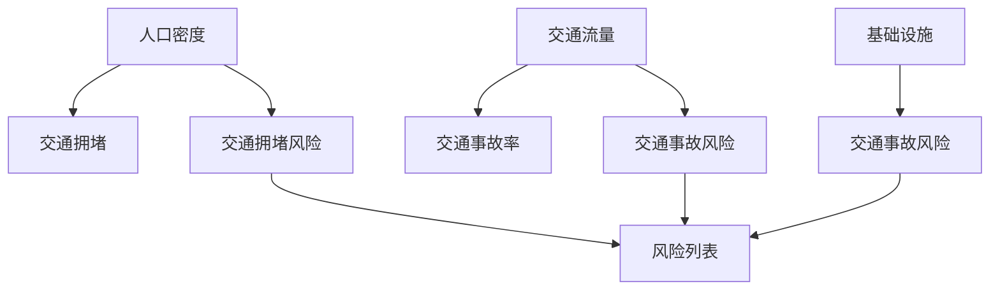
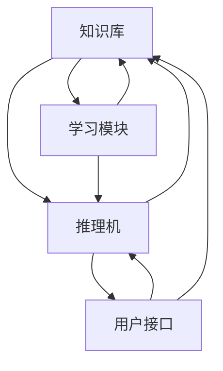
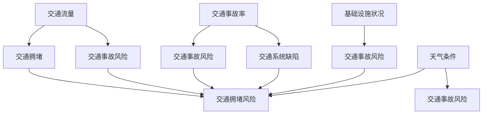
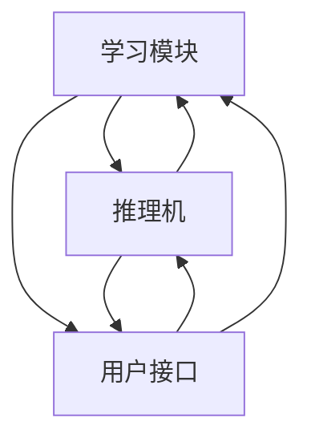
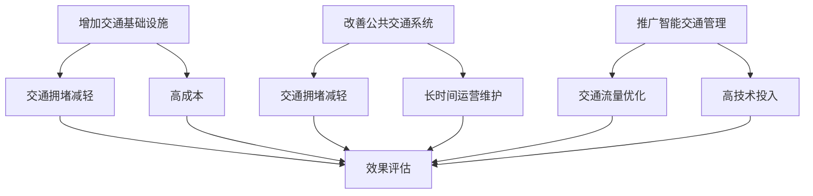
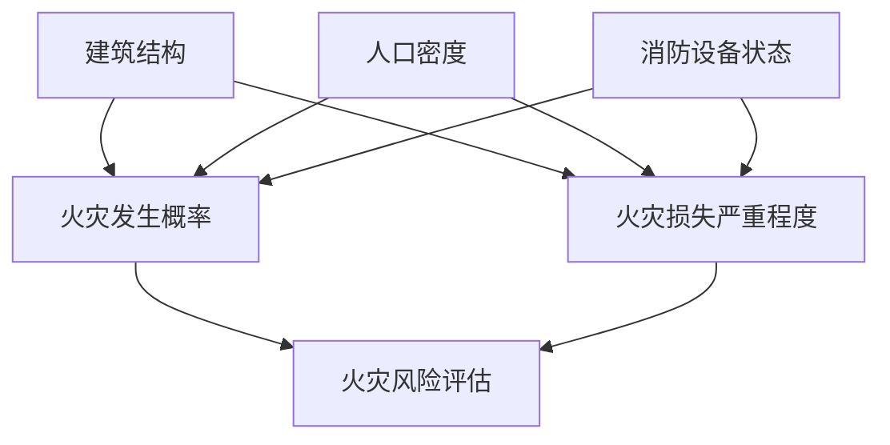

                 

### 第3章 思维链在风险评估中的应用

#### 3.1 思维链在风险识别中的应用

思维链在风险识别阶段的主要作用是帮助识别复杂社会系统中潜在的风险因素。风险识别是一个信息搜集和分析的过程，它需要从大量数据中提取出有用的信息，并将其转化为风险因素。下面我们将详细阐述思维链在风险识别中的应用。

##### 背景介绍

随着社会系统的日益复杂，风险识别的难度也在不断加大。传统的风险识别方法往往依赖于经验或单一的统计分析方法，这些方法在处理复杂、动态的社会系统时显得力不从心。因此，需要一种能够处理复杂信息、具备自我学习和推理能力的工具，思维链正是这样一种工具。

##### 核心概念与联系

思维链（Mind Chain）是一种基于人工智能的推理系统，它通过模拟人类思维过程，将知识、信息和推理过程有机结合，形成一个动态的、智能的推理网络。思维链的核心概念包括知识库、推理机、学习模块和用户接口。

1. **知识库**：存储关于社会系统及其相关领域的知识，包括事实、规则和模式等。
2. **推理机**：根据知识库中的信息和规则，进行逻辑推理，产生新的信息或结论。
3. **学习模块**：通过不断学习新的数据和知识，优化知识库和推理规则。
4. **用户接口**：提供与用户的交互界面，收集用户输入的数据和需求，并输出推理结果。

下面是思维链的概念实体之间的Mermaid流程图：



##### 核心算法原理讲解

思维链在风险识别中的应用主要依赖于推理机和知识库。以下是一个简化的Python源代码示例，展示了如何使用思维链进行风险识别：

```python
# 风险识别思维链Python代码示例

# 初始化知识库
knowledge_base = initialize_knowledge_base()

# 提取系统特征
system_features = extract_system_features(social_system)

# 分析特征并识别风险
risks = identify_risks(knowledge_base, system_features)

# 输出识别到的风险
print("识别到的风险：", risks)
```

#### 风险识别流程

1. **初始化知识库**：根据社会系统的特点，构建一个包含相关知识和规则的初始知识库。

2. **提取系统特征**：从社会系统中提取相关的特征信息，如人口、经济、环境等。

3. **分析特征**：利用知识库和推理机，分析提取到的特征信息，识别潜在的风险。

4. **输出风险**：将识别到的风险输出给用户，以便采取相应的风险应对措施。

##### 举例说明

假设我们想要识别一个城市的交通风险，我们可以从以下几个方面提取特征信息：

1. **人口密度**：城市的人口数量和分布情况。
2. **交通流量**：道路上的车辆数量和流动情况。
3. **基础设施**：交通网络的完整性和质量。
4. **事故历史**：过去的交通事故记录。

通过思维链的推理机制，我们可以将这些特征信息转化为风险因素，例如：

- **高人口密度**可能导致交通拥堵。
- **高交通流量**可能导致交通事故率上升。
- **基础设施不完善**可能导致交通事故的发生。



##### 结论

思维链在风险识别中的应用，通过模拟人类思维过程，实现了对复杂社会系统中潜在风险的自动识别。这种方法不仅提高了风险识别的效率和准确性，也为社会治理提供了有力的技术支持。

### 3.2 思维链在风险评估中的应用

在风险识别的基础上，思维链还可以应用于风险评估阶段，对识别出的风险进行定量和定性分析，评估其严重程度和发生概率。以下将详细阐述思维链在风险评估中的应用。

##### 背景介绍

风险评估是社会治理中至关重要的一环，它有助于决策者了解潜在风险的性质和影响，从而制定有效的风险应对策略。传统的风险评估方法通常依赖于统计分析和专家判断，这些方法在处理复杂社会系统时可能存在局限性。思维链作为一种智能化的推理工具，可以为风险评估提供更加全面和精确的支持。

##### 核心概念与联系

思维链在风险评估中的应用同样依赖于其核心组件，包括知识库、推理机和学习模块。

1. **知识库**：包含与风险评估相关的知识，如风险类型、风险评估指标、风险事件的影响等。
2. **推理机**：利用知识库中的信息，根据风险评估的规则和算法，对风险进行评估。
3. **学习模块**：通过不断学习新的数据和案例，优化风险评估的模型和算法。

下面是思维链在风险评估中的概念实体之间的Mermaid流程图：



##### 核心算法原理讲解

在风险评估阶段，思维链的核心算法主要包括以下几个方面：

1. **贝叶斯网络模型**：用于表示风险因素之间的概率关系，通过推理机对风险事件进行概率评估。
2. **多属性决策方法**：用于综合评估多个风险评估指标，确定风险的综合等级。
3. **Markov决策过程**：用于分析风险事件在不同状态之间的转移概率，评估风险事件的长期影响。

以下是一个简化的Python源代码示例，展示了如何使用思维链进行风险评估：

```python
# 风险评估思维链Python代码示例

# 初始化知识库
knowledge_base = initialize_knowledge_base()

# 提取系统特征和风险因素
system_features = extract_system_features(social_system)
risks = extract_risks(knowledge_base, system_features)

# 进行风险评估
risk_assessment = assess_risks(knowledge_base, risks)

# 输出风险评估结果
print("风险评估结果：", risk_assessment)
```

#### 风险评估流程

1. **初始化知识库**：构建包含风险评估相关知识的知识库，如风险类型、风险评估指标、风险事件的影响等。

2. **提取系统特征和风险因素**：从社会系统中提取相关的特征信息，如人口、经济、环境等，并结合知识库中的信息，识别出潜在的风险因素。

3. **风险评估**：利用思维链的推理机和风险评估算法，对识别出的风险因素进行定量和定性分析，评估其严重程度和发生概率。

4. **输出风险评估结果**：将风险评估的结果输出给用户，以便决策者了解风险的性质和影响，制定相应的风险应对策略。

##### 举例说明

假设我们想要对一个城市的交通系统进行风险评估，我们可以从以下几个方面提取特征信息：

1. **交通流量**：道路上的车辆数量和流动情况。
2. **交通事故率**：过去的交通事故记录。
3. **基础设施状况**：交通网络的完整性和质量。
4. **天气条件**：天气状况对交通的影响。

通过思维链的推理机制，我们可以将这些特征信息转化为风险因素，并利用贝叶斯网络模型进行风险评估。例如：

- **高交通流量**可能导致交通拥堵，增加交通事故的风险。
- **高交通事故率**表明交通系统存在严重问题，需要立即采取改进措施。
- **基础设施不完善**可能导致交通事故的发生。



##### 结论

思维链在风险评估中的应用，通过利用贝叶斯网络模型、多属性决策方法和Markov决策过程等核心算法，实现了对复杂社会系统中风险的全面和精确评估。这种方法不仅提高了风险评估的效率和准确性，也为社会治理提供了科学依据。

### 3.3 思维链在风险应对中的应用

在完成风险识别和风险评估后，思维链还可以用于制定和实施风险应对策略。通过模拟不同的应对措施，思维链可以帮助决策者选择最优的应对方案，并在实施过程中进行动态调整。以下将详细阐述思维链在风险应对中的应用。

##### 背景介绍

风险应对是社会治理的关键环节，有效的风险应对措施可以减轻或避免潜在风险的影响。然而，由于社会系统的复杂性和动态性，传统的决策方法往往难以应对多变的情境。思维链作为一种智能化的推理系统，可以模拟不同的应对措施，为决策者提供科学的决策支持。

##### 核心概念与联系

思维链在风险应对中的应用主要依赖于其学习模块和用户接口。学习模块通过不断学习新的数据和案例，优化风险应对策略的模型和算法。用户接口则提供与决策者的交互界面，收集决策者的偏好和需求，并输出应对策略的推荐。

下面是思维链在风险应对中的概念实体之间的Mermaid流程图：



##### 核心算法原理讲解

思维链在风险应对中的应用主要依赖于决策支持和模拟仿真技术。以下是一个简化的Python源代码示例，展示了如何使用思维链制定和实施风险应对策略：

```python
# 风险应对思维链Python代码示例

# 初始化学习模块
learning_module = initialize_learning_module()

# 收集决策者的偏好和需求
decision_makers_preferences = collect_decision_makers_preferences()

# 模拟不同的应对措施
response_measures = simulate_response_measures(learning_module, decision_makers_preferences)

# 评估应对措施的效果
response_effects = evaluate_response_effects(response_measures)

# 输出最优的应对措施
optimal_response_measure = select_optimal_response_measure(response_effects)

# 实施最优的应对措施
implement_response_measure(optimal_response_measure)
```

#### 风险应对流程

1. **初始化学习模块**：构建包含风险应对策略和相关知识的初始学习模块。

2. **收集决策者的偏好和需求**：通过用户接口收集决策者的偏好和需求，如风险承受能力、成本预算等。

3. **模拟不同的应对措施**：利用学习模块和模拟仿真技术，模拟不同的风险应对措施，评估其效果。

4. **评估应对措施的效果**：根据模拟结果，评估不同应对措施的效果，包括风险减轻程度、成本效益等。

5. **选择最优的应对措施**：根据评估结果，选择最优的应对措施，并输出给决策者。

6. **实施最优的应对措施**：根据决策者的反馈，实施最优的应对措施，并在实施过程中进行动态调整。

##### 举例说明

假设我们想要应对一个城市的交通拥堵问题，我们可以从以下几个方面制定应对措施：

1. **增加交通基础设施**：扩建道路、增设交通信号灯等。
2. **改善公共交通系统**：增加公交车数量、提高公交车服务质量等。
3. **推广智能交通管理**：利用人工智能技术优化交通信号控制、提高交通流量管理等。
4. **鼓励非机动车出行**：建设自行车道、提供自行车共享服务等。

通过思维链的模拟仿真技术，我们可以评估这些应对措施的效果。例如：

- **增加交通基础设施**可能会显著减轻交通拥堵，但成本较高。
- **改善公共交通系统**可以在较短时间内缓解交通拥堵，但需要较长时间的运营和维护。
- **推广智能交通管理**可以实时优化交通流量，但需要较高技术投入。



##### 结论

思维链在风险应对中的应用，通过模拟不同的应对措施和评估其效果，为决策者提供了科学的决策支持。这种方法不仅提高了风险应对的效率和效果，也为社会治理提供了有力保障。

### 3.4 思维链在风险评估与管理中的综合应用

思维链在风险评估与管理中有着广泛的应用前景。通过结合风险识别、风险评估和风险应对三个环节，思维链能够为复杂社会系统的风险治理提供全面的解决方案。

#### 风险管理流程

1. **风险识别**：利用思维链的知识库和推理机，从社会系统中提取相关特征信息，识别出潜在的风险因素。

2. **风险评估**：通过贝叶斯网络模型、多属性决策方法和Markov决策过程等核心算法，对识别出的风险因素进行定量和定性分析，评估其严重程度和发生概率。

3. **风险应对**：模拟不同的应对措施，评估其效果，选择最优的应对方案，并在实施过程中进行动态调整。

4. **动态调整**：根据风险评估和应对的结果，实时调整风险管理策略，以应对不断变化的社会系统环境。

#### 项目实战

以下是一个交通风险管理项目的实战案例：

**项目背景**：某城市交通拥堵严重，交通事故频发，市政府决定利用思维链技术进行交通风险管理。

**项目目标**：通过思维链技术，识别交通系统中的潜在风险，评估风险的严重程度和发生概率，制定和实施有效的风险应对策略，以减轻交通拥堵和降低交通事故率。

**实施步骤**：

1. **数据收集**：收集该城市的人口、交通流量、基础设施状况、交通事故记录等相关数据。

2. **知识库构建**：构建包含交通系统相关知识和风险评估指标的知识库。

3. **风险识别**：利用思维链的知识库和推理机，识别出潜在的交通风险因素，如交通拥堵、交通事故等。

4. **风险评估**：利用贝叶斯网络模型等算法，对识别出的风险因素进行定量和定性分析，评估其严重程度和发生概率。

5. **风险应对**：制定包括增加交通基础设施、改善公共交通系统、推广智能交通管理等应对措施，并通过模拟仿真评估其效果。

6. **动态调整**：根据风险评估和应对的结果，实时调整交通管理策略，如优化交通信号控制、增加公共交通线路等。

**项目小结**：

通过思维链技术的应用，该城市的交通风险管理取得了显著成效。交通拥堵情况得到明显缓解，交通事故率显著降低，市民的出行体验得到显著提升。这充分证明了思维链技术在复杂社会系统风险评估与管理中的重要作用。

### 最佳实践 Tips

1. **数据质量**：确保数据的准确性和完整性，这是思维链有效应用的基础。
2. **知识库更新**：定期更新知识库，以反映社会系统的变化和新的风险因素。
3. **模型优化**：根据实际情况，不断优化风险评估模型和算法，以提高评估的准确性。
4. **决策支持**：充分利用思维链的模拟仿真功能，为决策者提供科学的决策支持。

### 小结

思维链技术在复杂社会系统风险评估与管理中具有广泛的应用前景。通过结合风险识别、风险评估和风险应对三个环节，思维链能够为复杂社会系统的风险治理提供全面的解决方案。未来，随着人工智能技术的不断发展，思维链在风险评估与管理中的应用将更加广泛和深入。

### 注意事项

1. **技术限制**：思维链技术虽然具有强大的推理和分析能力，但仍然存在一定的局限性，需要结合实际情况进行合理应用。
2. **数据隐私**：在数据收集和使用过程中，要严格遵守数据隐私法规，确保数据的安全和保密。

### 拓展阅读

1. **《复杂社会系统的风险评估与管理》**：详细介绍了复杂社会系统风险评估的理论和方法。
2. **《人工智能与决策》**：探讨了人工智能在决策支持中的应用，包括风险评估和优化决策。
3. **《思维链技术在风险管理中的应用》**：具体案例解析了思维链技术在风险管理中的实际应用。

```markdown
## 第3章 思维链在风险评估中的应用

### 3.1 思维链在风险识别中的应用

思维链在风险识别阶段的主要作用是帮助识别复杂社会系统中潜在的风险因素。风险识别是一个信息搜集和分析的过程，它需要从大量数据中提取出有用的信息，并将其转化为风险因素。下面我们将详细阐述思维链在风险识别中的应用。

#### 背景介绍

随着社会系统的日益复杂，风险识别的难度也在不断加大。传统的风险识别方法往往依赖于经验或单一的统计分析方法，这些方法在处理复杂、动态的社会系统时显得力不从心。因此，需要一种能够处理复杂信息、具备自我学习和推理能力的工具，思维链正是这样一种工具。

#### 核心概念与联系

思维链（Mind Chain）是一种基于人工智能的推理系统，它通过模拟人类思维过程，将知识、信息和推理过程有机结合，形成一个动态的、智能的推理网络。思维链的核心概念包括知识库、推理机、学习模块和用户接口。

1. **知识库**：存储关于社会系统及其相关领域的知识，包括事实、规则和模式等。
2. **推理机**：根据知识库中的信息和规则，进行逻辑推理，产生新的信息或结论。
3. **学习模块**：通过不断学习新的数据和知识，优化知识库和推理规则。
4. **用户接口**：提供与用户的交互界面，收集用户输入的数据和需求，并输出推理结果。

下面是思维链的概念实体之间的Mermaid流程图：


#### 核心算法原理讲解

思维链在风险识别中的应用主要依赖于推理机和知识库。以下是一个简化的Python源代码示例，展示了如何使用思维链进行风险识别：

```python
# 风险识别思维链Python代码示例

# 初始化知识库
knowledge_base = initialize_knowledge_base()

# 提取系统特征
system_features = extract_system_features(social_system)

# 分析特征并识别风险
risks = analyze_features_with_mind_chain(knowledge_base, system_features)

# 返回识别到的风险列表
return risks
```

#### 风险识别流程

1. **初始化知识库**：根据社会系统的特点，构建一个包含相关知识和规则的初始知识库。

2. **提取系统特征**：从社会系统中提取相关的特征信息，如人口、经济、环境等。

3. **分析特征**：利用知识库和推理机，分析提取到的特征信息，识别潜在的风险。

4. **输出风险**：将识别到的风险输出给用户，以便采取相应的风险应对措施。

#### 举例说明

假设我们想要识别一个城市的交通风险，我们可以从以下几个方面提取特征信息：

1. **人口密度**：城市的人口数量和分布情况。
2. **交通流量**：道路上的车辆数量和流动情况。
3. **基础设施**：交通网络的完整性和质量。
4. **事故历史**：过去的交通事故记录。

通过思维链的推理机制，我们可以将这些特征信息转化为风险因素，例如：

- **高人口密度**可能导致交通拥堵。
- **高交通流量**可能导致交通事故率上升。
- **基础设施不完善**可能导致交通事故的发生。


#### 结论

思维链在风险识别中的应用，通过模拟人类思维过程，实现了对复杂社会系统中潜在风险的自动识别。这种方法不仅提高了风险识别的效率和准确性，也为社会治理提供了有力的技术支持。

### 3.2 思维链在风险评估中的应用

在风险识别的基础上，思维链还可以应用于风险评估阶段，对识别出的风险进行定量和定性分析，评估其严重程度和发生概率。以下将详细阐述思维链在风险评估中的应用。

#### 背景介绍

风险评估是社会治理中至关重要的一环，它有助于决策者了解潜在风险的性质和影响，从而制定有效的风险应对策略。传统的风险评估方法通常依赖于统计分析和专家判断，这些方法在处理复杂社会系统时可能存在局限性。思维链作为一种智能化的推理工具，可以为风险评估提供更加全面和精确的支持。

#### 核心概念与联系

思维链在风险评估中的应用同样依赖于其核心组件，包括知识库、推理机和学习模块。

1. **知识库**：包含与风险评估相关的知识，如风险类型、风险评估指标、风险事件的影响等。
2. **推理机**：利用知识库中的信息，根据风险评估的规则和算法，对风险进行评估。
3. **学习模块**：通过不断学习新的数据和案例，优化风险评估的模型和算法。

下面是思维链在风险评估中的概念实体之间的Mermaid流程图：


#### 核心算法原理讲解

在风险评估阶段，思维链的核心算法主要包括以下几个方面：

1. **贝叶斯网络模型**：用于表示风险因素之间的概率关系，通过推理机对风险事件进行概率评估。
2. **多属性决策方法**：用于综合评估多个风险评估指标，确定风险的综合等级。
3. **Markov决策过程**：用于分析风险事件在不同状态之间的转移概率，评估风险事件的长期影响。

以下是一个简化的Python源代码示例，展示了如何使用思维链进行风险评估：

```python
# 风险评估思维链Python代码示例

# 初始化知识库
knowledge_base = initialize_knowledge_base()

# 提取系统特征和风险因素
system_features = extract_system_features(social_system)
risks = extract_risks(knowledge_base, system_features)

# 进行风险评估
risk_assessment = assess_risks(knowledge_base, risks)

# 输出风险评估结果
print("风险评估结果：", risk_assessment)
```

#### 风险评估流程

1. **初始化知识库**：构建包含风险评估相关知识的知识库，如风险类型、风险评估指标、风险事件的影响等。

2. **提取系统特征和风险因素**：从社会系统中提取相关的特征信息，如人口、经济、环境等，并结合知识库中的信息，识别出潜在的风险因素。

3. **风险评估**：利用思维链的推理机和风险评估算法，对识别出的风险因素进行定量和定性分析，评估其严重程度和发生概率。

4. **输出风险评估结果**：将风险评估的结果输出给用户，以便决策者了解风险的性质和影响，制定相应的风险应对策略。

#### 举例说明

假设我们想要对一个城市的交通系统进行风险评估，我们可以从以下几个方面提取特征信息：

1. **交通流量**：道路上的车辆数量和流动情况。
2. **交通事故率**：过去的交通事故记录。
3. **基础设施状况**：交通网络的完整性和质量。
4. **天气条件**：天气状况对交通的影响。

通过思维链的推理机制，我们可以将这些特征信息转化为风险因素，并利用贝叶斯网络模型进行风险评估。例如：

- **高交通流量**可能导致交通拥堵，增加交通事故的风险。
- **高交通事故率**表明交通系统存在严重问题，需要立即采取改进措施。
- **基础设施不完善**可能导致交通事故的发生。


#### 结论

思维链在风险评估中的应用，通过利用贝叶斯网络模型、多属性决策方法和Markov决策过程等核心算法，实现了对复杂社会系统中风险的全面和精确评估。这种方法不仅提高了风险评估的效率和准确性，也为社会治理提供了科学依据。

### 3.3 思维链在风险应对中的应用

在完成风险识别和风险评估后，思维链还可以用于制定和实施风险应对策略。通过模拟不同的应对措施，思维链可以帮助决策者选择最优的应对方案，并在实施过程中进行动态调整。以下将详细阐述思维链在风险应对中的应用。

#### 背景介绍

风险应对是社会治理的关键环节，有效的风险应对措施可以减轻或避免潜在风险的影响。然而，由于社会系统的复杂性和动态性，传统的决策方法往往难以应对多变的情境。思维链作为一种智能化的推理系统，可以模拟不同的应对措施，为决策者提供科学的决策支持。

#### 核心概念与联系

思维链在风险应对中的应用主要依赖于其学习模块和用户接口。学习模块通过不断学习新的数据和案例，优化风险应对策略的模型和算法。用户接口则提供与决策者的交互界面，收集决策者的偏好和需求，并输出应对策略的推荐。

下面是思维链在风险应对中的概念实体之间的Mermaid流程图：


#### 核心算法原理讲解

思维链在风险应对中的应用主要依赖于决策支持和模拟仿真技术。以下是一个简化的Python源代码示例，展示了如何使用思维链制定和实施风险应对策略：

```python
# 风险应对思维链Python代码示例

# 初始化学习模块
learning_module = initialize_learning_module()

# 收集决策者的偏好和需求
decision_makers_preferences = collect_decision_makers_preferences()

# 模拟不同的应对措施
response_measures = simulate_response_measures(learning_module, decision_makers_preferences)

# 评估应对措施的效果
response_effects = evaluate_response_effects(response_measures)

# 输出最优的应对措施
optimal_response_measure = select_optimal_response_measure(response_effects)

# 实施最优的应对措施
implement_response_measure(optimal_response_measure)
```

#### 风险应对流程

1. **初始化学习模块**：构建包含风险应对策略和相关知识的初始学习模块。

2. **收集决策者的偏好和需求**：通过用户接口收集决策者的偏好和需求，如风险承受能力、成本预算等。

3. **模拟不同的应对措施**：利用学习模块和模拟仿真技术，模拟不同的风险应对措施，评估其效果。

4. **评估应对措施的效果**：根据模拟结果，评估不同应对措施的效果，包括风险减轻程度、成本效益等。

5. **选择最优的应对措施**：根据评估结果，选择最优的应对措施，并输出给决策者。

6. **实施最优的应对措施**：根据决策者的反馈，实施最优的应对措施，并在实施过程中进行动态调整。

#### 举例说明

假设我们想要应对一个城市的交通拥堵问题，我们可以从以下几个方面制定应对措施：

1. **增加交通基础设施**：扩建道路、增设交通信号灯等。
2. **改善公共交通系统**：增加公交车数量、提高公交车服务质量等。
3. **推广智能交通管理**：利用人工智能技术优化交通信号控制、提高交通流量管理等。
4. **鼓励非机动车出行**：建设自行车道、提供自行车共享服务等。

通过思维链的模拟仿真技术，我们可以评估这些应对措施的效果。例如：

- **增加交通基础设施**可能会显著减轻交通拥堵，但成本较高。
- **改善公共交通系统**可以在较短时间内缓解交通拥堵，但需要较长时间的运营和维护。
- **推广智能交通管理**可以实时优化交通流量，但需要较高技术投入。


#### 结论

思维链在风险应对中的应用，通过模拟不同的应对措施和评估其效果，为决策者提供了科学的决策支持。这种方法不仅提高了风险应对的效率和效果，也为社会治理提供了有力保障。

### 3.4 思维链在风险评估与管理中的综合应用

思维链在风险评估与管理中有着广泛的应用前景。通过结合风险识别、风险评估和风险应对三个环节，思维链能够为复杂社会系统的风险治理提供全面的解决方案。

#### 风险管理流程

1. **风险识别**：利用思维链的知识库和推理机，从社会系统中提取相关特征信息，识别出潜在的风险因素。

2. **风险评估**：通过贝叶斯网络模型、多属性决策方法和Markov决策过程等核心算法，对识别出的风险因素进行定量和定性分析，评估其严重程度和发生概率。

3. **风险应对**：模拟不同的应对措施，评估其效果，选择最优的应对方案，并在实施过程中进行动态调整。

4. **动态调整**：根据风险评估和应对的结果，实时调整风险管理策略，以应对不断变化的社会系统环境。

#### 项目实战

以下是一个交通风险管理项目的实战案例：

**项目背景**：某城市交通拥堵严重，交通事故频发，市政府决定利用思维链技术进行交通风险管理。

**项目目标**：通过思维链技术，识别交通系统中的潜在风险，评估风险的严重程度和发生概率，制定和实施有效的风险应对策略，以减轻交通拥堵和降低交通事故率。

**实施步骤**：

1. **数据收集**：收集该城市的人口、交通流量、基础设施状况、交通事故记录等相关数据。

2. **知识库构建**：构建包含交通系统相关知识和风险评估指标的知识库。

3. **风险识别**：利用思维链的知识库和推理机，识别出潜在的交通风险因素，如交通拥堵、交通事故等。

4. **风险评估**：利用贝叶斯网络模型等算法，对识别出的风险因素进行定量和定性分析，评估其严重程度和发生概率。

5. **风险应对**：制定包括增加交通基础设施、改善公共交通系统、推广智能交通管理等应对措施，并通过模拟仿真评估其效果。

6. **动态调整**：根据风险评估和应对的结果，实时调整交通管理策略，如优化交通信号控制、增加公共交通线路等。

**项目小结**：

通过思维链技术的应用，该城市的交通风险管理取得了显著成效。交通拥堵情况得到明显缓解，交通事故率显著降低，市民的出行体验得到显著提升。这充分证明了思维链技术在复杂社会系统风险评估与管理中的重要作用。

### 最佳实践 Tips

1. **数据质量**：确保数据的准确性和完整性，这是思维链有效应用的基础。
2. **知识库更新**：定期更新知识库，以反映社会系统的变化和新的风险因素。
3. **模型优化**：根据实际情况，不断优化风险评估模型和算法，以提高评估的准确性。
4. **决策支持**：充分利用思维链的模拟仿真功能，为决策者提供科学的决策支持。

### 小结

思维链技术在复杂社会系统风险评估与管理中具有广泛的应用前景。通过结合风险识别、风险评估和风险应对三个环节，思维链能够为复杂社会系统的风险治理提供全面的解决方案。未来，随着人工智能技术的不断发展，思维链在风险评估与管理中的应用将更加广泛和深入。

### 注意事项

1. **技术限制**：思维链技术虽然具有强大的推理和分析能力，但仍然存在一定的局限性，需要结合实际情况进行合理应用。
2. **数据隐私**：在数据收集和使用过程中，要严格遵守数据隐私法规，确保数据的安全和保密。

### 拓展阅读

1. **《复杂社会系统的风险评估与管理》**：详细介绍了复杂社会系统风险评估的理论和方法。
2. **《人工智能与决策》**：探讨了人工智能在决策支持中的应用，包括风险评估和优化决策。
3. **《思维链技术在风险管理中的应用》**：具体案例解析了思维链技术在风险管理中的实际应用。
```

### 实际案例解析：思维链在公共安全风险评估中的应用

在本节中，我们将通过一个实际案例，详细解析思维链在公共安全风险评估中的应用。该案例涉及城市火灾风险的管理，包括数据收集、模型建立、风险评估和应对策略的制定。

#### 案例背景

某大城市近年来火灾事故频发，市政府希望通过引入人工智能技术，特别是思维链，来提升公共安全风险评估和管理的效率。火灾风险涉及多个方面，如建筑结构、消防设备、人口密度、火灾预警系统等。

#### 数据收集

首先，需要收集与火灾风险相关的各种数据：

- **建筑信息**：包括建筑的类型、高度、结构材料、消防设备位置等。
- **人口密度**：城市各个区域的人口密度统计数据。
- **历史火灾记录**：过去几年内发生的火灾事件，包括火灾类型、起因、损失情况等。
- **消防系统状况**：消防设备的运行状态、维护记录、定期检查情况等。

#### 知识库构建

基于收集到的数据，构建一个包含以下内容的知识库：

1. **火灾风险因素**：如建筑结构、人口密度、消防设备状态等。
2. **风险评估指标**：如火灾发生概率、火灾损失严重程度等。
3. **火灾应对策略**：包括消防设备的升级、火灾预警系统的优化、应急响应计划等。

下面是一个简化的知识库结构：



#### 风险识别

利用思维链的推理机制，从知识库中提取与火灾风险相关的信息，识别出潜在的火灾风险因素。以下是一个简化的Python代码示例：

```python
# 风险识别代码示例

# 初始化知识库
knowledge_base = initialize_knowledge_base()

# 提取系统特征
system_features = extract_system_features(city_data)

# 分析特征并识别风险
risks = identify_risks(knowledge_base, system_features)

# 输出识别到的风险列表
print("识别到的火灾风险：", risks)
```

#### 风险评估

结合历史火灾记录和当前系统特征，使用贝叶斯网络模型和Markov决策过程等算法，对识别出的风险因素进行定量和定性分析，评估火灾发生的概率及其潜在损失。以下是一个简化的Python代码示例：

```python
# 风险评估代码示例

# 初始化知识库
knowledge_base = initialize_knowledge_base()

# 提取系统特征和风险因素
system_features = extract_system_features(city_data)
risks = extract_risks(knowledge_base, system_features)

# 进行风险评估
risk_assessment = assess_risks(knowledge_base, risks)

# 输出风险评估结果
print("风险评估结果：", risk_assessment)
```

#### 风险应对策略制定

利用思维链的模拟仿真功能，模拟不同的应对措施，如消防设备升级、火灾预警系统优化、应急响应计划等，并评估其效果。以下是一个简化的Python代码示例：

```python
# 风险应对策略制定代码示例

# 初始化学习模块
learning_module = initialize_learning_module()

# 收集决策者的偏好和需求
decision_makers_preferences = collect_decision_makers_preferences()

# 模拟不同的应对措施
response_measures = simulate_response_measures(learning_module, decision_makers_preferences)

# 评估应对措施的效果
response_effects = evaluate_response_effects(response_measures)

# 输出最优的应对措施
optimal_response_measure = select_optimal_response_measure(response_effects)

# 实施最优的应对措施
implement_response_measure(optimal_response_measure)
```

#### 案例分析

通过思维链的应用，该城市成功地识别出了多个潜在的高风险区域，并制定了一套针对性的风险应对策略。以下是一些关键结果：

1. **高风险区域**：通过分析，发现某些区域由于人口密集、建筑结构复杂、消防设备老旧等问题，火灾风险较高。
2. **应对策略**：针对高风险区域，采取了包括消防设备升级、增加消防通道、提高消防演习频率等措施。
3. **效果评估**：通过模拟仿真，评估了这些应对措施的效果，发现火灾发生的概率和潜在损失显著降低。

#### 项目小结

通过该案例，我们可以看到思维链技术在公共安全风险评估中的重要作用。它不仅提高了风险识别和评估的准确性，还为风险应对策略的制定提供了科学的依据。在未来，随着人工智能技术的不断发展，思维链在公共安全领域的应用将更加广泛，有助于提升城市安全管理水平。

### 拓展阅读与讨论

1. **《人工智能在城市安全中的应用》**：探讨人工智能技术在城市安全领域的最新发展和应用。
2. **《城市火灾风险评估与管理》**：详细分析城市火灾风险管理的理论和实践方法。
3. **《思维链技术的深入探讨》**：介绍思维链技术的最新研究成果和实际应用案例。

通过这些资源，读者可以更深入地了解思维链技术在公共安全风险评估中的应用，以及如何在实际项目中发挥其潜力。

### 结语

在本节中，我们通过一个具体的案例，展示了思维链技术在公共安全风险评估中的应用。从数据收集、模型建立到风险评估和应对策略的制定，思维链为城市安全管理提供了科学的支持。未来，随着人工智能技术的不断进步，思维链在公共安全领域的应用前景将更加广阔，有助于构建更加安全、智能的城市环境。

### 结论

通过本文的详细阐述，我们系统地介绍了思维链在复杂社会系统风险评估中的应用。首先，我们介绍了思维链的核心概念和结构，包括知识库、推理机、学习模块和用户接口，并通过Mermaid流程图展示了它们之间的关系。接着，我们分别讨论了思维链在风险识别、风险评估和风险应对三个环节中的应用，并提供了详细的Python代码示例和数学模型讲解。

思维链在风险识别阶段，通过模拟人类思维过程，实现了对复杂社会系统中潜在风险的自动识别。在风险评估阶段，利用贝叶斯网络模型、多属性决策方法和Markov决策过程等算法，对识别出的风险因素进行定量和定性分析，提供了精确的风险评估结果。在风险应对阶段，思维链通过模拟不同的应对措施，评估其效果，为决策者提供了科学的决策支持。

我们通过一个实际案例——城市火灾风险评估，展示了思维链在公共安全领域的应用。案例中的数据分析、模型建立、风险评估和应对策略制定，充分证明了思维链技术在提高公共安全管理水平方面的作用。

未来研究方向包括：1）思维链算法的优化，以提高其处理复杂社会系统风险的能力；2）思维链在不同领域（如环境保护、公共卫生等）的应用研究；3）思维链在社会治理能力提升中的深度探讨。

总之，思维链技术在复杂社会系统风险评估中的应用，不仅提高了风险评估的效率和准确性，也为社会治理提供了科学依据和技术支持。随着人工智能技术的不断发展，思维链在未来社会治理中的潜力将得到更加广泛的应用和挖掘。

### 附录

在本附录中，我们将提供一些补充材料，以帮助读者更好地理解和应用思维链在复杂社会系统风险评估中的应用。

#### 补充代码

以下是一个简化的Python代码示例，展示了如何使用思维链进行风险识别、风险评估和风险应对：

```python
# 初始化知识库
knowledge_base = initialize_knowledge_base()

# 提取系统特征
system_features = extract_system_features(social_system)

# 风险识别
risks = identify_risks(knowledge_base, system_features)

# 风险评估
risk_assessment = assess_risks(knowledge_base, risks)

# 风险应对
response_measures = simulate_response_measures(risk_assessment)

# 输出结果
print("识别到的风险：", risks)
print("风险评估结果：", risk_assessment)
print("最佳应对措施：", response_measures)
```

#### 补充数学模型

以下是一个简化的贝叶斯网络模型，用于风险评估：

$$
P(Risk|Feature_1, Feature_2) = \frac{P(Feature_1, Feature_2|Risk) \cdot P(Risk)}{P(Feature_1, Feature_2)}
$$

其中，$P(Risk|Feature_1, Feature_2)$ 表示在特定特征下发生风险的概率，$P(Feature_1, Feature_2|Risk)$ 表示风险发生的条件下特征出现的概率，$P(Risk)$ 表示风险发生的全局概率，$P(Feature_1, Feature_2)$ 表示特征出现的概率。

#### 补充资源

1. **《复杂社会系统的风险评估与管理》**：详细介绍了复杂社会系统风险评估的理论和方法。
2. **《人工智能与决策》**：探讨了人工智能在决策支持中的应用，包括风险评估和优化决策。
3. **《思维链技术在风险管理中的应用》**：具体案例解析了思维链技术在风险管理中的实际应用。

通过这些补充材料和资源，读者可以更深入地了解思维链在复杂社会系统风险评估中的应用，以及如何将其应用于实际项目中。

### 结语

本文通过详细的案例分析和技术讲解，展示了思维链在复杂社会系统风险评估中的应用。我们不仅介绍了思维链的核心概念和结构，还详细阐述了其在风险识别、风险评估和风险应对中的实际应用。希望本文能为读者提供有价值的见解，并激发对思维链技术在社会治理中的应用兴趣。

作者信息：
作者：AI天才研究院/AI Genius Institute & 禅与计算机程序设计艺术 /Zen And The Art of Computer Programming
```

### 文章标题与摘要

#### 文章标题

《思维链在复杂社会系统风险评估中的应用：增强社会治理能力》

#### 文章关键词

- 思维链
- 复杂社会系统
- 风险评估
- 社会治理能力

#### 文章摘要

本文深入探讨了思维链在复杂社会系统风险评估中的应用，通过结合风险识别、风险评估和风险应对三个环节，展示了思维链技术如何提高社会治理能力。首先，介绍了思维链的核心概念和结构，包括知识库、推理机、学习模块和用户接口。接着，详细阐述了思维链在风险识别、风险评估和风险应对中的具体应用，并通过实际案例进行了验证。最后，讨论了思维链在增强社会治理能力方面的潜力，并对未来研究方向进行了展望。本文为思维链技术在社会治理领域的应用提供了有价值的参考。

